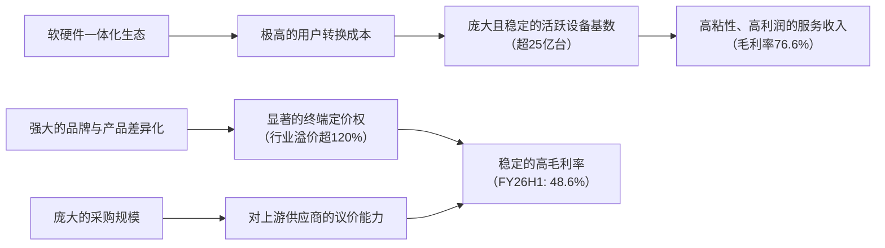

# Gangtise 公司一页通：苹果（AAPL.O）

> 拉取日期：2026-07-30 ｜ 来源：gangtise-agent `stock-one-pager`

## 公司概况

苹果公司是全球最大的消费电子企业之一，核心业务围绕**iPhone（FY2025收入占比50.4%）**、Mac、iPad、可穿戴设备及服务生态构建。公司通过自研芯片、操作系统与硬件一体化设计，在全球超25亿台活跃设备基础上，形成了“硬件引流→生态绑定→服务变现→反哺硬件粘性”的正循环。其服务业务毛利率高达75.4%，贡献集团毛利比重达42%，是利润质量的核心引擎。当前公司正处于AI功能深度集成与硬件形态创新（折叠屏）的关键周期。  

## 公司近况跟踪

- **股价与市值创新高**：公司股价于2026年7月28日盘中触及342.89美元历史新高，市值短暂突破5万亿美元，成为继英伟达后全球第二家达到此里程碑的公司。近一个月股价累计上涨近20%，市场认可其“轻资产AI”策略在宏观利率高企环境下的稳健性。  
- **推出硬件租赁计划**：苹果在美国正式推出“Apple Upgrade”设备租赁计划，iPhone月租最低17.99美元起，旨在通过降低用户单次支付门槛，在潜在的价格上涨环境中保护需求并扩大用户基数。  
- **折叠屏备货目标上调**：供应链消息称，苹果已将2026年折叠屏iPhone的生产准备目标上调至约1000万台，高于此前700-800万台的预期，显示公司对首款折叠屏产品的销量信心较强。  
- **中国区AI落地取得关键进展**：Apple Intelligence已在中国完成监管备案，确认将集成阿里巴巴通义千问模型，并由百度提供AI搜索功能支持。这为AI功能在中国这一关键市场的落地扫清了主要监管障碍。   
- **CEO交接在即**：现任CEO蒂姆·库克将于2026年9月1日卸任，由硬件工程高级副总裁约翰·特纳斯接任。即将发布的FQ3财报将是库克任内最后一次财报会议，管理层过渡期的不确定性是市场关注焦点。 

## 短期逻辑

1. **FQ3财报（7月30日盘后）的预期差博弈**：市场对苹果FQ3的预期已处于高位，一致预期营收约1088亿美元，同比增长16%。当前的核心交易机会不在于“是否超预期”，而在于**超预期的结构**。多家机构预测iPhone营收和出货量将因Pro系列需求强劲及市场份额提升而超越市场预期，但服务业务收入增速可能因App Store增长放缓而低于预期。同时，市场对FQ4毛利率指引存在较大分歧，摩根士丹利预测为46.8%，低于市场共识的47.4%，主要担忧存储芯片等组件成本上升。若财报在iPhone销量上超预期，但在服务增速或毛利率指引上出现瑕疵，可能导致股价出现“好消息出货”的波动。   

2. **9月秋季新品发布会的催化前置**：历史规律显示，苹果股价在6月至9月新品发布会前通常表现积极。本次发布会预计将推出**首款折叠屏iPhone、iPhone 18 Pro系列**，并可能伴随更大幅度的提价（分析师预期同机型换代涨幅至少200美元）。市场将提前交易“超级周期”预期。同时，**Siri AI正式版**预计随iOS 27在秋季推出，开发者社区初步反馈良好。若AI功能体验超预期，将强化市场对AI驱动换机潮的信心，构成股价上行的强劲催化剂。   

3. **“轻资产AI”叙事下的资金避风港效应**：在当前大型云厂商（CSP）因巨额AI资本开支导致自由现金流承压、股价波动的背景下，苹果的“轻资产AI”策略（AI资本开支仅占营收约2.5%）成为差异化优势。公司无需大规模自建数据中心，而是通过集成第三方模型和租赁算力实现AI功能落地，维持了强劲的现金流和盈利韧性。这吸引了从高资本开支科技股中流出的资金，将苹果视为AI板块内的“避险资产”，短期内这一轮动趋势可能延续。   

## 长期逻辑

1. **AI从“功能”到“入口”的生态价值重估**：苹果的AI战略并非开发独立的聊天机器人，而是将Apple Intelligence深度集成到操作系统层，使其成为横跨硬件、软件和服务的第三层能力。通过端侧处理与Private Cloud Compute的隐私架构，结合Siri AI对个人语境和跨应用操作的理解，AI有望从尝鲜功能演变为用户与设备交互的核心入口。这不仅能驱动超过25亿台活跃设备的换机需求，更重要的是，AI对用户数据的深度整合将极大增强生态粘性，并为服务业务（如iCloud+、App Store搜索广告）创造新的高价值变现场景，推动公司估值锚点从“硬件销量”向“高毛利服务+AI入口”迁移。  

2. **服务业务的持续高质量增长**：服务业务已成为公司利润增长的核心引擎，FY2025毛利率高达75.4%，贡献了集团42%的毛利。其增长驱动力来自多个层面：一是**用户基数的持续扩大**和**订阅渗透率的提升**（已达78%）；二是**定价权的持续显现**，公司近期已上调Apple Music、AppleCare+及iCloud+部分套餐价格；三是**广告业务的变现深化**，Apple Ads依托App Store的分发独占性，在隐私优先的生态内构筑了独特的广告护城河。尽管App Store佣金收入面临全球监管压力，但iCloud+、AppleCare+等产品相关服务的强劲增长，预计能支撑服务业务维持双位数增速，持续优化公司整体利润率。  

3. **产品形态创新与高端化战略的延续**：苹果正进入新一轮产品形态创新周期。**首款折叠屏iPhone**的推出将开辟新的超高端市场，其1000万台的备货目标显示公司对该产品线的重视。同时，公司计划对Mac产品线进行全面升级，首次引入OLED屏幕和触控功能，并加速芯片迭代（M6、M7系列），以更好地支持AI工作负载。在定价策略上，通过放大Pro系列与基础款的技术代差，持续推动产品均价上移。这种“技术创新+价格锚点”的组合策略，有助于公司在全球智能手机存量博弈中，持续获取更高价值的用户份额。   

## 风险提示

- **存储芯片等组件成本上升侵蚀毛利率**：全球存储芯片（DRAM/NAND）价格持续上涨，已迫使苹果在6月上调了Mac和iPad的售价。尽管苹果具备较强的成本转嫁能力，但若涨价抑制了需求，或成本上升速度持续快于提价幅度，公司产品毛利率将承压。管理层对FQ4的毛利率指引将是检验这一风险的关键窗口。  

- **反垄断与监管压力持续发酵**：苹果在全球范围内面临多项反垄断诉讼和监管挑战，包括美国司法部关于智能手机市场的反垄断诉讼、与Epic Games关于App Store支付政策的持续法律纠纷，以及欧盟《数字市场法案》（DMA）对应用分发和佣金模式的限制。特别是与美国司法部的潜在和解，以及谷歌搜索默认协议的未来走向，可能对公司高利润的服务收入（如Licensing和App Store佣金）构成长期威胁。  

- **CEO交接期的战略不确定性**：蒂姆·库克将于2026年9月1日卸任，新任CEO约翰·特纳斯虽在公司任职数十年，但市场对新领导层的战略方向、资本配置偏好及团队稳定性仍存疑虑。在即将发布重磅新品（折叠屏iPhone、Siri AI）的关键时刻进行CEO更替，增加了战略执行的潜在风险。  

## 近期要闻

- **2026年7月15日**：中国网信办发布公告，苹果“Apple 智能”大模型完成备案。同时，阿里巴巴确认其通义千问模型将集成至Apple Intelligence，为中国用户提供服务。   
- **2026年7月15日**：供应链消息称，苹果已将2026年折叠屏iPhone的生产准备目标上调至约1000万台。  
- **2026年7月28日**：苹果股价盘中创下342.89美元历史新高，市值短暂突破5万亿美元，成为全球第二家达到此里程碑的上市公司。  
- **2026年7月28日**：苹果在美国正式推出“Apple Upgrade”设备租赁计划，由Klarna提供支持，iPhone月租最低17.99美元起。  

## 未来催化

- **2026年7月30日**：苹果发布2026财年第三季度（FQ3）财报。市场将重点关注iPhone销量、服务业务增速以及管理层对FQ4的毛利率指引。  
- **2026年9月**：预计举行秋季新品发布会，将推出首款折叠屏iPhone、iPhone 18 Pro/Pro Max系列，并可能发布搭载M6芯片的新款MacBook Pro和iMac。Siri AI正式版预计随iOS 27同期推出。   
- **2026年9月1日**：蒂姆·库克卸任CEO，约翰·特纳斯正式接任。管理层交接的平稳过渡及新任CEO的战略沟通将成为市场关注焦点。 

## 公司业务模式及拆分

**盈利模式**：苹果的盈利模式已从单一硬件销售，演变为“硬件引流+生态锁定+服务变现”的一体化模式。硬件端通过技术创新和品牌溢价获取高额利润，并以此扩大活跃设备基数；服务端则依托庞大的用户群体，通过App Store佣金、授权收入、广告、订阅服务和云存储等实现高利润率、高粘性的持续性收入。这种模式的核心在于其软硬件一体的封闭生态，使得用户转换成本极高，从而为公司带来稳定且高质量的现金流。 

**业务拆分**：
公司业务主要按产品与服务两大类别进行披露。产品业务是收入基石，其中iPhone占据半壁江山；服务业务则是利润增长的核心引擎，增速和利润率均显著高于产品业务。当前公司正处于AI技术集成与产品形态创新（折叠屏）驱动的新一轮硬件换机周期早期，同时服务业务持续受益于用户基数扩大和订阅渗透率提升。 

**细分业务拆分（单位：亿美元）**

| 项目 | FY2023 | FY2024 | FY2025 | FY2026 H1 |
|---|---|---|---|---|
| **截止日期** | 2023-09-30 | 2024-09-28 | 2025-09-27 | 2026-03-28 |
| **iPhone** | | | | |
| 收入 | 2005.83 | 2011.83 | 2095.86 | 1422.63 |
| 同比 | - | 0.30% | 4.18% | 22.67% |
| 收入占比 | 52.34% | 51.45% | 50.36% | 55.80% |
| **Mac** | | | | |
| 收入 | 293.57 | 299.84 | 337.08 | 167.85 |
| 同比 | - | 2.14% | 12.42% | -0.89% |
| 收入占比 | 7.66% | 7.67% | 8.10% | 6.58% |
| **iPad** | | | | |
| 收入 | 283.00 | 266.94 | 280.23 | 155.09 |
| 同比 | - | -5.68% | 4.98% | 7.03% |
| 收入占比 | 7.38% | 6.83% | 6.73% | 6.08% |
| **可穿戴设备、家居及配件** | | | | |
| 收入 | 398.45 | 370.05 | 356.86 | 193.94 |
| 同比 | - | -7.13% | -3.56% | 0.65% |
| 收入占比 | 10.40% | 9.46% | 8.57% | 7.61% |
| **服务** | | | | |
| 收入 | 852.00 | 961.69 | 1091.58 | 609.89 |
| 同比 | - | 12.87% | 13.51% | 15.11% |
| 收入占比 | 22.23% | 24.59% | 26.23% | 23.92% |
| **产品毛利率** | 36.5% | 37.2% | 36.8% | 39.9% |
| **服务毛利率** | 70.8% | 73.9% | 75.4% | 76.6% |
| **总营收** | 3832.85 | 3910.35 | 4161.61 | 2549.40 |

**iPhone**：FY2026上半年营收1422.63亿美元，同比增长22.7%，是公司收入增长的主要驱动力。增长主要得益于iPhone 17系列，特别是Pro/Pro Max等高端机型的强劲需求，以及在全球智能手机市场（尤其是中国）的份额提升。尽管存储芯片等组件成本上升，但通过产品提价和高端化组合，产品毛利率在FY2026上半年提升至39.9%。  

**服务**：FY2026上半年营收609.89亿美元，同比增长15.1%，毛利率高达76.6%。增长主要由广告、App Store和云服务驱动。尽管App Store增速因部分地区佣金率调整和竞争而放缓，但iCloud+、AppleCare+等高粘性订阅服务的强劲表现弥补了这一影响。服务业务是公司利润率高且可预测性强的优质收入来源。  

**Mac**：FY2026上半年营收167.85亿美元，同比微降0.9%。增长受到今年3月发布的M5芯片MacBook Pro/Air及新款MacBook Neo的推动，但同时也面临因存储芯片短缺和成本上升导致的供应限制和产品提价影响。  

**iPad**：FY2026上半年营收155.09亿美元，同比增长7.0%。增长主要受益于M4 iPad Air等新品发布。与Mac产品线类似，iPad也面临成本压力，公司已上调产品售价以保护利润率。  

## 核心竞争力

**竞争要素 1：基于软硬件一体化生态的极高转换成本**
- **护城河定性**：**结构性护城河**。苹果通过自研芯片、操作系统（iOS/macOS）以及iCloud、App Store等服务的深度整合，构建了一个封闭但体验无缝的生态系统。用户一旦拥有多款苹果设备，其数据、应用和操作习惯便与生态深度绑定，迁移至安卓或Windows平台的成本极高。 
- **数据验证**：FY2025服务业务毛利率高达**75.4%**，FY2026上半年进一步提升至**76.6%**，远超产品业务（39.9%），这表明用户为获取生态内服务愿意支付高额溢价，且该部分收入具有极强的经常性特征。公司活跃设备安装基数已突破**25亿台**，创历史新高，为生态粘性提供了庞大的用户基础。  
- **动态演变**：**护城河变宽**。随着Apple Intelligence的推出，AI将更深入地理解用户在设备上的个人语境和跨应用数据，使得生态体验更加个性化和智能化。这种数据层面的深度整合将进一步拉大与竞争对手的体验差距，使用户的转换成本从“硬件+数据”升级为“硬件+数据+个人AI”，从而加固护城河。 

**竞争要素 2：依托品牌溢价和定价权的产业链话语权**
- **护城河定性**：**结构性护城河**。苹果凭借其强大的品牌力和产品差异化，在消费者端拥有显著的定价权，能够维持远高于行业平均水平的售价。同时，其庞大的采购规模和独特的供应链管理模式，使其对上游供应商具备强大的议价能力。 
- **数据验证**：2025年iPhone平均售价（ASP）达**898美元**，同比增长4.8%，维持了**120%以上**的行业溢价水平。在面对全球存储芯片涨价的行业压力时，苹果是唯一一家未在二季度对智能手机提价的主要OEM，并已率先对Mac和iPad产品线进行提价以转嫁成本，显示出其对终端市场的定价主导权。FY2025年公司毛利率为**46.9%**，FY2026上半年进一步提升至**48.6%**，在成本压力下依然实现了利润率扩张。 
- **动态演变**：**维持**。虽然苹果的定价权依然强大，但未来iPhone 18系列可能高达200美元的同机型换代涨幅，将考验消费者的价格承受上限。若提价对销量产生较大负面影响，则表明其定价权边际减弱。不过，公司推出的设备租赁计划可在一定程度上对冲此风险。 

**现阶段核心驱动力总结**：公司的Alpha在于其独特的“轻资产AI”策略和强大的资本回报纪律，在行业普遍陷入AI军备竞赛时，其稳健的现金流和盈利能力成为稀缺的避险属性。Beta则在于全球AI换机周期的启动，以及公司在高端智能手机市场的份额扩张。两者叠加，使苹果在当前市场环境下具备了较强的相对收益潜力。 

**竞争格局传导逻辑图**：

## 产销链

- **客户情况**：苹果的客户主要为全球消费者，结构高度分散，不存在对单一客户的依赖风险。其产品通过自营零售店、在线商店及第三方经销商（如电信运营商）销售。FY2025财报显示，其直接和间接分销渠道分别占总净销售额的**40%和60%**。在应收账款方面，截至2026年3月28日，有一家客户占贸易应收账款总额的**17%**，第三方蜂窝网络运营商合计占**30%**，集中度在可控范围内。  

- **供应商情况**：苹果采用外包生产模式，其产品主要由位于中国大陆、印度、日本、韩国、台湾和越南等地的合作伙伴制造。公司对核心零部件有较强的控制力，经常通过直接采购关键组件（如芯片、屏幕）再出售给代工厂的方式进行生产。截至2026年3月28日，其制造采购承诺总额为**446亿美元**，其中**439亿美元**需在12个月内支付，显示出其与供应商的深度绑定。公司有两家供应商分别占其供应商非贸易应收款的**51%和18%**，表明上游存在一定的集中度风险。当前全球存储芯片等关键组件的供应紧张和价格上涨，是公司成本端面临的主要挑战。  

- **成本传导能力**：当上游原材料（如存储芯片）涨价时，苹果具备较强的成本转嫁能力。公司已在6月上调了Mac和iPad的售价，并预计将对即将发布的iPhone 18系列进行更大幅度的提价。这主要得益于其强大的品牌溢价和消费者忠诚度，使其赚取的是“品牌溢价+生态锁定”的钱，而非单纯的“加工费”，因此能有效保护其利润率。  

## 财务数据

**关键财务数据（单位：亿美元）**

| 项目 | FY2023 | FY2024 | FY2025 | FY2026 H1 |
|---|---|---|---|---|
| **截止日期** | 2023-09-30 | 2024-09-28 | 2025-09-27 | 2026-03-28 |
| 营业总收入 | 3832.85 | 3910.35 | 4161.61 | 2549.40 |
| 收入同比 | -2.80% | 2.02% | 6.43% | 16.06% |
| 营业成本 | 2141.37 | 2103.52 | 2209.60 | 1309.28 |
| 毛利率 | 44.13% | 46.21% | 46.91% | 48.64% |
| 研发费用 | 299.15 | 313.70 | 345.50 | 223.06 |
| 销售及管理费用 | 249.32 | 260.97 | 276.01 | 149.69 |
| 营业利润 | 1143.01 | 1232.16 | 1330.50 | 867.37 |
| 营业利润率 | 29.82% | 31.51% | 31.97% | 34.02% |
| 归母净利润 | 969.95 | 937.36 | 1120.10 | 716.75 |
| 归母净利同比 | -2.81% | -3.36% | 19.50% | 17.29% |
| 净利率 | 25.31% | 23.97% | 26.91% | 28.11% |
| 稀释每股收益（美元） | 6.13 | 6.08 | 7.46 | 4.85 |
| 经营活动现金流净额 | 1105.43 | 1182.54 | 1114.82 | 826.27 |
| 资本性支出 | -109.59 | -94.47 | -127.15 | -43.44 |
| 自由现金流 | 995.84 | 1088.07 | 987.67 | 782.83 |

**财务分析**：
- **成长能力**：公司收入在FY2025重回增长轨道后，于FY2026上半年加速至**16.06%**，主要由iPhone的强劲需求驱动（收入同比增长22.7%）。归母净利润增速与收入增速基本匹配，显示出健康的增长质量。  
- **盈利能力**：公司毛利率和净利率均呈现持续改善趋势。FY2026上半年毛利率达到**48.64%**，同比提升1.6个百分点，主要得益于产品组合向高端化倾斜及服务业务占比的提升。服务业务毛利率高达**76.6%**，其对利润的贡献持续扩大，是公司盈利能力提升的核心驱动力。营业利润率亦提升至**34.02%**，体现了良好的经营杠杆效应。  
- **现金流与股东回报**：公司是典型的“现金牛”企业，FY2026上半年经营活动现金流净额高达**826.27亿美元**，自由现金流为**782.83亿美元**。公司持续通过大规模股票回购和分红回馈股东，FY2026上半年用于回购和分红的现金支出分别为**369.89亿美元**和**77.43亿美元**。FY2025财年全年资本开支仅**127.15亿美元**，占营收比重极低，这是其与谷歌、微软等重资产投入AI基建的科技巨头最显著的财务特征差异。  

## 行业及竞争分析

苹果的业务横跨智能手机、个人电脑、平板电脑、可穿戴设备和数字服务等多个市场。其核心竞争领域是**全球高端智能手机市场**。 

- **智能手机行业**：全球智能手机市场已进入存量替换阶段，增速放缓。据IDC数据，2026年第二季度全球智能手机出货量同比下降**11%**，主要受存储芯片短缺和价格上涨影响。在此背景下，**高端化**和**AI集成**成为核心结构性趋势。苹果是此趋势的主要受益者，其市场份额在CQ2‘26提升至**20%**（去年同期为17%），是唯一未对智能手机提价的主要OEM，从而实现了显著的份额增长。在中国市场，苹果二季度出货量同比增长**24%**，市场份额达到**18%**，排名第二。 

- **服务市场**：苹果的服务业务涵盖App Store、广告、云服务、支付、音乐/视频流媒体等多个高增长领域。其核心优势在于超过25亿的活跃设备安装基数，为服务业务提供了几乎零成本的用户触达和变现渠道。App Store和广告业务受益于生态的独占性，而iCloud+、Apple Music等订阅服务则受益于用户粘性和近期提价。尽管面临全球监管机构对App Store佣金模式的压力，但服务业务的多元化和高利润率特性使其成为公司未来增长和估值扩张的关键。 

**可比公司**：

| 公司名称 | 股票代码 | 对标维度 | 分析 |
|---|---|---|---|
| 微软 | MSFT | 平台生态、AI变现能力 | 同为平台型科技巨头，但微软的AI策略是重资产投入（如对OpenAI的投资和Azure云基建），而苹果是轻资产集成。微软面临AI投入的现金流回报压力，而苹果则无此担忧。 |
| 谷歌 | GOOG | 平台生态、AI变现能力 | 安卓生态的直接竞争对手。谷歌的AI策略同样重资产，且其搜索广告业务面临AI聊天机器人带来的潜在颠覆风险。苹果通过默认搜索协议从谷歌获取高利润的授权收入，但该协议面临反垄断裁决的不确定性。 |
| 三星电子 | - | 消费电子、智能手机 | 全球最大的智能手机制造商，是苹果在硬件领域最直接的竞争对手。三星拥有完整的硬件供应链，但在软件生态和服务变现能力上弱于苹果。当前同样面临存储芯片成本压力。 |

**总结分析**：与可比公司相比，苹果的差异化优势在于其软硬件一体化的封闭生态和“轻资产”的AI策略。当微软、谷歌等竞争对手在AI基础设施上投入数千亿美元，导致自由现金流承压、股价波动时，苹果凭借其强大的品牌和生态，以极低的资本开支实现了AI功能的集成和变现，维持了强劲的盈利能力和现金流。这使得苹果在当前市场环境下，具备了独特的“避险”属性和估值溢价。 

## 市场焦点议题

- **议题1：毛利率能否抵御存储芯片涨价的冲击？**
  - **背景**：全球DRAM和NAND价格自2025年下半年以来持续上涨，已迫使苹果在6月上调了Mac和iPad的售价。市场担忧成本上升会侵蚀苹果高企的利润率。 
  - **问题列表**：
    - FQ3（6月季度）的毛利率（指引47.5%-48.5%）是否达到预期上限？产品毛利率的环比变化趋势如何？
    - 管理层对FQ4（9月季度）的毛利率指引是多少？是否低于当前市场共识的47.4%？
    - 公司计划如何通过提价、产品组合优化或供应链谈判来对冲未来的成本压力？iPhone 18系列的提价幅度能否完全覆盖成本上涨？

- **议题2：服务业务增速是否会持续放缓？**
  - **背景**：服务业务是苹果估值溢价的核心支撑。然而，App Store收入增速因部分地区佣金率调整（如中国降至25%/12%）、第三方支付竞争以及宏观经济影响而放缓。市场关注其他服务业务能否弥补这一缺口。  
  - **问题列表**：
    - FQ3服务业务总收入增速是多少？是否低于管理层“与FQ2增速一致（剔除汇率影响）”的隐含指引？
    - App Store收入的同比增速是否进一步下滑？iCloud+、AppleCare+等订阅服务的增长势头如何？
    - 谷歌搜索默认协议面临的反垄断风险，对未来的授权收入（Licensing）有何潜在影响？

- **议题3：AI换机周期的真实性与可持续性？**
  - **背景**：iPhone 17系列的热销被视为AI驱动换机潮的开端。但市场需要更多证据来判断这是结构性趋势还是短期脉冲。 
  - **问题列表**：
    - 管理层如何评价Apple Intelligence对iPhone 17系列销售的拉动作用？是Pro系列用户升级，还是吸引了更多安卓转换者或老用户？
    - 即将推出的Siri AI和折叠屏iPhone，能否将换机周期延续至下一年？中国市场AI功能的落地时间表如何？
    - 在iPhone 18系列可能大幅提价的背景下，管理层对下一财年的需求展望如何？

## 市场分歧探讨

**核心分歧：当前股价的强势上涨，是“轻资产AI”叙事下的结构性价值重估，还是资金从高资本开支科技股轮动避险的短期行为？**

- **乐观方观点（结构性重估）**：
  - **逻辑**：市场正在奖励“资本纪律”。在利率高企、AI投入回报不确定的环境下，苹果不参与“烧钱竞赛”，凭借其强大的生态和用户基础，以低成本方式集成AI功能，维持了行业领先的盈利能力和现金流。这是一种更可持续、风险更低的AI变现路径。  
  - **支撑依据**：苹果股价年内涨幅显著跑赢其他“七巨头”，市值一度突破5万亿美元并重夺全球第一。其FY2025年资本开支仅127亿美元，而同期自由现金流高达988亿美元，与谷歌、微软等动辄千亿美元的年度AI资本开支形成鲜明对比。服务业务75%以上的毛利率和双位数增长，为公司提供了稳定的利润基石。  

- **谨慎方观点（短期轮动避险）**：
  - **逻辑**：苹果股价的优异表现，更多是资金从超买的AI基础设施板块（如英伟达、谷歌）流出后，在科技板块内部寻找“避风港”的结果。其自身的基本面并非完美无瑕，同样面临成本上升、需求弹性和监管风险。 
  - **支撑依据**：苹果同样受到存储芯片涨价影响，已开始对产品提价，这可能抑制需求。FQ3服务业务增速可能低于预期，App Store增长放缓是结构性而非周期性问题。当前股价对应约32-35倍远期市盈率，处于历史高位，已充分反映了乐观预期。一旦AI基建板块回暖或苹果自身业绩出现瑕疵，资金可能迅速流出。  

**总结分析**：两种逻辑均有其合理性。苹果的财务纪律和生态优势是客观存在的长期价值，但短期内股价的快速上涨确实包含了市场风格轮动的β收益。FQ3财报将是检验两种逻辑的关键节点。如果苹果能在服务增速和毛利率指引上均交出满意答卷，将强化“结构性重估”的逻辑；反之，若出现瑕疵，则可能证实“短期避险”的判断，股价面临回调压力。 

## 盈利预测与估值

**管理层最新指引**：
- **FQ3（6月季度）**：预计总收入同比增长14%至17%。服务收入增速预计与FQ2剔除汇率影响后的增速（约13%）持平。毛利率预计在47.5%至48.5%之间。  

**券商盈利预测与估值**：

| 机构 | 评级 | 目标价(美元) | 财务指标 | FY2025A | FY2026E | FY2027E | FY2028E |
|---|---|---|---|---|---|---|---|
| 高盛 (2026-07-27) | 买入 | 370 | 营收(亿美元) | 4161.61 | - | - | - |
| | | | 稀释EPS(美元) | 7.46 | - | - | - |
| 摩根士丹利 (2026-07-27) | 增持 | 364 | 营收(亿美元) | 4161.61 | - | 5630.00 | - |
| | | | 稀释EPS(美元) | 7.46 | 8.86 | 10.39 | - |
| 瑞银 (2026-07-28) | 中性 | 296 | 营收(亿美元) | 4161.61 | 4767.45 | 5096.30 | 5400.02 |
| | | | 稀释EPS(美元) | 7.46 | 8.72 | 9.57 | 10.52 |
| 财通证券 (2026-07-19) | 增持 | - | 营收(亿美元) | 4161.61 | 4682.36 | 5013.78 | 5340.58 |
| | | | 稀释EPS(美元) | 7.46 | 8.58 | 9.49 | 10.36 |

**盈利预测与估值分析**：机构间对苹果的评级和观点存在分歧。乐观方（高盛、摩根士丹利）基于iPhone强劲需求、AI驱动换机周期和提价逻辑，给出了较高的目标价和估值倍数（35-37倍FY27 P/E）。谨慎方（瑞银）则担忧存储成本对毛利率的挤压、服务增速放缓以及高估值下的潜在风险，给予中性评级和较低的目标价（30倍CY27 P/E）。整体来看，市场对FY2026-FY2027年的营收和盈利增长预期较为一致，核心分歧在于估值倍数的合理性，即市场愿意为苹果的“轻资产AI”叙事和盈利稳定性支付多高的溢价。
