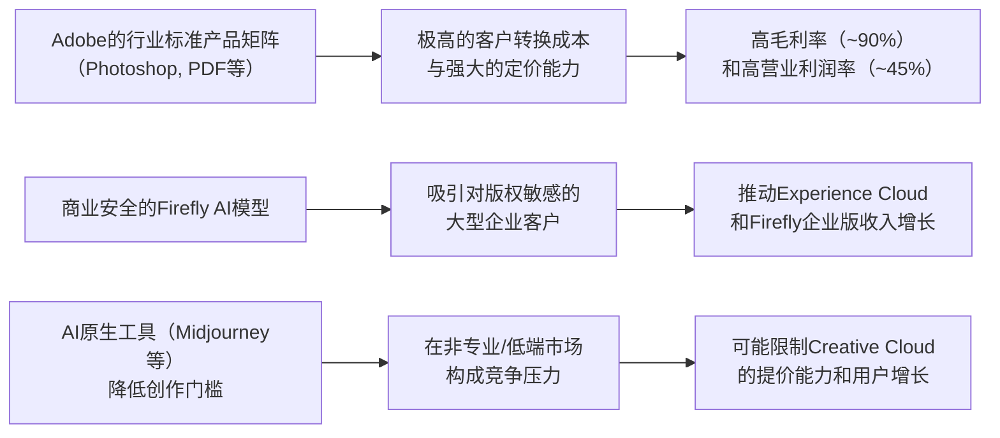

<!-- 匹配到的证券/行业：奥多比(ADBE.O) -->
操作成功

### 一页通 （奥多比 (ADBE.O)）
日期：2026-08-06
内容："""
## 公司概况

奥多比（Adobe）是全球领先的创意、营销和文档管理软件公司，其核心产品如Photoshop、Illustrator、Acrobat和PDF标准已成为各自领域的行业基础设施。公司通过Creative Cloud、Document Cloud和Experience Cloud三大产品云，服务于从个人创作者、商业专业人士到大型企业的广泛客户群体。奥多比的商业模式已成功从一次性软件授权转型为订阅制，构建了高度可预测和稳定的收入流。在生成式AI时代，公司正通过将AI功能深度整合进现有产品及推出Firefly等AI原生应用，力图将技术变革转化为增长动力。 

## 公司近况跟踪

-   <strong>战略转向Freemium模式</strong>：在2026财年第二季度，管理层宣布了一项重大的市场策略调整，即通过<strong>Freemium（免费增值）模式</strong>更积极地获取新用户，提供无摩擦、无即时付费墙的入门体验。此举旨在抓住AI带来的用户流量激增机遇，但同时也决定<strong>推迟原计划于下半年进行的Creative Cloud价格优化</strong>。管理层预计，此战略转变将<strong>降低下半年来自个人订阅用户的ARR增长预期</strong> *(2026年6月纪要)*。 

-   <strong>管理层重大变动</strong>：公司正经历关键领导层过渡。长期担任CEO的Shantanu Narayen宣布将转任董事会主席，CEO搜寻工作正在进行中。同时，CFO Dan Durn也已离职，由资深财务高管Steve Day担任临时CFO *(2026年6月纪要)*。 

-   <strong>完成对Semrush的收购</strong>：公司于2026年4月完成了对品牌可见性平台<strong>Semrush</strong>的收购，交易对价约<strong>18.7亿美元</strong>，为业务增加了约<strong>4.8亿美元</strong>的ARR。此举旨在增强公司在搜索引擎优化（SEO）和生成式引擎优化（GEO）领域的能力，并计划推出全面的品牌可见性解决方案 *(2026年6月纪要)*。 

-   <strong>AI产品货币化取得初步进展</strong>：截至2026财年第二季度，AI优先产品（如Firefly、Acrobat AI Assistant等）的ARR同比增长超过<strong>3倍</strong>，总额超过<strong>5亿美元</strong>，但仍仅占总ARR（271亿美元）的不到2%。其中，Firefly的期末ARR接近<strong>3亿美元</strong>，环比增长约50% *(2026年6月纪要)*。 

-   <strong>宣布收购Topaz Labs</strong>：2026年6月，公司宣布收购AI视频和图像增强技术公司Topaz Labs，旨在加强其在视频AI领域的能力，并获取顶尖的AI工程师团队 *(2026年6月德意志银行报告)*。 

## 短期逻辑

1.  <strong>Freemium策略的预期差博弈</strong>：市场对Adobe转向Freemium模式普遍持负面看法，认为这会压制短期ARR增长并增加不确定性。然而，管理层明确指出，此举是为了抓住AI带来的<strong>35%的网站流量同比增长</strong>和<strong>超过9000万的创意Freemium月活用户</strong>。核心博弈点在于，市场可能过度关注短期ARR的减速，而低估了此策略在扩大用户基数、构建长期竞争壁垒方面的价值。未来一个季度，若公司能披露更强劲的MAU增长和付费转化率数据，可能引发市场对公司长期增长前景的重新评估，从而修复估值。 

2.  <strong>管理层落定消除不确定性折价</strong>：CEO和CFO的同时空缺是当前压制估值的一个重要短期因素。市场对领导层真空的担忧已反映在股价中。一旦新的CEO和CFO人选尘埃落定，尤其是如果新任领导者具备深厚的AI或企业服务背景，将有望消除市场对战略连续性和执行力的疑虑，触发一波由不确定性消除带来的估值修复行情。 

3.  <strong>Q3业绩验证增长韧性</strong>：公司给出的Q3营收指引为<strong>66.7亿至67.2亿美元</strong>，同比增长约12%。在经历了战略调整和管理层变动的冲击后，一份稳健的财报将成为验证公司业务基本盘和增长韧性的关键。若Q3业绩能超出或达到指引上限，特别是订阅收入和RPO等先行指标表现强劲，将有力回击市场的悲观预期，证明公司核心业务的护城河依然稳固。 

## 长期逻辑

1.  <strong>从“工具”到“平台”的AI生态整合者</strong>：Adobe的长期叙事正从销售创意工具，转向成为连接创意、营销和客户体验的<strong>AI平台</strong>。公司通过将Firefly模型、第三方模型以及创意代理（Creative Agent）等能力，整合进Creative Cloud和Experience Cloud，并进一步通过MCP端点将功能“原子化”，嵌入到ChatGPT、Claude等第三方AI平台。这种“模型+应用+代理”的平台化战略，旨在使Adobe成为AI驱动的内容供应链的核心，其长期价值将远超单一软件提供商。 

2.  <strong>企业级AI应用的巨大变现潜力</strong>：虽然AI优先产品的ARR目前规模尚小，但其在企业市场的渗透速度值得关注。<strong>GenStudio</strong>、<strong>AEP及原生应用</strong>的订阅收入同比增长均超过<strong>30%</strong>，<strong>Firefly企业版</strong>的资产生成量同比增长超3倍。超过<strong>80%</strong> 的AEP和AEM客户正在使用产品内置的代理能力。这表明Adobe在企业级AI市场已找到产品-市场契合点。随着企业从“AI实验”转向“AI执行”，基于消费和结果的定价模式（如Firefly Services）有望打开远超传统订阅模式的价值空间，成为公司未来3-5年的核心增长引擎。  

3.  <strong>无可替代的“商业安全”护城河</strong>：在生成式AI领域，版权和商业安全是企业用户的首要关切。Adobe的<strong>Firefly模型专门针对已获授权和公共领域内容进行训练</strong>，并提供知识产权赔偿保障，这是Midjourney、Stable Diffusion等竞品难以复制的核心优势。对于可口可乐、迪士尼等大型品牌而言，这一特性是决定性的。随着AI生成内容在商业场景中的大规模应用，Adobe的“商业安全”标签将成为其最坚固的护城河，保障其在企业市场的长期定价权和客户粘性。 

## 风险提示

-   <strong>AI颠覆风险与竞争加剧</strong>：这是公司面临的最核心、最长期的挑战。以Midjourney、Canva、OpenAI等为代表的AI原生工具和平台，正在降低内容创作的门槛，可能侵蚀Adobe在创意软件市场的份额。尤其是在低端和非专业用户市场，“足够好”的AI生成内容可能替代对专业付费工具的需求，从而对Adobe的定价能力和用户增长构成长期压力。  

-   <strong>Freemium模式转型的执行风险</strong>：从付费墙模式转向Freemium模式是一次重大的战略赌博。虽然长期看可以扩大用户基础，但短期内有两大风险：一是<strong>免费用户向付费用户的转化率可能不及预期</strong>，导致ARR增长持续承压；二是<strong>Freemium产品可能蚕食现有的付费Creative Cloud需求</strong>，造成“左右手互搏”的局面，反而损害公司高利润的核心业务。 

-   <strong>管理层过渡期的战略不确定性</strong>：CEO和CFO的双双更迭，发生在公司进行重大战略转型的关键时期，增加了额外的执行风险。新任领导层可能需要时间来熟悉业务并制定自己的战略，这可能导致公司在应对激烈的市场竞争时出现决策迟缓或方向摇摆，从而影响业务发展和投资者信心。 

## 近期要闻

-   <strong>2026年4月</strong>：Adobe在年度峰会上展示了其企业级AI战略，推出了<strong>Adobe CX Enterprise</strong>（端到端的代理式AI系统）和<strong>CX Enterprise Co-Worker</strong>等新产品，并宣布与Microsoft、Anthropic、Nvidia等主要AI平台的原生集成。 
-   <strong>2026年4月28日</strong>：Adobe完成了对品牌可见性平台<strong>Semrush</strong>的收购，交易价值约18.7亿美元。 
-   <strong>2026年6月11日</strong>：Adobe公布2026财年第二季度财报，营收同比增长13%，同时宣布了Freemium战略转型和推迟Creative Cloud价格优化的决定，并披露了CFO离职的消息。 
-   <strong>2026年6月25日</strong>：Adobe宣布收购AI视频和图像增强技术公司<strong>Topaz Labs</strong>，以增强其在专业视频AI领域的能力。 

## 未来催化

-   <strong>2026年8月-9月</strong>：新任CEO人选的可能公布。CEO搜寻工作的完成将是消除市场不确定性的最重要催化剂。 
-   <strong>2026年9月</strong>：Adobe 2026财年第三季度财报发布。市场将高度关注Freemium模式下的MAU增长、付费转化率以及整体ARR增长数据，以验证新战略的初步成效。 
-   <strong>2026年10月</strong>：Adobe Max大会。作为年度最重要的产品发布活动，公司预计将发布Firefly模型、Creative Cloud及AI代理方面的重大更新，可能成为展示其AI技术领先性和未来愿景的关键窗口。 

## 公司业务模式及拆分

<strong>业务边际变化</strong>：Adobe正经历从传统创意软件商向AI驱动的内容供应链平台的战略转型。核心变化在于：1）<strong>商业模式</strong>上，从单一的订阅制转向“订阅+消费（Generative Credits）+结果导向”的混合模式；2）<strong>市场策略</strong>上，从付费墙模式转向更激进的Freemium模式以获取AI时代的海量新用户；3）<strong>产品形态</strong>上，从独立应用转向将核心功能“原子化”为API和代理，嵌入到第三方AI平台（如ChatGPT）中。 

<strong>盈利模式</strong>：公司主要依靠<strong>订阅收入</strong>盈利，占总营收的<strong>97%</strong>。其盈利模式的核心是<strong>技术壁垒和极高的客户转换成本</strong>。Adobe的旗舰产品如Photoshop和PDF已成为行业标准，深度嵌入全球创意和商业工作者的日常工作流中。近期，公司开始通过<strong>生成式积分（Generative Credits）</strong> 对AI功能进行消费制收费，并探索基于业务成果的定价模式，旨在从AI带来的效率提升中分得一部分价值。  

<strong>业务拆分</strong>：
公司自2026财年第一季度起，将原先的三大业务板块（Digital Media、Digital Experience、Publishing and Advertising）合并为单一运营部门，并改为按客户群体披露订阅收入。公司目前处于<strong>AI战略投入期和Freemium模式转型期</strong>，短期ARR增长承压，但意在换取长期的用户基础和平台生态扩张。  

<strong>细分业务拆分（按客户群体）</strong>

| 客户群体 | FY2024 | FY2025 | FY2026 H1 | FY2026 H1 收入占比 | FY2026 H1 同比 |
| :--- | :--- | :--- | :--- | :--- | :--- |
| <strong>截止日期</strong> | 2024-11-29 | 2025-11-28 | 2026-05-29 | | |
| <strong>单位</strong> | 亿美元 | 亿美元 | 亿美元 | % | % |
| Creative & Marketing Professionals | 147.50 | 163.12 | 89.30 | 71% | 12.4% |
| Business Professionals & Consumers | 56.70 | 65.04 | 36.30 | 29% | 16.0% |
| <strong>客户群体订阅总收入</strong> | <strong>204.20</strong> | <strong>228.16</strong> | <strong>125.60</strong> | <strong>100%</strong> | <strong>13.4%</strong> |

*注：公司自FY2026起不再按Digital Media/Digital Experience披露订阅收入，改为按上述客户群体披露。历史数据已按新口径重述。*

*   <strong>Creative & Marketing Professionals（创意与营销专业人士）</strong>：该群体是公司最大的收入来源，FY2026 H1收入占比<strong>71%</strong>。它包括面向创意专业人士的Creative Cloud旗舰应用（如Photoshop、Illustrator、Premiere Pro）和面向营销专业人士的Digital Experience解决方案（如AEP、GenStudio）。FY2026 H1收入同比增长<strong>12.4%</strong>，增长由Creative Cloud Pro、AEP及原生应用的强劲表现驱动。该群体是公司AI变现的核心阵地，Firefly企业版和GenStudio等AI优先产品均主要服务于该群体。  

*   <strong>Business Professionals & Consumers（商业专业人士与消费者）</strong>：该群体是公司增长最快的部分，FY2026 H1收入同比增长<strong>16.0%</strong>，收入占比<strong>29%</strong>。它包括Acrobat产品线（含AI Assistant）和Adobe Express。增长主要得益于Acrobat订阅和Express MAU的强劲增长，以及AI助手等附加功能带来的ARPU提升。该群体是Freemium战略的主要试验田，通过Acrobat Reader和Express的免费版获取海量用户，再向付费订阅转化。  

## 核心竞争力

<strong>竞争要素 1：依托极高转换成本与行业标准地位构筑的客户粘性</strong>

*   <strong>护城河定性</strong>：这构成了Adobe的<strong>结构性护城河</strong>。其核心产品如Photoshop的PSD格式和Acrobat的PDF格式，已成为各自领域的全球性行业标准。全球创意工作者、营销机构和印刷出版行业数十年来围绕Adobe工具链建立了技能、工作流程和文件生态。替换这些工具意味着不仅要学习新软件，还要改变整个协作网络的文件交互方式，转换成本极高。 
*   <strong>数据验证</strong>：Adobe的订阅收入占总营收的<strong>97%</strong>，FY2025毛利率高达<strong>89.3%</strong>，FY2025 Non-GAAP营业利润率高达<strong>46.2%</strong>，这些顶尖的财务指标是其客户粘性和定价权的直接体现。公司服务着全球绝大多数顶级企业，其Experience Cloud服务于<strong>74%的财富500强</strong>和<strong>87%的财富100强</strong>公司。  
*   <strong>动态演变</strong>：<strong>维持</strong>。在AI时代，虽然生成式AI工具降低了内容创作的门槛，但Adobe通过将AI功能（如Firefly）直接嵌入其旗舰应用，并引入“商业安全”的模型训练理念，强化了其在专业工作流中的中心地位。对于需要精确控制、团队协作和商业合规性的专业和企业用户，Adobe的护城河依然稳固。但在非专业和轻量级用户市场，其护城河面临被AI原生工具侵蚀的风险。 

<strong>竞争要素 2：面向企业市场的“商业安全”AI护城河</strong>

*   <strong>护城河定性</strong>：这是一个正在构建中的<strong>潜在结构性护城河</strong>。Adobe的Firefly生成式AI模型主打“商业安全”，即训练数据全部来自Adobe Stock（已获授权）和公共领域内容，并为使用其生成内容的企业客户提供知识产权赔偿保障。在版权诉讼风险极高的生成式AI领域，这一特性对大型品牌和企业客户具有决定性吸引力，是Midjourney、Stable Diffusion等竞品难以在短期内复制的。 
*   <strong>数据验证</strong>：Firefly企业版（Firefly Services）的资产生成量同比增长超<strong>3倍</strong>，已有超过<strong>2500个</strong>企业定制模型被创建。包括可口可乐、SAP、ServiceNow在内的众多全球品牌已成为其客户。这证明了“商业安全”这一价值主张正在获得市场认可。  
*   <strong>动态演变</strong>：<strong>护城河变宽（巩固）</strong>。随着全球对AI监管的加强和企业对版权风险意识的提升，Adobe的“商业安全”护城河价值将日益凸显。通过推出Firefly Foundry和Custom Models，允许企业在自己的品牌资产上训练定制化AI模型，Adobe进一步将AI能力与企业的核心知识产权深度绑定，极大地增强了客户粘性和转换成本。 

<strong>现阶段核心驱动力总结</strong>：
公司的Alpha在于其强大的<strong>品牌、行业标准地位和“商业安全”的AI战略</strong>，这使其在专业和企业级市场拥有难以撼动的护城河。其Beta则在于，作为一家成熟的软件巨头，其整体营收增长与全球数字经济和IT支出的大环境紧密相关。当前，市场对其的定价更多反映了对AI颠覆的恐惧（Beta），而低估了其利用AI巩固并扩展护城河的能力（Alpha）。 

<strong>竞争格局传导逻辑图</strong>：

## 产销链

*   <strong>客户情况</strong>：Adobe的客户群极为分散，涵盖个人消费者、自由职业者、中小企业和大型跨国企业，无单一客户依赖风险。其客户结构正从以创意专业人士为主，向商业专业人士和消费者扩展。<strong>新客户</strong>获取方面，公司正通过Freemium策略大规模吸纳新用户，创意Freemium产品的MAU已从一年前的5000万增至<strong>9000万</strong>。这些用户处于“免费使用”的早期阶段，其向付费用户的转化是未来收入增长的关键。 

*   <strong>供应商情况</strong>：Adobe的主要供应商为云基础设施服务商（如AWS、Azure）和数据中心硬件提供商。公司并无对单一供应商的严重依赖。其销售成本（COGS）中，第三方托管服务和数据中心成本是主要组成部分。随着AI功能使用量的增加，<strong>AI推理和训练成本</strong>正成为一项重要的成本项，可能对毛利率构成潜在压力。 

*   <strong>成本传导能力</strong>：Adobe赚取的是典型的<strong>“技术壁垒溢价”和“品牌溢价”</strong>。其软件产品的边际成本极低，因此拥有超过<strong>89%</strong> 的极高毛利率。当上游云服务或AI算力成本上升时，公司具备较强的能力通过产品提价或推出更高价值的功能套餐（如包含更多生成式积分的计划）将成本压力部分转嫁给下游客户，尤其是对企业客户而言。但在竞争加剧的低端市场，其成本传导能力相对较弱。 

## 财务数据

<strong>关键财务数据</strong>

| 报告期 | FY2023 | FY2024 | FY2025 | FY2026 H1 |
| :--- | :--- | :--- | :--- | :--- |
| <strong>截止日期</strong> | 2023-12-01 | 2024-11-29 | 2025-11-28 | 2026-05-29 |
| <strong>单位</strong> | 亿美元 | 亿美元 | 亿美元 | 亿美元 |
| 营业总收入 | 194.09 | 215.05 | 237.69 | 130.16 |
| 收入同比 | 10.24% | 10.80% | 10.53% | 12.33% |
| 营业成本 | 23.54 | 23.58 | 25.51 | 13.79 |
| 毛利率 | 87.87% | 89.04% | 89.27% | 89.41% |
| 营业利润 | 66.50 | 77.41 | 87.06 | 46.56 |
| 营业利润率 | 34.26% | 36.00% | 36.63% | 35.77% |
| 归母净利润 | 54.28 | 55.60 | 71.30 | 36.01 |
| 归母净利润同比 | 14.13% | 2.43% | 28.24% | 2.83% |
| 稀释每股收益(美元) | 11.82 | 12.36 | 16.70 | 8.86 |
| 经营活动现金流净额 | 73.02 | 80.56 | 100.31 | 51.23 |
| 自由现金流 | 69.42 | 78.73 | 98.52 | 50.28 |

*注：自由现金流 = 经营活动现金流净额 - 资本性支出。FY2026 H1数据为截至2026年5月29日的六个月累计数据。*

<strong>财务分析</strong>：
*   <strong>成长能力</strong>：公司营收增速稳定在<strong>10%-12%</strong> 区间，展现出成熟科技巨头在庞大营收基数下的增长韧性。FY2025归母净利润同比增长<strong>28.24%</strong>，远高于营收增速，主要得益于运营杠杆和利息收入增加。但FY2026 H1净利润增速放缓至<strong>2.83%</strong>，主要受收购相关费用和商誉减值等一次性项目影响。  

*   <strong>盈利能力</strong>：Adobe的盈利能力在软件行业中名列前茅。毛利率持续维持在<strong>89%</strong> 以上的极高水平，体现了其强大的定价权和极低的产品边际成本。营业利润率稳定在<strong>36%</strong> 左右，显示出其商业模式的规模效应和运营效率。  

*   <strong>现金流质量</strong>：公司是名副其实的“现金牛”。FY2025经营活动现金流净额高达<strong>100.31亿美元</strong>，自由现金流为<strong>98.52亿美元</strong>，远超净利润，盈利质量极高。强劲的现金流为公司的巨额股票回购和战略并购提供了坚实基础。  

## 行业及竞争分析

Adobe所处的行业是<strong>数字内容创作与管理软件市场</strong>，该市场正被生成式AI技术深刻重塑。 

*   <strong>行业趋势</strong>：AI正在引发一场“内容大爆炸”，降低了内容创作的门槛，使创作者、营销人员和普通商业用户都能更高效地生成图像、视频和文案。这极大地扩展了Adobe的潜在市场（TAM），但也引入了新的竞争维度。企业客户的需求正从单一的工具采购，转向寻求能整合内容创作、管理、分发和效果衡量的<strong>端到端内容供应链平台</strong>。 

*   <strong>竞争格局</strong>：竞争格局正变得空前复杂，Adobe面临来自不同维度的竞争者：
    *   <strong>AI原生工具</strong>：如Midjourney、Runway、Stable Diffusion等，它们在图像和视频生成领域快速迭代，对Adobe的创意云业务构成直接威胁，尤其是在个人用户和轻量级专业用户市场。 
    *   <strong>平台型公司</strong>：如Canva，通过提供更简单、协作性更强的设计平台，并积极整合AI功能，正在蚕食Adobe在非专业设计市场的份额。 
    *   <strong>科技巨头</strong>：如Google、Microsoft、OpenAI，它们拥有强大的基础AI模型，并开始将AI设计功能集成到其庞大的生态系统中。 
    *   <strong>企业级软件厂商</strong>：如Salesforce，在营销科技和客户体验管理领域与Adobe的Experience Cloud直接竞争。 

<strong>可比公司</strong>

| 公司名称 | 股票代码 | 对标维度 | 分析 |
| :--- | :--- | :--- | :--- |
| Salesforce | CRM | 企业级SaaS，客户体验管理 | 两者在企业营销和客户体验管理领域直接竞争。Salesforce的CRM生态更为庞大，而Adobe的优势在于整合了从内容创意到交付的全链条。 |
| Canva | - | 一体化设计平台，AI功能 | Canva是Adobe在非专业设计市场最强大的挑战者，以其易用性和协作性吸引了大量用户，并正通过AI和收购向专业市场渗透。 |
| Microsoft | MSFT | 科技巨头，AI模型，设计工具 | 微软通过Copilot将AI能力整合进Office全家桶，其Designer产品直接对标Adobe Express。其与OpenAI的深度绑定使其在AI模型层面具备强大竞争力。 |
| Figma | FIG | 协作式UI/UX设计工具 | Figma在UI/UX设计领域已成为行业标准，对Adobe XD构成巨大挑战。其基于浏览器的协作模式代表了设计工具的未来方向。 |

<strong>总结分析</strong>：Adobe的竞争地位正处于一个转折点。在专业创意工具领域，其护城河依然深厚，但增长天花板已现。在面向未来的AI驱动的内容供应链和企业级体验管理市场，公司已制定了清晰的战略并取得了初步成效，但面临来自AI原生公司、科技巨头和现有企业软件对手的激烈竞争。其“商业安全”的AI策略和从创意到营销的端到端整合能力是其关键的差异化优势。 

## 市场焦点议题

*   <strong>议题一：Freemium战略的长期价值与短期阵痛</strong>
    *   <strong>背景</strong>：为应对AI带来的流量红利和用户行为变化，Adobe在Q2宣布激进地转向Freemium模式，并推迟了Creative Cloud的提价计划，导致有机ARR增长指引下调。市场担忧此举会损害其核心业务的盈利能力和增长可见度。 
    *   <strong>问题列表</strong>：
        1.  Freemium用户向付费用户的转化率能否达到或超过历史水平（如Acrobat Reader）？
        2.  免费增值产品（如Express、Firefly免费版）在多大程度上会蚕食现有的付费Creative Cloud订阅？
        3.  管理层如何平衡为获取新用户而进行的投资与维持现有45%左右Non-GAAP营业利润率之间的关系？

*   <strong>议题二：AI货币化的真实速度与规模</strong>
    *   <strong>背景</strong>：尽管公司宣称AI优先产品ARR同比增长超3倍，但其绝对规模（超5亿美元）仍不到总ARR的2%。市场怀疑AI带来的增量收入能否在短期内抵消传统业务（如Stock）的下滑和潜在的竞争压力。 
    *   <strong>问题列表</strong>：
        1.  Firefly的生成式积分消费模式能否成为主流，并显著提升用户ARPU？
        2.  企业级AI解决方案（如GenStudio、Firefly Services）的销售周期和客户采纳速度如何？
        3.  AI带来的新增收入中，有多少是真正的新价值创造，又有多少是替代了Adobe Stock等传统高利润业务？

*   <strong>议题三：管理层真空下的战略执行力</strong>
    *   <strong>背景</strong>：CEO和CFO的同时空缺，发生在公司进行重大战略转型的关键时期，增加了不确定性。市场对新领导层的战略方向、资本配置优先级以及与现有团队的磨合存在疑虑。 
    *   <strong>问题列表</strong>：
        1.  新任CEO是否会延续当前的Freemium和AI平台战略，还是会进行重大调整？
        2.  在领导层过渡期间，公司如何确保关键产品的研发和市场推广计划不被延误？
        3.  新的领导团队将如何平衡大规模股票回购与对AI创新的持续高额投入？

## 市场分歧探讨

当前市场对Adobe的核心分歧在于：<strong>生成式AI对Adobe而言，究竟是颠覆性的“灭顶之灾”，还是能为其带来第二增长曲线的“历史性机遇”？</strong>

*   <strong>看空方（谨慎方）的核心逻辑</strong>：
    1.  <strong>颠覆性威胁是真实的</strong>：他们认为，Midjourney、Sora等AI原生工具在功能上正快速追赶，且成本更低、使用更便捷，将从根本上瓦解Adobe在创意软件市场的垄断地位，尤其是在对价格敏感的非专业用户群体中。 
    2.  <strong>商业模式被削弱</strong>：AI降低了内容创作的门槛，可能导致Adobe赖以生存的“按席位收费”模式受到冲击，因为企业可能用更少的专业设计师完成更多工作。Freemium模式的转向也被视为应对竞争压力的被动之举，会拉低整体ARPU和利润率。 
    3.  <strong>估值虽低但无催化剂</strong>：尽管估值已跌至历史低位，但在增长前景不明朗、管理层动荡的情况下，股票缺乏向上重估的催化剂，可能陷入“价值陷阱”。 

*   <strong>看多方（乐观方）的核心逻辑</strong>：
    1.  <strong>护城河在于工作流，而非单一功能</strong>：他们认为，Adobe的核心价值在于其深度嵌入全球企业工作流的生态系统、行业标准文件格式以及数十年积累的用户技能和习惯。AI功能（如Firefly）被整合进这个工作流，只会增强其粘性，而非取代它。 
    2.  <strong>“商业安全”是杀手锏</strong>：在企业级市场，版权合规是首要问题。Adobe的Firefly模型因其训练数据的合法性和提供的IP赔偿，是唯一能满足大型品牌严格合规要求的“商业安全”选择，这构成了一个强大的、差异化的护城河。 
    3.  <strong>AI是TAM扩张器</strong>：AI引发的“内容大爆炸”将极大地扩展Adobe的潜在市场。通过Express和Firefly等产品，Adobe可以触达之前不使用其专业工具的广大“传播者”和“商业专业人士”群体，并通过Freemium模式将其转化为付费用户，实现长期增长。 

<strong>总结分析</strong>：看空方的担忧在低端市场和个人用户领域确实存在，且已在发生。但看多方的逻辑在专业级和企业级市场更具说服力。Adobe的“商业安全”AI策略和端到端的平台整合能力，使其在高端市场拥有独特的竞争优势。当前股价的深度折价，主要反映了市场对低端市场颠覆风险的过度恐慌，而相对忽视了其在高端市场的稳固地位和AI带来的长期平台化机遇。因此，当前市场定价更倾向于对“颠覆”的定价，而非对“机遇”的定价。 

## 盈利预测与估值

<strong>管理层最新指引</strong>（2026财年）：
*   总营收：<strong>265亿至266亿美元</strong>。 
*   总ARR增长目标：<strong>10.2%</strong>（相较于财年初的256.6亿美元基础），该目标已包含Semrush的贡献，并反映了Freemium战略和推迟提价的影响。 
*   Non-GAAP每股收益：<strong>24.35至24.45美元</strong>。 
*   Non-GAAP营业利润率：约<strong>45%</strong>。 

<strong>券商盈利预测与估值</strong>

| 机构 | 评级 | 目标价(美元) | 财务指标 | FY2025A | FY2026E | FY2027E | FY2028E |
| :--- | :--- | :--- | :--- | :--- | :--- | :--- | :--- |
| 美国银行 (2026-07-08) | Underperform | 190.00 | EPS(美元) | 20.95 | 24.40 | 27.54 | 31.08 |
| | | | 营收(百万美元) | 23,769 | 26,531 | 28,857 | 31,357 |
| 摩根士丹利 (2026-07-21) | Underweight | 240.00 | EPS(美元) | 20.94 | 24.40 | 27.23 | 29.64 |
| | | | 营收(百万美元) | 23,769 | 26,555 | 28,965 | - |
| 汇丰控股 (2026-07-03) | Buy | 308.00 | EPS(美元) | 20.94 | 24.25 | 27.21 | 30.29 |
| | | | 营收(百万美元) | 23,769 | 26,518 | 28,639 | 30,644 |
| 加拿大皇家银行 (2026-06-12) | Outperform | 285.00 | EPS(美元) | 20.94 | 23.40 | 26.32 | - |
| | | | 营收(百万美元) | 23,769 | 26,000 | 28,340 | - |
| 华泰证券 (2026-03-15) | 买入 | 319.51 | EPS(美元) | 17.03 | 18.40 | 20.37 | 22.75 |
| | | | 营收(百万美元) | 23,769 | 26,049 | 28,816 | 32,173 |

*注：表中预测数据为各机构基于各自模型得出的Non-GAAP数据，华泰证券预测为GAAP口径。目标价币种为美元。*

机构间对Adobe的观点存在显著分歧。<strong>看多方</strong>（如汇丰、RBC、华泰）认为市场过度悲观，AI战略将带来长期增长，当前估值提供了极具吸引力的买入机会，给出的目标价远高于当前股价。<strong>看空方</strong>（如美银、摩根士丹利）则强调AI带来的结构性挑战，认为增长放缓的趋势难以逆转，估值虽低但缺乏催化剂，因此给予“跑输大盘”评级。这种巨大的分歧恰恰反映了当前Adobe所面临的不确定性和市场的激烈博弈。
"""
