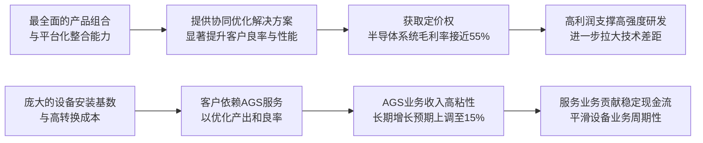

<!-- 匹配到的证券/行业：应用材料(AMAT.O) -->
操作成功

### 一页通 （应用材料 (AMAT.O)）
日期：2026-08-06
内容："""
## 公司概况

应用材料（Applied Materials, Inc.）是全球领先的半导体设备与服务供应商，专注于为客户提供材料工程解决方案。公司业务覆盖半导体芯片制造的几乎所有关键环节，包括薄膜沉积、刻蚀、过程控制、先进封装等，其产品组合的广度居行业首位。公司客户囊括全球主要半导体制造商，如台积电、三星、英特尔、SK海力士、美光等。应用材料在物理气相沉积（PVD）、导体刻蚀、化学机械抛光（CMP）及离子注入等多个细分市场占据领导地位，是半导体资本设备领域的核心标的。  

## 公司近况跟踪

- <strong>FY26Q2业绩超预期并上调全年指引</strong>：公司于2026年5月14日发布FY26Q2（截至2026年4月26日）财报，营收79.10亿美元，同比增长11.4%，创历史新高；非GAAP毛利率50.0%，为25年来最高水平；非GAAP EPS 2.86美元，同比增长19.7%。管理层将2026自然年半导体系统业务营收增长预期从此前的20%以上大幅上调至<strong>30%以上</strong>，主要驱动力为先进逻辑、DRAM及先进封装。   

- <strong>先进封装业务成为关键增长极</strong>：管理层预计2026自然年先进封装业务营收将同比增长<strong>超过50%</strong>，规模有望超过20亿美元。该业务在晶圆代工逻辑和DRAM领域均呈现加速增长态势，投资重点向3D堆叠等公司优势方向倾斜。    

- <strong>服务业务增长预期上调</strong>：AGS（应用全球服务）业务FY26Q2营收16.65亿美元，同比增长17.3%。基于不断扩大的设备安装基数和客户对高产出、高良率的追求，管理层将AGS业务的长期增长预期从“低双位数”上调至<strong>约15%</strong>，并预计2026年增速可能更高。   

- <strong>客户需求能见度空前</strong>：管理层在FY26Q2业绩说明会上表示，大客户已开始提供<strong>八个季度的滚动预测</strong>，为公司提供了前所未有的需求能见度，有助于更有效地规划供应链和产能。CEO在2026年7月的采访中进一步表示，部分客户已给出直至2030年的方向性需求展望。    

- <strong>产能扩张与供应链管理</strong>：为应对激增的需求，公司已将其系统制造产能翻倍，并持续与供应链协同，以确保上游零部件（如阀门、传感器、FPGA芯片等）的稳定供应。公司表示，当前的主要瓶颈在于供应链的响应速度。  

## 短期逻辑

1.  <strong>FY26Q3财报及Q4指引有望继续“超预期并上调”</strong>：公司将于2026年8月13日盘后发布FY26Q3财报。鉴于同业泛林（LRCX）和东京电子（TEL）均已发布强劲的季度指引，且均提及DRAM和先进逻辑需求的持续加速，市场普遍预期应用材料将同样交出强劲的业绩并上调FY26Q4指引。花旗预计公司Q3营收和EPS将分别高于市场预期3%和2%，并认为Q4指引是本次财报的关键看点。若公司能延续“Beat and Raise”的趋势，将直接催化股价。   

2.  <strong>AI驱动的WFE（晶圆制造设备）支出加速向上</strong>：2026年全球WFE支出增长预期已被多家同业和行业组织大幅上调。SEMI年中预测2026年WFE规模达1439亿美元，同比增长23.1%。应用材料管理层、KLAC、LRCX及TEL均认为2026年WFE规模将超过1500亿美元。下游客户（如英特尔）大幅上调2026年资本开支至200亿美元以上，其中绝大部分将用于设备采购，应用材料作为核心供应商将直接受益。    

3.  <strong>DRAM与HBM扩产潮的结构性受益者</strong>：AI服务器对HBM（高带宽内存）的强劲需求正驱动存储原厂进行史无前例的扩产。三星计划至2027年底将DRAM月产能翻倍至20万片，SK海力士目标在2030年前将DRAM月产能从55万片提升至100万片。应用材料在DRAM制造的关键工艺环节（如导体刻蚀、外延、CMP等）拥有领先的市场份额，是此轮DRAM资本支出扩张周期的核心受益标的之一。   

## 长期逻辑

1.  <strong>技术架构迭代驱动份额持续增长</strong>：半导体行业正经历从FinFET到GAA（全环绕栅极）、从2D到3D DRAM、以及先进封装（如混合键合、面板级封装）等重大技术架构变革。这些技术迭代显著增加了对沉积、刻蚀、过程控制等应用材料优势领域的设备需求强度。例如，GAA节点有望为公司带来多个百分点的WFE份额增长；在DRAM领域，公司份额已从2013年的不足15%提升至当前的<strong>第一大工艺设备供应商</strong>，并有望在向4F²和3D DRAM的演进中进一步扩大优势。    

2.  <strong>平台化战略与“EPIC”中心构建强大护城河</strong>：应用材料的差异化优势在于其能将PVD、CVD、ALD、刻蚀等多种工艺集成在同一平台上，为客户提供“协同优化与集成材料解决方案”，显著提升芯片良率和性能。公司正在硅谷打造全新的“EPIC”（设备与工艺创新与商业化）中心，旨在联合台积电、三星、SK海力士、美光等核心客户进行协同研发，加速下一代技术商业化。这种深度绑定和平台化能力将强化客户粘性，巩固其长期竞争优势。    

3.  <strong>服务业务提供稳定且高利润的增长引擎</strong>：AGS业务受益于公司庞大的设备安装基数，通过提供备件、服务协议和AI驱动的工厂自动化软件，创造了高粘性、可预测的经常性收入。随着设备复杂性和客户对良率、产出效率要求的提升，AGS的附加价值日益凸显。管理层已将其长期增长目标上调至约15%，该业务的持续扩张将为公司贡献稳定的利润和现金流，平滑设备业务的周期性波动。   

## 风险提示

- <strong>地缘政治与出口管制风险</strong>：公司约27%的营收来自中国，且面临美国政府对华半导体技术出口管制的持续收紧。虽然当前增长引擎（先进逻辑、HBM）主要在非中国地区，但若管制范围扩大至更成熟制程或对特定中国客户实施更广泛的限制，仍可能对公司营收造成显著冲击。2026年11月BIS相关规则的暂停期到期是近期需关注的关键节点。   

- <strong>AI资本开支的周期性风险</strong>：公司当前的高增长高度依赖于云服务商和存储原厂对AI基础设施的巨额资本开支。尽管当前需求能见度极高，但若未来AI应用变现不及预期，或出现算力过剩，下游客户可能削减资本开支，导致设备需求急剧下滑，引发公司业绩和估值的“双杀”。   

- <strong>供应链与产能扩张风险</strong>：尽管公司已大幅扩产，但能否持续匹配下游旺盛的需求仍取决于全球供应链的稳定性。FPGA、模拟芯片等关键零部件的短缺可能制约公司出货能力。同时，若需求突然放缓，前期激进的产能扩张可能导致库存积压和资产减值风险。  

## 近期要闻

- <strong>2026年2月11日</strong>：应用材料与美国商务部工业与安全局（BIS）就其针对特定中国客户发货和出口管制合规的调查达成和解协议，同意支付2.53亿美元罚款，并承诺进行内部审计和合规培训。 

- <strong>2026年5月14日</strong>：公司发布FY26Q2财报，营收、毛利率、EPS均创历史新高，并大幅上调2026年半导体系统业务增长预期至30%以上。  

- <strong>2026年6月25日</strong>：公司举办DRAM与先进封装技术大师课，详细阐述了其在DRAM微缩（6F²、4F²、3D DRAM）和先进封装（HBM、混合键合、面板级封装）领域的技术布局和产品组合，强调了其在这些关键增长领域的领导地位和广阔的市场机会。  

- <strong>2026年7月9日</strong>：公司CEO Gary Dickerson接受《日经亚洲》采访，表示客户已提供长达8个季度的滚动预测，部分客户甚至给出了到2030年的方向性展望，并认为AI驱动的行业高增长将持续多年。   

## 未来催化

- <strong>2026年8月13日</strong>：公司预计发布FY26Q3财报。市场普遍预期公司将公布强劲的业绩，并可能上调FY26Q4及全年的业绩指引，这将是近期最关键的股价催化剂。   

- <strong>2026年秋季</strong>：公司位于硅谷的EPIC中心预计将正式投入运营。该中心的启用以及与核心客户的联合研发进展，将向市场展示其下一代技术布局和深化客户合作的战略成果，有望提升投资者对公司长期增长潜力的信心。   

- <strong>2026年11月</strong>：美国BIS对华出口管制相关规则的暂停期到期。届时任何新的政策变化或最终规则的落地，都将消除市场的一大不确定性，或对公司的中国业务产生实质性影响。  

## 公司业务模式及拆分

### 业务边际变化

公司近年来持续深耕半导体设备主业，并积极布局由AI驱动的先进逻辑、DRAM和先进封装等高增长领域。自FY26Q1起，公司将200mm设备业务从AGS部门划归半导体系统部门，以提升运营效率。公司正通过EPIC平台深化与核心客户的早期研发合作，加速技术商业化。在先进封装领域，公司通过收购NEXX（面板级电镀）等举措，不断完善其产品组合，以抓住芯片架构向3D集成转变的重大机遇。   

### 盈利模式

公司主要依靠其<strong>技术壁垒和平台化整合能力</strong>实现盈利。通过持续的高强度研发投入，公司在薄膜沉积、刻蚀、过程控制等关键工艺领域建立了技术领先优势，并能够将多种工艺集成于同一平台，为客户提供能显著提升芯片良率和性能的差异化解决方案。这种“协同优化”能力使其产品具备较强的定价权。同时，AGS业务通过服务协议和备件销售，创造了基于庞大设备安装基数的高粘性、经常性收入。  

### 业务拆分

公司业务主要分为半导体系统（Semiconductor Systems）和应用全球服务（AGS）两大板块。半导体系统是公司最主要的收入和利润来源，FY26Q2营收占比约75%，受益于AI驱动的高景气度，该板块增速最快。AGS板块营收占比约21%，增长稳健，利润率较高。公司当前处于由AI驱动的<strong>业绩加速兑现期</strong>。   

<strong>细分业务拆分（按报告分部，单位：百万美元）</strong>

| 项目 | FY2024 | FY2025 | FY2026 H1 |
| --- | --- | --- | --- |
| <strong>截止日期</strong> | 2024-10-27 | 2025-10-26 | 2026-04-26 |
| <strong>半导体系统</strong> | | | |
| 收入 | 19,911 | 20,798 | 11,106 |
| 同比 | - | 4.5% | 1.0% |
| 占总收入比 | 73% | 73% | 74% |
| 毛利率 | 53.4% | 54.5% | 54.5% |
| 经营利润率 | 35.1% | 35.5% | 31.7% |
| <strong>应用全球服务</strong> | | | |
| 收入 | 6,225 | 6,385 | 3,224 |
| 同比 | - | 2.6% | 16.3% |
| 占总收入比 | 23% | 23% | 22% |
| 毛利率 | 32.9% | 34.5% | 34.5% |
| 经营利润率 | 29.1% | 28.1% | 28.7% |

*注：FY26 H1半导体系统经营利润率受2.53亿美元BIS和解金影响。剔除该一次性项目，经营利润率约为34.0%。*

<strong>半导体系统</strong>：FY26Q2营收59.65亿美元，同比增长10.4%，环比增长16.0%。增长主要来自GAA节点转换和先进FinFET产能扩张带动的晶圆代工逻辑业务，以及AI驱动的DRAM扩产。该季度DRAM业务营收约17亿美元，同比增长18%。先进封装业务在晶圆代工逻辑和DRAM领域均加速增长。毛利率同比提升1.2个百分点至54.7%，主要得益于高价值产品组合的丰富和差异化产品的价值定价。  

<strong>应用全球服务</strong>：FY26Q2营收16.65亿美元，同比增长17.3%，环比增长6.8%。增长主要受益于设备安装基数的扩大、客户高稼动率环境下对设备升级和产出优化的强劲需求。毛利率同比提升1.2个百分点至34.7%，经营利润率同比提升2.6个百分点至29.2%，主要系收入增长带来的经营杠杆和产品组合优化。  

## 核心竞争力

<strong>竞争要素 1：依托平台化整合与协同优化能力构筑的技术壁垒</strong>

- <strong>护城河定性</strong>：<strong>结构性护城河</strong>。应用材料拥有行业最全面的产品组合，覆盖薄膜沉积、刻蚀、CMP、热处理、离子注入和过程控制等多个工艺环节。其核心竞争力在于能将多种工艺腔体集成在同一平台上，实现“协同优化与集成材料解决方案”，使芯片在真空环境内连续完成多道工序，显著减少缺陷、提升良率和性能。这种能力在先进制程中尤为关键，竞争对手难以在短期内复制。  

- <strong>数据验证</strong>：公司半导体系统FY26Q2毛利率达到<strong>54.7%</strong>，接近55%，创下历史新高，显著高于其主要同业泛林（LRCX）同期水平。管理层明确表示，毛利率的提升是结构性的，主要由高价值新产品导入和差异化价值定价驱动，而非短期供需失衡。此外，公司在DRAM领域的市场份额从2013年的不足15%提升至当前的<strong>第一大工艺设备供应商</strong>，证明了其平台化战略在获取市场份额方面的有效性。    

- <strong>动态演变</strong>：<strong>护城河变宽</strong>。随着半导体制造工艺向GAA、3D DRAM和3D封装等更复杂的方向演进，对多种工艺协同优化的需求日益增强，应用材料的平台化优势将更加凸显。公司正在建设的EPIC中心将进一步深化与核心客户的早期研发合作，将协同优化从单一设备层面提升至工艺节点层面，从而拉大与竞争对手的差距。  

<strong>竞争要素 2：基于庞大安装基础和高转换成本的服务业务粘性</strong>

- <strong>护城河定性</strong>：<strong>结构性护城河</strong>。AGS业务为全球客户的晶圆厂提供备件、服务和工厂自动化软件，帮助客户优化设备性能、提升产出和良率。由于应用材料的设备在客户产线中占据核心地位，且更换服务商的成本和风险极高，因此AGS业务具备极强的客户粘性和收入可预测性。  

- <strong>数据验证</strong>：AGS业务FY26Q2营收同比增长<strong>17.3%</strong>，增速远高于半导体系统业务，且长期增长预期已被上调至<strong>约15%</strong>。目前已有超过<strong>35,000个</strong>反应室连接至公司的AIx软件平台，通过AI驱动的监控和诊断功能为客户创造价值。该业务FY26Q2经营利润率高达<strong>29.2%</strong>，是公司稳定的利润来源。   

- <strong>动态演变</strong>：<strong>护城河变宽</strong>。随着公司设备安装基数的持续扩大，以及AI、高级服务协议等增值服务的渗透率提升，AGS业务的单设备创收能力和客户粘性有望进一步增强。管理层认为，在当前客户极度重视产出和良率的环境下，AGS的价值定位比以往任何时候都更高。   

<strong>现阶段核心驱动力总结</strong>：
公司的Alpha来源于其平台化战略带来的技术壁垒和市场份额持续增长，以及服务业务提供的稳定高利润增长。Beta则来源于全球半导体资本支出周期，尤其是当前由AI驱动的WFE支出超级周期。公司正处于Alpha和Beta共振的有利阶段。 

<strong>竞争格局传导逻辑图</strong>：

## 产销链

- <strong>客户情况</strong>：公司客户集中度较高，FY26H1两大客户分别贡献了约<strong>21%</strong>和<strong>15%</strong>的营收。客户主要为全球领先的半导体制造商，包括台积电、三星、英特尔、SK海力士、美光等。公司正与这些核心客户通过EPIC平台进行更深度的早期研发绑定，合作关系从单纯的设备买卖向联合开发演进。新客户拓展方面，公司在先进封装领域正积极与新的面板级封装客户接洽。   

- <strong>供应商情况</strong>：公司采用分布式制造模式，在全球拥有约2000家直接供应商。部分关键零部件（如阀门、传感器、FPGA芯片、精密模拟芯片）存在单一或有限供应商的情况。当前，上游供应链的产能限制是公司出货的主要瓶颈。公司正通过向供应商提供更长期的需求预测，以及利用其行业龙头地位优先保障供应来应对。  

- <strong>成本传导能力</strong>：公司赚取的是<strong>技术溢价</strong>。当上游原材料或零部件成本上涨时，公司有能力通过推出更高性能的新产品、优化产品组合以及差异化价值定价，将成本压力转嫁给下游客户，维持甚至提升其毛利率水平。管理层明确表示，毛利率的改善是结构性的，而非依赖短期涨价。  

## 财务数据

### 关键财务数据

| 项目 | FY2023 | FY2024 | FY2025 | FY2026 H1 |
| --- | --- | --- | --- | --- |
| <strong>截止日期</strong> | 2023-10-29 | 2024-10-27 | 2025-10-26 | 2026-04-26 |
| 营业总收入（亿美元） | 265.17 | 271.76 | 283.68 | 149.22 |
| 营收同比 | 2.84% | 2.49% | 4.39% | 4.60% |
| 营业成本（亿美元） | 141.33 | 142.79 | 145.60 | 75.40 |
| 毛利（亿美元） | 123.84 | 128.97 | 138.08 | 73.82 |
| <strong>毛利率</strong> | <strong>46.70%</strong> | <strong>47.46%</strong> | <strong>48.67%</strong> | <strong>49.47%</strong> |
| 研发费用（亿美元） | 31.02 | 32.33 | 35.70 | 19.55 |
| 营业利润（亿美元） | 76.54 | 78.67 | 84.70 | 46.19 |
| <strong>营业利润率</strong> | <strong>28.86%</strong> | <strong>28.95%</strong> | <strong>29.86%</strong> | <strong>30.96%</strong> |
| 归母净利润（亿美元） | 68.56 | 71.77 | 69.98 | 48.32 |
| <strong>净利率</strong> | <strong>25.86%</strong> | <strong>26.41%</strong> | <strong>24.67%</strong> | <strong>32.38%</strong> |
| 稀释每股收益（美元） | 8.11 | 8.61 | 8.66 | 6.05 |
| 经营活动现金流（亿美元） | 87.00 | 86.77 | 79.58 | 25.31 |
| 资本支出（亿美元） | 11.06 | 11.90 | 22.60 | 12.81 |
| 自由现金流（亿美元） | 75.94 | 74.87 | 56.98 | 12.50 |

*注：自由现金流 = 经营活动现金流 - 资本支出。FY26 H1数据为截至2026年4月26日的6个月累计数据。*

### 财务分析

- <strong>盈利能力</strong>：公司毛利率和营业利润率连续三年稳步提升，FY26 H1毛利率已接近<strong>50%</strong>，显示出强大的定价能力和规模效应。FY26 H1净利率异常偏高（32.38%），主要受<strong>11.4亿美元</strong>的股权投资收益（主要来自投资Besi公司）提振。剔除该非经常性项目及BIS罚款后，主营业务的净利率仍在持续改善。  

- <strong>成长能力</strong>：FY2023-FY2025年营收增速相对平缓，主要受行业周期和出口管制影响。但进入FY2026，在AI需求的强劲驱动下，增长已显著加速。管理层指引FY26Q3营收中值同比增长<strong>22.6%</strong>，全年半导体系统业务增长<strong>30%以上</strong>，预示着公司正进入新一轮高速增长期。   

- <strong>运营能力</strong>：FY26Q2末存货周转天数（DOI）为146天，较FY25Q4的143天略有增加，主要系为应对未来几个季度强劲的需求而主动进行的库存储备。应收账款周转天数（DSO）为74天，处于健康水平。  

- <strong>资本配置</strong>：公司持续通过股票回购和股息派发向股东返还现金。FY26 H1，公司回购了7.37亿美元股票，并支付了7.30亿美元股息。截至FY26Q2末，公司仍有约<strong>132亿美元</strong>的股票回购授权额度，为未来的股东回报提供了充足空间。  

## 行业及竞争分析

### 行业分析

应用材料所处的半导体设备行业是半导体产业链的核心上游。2026年，受AI数据中心建设、存储芯片扩产和先进制程技术迭代三大引擎驱动，全球WFE市场正经历一轮“超级周期”。SEMI预测2026年WFE市场将达<strong>1439亿美元</strong>，同比增长23.1%，2027年将继续增长21.8%至约1750亿美元，2028年有望冲击2000亿美元。主要设备厂商和应用材料管理层均认为，2026年WFE规模将超过1500亿美元。   

从需求结构看，增长最快的领域是<strong>先进逻辑</strong>（GAA、FinFET）、<strong>DRAM</strong>（HBM及传统DRAM扩产）和<strong>先进封装</strong>（3D堆叠、混合键合）。这三个领域预计贡献2026年WFE增量的80%以上，而这正是应用材料产品组合的优势所在。相比之下，NAND市场更多是技术升级驱动，成熟制程（ICAPS）则处于产能消化期，增长相对平稳。   

### 竞争格局

半导体设备市场呈高度寡头垄断格局，应用材料、阿斯麦（ASML）、泛林（LRCX）、东京电子（TEL）和科磊（KLAC）是主要玩家，各自在不同工艺环节占据主导地位。 

<strong>可比公司分析</strong>

| 公司名称 | 股票代码 | 主要对标维度 | 对比分析 |
| --- | --- | --- | --- |
| 泛林半导体 | LRCX | 刻蚀、薄膜沉积 | 泛林是刻蚀领域的领导者，尤其在高深宽比刻蚀上优势显著。应用材料则在薄膜沉积（特别是PVD）和平台化整合能力上领先。两者在刻蚀和沉积领域存在直接竞争，但应用材料的产品组合更广。 |
| 科磊 | KLAC | 过程控制（量检测） | 科磊在光学和电子束量检测市场占据60%-70%的绝对主导份额。应用材料在电子束检测领域排名第一，但在整体过程控制市场份额远小于科磊。两者在该领域是互补大于竞争的关系。 |
| 东京电子 | TEL | 刻蚀、薄膜沉积、涂胶显影 | 东京电子在涂胶显影市场占据垄断地位，在刻蚀和沉积领域也与应用材料存在竞争。其产品线广度与应用材料相似，但应用材料在PVD和平台化整合方面更具优势。 |

<strong>总结分析</strong>：应用材料凭借其<strong>最全面的产品组合</strong>和<strong>平台化整合能力</strong>，在半导体设备行业构筑了独特的竞争优势。与泛林、科磊等“专精型”对手不同，应用材料更像一个“平台型”公司，能够为客户提供一站式的、协同优化的解决方案。这种模式在先进制程日益复杂的今天，对客户的吸引力正变得越来越大。在AI驱动的本轮WFE超级周期中，增长最快的先进逻辑、DRAM和先进封装领域均是应用材料的优势所在，公司有望实现超越行业平均水平的增长。  

## 市场焦点议题

<strong>议题一：WFE支出高增长的可持续性</strong>

- <strong>背景</strong>：公司及同业均给出了极其强劲的短期和中期需求展望，WFE市场有望在2028年冲击2000亿美元。然而，市场对AI资本开支的“泡沫”风险始终存在担忧，历史上半导体行业资本支出也呈现明显的周期性。   
- <strong>问题列表</strong>：
  - 当前客户提供的8个季度滚动预测和2030年方向性展望，在历史上并无先例，其准确性和可靠性如何？
  - 2028年之后，若AI应用变现不及预期，当前规划的庞大产能将如何消化？是否会重演2023年存储芯片严重供过于求的局面？
  - 公司如何确保在需求突然放缓时，能够灵活调整产能和成本结构，避免出现严重的库存积压和利润下滑？

<strong>议题二：毛利率的提升空间与持续性</strong>

- <strong>背景</strong>：公司半导体系统毛利率已接近55%，创下历史新高。管理层将其归因于结构性的产品组合升级和差异化定价。但市场对于这种高毛利水平能否持续，以及未来还有多大提升空间存在分歧。   
- <strong>问题列表</strong>：
  - 当前的高毛利在多大程度上受益于短期的供需紧张？一旦供需关系趋于平衡，毛利率是否会面临下行压力？
  - 公司提到的“差异化价值定价”策略的具体执行情况如何？客户对此的接受度有多高？是否有量化指标可以衡量？
  - 与毛利率同样接近55%的泛林相比，公司毛利率未来的提升路径和潜在天花板在哪里？

<strong>议题三：中国业务的风险与机遇</strong>

- <strong>背景</strong>：中国是公司最大的单一市场，营收占比约27%。但受美国出口管制政策影响，公司无法向中国客户出售最先进的设备，且未来政策存在进一步收紧的可能。   
- <strong>问题列表</strong>：
  - 公司如何评估2026年11月BIS规则暂停期到期后的潜在影响？最坏情况下，中国业务营收可能面临多大的下行风险？
  - 在中国业务增长受限的背景下，公司如何通过其他地区的增长来弥补这一缺口？这种区域间的增长转移是否顺畅？
  - 国产半导体设备的崛起是否会在成熟制程领域对公司构成实质性竞争威胁？

## 市场分歧探讨

<strong>核心分歧：当前强劲的业绩和订单增长，是反映了AI驱动的长期、可持续的结构性需求，还是下游客户为避免缺货而进行的“恐慌性”过度采购，从而透支了未来的需求？</strong>

- <strong>乐观方观点</strong>：认为这是一轮由AI算力需求驱动的、长达数年的“超级周期”。依据包括：
  - <strong>需求能见度空前</strong>：客户首次提供长达8个季度的滚动预测，部分展望至2030年，表明扩产计划是长期且严肃的。    
  - <strong>技术迭代驱动</strong>：GAA、3D DRAM、先进封装等架构变革显著增加了制造复杂度和设备需求强度，这是结构性的、不可逆的趋势。   
  - <strong>资本开支强度仍低于历史峰值</strong>：尽管存储原厂资本开支大幅增长，但其资本开支占销售收入和营业利润的比例仍远低于历史平均水平，表明投资仍有理性，尚未过热。  
  - <strong>应用材料独特的平台优势</strong>：其协同优化能力在技术变革期更为关键，有望获得超越行业平均水平的增长和份额提升。  

- <strong>谨慎方观点</strong>：认为当前的增长包含了大量的“安全库存”和“恐慌性”订单，周期性风险被低估。依据包括：
  - <strong>历史周期的重演</strong>：半导体行业从未摆脱过繁荣-萧条的周期循环。当前客户破纪录的长期订单承诺，可能正是周期顶部的特征。 
  - <strong>AI投资回报存疑</strong>：尽管AI训练和推理需求旺盛，但巨大的基础设施投资何时能转化为可持续的盈利和现金流仍是未知数。一旦变现逻辑被证伪，资本开支将急剧收缩。  
  - <strong>估值已提前反映高增长</strong>：公司股价自2025年低点已上涨数倍，估值处于历史高位。即使未来业绩符合预期，高估值也可能限制股价的上行空间，而任何增长放缓的迹象都可能导致估值大幅回调。  

<strong>总结分析</strong>：当前应用材料的强劲基本面毋庸置疑，AI驱动的需求和技术变革是真实的。乐观方的逻辑在短期内难以被证伪，且得到了管理层和同业数据的强力支撑。然而，谨慎方提出的周期性风险是半导体行业投资的永恒命题。在当前的高估值下，市场对任何潜在的增长放缓信号都将极为敏感。公司未来的关键在于，能否通过其平台化战略和服务业务的增长，证明其业绩增长具备穿越周期的结构性优势，而非仅仅是行业Beta的放大。   

## 盈利预测与估值

### 管理层指引

根据FY26Q2业绩说明会，管理层对FY26Q3（截至2026年7月）的指引如下：
- 营收：约<strong>89.5亿美元</strong>（±5亿美元）
- 非GAAP毛利率：约<strong>50.1%</strong>
- 非GAAP EPS：约<strong>3.36美元</strong>（±0.20美元）

对于2026自然年，管理层将半导体系统业务营收增长预期上调至<strong>30%以上</strong>。   

### 券商盈利预测

| 机构 | 评级 | 目标价(美元) | 财务指标 | FY2025A | FY2026E | FY2027E | FY2028E |
| --- | --- | --- | --- | --- | --- | --- | --- |
| 花旗 (2026-08-03) | 买入 | 710 | 营业收入(百万美元) | - | 34,407 | 48,246 | 56,053 |
| | | | 非GAAP EPS(美元) | 9.42 | 12.68 | 19.08 | 23.26 |
| 摩根士丹利 (2026-08-05) | 持有 | 646 | 营业收入(百万美元) | - | 38,700 | 50,500 | - |
| | | | 非GAAP EPS(美元) | 9.42 | 14.60 | 20.26 | 23.94 |
| 摩根大通 (2026-05-19) | 增持 | 515 | 营业收入(百万美元) | 28,387 | 33,298 | - | - |
| | | | 非GAAP EPS(美元) | 9.44 | 12.23 | - | - |
| Evercore ISI (2026-06-30) | 跑赢大盘 | 700 | 营业收入(百万美元) | 28,214 | 36,372 | 45,346 | 50,000 |
| | | | 非GAAP EPS(美元) | 9.42 | 13.94 | 19.46 | 22.00 |
| 富国证券 (2026-07-03) | 增持 | 740 | 营业收入(百万美元) | - | 33,450 | 44,460 | 52,930 |
| | | | 非GAAP EPS(美元) | - | 12.30 | 17.20 | 21.49 |

### 估值分析

各机构对应用材料普遍给予“买入”或“增持”评级，目标价在515美元至740美元之间，显示出市场对公司未来高增长的乐观预期。估值方法主要基于远期市盈率（P/E），目标倍数集中在<strong>27倍至35倍</strong>的2028年预期EPS上，并贴现回当前时点。分歧点主要在于对2027-2028年WFE市场总规模、公司市场份额增长以及毛利率提升幅度的假设不同。例如，花旗和富国证券的预测相对更为乐观，而摩根士丹利则相对谨慎，给予“持有”评级。整体而言，市场对应用材料在AI驱动的WFE超级周期中的核心受益地位已形成共识，但对其估值溢价和增长的可持续性存在一定分歧。
"""
