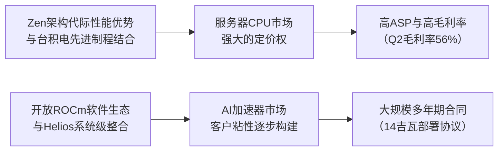

<!-- 匹配到的证券/行业：超威半导体(AMD.O) -->
操作成功

### 一页通 （超威半导体 (AMD.O)）
日期：2026-08-05
内容："""
## 公司概况

超威半导体（AMD）是一家全球半导体公司，核心业务是为数据中心、客户端PC、游戏和嵌入式市场提供高性能计算解决方案。公司产品线覆盖<strong>AI加速器（Instinct系列）、服务器CPU（EPYC系列）、客户端CPU（Ryzen系列）、GPU（Radeon系列）、FPGA及自适应SoC</strong>。AMD是x86服务器CPU市场的第二大供应商，并在数据中心AI加速器市场对英伟达构成主要挑战。公司采用无晶圆厂模式，主要依赖台积电生产芯片。 

## 公司近况跟踪

- <strong>Q2业绩超预期，数据中心成绝对主力</strong>：公司2026年Q2营收<strong>115.36亿美元</strong>，同比增长<strong>50%</strong>，环比增长13%，高于市场一致预期的113.06亿美元。Non-GAAP EPS为<strong>1.66美元</strong>，超预期。其中，<strong>数据中心业务营收67.18亿美元</strong>，同比暴增<strong>107%</strong>，占总营收比重首次超过一半，达<strong>58%</strong>，成为增长核心引擎。   
- <strong>上调2027年数据中心增长预期</strong>：管理层在业绩会上给出极为乐观的展望，预计2027年数据中心业务营收将<strong>同比增长超过100%</strong>，其中服务器CPU增长<strong>超过70%</strong>，数据中心AI业务增长将远超100%。这显著高于市场此前预期。  
- <strong>Helios机架级AI平台进入量产</strong>：公司宣布其旗舰级AI机架系统Helios已进入<strong>全面量产阶段</strong>，首批出货计划于<strong>2026年Q3末</strong>开始，Q4及2027年将大规模爬坡。该系统整合了MI455X GPU、Venice CPU及Pensando网络芯片，被视为AMD从芯片供应商向全栈AI基础设施提供商转型的关键产品。  
- <strong>新增大客户Anthropic</strong>：AMD宣布与前沿AI模型公司Anthropic达成战略合作，Anthropic将部署<strong>高达2吉瓦</strong>的Helios系统，首批1吉瓦将于<strong>2027年上半年</strong>启动。同时，公司将为Anthropic提供至多<strong>50亿美元</strong>的战略投资。   
- <strong>PC市场展望谨慎</strong>：尽管Q2客户端业务营收同比增长23%，但管理层预警<strong>2026年下半年PC市场将因内存和组件成本上涨而走软</strong>，不过仍预计AMD的客户端业务表现将优于市场。 

## 短期逻辑

1.  <strong>Helios平台Q3末启动交付，Q4放量是核心催化剂</strong>
    Helios机架级AI平台是AMD未来3-6个月最关键的交易驱动因素。该产品已进入量产，首批出货定于<strong>2026年9月</strong>，Q4将迎来大规模收入确认。Helios的推出标志着AMD首次以完整机架系统而非单独芯片的形式交付，单机架价值量远高于以往。管理层表示客户需求<strong>超出初步预测</strong>，且Meta、OpenAI、Anthropic等锚定客户的部署计划清晰。Helios的成功交付和快速爬坡，将是验证AMD在AI基础设施领域竞争力的“试金石”，任何关于良率、供应或客户部署的积极进展都可能成为股价的强力催化剂。  

2.  <strong>服务器CPU需求爆发式增长，供应紧张提供业绩高确定性</strong>
    服务器CPU市场正经历由Agentic AI驱动的结构性需求扩张。AMD的EPYC处理器Q2营收同比增长超70%，且管理层指引2026年下半年将增长<strong>超80%</strong>，2027年将增长<strong>超70%</strong>。当前服务器CPU供应链<strong>处于紧张状态</strong>，因为上半年的大部分需求未被预见。这种供不应求的局面为AMD的短期业绩提供了极高的确定性，同时也增强了其议价能力。随着更高核心数的Venice处理器在下半年推出，ASP有望继续提升，驱动营收和利润超预期。  

3.  <strong>Q3指引略低于买方高预期，可能形成短期预期差交易机会</strong>
    尽管AMD给出的Q3营收指引<strong>130亿美元</strong>（同比+41%）高于当时市场一致预期的125亿美元，但低于部分买方在业绩发布前更为激进的预期，尤其是在毛利率方面（指引为56%，环比持平）。这导致股价在业绩发布后出现回调。然而，管理层对2027年的展望极为强劲，且Q3通常是季节性淡季。如果市场因短期指引未达“最乐观预期”而过度反应，将为看好公司长期AI基础设施平台化转型的投资者提供一个具有吸引力的介入窗口。   

## 长期逻辑

1.  <strong>从芯片供应商向全栈AI基础设施平台商的战略转型</strong>
    AMD正通过Helios机架系统、ROCm软件生态和Pensando网络产品的整合，系统性地从一家芯片设计公司转型为提供完整AI基础设施解决方案的平台型企业。这一转型的核心在于，通过提供预集成、高性能的机架级系统，AMD不仅提升了单客户价值量，更关键的是，通过系统级的软硬件协同设计，构建了比单纯销售芯片更深的客户粘性和技术壁垒。公司计划<strong>每年推出一代新的Helios系统</strong>，这种年度迭代的路线图与英伟达的策略相似，旨在锁定大型云客户和AI实验室的长期资本开支计划，将AMD嵌入其AI基础设施的核心。  

2.  <strong>Agentic AI驱动服务器CPU市场迎来结构性重估</strong>
    AMD将Agentic AI定义为服务器CPU市场的下一个重大增长引擎。与主要依赖GPU的传统AI训练不同，Agentic AI工作负载（如多智能体协作、工具调用、数据库交互）需要大量高性能CPU进行任务编排和数据处理。管理层预测，到2030年，服务器CPU的TAM将从当前的约260亿美元增长至<strong>超过2200亿美元</strong>，年复合增长率超50%，其中Agentic AI相关服务器将成为最大、增长最快的部分。AMD凭借其EPYC处理器在核心数、性能和能效方面的优势，有望在这一增量市场中占据领导地位，实现长期的量价齐升。  

3.  <strong>开放软件生态（ROCm）的成熟将打破英伟达CUDA的绝对锁定</strong>
    AMD长期竞争力的核心瓶颈在于其软件生态与英伟达CUDA的差距。然而，这一局面正在发生根本性变化。公司推出的<strong>ROCm.AI平台</strong>，利用AI辅助开发工具，大幅降低了开发者将模型从CUDA迁移至ROCm的成本和复杂度。管理层表示，ROCm的版本迭代已加速至<strong>每6周一次</strong>，开源社区的贡献<strong>同比增长超10倍</strong>，且已实现对超过<strong>300万个模型</strong>的“Day 0”支持。随着AI编程助手（如Claude、Cursor）能够自主完成代码迁移和优化，CUDA的生态锁定效应正在被削弱。一个成熟、开放的软件生态是AMD在AI加速器市场实现长期份额扩张的基石。 

## 风险提示

- <strong>Helios平台首次大规模量产的执行风险</strong>：Helios是AMD历史上最复杂的系统级产品，涉及GPU、CPU、网络、液冷、机架集成等多个环节的协同。作为首次交付的机架级方案，其在制造、集成、测试和客户现场部署环节面临显著的良率爬坡和供应链协同挑战。任何环节的延迟或质量问题，都可能导致产品交付和收入确认不及预期，对公司的技术声誉和客户信心造成打击。 
- <strong>AI资本开支的周期性风险与客户集中度</strong>：AMD的数据中心业务增长高度依赖少数大型云客户和AI实验室的资本开支。尽管当前需求旺盛，但若未来AI应用变现不及预期，或宏观经济下行，这些客户可能削减资本开支，导致AMD的订单大幅下滑。此外，公司与OpenAI、Meta等大客户通过认股权证深度绑定，虽能锁定需求，但也带来了股权稀释和客户议价能力过强的潜在风险。 
- <strong>来自英伟达和ASIC的双线竞争压力</strong>：在AI加速器市场，英伟达凭借其成熟的CUDA生态和强大的产品路线图，仍占据绝对主导地位。同时，大型云厂商（如谷歌的TPU、亚马逊的Trainium）正越来越多地采用自研ASIC芯片，这可能在中长期侵蚀AMD作为“第二供应商”的市场空间。在服务器CPU市场，英特尔正积极提升其产品竞争力，而ARM架构CPU也在特定场景对x86构成威胁。 

## 近期要闻

- <strong>2026年7月23日</strong>：AMD在“Advancing AI 2026”大会上正式发布Helios机架级AI平台、第六代EPYC Venice CPU、ROCm.AI软件平台，并宣布与Anthropic达成2吉瓦的部署合作。公司同时大幅上调了长期TAM预测。   
- <strong>2026年8月4日</strong>：AMD公布2026年Q2财报，营收和EPS均超市场预期，数据中心业务营收首次突破半数占比。公司给出了强劲的Q3指引，并对2027年数据中心业务增长表达了极为乐观的预期。  

## 未来催化

- <strong>2026年9月</strong>：Helios机架级AI平台预计开始首批出货。这是AMD从芯片供应商向系统级解决方案提供商转型的关键里程碑，其交付进度和客户反馈将是市场关注的焦点。  
- <strong>2026年Q4</strong>：第六代EPYC Venice服务器CPU预计开始部署。作为采用2nm工艺、针对Agentic AI优化的重磅产品，其市场接受度和性能表现将直接影响AMD在服务器CPU市场的份额和盈利能力。  
- <strong>2026年Q4</strong>：Helios平台进入大规模爬坡和收入确认阶段。市场将密切关注其季度出货量、客户部署规模以及对公司整体毛利率的影响，这将是验证其AI业务长期增长逻辑的关键时期。  

## 公司业务模式及拆分

### 业务边际变化

AMD正经历从以PC和游戏为主的芯片设计公司，向以数据中心为核心的全栈AI计算平台提供商的战略转型。近年来，公司通过内部研发和外部收购（如Xilinx、Pensando、ZT Systems设计团队），构建了覆盖<strong>CPU、GPU、DPU、FPGA和软件</strong>的完整产品组合。2026年，随着Helios机架级AI平台的推出，公司正式进入系统级解决方案市场，单客户价值量和竞争壁垒显著提升。同时，AI的兴起，特别是Agentic AI的出现，正驱动其服务器CPU业务进入新一轮爆发式增长期。 

### 盈利模式

AMD的盈利模式正从<strong>销售标准化芯片</strong>，转向通过<strong>技术壁垒和系统级整合能力</strong>获取更高附加值的模式。在CPU市场，公司依靠领先的制程和架构设计（Zen系列）实现性能和能效优势，从而获取溢价。在AI市场，公司正试图通过“开放软件生态（ROCm）+ 高性能硬件 + 系统级优化”的组合，构建一个可与英伟达CUDA生态竞争的完整平台，其盈利不仅来自芯片销售，更来自整个机架系统的价值。 

### 业务拆分

公司近年业务结构发生根本性变化，数据中心业务已成为绝对核心。2026年Q2，该业务营收占比首次超过一半，达到<strong>58%</strong>，而去年同期为42%。客户端和游戏业务虽仍占重要地位，但增速远不及数据中心。嵌入式业务正从周期性低谷中复苏。公司当前处于<strong>业绩兑现期</strong>，前期在AI和服务器CPU领域的研发与客户投入正转化为强劲的收入和利润增长。  

<strong>细分业务拆分（单位：亿美元）</strong>

| 业务板块 | FY2024 收入 | FY2024 占比 | FY2025 收入 | FY2025 占比 | 1Q26 收入 | 2Q26 收入 | 2Q26 同比 | 2Q26 占比 |
| :--- | :--- | :--- | :--- | :--- | :--- | :--- | :--- | :--- |
| <strong>数据中心</strong> | 125.79 | 48.8% | 166.35 | 48.0% | 57.75 | <strong>67.18</strong> | <strong>+107%</strong> | <strong>58.2%</strong> |
| <strong>客户端与游戏</strong> | 96.49 | 37.4% | 145.50 | 42.0% | 36.05 | <strong>38.41</strong> | <strong>+6%</strong> | 33.3% |
| 客户端 | 70.54 | - | 106.40 | - | 28.85 | 30.62 | +23% | - |
| 游戏 | 25.95 | - | 39.10 | - | 7.20 | 7.79 | -31% | - |
| <strong>嵌入式</strong> | 35.57 | 13.8% | 34.54 | 10.0% | 8.73 | <strong>9.77</strong> | <strong>+19%</strong> | 8.5% |
| <strong>总计</strong> | 257.85 | 100% | 346.39 | 100% | 102.53 | <strong>115.36</strong> | <strong>+50%</strong> | 100% |

*注：2025年Q1起，公司将客户端和游戏合并为一个报告分部。毛利率数据未在分部层面详细披露。*

<strong>数据中心业务（2026年Q2）</strong>：营收<strong>67.18亿美元</strong>，同比增长<strong>107%</strong>。增长由EPYC服务器CPU（同比+70%以上）和Instinct AI加速器（同比翻倍以上）共同驱动。云和企业客户需求均非常强劲。该业务是公司增长和利润的核心来源。  

<strong>客户端与游戏业务（2026年Q2）</strong>：营收<strong>38.41亿美元</strong>，同比增长<strong>6%</strong>。其中，客户端业务营收30.62亿美元，同比增长23%，受创纪录的移动处理器收入和份额增长驱动；游戏业务营收7.79亿美元，同比下降31%，主要因游戏主机周期进入后半段，半定制芯片销售下滑。 

<strong>嵌入式业务（2026年Q2）</strong>：营收<strong>9.77亿美元</strong>，同比增长<strong>19%</strong>，环比增长12%，为三年多来最强增长。需求基础广泛，在航空航天、国防、网络和通信等领域表现强劲，正从周期性底部复苏。 

## 核心竞争力

<strong>竞争要素 1：依托x86生态与性能代际领先，在服务器CPU市场建立的强大定价权</strong>

-   <strong>护城河定性</strong>：<strong>结构性护城河</strong>。AMD的EPYC服务器CPU凭借其先进的Zen架构和台积电领先制程，在核心数、性能和能效方面持续对英特尔形成代际优势。在x86服务器市场，客户对高性能、高能效CPU的需求缺乏其他成熟的替代方案，这使得AMD拥有强大的定价权，能够将技术优势转化为高ASP和高利润率。 
-   <strong>数据验证</strong>：2026年Q2，AMD服务器CPU营收同比增长<strong>超过70%</strong>，且增长由<strong>单位出货量和ASP共同驱动</strong>。公司预计2027年服务器CPU营收将在更高基数上再增长<strong>超过70%</strong>。其数据中心业务的强劲增长直接拉动了公司整体毛利率，Q2 Non-GAAP毛利率达到<strong>56%</strong>，同比提升超200个基点。  
-   <strong>动态演变</strong>：<strong>护城河变宽</strong>。随着Agentic AI时代的到来，对高性能CPU的需求正从传统的通用计算扩展到AI推理和智能体编排等新场景。AMD即将推出的第六代EPYC Venice处理器，采用2nm工艺，针对AI工作负载进行了专门优化，性能较上一代提升1.8倍，有望进一步巩固其技术领先地位，并在一个快速增长的TAM中持续扩大份额。  

<strong>竞争要素 2：通过开放软件生态（ROCm）和系统级解决方案（Helios），在AI加速器市场构建的客户转换成本</strong>

-   <strong>护城河定性</strong>：<strong>行业阶段性红利</strong>，正向结构性护城河演变。在AI加速器市场，英伟达的CUDA生态构成了极高的转换成本。AMD正通过两条路径构建自己的护城河：一是大力投资<strong>开源的ROCm软件生态</strong>，降低开发者迁移门槛；二是推出<strong>Helios机架级系统</strong>，通过软硬件一体化设计，提供差异化的性能和TCO优势。一旦客户将其AI工作负载深度集成到AMD的系统和软件栈中，其迁移成本将随时间推移而增加。  
-   <strong>数据验证</strong>：ROCm生态进展显著，已支持超过<strong>300万个模型</strong>，开源社区贡献<strong>同比增长超10倍</strong>。公司推出的ROCm.AI平台，利用AI辅助开发，可将推理性能提升<strong>3.3倍</strong>。在客户层面，已锁定OpenAI、Meta、Anthropic等头部AI公司的大规模、多年期部署协议，总规模达<strong>14吉瓦</strong>。这些协议本身就是客户用脚投票，证明了AMD方案的竞争力。  
-   <strong>动态演变</strong>：<strong>护城河变宽</strong>。随着Helios系统在Q3末开始交付，AMD将首次以完整系统而非单独芯片的形式与客户深度耦合。这种系统级的合作模式比单纯的芯片供应具有更强的粘性。同时，ROCm.AI等工具的出现，正在利用AI技术本身来瓦解CUDA的软件壁垒，这是一个具有颠覆性的长期趋势。  

<strong>现阶段核心驱动力总结</strong>：
AMD的Alpha来源于其在x86服务器CPU市场的<strong>强定价权</strong>和<strong>技术护城河</strong>，这为其提供了稳定的现金流和高利润率。其Beta则来自于AI计算市场的<strong>整体扩张</strong>，以及公司作为英伟达主要替代方案，在AI加速器市场<strong>份额扩张的潜力</strong>。公司正处在一个“CPU业务提供坚实基础，AI业务提供弹性期权”的有利位置。 

<strong>竞争格局传导逻辑图</strong>：

## 产销链

- <strong>客户情况</strong>：
  公司客户结构正从分散走向集中。数据中心业务高度依赖大型云服务商和AI实验室。2025年报显示，<strong>无单一客户占营收比超过10%</strong>，但2026年随着与OpenAI、Meta、Anthropic签订大规模协议，客户集中度将显著提升。这些协议通常为期数年，规模达数吉瓦，为AMD带来高能见度的长期收入，但也使其面临核心客户资本开支波动和议价能力过强的风险。新客户Anthropic已明确进入<strong>大规模交货</strong>阶段，首批1吉瓦部署将于2027年上半年启动。  

- <strong>供应商情况</strong>：
  公司对<strong>台积电</strong>存在高度依赖，其所有先进制程（7nm及以下）的CPU和GPU晶圆均由台积电供应。2026年，随着AI芯片需求激增，台积电的CoWoS先进封装产能成为全行业瓶颈。AMD管理层表示，当前服务器CPU供应链<strong>紧张</strong>，但已为2027年的增长提前规划了产能。此外，公司对HBM内存的供应依赖SK海力士和三星等少数厂商，当前内存价格高企，对成本和供应构成挑战。 

- <strong>成本传导能力</strong>：
  当上游晶圆和内存成本上涨时，AMD展现出较强的成本传导能力。在服务器CPU市场，凭借其技术领先性和强劲需求，公司能够通过提升ASP来覆盖成本上涨。在AI加速器市场，公司通过提供差异化的系统级解决方案（如更高HBM容量的Helios）来创造附加值，从而在定价上拥有一定主动权。公司赚取的是<strong>技术壁垒和系统整合</strong>带来的溢价，而非单纯的“加工费”。 

## 财务数据

<strong>关键财务数据（单位：亿美元，除EPS外）</strong>

| 项目 | FY2023 | FY2024 | FY2025 | 1H26 |
| :--- | :--- | :--- | :--- | :--- |
| <strong>报告期截止日</strong> | <strong>2023/12/30</strong> | <strong>2024/12/28</strong> | <strong>2025/12/27</strong> | <strong>2026/6/27</strong> |
| 净营收 | 226.80 | 257.85 | 346.39 | 217.89 |
| 营收同比 | - | +13.7% | +34.3% | +43.8% |
| 营业成本 | 122.20 | 130.60 | 174.87 | 101.70 |
| 毛利润 | 104.60 | 127.25 | 171.52 | 116.19 |
| <strong>Non-GAAP毛利率</strong> | - | - | <strong>52.4%</strong> | <strong>55.7%</strong> |
| 研发费用 | 58.72 | 64.56 | 80.91 | 49.25 |
| 销售、行政及一般费用 | 23.18 | 27.35 | 41.44 | 26.54 |
| 营业利润 | 4.01 | 19.00 | 36.94 | 45.71 |
| 归母净利润 | 8.54 | 16.41 | 43.35 | 36.88 |
| <strong>Non-GAAP摊薄EPS</strong> | - | - | <strong>4.19美元</strong> | <strong>3.03美元</strong> |
| 自由现金流 | - | - | 约60.32 | 约41.26 |

*注：Non-GAAP数据及自由现金流数据来源于公司财报及业绩会材料。1H26数据为Q1与Q2之和。*

<strong>财务分析</strong>：

- <strong>成长能力</strong>：公司正处于营收和利润的爆发式增长期。2026年上半年营收同比增长<strong>43.8%</strong>，Q2单季增速更是达到<strong>50%</strong>。增长主要由数据中心业务驱动，该业务Q2增速高达<strong>107%</strong>。Non-GAAP EPS在Q2同比增长约<strong>246%</strong>，显示出显著的经营杠杆效应。  

- <strong>盈利能力</strong>：公司毛利率持续改善，Non-GAAP毛利率从FY2025的52.4%提升至1H26的<strong>55.7%</strong>，Q2单季达到<strong>56%</strong>。这主要得益于高毛利的数据中心业务占比快速提升。营业利润率也从FY2025的10.7%大幅提升至1H26的21.0%，表明公司在大力投资研发的同时，规模效应开始显现。  

- <strong>运营能力</strong>：存货从FY2025末的79.20亿美元增加至Q2末的约85亿美元，这与公司为支持Helios和Venice等新产品爬坡而主动增加库存的策略一致。应收账款随营收规模扩大而增长，但周转天数相对稳定。 

- <strong>偿债能力与现金流</strong>：公司财务状况稳健。截至Q2末，现金及短期投资合计约<strong>131亿美元</strong>，总债务约32.24亿美元，净现金头寸充足。1H26自由现金流合计约<strong>41.26亿美元</strong>，尽管Q2因资本开支增加（主要用于OSAT设备采购以支持Venice爬坡）而环比下降，但整体现金流生成能力强劲，足以支持其研发投入和战略投资。  

## 行业及竞争分析

AMD所处的核心赛道是<strong>数据中心AI计算</strong>和<strong>服务器CPU</strong>市场，这两个市场正因生成式AI的爆发而经历历史性增长。  

- <strong>AI加速器市场</strong>：公司预计该市场TAM将从2025年的约2000亿美元增长至2030年的<strong>1.4万亿美元</strong>，年复合增长率超45%。增长动力正从以训练为主转向以<strong>推理</strong>为主，2026年推理算力需求首次超过训练。AMD通过其Instinct系列GPU和Helios机架系统参与竞争，定位为英伟达的主要替代方案，强调其开放生态和更高的每美元Token吞吐量。  

- <strong>服务器CPU市场</strong>：公司预计该市场TAM将从2025年的约260亿美元增长至2030年的<strong>超过2200亿美元</strong>，年复合增长率超50%。核心驱动力是<strong>Agentic AI</strong>，它需要大量高性能CPU来编排和调度AI智能体。AMD凭借其EPYC处理器，在该市场与英特尔和基于ARM架构的芯片竞争，强调其x86生态兼容性、高核心数和领先的每瓦性能。  

<strong>可比公司分析</strong>

| 公司名称 | 股票代码 | 对标维度 | 分析 |
| :--- | :--- | :--- | :--- |
| 英伟达 (NVIDIA) | NVDA | AI加速器市场领导者 | 英伟达凭借CUDA生态和强大的产品执行力，在AI训练和推理市场占据主导地位，其数据中心营收规模和增速均远超AMD。AMD的策略是作为开放的“第二供应商”，通过性价比和系统级方案争夺份额。 |
| 英特尔 (Intel) | INTC | 服务器CPU市场主要竞争对手 | 英特尔是x86服务器CPU市场的传统领导者，但近年来在制程和架构上落后于AMD。英特尔正通过加速产品迭代和提供更具竞争力的价格来捍卫市场份额，但其盈利能力远逊于AMD。 |
| 博通 (Broadcom) | AVGO | AI ASIC定制化芯片领导者 | 博通是谷歌TPU等定制AI芯片的主要设计合作伙伴。ASIC在特定工作负载上可能比通用GPU更高效，代表了AI计算的另一条技术路径，对AMD和英伟达的通用GPU市场构成长期潜在威胁。 |

<strong>总结分析</strong>：AMD在两个关键市场均处于有利位置。在服务器CPU市场，它是技术领先者，正持续从英特尔手中夺取份额。在AI加速器市场，它是头号挑战者，正通过全栈解决方案和开放生态策略，试图在一个由英伟达主导的万亿美元级市场中建立稳固的第二极地位。 

## 市场焦点议题

- <strong>议题1：Helios平台能否成功交付并大规模部署？</strong>
  - <strong>背景</strong>：Helios是AMD首款机架级AI系统，其复杂度和战略意义远超以往任何产品。市场对其寄予厚望，但也担心首次量产可能遇到良率、供应链或客户部署方面的挑战。历史上，竞争对手在首次推出类似大规模系统时也曾经历爬坡阵痛。 
  - <strong>问题列表</strong>：
    1.  Helios在Q3末的首次发货能否按时完成？初期良率和客户验收情况如何？
    2.  2027年数据中心AI业务“远超100%”的增长指引中，有多少已由客户合同和产能规划锁定？
    3.  管理层提到客户需求“超出初步预测”，这是指订单量还是客户数量？具体超出幅度有多大？

- <strong>议题2：毛利率的长期趋势：AI GPU业务是稀释还是增厚？</strong>
  - <strong>背景</strong>：市场普遍认为AI GPU（尤其是机架级系统）的毛利率低于AMD传统的高毛利服务器CPU业务。随着AI GPU业务占比快速提升，其对整体毛利率的拖累程度是投资者关注的核心。 
  - <strong>问题列表</strong>：
    1.  管理层指引2027年毛利率将取决于业务组合，能否量化AI GPU和服务器CPU业务的毛利率差距？
    2.  随着Helios平台爬坡，其毛利率的提升曲线是怎样的？预计何时能达到公司平均水平？
    3.  在内存等组件成本高企的背景下，公司如何确保AI GPU业务的利润率？

- <strong>议题3：AI GPU业务的真实竞争力：是需求拉动还是供给创造？</strong>
  - <strong>背景</strong>：AMD通过向OpenAI和Meta发行认股权证的方式锁定了大额订单。市场质疑，这种需求在多大程度上是客户对AMD技术实力的认可，还是由附带金融条款驱动的。 
  - <strong>问题列表</strong>：
    1.  在已宣布的14吉瓦框架协议中，有多少是具备法律约束力的确定订单？
    2.  除去认股权证的影响，客户选择AMD Helios而非竞品方案的核心技术原因是什么？
    3.  AMD的AI GPU业务何时能实现不依赖于大规模战略投资的有机增长？

## 市场分歧探讨

<strong>核心分歧：AMD在AI加速器市场的成功，是行业Beta驱动下的阶段性胜利，还是具备可持续竞争优势的Alpha体现？</strong>

- <strong>乐观方观点：开放生态与全栈整合将构建长期护城河</strong>
  乐观方认为，AMD正走在一条正确的道路上。首先，AI市场足够大，足以容纳多个供应商，客户有强烈的“第二供应商”需求以避免被单一厂商锁定。其次，AMD通过<strong>ROCm.AI</strong>等工具，正利用AI技术本身来瓦解英伟达的CUDA软件壁垒，这是一个“降维打击”式的策略。最后，<strong>Helios机架级系统</strong>的推出，标志着AMD从芯片设计到系统集成的能力跃迁，这种软硬件协同优化的能力是ASIC厂商所不具备的，能提供差异化的TCO优势。与Anthropic、OpenAI等前沿模型公司的深度合作，将使其产品路线图更贴近最先进的AI需求，形成正向循环。  

- <strong>谨慎方观点：高增长背后伴随高成本与强依赖，盈利质量存疑</strong>
  谨慎方则指出，AMD的AI GPU业务增长伴随着巨大的代价。为获取客户，公司发行了大量<strong>认股权证</strong>，这实质上是巨额的营销和获客成本，将严重稀释现有股东的权益。如果将这些认股权证的成本计入，AI GPU业务的真实盈利能力将大打折扣。此外，该业务高度依赖少数几家大客户，客户集中度风险极高。在技术上，尽管ROCm进步显著，但与CUDA的差距依然存在，客户迁移和适配仍需额外成本。一旦AI投资热潮降温，或英伟达推出更具竞争力的产品，AMD的AI业务可能面临营收和利润的双重压力。 

<strong>总结分析</strong>：AMD的AI战略逻辑清晰，执行有力，其在服务器CPU市场的强势地位也为AI业务提供了坚实的现金流支撑。然而，AI GPU业务的成功确实在很大程度上依赖于行业的高景气度（Beta）和激进的商业条款。其向全栈平台转型的战略方向是正确的，但能否建立起如英伟达般深厚的、不依赖于财务补贴的生态护城河，仍需在未来2-3年内通过Helios的大规模部署和ROCm生态的有机增长来证明。当前的高估值已计入了大部分乐观预期，而认股权证的稀释效应和潜在的竞争风险尚未被充分定价。 

## 盈利预测与估值

<strong>管理层最新指引</strong>：在2026年Q2业绩会上，管理层预计2026年Q3营收约<strong>130亿美元</strong>，Non-GAAP毛利率约<strong>56%</strong>。对于2027年，管理层预计数据中心业务营收将<strong>同比增长超过100%</strong>，其中服务器CPU增长超70%，并预计公司整体营收增速将显著高于其长期目标（35%以上），且将在战略时间框架内大幅超越每股收益20美元的目标。  

<strong>机构盈利预测与估值</strong>

| 机构 | 评级 | 目标价(美元) | 财务指标 | FY2025A | FY2026E | FY2027E | FY2028E |
| :--- | :--- | :--- | :--- | :--- | :--- | :--- | :--- |
| 花旗 (2026/08/05) | 买入 | 575 | 营收(百万美元) | 34,639 | 51,289 | 91,500 | 127,000 |
| | | | Non-GAAP EPS(美元) | 4.19 | 7.89 | 18.23 | 28.47 |
| 摩根士丹利 (2026/08/05) | 持有 | 465 | 营收(百万美元) | 34,639 | 51,147 | 88,987 | 125,207 |
| | | | Non-GAAP EPS(美元) | 4.23 | 7.67 | 15.54 | 23.30 |
| 摩根大通 (2026/08/05) | 中性 | 550 | 营收(百万美元) | 34,639 | 50,533 | 84,036 | 115,124 |
| | | | Non-GAAP EPS(美元) | 4.18 | 7.25 | 14.38 | 21.80 |
| 瑞银 (2026/07/28) | 买入 | 730 | 营收(百万美元) | 34,639 | 51,140 | 98,477 | 137,331 |
| | | | Non-GAAP EPS(美元) | 4.17 | 7.82 | 18.65 | 27.57 |

*注：以上预测均为日历年度。花旗和瑞银评级为“买入”，摩根士丹利评级为“持有”，摩根大通评级为“中性”。*

<strong>盈利预测与估值分析</strong>：
主要机构对AMD的未来增长均持乐观态度，但预测数据和对估值的看法存在显著分歧。<strong>乐观方（如瑞银、花旗）</strong> 给出了更高的2027年和2028年营收及EPS预测，其目标价也更高，主要基于对公司AI GPU和CPU业务均将超预期增长的判断，并采用较高的市盈率（如27-35倍）进行估值。<strong>谨慎方（如摩根士丹利、摩根大通）</strong> 虽然也大幅上调了预测，但目标价相对保守，其估值倍数相对较低，反映了对AI GPU业务稀释毛利率、认股权证摊薄以及竞争风险的担忧。摩根士丹利明确指出了认股权证对盈利的负面影响。整体而言，市场对AMD 2027年的EPS预测范围在<strong>14.38美元至18.65美元</strong>之间，分歧巨大，核心在于对AI GPU业务的增长速度和盈利质量的不同假设。
"""
