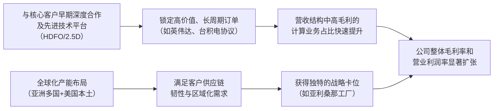

<!-- 匹配到的证券/行业：艾马克技术(AMKR.O) -->
操作成功

### 一页通 （艾马克技术 (AMKR.O)）
日期：2026-08-02
内容："""
## 公司概况

艾马克技术（Amkor Technology）是全球最大的美国总部外包半导体封装与测试服务商（OSAT），定位为先进封装技术领导者。公司提供从晶圆凸块、封装设计、组装到最终测试的全套交钥匙解决方案，核心产品线包括倒装芯片、2.5D集成、高密度扇出（HDFO）及系统级封装（SiP）。其终端应用覆盖通信（智能手机）、计算（数据中心/AI）、汽车及消费电子，客户囊括苹果、英伟达、高通等全球主要半导体公司。公司正通过在美国亚利桑那州建设先进封装工厂，强化其在美国本土半导体供应链中的战略卡位。  

## 公司近况跟踪

- <strong>业绩超预期，毛利率显著扩张</strong>：2026年Q2实现创纪录营收<strong>18.98亿美元</strong>，同比增长<strong>25.6%</strong>，毛利率<strong>16.8%</strong>，同环比均大幅提升。增长主要由计算和汽车/工业市场的创纪录营收驱动，毛利率提升的<strong>三分之二归因于产能利用率提高，三分之一归因于有利的产品组合</strong>。  
- <strong>AI/计算业务进入高速增长期</strong>：Q2计算业务营收环比增长<strong>20%</strong>，主要受AI数据中心需求驱动。管理层指引Q3计算业务环比增长近<strong>30%</strong>，驱动力来自HDFO数据中心CPU项目的规模爬坡。公司预计2026全年先进封装业务收入将实现<strong>同比约三倍增长</strong>。  
- <strong>战略性SiP产能迁移</strong>：公司正将系统级封装（SiP）产能从韩国转移至越南，旨在优化成本结构并为韩国工厂腾出空间以支持高价值的先进封装（如HDFO）项目。此举导致Q3通信业务指引出现<strong>高个位数的环比下滑</strong>，该影响预计持续至2027年上半年。  
- <strong>重大战略合作落地</strong>：公司与台积电（TSMC）签订了<strong>10年期</strong>的先进封装与测试合作协议，并与英伟达（NVIDIA）达成了价值<strong>15亿美元</strong>的多年期战略合作，后者包含一笔客户预付款，用于支持亚利桑那工厂的产能建设。  
- <strong>亚利桑那项目一期产能已全部预定</strong>：管理层表示，亚利桑那州先进封装工厂一期产能已获客户全额预定，并已额外购入67英亩土地，为未来扩建提供灵活性。该项目一期总投资约35亿美元，预计2027年底完工，2028年投产。  

## 短期逻辑

1.  <strong>AI数据中心CPU项目爬坡驱动业绩与利润率超预期</strong>：公司最核心的短期催化剂是HDFO数据中心CPU项目在Q3的规模放量。该项目已于Q2启动爬坡，管理层指引Q3计算业务环比增长近<strong>30%</strong>，并带动整体毛利率指引跃升至<strong>18.5%-19.5%</strong>。这一利润率水平已触及公司投资者日给出的2028年目标模型，表明AI驱动的先进封装业务正在加速公司的盈利改善节奏。营收结构上，计算业务占比将从Q2的<strong>22%</strong>快速提升，高利润产品组合的改善是Q3毛利率环比大幅扩张的主要驱动力。  

2.  <strong>战略客户合作实质性落地，订单可见度增强</strong>：近期与台积电和英伟达签署的长期协议，为市场提供了关于亚利桑那工厂未来装载率和投资回报的更清晰图景。特别是与英伟达的<strong>15亿美元</strong>合作协议，不仅包含预付款以缓解资本开支压力，更锁定了下一代AI基础设施的先进封装需求。这些协议将市场对公司“故事”的关注，转向对具体订单和长期收入可见度的验证，有助于支撑估值。  

3.  <strong>SiP产能迁移造成的短期业绩扰动与预期差</strong>：公司主动将SiP产能从韩国迁往越南，导致Q3通信业务出现反季节性下滑（环比下降高个位数），营收指引中点<strong>20亿美元</strong>低于市场一致预期的<strong>21.2亿美元</strong>。这一战略性调整虽有益于长期成本结构和产能规划，但短期内造成了营收端的“空气口袋”，且影响可能持续至2027年上半年。市场对这一短期逆风的消化程度，以及Q3实际毛利率能否达到指引上限，将是影响股价短期表现的关键预期差。  

## 长期逻辑

1.  <strong>先进封装正从“后端工序”升级为系统性能的“关键路径”</strong>：随着摩尔定律放缓，AI和高性能计算（HPC）系统的性能提升越来越依赖Chiplet架构、2.5D/3D堆叠等先进封装技术来实现高带宽、低延迟的芯片间互连。封装决策已提前至芯片和系统设计阶段，封装供应商的角色从“交易型代工厂”转变为“深度战略合作伙伴”。这一行业结构性转变，使得技术领先的OSAT龙头（如Amkor）在半导体价值链中的地位和议价能力得到根本性提升。 

2.  <strong>亚利桑那工厂卡位美国本土半导体供应链，构筑长期地域壁垒</strong>：公司投资<strong>70亿美元</strong>分两期建设的亚利桑那工厂，是美国本土唯一大规模先进封装产能。该工厂与台积电的晶圆厂形成“制造-封装”闭环，服务于美国本土芯片制造需求，具备极高的战略价值。尽管短期会带来折旧和爬坡成本（预计2027年稀释营业利润率<strong>1-2个百分点</strong>），但满产后（预计2030年）预计贡献超<strong>10亿美元</strong>年收入和<strong>30%以上</strong>的毛利率，将成为公司长期盈利增长和估值重估的重要驱动力。  

3.  <strong>客户关系深化与长期订单可见度提升</strong>：公司正与核心客户（如苹果、英伟达、AMD）建立多年期、多代产品的联合开发协议。这种早期、深度的合作模式不仅锁定了未来市场份额，还通过客户预付款、产能预留协议等方式，平滑了半导体周期的波动，提高了资本开支的回报确定性。公司目标到2030年，计算业务收入占比从2025年的<strong>20%</strong>提升至<strong>35%</strong>，成为最大的收入来源，这将从根本上改善公司的增长质量和盈利结构。  

## 风险提示

- <strong>亚利桑那工厂产能爬坡与盈利稀释风险</strong>：该项目总投资巨大，2026年资本开支指引高达<strong>25-30亿美元</strong>。从2027年开始，项目将产生持续的启动费用和折旧成本，预计对营业利润率造成<strong>1-2个百分点</strong>的拖累，并在2028年投产后因产能利用率不足继续压制毛利率。若客户订单导入或产能爬坡不及预期，回报周期将被拉长，对公司自由现金流和盈利能力构成持续压力。  

- <strong>客户集中度与单一市场依赖风险</strong>：公司对少数关键客户依赖度极高，2025年苹果和Qualcomm分别贡献了<strong>29.8%</strong>和<strong>11.1%</strong>的营收。通信市场（以智能手机为主）仍占2026年Q2营收的<strong>42%</strong>。任何大客户订单流失、产品周期切换或智能手机市场需求疲软，都可能对公司营收和产能利用率造成显著冲击。SiP产能迁移对通信业务的短期扰动即是例证。  

- <strong>地缘政治与供应链风险</strong>：公司大部分生产设施位于亚洲（韩国、越南、台湾等），易受地区冲突、贸易摩擦和自然灾害影响。近期中东局势紧张已推高材料和物流成本。此外，美国出口管制政策的变化可能影响公司向特定中国客户销售AI相关先进封装产品，构成业务不确定性。  

## 近期要闻

- <strong>2026年5月</strong>：公司举办投资者日，公布长期财务目标：2028年营收<strong>85-95亿美元</strong>，毛利率<strong>16.5-18.5%</strong>；2030年营收超<strong>110亿美元</strong>，毛利率超<strong>22%</strong>。目标公布后股价因2028年指引低于部分买方预期而出现回调。  
- <strong>2026年5月</strong>：公司发行<strong>11.5亿美元</strong>的零息可转换债券，用于补充流动性和支持资本开支计划。  
- <strong>2026年6月</strong>：公司宣布与台积电（TSMC）签署<strong>10年期</strong>先进封装与测试合作协议，旨在加强美国半导体供应链。 
- <strong>2026年7月</strong>：公司宣布与英伟达（NVIDIA）达成价值<strong>15亿美元</strong>的多年期战略合作，聚焦下一代AI基础设施的先进封装和测试。英伟达将提供一笔预付款。  
- <strong>2026年7月</strong>：公司位于日本熊本的工厂因地震导致运营中断，公司已启动应急响应程序，正在评估损失。 

## 未来催化

- <strong>2026年8月-10月</strong>：<strong>HDFO数据中心CPU项目规模放量</strong>。公司Q2业绩会指引，新的HDFO CPU项目将在Q3产生显著收入贡献，并持续增长至2027年。该项目的实际放量速度和毛利率贡献，将是验证公司AI/计算业务增长逻辑的关键。  
- <strong>2026年8月-10月</strong>：<strong>英伟达合作细节及预付款入账</strong>。市场将关注公司与英伟达<strong>15亿美元</strong>合作协议的更多细节，包括预付款的具体到账时间、收入确认方式以及对财务报表的影响，这将直接影响对公司现金流和资本开支压力的评估。  
- <strong>2026年下半年</strong>：<strong>亚利桑那工厂建设进度及二期规划更新</strong>。随着一期工程推进，市场将关注项目是否按计划在2027年完工，以及公司是否会基于客户需求启动二期建设。任何关于政府补贴（CHIPS Act）到账或新客户签约的消息，都将成为积极催化。  
- <strong>2026年下半年</strong>：<strong>SiP迁移影响消退与通信业务恢复</strong>。公司指引SiP产能迁移对通信业务的拖累将持续至2027年上半年。市场将密切关注Q4及后续季度的通信业务指引，寻找影响消退、业务恢复增长的迹象。 

## 公司业务模式及拆分

<strong>业务边际变化</strong>：公司近年业务重心显著向高价值的先进封装倾斜。先进产品（Advanced Products）收入占比从2023年的<strong>77.4%</strong>提升至2025年的<strong>82.8%</strong>，并在2026年H1进一步提升。核心驱动力来自AI数据中心相关的2.5D和HDFO封装项目。同时，公司正主动将低毛利的SiP业务从韩国转移至越南，以释放韩国产能用于承接高价值的计算类先进封装订单。  

<strong>盈利模式</strong>：公司依靠其在先进封装领域的技术领先地位、与核心客户的深度绑定关系以及全球化的产能布局来获取订单。其盈利模式的核心是“产能利用率×技术溢价”。由于折旧等固定成本占比高，营收规模和产能利用率是毛利率的关键决定因素。公司正通过提升高价值先进封装（如HDFO、2.5D）的业务占比，来驱动产品组合升级和利润率结构性改善。  

<strong>业务拆分</strong>：
公司业务按产品技术分为“先进产品”和“主流产品”两大类。近年来，先进产品是公司增长的核心引擎，其增速和收入占比持续提升。公司当前处于由AI和HPC需求驱动的<strong>业绩兑现期</strong>，先进封装产能紧张，利用率高企。  

<strong>细分业务拆分（按产品技术）</strong>

| 项目 (百万美元) | FY2023 | FY2024 | FY2025 | FY2026 H1 |
| :--- | :--- | :--- | :--- | :--- |
| <strong>先进产品</strong> | | | | |
| 收入 | 5,032.86 | 5,174.46 | 5,555.56 | 2,928.68 |
| 同比 | - | 2.8% | 7.4% | 27.8% |
| 收入占比 | 77.4% | 81.9% | 82.8% | 81.7% |
| <strong>主流产品</strong> | | | | |
| 收入 | 1,470.21 | 1,143.23 | 1,152.43 | 653.99 |
| 同比 | - | -22.2% | 0.8% | 21.0% |
| 收入占比 | 22.6% | 18.1% | 17.2% | 18.3% |
| <strong>总计</strong> | <strong>6,503.07</strong> | <strong>6,317.69</strong> | <strong>6,707.98</strong> | <strong>3,582.67</strong> |

*注：公司未披露分产品毛利率。先进产品包含倒装芯片、存储和晶圆级加工及测试服务；主流产品包含引线键合封装及测试服务。*

<strong>细分业务描述（2026年H1）</strong>：
- <strong>先进产品</strong>：2026年上半年实现营收<strong>29.29亿美元</strong>，同比增长<strong>27.8%</strong>，是公司增长的核心驱动力。增长主要来自AI数据中心应用的2.5D和HDFO封装项目。公司正将更多资源（资本开支和工厂空间）投向该领域，以满足强劲的客户需求。  
- <strong>主流产品</strong>：2026年上半年实现营收<strong>6.54亿美元</strong>，同比增长<strong>21.0%</strong>，实现连续第五个季度的同比增长。增长主要得益于汽车和工业市场的温和复苏，以及整体需求的改善。该业务是公司的“现金牛”业务，但增长性和利润率低于先进产品。  

## 核心竞争力

<strong>竞争要素 1：依托技术领先与早期客户合作构筑的先发优势</strong>

- <strong>护城河定性</strong>：属于<strong>行业阶段性红利与结构性护城河的交汇期</strong>。先进封装技术（如HDFO、2.5D）复杂度高，需要与客户在芯片设计早期进行长达数年的联合开发，这构成了较高的客户转换成本和合作粘性。目前AI需求爆发导致先进封装产能供不应求，强化了公司的先发优势。但该优势能否转化为长期结构性护城河，取决于技术迭代速度和竞争对手的追赶情况。 
- <strong>数据验证</strong>：公司先进产品收入占比从2023年的<strong>77.4%</strong>持续提升至2025年的<strong>82.8%</strong>。2026年Q2，计算业务营收环比增长<strong>20%</strong>，并指引Q3环比增长近<strong>30%</strong>，显示出强大的增长动能。公司披露其HDFO平台已与<strong>超过5家客户</strong>在不同阶段展开合作，2.5D技术客户超过<strong>6家</strong>，表明其技术平台获得了广泛的客户认可。  
- <strong>动态演变</strong>：<strong>护城河变宽（巩固）</strong>。随着公司与英伟达、台积电等巨头签订长期战略合作协议，并锁定亚利桑那工厂一期全部产能，其在新一代AI芯片封装领域的卡位得到巩固。客户关系的深度和广度正在加强，从单一项目合作转向多代产品路线图的共同开发。  

<strong>竞争要素 2：全球化产能布局带来的供应链弹性</strong>

- <strong>护城河定性</strong>：属于<strong>结构性护城河</strong>。Amkor在韩国、越南、台湾、葡萄牙、美国等8个国家拥有生产基地，这种地理多元性使其能够满足客户对供应链韧性和区域化生产的需求。尤其是在中美贸易摩擦背景下，其美国本土产能（亚利桑那工厂）具有独特的战略价值，竞争对手难以在短期内复制。  
- <strong>数据验证</strong>：公司正在将SiP产能从韩国迁往越南，同时在美国建设投资<strong>70亿美元</strong>的先进封装工厂，并在韩国、台湾等地持续扩张。这种全球化的产能调配能力，使其能够优化成本结构并抓住不同区域的增长机会。亚利桑那工厂一期产能已被<strong>全部预定</strong>，验证了其战略价值。  
- <strong>动态演变</strong>：<strong>护城河变宽（巩固）</strong>。随着亚利桑那工厂的建设和投产，公司将成为美国本土唯一具备大规模先进封装能力的OSAT，这一独特地位将构成强大的竞争壁垒，并可能获得政策层面的持续支持。 

<strong>现阶段核心驱动力总结</strong>：
公司的Alpha来自其在AI驱动的先进封装技术上的领先地位和执行力，这使其能够获得超越行业平均水平的增长和利润率。公司的Beta则与全球半导体周期、尤其是AI基础设施投资周期紧密相关。当前，强劲的AI需求（Beta）与公司自身的技术和产能卡位（Alpha）形成共振，驱动业绩高速增长。  

<strong>竞争格局传导逻辑图</strong>：

## 产销链

- <strong>客户情况</strong>：
  公司客户集中度较高。2025年，前两大客户苹果和Qualcomm分别贡献了<strong>29.8%</strong>和<strong>11.1%</strong>的营收，前十大客户合计占比<strong>72%</strong>。这表明公司对核心大客户存在显著依赖，但也反映出其与行业龙头的深度绑定关系。新客户方面，公司正积极拓展与英伟达、AMD等公司在AI/HPC领域的合作，其中与英伟达的<strong>15亿美元</strong>战略协议标志着新大客户的重大突破，目前处于大规模交货和联合开发阶段。  

- <strong>供应商情况</strong>：
  公司主要采购封装材料（基板、引线框架、金线等）和制造设备。材料成本是营业成本的主要构成，2025年材料成本占营收比重高达<strong>55.2%</strong>。公司从有限数量的供应商处采购关键材料，存在供应链集中风险。近期因地缘政治和通胀因素，材料和贵金属价格面临上涨压力，公司正通过与客户协商调价机制来传导成本。 

- <strong>成本传导能力定性</strong>：
  公司赚取的是“技术加工费+规模效应”。其成本结构中，固定成本（折旧、人工）占比高，材料成本受大宗商品价格影响大。当上游原材料涨价时，公司具备一定的成本转嫁能力，尤其是在当前产能紧张、其技术不可替代性增强的环境下，与客户的议价能力有所提升。管理层表示，当前定价环境积极，正与客户合作以抵消成本上涨。  

## 财务数据

| 项目 (百万美元) | FY2023 | FY2024 | FY2025 | FY2026 H1 |
| :--- | :--- | :--- | :--- | :--- |
| <strong>截止日期</strong> | 2023-12-31 | 2024-12-31 | 2025-12-31 | 2026-06-30 |
| <strong>营业总收入</strong> | 6,503.07 | 6,317.69 | 6,707.98 | 3,582.67 |
| 收入同比 | -8.30% | -2.85% | 6.18% | 26.46% |
| <strong>营业成本</strong> | 5,559.91 | 5,384.48 | 5,769.38 | 3,025.04 |
| <strong>毛利润</strong> | 943.15 | 933.21 | 938.60 | 557.62 |
| <strong>毛利率</strong> | 14.50% | 14.77% | 13.99% | 15.56% |
| <strong>营业利润</strong> | 470.29 | 438.46 | 467.38 | 300.14 |
| 营业利润率 | 7.23% | 6.94% | 6.97% | 8.38% |
| <strong>归母净利润</strong> | 359.81 | 354.01 | 373.90 | 257.10 |
| 归母净利同比 | -53.02% | -1.61% | 5.62% | 240.33% |
| <strong>稀释EPS (美元)</strong> | 1.46 | 1.43 | 1.50 | 1.03 |
| <strong>自由现金流</strong> | 520.55 | 345.07 | 190.99 | -306.85 |

*注：自由现金流 = 经营活动现金流量净额 - 资本性支出。FY2026 H1自由现金流为负，主要因资本开支大幅增加至<strong>6.88亿美元</strong>。*

<strong>财务分析</strong>：
- <strong>成长能力</strong>：公司营收在经历2023年的下滑后，于2025年恢复增长，并在2026年上半年实现<strong>26.46%</strong>的强劲同比增长，主要受AI和高端智能手机需求驱动。归母净利润在2026年上半年同比增长<strong>240.33%</strong>，显示出极高的盈利弹性。 
- <strong>盈利能力</strong>：毛利率从2023年的<strong>14.50%</strong>小幅下降至2025年的<strong>13.99%</strong>，主要受越南工厂爬坡和产品结构影响。但2026年上半年毛利率回升至<strong>15.56%</strong>，Q2单季更达到<strong>16.8%</strong>，盈利能力进入上升通道。营业利润率在2026年上半年提升至<strong>8.38%</strong>，显示出强劲的经营杠杆效应。  
- <strong>运营能力</strong>：公司处于重资产运营模式，产能利用率是盈利关键。2026年上半年产能利用率从50%区间提升至70%高位，是利润率改善的核心驱动力。  
- <strong>偿债能力与现金流</strong>：公司于2026年5月发行<strong>11.5亿美元</strong>可转债后，总债务升至约<strong>25亿美元</strong>，但现金及短期投资亦高达<strong>25亿美元</strong>，净债务接近于零。2026年因巨额资本开支（全年指引<strong>25-30亿美元</strong>），自由现金流出现大幅负值，这是公司当前财务上面临的主要压力。  

## 行业及竞争分析

<strong>行业分析</strong>：
公司所处的半导体封装与测试（OSAT）行业正经历结构性变革。随着摩尔定律放缓，<strong>先进封装</strong>（Advanced Packaging）成为超越晶体管缩放、提升芯片性能的关键路径，尤其在AI/HPC领域，2.5D/3D封装、Chiplet等技术的需求爆发式增长。据市场机构预测，先进封装市场规模到2033年可能增长八倍至<strong>805亿美元</strong>。行业趋势正从“成本驱动”转向“技术驱动”，封装环节在半导体价值链中的地位显著提升。  

<strong>竞争格局</strong>：
OSAT市场高度集中且竞争激烈，主要参与者为亚洲厂商。Amkor作为全球第二大、美国第一大OSAT，直接与行业龙头日月光（ASE）竞争。此外，晶圆代工厂（如台积电）和电子制造服务商（EMS）也在向先进封装领域渗透。 

<strong>可比公司</strong>：

| 公司名称 | 股票代码 | 竞争定位与差异分析 |
| :--- | :--- | :--- |
| 日月光投控 (ASE) | ASX | 全球OSAT龙头，规模最大。在先进封装（尤其是CoWoS的oS环节）上与台积电深度绑定，AI相关收入规模远超Amkor。Amkor的差异化在于其美国本土产能布局和更纯粹的先进封装技术平台（如HDFO）。 |
| 台积电 (TSMC) | TSM | 晶圆代工龙头，在先进封装领域（CoWoS）拥有技术和产能的绝对优势，是行业标准的制定者。Amkor与其是竞合关系，既是其封装产能的补充和合作伙伴（如2.5D封装），也在部分领域（如HDFO）存在竞争。 |
| 长电科技 (JCET) | 600584.SS | 中国最大的OSAT，在中国市场拥有强大份额和政府支持。但在全球范围内的先进封装技术广度和高端客户关系上，与Amkor存在差距。 |

<strong>总结分析</strong>：
Amkor在先进封装技术上的布局（特别是HDFO）和其作为美国本土唯一先进OSAT产能的战略地位，使其在AI时代具备了独特的竞争优势。尽管在规模上不及ASE，且面临台积电的竞争，但Amkor通过深化与英伟达、AMD等关键客户的合作，成功卡位了AI CPU/GPU封装这一高增长细分市场，形成了差异化竞争。  

## 市场焦点议题

- <strong>议题1：亚利桑那工厂的投资回报与盈利稀释路径</strong>
  - <strong>背景</strong>：公司计划投资<strong>70亿美元</strong>建设亚利桑那工厂，2026年资本开支指引高达<strong>25-30亿美元</strong>，导致自由现金流大幅转负。市场担忧巨额投资将长期拖累财务报表。  
  - <strong>问题列表</strong>：
    - 2027-2028年，工厂启动和爬坡成本对毛利率和营业利润率的具体量化影响是多少？
    - 一期项目<strong>10亿美元</strong>年收入、<strong>30%+</strong>毛利率的目标何时能实现？客户订单的确定性如何？
    - 二期<strong>35亿美元</strong>投资何时启动？资金如何筹措，是否会进一步稀释股东权益？

- <strong>议题2：SiP产能迁移对营收和利润率的影响</strong>
  - <strong>背景</strong>：公司将SiP业务从韩国迁往越南，导致Q3通信业务出现反季节性下滑，营收指引低于市场预期。市场担心这一战略调整的负面影响被低估。  
  - <strong>问题列表</strong>：
    - 此次迁移对营收的拖累将持续多久？是否会引发主要客户（如苹果）的订单流失？
    - 迁移完成后，对成本结构的改善和毛利率的提升幅度有多大？
    - 腾出的韩国产能，能否被高价值的计算类业务完全填补，并实现更高的利润率？

- <strong>议题3：AI相关业务的增长质量和可持续性</strong>
  - <strong>背景</strong>：公司先进封装业务预计2026年增长<strong>三倍</strong>，是股价的核心驱动力。但市场对AI芯片需求的持续性存在分歧。  
  - <strong>问题列表</strong>：
    - 当前AI封装业务的增长，有多少来自真实终端需求，多少来自客户的过度囤货或重复下单？
    - 公司HDFO CPU项目的客户单一，未来能否拓展至更多客户和GPU/ASIC等其他芯片品类？
    - 若AI资本开支周期出现放缓，公司有何应对预案？

## 市场分歧探讨

<strong>核心分歧：当前强劲的业绩和利润率改善是结构性拐点，还是周期性高峰？</strong>

- <strong>乐观方观点</strong>：认为公司正站在结构性增长的起点。AI驱动的先进封装需求是一个长达数年的趋势，公司凭借技术领先性和美国本土产能的独特卡位，已经深度嵌入英伟达、AMD等核心客户的供应链。2026年Q2毛利率<strong>16.8%</strong>及Q3指引<strong>18.5%-19.5%</strong>，标志着公司盈利能力的根本性提升。随着计算业务占比在2030年提升至<strong>35%</strong>，公司整体利润率中枢将系统性上移，当前估值并未充分反映其长期成长性。  

- <strong>谨慎方观点</strong>：认为当前业绩爆发具有显著的周期性和事件驱动特征。Q3毛利率的跃升，很大程度上是一次性的产品组合优化（计算业务占比提升）和SiP迁移造成的低毛利业务减少所致。亚利桑那工厂从2027年开始的巨额折旧和启动成本，将对利润率形成持续压制，使2026年的高利润率不可持续。此外，公司对苹果等少数客户的依赖度依然过高，通信业务的疲软可能在下半年和2027年持续拖累整体表现。  

<strong>总结分析</strong>：
公司正处于一个关键的转型期。乐观方看到的“结构性改善”（产品组合升级、客户关系深化）和谨慎方担忧的“周期性扰动”（SiP迁移、工厂折旧）同时存在。2026年Q3的业绩将是检验双方逻辑的关键窗口。如果公司在计算业务大幅增长的同时，能有效控制亚利桑那工厂的启动成本，并证明通信业务的疲软是暂时的，那么结构性改善的逻辑将得到强化。反之，若毛利率在Q4或2027年因折旧和通信业务拖累而显著回落，则周期性高峰的担忧将占据上风。  

## 盈利预测与估值

<strong>管理层最新指引</strong>：
根据2026年5月投资者日及Q2业绩会，公司管理层给出的长期财务目标为：
- <strong>2028年</strong>：营收<strong>85-95亿美元</strong>，毛利率<strong>16.5-18.5%</strong>，EPS <strong>2.25-2.75美元</strong>。 
- <strong>2030年</strong>：营收超<strong>110亿美元</strong>，毛利率超<strong>22%</strong>，EPS超<strong>5.00美元</strong>。 
- <strong>2026全年</strong>：资本开支预计<strong>25-30亿美元</strong>，实际税率约<strong>20%</strong>。  

<strong>券商盈利预测与估值</strong>：

| 机构 | 评级 | 目标价(美元) | 财务指标 | FY2025A | FY2026E | FY2027E | FY2028E |
| :--- | :--- | :--- | :--- | :--- | :--- | :--- | :--- |
| 瑞银 (2026-07-28) | 买入 | 90.00 | 营收(百万美元) | 6,708 | 7,842 | 9,502 | 10,404 |
| | | | EPS(美元) | 1.51 | 2.30 | 3.10 | 4.00 |
| 摩根大通 (2026-07-28) | 超配 | 85.00 | 营收(百万美元) | - | - | - | - |
| | | | EPS(美元) | - | - | 3.47 | - |
| 摩根士丹利 (2026-07-28) | 均配 | 70.00 | 营收(百万美元) | 6,708 | 7,599 | 8,421 | 9,236 |
| | | | EPS(美元) | 1.51 | 2.58 | 2.32 | 3.01 |

<strong>盈利预期与估值分析</strong>：
市场对公司的盈利预期存在一定分歧。乐观方（如瑞银、摩根大通）基于AI/计算业务的强劲增长，给出了远高于管理层2028年目标的EPS预测，并以此给予较高估值。而谨慎方（如摩根士丹利）则更强调亚利桑那工厂的盈利稀释效应，其FY2027 EPS预测（<strong>2.32美元</strong>）显著低于乐观方，反映了对2027年利润率承压的担忧。估值方法上，市场普遍采用市盈率（P/E），并基于未来几年的高增长预期，给予公司<strong>20-30倍</strong>的估值倍数，高于传统OSAT的估值中枢，体现了市场对其AI先进封装龙头的定位。
"""
