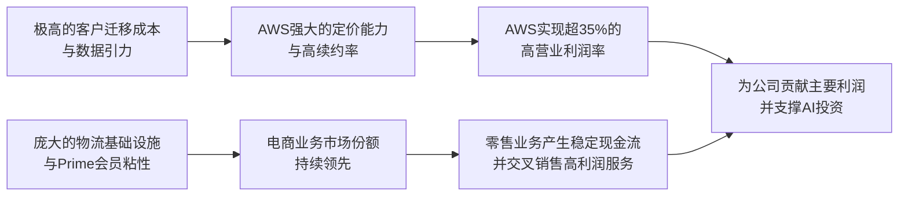

# Gangtise 公司一页通：亚马逊（AMZN.O）

> 拉取日期：2026-07-30 ｜ 来源：gangtise-agent `stock-one-pager`

## 公司概况

亚马逊是全球最大的电商平台和公有云服务商，业务按**北美、国际、AWS**三大分部运营。公司以电商零售为基石，通过Prime会员体系、FBA物流网络和第三方卖家服务构建了深厚的消费者生态；AWS则是全球市场份额领先的云计算平台，近年正通过自研AI芯片（Trainium）和战略绑定头部大模型公司（Anthropic、OpenAI）向AI基础设施层延伸。亚马逊已于2025年超越沃尔玛，成为全美销售额最大的零售商。  

## 公司近况跟踪

- **AWS加速增长，AI订单爆发**：2026年Q1，AWS营收同比增长**28%**至375.87亿美元，创15个季度以来最快增速。增长主要由AI需求驱动，当季AI相关年化收入运行率（ARR）已达**150亿美元**。公司与Anthropic和OpenAI达成的长期云服务协议，推动积压订单（RPO）在Q1末攀升至**3640亿美元**，若计入Q2新增的Anthropic超1000亿美元协议，总额已接近5000亿美元。   
- **自研芯片业务超预期放量**：定制芯片业务年收入运行率已突破**200亿美元**，同比增长三位数，跻身全球前三大数据中心芯片业务。Trainium 2芯片已基本售罄，Trainium 3接近满载，性价比优势（较同类GPU优**30%-40%**）正吸引OpenAI、Anthropic等头部客户签订长期算力采购协议。   
- **零售业务稳健，但消费呈现结构性变化**：2026年Q1，北美和国际分部营收分别同比增长**12%**和**19%**，单位销量增速达**15%**，为疫情后最高水平。但消费呈现“K型分化”和必需品导向，日常必需品占单位销量比重已从2025年末的**33%**升至**40%**。6月Prime Day期间，Adobe数据显示美国线上支出同比增长**9.3%**，但平均订单金额同比下降**11%**，显示消费者更趋价值敏感。    
- **资本开支大幅扩张，自由现金流承压**：公司维持2026年全年资本开支**2000亿美元**的指引，主要用于AWS的AI基础设施扩建。受此影响，截至Q1的过去12个月自由现金流骤降至**12.32亿美元**，较上年同期的259.25亿美元大幅收缩，引发市场对AI投资回报周期的关注。  
- **AI战略重大调整**：2026年7月，公司被曝正重组内部AI研发，逐步停止对多数Nova旗舰模型的重点开发，将资源集中于由Pieter Abbeel领导的下一代前沿基础模型（FMR）项目，预计在年底的re:Invent大会上亮相。此举标志着亚马逊AI策略从广泛布局转向集中突破。   

## 短期逻辑

1. **Q2财报（7月30日）将成为AI投入回报的“试金石”**：市场焦点已从AI资本开支的规模转向其产出效率。谷歌云Q2营收同比增**82%**但股价因资本开支上调和自由现金流转负而下跌，为亚马逊设定了严苛的参照系。亚马逊Q2的AWS营收增速（市场预期**31%-34%**）和积压订单增长（预计环比增超1000亿美元）是验证需求强度的关键。若AWS增速超预期且管理层能给出AI投资回报的清晰路径，将有效缓解市场对“烧钱”的担忧；反之，若资本开支再度上调而云增速不及预期，股价可能面临类似谷歌的压力。   

2. **Prime Day提前至Q2造成的“节奏差”**：2026年Prime Day从往年的Q3提前至6月，预计将**60-80亿美元**的销售额从Q3拉入Q2。这虽会提振Q2零售收入，但将导致Q3面临高基数压力。市场已对此有所预期，但若管理层给出的Q3营收指引因这一因素显著低于预期，可能被市场误读为零售动能放缓，构成短期扰动。  

3. **自研芯片Trainium的变现节点**：Trainium 3接近满载，且与OpenAI、Anthropic的协议中包含对Trainium芯片的采购承诺。Q2财报及电话会中，管理层对Trainium产能爬坡、客户迁移进度及利润率影响的任何增量信息，都可能成为股价的催化剂。市场正期待自研芯片从“成本中心”转向“利润中心”的明确信号。  

## 长期逻辑

1. **AI推理时代的“云厂商价值重估”**：AI正从训练时代迈向推理时代，核心矛盾从追求极致性能转向追求**算力性价比和生态丰富度**。亚马逊凭借自研Trainium芯片（成本优势）、EFA网络架构（推理延迟优化）和Bedrock平台（聚合第三方模型），有望在推理时代重获竞争优势。与Anthropic和OpenAI的战略绑定，不仅锁定了未来数年的算力需求，更使AWS成为AI模型训练和部署的核心基础设施，有望在AI产业链价值从硬件向云平台迁移的过程中获取更大份额。  

2. **电商护城河在AI时代依然稳固**：尽管AI购物助手可能重塑流量入口，但亚马逊的**物流履约体系（FBA）、庞大的第三方卖家生态和完整的交易闭环**构成了难以复制的结构性壁垒。公司正将AI深度整合进Alexa for Shopping，其推荐结果已呈现“去搜索排名化”特征（超**60%**的推荐商品不在自然排名前十），这有望将AI流量转化为新的变现手段，巩固其作为下一代AI电商入口的地位。  

3. **高利润业务驱动的结构性利润率扩张**：以广告和第三方卖家服务为代表的高利润率业务增速持续快于低利润率的自营零售。2026年Q1，广告服务营收同比增长**24%**。随着物流网络区域化重构完成，履约费用率趋于稳定，叠加高利润业务占比提升，北美零售业务的营业利润率有望从2025年的**6.9%**持续向中高个位数改善，为公司整体盈利能力提供支撑。  

## 风险提示

- **AI资本开支回报不及预期的风险**：公司2026年资本开支高达**2000亿美元**，导致自由现金流急剧收缩。若AWS的营收增速无法持续加速以消化新增产能，或自研芯片的性价比优势未能如期转化为利润率改善，市场将对巨额投资的回报产生质疑，进而压制估值。谷歌云Q2财报后股价的负面反应已为此敲响警钟。   
- **AI战略调整的执行风险**：公司近期裁撤AGI部门并大幅收缩自研Nova模型战线，转向集中资源攻坚单一前沿模型。这一战略收缩虽有助于聚焦，但也存在“押错技术路线”或前沿模型性能不及预期的风险，可能导致其在基础模型层竞争中掉队，过度依赖Anthropic等第三方模型。  
- **消费者支出疲软与宏观不确定性**：美国通胀韧性较强（5月CPI同比**4.2%**），消费者信心波动，支出呈现向低价必需品转移的趋势。Prime Day期间平均订单金额的下降已显端倪。若宏观经济进一步恶化，将直接冲击亚马逊的核心零售业务，并可能传导至广告业务，抵消利润率改善的趋势。  

## 近期要闻

- **2026年4月**：亚马逊宣布以约**109亿美元**收购卫星运营商Globalstar，旨在加速其Kuiper卫星互联网项目，并与苹果建立相关服务合作。  
- **2026年6月23-26日**：亚马逊举办第12届Prime Day，Adobe数据显示美国线上销售额达**264亿美元**，同比增长**9.3%**，但平均订单金额同比下降11%。  
- **2026年7月**：亚马逊被曝正在重组AI战略，逐步停止对多数Nova旗舰模型的开发，将资源集中于由Pieter Abbeel领导的新一代前沿模型项目。同时，公司向FCC提交申请，计划部署由**5105颗**卫星组成的手机直连卫星网络。   

## 未来催化

- **2026年7月30日**：亚马逊将发布2026年Q2财报。市场将重点关注AWS营收增速、积压订单增长、2026年资本开支指引是否上调以及管理层对AI投资回报的评论。  
- **2026年Q3**：亚马逊低轨卫星通信服务“Amazon Leo”预计将开始商业化运营。公司此前表示，一旦服务具备商业可行性，将把相关成本资本化，这有望改善报表利润。 
- **2026年Q4**：亚马逊年度re:Invent大会预计将发布其内部代号为“FMR”的新一代前沿基础模型，这将是检验其集中资源后AI研发实力的重要窗口。  

## 公司业务模式及拆分

### 业务边际变化

亚马逊正从一家以电商为主的零售公司，向以AI云服务为增长核心的科技巨头转型。传统电商业务通过物流区域化改革和拓展高毛利广告业务，聚焦于盈利能力的提升。AWS业务则全面转向AI，通过自研Trainium芯片和战略投资绑定Anthropic、OpenAI等头部模型公司，构建从底层算力到上层应用的AI全栈生态。同时，公司收缩了内部Nova模型等前景不明的业务，显示出战略聚焦的意图。  

### 盈利模式

亚马逊的盈利模式正从低毛利的“商品差价”模式，向高毛利的“服务费”和“算力/广告费”模式迁移。电商业务通过为第三方卖家提供交易平台和物流服务（FBA）收取佣金和履约费；AWS通过提供算力、存储和AI模型平台服务，按用量或预留实例收费；广告业务则通过为卖家提供商品推广服务获取收入。AWS和广告已成为公司利润的核心支柱。 

### 业务拆分

公司近年业务结构持续向高利润率服务倾斜。2025年，产品销售额占比**41.3%**，服务销售额占比**58.7%**。其中，AWS以**18%**的营收占比贡献了**57%**的营业利润，是绝对的利润引擎。广告服务是增速最快的业务之一，营收占比已近**10%**。公司目前处于AI驱动的资本开支扩张期，短期利润率和现金流承压，但意在换取AWS的长期增长空间。  

**细分业务拆分（按收入类型）**

| 项目 (百万美元) | FY2024 | FY2025 | FY2025 占比 | FY2026 Q1 | FY2026 Q1 同比 |
| :--- | :--- | :--- | :--- | :--- | :--- |
| **营业收入** | **637,959** | **716,924** | **100%** | **181,519** | **16.6%** |
| 线上自营 | 247,029 | 269,287 | 37.6% | 64,254 | 11.9% |
| 实体门店 | 21,215 | 22,561 | 3.1% | 5,785 | 4.6% |
| 第三方卖家服务 | 156,146 | 172,162 | 24.0% | 41,578 | 13.9% |
| 广告服务 | 56,214 | 68,635 | 9.6% | 17,243 | 23.9% |
| 订阅服务 | 44,374 | 49,619 | 6.9% | 13,427 | 14.6% |
| **AWS** | **107,556** | **128,725** | **18.0%** | **37,587** | **28.4%** |
| 其他 | 5,425 | 5,935 | 0.8% | 1,645 | 25.4% |

**细分业务最新季度表现（2026年Q1）**

- **线上自营**：营收642.54亿美元，同比增长**11.9%**。增长主要由单位销量增长驱动，但部分被产品组合向低价必需品转移所抵消。公司持续投资于“一日达”和“即时达”配送服务，以提升客户体验和购买频率。  
- **第三方卖家服务**：营收415.78亿美元，同比增长**13.9%**。第三方卖家销量占比已达**60%**，是驱动电商生态丰富度和营收增长的核心动力。FBA物流服务是此部分收入的重要组成部分。  
- **广告服务**：营收172.43亿美元，同比增长**23.9%**。受益于电商平台流量变现和Prime Video广告的拓展，广告业务持续保持高速增长，是公司利润率改善的关键驱动力。  
- **AWS**：营收375.87亿美元，同比增长**28.4%**，增速环比提升4个百分点。增长主要受益于AI需求激增和企业工作负载迁移加速。营业利润141.61亿美元，利润率**37.7%**，虽受折旧和股权激励影响环比有所下降，但仍是公司最盈利的业务。  

## 核心竞争力

**竞争要素 1：依托极高转换成本和规模效应构筑的云生态粘性**

- **护城河定性**：**结构性护城河**。AWS作为全球最大的公有云平台，其护城河源于庞大的客户基础、丰富的PaaS层工具、以及与企业客户在数据存储和业务流程上的深度绑定。一旦企业将大量工作负载和数据迁移至AWS，迁移成本极高，形成了强大的客户粘性。 
- **数据验证**：AWS的积压订单（RPO）在2026年Q1末高达**3640亿美元**，同比增长**93%**，这些多为多年期合同，锁定了未来收入。AWS的营业利润率长期维持在**35%**以上，显著高于零售业务，体现了其强大的定价能力和规模效应。  
- **动态演变**：**护城河变宽**。在AI时代，AWS通过自研Trainium芯片和Bedrock平台，正将服务从IaaS层向上延伸至PaaS和MaaS层，进一步加深了与客户的技术绑定。与Anthropic和OpenAI的战略合作，不仅带来了巨额算力订单，也使AWS成为下一代AI应用开发的核心平台，生态粘性进一步增强。  

**竞争要素 2：依托物流基础设施和Prime会员体系构筑的电商生态壁垒**

- **护城河定性**：**结构性护城河**。亚马逊通过数十年的巨额投入，构建了全球规模最大、效率最高的电商物流网络（FBA）。结合Prime会员体系，形成了“更优选择、更低价格、更快配送”的飞轮效应，竞争对手在短期内难以复制。  
- **数据验证**：2025年，亚马逊全球“当日达/次日达”配送商品超**130亿**件。第三方卖家服务中，大部分使用了FBA物流，贡献了约**60%**的销量。Prime会员的续费率极高，其消费能力远超非会员，构成了稳定的营收基本盘。 
- **动态演变**：**护城河维持**。尽管面临沃尔玛等竞争对手的挑战，但亚马逊在配送速度和数字化体验上仍保持领先。公司正将物流网络开放给非平台商家（Amazon Shipping），通过提升网络利用率来进一步降低成本，强化其物流基础设施的规模优势。  

**现阶段核心驱动力总结**：亚马逊的Alpha在于AWS在AI时代的二次增长曲线和电商业务的利润改善，Beta则在于全球企业IT支出向云端迁移和电商渗透率持续提升的长期趋势。 

**竞争格局传导逻辑图**

## 产销链

- **客户情况**：亚马逊服务消费者、第三方卖家和企业客户，客户基础极为分散。作为平台，其议价能力较强。但AWS业务中，Anthropic和OpenAI正成为越来越重要的单一客户。公司与两者签订了总额超**1380亿美元**的多年期合作协议，虽锁定了长期需求，但也带来了客户集中度风险。  
- **供应商情况**：电商业务供应商主要为品牌商和制造商，集中度低。AWS业务的供应商则高度集中于芯片（英伟达、AMD及自研）、服务器和网络设备制造商。公司正通过自研Trainium芯片来降低对英伟达GPU的依赖，以增强供应链议价能力并控制成本。  
- **经销商情况**：亚马逊主要采用直销模式，无传统经销商网络。 
- **成本传导**：亚马逊赚取的主要是“服务费”和“算力费”。当上游芯片、存储和能源成本上升时，AWS具备一定的成本转嫁能力（如近期对EC2部分实例提价**20%**）。电商业务的物流成本（燃油、人工）上升时，公司可通过提升运营效率、向卖家收取FBA费用等方式部分消化，但若成本上涨过快，仍会对短期利润率造成压力。  

## 财务数据

**关键财务数据**

| 项目 (百万美元) | FY2023 | FY2024 | FY2025 | FY2026 Q1 |
| :--- | :--- | :--- | :--- | :--- |
| **截止日期** | 2023-12-31 | 2024-12-31 | 2025-12-31 | 2026-03-31 |
| **营业收入** | 574,785 | 637,959 | 716,924 | 181,519 |
| 营收同比 | 11.8% | 11.0% | 12.4% | 16.6% |
| 营业成本 | 304,739 | 326,288 | 356,414 | 87,463 |
| **毛利** | 270,046 | 311,671 | 360,510 | 94,056 |
| 毛利率 | 47.0% | 48.9% | 50.3% | 51.8% |
| **营业利润** | 36,852 | 68,593 | 79,975 | 23,852 |
| 营业利润率 | 6.4% | 10.8% | 11.2% | 13.1% |
| **归母净利润** | 30,425 | 59,248 | 77,670 | 30,255 |
| 归母净利润同比 | 1217.7% | 94.7% | 31.1% | 76.7% |
| 稀释每股收益 (美元) | 2.90 | 5.53 | 7.17 | 2.78 |
| **自由现金流** | - | 38,219 | 11,194 | 1,232 (TTM) |

**财务分析**

- **成长能力**：公司营收增速在2026年Q1重新加速至**16.6%**，主要由AWS（+28.4%）和广告服务（+23.9%）驱动。这表明公司已成功从疫情后的增长放缓中走出，找到了新的增长引擎。归母净利润在2026年Q1同比增长**76.7%**，但其中包含了对Anthropic投资的**168亿美元**税前估值收益，剔除后核心利润增长依然稳健。  
- **盈利能力**：毛利率和营业利润率持续改善，2026年Q1分别达到**51.8%**和**13.1%**。这得益于高利润率的AWS和广告业务占比提升，以及电商物流效率的改善。然而，随着AI资本开支的扩大，折旧费用将显著增加，未来可能对利润率构成压力。  
- **现金流状况**：经营活动现金流依然强劲，但巨额资本开支导致自由现金流急剧恶化。截至2026年Q1的过去12个月自由现金流仅为**12.32亿美元**。这是当前市场对亚马逊最大的担忧，即AI投资的“失血”速度过快，而回报周期尚不明确。公司已通过大规模发债（年内累计超**920亿美元**）来补充资金，但融资成本上升和杠杆率增加是潜在风险。   

## 行业及竞争分析

**云计算行业**：亚马逊AWS所处的公有云市场正进入AI驱动的二次增长期。传统工作负载迁移叠加AI大模型训练和推理的爆发式需求，使市场规模急剧膨胀。行业竞争格局呈现“一超多强”局面，AWS虽保持份额领先，但微软Azure凭借与OpenAI的深度绑定增长迅猛，谷歌云也凭借自研TPU和AI能力加速追赶。AI云计算的竞争核心正从单纯的算力规模，转向**自研芯片能力、模型平台生态和全栈技术整合能力**。  

**电商行业**：美国电商渗透率仍在稳步提升，2026年预计达**24.2%**。亚马逊以约**47%**的市场份额稳居第一，但面临沃尔玛在线上杂货领域的激烈竞争，以及Temu、SHEIN等中国跨境电商平台在低价品类的冲击。行业竞争焦点在于价格、配送速度和用户体验。AI购物助手的兴起可能重塑流量入口，对传统货架电商模式构成长期挑战。  

**可比公司**

| 可比公司 | 股票代码 | 对标维度 | 分析 |
| :--- | :--- | :--- | :--- |
| 微软 | MSFT | 云服务 (Azure) | 在AI领域与OpenAI深度绑定，Azure AI服务增长迅猛，是企业级AI服务的强劲对手。 |
| 谷歌 | GOOGL | 云服务 (GCP)、广告 | GCP在AI和数据分析领域有差异化优势，广告业务是亚马逊广告的直接竞争对手。 |
| 沃尔玛 | WMT | 电商零售 | 美国第二大零售商，在线上杂货和全渠道零售方面是亚马逊最直接的竞争对手。 |

**总结分析**：亚马逊在电商和云计算两大市场均面临激烈竞争。在云计算领域，其先发优势和生态规模依然强大，但微软和谷歌正借助AI势头追赶。在电商领域，其物流护城河依然稳固，但需应对来自沃尔玛的全渠道竞争和新兴低价平台的挑战。AI购物助手的出现，可能使拥有强大AI模型的谷歌和微软在电商流量入口上获得新的优势，这是亚马逊长期需要应对的战略威胁。  

## 市场焦点议题

**议题一：AI资本开支的规模与回报**

- **背景**：亚马逊2026年资本开支指引高达**2000亿美元**，导致自由现金流急剧萎缩。市场担忧如此庞大的投资能否带来相应的回报，尤其是在谷歌云营收大增但股价仍因资本开支问题下跌之后。   
- **问题列表**：
  - AWS的营收增速能否持续加速，以证明巨额投入的合理性？
  - 自研Trainium芯片何时能对利润率产生显著的正面影响？
  - 管理层是否会因宏观或供应链压力而调整2026年或未来的资本开支计划？

**议题二：AWS在AI时代的竞争地位**

- **背景**：微软Azure凭借OpenAI的先发优势在AI云市场占据领先身位，谷歌云也凭借自研TPU和Gemini模型加速追赶。市场关注AWS能否凭借自研芯片和与Anthropic的合作实现“后发先至”。  
- **问题列表**：
  - AWS与Anthropic和OpenAI的合作，能否有效转化为市场份额的提升？
  - Bedrock平台在模型聚合生态中的竞争力如何？
  - 面对Azure和GCP的竞争，AWS的定价策略和利润率趋势将如何演变？

**议题三：AI对电商业务的重塑与潜在颠覆**

- **背景**：AI购物助手（如Alexa for Shopping）正在改变消费者的商品发现和购买路径，其推荐逻辑已开始脱离传统搜索排名。市场关注这一趋势将如何影响亚马逊电商业务的护城河和变现模式。  
- **问题列表**：
  - AI推荐流量的增长，是会强化还是削弱亚马逊的电商平台地位？
  - 亚马逊如何将AI购物助手带来的流量有效变现，而不冲击现有的广告业务？
  - 谷歌、OpenAI等拥有强大AI模型的公司，是否会通过AI助手对亚马逊的电商入口构成实质性威胁？

## 市场分歧探讨

**核心分歧：当前巨额AI资本开支，是构筑长期护城河的战略性投资，还是正在形成一场回报不确定的“军备竞赛”？**

- **乐观方观点**：认为这是亚马逊抢占AI时代基础设施制高点的必要投入。依据是：1）积压订单（RPO）高达**4640亿美元**，表明需求真实且强劲，当前是供给不足而非需求不足；2）自研Trainium芯片已展现出明确的性价比优势，随着产能爬坡，将从成本端和收入端双重改善AWS的盈利模型；3）历史经验表明，亚马逊在物流网络等重大投资周期后，总能迎来利润率的显著改善，AI投资有望复制这一路径。  
- **谨慎方观点**：认为投资规模过大且回报路径不清晰，风险收益比正在恶化。依据是：1）自由现金流已接近枯竭，公司被迫大规模发债，在利率高企的环境下增加了财务风险；2）AI技术迭代极快，巨额投资的数据中心可能面临资产减值的风险；3）竞争对手（微软、谷歌）同样在激进投资，这场“军备竞赛”可能导致行业整体利润率被长期压制，任何一家都难以获得超额回报。   

**总结分析**：当前分歧的本质在于对AI需求持续性和亚马逊执行能力的判断差异。乐观方更看重需求端的确定性和亚马逊的长期战略执行力；谨慎方则更关注供给端资本开支的纪律性和短期财务压力。从现有数据看，积压订单的强劲增长为乐观方提供了有力支撑，但自由现金流的快速恶化也印证了谨慎方的担忧。Q2财报中AWS的增速和积压订单的增长将是验证双方逻辑的关键数据。 

## 盈利预测与估值

**管理层最新指引**：2026年Q2，管理层预计营收在**1940亿至1990亿美元**之间，同比增长**16%至19%**；预计营业利润在**200亿至240亿美元**之间。  

**券商盈利预测与估值**

| 机构 | 评级 | 目标价(美元) | 财务指标 | FY2025A | FY2026E | FY2027E |
| :--- | :--- | :--- | :--- | :--- | :--- | :--- |
| 杰富瑞 (2026-07-14) | 买入 | 320 | 营收(百万美元) | 716,924 | 828,452 | 941,192 |
| | | | EPS(美元) | 7.17 | 9.13 | - |
| 摩根大通 (2026-06-29) | 增持 | 330 | 营收(百万美元) | 716,924 | 823,986 | 934,188 |
| | | | EPS(美元) | 7.17 | 10.89 | 12.50 |
| 美国银行 (2026-07-28) | 买入 | 310 | 营收(百万美元) | 716,924 | 830,659 | 957,053 |
| | | | EPS(美元) | 7.17 | 15.81 | 9.85 |
| 汇丰 (2026-07-15) | 买入 | 310 | 营收(百万美元) | 716,924 | 810,711 | 899,412 |
| | | | EPS(美元) | 7.17 | 8.85 | 9.82 |
| 富国证券 (2026-07-09) | 增持 | 313 | 营收(百万美元) | 716,924 | 831,488 | 963,564 |
| | | | EPS(美元) | 7.17 | 9.23 | 10.44 |
| 高盛 (2026-07-08) | 买入 | 335 | 营收(百万美元) | 716,924 | 827,600 | 952,884 |
| | | | EPS(美元) | 7.17 | 8.85 | 10.15 |

**盈利预测与估值分析**：主流机构对亚马逊一致看好，评级均为“买入”或“增持”，目标价集中在**310-335美元**区间。机构普遍预计2026年营收增速在**13%-16%**之间，AWS是核心增长引擎。估值方法上，由于公司业务多元且利润结构差异巨大，多采用**分部估值法（SOTP）**，对AWS给予更高估值倍数（如10倍PS或29倍EBIT），对零售业务则采用较低的PS或EBIT倍数。机构间对2026年EPS的预测差异较大（如美国银行预测15.81美元，汇丰预测8.85美元），主要源于对Anthropic等股权投资公允价值变动计入损益的假设不同。剔除这一非现金项目后，市场对核心业务盈利的预期相对一致。
