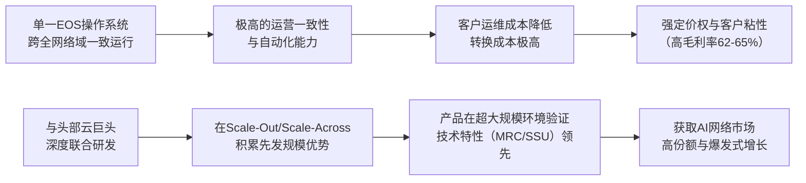

<!-- 匹配到的证券/行业：Arista Networks(ANET.N) -->
操作成功

### 一页通 （Arista Networks (ANET.N)）
日期：2026-08-06
内容："""
## 公司概况

Arista Networks 是全球数据驱动型云网络解决方案的领导者，专注于大型AI、数据中心、园区及路由环境下的客户端到云端网络连接。公司的核心产品是基于自研可扩展操作系统（EOS）的以太网交换和路由平台，其解决方案以高可靠性、开放标准及智能自动化能力形成差异化。Arista 在高速以太网交换机市场占据领先地位，客户覆盖全球主要的云与AI巨头、AI及专业服务提供商以及大型企业。  

## 公司近况跟踪

- <strong>Q2业绩与全年指引大幅超预期</strong>：公司2026年Q2营收首次突破30亿美元，达<strong>30.36亿美元</strong>，同比增长<strong>37.7%</strong>，远超此前28亿美元的指引。得益于供应链改善和强劲需求，公司将2026年全年营收指引大幅上调至约<strong>126亿美元</strong>，对应同比增长约<strong>40%</strong>，较此前115亿美元的指引增加11亿美元。   

- <strong>供应链紧张显著缓解</strong>：管理层表示，通过多源采购策略、扩大供应商资格认证、签订多年期采购承诺（Q2末达<strong>97亿美元</strong>）等措施，组件供应有所改善。尽管行业供应紧张预计持续至2028年，但公司针对性举措已在下半年显现成效，这成为上调全年指引的主要驱动力。   

- <strong>AI网络客户与产品里程碑</strong>：AI网络平台Etherlink累计客户数已<strong>超过100家</strong>。公司推出新一代7060XE7系列交换机，具备100T+容量和1.6T吞吐量，并首次提供液冷选项，预计2026年下半年在少数大客户试用，2027年大规模量产。  

- <strong>Scale-Across业务成为新增长极</strong>：公司首次量化Scale-Across（跨数据中心互联）业务贡献，预计2026年该业务收入将占AI总收入（至少35亿美元）的约<strong>30%</strong>，即约<strong>12亿美元</strong>。管理层预计到2030年，该市场TAM将达<strong>150亿至200亿美元</strong>。  

- <strong>上调运营利润率目标</strong>：公司将2026年全年Non-GAAP运营利润率目标上调至<strong>48%至49%</strong>（此前为46%），显示出在营收规模扩张的同时，经营杠杆效应持续释放。  

## 短期逻辑

1.  <strong>供应链改善驱动的业绩预期差修复</strong>：Q1业绩后，市场因公司对供应链和毛利率的保守展望而反应负面。然而，Q2公司以实际行动证明供应链执行正在改善，并据此大幅上调全年营收指引。这一根本性的预期差修复是未来一个季度股价的核心驱动力。管理层在电话会上详细阐述了在芯片、内存、PCB、光模块乃至液冷供应链上的具体进展和产能保障，这直接回应了市场最大的担忧，为估值修复提供了坚实基础。  

2.  <strong>营收增速重新加速，打破增长放缓叙事</strong>：公司Q2营收同比增长37.7%，且Q3指引为同比增长43%，全年指引上调至40%增长。这打破了此前市场关于其增速可能放缓至20%中段的担忧。增长加速主要由AI网络（Scale-Out和Scale-Across）的强劲需求以及传统数据中心前端业务的恢复性增长共同驱动。营收增速的重新加速有望推动其估值倍数向历史中枢回归甚至扩张。  

3.  <strong>Scale-Across业务从概念走向实质性收入贡献</strong>：公司首次明确Scale-Across业务的收入体量（2026年约12亿美元）和巨大市场空间（2030年TAM 150-200亿美元）。这验证了AI网络需求正从单一数据中心内部互联向多数据中心分布式互联延伸，而Arista凭借其在EOS软件、SRv6、深度缓冲等领域的优势，在该高壁垒市场占据“事实标准”地位。该业务的快速增长将为公司开启一个全新的、高价值的长期增长赛道。  

## 长期逻辑

1.  <strong>AI网络架构演进下的结构性受益者</strong>：AI工作负载正驱动网络架构发生根本性变革，从传统的Scale-Out向Scale-Up和Scale-Across多维扩展。Arista是唯一在三大架构中均有可信产品路线图的厂商。随着以太网在AI后端网络中逐步取代InfiniBand成为主流，以及Scale-Across需求因算力、电力分布式部署而爆发，公司可触达市场（TAM）预计将从2025年的约600亿美元增长至2029年的<strong>1050亿美元以上</strong>。公司凭借EOS的统一软件架构和硬件性能，有望在这一长期趋势中持续获取份额。  

2.  <strong>EOS软件生态构筑的结构性护城河</strong>：Arista的核心竞争力并非单一硬件优势，而是其自研的可扩展操作系统（EOS）。EOS作为单一Linux二进制镜像，可跨数据中心、园区、路由和AI后端网络一致运行，为客户提供了极高的运营一致性、自动化和可编程能力。这种“一个操作系统，所有网络域”的模式，在AI网络日益复杂、对运维和可靠性要求极高的背景下，其价值正转化为客户粘性和定价权，构成了竞争对手难以在短期内复制的结构性护城河。  

3.  <strong>多元化增长引擎的接力</strong>：公司已形成清晰的增长梯队。短期内，AI网络（尤其是Scale-Out和Scale-Across）是核心增长引擎。中期看，园区网络业务正迎来收获期，2026年收入目标为<strong>至少12.5亿美元</strong>，同比增长超55%，在Gartner魔力象限中首次进入领导者象限，有望持续从思科等传统厂商手中夺取市场份额。长期看，随着企业AI应用的普及，传统数据中心前端网络将迎来新一轮升级周期，为公司提供更持久的增长动力。这种多业务接力的模式增强了公司长期增长的确定性和韧性。  

## 风险提示

- <strong>供应链与成本压力</strong>：尽管有所改善，但全行业供应紧张预计将持续至2028年，涉及晶圆、先进内存、光模块DSP等多个环节。公司为保障供应而签订的巨额采购承诺（97亿美元）和支付更高价格，将持续对毛利率构成压力。若成本上涨无法有效传导，或供应再次恶化，将影响公司盈利能力和出货节奏。  

- <strong>客户集中度风险</strong>：公司业务高度依赖少数大型云客户。2025年，微软和Meta两家客户合计贡献了约<strong>42%</strong> 的收入。任何一家大客户因资本开支周期、技术路线变更或内部自研方案而减少采购，都将对公司营收产生重大影响。尽管公司预计2026年将新增1-2个10%以上客户，但客户集中度风险依然显著。  

- <strong>竞争加剧</strong>：在AI网络这一高增长市场，公司面临来自英伟达（Spectrum-X平台，提供垂直整合方案）、思科、以及白盒交换机厂商的多维度竞争。英伟达凭借其GPU的强势地位，在部分客户中推行捆绑销售策略，可能挤压Arista的市场空间。同时，竞争对手也在加大高密度、高基数交换机领域的投入，市场竞争格局可能恶化。  

## 近期要闻

- <strong>2026年5月</strong>：公司发布Q1 2026财报，营收同比增长35.1%，但市场因管理层对供应链紧张和毛利率压力的保守评论而反应负面，股价承压。  
- <strong>2026年6月</strong>：Arista CEO在投资者会议上重新框定毛利率预期，强调62-64%的全年指引已包含供应链成本上升的影响，并重申增长目标，市场情绪逐步回稳。 
- <strong>2026年8月4日</strong>：公司发布Q2 2026财报，营收首次突破30亿美元，同比增37.7%，并大幅上调全年营收指引至126亿美元（+40% YoY），同时上调运营利润率目标，股价盘后大涨超11%。  

## 未来催化

- <strong>2026年8月至10月</strong>：主要云客户（如微软、Meta）发布季度财报，其资本开支指引和AI基础设施建设的相关评论，将为Arista的未来需求提供更明确的前瞻性信号。 
- <strong>2026年下半年</strong>：公司1.6T交换机产品开始在关键大客户处进行试用。若试用反馈积极并转化为规模订单，将开启新一轮产品升级周期，为2027年及以后的增长提供强劲动力。  
- <strong>2026年下半年</strong>：公司有望正式宣布新增1-2个占收入比超过10%的大型客户。新客户的落地将直接验证公司客户多元化的战略，并显著降低市场对其客户集中度风险的担忧。 

## 公司业务模式及拆分

### 业务边际变化

公司正经历从传统数据中心交换机厂商向“AI网络平台”公司的转型。业务重心已从连接服务器和存储的“前端网络”显著转向连接GPU等加速器的“后端AI网络”。同时，公司正积极横向拓展至园区网络、路由和网络安全等相邻市场，并通过VeloCloud收购补全了SD-WAN产品线。技术路径上，公司在Scale-Out领域持续领先，并开始大力布局Scale-Across（跨数据中心互联）和Scale-Up（机架内互联）市场，产品组合和技术储备日益完善。  

### 盈利模式

公司盈利模式的核心是<strong>通过技术壁垒和软件生态实现产品溢价</strong>。Arista并非简单的硬件“盒子”销售商，其价值核心在于自研的EOS操作系统和CloudVision管理平台。客户购买的是包含高性能硬件、统一操作系统、自动化软件和全球支持在内的整体解决方案。这种“软硬一体”的模式，使其产品在性能、可靠性和运维效率上优于白盒交换机，从而能够维持显著高于行业平均水平的毛利率和客户粘性。  

### 业务拆分

公司近年业务结构发生显著变化，AI相关收入从2024年的约3.88亿美元（占收比6%）爆发式增长至2025年的15亿美元，并预计在2026年达到至少35亿美元，成为第一大收入板块。传统数据中心前端网络增速相对放缓，而园区网络作为第二增长曲线，正进入快速增长期。公司当前处于由AI驱动的<strong>业绩加速兑现期</strong>。  

公司自2025年起采用新的业务分类口径，将业务分为“核心（AI、云和数据中心网络）”、“认知邻接（园区和路由）”和“认知网络（软件和服务）”三大类。由于历史数据未完全按此口径重述，下表基于公司披露的客户和产品类别信息进行展示。 

<strong>细分业务收入拆分（单位：亿美元）</strong>

| 业务板块 | FY2024 收入 | FY2024 占比 | FY2025 收入 | FY2025 占比 | FY2026E 目标 | 备注 |
| :--- | :--- | :--- | :--- | :--- | :--- | :--- |
| <strong>核心（云与AI网络）</strong> | 约49.51 | 约71% | 约58.50 | 约65% | - | 含AI和传统数据中心前端 |
| 其中：AI网络 | 约3.88 | 约6% | 15.00 | 约17% | >35.00 | 2026年目标 |
| <strong>认知邻接（园区与路由）</strong> | 约10.50 | 约15% | 约16.20 | 约18% | - | - |
| 其中：园区网络 | 约5.59 | 约8% | 8.00 | 约9% | >12.50 | 2026年目标 |
| <strong>认知网络（软件与服务）</strong> | 约10.02 | 约14% | 约15.30 | 约17% | - | 含服务收入 |
| <strong>总营收</strong> | <strong>70.03</strong> | <strong>100%</strong> | <strong>90.06</strong> | <strong>100%</strong> | <strong>约126.00</strong> | 2026年全年指引 |

*注：FY2024和FY2025的分项数据根据公司披露的百分比估算。*

<strong>AI网络业务（2026年Q2）</strong>：该业务是公司当前最核心的增长引擎，涵盖Scale-Out（集群内互联）和Scale-Across（跨数据中心互联）两大场景。Q2产品收入同比增长<strong>38.8%</strong>，主要由AI和云客户驱动。公司表示，Scale-Across业务在2026年AI收入中占比约<strong>30%</strong>，即约12亿美元，增长极为迅速。该业务技术壁垒高，需解决长距离、高带宽、低延迟和安全加密等复杂问题，Arista的EOS和深度缓冲交换机在此领域具有统治力。  

<strong>园区网络业务（2026年Q2）</strong>：该业务是公司多元化战略的重点，产品涵盖园区交换机、Wi-Fi接入点和SD-WAN。2026年目标为<strong>至少12.5亿美元</strong>，同比增长超55%。Q2公司未单独披露该业务数据，但管理层表示所有业务板块收入均在增长。公司凭借统一EOS操作系统带来的自动化、安全性和运维简化优势，正从思科、HPE等传统厂商手中持续夺取市场份额，并首次进入Gartner有线无线局域网基础设施魔力象限的领导者象限。  

<strong>传统数据中心前端网络与路由业务（2026年Q2）</strong>：该业务是公司的传统优势领域，主要服务于云巨头和大型企业的通用计算和存储网络需求。在经历了几个季度的平稳增长后，管理层在Q2电话会中明确指出，上调的全年营收指引中，有相当一部分来自该业务的恢复性增长。这表明随着客户AI基础设施建设的推进，对传统前端网络的配套投资正在回暖。  

## 核心竞争力

<strong>竞争要素 1：依托EOS统一软件架构构筑的高转换成本与运营粘性</strong>

-   <strong>护城河定性</strong>：<strong>结构性护城河</strong>。Arista的核心竞争力在于其自研的EOS，这是一个单一Linux二进制镜像，可跨数据中心、园区、路由和AI后端网络一致运行。这种“一个操作系统，所有网络域”的架构，为客户提供了统一的自动化、遥测和运维体验，极大降低了网络复杂性。一旦客户将网络运营体系建立在EOS之上，其迁移和替换成本极高，形成了强大的客户粘性。  
-   <strong>数据验证</strong>：公司毛利率长期维持在<strong>62%-65%</strong> 的高位，远超白盒交换机厂商（通常低于30%），也高于思科等传统竞争对手，这直接体现了其软件和系统级解决方案的溢价能力。公司净推荐值（Net Promoter Score）高达<strong>89</strong>，反映了极高的客户满意度和忠诚度。  
-   <strong>动态演变</strong>：护城河正在<strong>变宽</strong>。随着AI网络向Scale-Across等更复杂场景演进，对网络操作系统的可编程性、可靠性和自动化能力要求呈指数级上升。EOS作为统一平台的架构优势愈发凸显，而白盒方案或传统厂商的多操作系统方案在应对这些复杂需求时显得力不从心，Arista的领先地位有望进一步巩固。 

<strong>竞争要素 2：在AI网络关键架构（Scale-Out/Scale-Across）的先发规模与技术优势</strong>

-   <strong>护城河定性</strong>：<strong>结构性护城河</strong>。公司在AI网络的Scale-Out（集群内）和Scale-Across（跨集群）两大核心领域均占据了先发优势和技术领先地位。通过早期与头部云巨头（微软、Meta）的深度联合研发，公司产品已在超大规模生产环境中得到验证，并积累了超过100家AI网络客户。这种在大规模部署中积累的经验、优化的软件特性（如MRC、SSU）和建立的信任，构成了强大的先发壁垒。  
-   <strong>数据验证</strong>：公司AI网络收入从2024年的约3.88亿美元爆发式增长至2025年的15亿美元，并预计在2026年达到<strong>至少35亿美元</strong>，两年增长近10倍。在Scale-Across市场，公司预计2026年收入约12亿美元，而该市场当前总规模仅30-40亿美元，显示出极高的市场份额。公司采购承诺从一年前的36亿美元飙升至Q2末的<strong>97亿美元</strong>，也侧面印证了其需求的确定性和规模。  
-   <strong>动态演变</strong>：护城河正在<strong>巩固</strong>。随着AI集群规模从万卡向百万卡级别演进，以及Scale-Across成为解决电力、空间限制的必然选择，Arista在这些高壁垒领域的优势将持续扩大。竞争对手（如英伟达）虽然在Scale-Up领域有优势，但在Scale-Out和Scale-Across的开放以太网生态中，Arista的深度和广度难以被轻易复制。 

<strong>现阶段核心驱动力总结</strong>：公司的Alpha来源于其EOS软件生态构筑的结构性护城河和在AI网络关键赛道的先发技术优势，这使其能够持续获取超越行业平均水平的市场份额和利润。其Beta则高度挂钩于全球云和AI巨头的资本开支周期，尤其是AI基础设施的建设浪潮。当前，公司正处于Alpha（份额提升、新业务拓展）和Beta（AI资本开支上行周期）共振的有利阶段。 

<strong>竞争格局传导逻辑图</strong>：

## 产销链

### 客户情况

-   <strong>主要客户</strong>：公司客户集中度较高。2025年，来自微软和Meta的收入分别占总收入的<strong>26%</strong> 和<strong>16%</strong>，合计<strong>42%</strong>。这两家客户是公司的长期战略合作伙伴。公司预计2026年将新增1-2个占收入比超过10%的客户，市场普遍预期为Oracle和Anthropic。这种高集中度意味着任何单一大客户的资本开支波动或技术路线变更都可能对公司业绩产生显著影响。  
-   <strong>新客户</strong>：公司正积极拓展客户群。在AI和专业服务提供商（Neo Cloud）领域表现突出，已与Anthropic、Oracle等建立了深度合作关系。其中，与Anthropic的合作覆盖其3GW计算集群的Scale-Out和Scale-Across网络，预计在2026至2028年间贡献超过<strong>30亿美元</strong>的增量收入。在园区市场，公司正通过渠道合作伙伴获取大量新企业客户。  

### 供应商情况

-   <strong>供应商集中度与依赖</strong>：公司对关键组件供应商存在显著依赖。其交换芯片主要依赖<strong>博通（Broadcom）</strong>，属于单一供应商依赖。此外，在先进内存（HBM）、5nm/3nm晶圆制造（台积电）、光模块DSP等环节也面临供应商集中的风险。  
-   <strong>成本结构与应对</strong>：公司的成本主要由向第三方合同制造商（Jabil、Sanmina、Foxconn）支付的采购费用构成。为应对供应链紧张和成本上涨，公司采取了签订长期采购承诺（Q2末达<strong>97亿美元</strong>）、扩大供应商资格认证（如内存、PCB）、甚至自建液冷供应链等策略。管理层表示，为保障供应，短期内愿意接受一定的成本上涨，但也会通过适度提价来传导压力。  

### 经销商情况

公司采用直销与渠道相结合的销售模式。渠道合作伙伴包括分销商、增值经销商和系统集成商。公司通过Arista Partner Program与渠道伙伴协作，由合作伙伴负责拓展客户覆盖范围，尤其是在企业园区市场。公司通常是在合作伙伴获得最终客户订单后才接受订单，因此渠道库存风险较低。 

<strong>产业链议价力总结</strong>：公司赚取的是<strong>技术溢价和软件生态溢价</strong>。面对上游，由于依赖博通等核心供应商，议价能力相对受限，需通过长期协议和战略合作来保障供应。面对下游大型云客户，由于客户采购规模巨大，公司面临较大的定价折扣压力，这在其毛利率的波动中有所体现。然而，公司通过EOS的独特价值，成功将自身从单纯的硬件供应商转变为关键任务网络平台的提供者，从而在整体上维持了强大的盈利水平。 

## 财务数据

<strong>关键财务数据（单位：亿美元）</strong>

| 项目 | FY2023 | FY2024 | FY2025 | FY2026 H1 |
| :--- | :--- | :--- | :--- | :--- |
| <strong>截止日期</strong> | 2023-12-31 | 2024-12-31 | 2025-12-31 | 2026-06-30 |
| <strong>营业总收入</strong> | 58.60 | 70.03 | 90.06 | 57.45 |
| 收入同比 | 33.75% | 19.50% | 28.60% | 36.47% |
| 营业成本 | 22.30 | 25.12 | 32.37 | 21.58 |
| <strong>毛利润</strong> | 36.30 | 44.91 | 57.69 | 35.87 |
| <strong>毛利率</strong> | 61.95% | 64.13% | 64.06% | 62.44% |
| 研发费用 | 8.55 | 9.97 | 12.37 | 6.92 |
| 销售及管理费用 | 5.18 | 5.50 | 6.75 | 3.59 |
| <strong>营业利润</strong> | 22.57 | 29.45 | 38.56 | 25.36 |
| <strong>营业利润率</strong> | 38.52% | 42.05% | 42.82% | 44.14% |
| <strong>归母净利润</strong> | 20.87 | 28.52 | 35.11 | 22.36 |
| 归母净利润同比 | 54.34% | 36.64% | 23.12% | 31.32% |
| <strong>稀释每股收益（美元）</strong> | 1.65 | 2.23 | 2.75 | 1.75 |
| 经营活动现金流净额 | 20.34 | 37.08 | 43.72 | 27.77 |
| 自由现金流 | 19.99 | 36.76 | 42.52 | 26.93 |

*注：自由现金流 = 经营活动现金流净额 - 资本性支出。FY2026 H1数据为截至2026年6月30日的6个月累计数据。*

### 财务分析

-   <strong>成长能力</strong>：公司营收增速在FY2024经历短暂放缓至<strong>19.50%</strong> 后，于FY2025重新加速至<strong>28.60%</strong>，并在FY2026 H1进一步攀升至<strong>36.47%</strong>。这一加速主要由AI网络业务的爆发式增长驱动，显示出公司已进入新一轮由AI驱动的业绩高速增长期。归母净利润增速在FY2025有所放缓（+23.12%），主要受税率提升影响，但FY2026 H1已回升至<strong>31.32%</strong>。  

-   <strong>盈利能力</strong>：公司毛利率在FY2024达到<strong>64.13%</strong> 的高点后，在FY2025保持稳定，但在FY2026 H1下滑至<strong>62.44%</strong>。这主要由于产品组合变化，即毛利率相对较低的大型云客户（AI业务）收入占比大幅提升。尽管如此，公司通过有效的费用控制，使营业利润率持续提升，从FY2023的<strong>38.52%</strong> 增长至FY2026 H1的<strong>44.14%</strong>，展现出显著的经营杠杆效应。  

-   <strong>运营能力与现金流</strong>：公司运营能力强劲，FY2025和FY2026 H1的经营现金流分别达到<strong>43.72亿美元</strong>和<strong>27.77亿美元</strong>，自由现金流分别为<strong>42.52亿美元</strong>和<strong>26.93亿美元</strong>，现金生成能力极强。这主要得益于其高盈利能力和对营运资本的有效管理，尤其是递延收入的持续增长贡献了大量现金流。截至FY2026 H1末，公司持有的现金、现金等价物及有价证券总额高达<strong>133.43亿美元</strong>，为应对供应链挑战、投资研发和潜在并购提供了雄厚的财务基础。  

## 行业及竞争分析

### 行业分析

公司所处的核心赛道是<strong>数据中心以太网交换机市场</strong>，并正快速扩展至<strong>AI网络（AI Fabric）</strong> 和<strong>园区网络</strong>市场。  

-   <strong>AI网络市场</strong>：这是当前增长最快、潜力最大的细分市场。据Dell'Oro预测，AI网络（后端）市场规模将从2025年的约400亿美元增长至2030年的<strong>1500亿美元以上</strong>，其中Scale-Out和Scale-Across是主要构成。驱动力来自AI大模型训练和推理对超大规模、高带宽、低延迟网络的无止境需求。以太网正逐步取代InfiniBand成为AI后端网络的主流标准，为Arista等以太网交换机厂商打开了巨大的市场空间。 

-   <strong>数据中心前端网络市场</strong>：这是一个相对成熟但稳定增长的市场，主要受云计算、大数据和传统企业IT负载驱动。Arista是该市场的领导者，据IDC数据，其2025年市场份额约为<strong>18%</strong>，位居全球前二。随着AI集群建设带动配套前端网络投资，该市场有望迎来新一轮增长。 

-   <strong>园区网络市场</strong>：这是一个规模庞大（约250-300亿美元）但增长较慢的市场，长期由思科、HPE等传统厂商主导。Arista凭借统一EOS架构带来的自动化、安全性和运维优势，正作为挑战者快速渗透，2025年市场份额约<strong>3%</strong>，增长潜力巨大。 

### 竞争格局

Arista在各细分市场面临不同的竞争对手：

-   <strong>AI网络</strong>：主要竞争对手是<strong>英伟达（Nvidia）</strong>。英伟达凭借其GPU的垄断地位，提供包含Spectrum-X交换机在内的垂直整合方案，对部分寻求一站式解决方案的客户有吸引力。此外，<strong>白盒交换机</strong>厂商（如Celestica、Accton）凭借低成本优势，在部分对价格敏感或客户自研能力强的场景中构成竞争。思科也在积极布局AI网络市场。 
-   <strong>数据中心前端网络</strong>：主要竞争对手是<strong>思科（Cisco）</strong> 和<strong>白盒交换机</strong>厂商。Arista凭借技术和性能优势，在与思科的竞争中持续获取份额。 
-   <strong>园区网络</strong>：主要竞争对手是<strong>思科、HPE（含Aruba和Juniper）</strong> 和<strong>Extreme Networks</strong>。Arista作为新进入者，正凭借差异化架构快速成长。 

<strong>可比公司分析</strong>

| 公司名称 | 股票代码 | 对标维度 | 分析 |
| :--- | :--- | :--- | :--- |
| 思科 (Cisco) | CSCO | 传统网络设备龙头 | 产品线最广，覆盖数据中心、园区、路由、安全等，但在AI网络和高速交换机领域的技术和市场份额落后于Arista。正通过Silicon One芯片和收购试图追赶。 |
| 英伟达 (Nvidia) | NVDA | AI网络核心竞品 | 凭借GPU优势提供Spectrum-X以太网交换机，形成垂直捆绑。在Scale-Up领域（NVLink）占据统治地位，但在Scale-Out/Scale-Across的开放生态中，Arista更具优势。 |
| 天弘科技 (Celestica) | CLS | 白盒交换机代表 | 为云巨头提供硬件设计和制造服务，是白盒交换机市场的主要玩家。其竞争力在于低成本和定制化，但缺乏Arista的EOS软件生态和系统级优化能力。 |

<strong>总结分析</strong>：Arista在AI网络这一核心增长市场，凭借其EOS软件生态和先发技术优势，对思科和白盒厂商形成了显著的差异化壁垒。与英伟达的竞争是竞合关系，Arista约80%的AI业务与英伟达GPU相连，但在网络层面，两者存在直接竞争。Arista的策略是拥抱开放以太网生态，服务于客户对多供应商选择和避免锁定的需求，这使其在非英伟达GPU生态和大型云客户的Scale-Out/Scale-Across网络中占据有利地位。 

## 市场焦点议题

<strong>议题一：供应链紧张对增长和利润率的制约程度</strong>

-   <strong>背景</strong>：Q1业绩后，管理层对供应链紧张的警告和对毛利率的保守展望引发市场担忧。投资者关注公司能否获得足够的关键组件（如交换芯片、HBM内存）以满足激增的AI网络需求，以及为此付出的更高成本是否会显著侵蚀利润率。 
-   <strong>问题列表</strong>：
    1.  公司Q2的供应链改善是短期现象还是趋势性逆转？97亿美元的采购承诺能否确保未来4-6个季度的供应稳定？
    2.  在内存、晶圆代工等上游成本持续上涨的背景下，公司62-64%的毛利率指引是否过于乐观？提价措施能否在下半年完全对冲成本压力？

<strong>议题二：AI网络业务的增长可持续性与客户多元化进展</strong>

-   <strong>背景</strong>：公司AI网络收入在两年内从几乎为零增长至35亿美元级别，市场开始审视其高增长的可持续性。同时，公司客户高度集中于微软和Meta，新增大型客户的落地情况对分散风险和验证长期增长空间至关重要。 
-   <strong>问题列表</strong>：
    1.  2026年35亿美元的AI收入目标中，有多少是来自一次性的大规模集群建设，有多少是可持续的扩容和更新需求？
    2.  公司预计新增的1-2家10%以上客户（如Anthropic、Oracle）的订单可见度如何？其资本开支的持续性是否足以支撑公司2027年及以后的增长？

<strong>议题三：来自英伟达的竞争威胁</strong>

-   <strong>背景</strong>：英伟达凭借其在AI加速器市场的统治地位，正积极推广其Spectrum-X以太网交换机平台，通过垂直整合策略（GPU+网络）吸引客户。市场担忧英伟达的捆绑销售策略会挤压Arista的市场空间，尤其是在企业级和Tier-2云客户市场。 
-   <strong>问题列表</strong>：
    1.  在英伟达GPU占主导的AI集群中，Arista的Etherlink平台与英伟达Spectrum-X相比，其核心竞争优势和劣势分别是什么？
    2.  公司如何看待非英伟达GPU生态（如AMD MI系列、谷歌TPU、自研ASIC）的崛起？这是否是Arista扩大市场份额的战略机遇？

## 市场分歧探讨

<strong>核心分歧：当前的高增长是真实需求的兑现，还是供应链缓解后的一次性“补发货”效应？</strong>

-   <strong>乐观方观点</strong>：认为当前增长是真实、可持续的AI网络需求爆发。依据包括：1）公司递延收入和采购承诺等先行指标持续创下新高，表明需求远未满足；2）AI网络客户从4-5家快速扩展至超过100家，需求基础正在拓宽；3）Scale-Across等新应用场景的出现，打开了比传统数据中心网络更大的市场空间。因此，当前的增长只是新一轮长周期的开始。 

-   <strong>谨慎方观点</strong>：认为Q2的超预期增长部分源于Q1因供应受阻而积压的订单在Q2得到交付，存在“补发货”效应。担忧在于：1）一旦前期积压的订单消化完毕，增速可能回落；2）大客户的需求具有波动性，其资本开支可能在未来某个时点周期性放缓；3）公司为保障供应而付出的高成本，最终会传导至利润表，导致“增收不增利”。 

<strong>综合分析</strong>：Q2的强劲表现和大幅上修的全年指引，在很大程度上支持了乐观方的观点。公司明确指出，上调指引并非因为需求提前释放，而是供应能力改善使得公司能更好地满足持续存在的强劲需求。<strong>97亿美元</strong>的采购承诺和<strong>69亿美元</strong>的递延收入余额，为未来几个季度的收入提供了极高的可见性，降低了“一次性补发货”的风险。然而，谨慎方的担忧也不无道理，客户集中度和供应链成本仍是需要持续跟踪的关键变量。当前的证据更倾向于表明，Arista正处于一个由AI驱动的、多年期的需求扩张周期之中，其增长具备较强的惯性。 

## 盈利预测与估值

<strong>管理层最新指引（2026年8月5日）</strong>：
-   <strong>2026年全年营收</strong>：约<strong>126亿美元</strong>，同比增长约<strong>40%</strong>。  
-   <strong>2026年全年Non-GAAP毛利率</strong>：<strong>62%至64%</strong>。  
-   <strong>2026年全年Non-GAAP营业利润率</strong>：<strong>48%至49%</strong>。  
-   <strong>2026年全年有效税率</strong>：约<strong>21.5%</strong>。 

<strong>券商盈利预测与估值</strong>

| 机构 | 评级 | 目标价(美元) | 财务指标 | FY2025A | FY2026E | FY2027E | FY2028E |
| :--- | :--- | :--- | :--- | :--- | :--- | :--- | :--- |
| 花旗 (2026-08-05) | 买入 | 215.00 | 营业收入(百万美元) | 9,006 | 12,625 | 15,863 | 19,817 |
| | | | Non-GAAP EPS(美元) | 2.95 | 4.10 | 5.08 | 6.33 |
| 高盛 (2026-08-05) | 买入 | 225.00 | 营业收入(百万美元) | 9,006 | 13,003 | 17,213 | 20,729 |
| | | | Non-GAAP EPS(美元) | 2.97 | 4.22 | 5.73 | 6.95 |
| 摩根大通 (2026-08-05) | 超配 | 250.00 | 营业收入(百万美元) | 9,006 | 12,650 | 16,703 | 21,209 |
| | | | Non-GAAP EPS(美元) | 2.95 | 4.10 | 5.45 | 7.05 |
| 摩根士丹利 (2026-08-05) | 超配 | 220.00 | 营业收入(百万美元) | 9,006 | 12,600 | 16,002 | 18,466 |
| | | | Non-GAAP EPS(美元) | 2.94 | 4.05 | 4.78 | 5.44 |

*注：以上预测均为Non-GAAP口径。*

<strong>盈利预测与估值分析</strong>：在Q2财报后，主流券商普遍大幅上调了盈利预测，反映出对AI网络需求强劲和公司供应能力改善的乐观预期。机构间对FY2026的营收预测已高度趋同于公司指引的<strong>126亿美元</strong>附近，但对FY2027及以后的增速存在一定分歧，主要源于对AI资本开支周期持续性的不同假设。估值方法上，由于公司处于高增长期，机构普遍采用P/E估值法，基于未来12个月或更远期的EPS给予<strong>36倍至47倍</strong>的估值倍数。目标价区间集中在<strong>215至250美元</strong>，显示出对公司长期增长潜力的普遍看好。
"""
