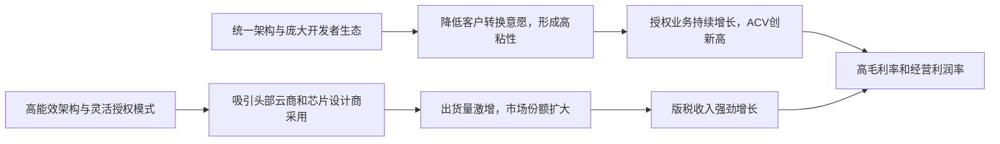

<!-- 匹配到的证券/行业：Arm Holdings(ARM.O) -->
操作成功

### 一页通 （Arm Holdings (ARM.O)）
日期：2026-08-05
内容："""
## 公司概况

Arm Holdings plc 是全球半导体行业的计算平台领导者，其核心业务是设计并授权高性能、低功耗的CPU、GPU、系统IP及计算子系统（CSS）。公司通过“IP授权+版税”的商业模式，为全球绝大多数智能手机、以及日益增长的云计算、汽车和物联网设备提供底层处理器架构。截至2026年3月，基于Arm架构的芯片累计出货量已超过3500亿颗，全球开发者社区超过2200万人。2026年3月，公司宣布将业务拓展至生产硅芯片领域，推出了首款面向数据中心的Arm AGI CPU，标志着其正从IP授权商向完整的计算平台解决方案提供商转型。 

## 公司近况跟踪

- <strong>FY27 Q1业绩超预期，但全年版税指引下调</strong>：公司FY27 Q1（截至2026年6月30日）营收达12.89亿美元，同比增长22%，高于指引上限。Non-GAAP每股收益0.45美元，同比增长29%。然而，管理层将FY27全年版税收入增速指引从此前的“约20%”下调至“高双位数”，主要原因是智能手机市场疲软程度超出预期，导致盘后股价承压。               
- <strong>AGI CPU需求强劲，但供给仍是核心瓶颈</strong>：公司披露，其Arm AGI CPU的客户需求已超过20亿美元（覆盖FY27和FY28），较3月发布时翻倍。公司已锁定支撑10亿美元收入目标的制造产能，并对实现该目标以上的收入信心增强，但供应链（晶圆、基板、测试、内存）紧张仍是限制其上调短期收入指引的关键因素。           
- <strong>数据中心版税持续翻倍，成为核心增长引擎</strong>：FY27 Q1数据中心版税收入再次实现同比翻倍以上增长，主要受超大规模云服务商（如AWS、谷歌、微软）基于Arm架构的服务器CPU部署加速，以及英伟达Grace和Vera CPU的持续放量驱动。Arm Neoverse核心累计出货量已超15亿颗，其中最近5亿颗仅用时9个月。           
- <strong>智能手机版税疲软，但产品升级部分对冲</strong>：尽管智能手机终端需求疲软，且内存价格上涨的影响从低端蔓延至中高端市场，但Armv9架构和CSS渗透率的提升带来了更高的单芯片版税费率，部分抵消了出货量下滑的负面影响。           
- <strong>授权业务保持强劲，ACV创历史新高</strong>：FY27 Q1授权及其他收入同比增长23%，主要受下一代架构的强劲需求及关键客户深度战略合作推动。年化合同价值（ACV）同比增长13%至17.32亿美元，创历史新高。           

## 短期逻辑

1. <strong>AGI CPU供给进展是未来一个季度最核心的交易变量</strong>：市场对Arm AGI CPU的长期前景已充分定价，但短期股价催化剂将完全取决于供给端的进展。管理层表示，对实现超过10亿美元收入目标的信心在过去90天内增强，并计划在FY27 Q3财报中提供更具体的更新。任何关于获得额外晶圆产能、锁定关键客户订单或明确交付时间表的信号，都可能触发股价的正面重估。反之，若供给瓶颈持续无法突破，市场耐心可能耗尽，导致估值承压。当前需求已超20亿美元，供给是决定FY28营收能否从10亿美元基准大幅上修的唯一变量。           

2. <strong>智能手机版税增速放缓的预期差交易</strong>：市场此前对FY27全年版税收入增长20%的预期较为一致，但公司因手机市场疲软（尤其是中高端机型受累于内存涨价）而下调指引至“高双位数”，这已引发股价负面反应。未来一个季度，需密切关注手机市场的实际出货数据和产品组合变化。若实际表现优于管理层相对保守的预期（例如，高端机型占比回升或内存价格企稳），则存在预期差修复的机会。反之，若疲软态势进一步加剧，将拖累整体营收和利润表现。          

3. <strong>数据中心版税增长的持续性与估值支撑</strong>：尽管手机业务短期承压，但数据中心版税收入连续多个季度同比翻倍，已成为公司最强劲的增长驱动力。未来一个季度，市场将高度关注这一增长势头的可持续性。若公司能继续报告数据中心版税同比翻倍或接近翻倍的增长，并给出乐观的后续展望，将有效对冲手机业务的负面影响，并为当前高企的估值提供基本面支撑。英伟达Vera CPU进入量产、谷歌Axion CPU成为TPU系统主机等催化剂，有望持续兑现。           

## 长期逻辑

1. <strong>Agentic AI重塑数据中心架构，Arm CPU成为核心枢纽</strong>：随着AI工作负载从简单的提示-响应模式转向持续、自主的Agentic AI，CPU在任务编排、数据调度、内存管理和安全协调中的重要性急剧提升。这驱动数据中心对CPU的需求呈指数级增长，Arm预计到2030年，服务器CPU的市场规模将超过1000亿美元。Arm凭借其高能效、可定制和高核心数的架构优势，正成为这一转变的核心受益者。英伟达、谷歌、AWS、微软等几乎所有主要AI基础设施提供商都在基于Arm架构构建其下一代AI基础设施，这一结构性趋势具备较高的确定性。           

2. <strong>从IP到芯片，商业模式升级打开长期增长天花板</strong>：Arm AGI CPU的推出，标志着公司从单一的IP授权商向“IP+芯片”双轮驱动模式转型。这不仅使Arm能够直接获取数据中心CPU的完整芯片价值（而非仅收取版税），还为其开辟了一个远超其传统IP业务的市场空间。公司预计到FY31，AGI CPU业务收入将达到150亿美元，IP业务收入达到100亿美元。这一战略升级从根本上改变了公司的增长曲线和估值框架，使其从一家轻资产的版税公司，转变为深度参与AI基础设施建设的核心玩家。           

3. <strong>Arm计算平台的网络效应与生态护城河持续巩固</strong>：超过2200万开发者、3500亿颗芯片的累计出货量，以及从云端到边缘端的统一架构，构成了Arm强大的生态系统和网络效应。随着AI向边缘设备（PC、手机、汽车、机器人）扩展，对高能效、可扩展的统一计算平台的需求日益增长。Arm架构作为连接云端和边缘的通用“语言”，其平台价值将持续提升。客户无论是通过IP、CSS还是芯片的方式采用Arm，都在强化同一个软件生态和开发者社区，这种平台粘性构成了公司长期竞争力的核心。           

## 风险提示

- <strong>AGI CPU业务的执行与竞争风险</strong>：公司首次进入生产硅芯片领域，面临制造、供应链管理、客户支持和市场竞争等多重挑战。第一代产品毛利率预计仅为高30%至低40%区间，远低于公司整体98%的毛利率水平，可能对整体盈利能力造成拖累。同时，该业务使Arm与部分IP客户（如英伟达、高通）形成直接竞争，可能影响现有IP授权和版税业务关系。           
- <strong>智能手机市场疲软与版税增长放缓风险</strong>：智能手机是Arm版税收入的重要来源（FY26移动应用处理器版税占总版税收入约43%）。当前全球智能手机市场，尤其是中高端机型，因内存价格上涨和需求疲软而承压，导致公司下调了全年版税指引。若这一趋势持续或恶化，将直接影响公司的核心收入和利润增长。           
- <strong>高估值与市场情绪波动风险</strong>：公司当前估值已计入大量未来增长预期，尤其是AGI CPU业务的长期前景。任何业务进展不及预期（如AGI CPU供给延迟、版税增速进一步放缓）或市场整体风险偏好下降，都可能导致股价出现剧烈波动。公司流通股比例较低，也加剧了股价的波动性。           

## 近期要闻

- <strong>2026年5月6日</strong>：Arm发布FY26 Q4及全年财报，营收创历史新高，并正式宣布推出首款自研数据中心芯片Arm AGI CPU，引发市场广泛关注。 
- <strong>2026年5月-7月</strong>：多家投行上调Arm目标价，主要基于对AGI CPU业务的乐观预期。市场对服务器CPU市场总规模（TAM）的讨论升温，AMD在7月的Advancing AI大会上将2030年服务器CPU TAM上调至2200亿美元。          
- <strong>2026年7月29日</strong>：Arm发布FY27 Q1财报，业绩超预期但全年版税指引下调，同时AGI CPU需求虽强劲但未上调短期收入目标，导致股价盘后下跌。           

## 未来催化

- <strong>2026年8月-10月</strong>：公司预计在FY27 Q3财报（通常于11月发布）中，提供关于AGI CPU业务更具体的收入和利润率更新，以及供应链进展的详细说明。这将是验证其长期叙事的关键节点。           
- <strong>2026年下半年</strong>：Arm AGI CPU预计于2026年底开始生产出货。首批产品的交付和客户反馈将是重要的里程碑事件，标志着公司从IP设计到芯片交付能力的实质性跨越。           
- <strong>2026年8月-10月</strong>：主要云服务商（Meta、微软、亚马逊等）的财报和资本开支指引，将进一步验证AI基础设施建设的持续性和规模，直接影响市场对Arm数据中心业务增长的预期。           

## 公司业务模式及拆分

<strong>业务边际变化</strong>：公司正经历从纯IP授权商向“IP+芯片”双业务模式的历史性转变。2026年3月，公司宣布推出首款自研生产硅芯片产品——Arm AGI CPU，正式进入数据中心CPU市场。该产品预计于2026年底开始生产出货，标志着公司业务范围的重大扩张。  

<strong>盈利模式</strong>：公司传统的盈利模式是“IP授权+版税”。通过向半导体公司、OEM和云服务商授权其CPU、GPU等IP，收取前期许可费；当客户基于Arm IP设计的芯片量产出货后，再按芯片售价的百分比或固定金额收取版税。该模式具有高毛利率（约98%）、高客户粘性和长周期收入的特点。新拓展的芯片业务将采用直接销售硅芯片的模式，其毛利率（预计初期为高30%至低40%）和收入确认方式与传统业务有显著差异。   

<strong>业务拆分</strong>：
公司收入主要分为两大类：版税收入和授权及其他收入。近年来，随着Armv9架构和CSS等高价值产品的渗透率提升，版税收入增长强劲。FY26全年，版税收入占比53%，授权及其他收入占比47%。公司目前处于由AI驱动的业绩兑现期，数据中心业务正成为增长的核心引擎。   

<strong>细分业务拆分</strong>

| 项目 (百万美元) | FY2024 | FY2025 | FY2026 | FY2027 Q1 |
| :--- | :--- | :--- | :--- | :--- |
| <strong>截止日期</strong> | 2024-03-31 | 2025-03-31 | 2026-03-31 | 2026-06-30 |
| <strong>版税收入</strong> | 1,802 | 2,168 | 2,613 | 715 |
| 同比 | - | 20% | 21% | 22% |
| 占总收入比例 | 56% | 54% | 53% | 55% |
| <strong>授权及其他收入</strong> | 1,431 | 1,839 | 2,307 | 574 |
| 同比 | - | 29% | 25% | 23% |
| 占总收入比例 | 44% | 46% | 47% | 45% |
| <strong>总收入</strong> | 3,233 | 4,007 | 4,920 | 1,289 |

*注：公司未单独披露各细分业务的毛利率。*

<strong>版税业务</strong>：该业务是公司营收的基石，其增长由“量”（芯片出货量）和“价”（单芯片版税费率）共同驱动。FY27 Q1，版税收入同比增长22%，主要驱动力来自<strong>云端AI</strong>，数据中心版税收入再次同比翻倍。增长主要得益于Armv9架构和CSS的渗透率提升，它们带来了更高的单芯片版税费率。然而，智能手机市场的疲软（尤其是中高端机型受累于内存价格上涨）对版税增长形成拖累，导致公司下调了全年版税增速指引。           

<strong>授权及其他业务</strong>：该业务是未来版税收入的先行指标，反映了客户对Arm未来技术的投入。FY27 Q1，授权及其他收入同比增长23%，主要受对下一代架构的强劲需求及与关键客户的深度战略合作推动。本季度签署了多份高价值协议，包括与软银的技术授权及设计服务协议（贡献1.93亿美元）。年化合同价值（ACV）同比增长13%至17.32亿美元，显示授权业务的增长势头依然稳健。           

## 核心竞争力

<strong>竞争要素 1：依托庞大软件生态和架构一致性构筑的平台网络效应</strong>

- <strong>护城河定性</strong>：构成了<strong>结构性护城河</strong>。超过2200万开发者、3500亿颗芯片的累计出货量，以及从云端到边缘端统一的Arm指令集架构，形成了一个强大的生态系统。开发者习惯于为Arm架构编写软件，企业客户倾向于选择拥有最广泛软件支持的平台，这降低了客户转投其他架构的意愿，形成了高转换成本。           
- <strong>数据验证</strong>：FY26年报显示，Arm在智能手机应用处理器市场的份额超过99%，在平板电脑和数字电视市场占据多数份额。FY27 Q1，Arm Neoverse核心累计出货量已超15亿颗，其中最近5亿颗仅用时9个月，表明其在数据中心领域的采纳速度正在急剧加快。           
- <strong>动态演变</strong>：<strong>护城河变宽（巩固）</strong>。随着AI从云端向边缘设备（PC、汽车、物联网）扩展，对统一、可扩展的架构需求日益增长。Arm架构作为连接不同设备的通用平台，其网络效应将持续增强。公司通过提供IP、CSS和芯片等多种产品形态，进一步降低了客户采用Arm平台的壁垒，巩固了其生态地位。           

<strong>竞争要素 2：在能效和定制化方面的技术领导地位</strong>

- <strong>护城河定性</strong>：构成了<strong>结构性护城河</strong>。在功耗日益成为数据中心和边缘设备核心约束的背景下，Arm架构以其领先的能效比（Performance per Watt）著称。同时，其灵活的授权模式允许客户进行高度定制化设计，以满足特定工作负载的需求，这是x86等封闭架构难以比拟的优势。           
- <strong>数据验证</strong>：英伟达宣布其基于Arm的Vera CPU能效比同类x86系统提升2倍。谷歌表示其基于Arm的Axion CPU性能是前代x86方案的2倍。AWS称其Arm-based Graviton处理器性价比比x86方案高出40%。这些头部客户的公开数据，直接验证了Arm架构在能效和性能上的竞争优势。           
- <strong>动态演变</strong>：<strong>护城河变宽（巩固）</strong>。随着AI工作负载的复杂化和多样化，对专用、高效处理器的需求将持续增长。Arm的架构授权（ALA）模式允许客户开发高度定制化的CPU，这使其在AI时代比提供标准化产品的竞争对手更具优势。公司持续投资研发，推出新一代架构和CSS，进一步拉大了与竞争对手的技术差距。           

<strong>现阶段核心驱动力总结</strong>：公司的Alpha在于其独特的平台生态和技术领导力，使其成为AI时代计算架构变革的核心受益者。其Beta则与全球半导体行业周期、AI基础设施投资力度以及智能手机等消费电子市场的景气度高度相关。当前，数据中心业务正成为公司最强的结构性增长驱动力，而智能手机市场的周期性波动则构成短期扰动。           

<strong>竞争格局传导逻辑图</strong>：

## 产销链

<strong>客户情况</strong>：
- <strong>主要客户</strong>：公司客户集中度较高。FY26，前三大客户合计贡献了42%的总收入，其中最大客户占比16%，第二大客户占比14%，第三大客户占比12%。这些客户主要为全球领先的半导体公司和云服务商。公司对头部客户的依赖度较高，存在单一客户订单波动或战略调整带来的收入风险。 
- <strong>新客户</strong>：在AGI CPU业务上，公司已宣布Meta为联合开发伙伴，并获得了OpenAI、Cerebras、Cloudflare、SAP等客户。管理层在FY27 Q1电话会上表示，已新增多家美国和中国客户，客户基础正在扩大。这些新客户目前处于从签约到小批量交付的阶段。           

<strong>供应商情况</strong>：
公司传统IP业务为轻资产模式，无重大供应商依赖。但新拓展的AGI CPU芯片业务使其开始深度依赖半导体制造供应链。管理层多次强调，晶圆（特别是台积电先进制程）、先进封装基板、测试产能和内存（HBM/DDR5）供应均非常紧张，是制约其AGI CPU收入上修的关键瓶颈。公司正与制造及供应链合作伙伴紧密合作以扩大产能。           

<strong>成本传导能力</strong>：
在传统IP业务中，公司几乎无上游原材料成本，毛利率高达98%，赚取的是典型的“技术授权费”。在芯片业务中，公司将成为芯片的卖方，其利润将直接受制于晶圆、封装等制造成本。管理层表示，第一代AGI CPU毛利率预计为高30%至低40%，并计划通过将部分外包环节内部化，在未来几年将毛利率提升至50%。这表明公司在芯片业务初期，对上游成本的议价能力有限，赚取的是“加工费+品牌溢价”，但目标是向更高附加值的环节延伸。           

## 财务数据

| 项目 (百万美元) | FY2024 | FY2025 | FY2026 | FY2027 Q1 |
| :--- | :--- | :--- | :--- | :--- |
| <strong>截止日期</strong> | 2024-03-31 | 2025-03-31 | 2026-03-31 | 2026-06-30 |
| <strong>营业总收入</strong> | 3,233 | 4,007 | 4,920 | 1,289 |
| 同比 | 20.68% | 23.94% | 22.79% | 22.41% |
| <strong>营业成本</strong> | 154 | 121 | 121 | 36 |
| <strong>毛利润</strong> | 3,079 | 3,886 | 4,799 | 1,253 |
| <strong>毛利率</strong> | 95.24% | 96.98% | 97.54% | 97.21% |
| <strong>研发费用</strong> | 1,979 | 2,071 | 2,776 | 838 |
| 研发费用率 | 61.21% | 51.69% | 56.42% | 65.01% |
| <strong>销售及管理费用</strong> | 983 | 984 | 1,115 | 317 |
| 销售及管理费用率 | 30.40% | 24.56% | 22.66% | 24.59% |
| <strong>营业利润</strong> | 111 | 831 | 900 | 91 |
| <strong>营业利润率</strong> | 3.43% | 20.74% | 18.29% | 7.06% |
| <strong>归母净利润</strong> | 306 | 792 | 904 | 270 |
| 归母净利润同比 | -41.60% | 158.82% | 14.14% | 107.69% |
| <strong>稀释每股收益 (美元)</strong> | 0.29 | 0.75 | 0.85 | 0.25 |
| <strong>经营活动现金流净额</strong> | 1,090 | 397 | 1,524 | 902 |
| <strong>自由现金流</strong> | 947 | 99 | 882 | 665 |

*注：自由现金流 = 经营活动现金流净额 - 资本性支出 - 购买无形资产 - 支付无形资产义务。FY2027 Q1数据为单季度数据，非年化。*

<strong>财务分析</strong>：
- <strong>成长能力</strong>：公司近年来保持了超过20%的强劲营收增长，FY26全年营收同比增长22.79%。增长主要由版税和授权业务双轮驱动，其中数据中心版税业务是增长最快的部分。FY27 Q1营收同比增长22.41%，增长势头持续。   
- <strong>盈利能力</strong>：公司毛利率极高且稳定，维持在95%以上，体现了其轻资产IP授权模式的优越性。然而，GAAP营业利润率波动较大，FY26为18.29%，主要受持续加大的研发投入影响。FY26研发费用同比增长34%，主要用于投资下一代产品（如AGI CPU）。FY27 Q1研发费用率进一步攀升至65.01%，显示公司仍处于高投入期。Non-GAAP口径下，FY27 Q1的营业利润率为41.2%，更能反映核心业务的盈利水平。   
- <strong>现金流状况</strong>：公司现金流状况良好。FY26经营活动现金流净额大幅改善至15.24亿美元，自由现金流也由FY25的0.99亿美元增至8.82亿美元。FY27 Q1自由现金流达6.65亿美元，显示出强劲的现金生成能力。截至FY27 Q1末，公司持有现金及现金等价物30.58亿美元，短期投资8.30亿美元，现金储备充裕。  

## 行业及竞争分析

<strong>行业分析</strong>：
Arm处于半导体IP和CPU设计行业，其增长与全球半导体需求、AI基础设施建设以及终端设备智能化趋势紧密相关。           

- <strong>服务器CPU市场</strong>：这是公司当前增长最快、市场空间最大的赛道。随着Agentic AI的兴起，CPU在AI系统中的重要性从辅助角色转变为核心编排枢纽。AMD在2026年7月将2030年服务器CPU的市场总规模（TAM）预测上调至2200亿美元。Arm凭借其高能效、可定制和高核心数的架构优势，正快速侵蚀传统x86架构的市场份额。据IDC报告，基于Arm的加速服务器平台支出已超过x86平台。          
- <strong>智能手机CPU市场</strong>：这是Arm的传统优势市场，市占率超过99%，市场成熟且增长稳定。未来增长主要来自Armv9和CSS等更高价值IP的渗透率提升，从而推动单芯片版税费率增长，而非出货量的大幅增加。当前市场面临终端需求疲软和内存涨价的短期逆风。           
- <strong>嵌入式与物联网市场</strong>：该市场应用碎片化，但设备数量庞大。Arm的低功耗处理器IP是该市场的主导架构。随着AI向边缘设备渗透，对具备AI处理能力的低功耗芯片需求增加，为Arm带来了新的增长机会。           

<strong>竞争格局</strong>：
Arm在多个市场面临竞争，主要对手包括：
- <strong>x86架构（英特尔、AMD）</strong>：在服务器和PC市场，x86是传统霸主。Arm正凭借能效和定制化优势发起挑战，尤其在云数据中心市场已取得显著份额增长。           
- <strong>RISC-V架构</strong>：作为一种开源指令集架构，RISC-V因其免费和灵活性，在物联网和部分嵌入式市场构成潜在竞争。部分Arm的客户也是RISC-V的主要支持者。           
- <strong>内部自研架构</strong>：部分大型半导体公司和云服务商（如苹果、谷歌、亚马逊）拥有架构授权，可深度定制Arm架构CPU，甚至有能力完全自研架构，这对Arm的版税收入构成潜在影响。           

<strong>可比公司</strong>：

| 公司名称 | 股票代码 | 对标维度 | 分析 |
| :--- | :--- | :--- | :--- |
| 新思科技 (Synopsys) | SNPS | IP授权模式 | 同为半导体IP和EDA工具供应商，商业模式类似，均具有高毛利率、高客户粘性特征。 |
| 楷登电子 (Cadence) | CDNS | IP授权模式 | 与新思科技类似，是Arm在EDA和部分IP领域的可比公司。 |
| 英伟达 (NVIDIA) | NVDA | AI数据中心芯片 | 在AI数据中心芯片市场，Arm的AGI CPU与英伟达的CPU产品（如Grace、Vera）存在竞合关系。两者均基于Arm架构，但英伟达更侧重于GPU和系统级解决方案。 |
| 英特尔 (Intel) | INTC | 服务器CPU | x86架构的代表，是Arm在服务器CPU市场的主要替代对象。 |
| 高通 (Qualcomm) | QCOM | 移动CPU与新兴数据中心CPU | 在移动CPU领域是Arm最大的客户之一，同时高通也宣布进入AI数据中心CPU市场，成为Arm的潜在竞争对手。 |

<strong>总结分析</strong>：Arm在移动CPU IP市场拥有近乎垄断的地位，其核心竞争力在于庞大的软件生态和领先的能效设计。在增长最快的AI数据中心市场，Arm正凭借其架构优势，从传统的x86阵营手中快速夺取市场份额。尽管面临RISC-V等新兴架构的潜在挑战，但Arm通过提供CSS和自研芯片等更完整的解决方案，不断加深其技术护城河和客户粘性。其新进入的芯片业务将使其与部分客户形成竞合关系，这是未来需要持续关注的战略风险点。           

## 市场焦点议题

<strong>议题一：AGI CPU业务的供给瓶颈与收入兑现节奏</strong>

- <strong>背景</strong>：Arm在2026年3月高调宣布进入数据中心芯片市场，并给出了到FY31年150亿美元的宏大收入目标。市场对此给予了极高的估值溢价。然而，芯片制造涉及复杂的供应链，作为新进入者，Arm能否确保足够的产能以兑现需求，成为市场核心关切。            
- <strong>问题列表</strong>：
  - 公司目前锁定的产能仅能支撑FY27-FY28共10亿美元的收入目标，而客户需求已超20亿美元。公司何时能获得额外产能以缩小供需缺口？
  - 管理层表示对实现10亿美元以上收入“信心增强”，但未正式上调指引。这种信心具体来自哪些方面的进展？是晶圆、基板还是测试产能？
  - 第一代AGI CPU的毛利率预计仅为高30%至低40%，远低于公司整体水平。随着产量爬坡和成本优化，毛利率的提升路径和时间表是怎样的？

<strong>议题二：智能手机版税收入增长放缓的持续性</strong>

- <strong>背景</strong>：智能手机是Arm最大的单一终端市场，其版税收入长期占据重要地位。FY27 Q1，公司因手机市场疲软下调了全年版税增速指引，引发了市场对这块成熟业务增长前景的担忧。           
- <strong>问题列表</strong>：
  - 当前手机市场的疲软主要是由内存涨价导致的成本推动型需求抑制，还是终端需求的结构性下滑？这一趋势预计将持续多久？
  - Armv9和CSS的渗透率提升能在多大程度上对冲手机出货量的下滑？这种产品组合升级带来的“价增”效应是否具有可持续性？
  - 公司预计FY28版税收入将恢复20%以上的增长，这一预期是基于手机市场回暖，还是完全依赖于数据中心业务的持续爆发？

<strong>议题三：进入芯片业务对现有IP授权模式的潜在冲突</strong>

- <strong>背景</strong>：Arm推出自研芯片，直接与部分客户（如高通、英伟达）形成竞争。市场担忧此举可能破坏其作为中立IP供应商的定位，导致客户转向RISC-V等替代架构，从而动摇其根本。           
- <strong>问题列表</strong>：
  - 自AGI CPU发布以来，现有主要IP客户（如高通、英伟达）的反应如何？是否有客户因此减少或推迟了IP授权？
  - 公司如何管理其IP业务和芯片业务之间的潜在利益冲突？是否有内部防火墙机制？
  - 长期来看，芯片业务是会成为侵蚀IP业务的“搅局者”，还是能通过扩大Arm整体生态，最终实现“双赢”？

## 市场分歧探讨

<strong>核心分歧点：Arm AGI CPU业务的长期价值是否已被当前股价充分甚至过度反映？</strong>

- <strong>乐观方观点与逻辑</strong>：
  - <strong>巨大的市场空间</strong>：服务器CPU市场正被Agentic AI重塑，总规模（TAM）预计在2030年达到2200亿美元。Arm凭借其能效和架构优势，有望占据显著份额。公司指引的FY31年150亿美元芯片收入，仅占该TAM的不到7%，实现概率较高。            
  - <strong>独特的竞争优势</strong>：Arm拥有庞大的软件生态和开发者社区，这是任何竞争对手短期内难以复制的。其架构的一致性使得客户可以无缝地在云端和边缘端部署AI应用，构成了强大的平台粘性。            
  - <strong>需求已获验证</strong>：AGI CPU的需求已超20亿美元，远超公司初始预期，且客户名单持续扩大，包括Meta、OpenAI等头部企业。这表明产品具备强大的市场吸引力。            

- <strong>谨慎方观点与逻辑</strong>：
  - <strong>供给瓶颈是重大不确定性</strong>：芯片制造的产能扩张周期长、投资大。作为新进入者，Arm在获取台积电先进制程产能方面面临英伟达、AMD、英特尔等巨头的激烈竞争。无法确保供给，再高的需求也无法转化为收入。           
  - <strong>竞争格局激烈</strong>：Arm AGI CPU不仅要面对英特尔的x86 CPU，还要与同样基于Arm架构的英伟达Vera CPU、AWS Graviton等产品竞争。这些竞争对手拥有更成熟的客户关系和系统级解决方案。           
  - <strong>盈利能力的稀释风险</strong>：芯片业务的毛利率（初期30%-40%）远低于其IP业务（98%）。随着芯片业务占比提升，公司整体毛利率和净利率将面临结构性下行压力。当前的高估值是基于其历史高利润率水平，未来可能面临估值体系的重构。           
  - <strong>与客户关系的潜在冲突</strong>：进入芯片领域可能促使部分大客户加速布局RISC-V等替代架构，以降低对Arm的依赖。这种长期的战略风险难以量化，但不容忽视。           

<strong>总结分析</strong>：市场对Arm AGI CPU的长期叙事给予了充分肯定，但短期在供给兑现、利润率变化和竞争动态上存在显著分歧。乐观方更关注长期市场空间和Arm的生态优势，而谨慎方则聚焦于短期执行风险和财务模型的结构性变化。当前股价已计入了较为乐观的预期，任何供给或利润率指引上的不及预期，都可能导致股价出现较大幅度的回调。          

## 盈利预测与估值

<strong>管理层最新指引</strong>：
- <strong>FY27 Q2指引</strong>：营收13.30-14.30亿美元，中值同比增长约22%。其中，授权及其他收入预计同比增长约30%，版税收入预计同比增长低双位数。Non-GAAP运营支出约7.8亿美元，Non-GAAP EPS为0.43-0.51美元。           
- <strong>FY27全年框架</strong>：全年版税收入增速预期为高双位数（此前为约20%），授权及其他收入增速预期为25-30%。Non-GAAP运营支出预计为33亿美元。           
- <strong>长期目标</strong>：到FY31，预计AGI CPU业务收入达150亿美元，IP业务收入达100亿美元，对应EPS超过9美元。            

<strong>券商盈利预测与估值</strong>：

| 机构 | 评级 | 目标价(美元) | 财务指标 | FY2026A | FY2027E | FY2028E | FY2029E |
| :--- | :--- | :--- | :--- | :--- | :--- | :--- | :--- |
| 摩根大通 (2026-07-30) | 超配 | 255.00 | 营收(百万美元) | 4,920 | 6,054 | 8,700 | - |
| | | | 调整后EPS(美元) | 1.77 | 2.24 | 3.21 | - |
| 瑞银 (2026-08-03) | 买入 | 320.00 | 营收(百万美元) | 4,920 | 6,143 | 8,233 | 11,195 |
| | | | 调整后EPS(美元) | 1.77 | 2.28 | 3.07 | 4.39 |
| 汇丰 (2026-07-30) | 持有 | 230.00 | 营收(百万美元) | 4,920 | 6,017 | 7,870 | 10,488 |
| | | | 调整后EPS(美元) | 1.77 | 2.27 | 3.02 | 4.11 |
| 摩根士丹利 (2026-07-30) | 等权重 | 212.00 | 营收(百万美元) | 4,920 | 6,088 | 8,954 | 11,637 |
| | | | 调整后EPS(美元) | 1.77 | 2.06 | 3.69 | 5.13 |
| 高盛 (2026-07-31) | 卖出 | 150.00 | 营收(百万美元) | 4,920 | 5,896 | 7,840 | 9,918 |
| | | | 调整后EPS(美元) | 1.77 | 2.12 | 2.80 | 3.60 |

<strong>盈利预期与估值分析</strong>：
机构间对Arm的评级和估值存在巨大分歧，目标价范围从150美元到320美元不等，反映了市场对AGI CPU业务前景和公司整体估值方法的不同看法。乐观方（如瑞银、摩根大通）基于PEG或远期PE估值法，给予公司较高的估值倍数，看好其长期增长潜力。谨慎方（如高盛、摩根士丹利）则基于更保守的盈利预测或分部估值法（SOTP），认为当前股价已充分反映了乐观预期。一致预期方面，市场对FY27和FY28的EPS预测分别为2.15美元和3.01美元，对应的远期PE仍处于极高水平，显示市场对公司的增长预期依然非常饱满。
"""
