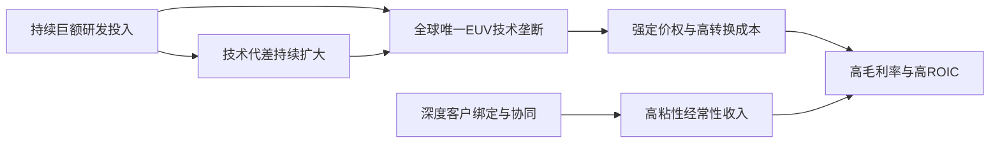

<!-- 匹配到的证券/行业：阿斯麦(ASML.O) -->
操作成功

### 一页通 （阿斯麦 (ASML.O)）
日期：2026-08-05
内容："""
## 公司概况

阿斯麦是全球半导体光刻设备领域的绝对龙头，也是目前全球唯一能够生产极紫外光刻系统的供应商。公司提供涵盖硬件、软件及服务的整体光刻解决方案，其设备是制造从成熟制程到先进制程芯片的核心环节。2025年，公司实现净销售额<strong>326.67亿欧元</strong>，在全球光刻设备市场的份额超过90%。 

## 公司近况跟踪

- <strong>2026年Q2业绩与全年指引大幅超预期</strong>：公司2026年Q2实现营收<strong>93.26亿欧元</strong>，毛利率<strong>54.0%</strong>，均显著高于此前指引上限。管理层将2026年全年营收指引从<strong>360-400亿欧元</strong>大幅上调至<strong>430-450亿欧元</strong>，毛利率指引从<strong>51%-53%</strong>上调至<strong>54%-56%</strong>。业绩超预期的主要驱动力来自已安装设备管理业务中的高毛利升级服务。 

- <strong>公布激进的产能扩张计划</strong>：公司计划在2026年约<strong>65台</strong>低数值孔径EUV产能基础上，于2027年增加<strong>30%</strong>至约<strong>85台</strong>，并正在研究2028年再增加<strong>30%</strong>至约<strong>110台</strong>的方案。浸没式DUV光刻机也遵循相似的扩产路径，从2026年的约<strong>130台</strong>，计划在2027年和2028年分别提升<strong>30%</strong>。公司表示已接近获得满足2027年产能所需的全部订单，并已收到大量2028年订单。 

- <strong>High-NA EUV达成关键量产里程碑</strong>：英特尔宣布已在其<strong>Intel 18A</strong>制程节点上，成功运用阿斯麦的High-NA EUV光刻系统实现部分处理器的量产交付，标志着该技术正式进入高量产导入阶段。 

- <strong>启动员工股权激励计划</strong>：公司宣布将向全球约4.45万名员工发放等价<strong>2万欧元</strong>的股权激励，旨在保留人才以支持未来几年的业务扩张。 

## 短期逻辑

1.  <strong>2026年下半年业绩加速兑现</strong>：公司Q3指引营收为<strong>110-120亿欧元</strong>，毛利率<strong>55%-57%</strong>，环比将实现跨越式增长。全年指引隐含下半年营收需达到<strong>249-269亿欧元</strong>。这一加速主要得益于：EUV产品组合向更高ASP的<strong>NXE:3800E/F</strong>型号切换、浸没式DUV出货量在下半年显著增加、以及已安装设备管理业务中高利润升级服务的持续强劲。随着这些高毛利产品占比提升和规模效应显现，下半年盈利弹性有望显著释放。 

2.  <strong>定价能力提升的预期差</strong>：管理层在业绩说明会上明确表示，由于公司设备为客户创造的价值显著高于过去，因此拥有比以往更大的<strong>定价灵活性</strong>，并已开始与客户进行相关讨论。尽管由于订单交付周期长，提价不会立即反映在财报上，但这一表态标志着公司定价策略的结构性转变。市场目前对ASP的预期可能仍主要基于产品组合升级，而对同型号设备直接提价的预期不足。随着新订单逐步签订，ASP存在持续上行的空间，这将成为未来几个季度盈利超预期的重要潜在驱动力。  

3.  <strong>存储需求结构性扩张的持续验证</strong>：公司预计2026年存储相关系统销售额增长将超过<strong>75%</strong>，这一增速远超市场年初预期。增长不仅来自HBM和DDR的产能扩张，更关键的是，随着DRAM制程向<strong>1b/1c</strong>等先进节点迁移，光刻强度显著提升，EUV和浸没式DUV的使用步骤增加。这一“量价齐升”的逻辑将在未来几个季度持续得到客户资本开支和订单数据的验证，有望推动市场进一步上调对ASML存储业务收入的预期。 

## 长期逻辑

1.  <strong>AI驱动的资本开支超级周期</strong>：AI算力需求正驱动全球逻辑芯片和存储芯片厂商进入一轮历史性的资本开支扩张周期。据华泰证券测算，2028年全球半导体制造企业资本开支有望达到<strong>3,417亿美元</strong>，较2025年增长<strong>103.3%</strong>。作为光刻设备的垄断供应商，ASML是这场资本开支浪潮中最确定、最核心的受益者之一。公司管理层指出，客户为获得更长远的产能可见度，正与其下游签订长期协议，这使得ASML的需求能见度已延伸至2028年乃至更远。 

2.  <strong>光刻强度提升与High-NA EUV的商业化</strong>：随着逻辑芯片向<strong>2nm及以下</strong>节点演进，以及DRAM制程不断微缩，单位晶圆产能所需的光刻步骤（光刻强度）持续增加。这意味即使晶圆产能扩张速度放缓，对ASML设备的需求仍能保持增长。此外，High-NA EUV技术已在英特尔<strong>18A</strong>节点实现量产突破，预计将在2027-2028年进入更广泛的客户导入阶段。High-NA EUV单台售价超过<strong>3.5亿欧元</strong>，其商业化放量将成为公司2030年实现<strong>440-600亿欧元</strong>营收和<strong>56%-60%</strong>毛利率目标的关键驱动力。  

3.  <strong>已安装设备管理业务的“飞轮效应”</strong>：随着ASML在全球的装机量持续增长，其已安装设备管理业务已成为穿越周期的稳定收入来源和利润增长极。2026年该业务收入预计增长超过<strong>30%</strong>。客户为了在现有洁净室空间内快速提升产能，对能够立即提高生产效率的软件和硬件升级需求极为强劲。这项高毛利、高粘性的业务将随着EUV装机规模的扩大而自然增长，为公司构筑了坚实的业绩底座和利润安全垫。 

## 风险提示

- <strong>地缘政治与出口管制风险</strong>：公司业务受到荷兰、美国及欧盟等多方出口管制政策的深刻影响。尽管EUV从未对华出口，但若未来DUV设备的管制范围进一步扩大，或对已售设备的售后服务进行限制，可能会影响公司在中国市场的收入。中国市场预计在2026年仍将贡献约<strong>20%</strong>的净销售额。 

- <strong>客户资本开支的周期性波动</strong>：半导体行业具有周期性。尽管当前AI驱动的需求十分强劲，但若未来宏观经济出现衰退，或AI应用端的回报不及预期，可能导致主要客户削减资本开支，从而影响公司订单。公司目前积压订单高达<strong>388亿欧元</strong>，提供了短期缓冲，但无法完全对冲周期下行的风险。 

- <strong>技术路线的不确定性</strong>：High-NA EUV的商业化进程、客户导入节奏以及成本效益仍需持续验证。若该技术的大规模采用晚于预期，或出现替代性技术路线，可能会影响公司的长期增长轨迹和估值中枢。 

## 近期要闻

- <strong>2026年7月15日</strong>：阿斯麦公布2026年第二季度财报，业绩全面超预期，并大幅上调全年业绩指引。同时，公司公布了直至2028年的产能扩张计划，并宣布与英特尔在High-NA EUV量产上达成里程碑式合作。 

- <strong>2026年7月15日</strong>：据媒体报道，阿斯麦计划上调设备价格，已与台积电就提高EUV光刻机价格进行磋商，并计划将DUV光刻机价格上调<strong>10%</strong>，但台积电对此表示反对。 

- <strong>2026年7月27日</strong>：据The Information报道，一家中国国资背景的企业已开始制造浸没式DUV光刻机，计划在2026/2027年生产约<strong>5/20台</strong>。此消息引发市场对ASML长期垄断地位的担忧，导致当日股价下跌<strong>5.8%</strong>。 

## 未来催化

- <strong>2026年7月底-8月</strong>：北美主要云服务厂商（CSP）如谷歌、微软、Meta、亚马逊将陆续公布财报和资本开支计划。若其资本开支指引继续上调，将进一步验证AI需求的可持续性，直接催化ASML股价。 

- <strong>2026年10月14日</strong>：阿斯麦预定公布2026年第三季度财报。届时公司有望提供2027年更清晰的订单和产能展望，是验证其长期增长逻辑的下一个关键窗口。 

- <strong>2027年6月10日</strong>：阿斯麦计划举办下一次资本市场日。公司将在会上更新其长期市场展望、技术路线图和财务模型，预计将成为市场重新评估其长期价值的重要催化剂。 

## 公司业务模式及拆分

### 业务边际变化

公司近年正从传统的DUV光刻设备供应商，全面转型为以EUV为核心的整体光刻解决方案提供商。EUV业务已成为公司最主要的收入和利润来源。同时，公司正积极推动下一代High-NA EUV技术的商业化，并于2026年Q2宣布与英特尔合作，首次将High-NA EUV用于逻辑芯片的量产。此外，公司通过投资Mistral AI，开始将人工智能技术整合到其产品组合和内部运营中。 

### 盈利模式

公司盈利模式的核心是基于其<strong>技术垄断地位的价值定价</strong>。作为全球唯一的EUV光刻机供应商，ASML能够将设备的高生产效率为客户创造的巨大经济价值，部分转化为自身的收入和利润。此外，庞大的设备装机量带来了高利润、高粘性的存量设备管理和升级服务收入，形成了稳定的经常性收入来源。 

### 业务拆分

公司近年业务结构持续向高价值的EUV系统倾斜。2025年，EUV系统销售和已安装设备管理服务是增长最快的两大板块。公司当前正处于由AI需求驱动的<strong>业绩兑现期</strong>，产能和收入规模均在快速扩张。 

#### 细分业务拆分（单位：百万欧元）

| 业务板块 | 2023A | 2024A | 2025A | 2026H1 |
| :--- | :--- | :--- | :--- | :--- |
| <strong>极紫外光刻系统</strong> | | | | |
| 收入 | 9,090 | 8,363 | 11,603 | 7,893 |
| 同比 | - | -8.0% | 38.7% | - |
| 占总收入比重 | 33.0% | 29.6% | 35.5% | 43.6% |
| <strong>深紫外光刻系统</strong> | | | | |
| 收入 | 12,243 | 12,836 | 12,047 | 4,363 |
| 同比 | - | 4.8% | -6.1% | - |
| 占总收入比重 | 44.4% | 45.4% | 36.9% | 24.1% |
| <strong>量测与检测系统</strong> | | | | |
| 收入 | 606 | 570 | 794 | 376 |
| 同比 | - | -5.9% | 39.3% | - |
| 占总收入比重 | 2.2% | 2.0% | 2.4% | 2.1% |
| <strong>已安装设备管理</strong> | | | | |
| 收入 | 5,620 | 6,494 | 8,193 | 5,250 |
| 同比 | - | 15.6% | 26.2% | 28.1% |
| 占总收入比重 | 20.4% | 23.0% | 25.1% | 29.0% |
| <strong>总计</strong> | <strong>27,559</strong> | <strong>28,263</strong> | <strong>32,667</strong> | <strong>18,093</strong> |

*注：2026H1数据为截至2026年6月28日的6个月数据。*

#### 各业务板块分析（2026年上半年）

- <strong>极紫外光刻系统</strong>：2026年上半年实现收入<strong>78.93亿欧元</strong>，占总收入比重提升至<strong>43.6%</strong>，是公司第一大收入来源。增长主要受AI驱动的先进逻辑和DRAM客户对<strong>NXE:3800E</strong>等高性能低数值孔径EUV系统的强劲需求推动。此外，High-NA EUV系统也开始贡献收入。该业务毛利率较高，是公司盈利能力提升的核心引擎。 

- <strong>深紫外光刻系统</strong>：2026年上半年实现收入<strong>43.63亿欧元</strong>，占总收入比重为<strong>24.1%</strong>。尽管收入占比有所下降，但浸没式DUV作为先进制程的关键配套设备，其需求依然旺盛。公司计划在2027年和2028年大幅提升浸没式DUV的产能，显示出对该业务长期增长的信心。干式DUV设备则受益于成熟制程和特定应用领域的强劲需求。 

- <strong>已安装设备管理</strong>：2026年上半年实现收入<strong>52.50亿欧元</strong>，同比增长<strong>28.1%</strong>，占总收入比重提升至<strong>29.0%</strong>。该业务的强劲增长是Q2业绩超预期的核心原因。客户为快速提升现有产能，对能够立即提高生产效率的软件和硬件升级方案需求迫切。随着EUV装机量的持续扩大，服务收入也自然增长。该业务毛利率较高，是公司利润的重要稳定器。 

## 核心竞争力

<strong>竞争要素 1：依托全球唯一EUV技术垄断构筑的结构性护城河</strong>

- <strong>护城河定性</strong>：<strong>结构性护城河</strong>。ASML是全球唯一能够生产极紫外光刻系统的供应商，这一地位源于超过20年的持续高额研发投入、对关键供应链（如蔡司的光学系统、Cymer的光源）的深度整合与控制，以及一个由客户、供应商和研究机构组成的庞大而复杂的创新生态系统。竞争对手复制该技术所需的资金、时间和知识积累门槛极高，在可预见的未来几乎无法被逾越。 

- <strong>数据验证</strong>：公司2025年EUV系统销售<strong>48台</strong>，实现收入<strong>116.03亿欧元</strong>，占系统销售收入的<strong>47.4%</strong>。其整体毛利率高达<strong>52.8%</strong>，显著高于同业，体现了其强大的定价权。2025年研发投入高达<strong>46.99亿欧元</strong>，占收入的<strong>14.4%</strong>，这种规模的投入是任何潜在竞争者都难以匹敌的。 

- <strong>动态演变</strong>：<strong>护城河变宽</strong>。公司正通过推出更高生产效率的<strong>NXE:3800E/F</strong>型号和下一代<strong>High-NA EUV</strong>技术，不断拉大与潜在追赶者的技术代差。High-NA EUV在英特尔<strong>18A</strong>节点实现量产，标志着技术护城河正从“标准EUV”向“高数值孔径EUV”延伸和巩固。 

<strong>竞争要素 2：由高转换成本与深度客户绑定构筑的客户粘性</strong>

- <strong>护城河定性</strong>：<strong>结构性护城河</strong>。ASML的光刻设备是晶圆厂最核心、最昂贵的投资之一。一旦客户选择ASML的技术路线，其整套生产工艺、设计工具、光罩和软件都将围绕ASML的平台进行优化。切换设备供应商意味着巨大的转换成本、时间成本和良率风险。此外，头部客户如台积电、三星、英特尔通过“客户共投资计划”与ASML在技术路线上深度绑定，形成了命运共同体。 

- <strong>数据验证</strong>：公司已安装设备管理业务在2025年实现收入<strong>81.93亿欧元</strong>，同比增长<strong>26.2%</strong>，占总收入<strong>25.1%</strong>。该业务的高增长和高粘性证明了客户对ASML平台的持续依赖。前两大客户在2025年贡献了<strong>38.0%</strong>的总净销售额，体现了深度绑定的客户关系。 

- <strong>动态演变</strong>：<strong>护城河变宽</strong>。随着制程微缩，光刻工艺的复杂性和重要性持续提升，客户对ASML的设备、软件和服务的依赖度只会增加。公司正在将AI技术整合进其产品，以进一步提升设备性能和客户效率，这将使客户粘性进一步增强。 

<strong>现阶段核心驱动力总结</strong>：公司的Alpha在于其作为技术垄断者，在AI驱动的资本开支超级周期中，通过产品升级和定价能力实现远超行业平均水平的盈利增长。其Beta则体现在与全球半导体资本开支周期的高度相关性。 

<strong>竞争格局传导逻辑图</strong>：

## 产销链

- <strong>客户情况</strong>：公司客户高度集中，主要为全球领先的逻辑芯片和存储芯片制造商。2025年，前两大客户合计贡献了<strong>38.0%</strong>的总净销售额，前三大客户占应收账款和融资应收账款的<strong>35.4%</strong>。这种高集中度意味着单一客户的资本开支波动会对公司业绩产生显著影响，但也反映了公司与行业领导者的深度绑定。新客户方面，马斯克的<strong>Terafab</strong>项目被视为未来的潜在增量客户。 

- <strong>供应商情况</strong>：公司高度依赖少数关键供应商，尤其是<strong>卡尔蔡司SMT</strong>，它是公司EUV和DUV系统光学镜头的独家供应商。这种“单一来源、双重能力”的供应链策略带来了集中度风险，任何供应中断都可能直接影响公司的出货能力。为应对地缘政治风险，公司正与供应商合作，通过优化流程和增加库存来提高供应链的韧性。 

- <strong>成本转嫁能力</strong>：公司具备较强的成本转嫁能力。其盈利模式的核心是基于技术价值的定价，而非简单的成本加成。当面临上游原材料或组件成本上升时，公司有能力通过推出更高性能、更高价格的新一代设备，或直接与客户协商价格调整，来维持甚至提升其利润率。公司赚取的是技术垄断带来的“<strong>技术溢价</strong>”。 

## 财务数据

### 关键财务数据

| 报告期 | FY2023 | FY2024 | FY2025 | FY2026 H1 |
| :--- | :--- | :--- | :--- | :--- |
| <strong>截止日期</strong> | 2023-12-31 | 2024-12-31 | 2025-12-31 | 2026-06-28 |
| <strong>营业总收入</strong> | 275.58 | 282.63 | 326.67 | 180.93 |
| 收入同比 | 30.16% | 2.56% | 15.58% | 17.24% |
| <strong>营业成本</strong> | 134.22 | 137.71 | 154.09 | 84.13 |
| <strong>毛利润</strong> | 141.36 | 144.92 | 172.58 | 96.80 |
| <strong>毛利率</strong> | 51.30% | 51.28% | 52.83% | 53.50% |
| <strong>营业利润</strong> | 90.42 | 90.23 | 113.01 | 66.14 |
| 营业利润率 | 32.81% | 31.93% | 34.60% | 36.55% |
| <strong>归母净利润</strong> | 78.39 | 75.72 | 96.09 | 56.74 |
| 净利率 | 28.45% | 26.79% | 29.42% | 31.36% |
| <strong>稀释每股收益</strong> | 19.89 | 19.24 | 24.71 | 14.73 |
| <strong>自由现金流</strong> | - | 90.83 | 110.27 | - |

*注：单位为亿欧元。自由现金流为非GAAP指标，定义为经营活动现金流减去物业、厂房和设备及无形资产购买。*

### 财务分析

- <strong>成长能力</strong>：公司在2025年重回高增长轨道，收入同比增长<strong>15.58%</strong>，净利润增长<strong>26.91%</strong>。进入2026年，增长势头进一步加速，上半年收入同比增长<strong>17.24%</strong>，且管理层已将全年收入增速指引上调至<strong>31.6%-37.7%</strong>。这一增长由AI驱动的EUV和DUV系统销售，以及已安装设备管理业务的强劲表现共同推动。 

- <strong>盈利能力</strong>：公司盈利能力持续增强。毛利率从2024年的<strong>51.28%</strong>提升至2025年的<strong>52.83%</strong>，并在2026年上半年进一步升至<strong>53.50%</strong>。营业利润率也从2024年的<strong>31.93%</strong>显著提升至2026年上半年的<strong>36.55%</strong>。这主要得益于高毛利的EUV系统销售占比提升、已安装设备管理业务中升级服务的贡献增加，以及规模效应的显现。公司预计2026年全年毛利率将达到<strong>54%-56%</strong>，显示出盈利能力的强劲上升趋势。 

- <strong>运营能力</strong>：公司的运营能力保持稳健。尽管2026年上半年应收账款大幅增加至<strong>72.53亿欧元</strong>，但这与公司下半年集中确认收入的业务模式相符。存货水平稳定在<strong>117.39亿欧元</strong>，表明供应链管理有效，以支持未来的出货计划。 

- <strong>偿债能力与现金流</strong>：公司财务状况极为健康。截至2026年H1，公司持有现金及现金等价物<strong>66.72亿欧元</strong>，短期投资<strong>9.10亿欧元</strong>，而长期债务仅为<strong>19.84亿欧元</strong>，净现金头寸充裕。2025年自由现金流达到<strong>110.27亿欧元</strong>，同比增长<strong>21.4%</strong>，强大的现金生成能力为公司的产能扩张、研发投入和股东回报提供了坚实基础。 

## 行业及竞争分析

阿斯麦所处的半导体光刻设备行业，是半导体产业链中技术壁垒最高、集中度最高的环节之一。该行业的需求主要由全球半导体资本开支驱动，而技术迭代则围绕“摩尔定律”的延续，即不断缩小芯片特征尺寸。 

- <strong>行业需求</strong>：当前行业正处于由<strong>AI算力需求</strong>驱动的超级景气周期。逻辑芯片方面，为训练和推理AI模型，对<strong>5nm/4nm/3nm</strong>等先进制程芯片的需求激增，并推动<strong>2nm</strong>制程快速进入量产爬坡阶段。存储芯片方面，<strong>HBM</strong>和<strong>DDR5</strong>的需求爆发，不仅推动了产能扩张，更因制程向<strong>1b/1c</strong>等先进节点迁移而显著提升了对EUV和高端DUV光刻设备的需求强度。据ASML在2024年投资者日预测，2025-2030年全球半导体市场年复合增长率约为<strong>9%</strong>，有望在2030年突破<strong>1万亿美元</strong>。 

- <strong>竞争格局</strong>：阿斯麦在光刻设备市场占据绝对主导地位。在EUV领域，公司是<strong>全球唯一的供应商</strong>。在DUV领域，公司主要与日本的<strong>尼康</strong>和<strong>佳能</strong>竞争，但凭借其技术领先性，尤其是在浸没式DUV方面，占据了超过90%的市场份额。公司的竞争壁垒不仅在于设备本身，更在于其围绕“整体光刻”构建的庞大生态体系，包括计算光刻、量测与检测设备以及软件，这极大地提高了客户的转换成本。 

### 可比公司分析

| 公司名称 | 股票代码 | 主要业务 | 与ASML的差异 |
| :--- | :--- | :--- | :--- |
| 应用材料 | AMAT US | 半导体制造设备（沉积、刻蚀、离子注入等） | 产品线更广，覆盖芯片制造的多个环节，但在光刻领域没有直接竞争。 |
| 泛林集团 | LRCX US | 半导体制造设备（刻蚀、沉积、清洗等） | 在刻蚀领域实力强大，与ASML在业务上互补，同属设备行业核心标的。 |
| 科磊 | KLAC US | 半导体过程控制（量测、检测） | 在量测与检测领域与ASML的部分业务重叠，但ASML的优势在于与光刻系统的整合。 |
| 东京电子 | 8035 JP | 半导体制造设备（涂胶显影、刻蚀、沉积等） | 产品线广泛，是ASML在涂胶显影设备上的重要合作伙伴，双方设备通常在同一工艺流程中配套使用。 |

<strong>总结分析</strong>：与可比公司相比，阿斯麦的独特之处在于其在光刻这一核心工艺环节的<strong>垄断性技术地位</strong>。这使得其定价能力、盈利能力和业绩确定性均高于同业。可比公司同样受益于AI驱动的资本开支周期，但阿斯麦因其不可替代性，被视为该周期中最核心、最确定的投资标的。 

## 市场焦点议题

- <strong>议题一：产能扩张的极限与节奏</strong>
  - <strong>背景</strong>：市场对ASML能否满足爆炸性增长的EUV需求存在持续疑虑。公司此次给出了直至2028年的清晰扩产路径，但投资者仍在评估其可行性以及是否存在进一步的上限。 
  - <strong>问题列表</strong>：
    1.  2027年约<strong>85台</strong>、2028年约<strong>110台</strong>的Low-NA EUV产能目标，是基于现有洁净室空间的极限，还是仅为基于当前需求信号的规划？如果需求进一步上修，是否还有提升空间？
    2.  产能扩张的关键瓶颈是在ASML自身的组装环节，还是在其供应链（如蔡司的光学系统）？供应链能否同步实现<strong>30%</strong>的年均扩产速度？

- <strong>议题二：毛利率的可持续性与上行空间</strong>
  - <strong>背景</strong>：公司Q2毛利率大幅超预期，并给出了创纪录的Q3和全年毛利率指引。市场希望确认这一高盈利水平是结构性的还是周期性的。 
  - <strong>问题列表</strong>：
    1.  2026年下半年<strong>56%</strong>左右的毛利率指引中，有多少来自高毛利的升级服务的一次性贡献，有多少来自产品组合升级等可持续因素？
    2.  随着2027年产品组合进一步向更高价的<strong>3800E/F</strong>型号切换，以及潜在的提价效应开始显现，毛利率是否具备持续向<strong>56%-60%</strong>长期目标迈进的基础？

- <strong>议题三：中国市场的风险与韧性</strong>
  - <strong>背景</strong>：出口管制政策持续收紧，同时中国本土光刻设备企业开始崭露头角，市场担忧ASML在中国市场的长期收入前景。 
  - <strong>问题列表</strong>：
    1.  公司维持中国市场<strong>20%</strong>的收入占比指引，其驱动力是来自成熟制程的持续扩张，还是有新的需求来源？在出口管制下，这一比例的可持续性如何？
    2.  如何评估中国国产浸没式DUV光刻机在未来3-5年内对ASML市场份额和定价权的潜在冲击？

## 市场分歧探讨

<strong>核心分歧：当前业绩的强劲增长是AI驱动的长期结构性扩张的开端，还是周期性的顶点？</strong>

- <strong>乐观方观点</strong>：认为AI算力需求是新一轮长达十年的技术革命，其驱动的资本开支周期才刚刚开始。逻辑和存储芯片的“军备竞赛”、光刻强度的持续提升、以及High-NA EUV等新技术的商业化，将为ASML提供多年的增长动力。当前的产能扩张计划仍显保守，未来业绩有持续超预期的可能。因此，公司应享有更高的估值溢价。 

- <strong>谨慎方观点</strong>：认为半导体行业从未摆脱周期性。当前的资本开支激增，部分源于客户对AI需求的过度乐观和地缘政治驱动的重复下单。随着新增产能逐步释放，2028年后市场可能面临供过于求的风险。此外，公司估值已处于历史高位，提前反映了多年的高增长，一旦需求出现放缓迹象，股价将面临较大的下行风险。 

<strong>总结分析</strong>：当前ASML的强劲表现是结构性和周期性因素共振的结果。AI确实带来了结构性的需求增量，但下游客户的资本开支仍具有周期性特征。公司的优势在于其垄断地位和极高的订单能见度（积压订单<strong>388亿欧元</strong>），这为其提供了比一般半导体公司更强的业绩防御性。然而，市场对其长期增长的预期已相当充分，任何关于客户资本开支节奏放缓或技术路线变化的信号，都可能导致其估值倍数收缩。 

## 盈利预测与估值

### 券商盈利预测

| 机构 | 评级 | 目标价 | 财务指标 | FY2025A | FY2026E | FY2027E | FY2028E |
| :--- | :--- | :--- | :--- | :--- | :--- | :--- | :--- |
| 摩根士丹利 (2026-07-20) | Overweight | €1,930 | 营业收入(百万欧元) | 32,667 | 43,091 | 50,887 | 56,751 |
| | | | EPS(欧元) | 24.81 | 38.34 | 49.00 | 56.42 |
| 富国证券 (2026-07-22) | Overweight | $2,500 | 营业收入(百万欧元) | 32,667 | 44,200 | 54,700 | 67,600 |
| | | | EPS(欧元) | 24.97 | 40.00 | 52.57 | 68.61 |
| 开普勒盛富 (2026-06-29) | Buy | €1,830 | 营业收入(百万欧元) | 32,667 | 39,902 | 52,178 | 59,582 |
| | | | EPS(欧元) | 24.73 | 31.44 | 47.23 | 56.58 |
| 华泰证券 (2026-07-08) | 买入 | $2,500 | 营业收入(百万欧元) | 32,667 | 40,033 | 50,811 | 57,536 |
| | | | EPS(欧元) | 24.97 | 33.13 | 45.17 | 52.98 |
| BNP Paribas (2026-05-16) | Outperform | €1,550 | 营业收入(百万欧元) | 32,667 | 40,246 | 52,047 | 57,268 |
| | | | EPS(欧元) | 24.71 | 33.74 | 49.30 | 55.32 |

*注：目标价单位除特殊说明外均为欧元。预测数据均来自各机构最新发布的研究报告。*

### 盈利预测与估值分析

各机构对ASML未来几年的高增长已形成共识，但在增长斜率上存在分歧。乐观方如富国证券和华泰证券，基于对公司产能扩张和定价能力的更强信心，给出了远高于市场平均的2027年和2028年业绩预测。相对谨慎的机构如开普勒盛富，其预测则更接近市场一致预期。          

估值方面，多数机构采用市盈率估值法，并基于公司在EUV领域的垄断地位和长期增长前景，给予其<strong>30-35倍</strong>甚至更高的估值倍数。目标价的计算普遍基于2027年或2028年的盈利预测，显示出市场正在将更远期的增长计入当前估值。          

### 管理层最新指引

公司管理层在2026年Q2财报中给出的最新指引为：预计2026年全年营收在<strong>430-450亿欧元</strong>之间，毛利率在<strong>54%-56%</strong>之间，年化有效税率约为<strong>17%</strong>。
"""
