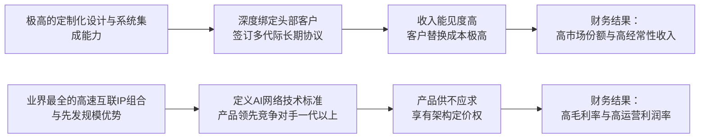

<!-- 匹配到的证券/行业：博通(AVGO.O) -->
操作成功

### 一页通 （博通 (AVGO.O)）
日期：2026-08-06
内容："""
## 公司概况

博通是全球技术基础设施领域的平台级巨头，业务横跨<strong>半导体解决方案</strong>与<strong>基础设施软件</strong>两大板块。公司凭借在定制AI加速芯片（XPU/ASIC）、AI网络（以太网交换/路由/光互联）以及企业私有云软件（VMware）三大赛道中的领导地位，构建了深度绑定全球头部云计算和AI模型厂商的生态体系。其核心定位已从传统通信芯片供应商，升级为<strong>AI算力基建的核心架构师与关键组件垄断型供应商</strong>。  

## 公司近况跟踪

- <strong>AI半导体业务进入加速兑现周期</strong>：FY26Q2（截至2026年5月3日）AI半导体收入达<strong>108亿美元</strong>，同比增长<strong>143%</strong>，占总收入比重提升至<strong>49%</strong>。公司指引FY26Q3 AI收入将达<strong>160亿美元</strong>，同比增长超<strong>200%</strong>，并维持FY27 AI收入超<strong>1000亿美元</strong>的预期。增长核心驱动力来自Google TPU、Anthropic TPU、OpenAI Jalapeño XPU及Meta MTIA等多个定制芯片项目的规模化部署。   
- <strong>客户与订单能见度大幅延伸</strong>：FY26Q2 AI订单规模突破<strong>300亿美元</strong>，远超当期108亿美元的出货量，显示客户为锁定未来算力而提前大规模下单。管理层表示，订单能见度已从此前的2027年延伸至<strong>2028年</strong>。公司与Google签署了多代TPU长期协议，并为Anthropic、OpenAI、Meta等客户锁定了至2028年及以后的吉瓦级算力部署承诺。   
- <strong>供应链锁定与战略合作升级</strong>：博通与三星签署了一项为期五年、价值超<strong>2000亿美元</strong>的合作备忘录，锁定HBM内存和2nm先进制程产能至2030年。同时，与苹果的合作延长至<strong>2031年</strong>，覆盖射频、无线连接及定制ASIC芯片，协议价值超<strong>300亿美元</strong>，巩固了其在消费电子供应链中的关键地位。   
- <strong>创新融资模式落地，加速算力部署</strong>：公司联合Apollo和Blackstone设立了AI XPV平台，首期<strong>350亿美元</strong>融资已落地，旨在通过第三方资本为Anthropic和OpenAI等客户提供算力基础设施融资，博通为此提供上限为<strong>290亿美元</strong>的残值担保。该平台目标部署超<strong>20GW</strong>算力，将公司角色从单纯的芯片供应商延伸至算力生态的信用支持方。   
- <strong>软件业务出现AI驱动的新增长极</strong>：VMware业务增长加速，FY26Q3指引营收<strong>89亿美元</strong>，同比增长<strong>31%</strong>。增长动力来自AI服务器部署带动的CPU核心数增加，从而拉动了VMware的授权需求。VMware Cloud Foundation 9.1版本强化了对异构AI算力的支持，有望成为企业私有AI的关键软件基础设施。  

## 短期逻辑

1.  <strong>Q3财报（预计9月初）对FY27 AI收入指引的潜在上修</strong>：尽管公司维持FY27 AI收入超1000亿美元的指引，但FY26Q2超300亿美元的订单量、下半年AI收入环比翻倍的指引以及多个吉瓦级项目的明确时间表，均指向实际业绩大概率超出该保守目标。市场对“超1000亿”的具体规模存在较大预期差。若Q3财报中管理层对FY27的展望更为积极，或实际出货数据持续超预期，将触发市场对公司远期盈利能力的重新定价。当前股价已从高点回落约20%，部分消化了“指引未上调”的利空，为博弈预期差提供了窗口。   

2.  <strong>CPO（共封装光学）交换机进入量产带来的估值重塑</strong>：博通的51.2T Bailly CPO交换机已进入小批量出货阶段，标志着公司在解决AI集群高功耗互联瓶颈的核心技术上取得商业化突破。CPO技术将光引擎与交换芯片共封装，能大幅降低功耗和延迟，是下一代AI网络的刚需。随着英伟达Spectrum-X CPO交换机也开始交付，2026年下半年CPO产业趋势将显著加速。博通作为以太网交换芯片和光DSP的双重龙头，在CPO价值链中占据核心地位，该业务的放量有望提升公司整体毛利率水平和估值中枢。  

3.  <strong>AI网络业务独立于XPU的“卖铲人”逻辑强化</strong>：市场过度聚焦于博通在Google TPU项目上可能面临的份额变化，但忽略了其AI网络业务的平台型价值。FY26Q2 AI网络收入占AI半导体收入的<strong>40%</strong>，主要来自以太网交换芯片（Tomahawk 6）、路由芯片（Jericho4）和光DSP。无论数据中心内部署的是博通XPU、英伟达GPU还是其他ASIC，只要集群规模扩大，对博通网络芯片的需求就同步增长。这种“架构定义者”的商业模式使其能够超越单一客户的芯片选型风险，享受整个AI算力扩张的Beta收益。  

## 长期逻辑

1.  <strong>定制ASIC（XPU）的不可逆趋势与博通的“总承包商”地位</strong>：随着AI工作负载从训练向推理倾斜，大型云厂商和模型公司为追求极致的<strong>单Token成本</strong>和<strong>功耗效率</strong>，正加速从通用GPU转向针对自身业务深度定制的ASIC。博通凭借其业界领先的SerDes IP、先进封装（CoWoS/3D堆叠）设计能力、多代际产品经验以及与头部客户的深度绑定，已成为这一趋势下的首选设计合作伙伴。其客户阵容（Google、Meta、OpenAI、Anthropic、苹果等）几乎囊括了全球最主要的AI算力投资方。这种“为顶级客户盖房子”的商业模式，一旦合作启动，客户替换成本极高，形成了长期的收入年金。  

2.  <strong>AI网络业务的“主航道”卡位与全栈价值</strong>：AI集群的规模法则决定了网络性能是比单点算力更关键的瓶颈。博通在AI网络领域拥有近乎垄断的技术优势：其Tomahawk 6（100Tbps）交换芯片是市场上唯一量产的百T级产品，下一代200Tbps芯片即将流片；其400G SerDes和CPO技术定义了下一代互联标准。公司预计AI网络收入将长期稳定在AI总收入的<strong>30%</strong>左右。随着AI集群从万卡向百万卡演进，网络的单GW价值量将持续提升，博通作为以太网事实标准的制定者，将攫取产业链中价值量最高的一环。  

3.  <strong>VMware的“AI-on-Prem”平台化转型</strong>：收购VMware的战略价值正从成本削减和现金流优化，转向更具想象空间的<strong>企业级私有AI平台</strong>。VMware Cloud Foundation 9.1已支持跨GPU/CPU的异构算力调度，使企业能在本地数据中心运行AI推理工作负载。随着企业对数据隐私、安全和主权的要求日益增强，以及AI推理成本优化需求的凸显，私有云部署AI的需求有望爆发。VMware凭借其在企业数据中心虚拟化领域的统治地位，有望成为连接底层算力与上层AI应用的核心操作系统，为博通开辟出仅次于AI芯片的第二条高价值、高粘性的增长曲线。  

## 风险提示

- <strong>谷歌TPU份额流失风险</strong>：公司承认谷歌为保障供应链安全将寻求供应商多元化，联发科已切入谷歌TPU供应链。尽管管理层和部分机构认为博通将维持约<strong>80%</strong>的份额，但若联发科在后续代际（如3nm/2nm）中展现出更强的设计能力和执行力，可能导致博通份额超预期下滑，并引发市场对其ASIC护城河的重新评估。该风险是当前压制公司估值的最核心因素。   
- <strong>AI XPV平台带来的表外债务与信用风险</strong>：为加速AI芯片部署而设立的AI XPV平台，要求博通为<strong>290亿美元</strong>的债务提供残值担保。若未来AI算力供过于求或客户违约，博通将面临巨大的潜在债务敞口。这种将硬件销售异化为金融信贷的模式，增加了公司资产负债表的复杂性和风险，一旦AI投资热潮降温，可能引发连锁反应。  
- <strong>供应链集中与地缘政治风险</strong>：公司约<strong>95%</strong>的晶圆制造依赖台积电，同时高度依赖三星的HBM供应。任何地缘政治冲突、自然灾害或供应链中断都可能对公司造成严重影响。此外，美国可能对中国光模块加征关税或实施禁令，将冲击博通AI网络产品的供应链成本和交付节奏，构成短期经营风险。  

## 近期要闻

- <strong>2026年6月4日</strong>：博通发布FY26Q2财报，AI收入108亿美元，同比+143%。同时宣布与Apollo、Blackstone设立AI XPV平台，首期融资350亿美元。  
- <strong>2026年6月8日</strong>：博通在10-Q文件中披露，为AI XPV平台提供最高<strong>290亿美元</strong>的残值担保。 
- <strong>2026年7月6日</strong>：博通与苹果宣布达成新的多年期协议，将双方合作延长至<strong>2031年</strong>，博通将为苹果供应射频、无线连接及定制ASIC芯片，协议价值超300亿美元。  
- <strong>2026年7月25日</strong>：三星电子宣布与博通签署战略合作备忘录，将在HBM、2nm代工和先进封装领域进行合作，预计未来五年合作规模超<strong>2000亿美元</strong>。  

## 未来催化

- <strong>2026年8月-9月</strong>：博通预计发布FY26Q3财报。市场将重点关注AI收入是否达到160亿美元的指引、整体毛利率趋势，以及管理层是否会就FY27 AI收入给出更积极的展望。  
- <strong>2026年下半年</strong>：OpenAI首款定制XPU“Jalapeño”预计于2026年底进入量产。其性能、功耗表现以及与英伟达同类产品的竞争力，将成为验证博通ASIC设计能力的关键里程碑。  
- <strong>2026年下半年</strong>：博通下一代200Tbps Tomahawk交换芯片预计完成流片。该产品的技术指标和客户导入情况将决定公司在AI网络领域的领先优势能否延续。  
- <strong>2026年下半年</strong>：博通51.2T Bailly CPO交换机的持续出货及客户部署反馈，将推动CPO技术从概念走向主流，可能引发市场对光通信和交换机产业链的价值重估。  

## 公司业务模式及拆分

### 业务边际变化
公司正经历由AI驱动的根本性业务重塑。AI相关半导体收入占比从FY25的约<strong>38%</strong>（估算）飙升至FY26Q2的<strong>49%</strong>，并预计在FY26Q3进一步提升。公司已从一家业务线庞杂的多元化半导体和软件公司，转变为一家以AI算力基础设施为核心增长极的平台型企业。非AI半导体业务虽已走出周期底部并恢复增长（FY26Q2同比+6%），但其战略重要性已显著下降。软件业务则因VMware的AI化转型而获得新的增长动力。  

### 盈利模式
公司盈利模式的核心是<strong>技术壁垒驱动的定价权与客户锁定</strong>。在半导体领域，公司通过提供业界领先的定制ASIC设计、高速SerDes IP和以太网交换芯片，深度嵌入客户下一代AI基础设施的研发和部署周期，形成极高的转换成本。在软件领域，通过VMware的虚拟化平台锁定企业数据中心的核心工作负载，形成稳定的订阅收入流。公司赚取的是“技术架构税”和“生态锁定收益”，而非单纯的商品销售利润。  

### 业务拆分
公司业务分为<strong>半导体解决方案</strong>和<strong>基础设施软件</strong>两大板块。当前公司经营周期处于<strong>AI驱动的业绩爆发兑现期</strong>，AI半导体业务贡献主要增量，非AI半导体处于温和复苏阶段，软件业务增长中枢正在抬升。  

<strong>细分业务拆分（按财报口径）</strong>

| 业务板块 (百万美元) | FY2023 | FY2024 | FY2025 | FY26 H1 |
| :--- | :--- | :--- | :--- | :--- |
| <strong>半导体解决方案</strong> | | | | |
| 收入 | 28,182 | 30,096 | 36,858 | 27,524 |
| 同比增长 | - | 6.8% | 22.5% | 65.6% |
| 占总收入比重 | 78.7% | 58.3% | 57.7% | 66.3% |
| 运营利润 | 16,486 | 16,759 | 21,232 | 16,784 |
| 运营利润率 | 58.5% | 55.7% | 57.6% | 61.0% |
| <strong>基础设施软件</strong> | | | | |
| 收入 | 7,637 | 21,478 | 27,029 | 13,974 |
| 同比增长 | - | 181.2% | 25.8% | 5.1% |
| 占总收入比重 | 21.3% | 41.7% | 42.3% | 33.7% |
| 运营利润 | 5,639 | 13,977 | 20,765 | 10,970 |
| 运营利润率 | 73.8% | 65.1% | 76.8% | 78.5% |
| <strong>总计</strong> | | | | |
| 收入 | 35,819 | 51,574 | 63,887 | 41,498 |
| 运营利润 | 16,207 | 13,463 | 25,484 | 19,351 |

*注：FY2024基础设施软件收入大增因并表VMware。运营利润为分部门数据，未扣除未分配费用。*

<strong>半导体解决方案（FY26Q2，截至2026年5月3日）</strong>
该板块收入<strong>150.09亿美元</strong>，同比增长<strong>79%</strong>。增长几乎全部由AI相关业务驱动。 
- <strong>AI半导体</strong>：收入<strong>108亿美元</strong>，同比增长<strong>143%</strong>。其中，<strong>定制AI加速器（XPU）</strong> 贡献约<strong>65亿美元</strong>，主要来自Google TPU和Anthropic TPU的出货。<strong>AI网络</strong>贡献约<strong>43亿美元</strong>，占总AI收入近<strong>40%</strong>，主要产品包括Tomahawk 6交换芯片、Jericho4路由芯片、PCIe交换芯片和光DSP。管理层预计AI网络收入占比将长期稳定在<strong>30%</strong>左右。  
- <strong>非AI半导体</strong>：收入<strong>42亿美元</strong>，同比增长<strong>6%</strong>。增长主要来自宽带、服务器存储和企业网络业务，部分被无线业务的季节性下滑所抵消。该业务订单量超过出货量，预示复苏将持续。  

<strong>基础设施软件（FY26Q2，截至2026年5月3日）</strong>
该板块收入<strong>71.78亿美元</strong>，同比增长<strong>9%</strong>。增长主要由VMware Cloud Foundation（VCF）的强劲需求驱动。本季度ARR同比增长<strong>17%</strong>。该业务毛利率高达<strong>93%</strong>，运营利润率约<strong>79%</strong>，是公司重要的利润和现金流稳定器。新发布的VCF 9.1版本因支持异构AI算力，正成为企业私有云AI部署的关键软件平台，有望驱动该业务进入新一轮增长周期。  

## 核心竞争力

<strong>竞争要素 1：依托极高转换成本与生态锁定构筑的客户粘性</strong>
- <strong>护城河定性</strong>：<strong>结构性护城河</strong>。博通与头部客户的合作并非简单的买卖关系，而是深入到芯片架构定义、多代际产品路线图规划、以及系统级（芯片+网络+软件）协同优化的深度绑定。一旦客户选择博通作为其定制ASIC或核心网络芯片的合作伙伴，其后续数代产品的技术路径都将依赖于博通的IP和设计能力，替换成本极高，周期长达数年。  
- <strong>数据验证</strong>：公司与Google签署了多代TPU长期协议，与苹果的合作延长至2031年，与OpenAI、Meta和Anthropic均有多年期的吉瓦级算力部署协议。这些长期合同的剩余履约义务高达<strong>1646亿美元</strong>（截至FY26Q2），为未来收入提供了极高的可见度。  
- <strong>动态演变</strong>：<strong>护城河变宽</strong>。随着AI芯片向多晶粒（Multi-die）、3D堆叠、CPO等更复杂的技术方向演进，对设计、IP和系统集成的能力要求呈指数级上升，博通的综合技术优势将进一步拉大与潜在竞争对手的差距，强化其作为“总承包商”的不可替代性。 

<strong>竞争要素 2：基于先发规模和技术标准形成的AI网络垄断性优势</strong>
- <strong>护城河定性</strong>：<strong>结构性护城河</strong>。在AI网络的核心——以太网交换芯片领域，博通凭借Tomahawk系列产品建立了事实上的行业标准。其Tomahawk 6（100Tbps）是市场上唯一量产的百T级产品，领先竞争对手超过一年。同时，公司在高速SerDes、光DSP和CPO等关键互联技术上拥有业界最全面的IP组合，形成了难以逾越的技术和专利壁垒。  
- <strong>数据验证</strong>：AI网络收入在FY26Q2达到约<strong>43亿美元</strong>，占AI半导体收入的<strong>40%</strong>。Tomahawk 6需求远超供给，已处于“售罄”状态。公司预计AI网络收入将长期稳定在AI总收入的<strong>30%</strong>左右，按FY27 AI收入超1000亿美元计算，仅网络业务就将贡献超<strong>300亿美元</strong>年收入。  
- <strong>动态演变</strong>：<strong>护城河变宽</strong>。随着AI集群规模从万卡向百万卡演进，网络性能成为比单点算力更关键的瓶颈，其价值量占比将持续提升。博通正在推进的200Tbps交换芯片和CPO技术，将进一步巩固其在下一代AI网络架构中的定义者地位。 

<strong>现阶段核心驱动力总结</strong>：
公司的Alpha来源于其在<strong>定制AI算力</strong>和<strong>AI网络</strong>两大核心赛道中不可替代的技术领导力和客户锁定效应。其Beta则受益于全球AI基础设施建设的超级资本开支周期。博通已超越单纯的芯片供应商角色，成为AI算力生态的“核心架构师”，其增长具备高确定性、高能见度和长周期的特征。  

<strong>竞争格局传导逻辑图</strong>：

## 产销链

- <strong>客户情况</strong>：公司客户集中度较高。FY26Q2，前五大终端客户合计贡献约<strong>45%</strong>的净收入。其中，通过一家分销商实现的销售占总收入的<strong>42%</strong>。核心终端客户包括Google、Meta、OpenAI、Anthropic和苹果等。这些客户多为万亿美元市值的科技巨头，信用风险较低，但单一客户（如Google）的资本开支波动或供应商策略调整可能对公司短期业绩产生影响。公司正通过拓展新客户（如OpenAI、苹果的AI芯片）来分散风险。 
- <strong>供应商情况</strong>：公司采用Fabless（无晶圆厂）模式，制造环节高度外包。晶圆代工高度集中于<strong>台积电</strong>，FY26H1约<strong>95%</strong>的晶圆由其生产。在HBM内存方面，公司与<strong>三星</strong>签署了长期战略合作协议，预计三星将供应其<strong>75-85%</strong>的HBM需求。这种集中度使公司对核心供应商的议价能力相对有限，但公司通过签订长期协议和预付货款来锁定产能和价格。公司已锁定2026-2027年的晶圆和HBM供应，并正在敲定2028-2029年的供应。  
- <strong>成本传导能力</strong>：公司赚取的是“技术架构税”。当上游原材料（如HBM、晶圆）涨价时，公司倾向于通过技术迭代和产品价值提升来维持其ASIC业务的毛利率稳定，而非直接向下游客户传导成本。管理层表示将“想方设法”保持ASIC利润率。对于AI网络等标准化程度较高的产品，公司凭借其垄断性市场地位，具备较强的定价权，能更好地对冲成本上涨压力。  

## 财务数据

<strong>关键财务数据</strong>

| 项目 (百万美元) | FY2023 | FY2024 | FY2025 | FY26 H1 |
| :--- | :--- | :--- | :--- | :--- |
| <strong>截止日期</strong> | 2023-10-29 | 2024-11-03 | 2025-11-02 | 2026-05-03 |
| <strong>营业总收入</strong> | 35,819 | 51,574 | 63,887 | 41,498 |
| 同比增长 | 7.9% | 44.0% | 23.9% | 38.7% |
| <strong>营业成本</strong> | 11,129 | 19,065 | 20,593 | 12,926 |
| <strong>毛利润</strong> | 24,690 | 32,509 | 43,294 | 28,572 |
| <strong>毛利率</strong> | 68.9% | 63.0% | 67.8% | 68.9% |
| <strong>营业利润</strong> | 16,207 | 13,463 | 25,484 | 19,351 |
| 营业利润率 | 45.2% | 26.1% | 39.9% | 46.6% |
| <strong>归母净利润 (GAAP)</strong> | 14,082 | 5,895 | 23,126 | 16,659 |
| 同比增长 | 25.5% | -58.1% | 292.3% | 59.1% |
| <strong>Non-GAAP 净利润</strong> | - | 23,733 | 33,728 | - |
| <strong>稀释EPS (GAAP, 美元)</strong> | 3.30 | 1.23 | 4.77 | 3.41 |
| <strong>经营活动现金流</strong> | 18,085 | 19,962 | 27,537 | 18,753 |
| <strong>自由现金流</strong> | 17,633 | 19,414 | 26,914 | 18,272 |

*注：自由现金流 = 经营活动现金流 - 资本性支出。FY26 H1自由现金流为估算值。*

<strong>财务分析</strong>
- <strong>成长能力</strong>：公司已进入由AI驱动的超级成长周期。FY26 H1营收同比增长<strong>38.7%</strong>，且增速逐季加快。GAAP净利润在FY25扭亏后，FY26 H1继续保持<strong>59.1%</strong>的高速增长。AI半导体业务是核心增长引擎，其增速远超公司整体水平。  
- <strong>盈利能力</strong>：公司毛利率在FY24因并表VMware而短暂下滑后，已迅速回升至<strong>68.9%</strong>的高位。尽管AI芯片（尤其是XPU）的毛利率低于软件，但其强劲的增长带来了显著的经营杠杆，使得营业利润率从FY24的<strong>26.1%</strong>大幅提升至FY26 H1的<strong>46.6%</strong>。公司整体盈利能力随着AI业务规模的扩大而显著增强。  
- <strong>现金流质量</strong>：公司是典型的“现金牛”。FY26 H1经营活动现金流达到<strong>187.53亿美元</strong>，自由现金流充沛。公司将大量现金用于股东回报，FY26 H1支付了<strong>61.78亿美元</strong>的股息，并斥资<strong>84.5亿美元</strong>用于股票回购。同时，公司资产负债表上仍有<strong>196.28亿美元</strong>的现金储备，财务稳健。  

## 行业及竞争分析

公司主要参与<strong>AI定制芯片（ASIC/XPU）</strong> 和<strong>AI网络（以太网交换/路由/光互联）</strong> 两个高度专业化的细分市场。  

- <strong>AI定制芯片市场</strong>：该市场由头部云厂商和AI模型公司驱动，他们为追求极致的推理成本和能效比，正从通用GPU转向自研或与博通等伙伴合作定制芯片。据机构测算，该市场正处于爆发期，博通预计其FY27 AI收入将超1000亿美元，其中大部分来自定制芯片。竞争格局上，博通凭借其IP库、设计能力和客户关系，占据<strong>超过70%</strong>的市场份额，是该市场的绝对领导者。主要竞争对手包括Marvell（美满电子）和联发科，但它们在客户阵容和项目规模上均落后于博通。英伟达的GPU是该市场的替代方案，而非直接竞争者。  

- <strong>AI网络市场</strong>：该市场是AI算力扩张的“卖铲人”生意。随着AI集群规模扩大，网络性能成为关键瓶颈，对高速以太网交换芯片、路由芯片和光互联的需求呈指数级增长。博通在该市场拥有近乎垄断的地位，其Tomahawk系列交换芯片是事实上的行业标准，市占率超<strong>70%</strong>。主要竞争对手包括英伟达（通过收购Mellanox）和Intel，但均未对博通的领导地位构成实质性挑战。  

<strong>可比公司</strong>

| 公司名称 | 股票代码 | 对标维度 | 分析 |
| :--- | :--- | :--- | :--- |
| 英伟达 (NVIDIA) | NVDA | AI算力芯片 | 通用GPU领导者，与博通的定制ASIC形成互补与竞争。英伟达拥有更庞大的软件生态，博通则提供更贴近客户工作负载的定制化方案。两者共同主导AI算力市场。 |
| Marvell (美满电子) | MRVL | 定制ASIC | 博通在定制ASIC领域的主要竞争对手，但客户阵容（主要为AWS）和项目规模远小于博通。在AI网络领域，Marvell也是主要参与者，但市场份额落后于博通。 |
| 联发科 (MediaTek) | 2454.TW | 定制ASIC | 新进入者，已切入Google TPU供应链，是博通在该项目上的直接竞争对手。但其ASIC业务仍处于早期阶段，技术能力和客户关系有待验证。 |

<strong>总结分析</strong>：博通在两个关键AI基础设施市场均占据领导地位。其竞争优势不仅在于单一产品的领先，更在于“<strong>计算（XPU）+ 网络（交换/路由/光互联）</strong>”的全栈协同能力，这使其能为客户提供系统级的优化方案，从而构筑了比纯芯片设计公司更深的护城河。  

## 市场焦点议题

- <strong>议题一：谷歌TPU项目的份额保卫战</strong>
    - <strong>背景</strong>：联发科成功切入谷歌TPU供应链，引发了市场对博通将失去其最大ASIC客户主要份额的担忧，这是导致公司股价从高点回落的主要原因。  
    - <strong>问题列表</strong>：
        1.  博通在谷歌下一代TPU（v9及以后）中的份额会否从当前的近乎垄断，快速下滑至50%甚至更低？
        2.  联发科是否具备在复杂度和性能要求极高的AI加速芯片领域，持续交付有竞争力产品的能力？
        3.  谷歌引入第二供应商，是否会引发其他ASIC客户效仿，从而系统性地削弱博通的议价能力和利润率？

- <strong>议题二：AI业务毛利率的稀释效应</strong>
    - <strong>背景</strong>：公司指引FY26Q3毛利率将下滑至<strong>74%</strong>，主要原因是毛利率较低的AI半导体（尤其是XPU）收入占比大幅提升。市场担心随着AI业务持续高增，公司整体盈利能力将被结构性拉低。 
    - <strong>问题列表</strong>：
        1.  公司整体毛利率的下行趋势何时能够触底？长期稳态的毛利率中枢在哪里？
        2.  AI网络和CPO等高毛利业务的增长，能否有效对冲XPU业务对毛利率的稀释？
        3.  管理层“维持ASIC利润率稳定”的承诺，在面对HBM等原材料成本上涨时，能否兑现？

- <strong>议题三：AI XPV平台的表外风险敞口</strong>
    - <strong>背景</strong>：公司为加速AI芯片销售而设立的350亿美元XPV融资平台，提供了高达<strong>290亿美元</strong>的残值担保。这种将产品销售金融化的模式，引发了市场对其潜在债务风险的担忧。  
    - <strong>问题列表</strong>：
        1.  如果未来AI算力出现供过于求，或Anthropic/OpenAI等客户出现财务问题，博通将面临多大的实际损失？
        2.  这种担保义务将如何影响公司的信用评级和未来的融资能力？
        3.  该模式是否会成为行业常态，从而系统性地增加半导体公司的经营风险？

## 市场分歧探讨

市场对博通的核心分歧在于：<strong>其当前的高增长是真实、可持续的需求驱动，还是下游客户在资本狂热下的提前拉货和渠道压货？其高毛利率是结构性优势，还是会被竞争和成本压力所侵蚀？</strong>

- <strong>乐观方观点</strong>：认为博通的增长是<strong>高质量且可持续的</strong>。依据是：1）订单均来自全球最顶尖的科技巨头，且有多年期、不可撤销的长期合同和吉瓦级算力部署承诺作为背书，并非短期渠道压货。2）博通在定制ASIC和AI网络领域的技术护城河极深，客户替换成本极高，其市场地位难以被撼动。联发科的进入更多是谷歌的“备胎”策略，不会动摇博通的主导地位。3）毛利率的下降是产品组合变化的数学结果，而非竞争加剧。AI业务的经营利润率依然健康，且随着规模扩大，经营杠杆将推动净利润高速增长。  

- <strong>谨慎方观点</strong>：认为市场对AI投资的回报和可持续性过于乐观，博通面临的风险被低估。依据是：1）谷歌引入联发科已证明，即使是最深的护城河也存在被攻破的可能。一旦AI芯片的技术创新放缓，竞争将迅速从技术转向成本，博通的利润率将承压。2）AI XPV平台的残值担保是巨大的表外风险，一旦AI投资泡沫破裂，博通将面临“芯片卖不动，担保要兜底”的双重打击。3）当前超300亿美元的季度订单量可能包含了客户因恐慌性抢购产能而重复下单的“水分”，未来存在订单修正的风险。  

从中立视角看，博通的长期技术优势和客户锁定能力是真实的，其AI业务的增长具备高确定性。然而，市场对其远期份额和利润率的定价可能过于线性外推，忽略了竞争格局的潜在变化和宏观风险。谷歌TPU的份额变化将是验证其护城河深度的“试金石”，而AI XPV平台的担保风险则是一个需要持续跟踪的“灰犀牛”。 

## 盈利预测与估值

<strong>管理层指引</strong>：
- FY26Q3营收指引约<strong>294亿美元</strong>，调整后EBITDA利润率约<strong>68%</strong>。 
- FY26全年AI半导体收入指引<strong>560亿美元</strong>，同比增长约180%。 
- 重申FY27 AI半导体收入将超过<strong>1000亿美元</strong>。 

<strong>券商盈利预测与估值</strong>

| 机构 | 评级 | 目标价(美元) | 财务指标 | FY2025A | FY2026E | FY2027E | FY2028E |
| :--- | :--- | :--- | :--- | :--- | :--- | :--- | :--- |
| 摩根大通 (2026-06-04) | 超配 | 580 | Non-GAAP EPS (美元) | 6.82 | 11.62 | 21.10 | - |
| | | | 营收 (百万美元) | 63,887 | 105,674 | 184,537 | - |
| 瑞银 (2026-06-17) | 买入 | 485 | Non-GAAP EPS (美元) | 6.82 | 11.51 | 20.83 | 27.44 |
| | | | 营收 (百万美元) | 63,887 | 105,478 | 190,883 | 254,075 |
| 摩根士丹利 (2026-07-14) | 超配 | 502 | ModelWare EPS (美元) | 5.39 | 9.98 | 16.63 | 21.48 |
| 华泰证券 (2026-06-08) | 买入 | 550.22 | Non-GAAP EPS (美元) | 6.90 | 11.48 | 18.04 | 25.89 |
| | | | 营收 (百万美元) | 63,887 | 106,830 | 175,342 | 277,436 |
| 中金公司 (2026-06-06) | 跑赢行业 | 525 | Non-GAAP EPS (美元) | 6.82 | 11.60 | 20.07 | - |
| | | | 营收 (百万美元) | 63,887 | 106,582 | 182,400 | - |

*注：各机构预测口径可能存在差异。*

<strong>估值分析</strong>：
市场对博通的估值逻辑已从市盈率（P/E）转向基于未来AI业务潜力的<strong>分部估值法（SOTP）</strong> 和<strong>企业价值倍数（EV/EBITDA）</strong>。机构普遍给予其AI半导体业务30倍左右的P/E，传统半导体和软件业务则给予较低的估值倍数。尽管各机构对FY27的EPS预测存在分歧（从16.63美元到21.10美元不等），但均指向当前股价对应FY27 P/E在<strong>20-26倍</strong>之间，对于一家在AI浪潮中占据核心地位且未来数年增长确定性极高的公司而言，这一估值水平被认为具备吸引力。机构观点普遍偏乐观，分歧点主要在于对FY27 AI收入“超1000亿”的具体规模和毛利率走势的判断上。
"""
