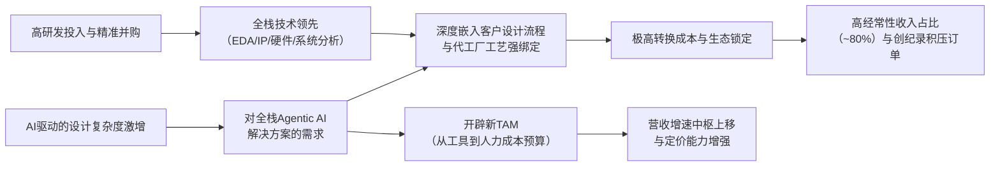

<!-- 匹配到的证券/行业：铿腾电子(CDNS.O) -->
操作成功

### 一页通 （铿腾电子 (CDNS.O)）
日期：2026-08-06
内容："""
## 公司概况

铿腾电子（Cadence Design Systems, Inc.）是全球电子设计自动化（EDA）领域的核心供应商，与Synopsys、Siemens EDA共同构成寡头格局。公司提供AI驱动的计算软件、加速硬件及硅知识产权（IP），覆盖从芯片设计、验证到电子系统分析的全流程。其客户包括全球主要的半导体公司（如英伟达、博通）及系统厂商（如超大规模数据中心运营商），在模拟和混合信号设计领域占据市场领导地位，并在数字设计、IP及系统分析领域持续扩大份额。 

## 公司近况跟踪

- <strong>2026年Q2业绩全面超预期，全年指引大幅上调</strong>：Q2总营收15.84亿美元，同比增长24%，非GAAP营业利润率45.5%，非GAAP每股收益2.11美元，均超出指引上限。管理层将2026年全年营收指引中点上调至63亿美元，对应约19%的同比增长，非GAAP每股收益指引上调至8.10美元。此次上调被管理层称为“历史上幅度最大的一次”，且强调增长具有全业务、全区域的广泛性。 
- <strong>订单积压创历史新高</strong>：季度末订单积压（Backlog）达到81亿美元，同比增长27%。尽管2026年是三年续约周期中的“小年”，但追加销售（Add-on）业务表现强劲，推动积压订单持续增长。 
- <strong>Agentic AI战略进入早期变现阶段</strong>：公司发布并推广其“超级代理”产品组合（ChipStack、ViraStack、AuraStack等），其中ChipStack已有超过20个客户投入生产，英伟达工程师利用该工具将RTL验证速度提升超过40倍。管理层明确变现路径为“新工作流产品+底层引擎使用量增加”，并指出当前指引尚未包含Agentic AI带来的阶跃式增长。 
- <strong>与Intel达成多年期战略合作</strong>：双方合作聚焦于Intel 14A制程，涵盖设计IP、设计工艺协同优化（DTCO）及Agentic AI EDA解决方案。管理层强调此为100%增量业务，预计将在未来数年成为有意义的增长驱动力，标志着Cadence在Intel生态中的竞争地位显著改善。 
- <strong>IP业务爆发式增长</strong>：Q2 IP营收同比增长超过40%，主要由AI/HPC驱动的接口IP（PCIe、UCIe）、内存IP（HBM、DDR）需求以及先进封装和Chiplet趋势推动。管理层指出，增长主要来自有机业务，并受益于代工生态系统从台积电向Intel、三星、Rapidus的多元化扩展。 

## 短期逻辑

1. <strong>Agentic AI从概念走向变现的预期差修复</strong>：市场对AI大模型可能颠覆传统EDA工具的担忧（如Kimi K3事件）一度压制估值，但Cadence在Q2业绩会上系统性地阐述了其“三层蛋糕”防御架构——底层为专用计算硬件（Palladium），中层为物理精确的仿真引擎，顶层为AI代理编排层。管理层指出，AI代理在探索更大设计空间时会更多地调用中层核心工具，从而形成需求叠加而非替代。目前ChipStack等产品已进入生产环境并产生收入，但尚未被纳入业绩指引，构成未来2-3个季度潜在的业绩上调期权。若Q3或Q4管理层开始量化Agentic AI的贡献，可能触发市场对公司长期增长曲线的重估。 

2. <strong>IP业务高增长的持续性验证</strong>：Q2 IP业务超40%的增速远超市场预期，但管理层提示不宜将单季增速年化。短期焦点在于，Q3 IP营收能否维持环比增长，以验证增长是由结构性需求（AI芯片架构碎片化、Chiplet普及）而非一次性项目交付驱动。公司与Intel、三星新签的IP合作协议预计在2027年放量，但2026年下半年的订单和设计活动（Design Activity）数据将是判断IP业务能否在2027年维持20%以上增速的先行指标。 

3. <strong>Intel合作带来的份额增长叙事强化</strong>：Cadence历史上在Intel和三星的份额远低于在台积电生态中的份额。此次与Intel达成的多年期、全栈式合作（覆盖EDA、IP、DTCO），被管理层定性为“关系正常化”和“100%增量”。尽管2026年收入贡献有限，但该合作在Q2计入积压订单，并可能在未来几个季度持续带来追加订单。这为Cadence在数字设计和签核（Signoff）领域持续从竞争对手处获取份额提供了有力证据，有望驱动营收增速持续高于行业平均。 

## 长期逻辑

1. <strong>AI驱动的设计复杂度指数级增长，奠定长期量价齐升基础</strong>：AI训练和推理芯片的晶体管数量、异构集成（Chiplet/3D-IC）复杂度以及系统级协同设计需求正呈指数级增长。台积电预计未来五年晶体管密度将增长48-50倍。这种复杂度使得芯片设计对EDA工具的依赖度和消耗量持续提升。Cadence指出，其工具在客户芯片研发预算中的占比已从过去的~7%上升至~11-12%，而英伟达CEO黄仁勋曾表示愿意将工程师成本的50%用于购买AI设计工具，显示EDA的价值量天花板远未触及。这一趋势将在未来3-5年持续推动公司营收以高于半导体行业平均增速的水平增长。 

2. <strong>Agentic AI开辟全新可寻址市场（TAM），并强化客户粘性</strong>：Cadence的“超级代理”产品不仅是现有工具的插件，而是定位为“虚拟设计工程师”，直接切入客户的人力成本预算。其“订阅+消费”的混合定价模式（基础订阅对标工程师年薪，额外使用按Token计费）有望将公司TAM从百亿美元级的EDA/IP市场，扩展至千亿美元级的芯片研发人力市场。更重要的是，代理与底层物理引擎的深度耦合，以及客户在使用过程中积累的专有知识图谱和强化学习数据，将构筑极高的转换成本和数据护城河，使客户关系从“工具供应商”升级为“设计能力合作伙伴”。  

3. <strong>系统设计与分析（SD&A）业务构建第二增长曲线</strong>：通过收购BETA CAE和Hexagon D&E业务，Cadence已构建起覆盖电磁、热、结构、流体等多物理场的完整系统仿真能力。随着AI芯片功耗和散热挑战加剧，以及自动驾驶、机器人等“物理AI”的兴起，多物理场仿真正成为芯片和系统设计的刚需。管理层预计SD&A的TAM规模有望与硅设计市场相当，使公司总TAM翻倍。该业务目前处于整合和早期渗透阶段，预计将在未来3-5年成为公司营收增长的重要贡献者，并提升整体营收增速的可持续性。 

## 风险提示

- <strong>地缘政治与出口管制风险</strong>：公司约14-15%的营收来自中国。美国对华技术出口管制政策存在高度不确定性，历史上曾出现BIS临时要求Cadence对华出口EDA软件申请许可的情况（2025年5-7月）。若未来出口管制进一步收紧，或“50%所有权规则”在2026年11月暂停期结束后重新生效，可能对公司中国区业务造成实质性冲击，并影响其在中国市场的长期竞争地位。  
- <strong>AI技术路线的不确定性与竞争风险</strong>：尽管管理层有力反驳了开源大模型（如Kimi K3）颠覆其业务的论调，但AI技术在芯片设计自动化领域的渗透速度和路径仍存在变数。若大型云厂商或客户内部团队利用开源模型和强化学习，在特定设计环节开发出替代性自动化方案，虽短期内难以撼动Cadence的全栈优势，但可能在部分节点上削弱其议价能力或压缩其TAM扩张空间。 
- <strong>收购整合与利润率承压风险</strong>：公司近期完成了对Hexagon D&E等大规模收购，导致无形资产摊销增加、债务上升，并对短期利润率造成压力。管理层指引2026年下半年利润率将略低于上半年，以消化整合成本和投资Intel合作。若整合进度不及预期，或协同效应释放滞后，可能导致公司整体盈利能力改善慢于市场预期。  

## 近期要闻

- <strong>2026年7月18日</strong>：中国AI模型Kimi K3被报道在48小时内基于开源EDA工具和45nm工艺库跑通完整芯片设计流程。该消息引发市场对传统EDA巨头护城河的担忧，导致Cadence和Synopsys股价当日一度大跌超12%。随后，Cadence管理层在业绩会上回应称，该演示验证了其“三层蛋糕”架构的正确性，且所用技术落后当前领先制程约20年，仍需依赖底层EDA工具。  
- <strong>2026年6月8-9日</strong>：在Jefferies投资者大会上，Cadence管理层详细阐述了Agentic AI的商业化路径，提出“订阅+消费”的混合定价模式，并透露英伟达工程师使用ChipStack工具实现了40倍的生产力提升。同时，公司确认与Intel在14A工艺上达成合作。 
- <strong>2026年6月初（Computex 2026）</strong>：Cadence与英伟达联合发布业界首个全自主虚拟AI设计工程师，基于ChipStack AI超级代理，可将典型的五周验证周期缩短至不到一天。 

## 未来催化

- <strong>2026年8月-9月</strong>：公司预计在Q3财报中更新积压订单和各大业务板块增长数据。若IP业务能维持环比增长，且管理层对Agentic AI的贡献给出更具体的量化指引，将构成显著正面催化。 
- <strong>2026年9月-10月</strong>：Intel 14A工艺开发进展及双方合作的进一步细节披露。若合作范围从IP和DTCO扩展至EDA软件和硬件（如Palladium仿真器），将打开更大的增量空间，并强化Cadence在Intel生态中的份额提升叙事。 
- <strong>2026年11月9日</strong>：美国BIS关于“50%所有权规则”的暂停期到期。该规则若重新生效，将扩大对华出口管制范围。最终的政策落地情况将消除市场对中国区业务的一个重大不确定性。  

## 公司业务模式及拆分

### 业务边际变化

公司近年通过内生发展与外延并购，将业务从传统的芯片设计自动化（EDA）和IP，拓展至覆盖芯片、封装、PCB乃至完整电子系统的多物理场仿真与分析领域。核心战略是“智能系统设计（ISD）”，旨在将AI技术（Agentic AI）深度整合进设计流程，实现从“辅助工具”到“自主设计代理”的升级。2026年2月完成对Hexagon D&E业务的收购，显著增强了在结构仿真和多体动力学领域的能力，补全了系统分析板块。同时，公司正将业务重心从单一的芯片设计，扩展至为超大规模客户和系统厂商提供覆盖“设计AI芯片”和“用AI做设计”的全栈解决方案。  

### 盈利模式

公司盈利模式的核心是<strong>技术壁垒+高转换成本+生态锁定</strong>。其软件产品深度嵌入客户的设计流程，与代工厂（台积电、三星、Intel）的工艺制程强绑定，客户替换成本极高。收入模式以时间为基础的订阅式License为主，辅以硬件销售和IP授权，其中经常性收入占比约80%，提供了高度的营收可见性。近期，公司正通过Agentic AI产品引入“订阅+消费”的混合定价模式，旨在将收费基础从“工具席位”扩展至“设计成果/计算消耗”，从而打开更大的价值捕获空间。  

### 业务拆分

公司近年业务结构保持稳定，主要由三大板块构成：核心EDA、半导体IP、系统设计与分析（SD&A）。核心EDA是公司的基本盘，贡献约70%的营收，增长稳健。半导体IP是近期增速最快的板块，受益于AI芯片的定制化需求。SD&A是公司重点扩张的战略方向，通过并购实现了高速增长，但包含较多一次性硬件收入和并购贡献。公司当前处于<strong>业绩兑现期</strong>，各业务板块均受益于AI驱动的半导体设计活动景气度。  

<strong>细分业务拆分（按产品类别）</strong>

| 业务板块 | FY2023 | FY2024 | FY2025 | FY2026 H1 |
|---|---|---|---|---|
| <strong>截止日期</strong> | 2023-12-31 | 2024-12-31 | 2025-12-31 | 2026-06-30 |
| <strong>核心EDA</strong> | - | - | - | - |
| 收入(亿美元) | - | - | - | 21.10 |
| 收入占比 | - | - | 70% | 69% |
| 收入同比 | - | - | - | - |
| <strong>半导体IP</strong> | - | - | - | - |
| 收入(亿美元) | - | - | - | 4.59 |
| 收入占比 | - | - | 14% | 15% |
| 收入同比 | - | - | - | - |
| <strong>系统设计与分析</strong> | - | - | - | - |
| 收入(亿美元) | - | - | - | 4.89 |
| 收入占比 | - | - | 16% | 16% |
| 收入同比 | - | - | - | - |
| <strong>总计</strong> | - | - | - | - |
| 收入(亿美元) | 40.90 | 46.41 | 52.97 | 30.59 |
| 收入同比 | 14.83% | 13.48% | 14.12% | 21.48% |

*注：公司未在年报中披露各业务板块的具体收入绝对值，仅披露占比。上表历史数据缺失项以“-”填充。*

<strong>核心EDA（2026年Q2）</strong>：该板块Q2营收约10.77亿美元，同比增长18%，占总营收68%。增长动力来自数字全流程解决方案的持续渗透、AI驱动工具（如Verisium）的采用，以及新一代硬件仿真平台Palladium Z3和Protium X3的强劲需求。硬件业务再创纪录，新增12个客户，并仍处于供应受限状态。公司在模拟和数字签核（Signoff）领域的竞争地位持续增强。 

<strong>半导体IP（2026年Q2）</strong>：该板块Q2营收约2.38亿美元，同比暴增超过40%，占总营收15%。增长主要由AI/HPC应用驱动，对接口IP（PCIe、UCIe）、内存IP（HBM、DDR）和基础IP的需求极为旺盛。增长大部分来自有机业务，且受益于与Intel、三星、Rapidus等新代工生态的合作拓展。管理层提示IP收入存在季度间波动性。 

<strong>系统设计与分析（2026年Q2）</strong>：该板块Q2营收约2.69亿美元，同比增长37%，占总营收17%。增长包含Hexagon D&E业务的贡献。Allegro X AI在PCB设计领域获得多家客户采用，多物理场仿真平台（如Clarity、Celsius）需求强劲。随着AI系统复杂度增加，客户对3D-IC、先进封装和系统级热分析的需求成为核心驱动力。 

## 核心竞争力

<strong>竞争要素 1：依托极高转换成本与生态锁定构筑的客户粘性</strong>

- <strong>护城河定性</strong>：<strong>结构性护城河</strong>。Cadence的工具链深度嵌入全球顶级半导体公司和代工厂的研发与生产流程中，与台积电、三星、Intel等厂商的先进工艺（如3nm、2nm、14A）强耦合。客户一旦采用其全流程解决方案，进行工具替换将导致巨大的设计中断成本、工程师再培训成本以及与代工厂工艺认证的失效风险。这种“设计-工具-工艺”三位一体的生态绑定，构成了极高的转换壁垒。  
- <strong>数据验证</strong>：公司经常性收入占比长期稳定在约80%，2026年Q2经常性收入同比增长约24%（剔除收购影响后仍为高双位数至20%）。积压订单（Backlog）连续创历史新高，2026年Q2末达到81亿美元，同比增长27%，覆盖未来约1.5年的营收，显示出极高的客户粘性和营收可见性。  
- <strong>动态演变</strong>：<strong>护城河变宽（巩固）</strong>。Agentic AI的引入正在将这种粘性从“工具使用”层面深化至“数据与工作流”层面。客户在使用AI代理过程中积累的专有设计知识图谱和强化学习数据，将使其更加难以脱离Cadence的生态系统。 

<strong>竞争要素 2：依托持续高研发投入和并购形成的全栈技术领先优势</strong>

- <strong>护城河定性</strong>：<strong>结构性护城河</strong>。公司是业内唯一能提供覆盖从模拟/数字设计、验证、IP到多物理场系统分析全栈Agentic AI解决方案的供应商。其硬件仿真器Palladium基于自研ASIC芯片，构成了差异化的竞争壁垒。通过持续的高强度研发投入和精准的并购（如BETA CAE、Hexagon），公司在传统EDA和新兴的系统分析领域均保持了技术领先性。 
- <strong>数据验证</strong>：公司研发费用率长期维持在33%-35%的高位，FY2025研发费用达17.69亿美元。在模拟设计领域，其Virtuoso平台为行业标准；在验证领域，Palladium平台被管理层称为“黄金标准”。IP业务近年的高速增长（FY2026 H1同比增长超30%）也验证了其产品在PPA（功耗、性能、面积）上的竞争力提升。  
- <strong>动态演变</strong>：<strong>护城河变宽（巩固）</strong>。公司正将AI能力系统性地注入其全栈产品线，推出覆盖数字、模拟、封装、PCB的“超级代理”产品矩阵。这种将AI与底层物理引擎深度融合的能力，进一步拉大了与仅提供单点工具或仅依赖通用大模型的潜在竞争者的差距。 

<strong>现阶段核心驱动力总结</strong>：公司的Alpha来源于其在寡头市场中的份额扩张（尤其是在Intel和三星生态中）以及通过Agentic AI实现的价值量提升（从工具收费向成果/消耗收费模式升级）。其Beta则高度挂钩于全球半导体设计活动的景气度，特别是AI和HPC领域的资本开支强度。  

<strong>竞争格局传导逻辑图</strong>：

## 产销链

- <strong>客户情况</strong>：公司客户结构较为分散，没有单一客户占营收比例超过10%。主要客户群体为全球前60-70家半导体及系统公司，贡献约60-70%的营收。客户类型覆盖IDM、Fabless、Hyperscaler和汽车/航空系统厂商。近期，公司与Intel和三星的合作关系显著深化，从次要供应商升级为全栈战略合作伙伴，显示出其在这些关键客户处的份额正在快速提升。  
- <strong>供应商情况</strong>：公司的硬件产品（如Palladium仿真器）采用Fabless模式，由第三方供应商负责制造、组装和测试。软件和文档主要通过电子方式交付。资料中未披露具体供应商名称及集中度。 
- <strong>成本传导能力定性</strong>：公司赚取的是<strong>技术壁垒溢价</strong>，而非单纯的加工费或资源差价。其软件产品的核心成本是研发人员薪酬，而非原材料。因此，公司受上游原材料价格波动的影响极小。其定价权主要取决于其工具为客户创造的价值（提升设计效率、缩短上市时间），在AI设计复杂度激增的背景下，其价值量持续提升，具备较强的定价能力。 

## 财务数据

| 项目 | FY2023 | FY2024 | FY2025 | FY2026 H1 |
|---|---|---|---|---|
| <strong>截止日期</strong> | 2023-12-31 | 2024-12-31 | 2025-12-31 | 2026-06-30 |
| 营业总收入(亿美元) | 40.90 | 46.41 | 52.97 | 30.59 |
| 营收同比 | 14.83% | 13.48% | 14.12% | 21.48% |
| 营业成本(亿美元) | 4.35 | 6.48 | 7.22 | 4.54 |
| 毛利润(亿美元) | 36.55 | 39.93 | 45.75 | 26.05 |
| 毛利率 | 89.36% | 86.04% | 86.37% | 85.16% |
| 研发费用(亿美元) | 14.42 | 15.49 | 17.69 | 10.40 |
| 营业利润(亿美元) | 12.62 | 13.83 | 16.50 | 8.81 |
| 营业利润率 | 30.86% | 29.80% | 31.15% | 28.80% |
| 归母净利润(亿美元) | 10.41 | 10.55 | 11.09 | 7.03 |
| 归母净利润同比 | 22.64% | 1.38% | 5.06% | 62.06% |
| 稀释每股收益(美元) | 3.82 | 3.85 | 4.06 | 2.56 |
| 经营活动现金流净额(亿美元) | 13.49 | 12.61 | 17.29 | 9.91 |
| 自由现金流(亿美元) | 12.46 | 11.18 | 15.87 | 8.83 |

*注：自由现金流 = 经营活动现金流净额 - 资本性支出。FY2026 H1数据为截至2026年6月30日的6个月累计数据。*

<strong>财务分析</strong>：

- <strong>成长能力</strong>：公司营收增速在FY2025-FY2026 H1呈现加速态势，FY2026 H1同比增速达到21.48%，主要受益于AI驱动的全行业设计活动景气度提升。归母净利润在FY2024和FY2025年受收购相关摊销及一次性支出（如出口管制罚款）影响，增速低于营收，但FY2026 H1已恢复至62%的高速增长，显示出强劲的盈利弹性。 
- <strong>盈利能力</strong>：公司毛利率稳定在85%以上，FY2023一度接近90%，属于典型的软件公司高毛利特征。FY2024-FY2025年毛利率略有下降，主要因收购BETA CAE和Hexagon后，硬件和服务的收入占比提升所致。营业利润率在FY2025年受1.28亿美元出口管制罚款的暂时性影响，Non-GAAP口径下则持续改善，FY2026 Q2 Non-GAAP营业利润率已达45.5%。  
- <strong>运营能力</strong>：公司资产结构以轻资产为主，但FY2026 H1因收购Hexagon，商誉和无形资产大幅增加，导致总资产和负债均显著膨胀。应收账款和存货随业务规模扩大而增长，但整体运营效率指标需结合其混合业务模式（软件+硬件+服务）综合评估。 
- <strong>现金流与资本配置</strong>：公司经营活动现金流强劲，FY2025达到17.29亿美元，自由现金流为15.87亿美元，现金流转化能力优异。公司持续通过大规模股票回购（FY2025回购9.25亿美元）来回馈股东，FY2026年计划将约50%的自由现金流用于回购。同时，公司通过发行长期债券和利用信贷额度来支持并购活动，财务策略较为积极。  

## 行业及竞争分析

<strong>行业分析</strong>：公司所处的核心行业是<strong>电子设计自动化（EDA）</strong>，并正将其边界扩展至<strong>半导体IP</strong>和<strong>多物理场系统仿真分析</strong>。 

- <strong>EDA行业</strong>：这是一个典型的寡头垄断市场，Cadence与Synopsys合计占据约70%以上的份额，Siemens EDA位居第三。行业增长由半导体设计复杂度提升（摩尔定律放缓背景下，对设计工具依赖度更高）、AI芯片定制化需求爆发、以及先进工艺节点（3nm及以下）的巨额研发投入驱动。行业增速长期稳定在10-15%的区间，具有抗周期属性。 
- <strong>半导体IP行业</strong>：市场更为分散，但Cadence通过聚焦接口IP、内存IP等高价值、高增长领域，市场份额正在快速提升。AI芯片向Chiplet和3D-IC架构的迁移，极大地拉动了对UCIe、HBM等高速互联IP的需求，为该业务提供了超越行业平均的增速。 
- <strong>系统仿真分析行业</strong>：这是一个规模更大的市场，传统上由Ansys（已被Synopsys收购）、达索系统等公司主导。Cadence通过收购切入该市场，聚焦于电子系统相关的电磁、热、结构仿真，与传统巨头的业务重心形成差异化。随着“物理AI”（自动驾驶、机器人）的兴起，该市场的战略重要性日益凸显。 

<strong>可比公司</strong>：

| 公司名称 | 股票代码 | 对标维度 | 分析 |
|---|---|---|---|
| Synopsys | SNPS | 核心EDA/IP | 最直接竞争对手，同样受益于AI设计浪潮。但SNPS近期因整合Ansys面临较大的财务压力和执行风险，而CDNS作为“清洁”的运营主体，在增长和盈利的确定性上更具优势。 |
| ARM Holdings | ARM | 半导体IP | 同为IP供应商，但ARM提供的是CPU/GPU等处理器架构IP，而CDNS提供的是接口、内存等基础IP，双方互补性大于竞争性。ARM的营收增速亦可作为IP行业景气度的参考。 |

<strong>总结分析</strong>：Cadence在稳固的EDA寡头格局中，凭借全栈技术优势和深化的生态绑定，正持续从主要竞争对手处获取份额，尤其是在Intel和三星等关键客户处。其IP业务抓住了AI芯片架构变革的窗口期，实现了远超行业平均的增长。通过并购布局的系统仿真业务，则打开了长期TAM扩张的想象空间。当前，公司在AI浪潮中的定位已从“卖铲人”升级为“设计能力赋能者”，竞争地位处于历史最强时期。  

## 市场焦点议题

- <strong>议题一：Agentic AI的变现路径与量化贡献</strong>
  - <strong>背景</strong>：市场对AI大模型的关注已从“是否构成威胁”转向“如何实现商业变现”。Cadence已推出多款AI超级代理产品，但尚未量化其收入贡献。 
  - <strong>问题列表</strong>：
    1. Agentic AI产品当前的客户采用率和留存率如何？从试点到规模化部署的转化周期有多长？
    2. “订阅+消费”的混合定价模式在初期对营收的拉升作用有多大？能否提供每客户平均收入（ARPU）提升的量化案例？
    3. 管理层何时会将Agentic AI的贡献明确纳入业绩指引？

- <strong>议题二：IP业务高增长的可持续性</strong>
  - <strong>背景</strong>：IP业务在Q2录得超40%的同比增长，远超公司和市场预期，引发了对其可持续性的讨论。 
  - <strong>问题列表</strong>：
    1. Q2的超高增长中有多大比例来自一次性项目交付或积压订单的集中确认？未来几个季度的环比趋势如何？
    2. 来自Intel、三星、Rapidus等新代工生态的IP需求，何时能规模化地转化为收入？其对2027年增长的贡献预期是多少？
    3. 随着IP业务规模扩大，其毛利率和经营利润率能否向公司平均水平靠拢？

- <strong>议题三：与Intel合作的战略意义与财务影响</strong>
  - <strong>背景</strong>：Cadence历史上在Intel的份额较低，此次宣布的多年期、全栈式合作被视为重大突破。 
  - <strong>问题列表</strong>：
    1. 该合作在2026年预计贡献多少收入？其对2027年及以后的营收增长曲线有何影响？
    2. 合作范围未来从IP和DTCO扩展至EDA软件和硬件（Palladium）的可能性有多大？这是否意味着Cadence在Intel生态中正逐步替代竞争对手？
    3. 为支持该合作，公司计划投入多少资源？这是否是导致下半年利润率指引偏低的主要原因？

## 市场分歧探讨

<strong>核心分歧点：AI对Cadence是长期价值创造者还是潜在的颠覆者？</strong>

- <strong>乐观方观点：AI是需求加速器和TAM扩张器</strong>
  - <strong>逻辑</strong>：AI代理（如ChipStack）并非替代Cadence的工具，而是作为一个“编排层”，通过探索更大的设计空间，更频繁、更大量地调用底层的物理仿真引擎。这直接增加了对Cadence核心产品的消耗。 
  - <strong>依据</strong>：管理层提出的“三层蛋糕”架构，强调其中层“物理精确的求解器”的不可替代性。英伟达工程师使用ChipStack实现40倍效率提升的案例，证明了AI工具的价值是建立在Cadence现有工具基础之上的。公司提出的“订阅+消费”模式，旨在将收费基础从工具席位扩展到设计活动量，打开了数倍于现有EDA市场的TAM。  

- <strong>谨慎方观点：开源模型和客户自研可能侵蚀护城河</strong>
  - <strong>逻辑</strong>：Kimi K3等开源大模型展示了AI在自动化芯片设计流程上的潜力。长期来看，拥有强大AI能力的云厂商或大型芯片公司，可能利用开源模型和内部数据，在特定设计环节开发出自有的自动化工具，从而降低对商业EDA工具的依赖，或削弱其议价能力。 
  - <strong>依据</strong>：Kimi K3在48小时内基于开源工具跑通RTL-to-GDSII流程的事件，尽管目前仅限于45nm落后工艺，但证明了AI端到端设计芯片的技术可行性。市场担忧随着模型能力提升，这种模式可能向更先进制程渗透，从而动摇传统EDA厂商的护城河。 

<strong>总结分析</strong>：当前，乐观方的逻辑在业绩会上得到了管理层的强力支持，并获得了更多事实证据（如创纪录的积压订单、IP业务的爆发、与Intel的合作）。谨慎方的担忧虽然逻辑上成立，但缺乏在先进制程和真实商业环境中可行的证据。Cadence的“三层蛋糕”架构有效地将AI的进步转化为对其核心引擎的增量需求，其通过Agentic AI实现的“设计即服务”模式，有望将行业从零和博弈的“工具预算”争夺，转向共同做大“自动化设计价值”蛋糕的正和博弈。公司在AI时代的竞争优势，短期内看并未被削弱，反而在加强。 

## 盈利预测与估值

| 机构 | 评级 | 目标价(美元) | 财务指标 | FY2025A | FY2026E | FY2027E | FY2028E |
|---|---|---|---|---|---|---|---|
| 高盛 (2026-07-27) | 买入 | 470 | 营业收入(百万美元) | 5,297 | 6,382 | 7,401 | 8,372 |
| | | | Non-GAAP EPS(美元) | 7.14 | 8.20 | 10.00 | 11.50 |
| 摩根大通 (2026-07-28) | 超配 | 405 | 营业收入(百万美元) | 5,297 | 6,005 | - | - |
| | | | Non-GAAP EPS(美元) | 7.14 | 8.31 | 9.15 | - |
| 摩根士丹利 (2026-07-28) | 超配 | 400 | 营业收入(百万美元) | 5,297 | 6,324 | 7,366 | 8,323 |
| | | | Non-GAAP EPS(美元) | 7.14 | 8.31 | 9.81 | 11.43 |
| 花旗 (2026-07-28) | 买入 | 420 | 营业收入(百万美元) | - | 6,300 | - | - |
| | | | Non-GAAP EPS(美元) | - | 8.10 | - | - |

*注：表中预测数据均为各机构在2026年Q2财报后更新的预测。花旗报告仅提供了部分更新数据。*

<strong>盈利预测与估值分析</strong>：主流券商在Q2财报后普遍上调了盈利预测，对FY2026的营收增速预期集中在19%左右，Non-GAAP EPS预期在8.10-8.31美元之间，显示出市场对公司短期业绩的高度共识。对于FY2027年，各机构预测的EPS在9.15至10.00美元之间，分歧主要在于对Agentic AI贡献和IP业务增速的假设不同。估值方法上，各机构均采用市盈率（P/E）估值法，基于未来12个月的盈利预测，给予40-45倍的估值倍数，与其历史估值区间和可比公司（如ARM）的估值水平一致。   

<strong>管理层最新指引</strong>：公司预计FY2026全年营收在62.6亿至63.4亿美元之间（中值63亿美元，同比增长约19%），Non-GAAP营业利润率在43.75%至44.75%之间，Non-GAAP每股收益在8.05至8.15美元之间，经营现金流约为20亿美元。
"""
