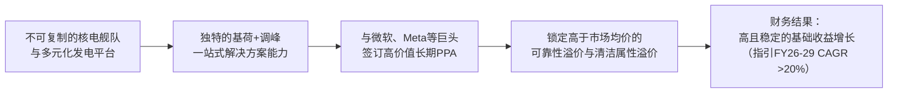

# Gangtise 公司一页通：星座能源（CEG.O）

> 拉取日期：2026-07-30 ｜ 来源：gangtise-agent `stock-one-pager`

## 公司概况

Constellation Energy（CEG）是美国最大的清洁能源生产商及领先的竞争性零售电力供应商。在2026年1月完成对Calpine的收购后，公司成为全球最大的私营电力生产商，拥有约**55 GW**的发电装机容量，年发电量可满足约**2700万户家庭**的用电需求，提供全美约**10%** 的清洁能源。其资产组合以**核电为核心**（约22 GW，全美最大核电舰队），辅以天然气、地热、水电、风电、太阳能及电池储能，并通过覆盖约**250万**客户账户（含四分之三的财富100强企业）的零售平台实现一体化运营。 

## 公司近况跟踪

- **Q1 2026业绩超预期但指引保守**：公司2026年Q1实现调整后EPS **$2.74**，超出市场一致预期的**$2.53**，主要受Calpine并表增厚、PJM容量收入上升及股权激励费用下降驱动。然而，公司仅**重申**2026全年调整后EPS指引区间**$11.00-$12.00**，未如部分投资者预期般上调，且2027年基础EPS指引（$7.60-$7.70）因未包含任何新增数据中心合同而显得保守，导致股价承压 *(2026年5月纪要及研报)*。  

- **签署首份零售业核电PPA**：2026年6月，公司与**沃尔玛**签署了一份15年期、约**176 MW**的核电购电协议（PPA），电力来自伊利诺伊州的Dresden清洁能源中心，用于供电其新建的高科技冷藏配送中心。这是沃尔玛的首份核电PPA，标志着核电企业购电协议正从科技巨头向更广泛的工商业客户拓展 *(2026年6月J.P. Morgan及个人观点)*。  

- **监管与互联取得关键进展**：FERC于2026年6月初批准了将Eddystone电厂的互联权转移至Crane清洁能源中心（原三哩岛1号机组），清除了该项目重启的一大障碍，使其有望在**2027年**重新并网发电。同时，FERC发布命令，要求所有区域电网运营商就大型负荷互联规则进行改革，为数据中心等大用户的接入提供了更清晰的监管路径 *(2026年6月瑞银及J.P. Morgan研报)*。  

- **新增产能持续落地**：Q1 2026期间，位于德州的**460 MW** Pin Oak Creek天然气调峰电厂及加州的**105 MW** Pastoria太阳能项目相继投运。公司已向PJM互联队列提交了约**5 GW**的新增容量项目，包括核电升级、天然气发电及储能，以备战PJM即将推出的可靠性备用采购（RBP）机制 *(2026年5月BMO及Jefferies研报)*。  

- **资本配置启动**：公司在2026年4月动用了约**$3.35亿**进行股票回购（约120万股，均价$285/股），并重申了总计**$50亿**的股份回购授权，计划在2026-2027年间执行，但该回购未包含在基础EPS增长指引中 *(2026年5月纪要)*。  

## 短期逻辑

1.  **PJM市场改革落地催生数据中心签约潮**：PJM正加速推进其可靠性备用采购（RBP）机制，目标在**2026年6月**向FERC提交最终框架。该机制旨在通过市场化手段解决大型负荷（如数据中心）接入带来的容量需求与成本分配问题。管理层在Q1电话会中明确表示，监管不确定性是当前部分超大规模客户推迟签署长期核电PPA的主要原因。一旦RBP规则在**未来一个季度内**明朗化，预计将触发一轮积压需求的释放。CEG已为此储备了约**5 GW**的待选项目（含核电升级、新建天然气及储能），并拥有约**147 TWh**的未签约清洁能源电量，具备率先签署高价值合同的卡位优势。FERC近期关于大型负荷互联改革的命令进一步增强了监管路径的可见度。  

2.  **Crane核电站重启的里程碑式进展**：FERC于6月初批准了Crane项目的互联权转移，这是继获得能源部**$10亿**贷款担保后的又一关键监管突破。该项目装机**835 MW**，已与微软签订20年期PPA，目前指向**2027年**重启的目标。随着主要监管障碍的清除，市场对该项目成功重启并按时贡献收益的信心将增强。瑞银测算，Crane项目全年贡献的每股价值约为**$26**。未来一个季度内，任何关于工程进度、预算控制及确切并网时间表的更新，都可能成为股价的积极催化剂。  

3.  **Q2财报及潜在的上修预期**：公司将于**2026年8月6日**公布Q2财报。尽管管理层在Q1后仅重申了全年指引，但花旗在7月底的预览中指出，Q2业绩可能受益于更高的PJM容量收入和季节性因素。若Q2业绩超出预期，且管理层对下半年展望积极，将增强市场对全年业绩达到指引区间上沿（$12.00）的信心。当前市场一致预期（FY26 EPS $11.54）位于指引中值附近，存在被上修的可能。 

## 长期逻辑

1.  **不可复制的核电资产在AI时代的稀缺性重估**：CEG拥有全美最大的核电舰队（**22 GW**），这些资产具备零碳排放、24/7基荷运行、燃料成本极低且稳定（约$6-$7/MWh）的特性，是满足AI数据中心对清洁、可靠电力近乎无限需求的最优解。新建同规模核电站面临十年以上的建设周期和巨大的成本超支风险，使得现有核电站成为一种**结构性稀缺资源**。公司已通过微软（Crane项目）和Meta（Clinton项目）的20年期PPA验证了这一价值。随着电网拥堵加剧和清洁电力需求增长，CEG剩余约**147 TWh**的未签约核电出力具备巨大的长期合约转化潜力，每转化1 GW核电PPA，预计可增厚EPS **$0.40-$1.00**。  

2.  **“核电基荷+天然气调峰”的混合平台优势**：收购Calpine后，CEG构建了独特的“核电基荷+天然气调峰”组合。核电提供稳定、低成本的清洁基荷电力，而Calpine带来的**21 GW**高效天然气联合循环机组则为满足客户（尤其是数据中心）的峰值负荷和灵活性需求提供了关键资源。这种组合使CEG能够为客户提供一站式、全天候的定制化电力解决方案，包括“Powered Land”共址开发、搭配储能和需求响应等，从而在合同谈判中获取更高的溢价。管理层预计，每1 GW的天然气“Powered Land”交易可带来**$0.20-$0.50**的EPS增厚。 

3.  **高度确定的长期盈利增长与强大的自由现金流生成能力**：公司的基础收益（Base Earnings）受益于与通胀挂钩的核电生产税收抵免（PTC）、长期合同及稳定的零售利润率，提供了高度可见的增长底线。管理层指引2026-2029年基础EPS复合年增长率（CAGR）超过**20%**，长期滚动三年增长率超过**10%**。更为重要的是，公司预计2028-2029年将产生**$115-$130亿**的自由现金流（扣除增长性资本开支前），这为持续的大规模股份回购、增值性并购及有机增长投资提供了坚实基础，构成了一个强大的股东回报飞轮。 

## 风险提示

- **电力价格与商品市场波动风险**：尽管有PTC和长期合同保护，CEG仍有大量发电量暴露于批发电价波动之下。公司“增强收益”（Enhanced Earnings）部分高度依赖核电售价超过PTC下限、天然气价差（Spark Spread）和容量价格。若AI投资热潮降温、电力需求不及预期，或天然气价格大幅下跌，将直接冲击该部分收益，导致盈利预测下调。  

- **PJM市场监管与政策不确定性**：公司的核心资产集中在PJM市场。PJM的容量市场设计、RBP规则细节、共址（Co-location）规则以及FERC的最终裁决，将深刻影响公司核电和天然气资产的价值实现方式。若最终规则不利于现有发电商，或对大型负荷征收过高费用而抑制需求，将削弱CEG的议价能力和增长前景。此外，联邦层面的核电PTC政策若发生不利变动，将动摇其基础收益的稳定性。  

- **大规模整合与运营风险**：收购Calpine使公司债务规模大幅增加（总债务从约$89亿增至约$201亿），杠杆率短期承压。尽管公司计划快速去杠杆，但整合过程中可能面临协同效应不达预期、文化冲突、资产剥离不顺等风险。同时，核电运营本身具有固有的安全和监管风险，任何重大安全事故或NRC的强制停机都可能导致灾难性的财务和声誉损失。  

## 近期要闻

- **2026年5月11日**：公司发布Q1 2026财报，调整后EPS **$2.74**超预期，但重申全年指引，未宣布新的数据中心交易。股价当日反应平淡。 

- **2026年6月2日**：FERC批准将Eddystone电厂的互联权转移至Crane清洁能源中心，为该项目在**2027年**重启扫清了关键障碍。 

- **2026年6月23日**：公司与沃尔玛签署了一份15年期、**176 MW**的核电购电协议，这是沃尔玛的首份核电PPA，标志着核电企业购电客户群的拓宽。  

- **2026年6月25日**：FERC发布命令，要求全美六大区域电网运营商在60天内就大型负荷互联规则进行改革，旨在提高透明度、防止成本转嫁，并促进共址和灵活负荷的接入。 

## 未来催化

- **2026年8月6日**：公司预计将发布Q2 2026财报。市场将关注业绩是否再次超出预期，以及管理层是否会基于强劲的上半年表现和更清晰的监管前景，上调全年盈利指引。 

- **2026年6月至9月**：PJM预计将在这一时期向FERC提交最终的可靠性备用采购（RBP）机制方案。该方案的明确化被视为释放被压制的数据中心PPA需求的关键催化剂。 

- **2026年6月30日**：Calpine原股东的**2500万股**股票锁定期到期。市场将密切关注这些股东是否会减持，以及CEG是否会借此机会加速执行其股份回购计划。  

- **2026年下半年**：随着PJM监管框架的清晰化，市场普遍预期公司将宣布新的、大规模的数据中心核电或天然气PPA。任何此类公告都将是对公司长期增长逻辑的有力验证。 

## 公司业务模式及拆分

### 业务边际变化

公司历史上最大的边际变化是2026年1月完成对Calpine的收购。此交易使CEG从一家以核电为主的清洁能源发电商，转变为一家拥有**55 GW**多元化机组、覆盖全美主要电力市场的综合性能源巨头。Calpine带来了约**23 GW**以天然气为主的发电资产和约**62 TWh**的零售负荷，显著增强了公司在ERCOT（德州）和加州的市场地位，并补强了其天然气发电和地热资产。整合后，公司正将战略重心转向利用其扩大的核电和天然气平台，为数据中心等大型客户提供“基荷+调峰”的一站式清洁电力解决方案。  

### 盈利模式

公司的盈利模式是“发电+零售”一体化。盈利来源主要分为两类：**基础收益**和**增强收益**。基础收益来自受PTC保护的核电出力、已签订长期合同的发电量（如与微软、Meta的PPA）以及零售业务的稳定利润率，这部分收益可预测性强。增强收益则来自核电售价超过PTC下限的部分、天然气发电的价差利润、容量市场收入以及零售业务的超额利润，这部分与市场电价高度相关，弹性更大。公司实质上是在利用其稀缺的清洁基荷资产和多元化的调峰资产，赚取“可靠性溢价”和“清洁属性溢价”。  

### 业务拆分

公司业务按运营模式可分为**发电业务**和**零售业务**。发电业务是利润核心，又可细分为核电、天然气及可再生能源。收购Calpine后，天然气发电的收入和利润占比大幅提升。公司目前处于**业绩兑现与产能爬坡期**，一方面在消化Calpine整合的协同效应，另一方面在积极投资核电升级、天然气新机组和储能项目，为承接数据中心新增负荷做准备。  

由于收购Calpine发生在2026年1月，2025年及以前的财务数据不包含Calpine，而2026年Q1数据已并表，因此业务结构发生了跳跃式变化。以下表格分别展示历史口径（不含Calpine）和最新报告期（含Calpine）的业务拆分数据。由于公开资料未提供分业务部门的完整利润表，以下数据基于公开披露信息整理，缺失部分以“-”表示。  

**历史业务拆分（不含Calpine）**

| 业务板块 | 指标 | FY2023 | FY2024 | FY2025 |
| :--- | :--- | :--- | :--- | :--- |
| **核电** | 发电量 (TWh) | 175.1 | 182.0 | 183.7 |
| | 容量因子 | 94.4% | 94.6% | 94.7% |
| **天然气及可再生能源** | 发电量 (TWh) | 24.1 | 22.5 | 21.8 |
| **零售业务** | 售电量 (TWh) | 203 | 202 | 204 |

*注：核电容量因子为运营机组数据，不含Salem和STP。*

**最新报告期业务拆分（含Calpine，2026年Q1）**

| 业务板块 | 指标 | FY2026 Q1 | 备注 |
| :--- | :--- | :--- | :--- |
| **核电** | 发电量 (TWh) | 40.0 | 占集团总发电量约63% |
| | 容量因子 | 92.3% | 受计划内停堆换料影响，属季节性低位 |
| **天然气及可再生能源** | 发电量 (TWh) | 23.0 | 含Calpine贡献，占集团总发电量约37% |
| | 联合循环机组容量因子 | 47.1% | - |
| **零售业务** | 年化供电量 (TWh) | ~275 | 整合Calpine后规模 |
| | 年化供气量 (Bcf) | ~800 | 整合Calpine后规模 |

**核电业务（2026年Q1）**：作为公司的核心利润引擎，核电舰队在Q1发电**4000万MWh**，容量因子为**92.3%**。该季度表现受计划内停堆换料天数增加（99天 vs. 去年同期88天）影响，但无计划外停机。核电享有PTC的价格保护，其基础收益高度稳定。公司正通过签署长期PPA（如与微软、Meta、沃尔玛的协议）将部分核电出力从随行就市的“增强收益”转化为锁定溢价的“基础收益”，提升盈利质量。  

**天然气及可再生能源业务（2026年Q1）**：该板块在整合Calpine后体量大幅增长，Q1发电**2300万MWh**。天然气机组（尤其是联合循环机组）作为调峰和基荷补充，其盈利能力取决于电力市场价格与天然气成本之间的价差。公司正积极推动“Powered Land”模式，在气电厂址为数据中心提供共址供电方案，以获取长期合同溢价。可再生能源（含地热、水电、风电、太阳能）则提供稳定的清洁电力输出，并满足客户的ESG需求。  

**零售业务（2026年Q1）**：作为全美最大的竞争性零售电力供应商之一，该业务板块年供电量约**2.75亿MWh**，服务约250万客户。其核心竞争力在于庞大的客户基础、强大的数据分析能力和定制化解决方案。该业务利润率相对稳定，是公司重要的现金流来源，并可作为发电资产的天然对冲工具。整合Calpine后，客户交叉销售和负荷管理能力进一步增强。  

## 核心竞争力

**竞争要素 1：依托不可复制的核电舰队形成的结构性稀缺资产护城河**

- **护城河定性**：**结构性护城河**。CEG拥有全美最大的核电舰队（22 GW），这些资产具有极高的政策、资本和技术壁垒。新建核电站需要十年以上的周期、百亿美元级别的投资，并面临巨大的监管不确定性，使得现有核电站成为几乎无法被竞争对手复制的稀缺资产。在AI驱动下，市场对24/7清洁电力的需求激增，而核电是唯一能大规模提供此类电力的成熟技术，其战略价值正在被重估。  
- **数据验证**：公司核电容量因子持续**94%以上**，高于行业平均约4个百分点，意味着每年比同行多产出约800万MWh的电力。核电的燃料成本极低且稳定（约$6-$7/MWh），而当前市场电价和PPA价格远高于此，形成了巨大的利润空间。公司已签署的核电PPA（如与微软、Meta的协议）价格预计在**$70-$80/MWh**区间，远高于PTC保护价（约$45-$50/MWh），验证了其获取高额“可靠性溢价”的能力。  
- **动态演变**：**护城河变宽**。随着电网脱碳压力加大、新建电源成本飙升以及AI数据中心对基荷清洁电力的渴求，现有核电站的稀缺性和议价能力将持续增强。公司正通过申请二次延寿（将运行寿期从60年延至80年）和投资升级（Uprate）来进一步挖掘存量资产价值，延长其产生超额回报的周期。  

**竞争要素 2：以“核电基荷+天然气调峰”组合构建的一站式解决方案能力**

- **护城河定性**：**行业阶段性红利**，但有潜力转化为结构性优势。收购Calpine后，CEG成为少数能同时提供大规模清洁基荷电力（核电）和灵活调峰电力（天然气）的供应商。这种组合恰好满足了数据中心客户对“全天候、高可靠性”电力的核心诉求。虽然天然气发电本身不具备高壁垒，但将其与稀缺的核电资产捆绑，形成定制化解决方案（如“Powered Land”），显著提升了客户粘性和合同价值。 
- **数据验证**：公司已披露的ERCOT地区数据中心协议（与CyrusOne合计超**1.1 GW**）正是这一模式的体现。管理层指引，每1 GW的此类天然气“Powered Land”交易可增厚EPS **$0.20-$0.50**。公司计划至2030年新增约**10 GW**的支持性产能（含天然气、储能、核电升级），以匹配这一需求。 
- **动态演变**：**护城河变宽**。随着电网互联瓶颈日益严重，拥有现成厂址、电网接入点和多元化机组的大型发电平台，其“时间套利”优势将愈发明显。竞争对手难以在短时间内复制这种规模的资产组合和土地资源。 

**现阶段核心驱动力总结**：公司的Alpha在于其**独一无二的核电资产稀缺性**，这构成了估值溢价的核心。Beta则来自于**AI驱动的电力需求增长**和**监管环境的演变**（如PJM市场改革、PTC政策）。CEG正处在将Beta机遇通过长期合同转化为Alpha收益的关键阶段。  

**竞争格局传导逻辑图**：

## 产销链

- **客户情况**：公司客户结构多元化。**零售业务**服务于约250万客户账户，覆盖80%的财富100强企业，客户集中度低，2025年工商业客户续约率达**77%**。**批发业务**方面，近年来大型科技公司成为重要的增量客户，已与**微软**（Crane项目，835 MW）和**Meta**（Clinton项目，1,121 MW）签订了20年期核电PPA。单一客户依赖度在上升，但此类合同期限长、信用质量高，且能锁定超额利润，风险收益特征与传统依赖不同。公司正与更多潜在超大规模客户进行谈判。  

- **供应商情况**：核心成本项中，**核燃料**供应链是关注焦点。公司通过长期合同采购铀浓缩物、转换和浓缩服务，约**35%** 的铀浓缩物需求（2026-2031年）由三家供应商提供，且部分合同源自俄罗斯。美国已立法禁止进口俄罗斯低浓缩铀，但允许豁免。公司已采取措施增加核燃料库存，并寻求供应多元化，但地缘政治风险仍是潜在的供应中断和成本上升因素。**天然气**则通过长短协和现货市场采购，供应相对充足。  

- **成本传导能力**：公司具备较强的成本传导能力。核电燃料成本占比极低，几乎不受燃料价格波动影响。对于天然气发电，公司可通过电力市场将燃料成本传导出去，其盈利核心在于“价差”而非绝对气价。在零售端，公司可通过灵活的定价策略将电力采购成本转嫁给工商业客户。公司赚取的是**“清洁、可靠电力的稀缺性溢价”**，而非单纯的加工费或资源钱。  

## 财务数据

### 关键财务数据

*币种：美元 | 单位：亿元*

| 项目 | FY2023 | FY2024 | FY2025 | FY2026 Q1 |
| :--- | :--- | :--- | :--- | :--- |
| **截止日期** | 2023-12-31 | 2024-12-31 | 2025-12-31 | 2026-03-31 |
| **营业总收入** | 249.18 | 235.68 | 255.33 | 111.22 |
| 收入同比 | 1.96% | -5.42% | 8.34% | 63.85% |
| **营业成本** | 160.01 | 114.19 | 146.81 | 63.52 |
| **毛利润** | 89.17 | 121.49 | 108.52 | 47.70 |
| **毛利率** | 35.79% | 51.55% | 42.50% | 42.89% |
| **营业利润** | 78.21 | 110.26 | 98.67 | 43.27 |
| 营业利润率 | 31.39% | 46.79% | 38.64% | 38.91% |
| **归母净利润** | 16.23 | 37.49 | 23.19 | 15.90 |
| 归母净利率 | 6.51% | 15.91% | 9.08% | 14.30% |
| **稀释EPS (美元)** | 5.01 | 11.89 | 7.40 | 4.49 |
| **自由现金流** | -53.01 | -24.64 | 42.37 | 4.25 |

*注：自由现金流以经营活动现金流量净额近似替代。FY2026 Q1收入同比大增主要因并表Calpine。*

### 财务分析

- **成长能力**：FY2026 Q1营收因收购Calpine而录得**63.85%** 的同比增长，呈现跳跃式增长。剔除并购影响，FY2025年营收增长**8.34%**，主要得益于电价和容量价格上涨。归母净利润波动较大，FY2025年同比下滑**38.14%**，主因核电PTC收入因电价上涨而大幅减少（从FY2024的$20.80亿降至$3.20亿），这体现了PTC“自动稳定器”的特性——在市场电价高时减少补贴，反之则增加补贴，从而平滑现金流。  

- **盈利能力**：毛利率在FY2024年达到**51.55%** 的高点后，FY2025回落至**42.50%**，FY2026 Q1为**42.89%**。毛利率的波动主要受电价、燃料成本及PTC收入确认的综合影响。Calpine的并入拉低了整体毛利率，因其天然气发电业务的燃料成本占比远高于核电。调整后（Non-GAAP）运营EPS是更好的盈利衡量指标，FY2025为**$9.39**，公司指引FY2026为**$11.00-$12.00**，显示核心盈利能力在并购增厚下将大幅提升。  

- **偿债能力与资本结构**：收购Calpine使公司总债务从FY2025末的约**$89亿**激增至FY2026 Q1末的约**$224.66亿**（短期+长期债务），总资产则从**$572.49亿**增至**$969.11亿**。杠杆率短期承压，但公司目标在2027年底将债务/EBITDA降至**2倍**。穆迪和标普均维持了投资级评级（Baa1/BBB+），反映了市场对其现金流生成能力和去杠杆计划的信心。公司拥有**$47亿**的剩余股份回购授权和强劲的自由现金流预期，资本配置灵活性高。  

## 行业及竞争分析

公司处于**美国独立发电商（IPP）** 行业，并深度参与**竞争性零售电力市场**。其投入最多的细分行业是**核电发电**和**天然气发电**。 

- **行业需求**：在经历了十余年的电力需求停滞期后，美国正进入一个由**AI数据中心、制造业回流和电气化**驱动的电力需求增长新时代。国际能源署（IEA）预测，到2030年全球数据中心电力需求可能翻倍。PJM和ERCOT等主要市场均报告了创纪录的大型负荷互联申请，尽管实际落地率存在不确定性，但需求增长的长期趋势高度确定。  

- **竞争格局**：在IPP领域，CEG的主要竞争对手包括**Vistra (VST)**、**Talen Energy (TLN)** 和**NRG Energy (NRG)**。与同行相比，CEG的差异化优势在于其**庞大的核电资产组合**，这提供了无与伦比的清洁基荷电力。Vistra和NRG也拥有核电资产，但规模较小，且业务更侧重于天然气和零售。Talen的核电资产集中在PJM，与CEG直接竞争。在零售端，CEG与NRG和Vistra是主要的全国性竞争性零售商。  

**可比公司分析**

| 公司名称 | 股票代码 | 核心发电资产 | 竞争优势 | 与CEG的主要差异 |
| :--- | :--- | :--- | :--- | :--- |
| **Vistra Corp.** | VST | 天然气、核能、煤炭、储能 | 规模庞大，资产组合多元化，在ERCOT和PJM均有强大布局 | 核电占比远低于CEG，含煤炭资产，零售业务规模更大 |
| **Talen Energy** | TLN | 核能、天然气 | 核电资产集中于PJM，受益于同一市场的电价上涨 | 资产和地域集中度更高，无零售业务，增长弹性大但风险也更高 |
| **NRG Energy** | NRG | 天然气、核能 | 领先的零售平台，强大的客户解决方案能力 | 核电资产规模小，发电组合偏重天然气，更侧重于零售端的价值创造 |

**总结分析**：CEG凭借其**不可复制的核电舰队**，在清洁基荷电力这一高价值细分市场建立了独特的竞争地位。与同行相比，其盈利的稳定性和长期可见性更强，理应享有估值溢价。收购Calpine后，公司补上了天然气调峰的短板，使其解决方案更具竞争力。当前行业的核心竞争要素正从“成本领先”转向“**可靠性、清洁性和交付速度**”，CEG在这三方面均具备显著优势。  

## 市场焦点议题

**议题一：数据中心PPA的签约速度和规模不及预期**

- **背景**：自2024年与微软签署Crane项目PPA后，市场对CEG快速签署更多大规模核电PPA抱有极高期望。然而，2025年至今仅新增了Meta的Clinton项目和沃尔玛的小规模协议，远低于部分投资者的乐观预期，导致股价从高点回落。  
- **问题列表**：
  - PJM市场的监管不确定性（如RBP规则、共址规则）在多大程度上阻碍了PPA谈判？客户是否在等待规则明确后才愿意签约？
  - 公司是否因坚持较高的合同溢价而放慢了签约节奏？当前谈判中的价格预期是多少？
  - 除科技巨头外，来自制造业、零售业等其他行业的清洁电力需求是否足以弥补潜在的需求缺口？

**议题二：Calpine整合的协同效应与去杠杆路径**

- **背景**：收购Calpine使CEG的债务规模激增，市场担忧其资产负债表压力和整合风险。尽管公司给出了明确的去杠杆和增长目标，但执行效果仍需时间验证。  
- **问题列表**：
  - 2026年Q1的业绩中，Calpine贡献的**$0.45** EPS增厚是否可持续？成本协同效应何时能完全体现？
  - 在2027年底前将债务/EBITDA降至2倍的目标，主要依赖EBITDA增长还是债务偿还？如果电力市场环境恶化，该目标是否面临风险？
  - 计划出售的PJM资产（因反垄断要求）进展如何？出售价格和时机是否会影响去杠杆进程？

**议题三：核电PTC政策的长期确定性**

- **背景**：核电PTC是公司基础收益的基石，提供了关键的下行保护。尽管《One Big Beautiful Bill Act》保留了该税收抵免，但任何关于修改或废除该政策的政治讨论都可能动摇市场信心。  
- **问题列表**：
  - 当前PTC政策有效期至2032年，之后公司核电资产的盈利能力将如何保障？是否会寻求更多长期PPA来替代？
  - 如果未来政府财政压力增大，PTC被提前削减或修改的概率有多大？公司对此有何预案？

## 市场分歧探讨

**核心分歧：当前估值是否已充分反映了公司的增长潜力，还是已经透支了未来预期？**

- **乐观方观点**：当前约**24倍**的2026年预期市盈率，对于一家基础EPS复合年增长率超过**20%**、且拥有几乎不可复制的稀缺资产的公司而言，并不昂贵。其PEG比率远低于行业平均水平。估值应基于其核电资产的长期稀缺价值和巨大的PPA转化潜力。一旦PJM监管落地，公司将进入新一轮的合同签署和盈利上修周期，远期市盈率将迅速消化。强大的自由现金流和巨额回购授权为股价提供了安全垫。  

- **谨慎方观点**：当前的估值已计入了大量尚未落地的乐观预期，尤其是大规模数据中心PPA。2027年基础EPS指引（$7.60-$7.70）的显著下降表明，若没有新合同，盈利增长将出现断档。与Vistra、NRG等同行相比，CEG的估值溢价过高，而其近期在PPA签约上的执行力并未证明其应享有如此高的溢价。市场可能低估了监管风险、整合风险以及AI电力需求不及预期的风险。  

**分歧点分析**：该分歧的本质在于对CEG**资产稀缺性**和**管理层的合同执行力**的定价差异。乐观方在为“可能性”支付溢价，而谨慎方则要求看到“确定性”的证据。从当前时点看，公司已通过Crane、Clinton和沃尔玛等项目证明了其核电资产的合同吸引力。PJM监管框架的明朗化是打破僵局、将“可能性”转化为“确定性”的关键变量。若公司在2026年下半年能签署至少一份新的大型PPA，将有力支持乐观方的观点；反之，若签约继续停滞，估值溢价将面临持续收缩的风险。  

## 盈利预测与估值

*注：以下数据来源于各机构研究报告，预测年份后加“E”表示。CEG财年与自然年一致。*

| 机构 | 评级 | 目标价(美元) | 财务指标 | FY2026E | FY2027E | FY2028E | FY2029E |
| :--- | :--- | :--- | :--- | :--- | :--- | :--- | :--- |
| **Barclays** (2026-04-07) | 增持 | 360 | 调整后EPS (美元) | 11.96 | 14.22 | 16.27 | 19.03 |
| | | | 调整后EBITDA (百万美元) | 8,604 | 10,164 | 11,214 | - |
| **BNP Paribas** (2026-03-23) | 跑赢大盘 | 407 | 调整后EPS (美元) | 8.72 | 11.91 | 19.47 | 23.34 |
| | | | 调整后EBITDA (百万美元) | 7,900 | 9,338 | 12,512 | 13,498 |
| **Citi** (2026-07-29) | 中性/高风险 | 297 | 调整后EPS (美元) | - | - | - | - |
| **UBS** (2026-06-03) | 买入 | 388 | 调整后EPS (美元) | 11.53 | 13.35 | 17.75 | 19.54 |
| **BMO Capital** (2026-05-19) | 跑赢大盘 | 390 | 调整后EPS (美元) | 11.79 | 12.91 | 17.12 | - |
| | | | 调整后EBITDA (百万美元) | 8,394 | 8,527 | 10,372 | - |

**盈利预测与估值分析**：机构对CEG的评级普遍偏向积极，多数给予“买入”或“增持”评级，目标价区间在**$297至$407**之间，中位数约为**$389**。分歧主要在于对远期（2028-2029年）盈利的预测，这反映了对数据中心PPA落地速度和规模的不同假设。例如，BNP Paribas的预测最为乐观，其2028年EPS预测（$19.47）远高于Barclays（$16.27），主要因为其对电价和天然气价差的假设更为激进。估值方法上，多数机构采用**EV/EBITDA**和**市盈率（P/E）** 相结合或**自由现金流收益率（FCF Yield）** 的方法，并普遍对基础收益部分给予估值溢价，以反映其稳定性和可预测性。     

**管理层指引**：在2026年3月31日的业务展望电话会上，管理层给出了以下指引：
- **2026年**：调整后运营EPS指引区间为 **$11.00 - $12.00**。  
- **2026-2029年**：基础EPS复合年增长率（CAGR）超过 **20%**，长期（滚动三年）基础EPS增长率超过 **10%**。该指引**不包含**任何未宣布的新核电或天然气PPA、股份回购以及高于当前远期曲线的电价假设。
"""
