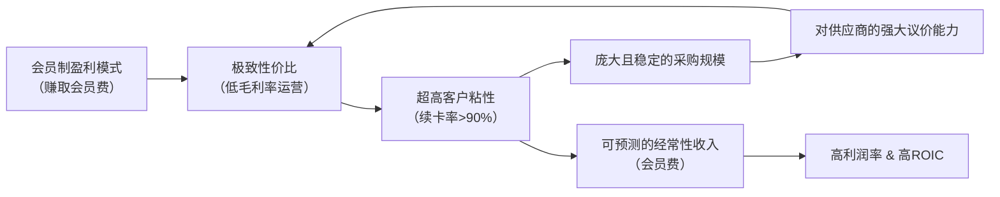

# Gangtise 公司一页通：好市多（COST.O）

> 拉取日期：2026-07-30 ｜ 来源：gangtise-agent `stock-one-pager`

## 公司概况

好市多（Costco Wholesale Corporation）是全球第三大零售商，采用会员制仓储量贩模式，通过极低毛利率（2025财年商品毛利率约11.12%）销售精选SKU商品，以高周转和会员费为核心盈利来源。截至2026财年第三季度末，公司在全球运营928家门店，其中美国633家，总付费会员8,290万，续卡率在美加地区达92.2%。其自有品牌Kirkland Signature销售占比约33%，是强化定价权和会员粘性的关键工具。   

## 公司近况跟踪

- **6月同店销售增速环比放缓，但仍处高位**：2026年6月核心可比销售额（剔除汽油和汇率影响）同比增长7.0%，较5月的8.0%有所放缓，但美国市场仍保持7.6%的强劲增速。全球客流量增长3.2%，客单价（剔除汽油和汇率）增长3.7%。管理层认为6月表现稳健，5月的高增长部分受汽油价格飙升带来的额外客流提振。    
- **第三季度业绩超预期，但毛利率承压**：FY2026 Q3（截至2026年5月10日）净销售额691.5亿美元，同比增长11.6%，高于市场预期。净利润21.92亿美元，同比增长15.2%。然而，毛利率同比下降21个基点至11.04%，主要因公司主动利用成本下降（如鸡蛋、牛肉）进行降价投资，以及运输成本上升。  
- **会员增长结构性放缓，但质量提升**：总付费会员同比增长4.1%，增速较前几个季度放缓，部分归因于近期新店多为现有市场填充式开店，而非开拓新市场。但Executive会员同比增长9.6%，占总付费会员近半，贡献约75%的销售额，显示会员质量持续提升。续卡率在经历几个季度的下滑后，于Q3企稳，美加地区回升至92.2%。  
- **数字化业务持续高增**：Q3数字化可比销售额增长21.5%（剔除汇率后20.8%），6月进一步加速至21.5%。公司持续优化App体验、扩展即时配送（Same-Day Delivery）服务，并探索AI在商品信息优化和个性化推荐中的应用，个性化推荐转化率为常规水平的3倍。   
- **资本开支加速，聚焦门店扩张与改造**：公司计划FY2026资本支出约65亿美元，用于新开约30家门店（全年预计净增29家）、现有高流量门店改造（扩大停车场和加油站）、配送中心网络扩张及数字化升级。管理层重申未来每年净增30家以上门店的目标。  

## 短期逻辑

1.  **汽油价格回落对利润率的结构性利好**：近期中东局势缓和导致汽油价格从高位回落。在Q3，高汽油价格虽拉升了营收，但因公司主动扩大价差以吸引客流，汽油业务利润率反而下降，并对整体毛利率造成约21个基点的拖累。随着汽油价格降温，这一利润率逆风将缓解。同时，Q3因高油价首次使用Costco加油站的新会员，其消费习惯和忠诚度有望在未来几个季度持续释放，形成“流量留存”效应。 

2.  **关税退款返还的潜在催化剂**：公司已启动IEEPA关税退款申请，并明确表示计划以某种形式返还会员。虽然具体金额和时间尚不确定，但市场普遍预期这将是一次性的消费者刺激。若退款在夏季末或秋季落地，可能对同店销售和会员续卡率产生额外的正向推动，构成短期交易催化。  

3.  **核心利润率环比改善的预期差**：Q3核心商品毛利率（Core-on-Core）下降9个基点，引发市场对竞争加剧和公司主动让利的担忧。但管理层解释，这主要是利用LIFO费用减少和特定商品（鸡蛋、牛肉）成本下降的窗口期，进行的一次性策略性降价。随着这些临时性因素消退，且SG&A费用在剔除一次性法律和医疗成本后仍实现杠杆效应，Q4核心利润率存在环比改善的可能，有望修正市场的悲观预期。 

## 长期逻辑

1.  **会员生态的飞轮效应与定价权**：Costco的商业模式核心是“低价精选商品 → 会员高续卡率 → 规模效应 → 更强的供应链议价能力 → 更低价”。92.2%的美加续卡率和持续增长的Executive会员渗透率（已近50%）是这一飞轮运转的明证。这种模式下，公司赚取的是会员费而非商品差价，使其在通胀或通缩周期中均能保持“定价权威”，即消费者心中“Costco就是最低价”的认知。这种信任构成了极深的护城河，转换成本极高。   

2.  **全球门店扩张的长期增长跑道**：公司已识别出约300个潜在新店址，全部位于现有运营国家，无需进入新地理区域承担过高风险。目前每年约30家的开店速度，对应约3%的平方英尺增长，为收入提供了稳定的结构性增量。国际业务（尤其是亚洲和欧洲）的利润率普遍高于美国本土，随着国际门店占比提升，有望对整体利润率产生正向拉动。  

3.  **数字化作为增量而非替代的变现潜力**：Costco的数字化战略并非颠覆线下，而是增强会员粘性和钱包份额的工具。即时配送（Same-Day Delivery）增速高于整体数字业务，且高消费会员占比显著。零售媒体业务尚处早期，但已展现出高转化率。这些轻资产、高回报的数字化业务，为公司提供了在不破坏核心仓储模式的前提下，提升会员全生命周期价值的长期路径。  

## 风险提示

- **估值收缩风险**：公司当前市盈率约46倍，显著高于其长期历史均值（约31倍）和行业可比公司。这一估值隐含了市场对其中高个位数同店增长和利润率持续扩张的乐观预期。若未来同店销售增速因消费疲软或竞争加剧而放缓至5%以下，或利润率未能如期改善，估值可能面临显著收缩。  
- **会员增长放缓与结构变化**：总付费会员增速已放缓至4.1%，且新增会员中线上渠道占比提升，这部分会员的续卡率历来偏低。虽然Executive会员增长强劲，但若整体会员基数增长持续停滞，将影响长期收入增长中枢。公司需证明其数字化获客策略能有效提升这部分新会员的生命周期价值。  
- **竞争加剧与价格战风险**：美国零售业竞争激烈，沃尔玛、亚马逊等巨头在价格和配送速度上持续投入。近期有市场消息称沃尔玛和克罗格正加大价格投资，可能引发新一轮“食品杂货价格战”。虽然Costco的商业模式具有防御性，但在极端竞争环境下，其维持“定价权威”的成本可能上升，导致利润率承压。 

## 近期要闻

- **2026年5月28日**：公司公布FY2026 Q3财报，营收超预期但毛利率下滑，股价反应平淡。 
- **2026年6月2日**：公司公布5月销售数据，核心可比销售额增长8.0%，受汽油价格飙升和强劲的美国消费驱动，表现强劲。 
- **2026年7月7日**：公司公布6月销售数据，核心可比销售额增长7.0%，较5月有所放缓，但美国市场仍保持7.6%的增速。同时宣布每股1.47美元的季度股息。   
- **2026年7月28日**：摩根士丹利发布与公司管理层（CEO、CFO等）的会议纪要，管理层表示消费需求保持韧性，未观察到消费行为有实质性恶化，并强调数字投资和门店扩张的长期战略。 

## 未来催化

- **2026年8月5日**：公司预计将公布7月销售数据。7月将开始面临去年同期延长Executive会员购物时间的基数效应（该举措当时贡献了约1个百分点的周销售额），市场将密切关注同店销售增速能否维持在6%-7%的区间。   
- **2026年9月24日**：公司预计将公布FY2026 Q4财报。这将是公司财年最后一个季度，市场关注点包括：全年资本开支和开店目标的完成情况、核心利润率在剔除一次性因素后的真实趋势、以及管理层对FY2027的初步展望和指引。 
- **未来数月**：IEEPA关税退款的具体返还方案和时间表可能公布。任何关于退款规模、返还形式（现金券、直接抵扣等）的明确信息，都可能成为刺激消费和提振股价的短期事件。 

## 公司业务模式及拆分

### 业务边际变化

公司近年持续在传统仓储模式上进行数字化赋能和品类延伸。数字化方面，公司已将披露口径从“电商销售”调整为“数字化销售”，涵盖所有线上发起的交易（包括即时配送和旅行服务），更准确地反映其全渠道战略。即时配送业务增速强劲，会员满意度高。品类方面，公司持续强化Kirkland Signature品牌，推出能量饮料、超滤牛奶等新品，并利用其品牌信任度进入高价值商品领域（如黄金、高端家电）。此外，零售媒体业务作为新的利润增长点，正处于早期快速发展阶段。   

### 盈利模式

Costco的盈利模式核心是“会员费驱动”。公司以极低的毛利率（约11%）销售商品，覆盖运营成本，而净利润几乎全部来自会员费收入。2025财年，会员费收入53.23亿美元，占运营利润（103.83亿美元）的51.3%。这种模式将公司利益与会员利益高度绑定，形成了强大的客户忠诚度和可预测的经常性收入流。  

### 业务拆分

公司营收主要分为**净销售额**和**会员费收入**两大部分。净销售额可进一步按品类划分为**核心商品**（食品和杂货、非食品、生鲜食品）、**仓储辅助业务**（汽油、药房、光学等）和**其他业务**（电商、商务中心、旅行等）。近年来，汽油和电商业务的增速快于核心商品，导致整体毛利率的结构性变化。  

**细分业务拆分（单位：亿美元）**

| 项目 | FY2023 | FY2024 | FY2025 | FY2026 Q1-Q3 |
|---|---|---|---|---|
| **截止日期** | 2023-09-03 | 2024-09-01 | 2025-08-31 | 2026-05-10 |
| **净销售额** | 2,372.90 | 2,496.25 | 2,699.12 | 2,033.74 |
| 同比 | 6.76% | 5.02% | 8.17% | 9.71% |
| 占比 | 97.94% | 98.10% | 98.07% | 98.04% |
| **会员费收入** | 45.80 | 48.28 | 53.23 | 40.57 |
| 同比 | - | 5.41% | 10.25% | 12.73% |
| 占比 | 1.89% | 1.90% | 1.93% | 1.96% |
| **总营收** | 2,422.90 | 2,544.53 | 2,752.35 | 2,074.31 |

**核心商品与辅助业务销售表现（基于管理层讨论）**

| 品类 | FY2025表现 | FY2026 Q3表现 |
|---|---|---|
| **核心商品** | 销售额增长10%，所有子类别均增长。 | 可比销售额增长约7%（剔除汇率），其中非食品中高个位数增长，生鲜食品中个位数增长，食品和杂货低至中个位数增长。 |
| **仓储辅助及其他** | 销售额增长2%，主要由汽油和药房驱动。 | 可比销售额增长超20%，主要由汽油（增长超30%）、药房和助听器驱动。 |

**会员费收入**：FY2026 Q3会员费收入13.73亿美元，同比增长10.7%。增长由新会员注册、2024年9月美加会费上调（贡献约25%的增长）和Executive会员升级共同驱动。截至Q3末，总付费会员8,290万，Executive会员4,120万。  

**核心商品毛利率（Core-on-Core）**：FY2026 Q3，核心商品毛利率（占核心商品销售额的百分比）同比下降9个基点。下降主因是生鲜食品和食品杂货类别的策略性降价，部分被非食品类别的改善所抵消。  

## 核心竞争力

**竞争要素 1：依托极高转换成本与规模效应构筑的“定价权”护城河**

-   **护城河定性**：**结构性护城河**。Costco的护城河并非来自单一技术或牌照，而是由其“会员费”盈利模式、极致性价比口碑和全球采购规模共同构成的商业系统。会员预付年费后，其消费行为会自然向Costco集中以“赚回”会费，形成极高的转换成本。超9成的续卡率是这一壁垒的直接证据。这种稳定的需求基本盘，反过来赋予公司对供应商的强大议价能力，形成“量大价优”的规模效应，进一步巩固其价格优势。   
-   **数据验证**：FY2026 Q3，公司全球同店销售（剔除汽油和汇率）增长6.6%，客流量增长2.4%，均显著优于多数传统零售商。其SG&A费用率仅为8.96%，远低于同行，体现了极致的运营效率。全球续卡率89.7%，美加地区92.2%，是客户粘性的量化证明。  
-   **动态演变**：**护城河变宽（巩固）**。公司正通过数字化手段（如即时配送、个性化推荐）和增加Executive会员权益（如延长营业时间）来增强会员粘性，尤其是对年轻、数字化获客群体的吸引力。同时，每年约30家的全球扩张计划，持续扩大其采购规模和地理覆盖，使规模效应和品牌影响力进一步增强。  

**竞争要素 2：自有品牌Kirkland Signature的品牌信任壁垒**

-   **护城河定性**：**结构性护城河**。Kirkland Signature已超越普通自有品牌，成为消费者心中“高品质、低价格”的代名词。公司通过严格筛选代工厂，以接近成本的价格销售，使其成为对标全国性品牌的“杀手锏”。这不仅提升了会员价值，更成为公司与品牌供应商谈判的筹码，迫使品牌商提供更低价格以避免被Kirkland替代。  
-   **数据验证**：Kirkland Signature销售额占比约33%，且仍在持续增长。在通胀环境下，消费者转向自有品牌的趋势明显，Kirkland成为吸引和留住会员的关键。公司持续推出Kirkland新品（如能量饮料、超滤牛奶），验证了其跨品类延伸的能力。  
-   **动态演变**：**护城河变宽（巩固）**。随着公司全球扩张和会员基数增长，Kirkland的销量规模将进一步扩大，其单位成本有望继续下降，从而强化其性价比优势。同时，Kirkland品牌正逐步向高价值、高信任度品类渗透，品牌势能持续提升。  

**现阶段核心驱动力总结**：
Costco的Alpha在于其独特的商业模式和强大的品牌信任，使其在零售业中具备罕见的定价权和客户粘性。其Beta则与美国消费大盘，尤其是中高收入群体的消费意愿紧密相关。当前阶段，公司增长由稳定的同店销售、会员升级和全球扩张共同驱动，展现出穿越周期的韧性。  

**竞争格局传导逻辑图**：

## 产销链

- **客户情况**：Costco直接服务C端消费者和小企业主，客户基础庞大且分散，无单一客户依赖风险。截至FY2026 Q3，总持卡人达1.485亿。Executive会员（年费130美元）占比虽不到50%，但贡献了约75%的销售额，是核心价值客户。公司通过持续增加Executive会员专属权益（如延长营业时间、Instacart返现）来提升其吸引力和留存率。  
- **供应商情况**：公司采用直接采购模式，绕过中间商以降低成本。财报明确指出，公司不从任何单一供应商处采购大量商品，分散了供应链风险。Kirkland Signature品牌是公司与供应商博弈的关键工具，公司会寻找代工厂生产自有品牌商品，以此作为与全国性品牌谈判的筹码。当供应来源中断时，公司有能力寻求替代来源或商品。 
- **成本传导能力**：Costco赚取的是“会员费”而非“商品差价”，这使其在面对上游成本波动时，拥有比传统零售商更大的战略灵活性。公司倾向于率先降价、最后涨价，以维护其“定价权威”。当成本下降时（如Q3的鸡蛋和牛肉），公司会迅速调低售价让利会员，以巩固信任和驱动流量，即使这会在短期内压缩商品毛利率。  

## 财务数据

**关键财务数据（单位：亿美元）**

| 项目 | FY2023 | FY2024 | FY2025 | FY2026 Q1-Q3 |
|---|---|---|---|---|
| **截止日期** | 2023-09-03 | 2024-09-01 | 2025-08-31 | 2026-05-10 |
| **总营收** | 2,422.90 | 2,544.53 | 2,752.35 | 2,074.31 |
| 同比 | 6.76% | 5.02% | 8.17% | 9.71% |
| **营业成本** | 2,125.86 | 2,223.58 | 2,398.86 | 1,807.48 |
| **毛利率** | 12.26% | 12.61% | 12.84% | 12.86% |
| **营业利润** | 81.14 | 92.85 | 103.83 | 78.84 |
| 营业利润率 | 3.35% | 3.65% | 3.77% | 3.80% |
| **归母净利润** | 62.92 | 73.67 | 80.99 | 62.28 |
| 同比 | 7.67% | 17.09% | 9.94% | 13.46% |
| **稀释EPS (美元)** | 14.16 | 16.56 | 18.21 | 14.01 |
| **自由现金流** | 67.45 | 66.29 | 78.37 | 69.05 |

*注：自由现金流 = 经营活动现金流量净额 - 资本支出。FY2026 Q1-Q3数据为截至2026年5月10日的36周数据。*

**财务分析**：

- **成长能力**：公司营收增速在FY2025和FY2026前三季度回升至8%-10%区间，主要受同店销售增长、新店扩张和会员费收入增加的共同驱动。净利润增速略高于营收增速，显示出一定的经营杠杆效应。 
- **盈利能力**：毛利率在FY2023-FY2025年间持续小幅扩张，从12.26%提升至12.84%，体现了公司在供应链效率、自有品牌渗透和辅助业务（如电商）改善方面的成效。营业利润率亦稳步提升。但需注意，FY2026 Q3毛利率同比下滑，显示公司正在将部分成本下降的收益返还给消费者。  
- **运营能力**：作为零售企业，存货管理是关键。公司FY2025年报提及，由于库存周转加快和供应商付款条件改善，净商品库存投资（存货与应付账款之差）减少，对现金流产生了积极影响。这体现了其强大的供应链管理能力。  
- **现金流与资本配置**：公司是典型的“现金牛”，经营活动现金流强劲且持续增长。自由现金流充裕，足以覆盖资本开支、股息和股票回购。FY2024年自由现金流较低，主要因当年支付了约66.55亿美元的特别股息。公司资产负债表稳健，现金及等价物充足，净债务为负。  

## 行业及竞争分析

**行业赛道：会员制仓储量贩**

Costco所处的会员制仓储量贩赛道，是美国零售业中增长最稳健、竞争格局最清晰的细分市场之一。该赛道通过大包装、低SKU、低毛利的模式，满足中高收入家庭和小企业的周期性、计划性消费需求。其核心竞争要素是**供应链效率、自有品牌能力和会员粘性**。  

- **市场规模与增速**：美国仓储量贩市场由Costco、Sam‘s Club（沃尔玛旗下）和BJ’s Wholesale Club三家主导。Costco在美国的市场份额远超两者。该市场的增长由门店扩张和同店销售增长共同驱动，长期增速高于传统零售业。 
- **竞争格局**：行业呈现“一超两强”的寡头格局。Costco在单店销售、会员费收入、续卡率和自有品牌渗透率等关键指标上均处于领先地位。Sam‘s Club近年来通过数字化投资和门店改造加速追赶，但Costco在消费者心智中的“定价权威”和品牌信任度仍难以撼动。 
- **行业趋势**：
    - **数字化融合**：线上线下一体化成为标配，但仓储模式的“寻宝”体验和批量购买仍是核心价值。 
    - **自有品牌升级**：自有品牌从低价替代品向高品质、差异化商品演变，成为提升毛利率和会员忠诚度的关键。 
    - **体验与服务延伸**：加油站、药房、光学中心等辅助服务成为引流和增强粘性的重要手段。 

**可比公司**

| 公司名称 | 股票代码 | 对标维度 | 分析 |
|---|---|---|---|
| Walmart (Sam‘s Club) | WMT | 商业模式、目标客群 | Sam’s Club是Costco最直接的竞争对手，但两者策略存在差异。Sam‘s Club更侧重于技术驱动（如Scan & Go）和门店现代化改造，其自有品牌Member’s Mark渗透率（约30%）略低于Kirkland。Costco在单店平均销售额和会员费收入上领先。 |
| BJ’s Wholesale Club | BJ | 商业模式、区域布局 | BJ‘s主要集中在美国东部，门店面积和SKU数量均小于Costco，且接受厂商优惠券，定位更偏向传统超市与仓储俱乐部的结合。其规模和盈利能力与Costco有较大差距。 |
| Amazon | AMZN | 数字化竞争、全渠道零售 | 亚马逊虽非仓储俱乐部，但其Prime会员制和强大的物流配送体系，在争夺消费者钱包份额上与Costco构成间接竞争。Costco的数字化战略（尤其是即时配送）正是对此的回应。 |
| Kroger | KR | 食品杂货零售、自有品牌 | 作为美国最大的传统超市运营商之一，Kroger在食品杂货领域与Costco存在竞争。其自有品牌体系成熟，但整体商业模式和盈利驱动力与Costco的会员制有本质区别。 |

**总结分析**：Costco在会员制仓储赛道中拥有稳固的领导地位和显著的竞争优势。其面临的竞争更多来自外部模式（如亚马逊的电商效率）和潜在的价格战，而非同赛道对手的直接挑战。公司的护城河在于其独特的商业模式和品牌信任，这使其在竞争中保持了较强的独立性和定价权。  

## 市场焦点议题

**议题一：同店销售增速的可持续性**

- **背景**：公司核心同店销售（剔除汽油和汇率）在过去几个季度维持在6%-7%的较高水平，远超行业平均。市场关注这一增速能否持续，尤其是在面临高基数、汽油价格回落和消费不确定性时。  
- **问题列表**：
    - 6月核心同店销售增速环比下滑100个基点至7.0%，是短期波动还是趋势性放缓的开始？
    - 7月将面临去年同期延长营业时间带来的约100个基点的基数效应，同店销售增速是否会进一步下滑？
    - 在食品通缩背景下，客单价的增长能否持续由“商品数量增加”和“消费升级”驱动？

**议题二：利润率趋势与价值投资策略**

- **背景**：Q3核心商品毛利率（Core-on-Core）下降9个基点，引发市场对公司是否正在牺牲利润以换取市场份额的担忧。同时，公司明确表示将利用成本下降机会主动降价。 
- **问题列表**：
    - Q3核心商品毛利率的下滑是一次性的策略性投资，还是竞争加剧下结构性让利的开始？
    - 公司如何平衡“为会员创造价值”与“为股东创造利润”之间的关系？长期毛利率的稳定中枢在哪里？
    - 零售媒体、自有品牌等高利润业务能否在未来对冲商品毛利率的压力？

**议题三：会员增长的质量与数量**

- **背景**：总付费会员增速放缓至4.1%，但Executive会员增速高达9.6%。同时，线上获客占比提升，这部分会员的续卡率偏低，导致整体续卡率在过去几个季度承压。  
- **问题列表**：
    - 会员增长的放缓是暂时的（受开店节奏影响）还是长期的（市场饱和）？
    - 公司能否通过数字化手段有效提升线上获客会员的续卡率，使其向线下会员的水平靠拢？
    - Executive会员的高增长能否完全对冲付费会员数量增长放缓的影响，从而维持会员费收入的增长中枢？

## 市场分歧探讨

**核心分歧：当前的高估值是否可持续？**

市场对Costco的看法存在显著分歧，核心在于其估值水平是否合理。   

- **乐观方观点：估值溢价是对其“确定性”和“稀缺性”的合理定价。**
    - **逻辑**：Costco拥有零售业中罕见的、经数十年验证的商业模式，其会员生态的飞轮效应带来了极高的客户粘性和盈利可预测性。在全球经济不确定性增加的背景下，这种“确定性”具有稀缺价值，理应享受估值溢价。 
    - **支撑依据**：公司持续交出6%-7%的核心同店销售增长，远超行业均值；续卡率稳定在90%以上；Executive会员渗透率持续提升，驱动客单价和利润增长。其长期增长故事（全球扩张、数字化变现）清晰且远未结束。  

- **谨慎方观点：增长与估值不匹配，安全边际不足。**
    - **逻辑**：以接近50倍市盈率交易，意味着市场已计入了非常乐观的长期增长预期。然而，公司营收增速仅为高个位数，且会员增长、同店销售增速均面临放缓风险。一旦增长失速，估值可能面临“戴维斯双杀”。  
    - **支撑依据**：总付费会员增速已降至4.1%；6月同店销售增速出现环比放缓；Q3毛利率的下滑显示公司并非对竞争和成本压力免疫。其自由现金流收益率仅约2%，低于无风险利率，对价值投资者缺乏吸引力。  

**总结分析**：Costco无疑是一家世界级的优秀企业，其护城河深度和盈利质量毋庸置疑。当前的市场分歧本质上是“好公司”与“好价格”之间的矛盾。乐观方押注的是其商业模式的长期复利力量和稀缺性，愿意为确定性支付溢价。谨慎方则更关注短期增长动能减弱的信号和极高的估值倍数，认为风险收益比不佳。公司的未来股价表现，将取决于其能否持续证明自己能够穿越周期，维持中高个位数的增长，并逐步兑现数字化等新业务的变现潜力，从而消化当前的高估值。  

## 盈利预测与估值

**管理层指引**：
根据FY2026 Q3财报，公司计划在FY2026财年开设29家净新仓库，资本支出约为65亿美元。管理层重申了未来每年净增30家以上门店的长期目标。  

**券商盈利预测与估值**

| 机构 | 评级 | 目标价(美元) | 财务指标 | FY2025A | FY2026E | FY2027E | FY2028E |
|---|---|---|---|---|---|---|---|
| 美国银行 (2026-03-03) | 买入 | 1,185 | 营业收入(百万美元) | 275,235 | 297,877 | 322,584 | 349,664 |
| | | | 调整后EPS(美元) | 17.98 | 20.21 | 22.34 | 24.84 |
| 瑞银 (2026-07-10) | 买入 | 1,275 | 营业收入(百万美元) | 275,235 | 301,379 | 323,475 | 352,785 |
| | | | 调整后EPS(美元) | 18.21 | 21.12 | 24.44 | 26.84 |
| 摩根士丹利 (2026-07-28) | 超配 | 1,130 | 调整后EPS(美元) | 17.98 | 20.49 | 22.40 | 25.01 |
| 富国证券 (2026-07-16) | 持平 | 1,000 | 调整后EPS(美元) | 18.21 | 20.35 | 22.05 | - |
| 花旗 (2026-07-09) | 中性 | 1,020 | 调整后EPS(美元) | - | - | 22.61 | - |

**盈利预测与估值分析**：
主要券商对Costco的评级和估值存在一定分歧，目标价从1,000美元到1,275美元不等，但普遍给予FY2027财年45倍至53倍的市盈率。这一估值区间远高于零售行业平均水平，反映了市场对其增长确定性和商业模式的溢价。看多方（如瑞银、美银）强调其同店销售的韧性和市场份额的持续增长，认为高估值有基本面支撑。谨慎方（如富国、花旗）则担忧增长动能放缓和估值过高，认为风险收益比已不具吸引力。整体而言，市场对公司的盈利预测较为一致，预计FY2026-FY2028年EPS将保持10%-12%的年均复合增长。
