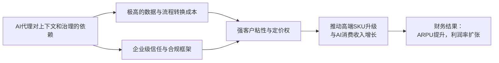

<!-- 匹配到的证券/行业：赛富时(CRM.N) -->
操作成功

### 一页通 （赛富时 (CRM.N)）
日期：2026-08-06
内容："""
## 公司概况

赛富时是全球客户关系管理（CRM）技术领域的领导者，帮助企业构建“代理型企业”。公司通过其AI驱动的Agentforce 360平台，将销售、服务、营销、商务、数据分析及IT等应用统一整合，并提供Agentforce自主AI代理层，使企业能够部署可推理、决策并执行任务的数字劳动力。公司服务全球各规模企业，以订阅制为主要收费模式，在CRM市场中占据约<strong>20%</strong> 的份额，是该领域最大的供应商。 

## 公司近况跟踪

- <strong>FY27 Q1业绩呈现“两张皮”</strong>：公司于2026年5月27日发布FY27 Q1财报，总营收<strong>111.33亿美元</strong>，同比增长<strong>13.27%</strong>，Non-GAAP EPS为<strong>3.88美元</strong>，均超市场预期。然而，剔除收购Informatica贡献的<strong>4.44亿美元</strong>后，有机收入增速仅为<strong>8.7%</strong>，且当期剩余履约义务（cRPO）增速为<strong>14%</strong>，连续两个季度未出现显著超预期，未能打消市场对核心业务放缓的担忧。 
- <strong>Agentforce与Data Cloud指标强劲，但绝对体量尚小</strong>：Agentforce ARR突破<strong>10亿美元</strong>，同比增长超<strong>200%</strong>；Agentforce与Data 360合计ARR达<strong>34亿美元</strong>。Agentic Work Units（AWU）环比增长<strong>111%</strong>，Slack中的AWU环比增长<strong>350%</strong>，显示AI应用正在加速渗透，但尚未对整体营收增速产生显著拉动。  
- <strong>宣布收购Fin，补强服务代理能力</strong>：公司于2026年6月15日宣布以<strong>36亿美元</strong>现金收购AI客服平台Fin（原Intercom）。Fin拥有超过3万家企业客户，其自研Apex模型在客服场景的准确率和成本控制上具备优势，有望补强Agentforce在中低端市场和客服场景的产品力。 
- <strong>管理层重申下半年有机收入加速</strong>：在2026年6月至7月的多场投资者会议中，管理层持续表达对FY27下半年有机收入再加速的信心，依据是净新增年化订单价值（NNAOV）的强劲增长、销售人效提升以及Agentforce带来的高端SKU升级和消费收入。  
- <strong>股价持续承压，估值处于历史低位</strong>：受“SaaS-pocalypse”叙事影响，公司股价自2024年12月高点已下跌超过<strong>50%</strong>。作为回应，公司于2026年3月通过发行<strong>250亿美元</strong>债券，执行了<strong>250亿美元</strong>的加速股票回购（ASR），占已发行股份约<strong>10%</strong>。  

## 短期逻辑

1. <strong>F2Q27业绩能否验证“下半年加速”叙事</strong>：公司已明确指引FY27下半年有机收入将加速，并将此归因于NNAOV增长和Agentforce的贡献。F2Q27（截至2026年7月31日）的业绩将是验证这一叙事的关键节点。若cRPO增速和有机收入增速出现实质性反弹，将极大缓解市场对核心业务持续减速的担忧。反之，若增速继续持平或下滑，市场信心可能进一步崩溃。当前市场对F2Q27的预期已极为保守，任何边际改善都可能触发股价的剧烈正向反应。  

2. <strong>Agentforce与Data Cloud的ARR增长轨迹</strong>：Agentforce ARR在FY27 Q1突破<strong>10亿美元</strong>，同比增长超<strong>200%</strong>。市场将高度关注这一高增长能否持续。若其ARR能在FY27年底达到<strong>20-25亿美元</strong>级别，将开始对整体营收产生可见贡献，并有力反驳“AI无法变现”的看空逻辑。F2Q27财报中披露的Agentforce/Data Cloud ARR、AWU消耗量以及百万美元级以上大单数量，将是直接观察指标。  

3. <strong>Fin收购的整合进展与市场反馈</strong>：对Fin的收购预计在FY27 Q4完成。尽管对短期财务影响有限，但市场将密切关注整合计划及早期客户反馈。若Fin能顺利融入Agentforce产品线，并利用赛富时的企业级分销渠道快速上量，将显著增强公司在AI客服领域的竞争力，并可能成为FY28营收加速的重要驱动力。任何关于整合不顺或人才流失的消息都可能构成负面催化。  

4. <strong>Headless 360的定价与变现模式明朗化</strong>：公司于2026年3月推出Headless 360架构，允许客户通过API在第三方应用中调用赛富时的数据、工作流和AI代理。管理层表示将在2026年9月的Dreamforce大会上公布更具体的定价模式。若公司能提出清晰、可预测且能捕捉价值的定价方案（如“代理用户许可证”或基于使用量的模式），将打开全新的TAM，并证明公司有能力在“无头”的AI时代持续变现，这是扭转估值逻辑的关键一步。  

## 长期逻辑

1. <strong>从“记录系统”到“行动系统”的平台化延伸</strong>：赛富时的长期机遇在于，其不仅是存储客户数据的“记录系统”，更正在成为企业AI代理执行任务的“行动系统”。Agentforce深度集成于CRM工作流中，能够利用企业已有的数据、业务逻辑和权限设置，自主完成服务、销售、营销等任务。这种“上下文即护城河”的模式，使得AI代理的部署高度依赖赛富时平台，从而推动客户从传统的按席位订阅，升级到包含AI功能的高端SKU，并购买Flex Credits用于代理的消费，实现单客户价值的数倍增长。  

2. <strong>Headless架构打开数字劳动力TAM</strong>：Headless 360战略通过解耦应用层与体验层，使赛富时的核心能力（数据、工作流、AI代理）可以被任何前端应用调用。这使其TAM从传统的CRM应用市场，扩展到更为广阔的“数字劳动力”市场。企业可以将赛富时的AI代理嵌入到Slack、自研应用甚至竞争对手的界面中，赛富时则作为背后的“信任层”和“编排层”提供价值并获取收入。这一战略若成功，将从根本上改变公司的增长天花板。  

3. <strong>数据资产与生态锁定效应的持续强化</strong>：赛富时通过多年的内生发展和收购（如MuleSoft, Tableau, Slack, Informatica），构建了从数据整合、治理、分析到协作的完整产品矩阵。尤其是Data Cloud和Informatica的组合，旨在帮助企业统一和清洗分散在各处的数据，为AI应用提供高质量燃料。随着企业将更多数据和业务流程迁移至赛富时平台，并依赖其训练和运行AI代理，其转换成本将指数级上升，形成强大的生态锁定效应，确保长期客户价值和低流失率。  

4. <strong>盈利能力与股东回报的长期优化</strong>：公司已设定FY30实现“Rule of 50”（收入增速+非GAAP营业利润率≥50%）的目标，这意味着在维持约<strong>10%</strong> 收入增长的同时，非GAAP营业利润率需提升至<strong>40%</strong> 左右。FY27 Q1的GAAP营业利润率已达<strong>21.7%</strong>，同比提升。同时，公司通过大规模回购和派息积极回报股东，FY27 Q1通过债务融资执行了<strong>250亿美元</strong>的ASR，显示了管理层对长期价值的信心和优化资本结构的意愿。  

## 风险提示

- <strong>AI转型的执行与变现风险</strong>：公司正处于从传统SaaS向AI平台转型的关键期，但Agentforce等新产品的变现模式仍在探索中，定价策略经历了从按对话次数到订阅制再到混合模式的多次调整，尚未稳定。若最终无法找到既能驱动客户采用又能实现盈利的定价模型，或AI代理的消费增长无法弥补传统席位收入的潜在放缓，公司的增长和利润率将面临长期压力。  
- <strong>竞争加剧与人才流失风险</strong>：公司在AI领域面临来自微软、谷歌等云巨头，以及OpenAI、Anthropic等前沿AI实验室的双重竞争。这些竞争对手不仅在产品层面构成威胁，更在积极挖角赛富时的核心销售和产品人才。据报道，2026年已有约<strong>85名</strong>员工被OpenAI和Anthropic挖走，包括Slack和Tableau的前CEO。关键人才的持续流失可能削弱公司的销售执行力和产品创新能力。 
- <strong>财务杠杆上升与并购整合风险</strong>：为执行<strong>250亿美元</strong>的ASR，公司大量举债，总债务从FY26末的<strong>144.39亿美元</strong>飙升至FY27 Q1末的<strong>392.80亿美元</strong>，净债务/EBITDA杠杆率显著上升。尽管公司仍维持投资级评级，但财务灵活性有所下降。同时，公司近期连续收购Informatica、Qualified、Fin等，整合压力巨大，存在整合不顺、文化冲突或商誉减值的风险。  

## 近期要闻

- <strong>2026年5月27日</strong>：公司发布FY27 Q1财报，营收超预期，但有机增长和cRPO数据未能提振市场信心。同时宣布了<strong>250亿美元</strong>的ASR计划。 
- <strong>2026年6月1日</strong>：公司宣布以<strong>36亿美元</strong>现金收购AI客服平台Fin，以增强Agentforce在客服领域的产品力，尤其是在中低端市场。 
- <strong>2026年6月10日</strong>：在Mizuho技术大会上，管理层强调Agentforce ARR已达<strong>12亿美元</strong>，并详细介绍了Headless 360战略和Slack作为“多玩家”AI协作平台的核心定位。 
- <strong>2026年7月</strong>：多家华尔街投行（摩根士丹利、高盛、Evercore ISI等）在7月发布报告，围绕AI对赛富时的影响展开激烈辩论，评级和目标价出现分化，反映了市场对公司的巨大分歧。    

## 未来催化

- <strong>2026年8月底（预计）</strong>：公司发布FY27 Q2财报。管理层此前指引的下半年有机收入加速将在该季度开始显现，业绩数据将是验证或证伪该叙事的最直接催化剂。  
- <strong>2026年9月（预计）</strong>：公司举办年度Dreamforce大会。管理层已预告将在会上公布Headless 360更具体的定价和变现策略。若方案清晰且得到客户认可，将可能成为扭转市场长期逻辑的关键事件。  
- <strong>2026年10月（预计）</strong>：Fin收购交易预计在FY27 Q4完成。交易完成前后，公司可能提供更多关于Fin的整合计划、财务影响及协同效应的细节，为市场提供评估该收购价值的依据。 

## 公司业务模式及拆分

<strong>业务边际变化</strong>：公司正从传统的CRM应用软件商，向以AI代理为核心的“代理型企业”平台转型。核心变化在于：1）推出并快速迭代Agentforce，将其嵌入所有应用云中，推动客户从购买“席位”向购买“数字劳动力”转变；2）推出Headless 360架构，将平台能力API化，以适应AI时代多界面、多代理的工作流；3）通过收购Informatica、Qualified、Fin等，持续补强数据基础和AI能力。  

<strong>盈利模式</strong>：公司主要依靠<strong>订阅与支持收入</strong>盈利，该部分占FY27 Q1总营收的<strong>95%</strong>。盈利模式正从单一的按用户席位收取订阅费，向“<strong>席位费 + AI功能升级费 + AI代理消费（Flex Credits）</strong>”的混合模式演进。其盈利基础在于：通过高转换成本的平台锁定客户，再通过不断叠加高价值功能模块（如AI）来提升单客户价值（ARPU）。  

<strong>业务拆分</strong>：
公司自FY27 Q1起采用了新的收入披露口径，将订阅与支持收入分为两大类别。由于未对历史财年数据进行重述，下表仅展示新口径下的最新报告期数据。 

<strong>新口径细分业务拆分（FY27 Q1）</strong>

| 业务板块 | FY27 Q1收入(亿美元) | 同比 | 占订阅收入比 | 业务描述 |
| :--- | :--- | :--- | :--- | :--- |
| <strong>Agentforce Apps</strong> | <strong>69.10</strong> | <strong>9%</strong> | <strong>65%</strong> | 包含Agentforce Sales, Service, Marketing, Commerce及Slack等嵌入式AI代理的应用层。 |
| <strong>Data 360, Headless Platform, and Other</strong> | <strong>36.83</strong> | <strong>25%</strong> | <strong>35%</strong> | 包含Data 360、Headless平台、Informatica、MuleSoft、Tableau等数据基础与平台层。 |
| <strong>订阅与支持收入合计</strong> | <strong>105.93</strong> | <strong>14%</strong> | <strong>100%</strong> | |
| <strong>专业服务及其他收入</strong> | <strong>5.40</strong> | <strong>2%</strong> | - | 流程咨询、项目实施及培训服务。 |
| <strong>总收入</strong> | <strong>111.33</strong> | <strong>13%</strong> | - | |

*注：Agentforce Apps同比增速为<strong>9%</strong>，反映核心应用层的平稳增长；Data 360, Headless Platform, and Other同比增速为<strong>25%</strong>，主要由Informatica并表贡献，剔除该影响后有机增速约为<strong>9.7%</strong>。*

<strong>旧口径FY26财年细分业务拆分（FY26）</strong>

| 业务板块 | FY26收入(亿美元) | 同比 | 占订阅收入比 |
| :--- | :--- | :--- | :--- |
| Agentforce Sales | 90.28 | 8% | 23% |
| Agentforce Service | 98.18 | 8% | 25% |
| Agentforce 360 Platform, Slack and Other | 88.82 | 23% | 22% |
| Agentforce Marketing and Commerce | 54.28 | 3% | 14% |
| Agentforce Integration and Analytics | 62.32 | 8% | 16% |
| <strong>订阅与支持收入合计</strong> | <strong>393.88</strong> | <strong>10%</strong> | <strong>100%</strong> |

*注：旧口径下，增长最快的板块为“Agentforce 360 Platform, Slack and Other”，主要由Slack和Data Cloud驱动；“Marketing and Commerce”增速最慢，仅<strong>3%</strong>，是主要的业务拖累项。*

<strong>各细分业务最新情况（FY27 Q1）</strong>：
- <strong>Agentforce Apps</strong>：该板块是公司的核心应用层，收入占比<strong>65%</strong>，同比增长<strong>9%</strong>。增长主要由Sales和Service云的稳健表现，以及Slack的强劲势头驱动。Agentforce正被嵌入到这些应用中，推动客户升级到更高阶的SKU（如Agentforce 1 Edition），实现<strong>60%-80%</strong> 的单用户价格提升。Slack作为“代理型企业”的交互界面，其战略地位日益重要，AWU消耗量环比增长<strong>350%</strong>。  
- <strong>Data 360, Headless Platform, and Other</strong>：该板块是公司的数据基础和平台层，收入占比<strong>35%</strong>，同比增长<strong>25%</strong>。高增长主要由FY26 Q4并表的Informatica贡献。Data 360作为AI代理的数据上下文引擎，其数据摄入量同比增长<strong>114%</strong>。然而，该板块中的Tableau和Commerce业务正面临结构性逆风，增长乏力，拖累了板块的整体有机增速。  

## 核心竞争力

<strong>竞争要素 1：依托极高转换成本与数据生态构筑的系统性锁定</strong>
- <strong>护城河定性</strong>：<strong>结构性护城河</strong>。赛富时经过二十余年发展，已成为众多大型企业的核心CRM平台，深度集成了销售、服务、营销等关键业务流程。企业的客户数据、业务逻辑、审批流和报表体系都构建于其上，替换成本极高。ETR Observatory 2026年5月的报告显示，赛富时在“难以替换”这一指标上得分<strong>68%</strong>，为所有厂商中最高。 
- <strong>数据验证</strong>：公司客户流失率长期稳定在<strong>8%</strong>左右（剔除Slack自助服务和近期收购），证明了其强大的客户粘性。FY27 Q1，前十大交易中有<strong>7笔</strong>来自现有客户增购新席位，而非AI导致的席位削减，进一步验证了平台的扩张性而非收缩性。  
- <strong>动态演变</strong>：<strong>护城河变宽</strong>。随着Agentforce和Data Cloud的采用，企业不仅将数据存储在赛富时，更开始依赖其平台来训练和运行AI代理。AI代理的执行深度依赖于赛富时平台上的上下文数据和工作流逻辑，这使得平台从“记录系统”升级为“行动系统”，客户粘性和转换成本将进一步指数级提升。  

<strong>竞争要素 2：AI时代“信任层”与“编排层”的卡位优势</strong>
- <strong>护城河定性</strong>：<strong>结构性护城河</strong>。在AI代理泛滥的时代，企业级客户对数据安全、权限治理、合规性和结果可审计性的要求极高。赛富时凭借其多年服务大企业积累的信任关系和完善的安全、合规、权限管理框架，正将自己定位为企业AI代理的“信任层”和“编排层”。其Headless 360战略的本质，就是让任何AI代理都能在赛富时的治理框架下安全地访问数据和执行操作。  
- <strong>数据验证</strong>：公司近期赢得了<strong>7200万美元</strong>的美国空军合同，Agentforce已获得FedRAMP高级别授权，证明了其在最严苛的合规环境下的能力。同时，公司计划在2026年向Anthropic支付<strong>3亿美元</strong>用于token采购，用于内部开发和知识工作场景，显示了其在模型层之上的编排和治理价值。  
- <strong>动态演变</strong>：<strong>护城河变宽</strong>。随着AI代理数量的爆炸式增长，对集中化的治理、编排和监控的需求将急剧上升。赛富时通过Agentforce和Headless 360提供的统一代理管理、测试、监控和审计能力，正在成为一个新的、关键的护城河，其价值将随着AI应用的深入而日益凸显。  

<strong>现阶段核心驱动力总结</strong>：赛富时的Alpha在于其强大的平台锁定效应和向AI平台成功转型的执行力，这有望带来ARPU的显著提升和TAM的扩张。其Beta则在于企业IT支出环境，尤其是AI相关预算的增长。当前，市场过度聚焦于AI带来的潜在颠覆风险（Beta），而低估了其平台护城河在AI时代的强化作用及变现潜力（Alpha）。 

<strong>竞争格局传导逻辑图</strong>：

## 产销链

- <strong>客户情况</strong>：公司服务于全球各规模、各行业的企业，客户基础高度分散。<strong>没有单一客户贡献超过10%的营收或应收账款</strong>，集中度风险极低。近年来，公司战略重心向大型企业客户倾斜，这类客户通常有更高的客单价和更低的流失率。新客户拓展方面，Agentforce正成为吸引新客户和重新激活老客户的有力工具，例如通过AI销售代理自动挖掘和转化线索。  
- <strong>供应商情况</strong>：公司主要依赖第三方云基础设施提供商（如AWS）和数据中心来交付服务，同时大量采购第三方AI模型（如Anthropic的Claude）的token。公司计划在FY27向Anthropic支付<strong>3亿美元</strong>用于token采购，这使其对前沿AI模型供应商存在一定依赖。不过，公司采用多模型策略，同时使用Anthropic、OpenAI、Mistral等多家模型，以分散风险并优化成本和性能。 
- <strong>经销商情况</strong>：公司采用直销与伙伴渠道相结合的销售模式。FY27 Q1的伙伴调查显示，渠道表现相对稳定，但净得分有所下滑。伙伴对Agentforce持乐观态度，但承认从概念验证（POC）到规模化生产的转化仍需时间，预计Agentforce成为其重要业务构成还需约<strong>11个月</strong>。公司正通过“Forward-Deployed Engineers”模式，与伙伴和客户共同开发，以加速AI应用的落地。 
- <strong>成本传导能力</strong>：当上游AI模型token成本上升时，公司可通过Flex Credits的消费定价模式将部分成本传导给客户。但更核心的逻辑在于，公司通过提供高价值的AI应用（如Agentforce），推动客户升级到更高价位的SKU，从而在整体上维持甚至提升利润率，而非单纯赚取“token差价”。公司赚取的是“<strong>平台与解决方案溢价</strong>”。  

## 财务数据

<strong>关键财务数据</strong>

| 报告期 | FY2024 | FY2025 | FY2026 | FY27 Q1 |
| :--- | :--- | :--- | :--- | :--- |
| <strong>截止日期</strong> | 2024-01-31 | 2025-01-31 | 2026-01-31 | 2026-04-30 |
| <strong>营业总收入(亿美元)</strong> | 348.57 | 378.95 | 415.25 | 111.33 |
| 同比 | 11.18% | 8.72% | 9.58% | 13.27% |
| <strong>营业成本(亿美元)</strong> | 85.41 | 86.43 | 92.70 | 25.70 |
| <strong>毛利润(亿美元)</strong> | 263.16 | 292.52 | 322.55 | 85.63 |
| 毛利率 | 75.50% | 77.19% | 77.68% | 76.91% |
| <strong>营业利润(亿美元)</strong> | 59.99 | 76.66 | 89.17 | 24.27 |
| 营业利润率 | 17.21% | 20.23% | 21.47% | 21.80% |
| <strong>归母净利润(亿美元)</strong> | 41.36 | 61.97 | 74.57 | 21.07 |
| 归母净利率 | 11.87% | 16.35% | 17.96% | 18.93% |
| <strong>稀释EPS(美元)</strong> | 4.20 | 6.36 | 7.80 | 2.42 |
| <strong>自由现金流(亿美元)</strong> | 95.07 | 124.34 | 144.02 | 65.56 |

*注：自由现金流 = 经营活动产生的现金流量净额 - 资本性支出。FY27 Q1数据为单季数据，非年化。*

<strong>财务分析</strong>：
- <strong>成长能力</strong>：公司营收增速从FY24的<strong>11.18%</strong> 放缓至FY26的<strong>9.58%</strong>，进入平稳增长期。FY27 Q1在Informatica并表助力下增速回升至<strong>13.27%</strong>，但有机增速仅为<strong>8.7%</strong>。管理层指引FY27全年收入<strong>460.5亿美元</strong>（中值），同比增长约<strong>11%</strong>，并预期下半年有机增速将反弹。  
- <strong>盈利能力</strong>：公司的GAAP毛利率稳定在<strong>75%-78%</strong> 区间，FY27 Q1为<strong>76.91%</strong>。营业利润率持续改善，从FY24的<strong>17.21%</strong> 提升至FY27 Q1的<strong>21.80%</strong>，主要得益于销售及管理费用率的下降。归母净利率也从<strong>11.87%</strong> 提升至<strong>18.93%</strong>，显示出显著的经营杠杆效应。  
- <strong>运营能力</strong>：FY26应收账款周转天数为<strong>115.5天</strong>，较FY25的<strong>120.8天</strong>有所改善，但FY27 Q1应收账款大幅下降至<strong>50.80亿美元</strong>，主要受季节性因素和ASR相关现金流出影响，需持续观察。  
- <strong>偿债能力</strong>：为执行<strong>250亿美元</strong>的ASR，公司大幅增加债务，总债务从FY26末的<strong>144.39亿美元</strong>飙升至FY27 Q1末的<strong>392.80亿美元</strong>。净债务/EBITDA杠杆率从FY26的<strong>0.4倍</strong>上升至约<strong>2.1倍</strong>（含SBC）。尽管杠杆率显著上升，但公司现金流充沛，FY27 Q1单季经营现金流达<strong>67.01亿美元</strong>，且债务期限结构分散，短期偿债风险可控。  

## 行业及竞争分析

- <strong>行业分析</strong>：公司处于<strong>全球CRM软件市场</strong>，该市场庞大但增速已放缓至个位数。赛富时以约<strong>20%</strong> 的市占率稳居第一。然而，公司当前的增长叙事已超越传统CRM，延伸至<strong>AI代理与数字劳动力市场</strong>。这是一个全新的、高速增长的蓝海市场。高盛测算，到2030年，仅客户服务领域的AI代理TAM就可能达到<strong>330亿至440亿美元</strong>，使整个客服软件TAM扩张<strong>20%-45%</strong>。赛富时凭借其庞大的客户基础和数据积累，在这一新兴市场中占据有利的起跑位置。 

- <strong>竞争格局</strong>：赛富时在传统CRM领域的主要竞争对手包括<strong>微软（Dynamics 365）</strong>、<strong>甲骨文</strong>、<strong>SAP</strong>等。在AI代理领域，竞争更为复杂，既包括微软、谷歌等云平台巨头，也包括<strong>ServiceNow</strong>等IT工作流平台，以及<strong>OpenAI</strong>、<strong>Anthropic</strong>等直接提供AI模型和基础代理工具的前沿实验室。与这些竞争对手相比，赛富时的核心差异在于其<strong>深度垂直的CRM工作流集成、海量的客户交互数据以及企业级信任与合规框架</strong>。 

<strong>可比公司</strong>

| 公司名称 | 股票代码 | 业务相似度 | 竞争维度 |
| :--- | :--- | :--- | :--- |
| 微软 | MSFT | 高 | 通过Dynamics 365和Azure AI在CRM和AI平台层构成直接竞争，且拥有Office和Teams的生态协同优势。 |
| 甲骨文 | ORCL | 高 | 传统数据库和CRM竞争对手，正通过OCI云基础设施和AI能力进行反击。 |
| ServiceNow | NOW | 中 | 在IT服务管理和工作流自动化领域是直接竞品，AI代理战略与赛富时高度相似，但侧重点不同。 |
| SAP | SAP | 中 | 在企业资源管理（ERP）领域是巨头，其CRM产品与赛富时在企业级市场竞争。 |
| HubSpot | HUBS | 中 | 在中小型企业CRM市场是赛富时的直接竞争对手，产品更轻量、易用。 |

<strong>总结分析</strong>：赛富时在传统CRM市场的领导地位稳固，但其未来估值的关键在于AI代理领域的竞争。与微软、ServiceNow等老牌对手相比，赛富时的优势在于CRM场景的专注和深度。与OpenAI等新贵相比，其优势在于企业级客户关系、数据积累和合规能力。当前市场对其竞争地位的担忧，主要源于AI降低了构建简单CRM应用的门槛，但忽略了企业级应用对数据安全、流程集成和长期稳定性的高要求。 

## 市场焦点议题

<strong>议题一：有机增长放缓与下半年加速的可实现性</strong>
- <strong>背景</strong>：公司有机收入增速已从FY24的<strong>11%</strong> 左右下滑至FY27 Q1的<strong>8.7%</strong>。管理层将此归因于Tableau、Commerce等遗留业务的拖累，并指引下半年将实现有机加速，驱动力来自Agentforce、Data Cloud和Slack。  
- <strong>问题列表</strong>：
  - 在Tableau和Commerce等业务面临结构性逆风的情况下，Agentforce等新业务需要达到多高的增速才能拉动整体营收加速？
  - 净新增年化订单价值（NNAOV）的增长能否在F2Q27有效转化为cRPO和收入的增长？
  - 公司指引的“下半年加速”是一次性的（受Informatica基数效应影响），还是可持续的增长趋势？

<strong>议题二：AI变现路径的不确定性与定价策略</strong>
- <strong>背景</strong>：尽管Agentforce ARR增长迅猛，但绝对体量尚小，且其定价模式经历了多次调整，从按对话次数到订阅制，再到Flex Credits消费制，目前仍在探索Headless 360的定价。  
- <strong>问题列表</strong>：
  - Agentforce的Flex Credits消费模式能否被大规模客户接受？其毛利率水平如何，是否会拖累公司整体盈利能力？
  - Headless 360的定价策略何时能清晰？公司如何避免“按席位定价”的路径依赖，并捕捉“代理用户”带来的价值？
  - 市场何时能看到AI业务对整体营收产生<strong>5%</strong> 以上的实质性贡献？

<strong>议题三：AI是颠覆者还是赋能者？——平台护城河的再评估</strong>
- <strong>背景</strong>：市场核心分歧在于，AI“氛围编程”工具是否会降低企业自建CRM的门槛，从而瓦解赛富时的护城河。近期有报道称部分企业开始用AI工具替代传统SaaS。  
- <strong>问题列表</strong>：
  - 企业用AI工具自建CRM的TCO（总拥有成本）与使用赛富时相比，长期来看是否真的具备优势？安全、合规、维护成本如何计算？
  - 赛富时“难以替换”的客户粘性，是源于技术锁定，还是源于对其数据和流程的深度依赖？AI能否解耦这种依赖？
  - 公司关键销售和产品人才流向OpenAI、Anthropic等公司，对其长期竞争力有何实质性影响？

## 市场分歧探讨

市场对赛富时的核心分歧在于：<strong>AI究竟是颠覆其传统SaaS模式的“掘墓人”，还是开启新一轮增长的“钥匙”？</strong>

- <strong>看空方（AI颠覆论）逻辑</strong>：
  1.  <strong>门槛降低</strong>：AI编程工具使企业能够以更低成本和更快速度自建内部工具，包括轻量级CRM系统，从而减少对标准化SaaS产品的依赖。 
  2.  <strong>交互方式变革</strong>：AI代理的兴起可能导致用户与软件的交互从图形界面（GUI）转向对话式界面，这使得传统应用层的价值被削弱，价值可能向底层模型或上层的代理编排层转移。 
  3.  <strong>定价模式冲击</strong>：按席位收费的传统SaaS模式，在AI代理可以替代部分人力的情况下，面临“席位缩减”的压力。新的消费定价模式能否弥补席位收入的损失，存在不确定性。  
  4.  <strong>人才流失信号</strong>：核心高管和销售人才流向AI初创公司，被视为公司内部对AI转型前景信心不足的信号。 

- <strong>看多方（AI赋能论）逻辑</strong>：
  1.  <strong>数据与流程护城河</strong>：企业级CRM的价值不仅在于软件功能，更在于其上承载的海量客户数据、复杂的业务流程和权限体系。这些“上下文”是AI代理有效运行的基础，极难被简单复制或迁移。  
  2.  <strong>“记录系统”到“行动系统”的升级</strong>：赛富时不仅是数据存储库，更是AI代理执行任务的平台。Agentforce深度集成于工作流中，使AI代理能直接调用数据并执行操作，这创造了比单纯记录更高的价值。  
  3.  <strong>ARPU提升而非缩减</strong>：AI并非简单地替代人类席位，而是作为“数字劳动力”被购买。企业需要为AI代理的“席位”或“工作量”付费，这实际上是在传统SaaS之上叠加了新的AI消费收入，从而提升单客户价值。 
  4.  <strong>信任与治理的稀缺性</strong>：在企业级AI应用中，安全、合规、权限管理和可审计性至关重要。赛富时多年积累的信任和治理框架，是其作为AI“编排层”和“信任层”的核心优势，这是AI模型公司所不具备的。 

<strong>总结分析</strong>：当前股价的暴跌，已充分反映了看空方的悲观预期。然而，从FY27 Q1的业绩来看，Agentforce和Data Cloud的增长数据、客户增购席位的趋势，以及公司“难以替换”的客户粘性指标，都为看多方的逻辑提供了初步的事实支撑。AI对软件行业的颠覆是真实的，但这一过程更可能是渐进的，且最终受益者大概率是那些拥有深厚客户关系、海量数据和强大平台能力的现有巨头。赛富时主动求变，通过Headless 360等战略积极拥抱AI时代的架构变革，其转型成功的概率，在当前极低的估值下，被市场显著低估。 

## 盈利预测与估值

<strong>券商盈利预测</strong>

| 机构 | 评级 | 目标价(美元) | 财务指标 | FY2026A | FY2027E | FY2028E | FY2029E |
| :--- | :--- | :--- | :--- | :--- | :--- | :--- | :--- |
| 高盛 (2026-07-14) | 买入 | 242 | 营收(百万美元) | 41,525 | 46,065 | 50,023 | 54,633 |
| | | | Non-GAAP EPS(美元) | 12.52 | 14.20 | 15.87 | 19.27 |
| 摩根士丹利 (2026-07-21) | 等权重 | 185 | 营收(百万美元) | 41,525 | 46,110 | 50,554 | 55,663 |
| | | | Non-GAAP EPS(美元) | 12.52 | 14.12 | 16.01 | 18.37 |
| Evercore ISI (2026-07-18) | 跑赢大盘 | 250 | 营收(百万美元) | 41,525 | 46,103 | 50,447 | - |
| | | | Non-GAAP EPS(美元) | 12.52 | 14.10 | 15.29 | - |
| 古根海姆 (2026-07-06) | 买入 | 228 | 营收(百万美元) | 41,525 | 46,808 | 50,084 | 52,839 |
| | | | Non-GAAP EPS(美元) | - | - | - | - |

*注：古根海姆采用DCF估值，未提供具体EPS预测。*

<strong>盈利预期与估值分析</strong>：
- <strong>机构观点趋同但存在分歧</strong>：主要券商对FY27和FY28的营收预测高度一致，均在<strong>460亿至505亿美元</strong>之间，显示市场对公司短期收入前景的判断较为统一。但在目标价上存在分歧，高盛和Evercore较为乐观，基于<strong>26倍</strong>和<strong>15倍</strong>的FCF倍数给出<strong>242美元</strong>和<strong>250美元</strong>的目标价；摩根士丹利则相对谨慎，给予<strong>10倍</strong>FCF倍数，目标价<strong>185美元</strong>，反映了对增长能见度的担忧。   
- <strong>估值方法多样化</strong>：由于公司利润率仍在扩张，且有大额非现金支出（如SBC和收购摊销），市场普遍采用<strong>企业价值/自由现金流（EV/FCF）</strong> 或<strong>市盈率（P/E）</strong> 进行估值。古根海姆则使用三阶段DCF模型，其<strong>228美元</strong>的目标价隐含了公司永续增长率为<strong>-1%</strong> 的悲观假设，认为当前股价已过度反映衰退预期。 
- <strong>管理层指引</strong>：公司FY27全年收入指引为<strong>459亿至462亿美元</strong>，同比增长<strong>10%-11%</strong>。Non-GAAP营业利润率指引为<strong>34.3%</strong>。长期目标为FY30收入超过<strong>630亿美元</strong>，并实现“Rule of 50”。当前股价对应FY27 Non-GAAP EPS的市盈率约为<strong>11-12倍</strong>，处于历史极低水平，显示市场对管理层实现长期目标的能力持高度怀疑态度。
"""
