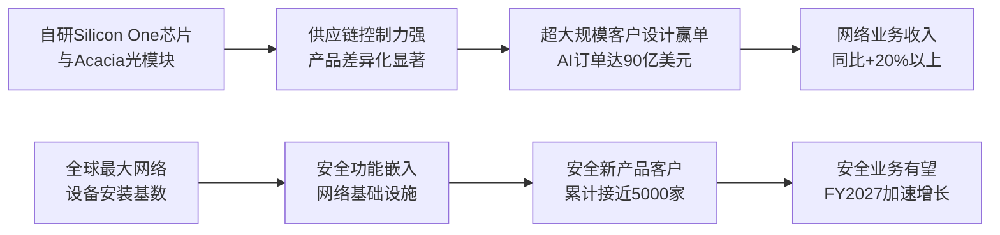

<!-- 匹配到的证券/行业：思科(CSCO.O) -->
操作成功

### 一页通 （思科 (CSCO.O)）
日期：2026-08-06
内容："""
## 公司概况

思科是全球最大的网络解决方案供应商，业务覆盖企业网络、数据中心交换、无线、安全、协作及可观测性等领域。公司正从传统硬件设备商向"网络+安全+AI基础设施"全栈平台转型，通过自研Silicon One芯片和Acacia光模块业务深度嵌入AI数据中心建设浪潮。其客户涵盖大型企业、公共部门、服务提供商及超大规模云厂商，在全球网络设备市场长期占据第一或第二的位置。 

## 公司近况跟踪

- <strong>AI订单指引大幅上修</strong>：FY2026超大规模客户AI订单预期从50亿美元上调至约90亿美元，为FY2025全年（20亿美元）的4.5倍。FY2026前三季度累计AI订单已达53亿美元，预计全年确认AI收入约40亿美元，FY2027至少60亿美元。  

- <strong>自研芯片设计赢单取得突破</strong>：FY2026Q3获得两个超大规模客户P200 scale-across设计赢单，Q4初再获第三个。Silicon One芯片使公司在供应链控制上具备差异化优势，已锁定2026自然年全年硅片供应。  

- <strong>Acacia光模块业务爆发</strong>：Q3订单首次超过10亿美元，预计FY2026全年同比增长超200%。公司已累计出货超75万件400G和超4万件800G相干可插拔光模块。  

- <strong>宣布重组计划</strong>：FY2026Q4宣布重组，将资源重新配置至硅、光学、安全和AI领域，预计产生最高10亿美元税前费用，其中4.5亿美元在Q4确认。  

- <strong>企业园区网络刷新加速</strong>：Q3园区网络订单创历史新高，同比增长超25%；企业数据中心交换机订单同比增长超40%；Wi-Fi 7订单实现强劲双位数环比增长，占无线产品组合一半。 

## 短期逻辑

<strong>1. FY2026Q4财报（8月12日）有望成为新一轮催化</strong>

Q3产品订单同比增长35%，其中超大规模客户订单同比增长三位数，非超大规模客户订单仍增长19%。Q4指引收入167-169亿美元，隐含约14.5%同比增长。市场关注的核心变量是：AI订单能否持续转化为收入、毛利率是否已在66%附近企稳、以及管理层对FY2027的初步展望。Q3已披露FY2027 AI基础设施收入至少60亿美元，若Q4进一步上调预期，将强化市场对公司AI业务持续高增长的信心。当前股价对应FY2026约28倍P/E，若业绩兑现且指引积极，估值仍有支撑。   

<strong>2. 企业网络升级周期进入加速阶段，构成AI之外的独立增长驱动</strong>

Q3非超大规模客户订单增长19%，其中约4-5个百分点来自价格上调，其余反映核心需求动能。企业数据中心交换订单同比增长超40%，园区网络订单创历史新高。管理层在5月J.P. Morgan TMC会议上表示，行业正处于"漏洞驱动型刷新"的第一局，潜在TAM达数百亿甚至低千亿美元级别。这一周期独立于AI基础设施投资，若持续兑现，将为公司提供超越AI波动的业绩稳定性。  

<strong>3. 供应链控制力成为差异化竞争壁垒</strong>

自研Silicon One使思科能够直接管理晶圆、基板、组装和测试等关键环节，供应链控制力强于依赖第三方芯片的竞争对手。Q3未出现供应商decommit情况，公司已锁定2026自然年内硅片供应。在内存方面，公司通过对南亚科进行战略投资、签署三年供应协议、推进DDR4向DDR5转换、增加战略库存和提前采购承诺等方式保障供应。这一优势在行业供应紧张背景下具有战略价值。  

## 长期逻辑

<strong>1. AI基础设施需求从训练向推理和Agentic AI扩展，网络需求呈结构性增长</strong>

管理层在2026年6月Cisco Live上指出，Agentic AI将驱动网络流量增长450%，AI相关网络流量预计未来三年增长3倍。每个Agentic动作都会产生路由、安全和遥测事件，对网络带宽、低延迟和安全提出更高要求。思科通过Silicon One芯片、Acacia光模块、Nexus交换机等产品组合，覆盖从芯片到系统的全栈能力，有望持续受益于AI推理和Agent应用的规模化部署。  

<strong>2. 安全业务与网络基础设施融合，构建差异化竞争壁垒</strong>

思科正将安全能力嵌入网络基础设施，推出Hypershield（分布式工作负载安全）、Live Protect（漏洞主动防护）、AI Defense等产品。管理层在6月美银会议上表示，Smart Switches（内置安全功能）目前仅占客户采购的约5%，渗透率提升空间巨大。公司拥有网络基础设施所有权，可在边缘进行流量感知和安全策略执行，这一"网络+安全"融合的架构优势是纯安全厂商难以复制的。  

<strong>3. 自研芯片构建长期护城河，提升盈利能力和供应链自主性</strong>

Silicon One是公司在超大规模客户中获得设计赢单的核心差异化能力。管理层明确表示，未来若缺乏自研芯片能力，将难以持续服务大型云客户需求。公司目标FY2029将所有高端系统全部采用Silicon One。自研芯片不仅提升产品性能和方案竞争力，也增强了公司对供应链的控制力和交付确定性，长期有望改善硬件业务毛利率。  

## 风险提示

- <strong>AI资本开支周期波动风险</strong>：公司AI业务高度依赖超大规模云厂商的资本开支节奏。Q3超大规模客户AI订单19亿美元，但订单具有非线性特征，集中于少数大型客户，季度间存在波动。若宏观经济下行或AI投资回报不及预期导致云厂商削减资本开支，公司AI相关收入和订单将受到直接冲击。当前市场对公司AI业务给予较高估值溢价，任何增速放缓信号都可能引发估值压缩。 

- <strong>毛利率持续承压风险</strong>：Q3非GAAP毛利率66%，同比下降260个基点，主要受产品结构变化（硬件收入增长显著快于软件）和内存成本上升影响。尽管公司通过提价、缩短报价保护周期、降低内存使用等措施对冲，但内存价格2026年已上涨超60%，且Q4内存成本压力预计更为严峻。若硬件收入占比持续提升而软件增长乏力，毛利率可能长期承压，拖累整体盈利能力。  

- <strong>竞争格局恶化风险</strong>：公司在数据中心交换领域面临Arista的持续份额侵蚀，在安全领域与Palo Alto Networks、Fortinet等竞争，在光模块领域面临Lumentum、Coherent等对手。Arista在AI网络市场增速更快，估值更高。若思科在AI网络市场的份额增长不及预期，或传统业务份额加速流失，将影响长期增长前景。 

## 近期要闻

- <strong>2026年5月13日</strong>：思科发布FY2026Q3财报，收入158亿美元（同比+12%），非GAAP EPS 1.06美元（同比+10%），均超指引上限。产品订单同比增长35%，超大规模客户AI订单19亿美元。公司上调FY2026 AI订单预期至约90亿美元，AI收入预期至约40亿美元。同时宣布重组计划，预计产生最高10亿美元税前费用。  

- <strong>2026年5月18日</strong>：CEO Chuck Robbins在J.P. Morgan TMC会议上强调，自研芯片和供应链控制力已成为核心差异化优势，Scale-across（跨域扩展）是超大规模客户市场份额的关键增长点。 

- <strong>2026年6月2-3日</strong>：Cisco Live 2026发布Cloud Control统一管理平台、Live Protect漏洞防护、Hybrid Mesh Firewall等新产品，并展示基于Silicon One的C9550核心交换机、8600系列路由器等新品。管理层强调Agentic AI将驱动网络流量增长450%。    

- <strong>2026年6月5日</strong>：美银全球技术会议上，管理层详细阐述安全业务转型路径，预计核心安全业务FY2026Q4持续改善，FY2027上半年进入加速增长期。 

## 未来催化

- <strong>2026年8月12日</strong>：FY2026Q4财报发布。市场关注AI订单转化收入进度、毛利率趋势、FY2027初步展望。若Q4 AI订单如管理层暗示般显著提升，且FY2027 AI收入指引超出60亿美元，有望成为股价催化剂。  

- <strong>2026年下半年</strong>：Silicon One G300芯片（约2倍于前代G200速度）预计Q4出货，支持下一代N9300和8100系列102.4T系统，有望带来新一轮超大规模客户订单。 

- <strong>2026年下半年至2027年</strong>：P200 scale-across设计赢单预计在FY2027开始放量贡献收入，打开跨数据中心互联的新市场空间。  

- <strong>2027财年</strong>：Splunk云订阅转型的同比基数压力预计在FY2027上半年逐步消退，安全业务收入增速有望回升。  

## 公司业务模式及拆分

<strong>业务边际变化</strong>：思科正经历从传统网络设备商向AI基础设施核心供应商的战略转型。FY2026 AI基础设施订单预期达90亿美元（FY2025为20亿美元），AI收入预期约40亿美元，已成为公司最重要的增长引擎。同时，企业园区网络升级周期启动，Wi-Fi 7和Smart Switches等新品渗透率快速提升。安全业务处于转型期，Splunk从本地许可向云订阅迁移短期拖累收入增速，但新产品组合（Secure Access、XDR、Hypershield、AI Defense）累计新增客户接近5000家。  

<strong>盈利模式</strong>：公司收入主要来自两部分：产品销售（网络、安全、协作、可观测性硬件及软件许可）和服务（技术支持、专业服务及软件订阅）。盈利模式正从一次性硬件销售向"硬件+软件订阅+服务"的混合模式转型，订阅收入占比已达约51%。在AI基础设施领域，公司通过自研芯片（Silicon One）和光模块（Acacia）构建差异化，赚取"技术溢价"；在企业市场，依托庞大的安装基数和渠道网络，通过产品升级周期和交叉销售实现持续收入。 

<strong>业务结构</strong>：FY2026前三季度，网络业务收入占比约54%，是最大收入来源且增速最快（同比+20%）；安全业务占比约13%，受Splunk转型影响同比下降2%；服务业务占比约24%，基本持平。公司当前处于AI驱动的硬件投资周期，网络业务增速显著高于软件和服务，导致产品结构向硬件倾斜，对毛利率形成一定压力。 

<strong>细分业务拆分</strong>

| 细分业务 | FY2024收入(亿美元) | FY2024同比 | FY2025收入(亿美元) | FY2025同比 | FY2026前三季度收入(亿美元) | FY2026前三季度同比 |
|---|---|---|---|---|---|---|
| <strong>截止日期</strong> | 2024-07-27 | | 2025-07-26 | | 2026-04-25 | |
| 网络 | 292.29 | -15.4% | 283.04 | -3.2% | 248.77 | +20.3% |
| 安全 | 50.74 | +31.5% | 80.94 | +59.5% | 60.06 | -2.2% |
| 协作 | 41.12 | +1.5% | 41.54 | +1.0% | 31.33 | +0.7% |
| 可观测性 | 8.37 | +26.6% | 10.55 | +26.0% | 8.20 | +3.0% |
| 产品收入合计 | 392.53 | -9.0% | 416.08 | +6.0% | 348.36 | +13.4% |
| 服务 | 145.50 | +5.0% | 150.46 | +3.4% | 112.37 | -0.2% |
| <strong>总收入</strong> | <strong>538.03</strong> | <strong>-5.6%</strong> | <strong>566.54</strong> | <strong>+5.3%</strong> | <strong>460.73</strong> | <strong>+9.8%</strong> |

*注：数据来源于公司财报。FY2026前三季度指截至2026年4月25日的9个月。*

<strong>网络业务</strong>（FY2026前三季度收入248.77亿美元，同比+20.3%）：涵盖交换机、路由器、无线和服务器等核心网络技术，包含AI基础设施（Silicon One系统、Nexus交换机、Acacia光模块）。Q3收入88.15亿美元，同比+25%，是增长核心驱动力。AI基础设施和园区网络刷新贡献显著，企业数据中心交换机订单同比+40%以上，园区网络订单创历史新高。Acacia光模块Q3订单超10亿美元，全年预计增长超200%。  

<strong>安全业务</strong>（FY2026前三季度收入60.06亿美元，同比-2.2%）：涵盖网络防火墙、零信任访问、SASE、威胁检测与响应（含Splunk）。收入持平主要受Splunk向云订阅转型和老产品下滑拖累，但核心安全新产品（Secure Access、XDR、Hypershield、AI Defense）实现双位数订单增长，Q3新增超1000家客户。防火墙业务Q3实现强劲双位数订单增长。  

<strong>协作业务</strong>（FY2026前三季度收入31.33亿美元，同比+0.7%）：包括Webex Suite、协作设备、联络中心和CPaaS。收入基本持平，设备业务实现双位数增长，Webex Suite有所下滑。 

<strong>可观测性业务</strong>（FY2026前三季度收入8.20亿美元，同比+3.0%）：包括ThousandEyes网络保障和Splunk可观测性套件。增速放缓主要受Splunk可观测性产品下滑影响，ThousandEyes保持增长。 

<strong>服务业务</strong>（FY2026前三季度收入112.37亿美元，同比-0.2%）：提供技术支持和专业服务，收入基本稳定，是公司经常性收入的重要来源。 

## 核心竞争力

<strong>竞争要素1：依托自研芯片和垂直整合构建的供应链控制力与产品差异化</strong>

- <strong>护城河定性</strong>：<strong>结构性护城河</strong>。思科通过自研Silicon One芯片和Acacia光模块，实现了从芯片到系统的垂直整合，在超大规模客户市场形成差异化竞争优势。管理层明确表示"若缺乏自研芯片能力，将难以持续服务大型云客户需求"。这一能力需要长期研发投入和芯片设计经验积累，竞争对手短期内难以复制。  

- <strong>数据验证</strong>：FY2026 AI订单预期达90亿美元（FY2025为20亿美元），Acacia光模块Q3订单超10亿美元（全年预计同比+200%）。Q3获得5个超大规模客户设计赢单（2个光器件、3个系统），包括2个P200 scale-across和1个G200 scale-out。公司已锁定2026自然年全年硅片供应，Q3未出现供应商decommit情况。   

- <strong>动态演变</strong>：护城河正在<strong>变宽</strong>。公司目标FY2029将所有高端系统全部采用Silicon One，芯片路线图持续迭代（G300约2倍于G200速度）。随着AI网络需求从训练向推理和Agentic AI扩展，垂直整合能力将更加重要。  

<strong>竞争要素2：网络基础设施所有权带来的"网络+安全"融合优势</strong>

- <strong>护城河定性</strong>：<strong>结构性护城河</strong>。思科拥有全球最大的网络设备安装基数，可在网络基础设施中嵌入安全功能（如Smart Switches内置防火墙、Hypershield分布式安全），实现"网络即安全执行点"的架构优势。管理层在6月美银会议上指出，Smart Switches目前仅占客户采购的约5%，渗透率提升空间巨大。这一融合能力是纯安全厂商或纯网络厂商难以复制的。  

- <strong>数据验证</strong>：安全新产品组合（Secure Access、XDR、Hypershield、AI Defense）自推出以来累计新增客户接近5000家。防火墙业务Q3实现强劲双位数订单增长。公司网络产品已连续七个季度实现双位数订单增长。  

- <strong>动态演变</strong>：护城河正在<strong>变宽</strong>。随着Agentic AI对低延迟安全的需求增加，安全需嵌入网络层而非独立设备，思科的融合架构优势将进一步凸显。 

<strong>现阶段核心驱动力总结</strong>：思科正处于AI基础设施投资周期和企业网络升级周期的双重顺风中。AI业务提供高增长弹性（FY2026 AI收入约40亿美元，FY2027至少60亿美元），企业网络升级提供稳定性（园区网络订单同比+25%以上）。自研芯片和"网络+安全"融合构成结构性护城河，使公司在AI时代的网络基础设施竞争中占据差异化地位。 

<strong>竞争格局传导逻辑图</strong>

## 产销链

<strong>客户情况</strong>：思科客户分为三大类——企业（大型企业及中小企业）、公共部门（政府及教育机构）和服务提供商及云（电信运营商及超大规模云厂商）。FY2026Q3，超大规模客户AI订单19亿美元，占AI订单的主要部分，但客户集中度较高（前五大超大规模客户贡献主要AI订单）。非超大规模客户订单增长19%，显示需求基础广泛。企业数据中心交换订单同比+40%以上，园区网络订单创历史新高，公共部门订单同比+27%，服务提供商订单同比+9%。公司通过渠道合作伙伴（系统集成商、服务提供商、分销商）销售大部分产品，Q3渠道合作伙伴融资量约77亿美元。  

<strong>供应商情况</strong>：思科采用轻资产模式，主要依赖合同制造商进行生产。自研Silicon One芯片使公司在芯片供应上具备独特控制力，已锁定2026自然年全年硅片供应。内存是主要外部依赖，公司通过对南亚科进行战略投资、签署三年供应协议、增加战略库存（Q3库存+采购承诺合计162.42亿美元，同比+108%）等方式保障供应。Q3采购承诺大幅增加至160.33亿美元（同比+153%），主要与Silicon One制造和内存组件相关。激光器是光模块业务的主要供应链瓶颈，公司正积极投资锁定供应。   

<strong>成本传导能力</strong>：当上游内存涨价时，公司通过提价（Q3非超大规模客户订单增速中约4-5个百分点来自价格上调）、缩短报价保护周期、降低产品内存使用量（部分无线产品Q4可实现约50%内存用量下降）等方式部分转嫁成本。Q3毛利率同比下降260个基点至66%，显示成本传导存在时滞和不完全性。公司赚取的是"技术溢价+规模效应"，而非单纯的周期资源钱。  

## 财务数据

| 财务指标 | FY2023 | FY2024 | FY2025 | FY2026前三季度 |
|---|---|---|---|---|
| <strong>截止日期</strong> | 2023-07-29 | 2024-07-27 | 2025-07-26 | 2026-04-25 |
| 营业总收入(亿美元) | 569.98 | 538.03 | 566.54 | 460.73 |
| 收入同比 | +10.55% | -5.61% | +5.30% | +9.75% |
| 营业成本(亿美元) | 212.45 | 189.75 | 198.64 | 162.76 |
| 毛利润(亿美元) | 357.53 | 348.28 | 367.90 | 297.97 |
| 毛利率 | 62.73% | 64.73% | 64.93% | 64.68% |
| 营业利润(亿美元) | 155.62 | 129.70 | 125.04 | 112.86 |
| 营业利润率 | 27.30% | 24.11% | 22.07% | 24.50% |
| 归母净利润(亿美元) | 126.13 | 103.20 | 101.80 | 94.08 |
| 归母净利润同比 | +6.78% | -18.18% | -1.36% | +23.30% |
| 稀释EPS(美元) | 3.07 | 2.54 | 2.55 | 2.36 |
| 经营现金流(亿美元) | 198.86 | 108.80 | 141.93 | 87.91 |
| 自由现金流(亿美元) | 190.37 | 102.10 | 132.88 | 77.71 |

*注：FY2023、FY2024、FY2025财年均为52/53周。FY2026前三季度为截至2026年4月25日的39周。自由现金流=经营现金流-资本支出。*

<strong>成长能力</strong>：FY2025收入恢复增长（+5.3%），FY2026前三季度加速至+9.75%，主要受AI基础设施和园区网络升级驱动。Q3单季收入同比+12%，创历史新高。归母净利润FY2026前三季度同比+23.3%，增速显著高于收入增速，体现经营杠杆效应。 

<strong>盈利能力</strong>：毛利率从FY2023的62.73%提升至FY2025的64.93%，但FY2026前三季度略降至64.68%，主要受产品结构向硬件倾斜和内存成本上升影响。Q3单季毛利率63.6%，同比下降2个百分点。营业利润率FY2026前三季度24.5%，较FY2025的22.07%有所改善，受益于费用管控（OPEX占收入比从41.1%降至38.7%）。 

<strong>运营能力</strong>：存货从FY2025末的31.64亿美元增至FY2026Q3末的47.08亿美元（+48.8%），采购承诺从75.99亿美元增至160.33亿美元（+111%），反映公司为满足AI需求而积极备货。应收账款从67.01亿美元降至64.80亿美元，周转效率改善。 

<strong>偿债能力</strong>：FY2026Q3末总债务313.03亿美元，现金及短期投资166.40亿美元，净债务约146.63亿美元。公司维持投资级信用评级，商业票据和循环信贷额度提供充足流动性。 

<strong>杜邦分析（FY2025）</strong>：ROE约21.7%（归母净利润101.80亿/平均股东权益约468.43亿），净利率17.97%，资产周转率0.46倍，权益乘数约2.61倍。ROE较FY2024的22.7%略有下降，主要受净利率下滑影响。 

## 行业及竞争分析

<strong>网络设备行业</strong>：思科核心业务所处的网络设备市场（交换机、路由器、无线）正经历AI驱动的需求扩张。超大规模云厂商AI基础设施投资是主要增量，企业园区网络升级（Wi-Fi 7、Smart Switches）提供周期性需求。管理层预计AI相关网络流量未来三年增长3倍，Agentic AI将驱动网络流量增长450%。行业竞争格局方面，思科在园区网络和企业路由市场保持领先地位，但在数据中心交换领域面临Arista的持续竞争，在AI网络市场与Arista、NVIDIA（Spectrum-X）及白盒厂商竞争。  

<strong>安全行业</strong>：思科安全业务涵盖防火墙、零信任、SASE、威胁检测与响应等细分市场。AI安全需求快速增长（Mythos漏洞管理、Agentic安全），CISO面临董事会和CEO对AI部署安全的严格要求。竞争格局方面，Palo Alto Networks、Fortinet在防火墙和SASE领域领先，CrowdStrike在终端安全领域领先。思科的差异化在于"网络+安全"融合架构。  

<strong>光模块行业</strong>：思科通过Acacia参与相干可插拔光模块市场，Q3订单超10亿美元。公司已出货超75万件400G和超4万件800G相干可插拔光模块，管理层认为在出货量上已超过或接近市场领导者。行业需求受AI数据中心互联驱动快速增长，但竞争激烈（Lumentum、Coherent、Ciena等），激光器供应是主要瓶颈。  

<strong>可比公司</strong>

| 公司名称 | 股票代码 | 对标维度 | 分析 |
|---|---|---|---|
| Arista Networks | ANET | 数据中心交换/AI网络 | 纯AI网络标的，增速更快（收入+20%以上），毛利率更高，估值溢价显著。思科在园区网络和企业市场更全面。 |
| Hewlett Packard Enterprise | HPE | 网络/服务器 | 通过收购Juniper进入AI网络市场，增速较快但利润率较低。思科在网络设备市场份额和盈利能力上领先。 |
| Palo Alto Networks | PANW | 网络安全 | 安全行业领先者，增速和估值均高于思科安全业务。思科差异化在于"网络+安全"融合。 |
| Broadcom | AVGO | 芯片/基础设施软件 | 定制AI芯片和基础设施软件领导者，AI收入规模和增速均高于思科。思科在网络设备和光模块领域与之竞争。 |

思科在AI网络市场的定位介于Arista（纯网络高增长）和Broadcom（芯片+软件平台）之间，凭借自研芯片、光模块和"网络+安全"融合构建差异化。在企业网络市场，思科仍是市场份额领导者，园区网络升级周期提供稳定增长基础。 

## 市场焦点议题

<strong>议题一：AI订单能否持续转化为收入，FY2027增长可见性如何？</strong>

<strong>背景</strong>：FY2026 AI订单预期从50亿美元大幅上调至90亿美元，但订单具有非线性特征，集中于少数大型客户。Q3 AI订单19亿美元，低于Q2的21亿美元，市场担忧订单增速是否已见顶。Q4预计AI订单将显著提升，但能否兑现存在不确定性。 

<strong>问题列表</strong>：1）Q4 AI订单能否如管理层暗示般显著提升？2）AI订单转化为收入的节奏如何？FY2027 AI收入至少60亿美元的指引是否保守？3）Scale-across（P200）设计赢单何时开始大规模贡献收入？

<strong>议题二：毛利率是否已触底？何时恢复增长？</strong>

<strong>背景</strong>：Q3非GAAP毛利率66%，同比下降260个基点，主要受产品结构变化（硬件增速远超软件）和内存成本上升影响。Q4指引毛利率中值约66%，显示已趋于稳定，但内存成本Q4预计更为严峻。  

<strong>问题列表</strong>：1）66%的毛利率水平能否持续？2）提价措施何时完全传导至毛利率？3）内存成本上升趋势何时缓解？4）软件收入增速何时回升以改善产品结构？

<strong>议题三：安全业务何时恢复增长？Splunk转型进展如何？</strong>

<strong>背景</strong>：安全业务FY2026前三季度收入同比-2.2%，受Splunk向云订阅转型和老产品下滑拖累。管理层预计核心安全业务FY2026Q4持续改善，FY2027上半年进入加速增长期。  

<strong>问题列表</strong>：1）Splunk云订阅转型的同比基数压力何时消退？2）安全新产品（Hypershield、AI Defense等）何时能抵消老产品下滑？3）安全业务FY2027能否恢复双位数增长？

<strong>议题四：竞争格局是否在恶化？Arista是否在AI网络市场持续抢份额？</strong>

<strong>背景</strong>：Arista在数据中心交换和AI网络市场增速更快，估值更高。思科在AI网络市场通过自研芯片和光模块构建差异化，但市场份额变化趋势尚不明确。 

<strong>问题列表</strong>：1）思科在AI网络市场的份额是否在增长？2）Silicon One和P200设计赢单能否帮助思科在超大规模客户市场追赶Arista？3）白盒厂商和NVIDIA Spectrum-X对思科数据中心交换业务的威胁有多大？

## 市场分歧探讨

<strong>核心分歧：思科当前估值是否已充分反映AI增长预期？</strong>

<strong>乐观方观点</strong>：思科AI业务正处于爆发式增长阶段，FY2026 AI订单90亿美元（FY2025为20亿美元），FY2027 AI收入至少60亿美元。自研芯片和光模块构建了可持续的竞争壁垒，企业网络升级周期提供额外增长动力。当前FY2026约28倍P/E，相比Arista（39倍）和Broadcom（36倍）仍有折价，若AI业务持续高增长，估值有进一步重估空间。摩根士丹利（目标价130美元）、花旗（目标价112美元）、高盛（目标价125美元）均给予积极评级。  

<strong>谨慎方观点</strong>：AI订单具有非线性特征，集中于少数大型客户，可持续性存疑。毛利率持续承压（Q3同比-260个基点），硬件占比提升拖累盈利能力。当前估值已处于历史高位（5年平均P/E约16倍），若AI资本开支周期放缓或竞争加剧，估值可能大幅压缩。部分独立观点认为，当前估值已"定价完美"，风险收益比不再具有吸引力。  

<strong>综合分析</strong>：思科AI业务的增长确定性和竞争壁垒在FY2026已得到初步验证，自研芯片和光模块的差异化优势是真实存在的。但估值已从FY2025中的约18倍P/E扩张至当前约28倍，大部分"价值重估"已经完成。未来股价表现将更多取决于业绩兑现能力——AI订单能否持续转化为收入、毛利率能否企稳回升、安全业务能否恢复增长。在AI资本开支周期持续上行的基准假设下，当前估值仍有支撑，但安全边际已显著收窄。 

## 盈利预测与估值

| 机构 | 评级 | 目标价(美元) | 财务指标 | FY2025A | FY2026E | FY2027E | FY2028E |
|---|---|---|---|---|---|---|---|
| 摩根士丹利(2026-07-17) | Overweight | 130 | 收入(百万美元) | 56,654 | 62,880 | 68,220 | 71,856 |
| | | | Non-GAAP EPS(美元) | 3.80 | 4.27 | 4.78 | 5.19 |
| 花旗(2026-06-03) | Buy | 112 | Non-GAAP EPS(美元) | - | - | 5.09 | - |
| 高盛(2026-06-03) | Neutral | 125 | Non-GAAP EPS(美元) | - | 4.28 | 4.79 | 5.29 |
| 摩根大通(2026-06-02) | Overweight | 120 | Non-GAAP EPS(美元) | 3.81 | 4.29 | 4.77 | 5.23 |
| 富国证券(2026-05-26) | Overweight | 130 | Non-GAAP EPS(美元) | - | 4.29 | 4.77 | 5.23 |
| Truist证券(2026-05-25) | Buy | 125 | Non-GAAP EPS(美元) | 3.81 | 4.29 | 4.77 | 5.23 |
| 中金公司(2026-05-15) | 跑赢行业 | 125 | Non-GAAP EPS(美元) | 3.81 | 4.29 | 4.77 | - |

*注：机构预测数据来源于各研究报告，部分机构未披露完整财年预测。*

<strong>盈利预测分析</strong>：主要券商对FY2026 Non-GAAP EPS的预测集中在4.27-4.29美元区间，与公司指引（4.27-4.29美元）一致。FY2027 EPS预测在4.77-5.09美元之间，中值约4.79美元，隐含约12%的同比增长。机构间对FY2027的预测分歧较小，普遍预期AI业务驱动收入高个位数至低双位数增长，经营杠杆推动EPS增速略高于收入增速。估值方法以P/E为主，目标价对应FY2027约25-26倍P/E，较当前约28倍略有折让，反映部分机构认为当前估值已较充分。     

<strong>管理层指引</strong>：FY2026Q4收入167-169亿美元，Non-GAAP EPS 1.16-1.18美元；FY2026全年收入628-630亿美元，Non-GAAP EPS 4.27-4.29美元。FY2027 AI基础设施收入至少60亿美元，其余业务预计按长期模型（4%-6%）增长。公司宣布重组计划，预计产生最高10亿美元税前费用，其中4.5亿美元在FY2026Q4确认。
"""
