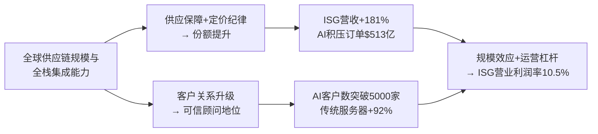

<!-- 匹配到的证券/行业：戴尔科技(DELL.N) -->
操作成功

### 一页通 （戴尔科技 (DELL.N)）
日期：2026-08-06
内容："""
## 公司概况

戴尔科技是全球领先的IT基础设施提供商，聚焦为数据与AI时代提供从客户端设备到服务器、网络、存储的端到端解决方案。公司业务分为两大板块：基础设施解决方案集团（ISG，含AI服务器、传统服务器与网络、存储）和客户端解决方案集团（CSG，含商用与消费PC）。戴尔凭借全球供应链规模、直销渠道网络和金融服务能力，在AI服务器部署领域占据先发地位，FY2027 Q1 AI服务器营收同比增长757%至161亿美元，AI客户数突破5000家。   

## 公司近况跟踪

- <strong>FY2027 Q1业绩全面超预期</strong>：营收438亿美元（同比+88%），Non-GAAP EPS 4.86美元（同比+214%），均大幅超越管理层指引和市场一致预期。ISG营收290亿美元（+181%），CSG营收146亿美元（+17%），两大板块均实现量价齐升。 

- <strong>AI服务器订单与积压创历史新高</strong>：Q1新增AI订单244亿美元，期末积压订单达513亿美元，环比增长19%。管理层将FY2027全年AI服务器营收指引从500亿美元上调至约600亿美元，并强调pipeline规模为积压订单的数倍且持续增长。  

- <strong>传统服务器需求爆发式增长</strong>：传统服务器与网络营收同比增长92%，由大型企业刷新计算环境、AI推理工作负载拉动CPU需求、以及客户提前锁定供应共同驱动。管理层将全年传统服务器增长指引上调至"超过60%"。  

- <strong>存储业务结构优化</strong>：存储营收同比增长8%，Dell自有IP存储需求连续五个季度增速高于市场，PowerStore连续八个季度双位数增长。Dell IP存储占比提升成为ISG利润率改善的关键驱动。  

- <strong>管理层释放长期信心</strong>：在2026年6月BofA全球科技会议上，管理层表示客户正进行3-5年期的供应保障对话，需求可见性延伸至FY2028。Agentic AI被视为"比移动互联网、虚拟化总和更大的变革"，推动CPU与GPU需求比例发生结构性变化。  

## 短期逻辑

1. <strong>FQ2业绩有望再次超预期，但市场预期已大幅上调</strong>：管理层指引FQ2营收440-450亿美元（中点445亿美元），Non-GAAP EPS 4.80美元。花旗于7月24日将DELL列入90天上行催化剂观察名单，认为企业IT基础设施支出持续走强。然而，摩根士丹利指出买方对AI服务器全年营收的预期已达650亿美元，高于管理层600亿美元的指引，意味着"超预期"的门槛已显著提高。FQ2业绩的博弈焦点已从"是否超预期"转向"超预期幅度是否足以支撑当前估值"。   

2. <strong>下半年供需两端的预期差博弈</strong>：管理层指引隐含下半年营收占比约48%，低于历史52%的水平，主因供应约束（DRAM、NAND、CPU、HDD）。摩根士丹利认为1H的强劲存在需求提前采购因素，2H可能面临需求弹性上升和利润率压力，其FY2027下半年EPS预测较一致预期低约7%。高盛则指出，管理层强调指引保守是受供应而非需求限制，预计年底仍将维持大量积压订单，为FY2028增长奠定基础。这一分歧将在未来两个季度持续影响股价方向。  

3. <strong>Agentic AI叙事从概念走向订单验证</strong>：戴尔管理层在业绩会和后续沟通中多次强调，Agentic AI正推动CPU需求结构性增长——每次模型调用可能伴随5-6次工具调用，工具调用需CPU串行处理，导致GPU与CPU需求比例反转。这一叙事若在FQ2订单数据中进一步验证，可能推动市场对公司"非AI"业务（传统服务器）进行价值重估，从周期性硬件升级为AI基础设施的有机组成部分。   

## 长期逻辑

1. <strong>AI推理与Agentic工作负载重塑企业IT架构，TAM持续扩张</strong>：与AI训练时代需求集中于CSP不同，推理时代需求扩散至主权云、区域云、企业及政府客户。戴尔凭借全栈解决方案（计算+网络+存储+数据管理+部署服务），成为这些IT能力较弱客户的首选供应商。管理层在BofA会议上指出，83%的企业数据仍位于本地，企业正从"云优先"转向"数据优先"，将计算带至数据所在地，这一趋势有利于戴尔的本地部署模式。FY2027 Q1 AI客户数突破5000家，较六个月前增长超50%，验证了客户群体的快速扩张。  

2. <strong>全栈集成能力构筑结构性护城河</strong>：随着AI服务器从Hopper向GB200/GB300再到Vera Rubin演进，机架级架构的复杂度和部署难度指数级上升。戴尔在工程定制（Blackwell客户平均约50种定制配置）、液冷集成、现场部署（6.5小时内完成机架部署并保持99.9% uptime）方面的能力，使其在向Vera Rubin过渡时护城河进一步拓宽。摩根大通纪要中管理层明确表示，公司不追求低利润率的交易型订单，在供需失衡环境下对客户选择保持审慎。 

3. <strong>存储与高毛利业务的结构性改善</strong>：Dell自有IP存储（PowerStore、PowerMax、PowerScale、ObjectScale）需求增速持续高于市场，且仅向AI客户销售自有IP存储。随着年底第三方存储产品结构性转换完成，存储营收增速有望加速，叠加自有IP存储的高毛利特征，将成为ISG利润率持续改善的长期驱动力。PowerStore Elite性能较前代提升3倍，数据缩减率从5:1提升至6:1，单3U形态支持6PB存储，产品竞争力显著增强。  

4. <strong>资本回报的复利效应</strong>：戴尔维持"80%调整后自由现金流返还股东"的资本配置框架，FY2027 Q1回购1100万股（均价147美元/股），季度股息提升20%至0.63美元/股。FY2026全年回购约54亿美元，FY2027 Q1回购约16亿美元。在强劲自由现金流支撑下，持续的大规模回购将加速EPS增长，形成"盈利增长-回购-更高EPS增长"的正向循环。  

## 风险提示

- <strong>内存成本通胀与利润率传导风险</strong>：DRAM和NAND现货价格同比上涨超过600%，戴尔虽通过提价和供应链管理部分对冲，但下半年成本压力预计进一步加剧。摩根士丹利测算，若戴尔仅能对冲约25%的内存成本上涨（基准假设约70%），FY2027 EPS可能降至约8.38美元。CSG业务在消费和中小企业市场面临更大的价格弹性约束，下半年利润率可能向6%的长期目标回归。  

- <strong>需求提前采购的可持续性风险</strong>：当前强劲的传统服务器和PC需求中，部分源于客户担忧价格进一步上涨而提前锁定供应。若下半年内存价格企稳或回落，提前采购动力减弱，可能导致需求出现"真空期"。瑞银明确指出，CSG的17%营收增长和8%营业利润率"不可持续"，受益于需求提前采购、份额增长和经营杠杆的一次性叠加。 

- <strong>AI服务器低利润率对整体盈利能力的结构性稀释</strong>：AI服务器营收占比从FY2026的约22%快速上升至FY2027 Q1的37%，但其营业利润率仅维持中个位数，远低于存储（约17-22%）和传统服务器。随着AI服务器全年营收目标上调至600亿美元，其对综合毛利率的稀释效应将持续。若AI服务器竞争加剧导致利润率进一步压缩，将对整体盈利能力产生更大拖累。   

## 近期要闻

- <strong>2026年5月29日</strong>：戴尔发布FY2027 Q1财报，营收438亿美元（同比+88%），Non-GAAP EPS 4.86美元（同比+214%），均大幅超预期。AI服务器营收161亿美元（+757%），积压订单达513亿美元。管理层将FY2027全年营收指引上调至1650-1690亿美元，Non-GAAP EPS指引上调至17.90美元。  

- <strong>2026年6月3日</strong>：戴尔在BofA全球科技会议上发表演讲，管理层详细阐述Agentic AI对CPU需求的结构性拉动、存储业务的自有IP转型路径，以及客户关系从"硬件供应商"向"可信顾问"的战略升级。 

- <strong>2026年7月7日</strong>：美国总统特朗普在白宫活动上公开呼吁购买戴尔电脑，戴尔股价当日盘中一度上涨近10%，收盘涨超4%，单日市值增加逾112亿美元。这是特朗普自2026年2月以来第三次公开支持戴尔。  

- <strong>2026年7月24日</strong>：花旗将戴尔列入90天上行催化剂观察名单，认为企业IT基础设施支出持续走强，AI相关投资、服务器刷新周期和数据中心容量需求支撑更强增长。同日，英伟达CEO黄仁勋发布开源倡议，戴尔作为基础设施厂商签署，利好开放权重模型生态扩张。  

## 未来催化

- <strong>2026年8月底（预计）</strong>：戴尔FY2027 Q2财报发布。管理层指引营收440-450亿美元，Non-GAAP EPS 4.80美元。市场关注焦点包括：AI服务器营收是否超越155亿美元的指引、AI订单与积压订单的环比变化趋势、传统服务器高增长的可持续性、以及管理层是否再次上调全年指引。 

- <strong>2026年8月27日</strong>：戴尔联合Keysight、Siemon举办"下一代AI基础设施验证：1.6/3.2T主题测试线上研讨会"，可能释放公司在高速网络互联领域的技术进展和产品路线图信号。 

- <strong>2026年9-10月</strong>：Nvidia Vera Rubin平台预计进入早期部署阶段。戴尔作为Nvidia核心OEM合作伙伴，若能率先交付Vera Rubin机架，将强化其在AI服务器领域的技术领先地位。摩根士丹利估算，每1000柜GB机架贡献约0.22美元EPS，每1000柜VR机架贡献约0.36美元EPS。 

- <strong>2026年下半年</strong>：Dell自有IP存储完成对第三方存储的结构性替代，存储营收增速有望加速。PowerStore Elite全球 ramp 和AI数据平台的客户采纳情况，将成为存储业务价值重估的关键催化剂。  

## 公司业务模式及拆分

### 业务边际变化

戴尔正处于从传统硬件供应商向AI时代全栈基础设施领导者的战略转型期。核心变化包括：AI服务器业务从FY2024的约19亿美元爆发式增长至FY2027指引的约600亿美元，成为公司最大单一业务线；传统服务器业务从周期性升级切换为AI推理和Agentic工作负载驱动的结构性增长；存储业务加速从第三方产品向自有IP产品转型，Dell IP存储需求连续五个季度增速高于市场；PC业务受益于Windows 11刷新周期和AI PC新品推出。公司于FY2026 Q4将服务器与网络业务拆分为"AI优化服务器"和"传统服务器与网络"两个子类别单独披露，反映AI服务器业务的规模已足够显著。  

### 盈利模式

戴尔的盈利模式建立在<strong>全球供应链规模优势</strong>和<strong>全栈解决方案集成能力</strong>之上。公司通过大规模采购获取零部件成本优势，利用定价纪律和供应链管理能力将成本波动向下游传导，同时通过自有IP产品（存储、数据管理软件）和附加服务（部署、支持、融资）提升利润率。AI服务器业务虽毛利率较低（中个位数营业利润率），但通过规模效应和运营杠杆实现利润绝对额的显著增长（"利润率稀释但利润额增厚"）。传统服务器和存储业务受益于产品组合向高毛利自有IP倾斜，利润率持续改善。 

### 业务拆分

戴尔近年业务结构发生显著变化：ISG营收占比从FY2024的约38%快速上升至FY2027 Q1的约66%，其中AI服务器贡献了约37%的总营收。CSG营收占比相应下降，但仍是重要的现金流来源。存储业务虽增速相对温和（+8%），但利润率最高，是ISG盈利能力的关键支撑。 

<strong>FY2027 Q1细分业务拆分</strong>

| 业务板块 | FY2027 Q1营收(亿美元) | 同比 | 占比 | 营业利润率 |
|---------|---------------------|------|------|-----------|
| ISG | 290.09 | +181% | 66.2% | 10.5% |
|  AI优化服务器 | 161.32 | +757% | 36.8% | 中个位数(指引) |
|  传统服务器与网络 | 85.43 | +92% | 19.5% | - |
|  存储 | 43.34 | +8% | 9.9% | - |
| CSG | 146.09 | +17% | 33.3% | 8.0% |
|  商用 | 130.20 | +18% | 29.7% | - |
|  消费 | 15.89 | +9% | 3.6% | - |
| 其他 | 2.24 | -59% | 0.5% | - |
| <strong>合计</strong> | <strong>438.42</strong> | <strong>+88%</strong> | <strong>100%</strong> | <strong>9.7%(Non-GAAP)</strong> |

<strong>FY2024-FY2026财年分业务营收</strong>

| 业务板块(亿美元) | FY2024 | FY2025 | FY2026 |
|----------------|--------|--------|--------|
| ISG | 338.85 | 435.93 | 608.26 |
|  服务器与网络 | 176.24 | 271.36 | 441.95 |
|   AI优化服务器 | 18.73 | 92.86 | 246.83 |
|   传统服务器与网络 | 157.51 | 178.50 | 195.12 |
|  存储 | 162.61 | 164.57 | 166.31 |
| CSG | 489.16 | 483.93 | 509.84 |
|  商用 | 398.14 | 408.44 | 440.62 |
|  消费 | 91.02 | 75.49 | 69.22 |
| 其他 | 56.24 | 35.81 | 17.28 |
| <strong>合计</strong> | <strong>884.25</strong> | <strong>955.67</strong> | <strong>1135.38</strong> |

<strong>AI优化服务器</strong>（FY2027 Q1）：营收161.32亿美元，同比+757%，主要受单位销量大幅增长驱动。客户数突破5000家，涵盖Neoclouds、主权客户和企业客户。管理层指引FY2027全年AI服务器营收约600亿美元（同比+140%），Q2约155亿美元。该业务营业利润率维持中个位数目标，受益于规模效应和定价纪律，但受限于GPU等高成本零部件的低附加值特征。 

<strong>传统服务器与网络</strong>（FY2027 Q1）：营收85.43亿美元，同比+92%，由销量增长和ASP提升共同驱动。需求驱动力包括：大型企业刷新计算环境、AI推理工作负载拉动CPU需求、客户提前锁定供应。14代及更早服务器仍占安装基数的大部分，存在持续刷新空间。管理层指引FY2027全年传统服务器增长"超过60%"，Q2预计延续强劲势头。 

<strong>存储</strong>（FY2027 Q1）：营收43.34亿美元，同比+8%，主要由Dell自有IP产品驱动。PowerStore连续八个季度双位数需求增长，PowerScale和ObjectScale连续三个季度增长。Dell IP存储占比提升带动存储业务利润率改善。管理层指引FY2027全年存储增长"中个位数"，受第三方存储产品退出影响，但自有IP增速显著高于市场。 

<strong>商用PC</strong>（FY2027 Q1）：营收130.20亿美元，同比+18%，连续七个季度增长。大型企业客户在各地区均实现双位数增长，约三分之一设备使用已超四年，Windows 11刷新周期持续。ASP提升受定价纪律和更丰富配置驱动。 

<strong>消费PC</strong>（FY2027 Q1）：营收15.89亿美元，同比+9%，连续三个季度需求增长，游戏领域表现强劲。 

## 核心竞争力

<strong>竞争要素 1：依托全球供应链规模与客户关系深度构筑的"可信顾问"地位</strong>

- <strong>护城河定性</strong>：<strong>结构性护城河</strong>。戴尔的供应链规模（FY2027 Q1末存货+采购义务达358.52亿美元）使其在零部件短缺期获得优先分配，同时通过定价纪律将成本压力向下游传导。客户关系已从"硬件供应商"升级为"可信顾问"，参与客户董事会级讨论，协助解决AI转型中的ROI、模型选择、数据准备及架构设计问题。这种关系深度在供应紧张期转化为客户粘性——客户倾向于选择能保障供应的供应商。 

- <strong>数据验证</strong>：FY2027 Q1末AI积压订单达513亿美元，环比增长19%；AI客户数突破5000家，六个月增长超50%；传统服务器营收同比+92%，增速远超市场平均水平。公司连续九个季度ISG实现双位数增长。FY2027 Q1 ISG营业利润率10.5%，在AI服务器大幅拉低毛利率的背景下仍实现同比+80个基点。 

- <strong>动态演变</strong>：<strong>护城河变宽</strong>。随着AI服务器向Vera Rubin等更复杂机架级架构演进，戴尔的工程定制能力（Blackwell客户平均约50种定制配置）和部署能力（6.5小时内部署机架，99.9% uptime）成为更显著的差异化优势。摩根大通纪要中管理层明确表示，公司不追求低利润率交易型订单，在供需失衡环境下对客户选择保持审慎，进一步强化利润率纪律。 

<strong>竞争要素 2：全栈解决方案的集成与部署能力</strong>

- <strong>护城河定性</strong>：<strong>行业阶段性红利向结构性护城河演进</strong>。AI基础设施正从"服务器采购"升级为"计算+网络+存储+数据管理+部署服务"的系统化建设。戴尔是少数能提供涵盖GPU/CPU服务器、网络、存储（含自有IP数据管理软件）、部署服务和融资方案的端到端供应商。这种全栈能力在Agentic AI时代更为关键——Agentic工作负载要求计算、网络、存储的深度互联，客户倾向于采购经过验证的集成方案而非自行集成。 

- <strong>数据验证</strong>：戴尔与Nvidia合作实现多个"行业首个"——首个Hopper部署、首个GB200 NVL72部署、首个QS0机架交付Coreweave。AI数据平台实现12倍向量索引速度、3倍查询速度、19倍首token生成速度。Lightning并行文件系统吞吐量达竞品2倍。Dell金融服务FY2027 Q1新增融资发放28亿美元，同比+75%，支持客户采用灵活的消费模式。 

- <strong>动态演变</strong>：<strong>护城河变宽</strong>。随着AI部署从CSP向企业、主权客户扩散，客户IT能力差异加大，对集成方案的需求增加。戴尔的全栈能力和全球服务网络（覆盖170+国家）在服务这类客户时具有明显优势。存储附加率和服务附加率的提升将进一步增强客户粘性和利润率。  

<strong>现阶段核心驱动力总结</strong>：戴尔的Alpha来自AI服务器市场的先发优势和全栈集成能力，Beta来自全球企业IT基础设施投资周期。公司正处于"AI服务器放量→规模效应→利润率改善"和"自有IP产品占比提升→结构性利润率上行"的双重正向循环中。 

<strong>竞争格局传导逻辑图</strong>：

## 产销链

### 客户情况

戴尔客户群体正从CSP向多元化方向扩展。FY2027 Q1 AI客户数突破5000家，涵盖Neoclouds、主权客户、企业客户，六个月增长超50%。FY2026年报披露，单一客户占合并营收约12%，主要来自ISG产品销售，显示存在一定大客户依赖。但管理层强调，增量订单正来自更广泛的客户群体，客户集中度呈下降趋势。新客户方面，管理层在BofA会议上表示，半导体公司、先进制造企业等正成为传统服务器的新需求来源，用于AI推理和EDA工作负载。  

### 供应商情况

戴尔面临严重的供应链约束，主要瓶颈按重要性排序为：DRAM、NAND、CPU、HDD。DRAM和NAND现货价格同比上涨超过600%，CPU领先制程产能已满，交货周期长达一年。戴尔通过长期供应协议（LTA）锁定产能，管理层在摩根大通纪要中确认LTA以保障供应而非锁定价格为目的。FY2027 Q1末采购义务达208亿美元（环比+11%），其中173亿美元在12个月内到期，存货达150.52亿美元（环比+44%），反映公司为应对供应紧张而主动增加库存。戴尔利用其供应链规模在零部件分配中获得优先权，构成相对中小竞争对手的优势。  

### 经销商情况

戴尔采用直销与渠道混合模式，FY2026渠道销售占比约40%。公司维持全球直销团队和渠道合作伙伴网络，通过Dell Technologies合作伙伴计划提供激励。Dell金融服务（DFS）为渠道合作伙伴提供融资支持，帮助其管理营运资金。FY2027 Q1 DFS新增融资发放28亿美元，同比+75%，覆盖所有产品线，包括来自历史上无需融资的投资级客户的需求，反映客户通过融资而非推迟采购来应对预算约束。  

<strong>成本传导能力定性</strong>：当上游原材料涨价时，戴尔展现出较强的成本转嫁能力。公司于2025年12月9日基于行业成本结构变化调整了全业务定价，通过透明沟通获得客户理解。传统服务器和PC业务通过提价和配置调整将大部分成本压力向下游传导；AI服务器业务维持中个位数营业利润率目标，在供需失衡环境下具备定价纪律。公司赚取的是"供应链管理+全栈集成+服务附加"的综合价值，而非单纯的硬件加工费。 

## 财务数据

<strong>关键财务数据</strong>

| 指标 | FY2024 | FY2025 | FY2026 | FY2027 Q1 |
|------|--------|--------|--------|-----------|
| <strong>截止日期</strong> | 2024-02-02 | 2025-01-31 | 2026-01-30 | 2026-05-01 |
| 营业总收入(亿美元) | 884.25 | 955.67 | 1135.38 | 438.42 |
| 营收同比 | -13.56% | 8.08% | 18.80% | 87.54% |
| 营业成本(亿美元) | 673.56 | 743.17 | 908.31 | 360.60 |
| 毛利润(亿美元) | 210.69 | 212.50 | 227.07 | 77.82 |
| 毛利率 | 23.83% | 22.23% | 20.00% | 17.75% |
| Non-GAAP毛利率 | 24.48% | 22.82% | 20.40% | 18.13% |
| 营业利润(亿美元) | 54.11 | 62.37 | 81.49 | 36.56 |
| 营业利润率 | 6.12% | 6.53% | 7.18% | 8.34% |
| Non-GAAP营业利润率 | 8.91% | 8.92% | 8.80% | 9.66% |
| 归母净利润(亿美元) | 33.88 | 45.92 | 59.36 | 34.38 |
| 归母净利润同比 | 38.74% | 35.54% | 29.27% | 256.27% |
| 稀释EPS(美元) | 4.60 | 6.38 | 8.68 | 5.24 |
| Non-GAAP稀释EPS(美元) | 7.37 | 8.14 | 10.30 | 4.86 |
| 经营现金流(亿美元) | 86.76 | 45.21 | 111.85 | 40.81 |
| 自由现金流(亿美元) | 59.23 | 19.58 | 85.55 | 31.18 |

### 财务分析

<strong>成长能力</strong>：戴尔经历FY2024的营收下滑（-13.56%，受PC市场低迷和VMware转售终止影响）后，FY2025-FY2026恢复增长，FY2027 Q1在AI服务器爆发式增长驱动下营收同比+87.54%。ISG营收从FY2024的338.85亿美元增长至FY2026的608.26亿美元，两年CAGR约34%。归母净利润从FY2024的33.88亿美元增长至FY2026的59.36亿美元，FY2027 Q1单季即达34.38亿美元，超过FY2024全年水平。 

<strong>盈利能力</strong>：综合毛利率从FY2024的23.83%持续下降至FY2027 Q1的17.75%，主要受AI服务器（低毛利率）营收占比快速提升的结构性稀释。但Non-GAAP营业利润率从FY2024的8.91%小幅下降至FY2026的8.80%后，在FY2027 Q1回升至9.66%，反映规模效应和运营杠杆对毛利率稀释的对冲——运营费用率从FY2024的17.70%大幅下降至FY2027 Q1的9.41%（Non-GAAP口径从15.57%降至8.47%），创20年新低。 

<strong>运营能力</strong>：FY2027 Q1应收账款达340.91亿美元（环比+31%），存货达150.52亿美元（环比+44%），主要受AI服务器业务规模扩大和供应链紧张下主动增加库存影响。应付账款达452.61亿美元（环比+35%），公司通过延长付款周期部分对冲营运资金占用。现金转换周期为负值，体现戴尔在产业链中的强势地位——先收款后付款。 

<strong>偿债能力</strong>：FY2027 Q1末总债务311.61亿美元（含DFS债务），核心债务166.07亿美元。净债务约196亿美元。FY2026利息支出15.60亿美元，利息覆盖倍数（营业利润/利息支出）约5.2倍。公司维持投资级信用评级，流动性充足（现金115.78亿美元+循环信贷额度约58.84亿美元可用额度）。  

<strong>ROE与杜邦分析</strong>：由于持续的大规模股份回购，戴尔股东权益为负值（FY2027 Q1末-14.04亿美元），ROE指标不适用。但Non-GAAP ROIC表现强劲，FY2026约90.5%（瑞银测算），反映轻资产运营模式和强劲的盈利能力。 

## 行业及竞争分析

### AI服务器市场

AI服务器市场正处于从训练向推理扩展的爆发期。据IDC数据，2025年Q4 ODM厂商占服务器市场份额约53%，品牌商服务IT能力较弱的客户群体。戴尔在AI服务器领域的主要竞争对手包括超微电脑（SMCI）、惠普企业（HPE）、联想等。戴尔的竞争优势在于：与Nvidia的深度合作（多个"行业首个"部署）、全栈集成能力、全球部署和服务网络。超微电脑近期面临治理问题，戴尔可能获得部分市场份额。FY2027 Q1戴尔AI服务器营收161亿美元，超微电脑同期约60-70亿美元（估算），HPE约40-50亿美元（估算）。 

### 传统服务器市场

传统服务器市场正经历由AI推理和Agentic工作负载驱动的结构性增长。戴尔FY2027 Q1传统服务器营收同比+92%，HPE同期服务器营收同比+32.7%。戴尔的竞争优势在于：供应链规模、企业客户关系深度、以及通过自有IP产品（存储、数据管理软件）实现差异化。行业趋势上，服务器采购正从"单机"向"机架级解决方案"升级，对供应商的工程集成和部署能力提出更高要求，有利于头部品牌商。  

### 存储市场

企业存储市场增长相对温和，但AI正推动非结构化数据存储需求加速。戴尔存储业务FY2027 Q1同比+8%，主要竞争对手包括NetApp（NTAP）、Pure Storage（PSTG）等。戴尔的差异化在于：自有IP存储产品组合（PowerStore、PowerMax、PowerScale、ObjectScale）的竞争力和与AI服务器、数据管理软件的深度集成。NetApp FY2026指引营收增长约7-8%，Pure Storage指引增长约20%，戴尔自有IP存储增速高于市场平均水平。  

### PC市场

全球PC市场处于Windows 11刷新周期中，同时AI PC新品推动换机需求。戴尔FY2027 Q1 CSG营收同比+17%，IDC数据显示戴尔Q1出货量930万台，同比+6%，连续两个季度超越市场增速。主要竞争对手包括联想、HP、苹果。戴尔的竞争优势在于：商用PC市场的强势地位、直销渠道和客户关系、以及配件和服务的高附加率。 

<strong>可比公司</strong>

| 公司 | 股票代码 | AI服务器定位 | 传统服务器 | 存储 | PC |
|------|---------|------------|-----------|------|-----|
| 惠普企业 | HPE | 跟随者，FY2027 Q2服务器营收同比+32.7% | 强劲，传统服务器订单三位数增长 | 有布局，Alletra MP平台订单三位数增长 | 无 |
| 超微电脑 | SMCI | 主要竞争对手，Q4毛利率大幅改善至15-17% | 有布局 | 有布局 | 无 |
| 联想集团 | 0992.HK | 快速追赶，AI服务器储备订单210亿美元 | 有布局 | 有布局 | 全球第一 |
| NetApp | NTAP | 无直接竞争 | 无 | 主要存储竞争对手，指引+7-8% | 无 |

戴尔与HPE的差异化在于：戴尔拥有PC业务（CSG）提供稳定现金流和客户触点，AI服务器规模更大且与Nvidia合作更深入，存储自有IP产品组合更完整。与SMCI相比，戴尔的企业级服务和支持能力更强，客户群体更多元化。与联想相比，戴尔在北美和欧洲商用市场具有更强的品牌和渠道优势。 

## 市场焦点议题

<strong>议题一：AI服务器高增长的可持续性与利润率底线</strong>

- <strong>背景</strong>：戴尔AI服务器营收从FY2024的约19亿美元爆发式增长至FY2027指引的约600亿美元，已成为公司最大单一业务线。但该业务营业利润率仅维持中个位数，远低于传统服务器和存储。市场担忧AI服务器需求放缓或竞争加剧可能导致利润率进一步压缩，且高基数效应下增速必然放缓。  
- <strong>问题列表</strong>：AI服务器积压订单（513亿美元）的转化节奏和利润率趋势如何？Vera Rubin等新一代产品的利润率是否高于GB200/GB300？企业客户占比提升是否有助于利润率改善？FY2028 AI服务器营收能否继续增长，还是将出现首次下滑？

<strong>议题二：传统服务器需求是真实的结构性增长还是提前采购透支</strong>

- <strong>背景</strong>：传统服务器FY2027 Q1营收同比+92%，管理层指引全年增长"超过60%"。但DRAM/NAND价格同比上涨超过600%，客户可能因担忧进一步涨价而提前采购。若下半年内存价格企稳或回落，提前采购动力减弱，需求可能出现"真空期"。 
- <strong>问题列表</strong>：传统服务器增长中，销量和ASP分别贡献多少？Agentic AI对CPU需求的实际拉动何时能在营收中量化体现？14代及更早服务器的刷新周期还能持续多久？FY2028传统服务器能否避免负增长？

<strong>议题三：内存成本通胀对利润率的影响程度</strong>

- <strong>背景</strong>：DRAM和NAND现货价格同比上涨超过600%，戴尔FY2027 Q1毛利率同比下降463个基点至18.1%。管理层指引FY2027全年Non-GAAP EPS 17.90美元，但摩根士丹利测算若成本传导能力弱于预期，EPS可能降至约8.38美元。  
- <strong>问题列表</strong>：戴尔实际能通过提价和配置调整对冲多大比例的内存成本上涨？下半年内存价格走势如何？CSG业务在消费和中小企业市场的价格弹性是否会导致利润率超预期下滑？FY2027 Q1的8.0% CSG营业利润率是否可持续？

<strong>议题四：估值是否已充分反映乐观预期</strong>

- <strong>背景</strong>：戴尔股价从FY2026 Q4财报后的约120美元上涨至2026年8月的约380-440美元区间，Forward P/E从约9倍扩张至20倍以上。摩根士丹利指出，戴尔当前估值相对AI基础设施同行的溢价达30%，为历史最高水平，而其营收和EPS增速较同行低约9个百分点。 
- <strong>问题列表</strong>：当前估值中隐含的FY2028/FY2029增长预期是多少？若AI服务器增速在FY2028放缓至20-30%，当前估值是否合理？戴尔历史上在毛利率压缩周期中的估值倍数通常如何变化？股份回购对EPS的增厚效应是否已被充分定价？

## 市场分歧探讨

<strong>核心分歧：当前强劲增长是真实需求扩张还是提前采购透支，以及AI服务器高增长能否支撑估值溢价</strong>

<strong>乐观方观点：需求是结构性的，增长具备多年持续性</strong>

乐观方（以高盛、巴克莱、花旗、富国银行为代表）认为，当前需求由多重结构性因素驱动，并非单纯的提前采购。高盛在FY2027 Q1财报后指出，企业IT硬件支出正经历"根本性上升"，不仅受提前采购驱动，更来自现代化/刷新努力和Agentic AI工作负载的净新增需求。巴克莱强调，传统服务器单位销量在ASP大幅上涨的同时仍实现增长，说明需求具有真实弹性。花旗将戴尔列入90天上行催化剂观察名单，认为企业IT基础设施支出持续走强。  

支撑逻辑包括：1）安装基数老化——14代及更早服务器占安装基数的大部分，约三分之一PC使用超四年，刷新需求独立于价格因素；2）Agentic AI创造新需求——每次模型调用可能伴随5-6次工具调用，工具调用需CPU串行处理，这是全新的工作负载而非现有需求的替代；3）客户正进行3-5年期的供应保障对话，需求可见性延伸至FY2028；4）戴尔在AI服务器市场的份额持续提升，FY2025 Q4份额增长500个基点。  

<strong>谨慎方观点：提前采购因素不可忽视，估值已透支乐观预期</strong>

谨慎方（以摩根士丹利、瑞银为代表）认为，当前强劲的1H表现在一定程度上透支了下半年需求，且当前估值已处于历史极端水平。摩根士丹利维持Underweight评级，指出：1）DRAM/NAND现货价格同比上涨超过600%，1H的强劲需求部分源于客户抢在进一步涨价前锁定供应，2H可能面临需求弹性上升；2）戴尔当前估值相对AI基础设施同行的溢价达30%，为历史最高水平，而历史数据显示毛利率压缩期的股票不仅跑输同行，还会经历估值倍数收缩；3）其FY2027下半年EPS预测较一致预期低约7%，FY2028 EPS预测低约6%。 

瑞银虽上调了目标价，但指出CSG的17%营收增长和8%营业利润率"不可持续"，受益于需求提前采购、份额增长和经营杠杆的一次性叠加，下半年CSG利润率可能向6%的长期目标回归。个人观点分析师也指出，戴尔的估值模型显示其显著高估，且FCF与盈利的差距正在扩大——AI增长消耗大量营运资金。 

<strong>综合分析</strong>

从多空双方的论据来看，当前戴尔确实处于一个"数据强劲但预期更高"的阶段。乐观方的核心论据——Agentic AI驱动的CPU需求结构性增长、安装基数老化带来的刷新需求、戴尔全栈能力的护城河拓宽——具有中长期逻辑支撑，但在短期（2-3个季度）内难以证伪或证实。谨慎方的担忧——提前采购效应、估值溢价的历史不可持续性——同样有数据和历史规律支撑。  

关键验证点在于：1）FY2027 Q2-Q3的传统服务器订单和营收数据，若能在1H高基数上继续环比增长，将有力反驳"提前采购透支"论；2）AI服务器积压订单的转化节奏和利润率趋势，若Vera Rubin产品的利润率高于GB200/GB300，将改善AI服务器的盈利质量；3）存储业务的自有IP转型完成后，营收增速能否加速至双位数。 

## 盈利预测与估值

<strong>管理层最新指引（FY2027 Q1财报，2026年5月29日发布）</strong>

- FY2027全年营收：1650-1690亿美元（中点1670亿美元，同比+47%）
- FY2027 AI服务器营收：约600亿美元（同比+143%）
- FY2027 Non-GAAP EPS：17.65-18.15美元（中点17.90美元，同比+74%）
- FY2027 Q2营收：440-450亿美元（中点445亿美元，同比+50%）
- FY2027 Q2 Non-GAAP EPS：4.70-4.90美元（中点4.80美元，同比+100%）

<strong>券商盈利预测与估值</strong>

| 机构 | 评级 | 目标价(美元) | 指标 | FY2027E | FY2028E | FY2029E |
|------|------|------------|------|---------|---------|---------|
| 高盛(2026-06-01) | 买入 | 500 | 营收(亿美元) | 1674.92 | 1927.75 | 2120.73 |
| | | | Non-GAAP EPS(美元) | 18.26 | 21.87 | 24.43 |
| 巴克莱(2026-05-29) | 超配 | 550 | 营收(亿美元) | 1677.86 | 1923.02 | - |
| | | | Non-GAAP EPS(美元) | 18.14 | 22.01 | - |
| 花旗(2026-07-24) | 买入 | 515 | Non-GAAP EPS(美元) | 18.74 | 25.64 | 29.87 |
| 富国证券(2026-06-17) | 超配 | 505 | Non-GAAP EPS(美元) | - | - | - |
| 瑞银(2026-05-28) | 中性 | 440 | 营收(亿美元) | 1682.18 | 1826.40 | 1967.62 |
| | | | Non-GAAP EPS(美元) | 17.96 | 19.20 | 21.20 |
| 摩根士丹利(2026-05-25) | 低配 | 170 | 营收(亿美元) | 1567.95 | 1675.52 | 1647.76 |
| | | | Non-GAAP EPS(美元) | 13.34 | 14.13 | 14.99 |
| 美国银行(2026-02-24) | 买入 | 135 | Non-GAAP EPS(美元) | 10.00 | 12.24 | - |

机构间观点存在显著分歧。乐观方（高盛、巴克莱、花旗、富国）目标价在500-550美元区间，基于FY2028 EPS的20-25倍P/E估值，认为戴尔的全栈能力和AI服务器领先地位值得估值溢价。谨慎方（摩根士丹利）目标价仅170美元，基于FY2028 EPS的12倍P/E，认为毛利率结构性压缩将导致估值倍数收缩，且当前股价已透支乐观预期。瑞银处于中间位置，目标价440美元基于22倍FY2027/FY2028平均EPS，认为AI收入机会支撑估值但需平衡毛利率下行风险。    

估值方法上，多数机构采用P/E估值，倍数范围从摩根士丹利的12倍到巴克莱的25倍，差异巨大，反映市场对戴尔"是周期性硬件公司还是AI基础设施平台"的定性分歧。高盛将目标倍数从15倍上调至22倍，理由是"对戴尔差异化规模、业务组合和Agentic AI驱动的长期增长机会的信心增强"。摩根士丹利则认为，25年以上TMT股票历史数据显示，毛利率结构性压缩的公司无论营收增速如何，都会经历估值倍数收缩。
"""
