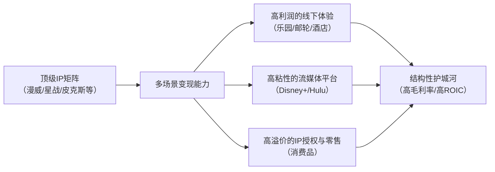

<!-- 匹配到的证券/行业：迪士尼(DIS.N) -->
操作成功

### 一页通 （迪士尼 (DIS.N)）
日期：2026-08-07
内容："""
## 公司概况

华特迪士尼公司是一家全球多元化的娱乐巨头，业务涵盖影视内容制作与发行、有线及流媒体电视网络、以及主题乐园与消费品授权。公司通过三大核心部门——娱乐、体育和体验——构建了从IP创造到多场景变现的完整商业闭环。迪士尼是全球最大的IP授权方和线下乐园运营商，凭借旗下漫威、皮克斯、星球大战等常青IP矩阵，在内容与体验经济中占据独特的垄断性地位。  

## 公司近况跟踪

- <strong>FY26Q3业绩超预期</strong>：公司于2026年8月5日发布FY26Q3财报，调整后每股收益（EPS）达<strong>2.06美元</strong>，大幅超出市场一致预期的<strong>1.84美元</strong>。总部门运营利润达<strong>55.55亿美元</strong>，同比增长<strong>21%</strong>，同样超出预期。营收为<strong>252.48亿美元</strong>，同比增长<strong>7%</strong>，略低于预期。        

- <strong>体验业务表现强劲，上调全年指引</strong>：体验业务（乐园及消费品）在FY26Q3实现创纪录的营收（<strong>99.68亿美元</strong>，同比+<strong>10%</strong>）和运营利润（<strong>30.17亿美元</strong>，同比+<strong>20%</strong>）。国内乐园游客量增长<strong>3%</strong>，人均消费增长<strong>4%</strong>。管理层将此归因于自身有机投资和强劲的执行力，并将FY2026体验业务运营利润增长指引上调至此前高个位数区间的<strong>高端</strong>。        

- <strong>流媒体利润率持续优化</strong>：娱乐部门下的流媒体业务（SVOD）运营利润率在FY26Q3达到<strong>12.9%</strong>，同比提升<strong>630个基点</strong>。管理层重申FY2026全年实现双位数利润率的指引。增长主要由订阅用户和定价驱动，但广告市场因供应增加而面临定价压力。        

- <strong>宣布重大战略调整与合作</strong>：公司宣布将从FY27Q1起将大部分消费品业务从体验板块划归娱乐板块，以整合IP创造与变现。同时，迪士尼与TikTok达成全球内容合作协议，将TikTok上的粉丝创作内容引入Disney+的竖屏专区“Verts”，旨在提升年轻用户参与度。        

- <strong>上调股票回购规模</strong>：基于强劲的现金流和出售A+E股权带来的约<strong>12亿美元</strong>现金收益，公司将FY2026的股票回购目标从<strong>80亿美元</strong>上调至<strong>至少90亿美元</strong>。        

## 短期逻辑

1.  <strong>体验业务韧性证伪宏观悲观预期</strong>：在竞争对手康卡斯特提及奥兰多主题公园客流疲软后，市场对迪士尼乐园业务产生担忧。然而，FY26Q3财报显示，迪士尼国内乐园游客量增长<strong>3%</strong>，人均消费增长<strong>4%</strong>，表现显著优于同业。管理层强调增长几乎完全由自身有机行动驱动，且远期预订量健康。这一业绩证伪了市场的悲观预期，随着新邮轮（迪士尼命运号、探险号）运力爬坡和巴黎“冰雪奇缘世界”新园区开业，体验业务有望在<strong>未来一个季度</strong>继续成为业绩稳定器和情绪催化剂。        

2.  <strong>流媒体利润率拐点确立，叙事从“烧钱”转向“盈利”</strong>：FY26Q3流媒体运营利润率达到<strong>12.9%</strong>，标志着迪士尼流媒体业务已从拖累业绩的“烧钱黑洞”转变为利润增长点。尽管收入增速有所放缓，但利润率的持续改善是当前阶段的核心逻辑。管理层重申全年双位数利润率指引，并计划通过整合Hulu、引入ESPN内容和探索免费广告层来深化用户参与度和货币化能力。<strong>未来一个季度</strong>，市场将密切关注利润率能否在广告逆风中维持扩张趋势。        

3.  <strong>积极的资本配置策略提供下行保护</strong>：公司将FY2026的股票回购目标上调至<strong>至少90亿美元</strong>，约占当前市值的<strong>5%</strong>。这一激进的回购计划，结合持续增长的半年度股息，为股价提供了坚实的资金支撑。在估值处于历史低位的背景下，大规模回购将显著增厚每股收益，是短期内驱动股价修复的重要力量。        

## 长期逻辑

1.  <strong>IP飞轮效应构建难以复制的商业闭环</strong>：迪士尼的核心竞争力在于其跨越一个世纪积累的IP矩阵（漫威、星战、皮克斯等）。公司已证明其有能力将这些IP在不同业务板块间反复变现：一部成功的电影（如《玩具总动员5》全球票房超<strong>10亿美元</strong>）不仅能直接贡献票房收入，还能拉动流媒体观看量（系列电影在Disney+播放超<strong>20亿小时</strong>）、刺激乐园和邮轮需求、并带动全球零售额（每年超<strong>10亿美元</strong>）。这种“内容-流媒体-体验-消费品”的飞轮效应，是竞争对手难以在短期内复制的结构性护城河。未来1-3年，随着公司计划从2027年春季开始在Disney+中整合游戏、商品等生态元素，IP的变现链条将进一步缩短和强化。        

2.  <strong>体验业务的重资产扩张提供长期可见的增长管道</strong>：迪士尼正在执行一项长达十年的乐园和邮轮投资周期。未来1-3年，除了已启航的新邮轮，公司计划在2027至2031年间再推出<strong>四艘</strong>新邮轮，并在全球各大乐园进行大规模扩建（如奥兰多的反派乐园、阿纳海姆的复仇者联盟园区）。这些重资产投资虽然短期消耗现金流，但一旦投入运营，将提供长达数十年的稳定现金流和高于资本成本的回报。管理层强调所有项目均经过严格的回报率评估，且投入资本回报率（ROIC）随时间推移已显著提升。        

3.  <strong>流媒体业务的战略价值超越短期利润</strong>：尽管市场对流媒体利润率与奈飞的差距存在疑虑，但管理层明确指出，直接面向消费者（DTC）模式的核心价值在于掌握<strong>第一方数据和直接客户关系</strong>。这不仅使公司能进行个性化推荐和精准营销，更是未来在AI时代进行产品创新和建立新收入来源的基础。退出DTC回归纯内容授权模式，将牺牲这些战略价值。未来1-3年，随着技术栈和数据整合完成，以及广告层级和免费模式的探索，流媒体业务的用户基础和单位经济模型有望持续改善，其战略价值将逐步显现。      

## 风险提示

- <strong>宏观经济下行与消费疲软风险</strong>：迪士尼的乐园和消费品业务高度依赖消费者的可支配收入。尽管当前北美需求强劲，但管理层已注意到亚洲市场（上海、香港）的消费疲软。若美国经济陷入衰退或全球通胀持续高企，可能导致乐园客流量和人均消费下滑，对体验业务这一核心利润支柱造成冲击。       

- <strong>内容投资的固有不确定性与IP疲劳风险</strong>：电影和流媒体内容的成功具有高度不确定性。近期《曼达洛人和古古》及真人版《海洋奇缘》的票房表现未达预期，凸显了即使是顶级IP也存在创意疲劳和回报不佳的风险。若未来核心IP系列影片持续表现不佳，将削弱整个飞轮的驱动力，影响从流媒体订阅到消费品销售的全链条收入。        

- <strong>传统电视业务的结构性衰退与体育版权成本压力</strong>：尽管流媒体业务在增长，但高利润率的传统有线电视业务仍在持续萎缩，其收入下滑的速度可能快于流媒体业务的盈利改善速度，从而在过渡期拖累公司整体利润率。同时，体育版权成本（如NBA）持续上涨，而NFL Network与Comcast的转播纠纷等问题，给体育业务的盈利能力带来不确定性。        

## 近期要闻

- <strong>2026年5月1日</strong>：NFL Network和NFL RedZone频道因转播协议到期未能续约，从Comcast Xfinity平台撤下，至今仍未恢复。这对体育部门的订阅和广告收入造成负面影响。       

- <strong>2026年7月10日</strong>：迪士尼真人版《海洋奇缘》上映，首周末全球票房<strong>9500万美元</strong>，远低于预期。市场预计该片可能面临<strong>1亿至1.32亿美元</strong>的亏损，对FY26Q4的娱乐业务利润构成压力。        

- <strong>2026年7月</strong>：迪士尼与TikTok达成全球内容合作协议，允许TikTok创作者使用迪士尼IP素材制作短视频，并计划将精选内容引入Disney+。此举旨在利用短视频平台提升IP在年轻群体中的影响力和流媒体平台的参与度。        

- <strong>2026年7月</strong>：公司宣布已达成协议，将其在A+E Global Media的<strong>50%</strong> 股权出售给合资方赫斯特集团，交易对价约为<strong>12亿美元</strong>现金。该交易预计在FY2026末完成，所得款项将用于支持股票回购计划。        

## 未来催化

- <strong>2026年8月28日</strong>：新片《The Dog Stars》上映。作为FY26Q4的重要作品，其票房表现将影响娱乐部门的业绩。      

- <strong>2026年10月-11月</strong>：FY26Q4（截至9月底）财报发布。市场将关注公司能否实现全年调整后EPS增长<strong>~12%</strong>（不含第53周）的指引，以及流媒体利润率是否达到双位数目标。同时，对FY2027的初步展望将是关键。        

- <strong>2026年11月25日</strong>：新片《Hexed》上映。作为FY27Q1的开篇之作，其市场反响将奠定新财年内容业务的基调。       

- <strong>2026年12月18日</strong>：漫威重磅影片《复仇者联盟：末日》上映。作为漫威宇宙的核心IP，该片是验证IP号召力和拉动整个飞轮效应的关键催化剂，其票房表现将直接影响市场对公司内容战略的信心。       

## 公司业务模式及拆分

- <strong>业务边际变化</strong>：公司正处于从传统有线电视向流媒体深度转型的后期阶段，同时大力投资线下体验业务。近期最重要的变化是宣布将从FY27Q1起，将大部分消费品业务从体验板块划归娱乐板块。此举旨在将IP的创意开发（工作室）与商业变现（消费品）置于同一部门管理下，以强化IP飞轮的协同效应。此外，公司不再按季度披露流媒体订阅用户数，显示其战略重心已从追求用户规模转向提升盈利能力和用户价值。       

- <strong>盈利模式</strong>：迪士尼的盈利模式是典型的“IP创造与多场景变现”。公司通过旗下工作室创造影视内容和角色IP，然后通过三大渠道进行变现：1) <strong>内容发行</strong>：通过影院、流媒体订阅和广告、有线电视转播费等方式获取直接的内容收入；2) <strong>线下体验</strong>：通过主题乐园、邮轮、酒店等提供沉浸式体验，将线上IP流量转化为高毛利的线下消费；3) <strong>IP授权与零售</strong>：将IP授权给第三方用于商品开发，或通过自营渠道销售衍生品，赚取授权费或零售利润。这种模式的核心在于，一次IP创作投入，可产生长期、多次、跨平台的收入流。  

- <strong>业务拆分</strong>：公司运营分为三大板块：娱乐、体育和体验。FY2025（截至2025年9月27日），体验业务是最大的利润来源，贡献了<strong>57%</strong> 的部门运营利润，而娱乐和体育分别贡献<strong>27%</strong> 和<strong>16%</strong>。娱乐板块中，直接面向消费者（DTC）的流媒体业务是增长引擎，而传统有线网络则是衰退但高利润的现金牛。公司当前处于“流媒体利润率爬坡”和“体验业务产能扩张”的叠加经营周期。  

<strong>细分业务拆分（单位：百万美元）</strong>

| 业务板块 | FY2024 收入 | FY2024 运营利润率 | FY2025 收入 | FY2025 运营利润率 | FY26Q1-Q3 收入 | FY26Q1-Q3 运营利润率 |
| :--- | :--- | :--- | :--- | :--- | :--- | :--- |
| <strong>娱乐</strong> | 41,186 | 9.5% | 42,466 | 11.0% | 34,669 | 11.9% |
| 其中：SVOD | - | - | 19,583 | 6.6% | 16,364 | 10.6% |
| <strong>体育</strong> | 17,619 | 13.7% | 17,672 | 16.3% | 14,018 | 12.1% |
| <strong>体验</strong> | 34,151 | 27.2% | 36,156 | 27.6% | 29,461 | 30.4% |
| <strong>总计（含抵消）</strong> | <strong>91,361</strong> | <strong>17.1%</strong> | <strong>94,425</strong> | <strong>18.6%</strong> | <strong>76,397</strong> | <strong>19.3%</strong> |

*注：SVOD为娱乐板块下的流媒体业务。FY26Q1-Q3数据为期9个月。*

- <strong>娱乐业务</strong>：FY26Q3收入<strong>113.45亿美元</strong>，同比增长<strong>6%</strong>。增长主要由订阅和联盟费收入驱动（+<strong>12%</strong>），其中包含Fubo交易的贡献。广告收入同比下降<strong>1%</strong>，内容销售/授权收入下降<strong>6%</strong>。运营利润为<strong>16.80亿美元</strong>，同比大增<strong>64%</strong>，运营利润率<strong>14.8%</strong>。利润超预期主要得益于流媒体（SVOD）利润率的强劲提升（<strong>12.9%</strong>）以及营销和内容减值费用的下降。电影《玩具总动员5》票房超<strong>10亿美元</strong>，是主要亮点，但《曼达洛人和古古》和《海洋奇缘》表现不佳。        

- <strong>体育业务</strong>：FY26Q3收入<strong>45.00亿美元</strong>，同比增长<strong>4%</strong>。增长主要来自NFL交易的贡献和更高的订阅费率。运营利润为<strong>8.58亿美元</strong>，同比下降<strong>17%</strong>，低于预期。利润下滑主因是NBA新合同带来的版权成本上升，以及NFL Network与Comcast的转播纠纷导致收入受损。NBA和NHL季后赛收视率的大幅增长（超<strong>100%</strong>）是积极信号。        

- <strong>体验业务</strong>：FY26Q3收入<strong>99.68亿美元</strong>，同比增长<strong>10%</strong>，运营利润<strong>30.17亿美元</strong>，同比增长<strong>20%</strong>，均创下第三季度纪录。增长由量价齐升驱动：全球游客量增长<strong>4%</strong>，国内乐园游客量增长<strong>3%</strong>，人均消费增长<strong>4%</strong>。新邮轮（命运号、探险号）的运力增加和巴黎“冰雪奇缘世界”的开业是主要增量来源。约<strong>1亿美元</strong>的关税退款对利润有一次性正面影响，但管理层表示全年影响基本为零。        

## 核心竞争力

<strong>竞争要素 1：依托全球顶级IP矩阵构建的多场景变现飞轮</strong>

- <strong>护城河定性</strong>：<strong>结构性护城河</strong>。迪士尼通过近百年的原创和收购（皮克斯、漫威、卢卡斯影业等），积累了娱乐行业最庞大、最具价值的IP矩阵。其护城河不在于单个IP的成功，而在于将这些IP在影视、流媒体、主题乐园、邮轮和消费品之间反复、交叉变现的系统性能力。这种飞轮效应一旦启动，IP的影响力会通过多场景的体验不断强化，形成自我增强的循环，竞争对手难以在短期内复制这种IP深度和变现广度。   

- <strong>数据验证</strong>：以《玩具总动员》系列为例，五部电影全球总票房超<strong>40亿美元</strong>，在Disney+上播放超<strong>20亿小时</strong>，每年全球零售额超<strong>10亿美元</strong>，并拥有<strong>4个</strong>沉浸式乐园园区、<strong>19个</strong>景点和<strong>2家</strong>主题酒店。FY26Q3，一部《玩具总动员5》的成功，就同时拉动了影院、流媒体和零售收入，充分展示了IP飞轮的即时变现能力。       

- <strong>动态演变</strong>：<strong>护城河变宽（巩固）</strong>。公司正通过将消费品业务并入娱乐部门，从组织架构上强化IP创造与变现的协同。同时，计划在Disney+中整合游戏、商品等生态元素，并与TikTok合作引入粉丝创作内容，这将进一步缩短IP变现路径，拓宽触达用户的场景，使飞轮效应在未来1-3年内运转得更快、更高效。       

<strong>竞争要素 2：基于重资产投入和极致服务的线下体验壁垒</strong>

- <strong>护城河定性</strong>：<strong>结构性护城河</strong>。迪士尼的全球主题乐园和邮轮业务是典型的重资产、高壁垒行业。其护城河不仅在于庞大的资本投入（FY2026资本支出计划约<strong>90亿美元</strong>），更在于将虚拟IP转化为独一无二、充满“魔法”的线下沉浸式体验的能力。这种对细节的极致追求、卓越的服务水平和持续创新的能力，创造了极高的客户转换成本和品牌忠诚度，使迪士尼乐园成为家庭娱乐的首选目的地，对竞争对手形成了强大的差异化壁垒。   

- <strong>数据验证</strong>：在宏观经济存在不确定性的背景下，FY26Q3体验业务收入（<strong>99.68亿美元</strong>）和运营利润（<strong>30.17亿美元</strong>）均创下第三季度历史新高。国内乐园游客量增长<strong>3%</strong>，人均消费增长<strong>4%</strong>，表现远超同期因“消费者信心疲软”而客流下降的竞争对手环球影城。FY2025年，全球前25大主题乐园中，迪士尼独占<strong>8席</strong>，入园总人次达<strong>1.45亿</strong>，稳居全球第一。         

- <strong>动态演变</strong>：<strong>护城河变宽（巩固）</strong>。公司正在执行一项长期的全球扩张计划，包括未来几年内下水<strong>4艘</strong>新邮轮，以及在奥兰多、阿纳海姆、上海等地进行大规模园区扩建。这些投资将持续扩大其服务容量，满足全球不断增长的中产阶级家庭娱乐需求，进一步拉大与竞争对手的差距。        

<strong>现阶段核心驱动力总结</strong>：
迪士尼的Alpha在于其独特的IP飞轮和线下体验壁垒，这使其区别于任何纯内容或纯流媒体公司。其Beta则与全球宏观经济和消费者信心高度相关，尤其是体验业务。当前阶段，公司正处于流媒体业务从“规模扩张”转向“利润创造”，以及体验业务“产能扩张”的叠加期，业绩增长具备双重驱动力。 

## 产销链

- <strong>客户情况</strong>：迪士尼的客户结构高度分散，直接面向全球数亿消费者，不存在对单一客户的依赖风险。其流媒体用户遍布全球，乐园游客来自世界各地。在广告业务中，客户为各行业广告主，公司拥有强大的议价能力，FY26Q3的体育广告预售实现低双位数增长，且超级碗广告位已售罄。在内容授权方面，公司正将策略从广泛授权转向优先供给自有平台，以增强DTC服务的独家性。       

- <strong>供应商情况</strong>：公司的主要“供应商”是内容创意人才和体育版权方。对顶级创意人才和导演的争夺是行业常态。体育版权是最大的成本项之一，且合同期限长、金额巨大（如NBA新合同）。迪士尼凭借其行业地位和财务实力，在获取关键版权方面具备优势，但版权成本的刚性上涨（如NBA新合同导致FY26Q3体育成本上升）是持续挤压利润率的因素。公司通过技术（如AI辅助制作）和流程优化来控制内容生产成本。       

- <strong>经销商情况</strong>：迪士尼采用直接面向消费者（DTC）和间接分销相结合的模式。流媒体业务（Disney+, Hulu, ESPN+）是核心的直销渠道。传统有线电视业务则通过Comcast、Charter等MVPDs（多频道视频节目分销商）进行分销，公司向其收取转播费。公司与分销商的议价能力较强，但近期与Comcast就NFL Network的转播纠纷表明，在传统电视生态衰落背景下，续约谈判的摩擦可能增加。       

- <strong>成本传导能力</strong>：迪士尼对下游消费者拥有较强的定价权，能够通过提价（如乐园门票、流媒体订阅费）来传导通胀压力。FY26Q3国内乐园人均消费增长<strong>4%</strong>，流媒体ARPU持续提升，均证明了这一点。然而，对于上游的体育版权成本，公司议价空间相对有限，更多是通过开发多元化的变现方式（如广告、捆绑销售）来消化，而非单纯压价。       

## 财务数据

<strong>关键财务数据（单位：百万美元）</strong>

| 财务指标 | FY2023 | FY2024 | FY2025 | FY26 Q1-Q3 |
| :--- | :--- | :--- | :--- | :--- |
| <strong>截止日期</strong> | 2023-09-30 | 2024-09-28 | 2025-09-27 | 2026-06-27 |
| 营业总收入 | 88,898 | 91,361 | 94,425 | 76,397 |
| 收入同比 | 7.47% | 2.77% | 3.35% | 6.16% |
| 营业成本 | 59,201 | 58,698 | 58,766 | 47,676 |
| 毛利 | 29,697 | 32,663 | 35,659 | 28,721 |
| <strong>毛利率</strong> | <strong>33.40%</strong> | <strong>35.75%</strong> | <strong>37.76%</strong> | <strong>37.59%</strong> |
| 营业开支 | 20,705 | 20,749 | 21,827 | 16,297 |
| 营业利润 | 8,992 | 11,914 | 13,832 | 12,424 |
| <strong>营业利润率</strong> | <strong>10.11%</strong> | <strong>13.04%</strong> | <strong>14.65%</strong> | <strong>16.26%</strong> |
| 归母净利润 | 2,354 | 4,972 | 12,404 | 7,287 |
| <strong>归母净利率</strong> | <strong>2.65%</strong> | <strong>5.44%</strong> | <strong>13.14%</strong> | <strong>9.54%</strong> |
| 稀释EPS (美元) | 1.29 | 2.72 | 6.85 | 4.12 |
| 自由现金流 | - | 8,559 | 10,077 | 2,663 |

*注：FY26 Q1-Q3自由现金流为经营活动现金流净额（125.15亿）减去资本性支出（67.80亿）计算得出。*

- <strong>成长能力</strong>：公司营收在FY2025和FY26前三季度重回加速增长轨道，主要受体验业务和流媒体订阅收入驱动。归母净利润在FY2025因非现金税项收益而大幅增长，但FY26前三季度同比下滑<strong>34.3%</strong>，主因是FY25同期存在一次性税项收益的高基数效应。剔除该影响，调整后净利润保持健康增长。 

- <strong>盈利能力</strong>：毛利率和营业利润率连续三年改善，表明公司在成本控制和业务结构优化方面取得成效。尤其是营业利润率从FY2023的<strong>10.11%</strong> 提升至FY26前三季度的<strong>16.26%</strong>，反映了流媒体业务从巨亏走向盈利以及体验业务运营杠杆的提升。 

- <strong>运营能力</strong>：公司正处于大规模资本开支周期，FY26前三季度资本性支出达<strong>67.80亿美元</strong>，同比增长<strong>11%</strong>，主要用于乐园和邮轮扩张。这导致自由现金流同比大幅下降。但经营性现金流依然强劲，为<strong>125.15亿美元</strong>，为投资和股东回报提供了坚实基础。 

- <strong>偿债能力与杜邦分析</strong>：公司资产负债率从FY2023的<strong>45%</strong> 降至FY26Q3的<strong>43%</strong>，总债务有所下降。ROE在FY2025因净利润大增而跳升至<strong>11.8%</strong>，但FY26前三季度年化ROE回落至<strong>8.8%</strong>，主要受净利润下降和高基数权益的影响。拆分来看，净利润率的波动是ROE变化的主因，资产周转率保持稳定，权益乘数略有下降。 

## 行业及竞争分析

- <strong>全球主题乐园行业</strong>：这是一个重资产、高壁垒、增长稳健的行业。根据TEA/AECOM报告，2024年全球前25大乐园入园人次已恢复至<strong>2.46亿</strong>，接近疫情前水平。行业增长由新兴市场中产阶级扩大和体验式消费趋势驱动。竞争格局高度集中，迪士尼以<strong>1.45亿</strong>年入园人次稳居全球第一，其主要竞争对手为环球影城（Comcast旗下）和默林娱乐（乐高乐园等）。迪士尼的竞争优势在于其无与伦比的IP矩阵，能够创造“沉浸式故事体验”，而非单纯的游乐设施。行业风险在于宏观经济波动对可选消费的冲击。 

- <strong>全球流媒体行业</strong>：这是一个高增长、竞争激烈的行业。根据Nielsen数据，2025年12月，流媒体已占据美国电视观看时间的<strong>47.5%</strong>，远超传统有线电视。行业格局呈现“一超多强”，奈飞凭借先发优势和全球用户规模（约2.8亿）稳居第一，迪士尼凭借强大的IP和内容库位居第二。竞争焦点正从用户规模增长转向利润创造和用户粘性提升。迪士尼的差异化优势在于其IP的跨世代影响力和捆绑销售策略（Disney+, Hulu, ESPN+），其三重捆绑包的用户流失率显著低于单一服务。行业风险在于内容成本高企和用户增长放缓。 

- <strong>可比公司分析</strong>：

| 可比公司 | 股票代码 | 对标维度 | 分析 |
| :--- | :--- | :--- | :--- |
| 奈飞 (Netflix) | NFLX | 流媒体业务 | 流媒体行业龙头，纯DTC模式，利润率更高（FY2025营业利润率约<strong>25%</strong>），但缺乏线下体验和IP授权的多元变现渠道。迪士尼流媒体利润率（FY26Q3为<strong>12.9%</strong>）仍有较大提升空间。 |
| 康卡斯特 (Comcast) | CMCSA | 主题乐园业务 | 旗下环球影城是迪士尼乐园的主要竞争对手。近期其乐园业务因宏观因素承压，而迪士尼同期表现强劲，凸显了迪士尼IP和运营能力的相对优势。 |
| 东方乐园 (Oriental Land Co.) | 4661.T | 主题乐园业务 | 东京迪士尼乐园的运营商，采用授权模式。其财务表现可作为迪士尼乐园业务在亚洲市场的参考，其高利润率（FY2025约<strong>30%</strong>）验证了迪士尼乐园模式的盈利能力。 |

<strong>总结分析</strong>：迪士尼在流媒体和乐园两大核心赛道均处于领先地位。与纯流媒体公司奈飞相比，迪士尼的IP飞轮和线下体验业务提供了更稳定和多元的现金流。与纯乐园运营商相比，迪士尼的IP矩阵为其创造了持续更新内容和吸引回头客的能力。其独特的“内容+体验”混合模式，使其在竞争中具备显著的差异化优势。  

## 市场焦点议题

- <strong>议题一：流媒体战略的长期价值与利润天花板</strong>
  - <strong>背景</strong>：市场对迪士尼在流媒体上的巨额投资回报一直存疑。尽管利润率在改善，但与奈飞的差距以及用户增长放缓，引发了关于是否应回归利润更高的内容授权模式的争论。      
  - <strong>问题列表</strong>：
    1.  SVOD利润率能否在FY2026达到<strong>10%</strong> 以上后，继续向奈飞<strong>25%</strong> 的水平收敛？增长引擎是什么？
    2.  在用户增长放缓的背景下，管理层计划如何平衡内容投资（尤其是昂贵的国际本地内容）与利润率扩张？
    3.  管理层如何量化DTC模式带来的“战略价值”（如第一方数据），以证明其优于纯内容授权的财务回报？

- <strong>议题二：体验业务增长的可持续性与宏观风险敞口</strong>
  - <strong>背景</strong>：体验业务是公司最大的利润来源，但其高度依赖宏观经济和消费者信心。近期竞争对手的疲软表现加剧了市场对消费放缓的担忧。      
  - <strong>问题列表</strong>：
    1.  国内乐园<strong>3%</strong> 的游客量增长和<strong>4%</strong> 的人均消费增长，在多大程度上是由一次性的关税退款和促销活动驱动，而非核心需求的真实反映？
    2.  管理层如何看待亚洲市场（上海、香港）的消费疲软？这是短期波动还是长期趋势的开端？
    3.  在<strong>90亿美元</strong>的年度资本开支计划下，如果出现宏观经济衰退，公司有何应对预案来保护利润率和现金流？

- <strong>议题三：内容投资回报与IP生命力的不确定性</strong>
  - <strong>背景</strong>：近期多部高预算电影票房失利，引发了市场对迪士尼IP号召力是否在下降，以及巨额内容投资回报率的担忧。      
  - <strong>问题列表</strong>：
    1.  《海洋奇缘》等电影的失利是偶发性的创意失误，还是反映了观众对续集和翻拍片的系统性疲劳？
    2.  公司如何评估其内容投资组合的整体回报率？除了票房，如何量化一部电影对乐园、流媒体和消费品的拉动作用？
    3.  在AI时代，公司如何利用技术提高内容制作效率、降低成本，并创造新的内容形式？

## 市场分歧探讨

<strong>核心分歧：迪士尼当前是处于业绩和估值双修复的“困境反转”初期，还是面临传统业务衰退和流媒体竞争加剧的“价值陷阱”？</strong>

- <strong>乐观方（看多）逻辑</strong>：
  - <strong>利润修复已确立</strong>：流媒体业务已跨越盈亏平衡点并持续贡献利润，FY26Q3利润率<strong>12.9%</strong> 是明证。随着规模扩大和广告层级渗透，利润率有望继续提升，成为集团新的利润支柱。        
  - <strong>体验业务护城河深厚</strong>：FY26Q3的强劲表现证明了迪士尼乐园在宏观不确定性下的定价权和需求韧性。长达十年的投资周期提供了清晰、可见的增长管道，这是其他媒体公司不具备的。        
  - <strong>IP飞轮效应被低估</strong>：《玩具总动员5》的成功展示了IP跨场景变现的强大能力。随着组织架构调整（消费品并入娱乐部门），IP价值的释放将更加充分和高效。       
  - <strong>估值处于历史底部</strong>：当前股价对应的FWD P/E仅<strong>14倍</strong>左右，处于10年估值低位。市场过度悲观，忽视了盈利能力的实质性改善。大规模回购计划更是直接增厚股东价值。     

- <strong>谨慎方（看空）逻辑</strong>：
  - <strong>流媒体业务“大而不强”</strong>：尽管实现盈利，但流媒体利润率远低于奈飞，且增长已放缓。在激烈的市场竞争中，要同时实现用户增长和利润率扩张难度极大。高昂的内容投资将长期压制现金流。      
  - <strong>传统业务“流血”速度可能加快</strong>：高利润的有线电视业务收入持续下滑，其造成的利润缺口可能比市场预期的更大，且流媒体业务的盈利增长未必能完全弥补。      
  - <strong>内容创意风险是永恒的阿喀琉斯之踵</strong>：几部大片的失利敲响了警钟。IP不是永动机，观众口味变化无常。一次重大的创意失败就可能动摇整个飞轮的根基。      
  - <strong>重资产模式在经济下行周期中风险敞口大</strong>：<strong>90亿美元</strong>的年资本开支和不断增长的运营成本（人力、燃料）使其在经济衰退时面临利润大幅下滑的风险。当前的低估值可能正是对这一风险的合理定价。      

<strong>总结分析</strong>：当前的市场分歧本质上是关于迪士尼转型的“进度条”和“确定性”。乐观方看到了利润拐点和战略清晰度，而谨慎方则更关注转型的长期代价和外部风险。从FY26Q3财报看，乐观方的证据（体验业务韧性、流媒体利润率超预期）更为有力。公司正用业绩证明，其IP飞轮和线下体验的护城河足够深，足以抵御宏观逆风和内容波动，从而支持其完成从传统媒体到“IP+体验”一体化娱乐巨头的战略转型。      

## 盈利预测与估值

<strong>管理层最新指引（来自FY26Q3业绩会）</strong>：
- <strong>FY2026</strong>：调整后EPS同比增长约<strong>12%</strong>（不含第53周），或约<strong>16%</strong>（含第53周）。体验业务运营利润增长将达到此前高个位数指引的<strong>高端</strong>。娱乐业务运营利润实现双位数增长。SVOD业务实现双位数运营利润率。全年股票回购<strong>至少90亿美元</strong>。        
- <strong>FY2027</strong>：调整后EPS实现双位数增长（不含第53周影响）。        

<strong>券商盈利预测与估值</strong>

| 机构 | 评级 | 目标价(美元) | 财务指标 | FY2025A | FY2026E | FY2027E | FY2028E |
| :--- | :--- | :--- | :--- | :--- | :--- | :--- | :--- |
| 花旗 (2026-08-06) | 买入 | 135.00 | 营收(百万美元) | 94,425 | 101,840 | 106,888 | 112,057 |
| | | | 调整后EPS(美元) | 5.93 | 6.57 | 7.35 | 8.14 |
| 高盛 (2026-08-06) | 买入 | 144.00 | 营收(百万美元) | 94,425 | 102,108 | 107,255 | 111,178 |
| | | | 调整后EPS(美元) | 5.95 | 7.03 | 7.49 | 8.69 |
| 摩根大通 (2026-08-06) | 超配 | 137.00 | 营收(百万美元) | 94,425 | 100,354 | 104,617 | 106,754 |
| | | | 调整后EPS(美元) | 5.93 | 6.68 | 7.35 | 8.16 |
| Bernstein (2026-08-06) | 跑赢大盘 | 129.00 | 营收(百万美元) | 94,425 | 102,272 | 105,607 | - |
| | | | 调整后EPS(美元) | 5.93 | 6.93 | 7.47 | - |
| 瑞银 (2026-07-22) | 买入 | 133.00 | 营收(百万美元) | 94,425 | 102,836 | 107,217 | 112,568 |
| | | | 调整后EPS(美元) | 5.95 | 6.90 | 7.57 | 8.95 |

*注：预测数据均为各机构在最新报告中的财年预测。花旗和高盛的目标价基于FY2027E EPS，摩根大通基于DCF估值，Bernstein和瑞银基于FY27-28E EPS。*

<strong>盈利预测与估值分析</strong>：
主要券商对迪士尼均持积极看法，评级均为“买入”或“超配”。对FY2026的调整后EPS预测集中在<strong>6.57至7.03美元</strong>之间，普遍高于管理层<strong>~12%</strong> 增长指引所隐含的<strong>~6.64美元</strong>（基于FY2025调整后EPS 5.93美元），显示市场对业绩超预期完成有信心。对FY2027的EPS预测在<strong>7.35至7.57美元</strong>之间，隐含<strong>10%-12%</strong> 的增长，与管理层双位数增长的指引一致。     

估值方法上，多数机构采用市盈率（P/E）估值法，基于FY2027或FY2028的盈利预测，给予<strong>16-19倍</strong>的估值倍数，与标普500指数当前的远期市盈率相当或略有折价。摩根大通采用DCF估值法。目标价区间在<strong>129至144美元</strong>之间，相较于当前股价（约<strong>102美元</strong>）有<strong>27%至41%</strong> 的上行空间。机构间观点较为一致，均认为迪士尼的盈利增长拐点已至，当前估值未能充分反映其流媒体业务盈利改善和体验业务扩张的长期价值。
"""
