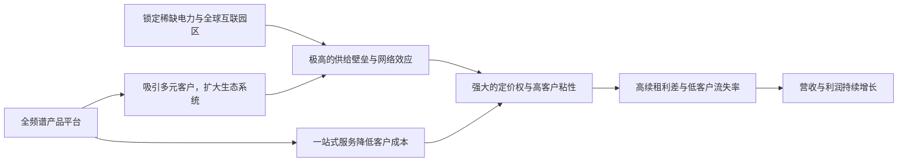

<!-- 匹配到的证券/行业：数字房地产信托(DLR.N) -->
操作成功

### 一页通 （数字房地产信托 (DLR.N)）
日期：2026-08-05
内容："""
## 公司概况

数字房地产信托（Digital Realty Trust, Inc.）是全球最大的云及运营商中立数据中心解决方案提供商之一，业务覆盖主机托管（Colocation）、互联（Interconnection）及超大规模（Hyperscale）定制化数据中心。公司采用房地产投资信托（REIT）架构运营，通过其运营合伙企业持有并运营资产。截至2026年6月30日，公司在全球六大洲超过55个都会区运营超过300座数据中心，服务逾6000家客户，横跨云计算、信息技术、社交媒体、金融、制造及能源等多个垂直行业。  

## 公司近况跟踪

- <strong>业绩超预期并再度上调全年指引</strong>：2026年第二季度，公司实现总营收19.24亿美元，同比增长29%；调整后EBITDA为9.78亿美元，同比增长19%。剔除一次性附带权益收入（promote income）后，核心每股FFO达到2.13美元，同比增长14%，超出市场一致预期。基于强劲的业绩和对未来的信心，管理层将2026年全年核心每股FFO指引上调至8.15至8.20美元，中点上调后隐含约11%的同比增长。  
- <strong>租赁活动创纪录，积压订单激增</strong>：第二季度新签租赁年化租金（含合资企业，100%份额）达3.07亿美元，其中DLR份额为2.08亿美元。0-1兆瓦及互联业务订单额达到创纪录的1.08亿美元，连续第三个季度刷新纪录。季末，已签未启动的积压订单总额（100%份额）达到创纪录的19亿美元（DLR份额为14亿美元），较年初增长75%。7月初，公司又签署了两份超大规模租赁，年化租金达4.1亿美元（100%份额），未被计入二季度积压订单。 
- <strong>续租租金利差显著扩大</strong>：第二季度续租表现强劲，签署了超过2.61亿美元的续租合同，整体现金释放利差高达25.4%。其中，大于1兆瓦类别的现金利差达到66.7%，主要由新加坡和北弗吉尼亚市场的供需失衡驱动。管理层因此将2026年全年现金续租利差指引大幅上调250个基点至9%-11%。 
- <strong>战略交易密集推进，扩张增长跑道</strong>：公司完成了对黑石集团（Blackstone）在北弗吉尼亚州三个超大规模数据中心合资企业中64%权益的收购，交易对价包括12亿美元现金和约23亿美元的DLR普通股。同时，公司宣布进入堪萨斯城市场，已锁定600兆瓦公用事业电力，预计2028年初开始交付，长期电力跑道可达2吉瓦。此外，公司还宣布将100%收购资产管理平台Columbia Capital，此举将增加超过90亿美元的基金承诺，显著扩大其私募资本业务。  
- <strong>开发管线大幅扩容</strong>：截至季末，公司在建容量达1.4吉瓦，总开发成本约200亿美元，上半年增幅达100%。若包含7月新签的超大规模租赁，管线预租率达63%，平均预期稳定收益率为11.5%。为支持增长，公司将2026年开发资本开支指引上调7.5亿美元至42.5亿至47.5亿美元。  

## 短期逻辑

1. <strong>积压订单加速转化为收入，业绩高增确定性强化</strong>：截至2026年第二季度末，公司已签未启动的积压订单（DLR份额）高达14亿美元，约占存量数据中心租金收入的30%。管理层给出了明确的收入确认时间表：2026年下半年将有6.35亿美元年化租金开始确认，2027年将有4.8亿美元开始确认。这一高可见度的收入管道为未来几个季度的业绩提供了强有力的支撑，有望持续驱动营收和FFO超预期增长。随着这些高利润率租约的逐步启动，公司有望在2026年下半年和2027年实现加速增长。 

2. <strong>供需失衡驱动定价权显著提升，续租利差成为利润超预期的主要来源</strong>：全球核心数据中心市场正面临严重的供需失衡。以北美为例，CBRE报告显示，尽管库存同比增长33%，但空置率却降至历史最低点，北弗吉尼亚州空置率仅为0.3%。在此背景下，DLR的定价权显著增强。第二季度大于1兆瓦租约的现金续租利差高达66.7%，管理层因此将全年现金续租利差指引大幅上调至9%-11%。未来几年，随着大量低于市场价的租约到期（例如2028年到期的租约租金约为130美元/千瓦，而近期新签租金约为180美元/千瓦），续租的“市场化定价”机会将持续释放，为利润增长提供超预期的动力。 

3. <strong>堪萨斯城新市场启动，打开中长期成长想象空间</strong>：公司宣布进入堪萨斯城市场，已锁定600兆瓦的公用事业电力，将于2028年初开始逐步交付，长期电力跑道可达2吉瓦。该市场具备低延迟连接（至美国50%以上人口的延迟低于10毫秒）、中心区位及充足电力供应等优势，正迅速成为AI和云工作负载的重要枢纽。这一布局标志着公司开始将业务版图从传统核心市场向外扩张，以捕捉更广泛的AI需求。尽管收入贡献尚需时日，但该项目的启动有望在短期内提升市场对公司长期增长跑道和可寻址市场规模的预期，从而对估值形成支撑。 

## 长期逻辑

1. <strong>AI驱动的数据中心需求结构性增长，公司作为核心基础设施提供商将持续受益</strong>：AI正从训练阶段向推理阶段过渡，并逐步渗透至企业级应用和消费端。国际能源署（IEA）预测，到2030年，全球数据中心用电量将增至约950太瓦时，其中AI相关设施的电力消耗将增长两倍。这一长期、结构性的需求增长为DLR提供了广阔的市场空间。公司凭借其遍布全球的稀缺互联园区、已锁定的电力容量以及与超大规模客户的深厚关系，有望在未来数年持续获取市场份额，将行业顺风转化为持续的盈利增长。管理层已明确表示，预计未来多年将实现双位数的核心每股FFO增长。 

2. <strong>“土地+电力”构筑稀缺性护城河，私募资本模式放大增长能力</strong>：在全球主要市场获取充足的电力供应已成为数据中心行业最大的进入壁垒。DLR通过前瞻性的土地收购和与公用事业公司的紧密合作，锁定了总计9吉瓦的未来增长跑道，其中近期（2027-2028年交付）正与客户积极洽谈的容量约1.5吉瓦。这种对稀缺资源的掌控构成了强大的结构性护城河。同时，公司通过设立基金（如32.5亿美元的美国超大规模数据中心基金）和收购Columbia Capital等举措，大力发展私募资本业务。这不仅为公司提供了表外融资渠道以支持资本密集型增长，还创造了持续增长的管理费收入，优化了资本回报率。 

3. <strong>平台化战略深化客户粘性，互联生态价值持续提升</strong>：DLR正通过PlatformDIGITAL®平台，将业务从单纯的“空间和电力”提供商向“互联生态”平台升级。其0-1兆瓦及互联业务已连续三个季度创下订单记录，互联业务订单同比增长18%。随着AI推理和代理AI（Agentic AI）的发展，数据需要在网络边缘、云平台和终端用户之间高效流动，这使得高互联性的数据中心变得愈发重要。DLR在全球拥有超过6000家客户和约6000家云、网络及服务提供商构成的生态系统，这种网络效应一旦形成便极难复制。随着客户在平台上的部署越多，其转换成本越高，从而带来更高的客户留存率和定价能力。 

## 风险提示

- <strong>客户集中度风险</strong>：尽管公司客户基础广泛，但其前五大客户约占年化租金收入的33%。超大规模业务尤其依赖于少数几家大型云服务提供商和科技巨头。如果其中任何一家大幅削减资本开支、改变采购策略（如转向自建）或因财务压力而违约，将对公司的租赁业务和开发管线产生重大不利影响。公司虽在纪要中强调其超大规模客户均为投资级且业务多元，但集中度风险依然存在。 
- <strong>电力供应与开发执行风险</strong>：公司的长期增长高度依赖于能否按时、按预算获取电力并完成项目建设。全球供应链紧张、熟练劳动力短缺、社区反对（NIMBYism）以及公用事业电力交付延迟等因素，都可能导致项目延期、成本超支，从而侵蚀开发收益率。尽管公司凭借其规模和经验在应对这些挑战方面具备优势，但任何重大的执行失误都可能影响其增长轨迹和财务表现。 
- <strong>利率与汇率风险</strong>：作为资本密集型的REIT，公司依赖外部融资（债务和股权）来支持其大规模的开发计划。当前利率环境仍处高位，公司新发长期债务的定价指引在4.5%至5.5%之间，远高于其存量债务2.85%的平均成本。未来若利率持续高企或进一步上升，将增加公司的融资成本，压缩利润空间。此外，公司有超过40%的收入来自美国以外地区，汇率波动可能对其报告的财务业绩产生显著影响。 

## 近期要闻

- <strong>2026年5月</strong>：公司宣布与黑石集团达成协议，以约35亿美元的总对价（包括12亿美元现金和约23亿美元的DLR普通股）收购后者在双方合资企业中64%的权益。该合资企业持有位于北弗吉尼亚州的三座完全租赁的超大规模数据中心，合计IT容量288兆瓦。  
- <strong>2026年6月</strong>：公司宣布签订协议，将100%收购资产管理平台Columbia Capital，该平台在数字基础设施领域管理着超过90亿美元的基金承诺。此交易旨在显著扩大公司的私募资本业务，并增加机构投资者关系网络。 
- <strong>2026年7月</strong>：公司宣布在第二季度财报之外，又签署了两份新的超大规模租赁协议，年化租金总额达4.1亿美元（100%份额），进一步扩大了本已创纪录的积压订单。 

## 未来催化

- <strong>2026年8月至10月</strong>：公司预计将在下半年完成对Teraco剩余16%权益的收购（以约6.5亿美元DLR普通股支付）以及对Columbia Capital的收购（以约4.85亿美元支付）。这些交易的完成将增厚公司盈利，并可能成为股价的正面催化剂。 
- <strong>2026年下半年</strong>：公司预计将有6.35亿美元的年化租金开始确认收入，其中45%在第三季度，55%在第四季度。大规模的租赁启动将直接转化为收入和利润的快速增长，是未来两个季度最直接的业绩催化剂。 
- <strong>2026年第三季度</strong>：堪萨斯城新项目预计将在下半年开工建设。关于该项目的更多细节，如客户签约情况、具体投资回报预期等，可能成为市场关注焦点，并影响对公司长期增长前景的评估。 

## 公司业务模式及拆分

### 业务边际变化

公司近年业务重心从传统上偏重超大规模批发租赁，转向更为均衡的“全频谱”产品策略，在巩固超大规模业务的同时，大力发展零售型主机托管与互联业务。这一转变已取得显著成效，0-1兆瓦及互联业务订单额连续三个季度创下纪录，2026年第二季度首次突破1亿美元大关。同时，公司正通过收购Columbia Capital，将战略私募资本业务打造为第三大增长支柱，以管理费和附带权益的形式创造新的收入来源，并拓宽融资渠道。 

### 盈利模式

公司核心盈利模式是通过在全球核心市场拥有、开发和运营数据中心，向客户出租“空间、电力及冷却能力”，并在此基础上提供高附加值的互联服务。其盈利来源主要包括：1）<strong>长期租赁收入</strong>：与超大规模及大型企业客户签订5-10年以上的租约，提供稳定且可预测的现金流；2）<strong>零售型主机托管与互联收入</strong>：为0-1兆瓦客户提供灵活的部署方案和连接服务，此类业务租金单价更高，客户粘性更强；3）<strong>费用收入</strong>：通过为合资企业和基金提供资产管理、开发和建设服务，获取经常性的管理费和一次性的附带权益收入。公司赚取的是基于稀缺资产和互联生态的“基础设施服务费”及“品牌溢价”。 

### 业务拆分

公司业务主要按客户部署规模划分为两大类：0-1兆瓦（零售型主机托管与互联）和大于1兆瓦（超大规模与批发）。近年来，公司持续加大对0-1兆瓦业务的投入，该业务已成为重要的增长引擎，其占总租赁预订的比例和收入贡献均在提升。公司目前处于<strong>业绩兑现期</strong>，前期大规模的开发投资正逐步转化为租赁收入和利润，积压订单的释放和强劲的续租定价为未来增长提供了高可见度。 

<strong>细分业务拆分</strong>

*注：公司未按0-1MW和>1MW口径分别披露历史收入及毛利率，下表基于公开披露的总量数据。*

| 项目 (单位：百万美元) | FY2023 | FY2024 | FY2025 | 1H2026 |
| :--- | :--- | :--- | :--- | :--- |
| <strong>截止日期</strong> | 2023-12-31 | 2024-12-31 | 2025-12-31 | 2026-06-30 |
| <strong>租赁及相关服务收入</strong> | 5,430.17 | 5,482.47 | 5,968.92 | 3,274.86 |
| 同比 | - | 0.96% | 8.87% | 15.14% |
| 占总营收比例 | 99.14% | 98.70% | 97.65% | 92.01% |
| <strong>费用收入及其他</strong> | 46.89 | 72.50 | 143.77 | 284.35 |
| 同比 | - | 54.62% | 98.32% | 402.69% |
| 占总营收比例 | 0.86% | 1.30% | 2.35% | 7.99% |
| <strong>总营收</strong> | <strong>5,477.06</strong> | <strong>5,554.97</strong> | <strong>6,112.69</strong> | <strong>3,559.21</strong> |
| 同比 | - | 1.42% | 10.04% | 22.70% |
| <strong>总营业支出</strong> | 4,952.60 | 5,083.10 | 5,454.20 | 2,833.02 |
| <strong>营业利润</strong> | 524.46 | 471.87 | 658.49 | 726.19 |
| 营业利润率 | 9.58% | 8.49% | 10.77% | 20.40% |

<strong>租赁及相关服务收入</strong>：这是公司的核心收入来源，2026年上半年实现收入32.75亿美元，同比增长15.14%。增长主要得益于：1）前期开发项目的完工和租赁启动；2）强劲的续租租金利差；3）0-1兆瓦及互联业务的创纪录增长。该业务的增长是公司整体业绩的核心驱动力。 

<strong>费用收入及其他</strong>：2026年上半年实现收入2.84亿美元，同比增长402.69%。该科目的爆发式增长主要源于第二季度确认了约2亿美元的附带权益收入，这与公司收购黑石集团在合资企业中的权益有关。剔除该一次性项目后，经常性费用收入约为每季度4500万美元，主要由资产管理费和开发管理费构成，随着私募资本业务的扩张，这部分收入有望持续增长。  

## 核心竞争力

<strong>竞争要素 1：依托稀缺电力资源与全球互联园区形成的结构性护城河</strong>

-   <strong>护城河定性</strong>：构成了<strong>结构性护城河</strong>。在全球核心数据中心市场，获取充足的电力供应已成为最大的进入壁垒。DLR通过多年积累，在全球55个都会区锁定了总计9吉瓦的未来增长跑道，并与当地公用事业公司建立了紧密的合作关系。同时，其全球超过300座数据中心形成的互联园区，聚集了超过6000家客户和约6000家服务提供商，产生了强大的网络效应。这种对稀缺物理资源和网络生态的双重掌控，是竞争对手难以在短期内复制的。 
-   <strong>数据验证</strong>：截至2026年第二季度，公司在建容量达1.4吉瓦，总开发成本约200亿美元，预租率达63%。在电力最紧张的北弗吉尼亚市场，行业空置率仅为0.3%，而DLR在该市场拥有最大的容量储备之一。其0-1兆瓦及互联业务订单连续三个季度创纪录，互联业务订单同比增长18%，证明了其生态系统的吸引力。  
-   <strong>动态演变</strong>：<strong>护城河变宽（巩固）</strong>。随着AI需求的爆发，对电力和低延迟互联的需求更加迫切，这使得DLR已锁定的电力和园区资产价值进一步凸显。公司通过收购Columbia Capital，进一步增强了其获取和部署资本以抢占稀缺资源的能力，从而巩固并扩大了其竞争优势。 

<strong>竞争要素 2：全频谱产品平台带来的高客户粘性与定价权</strong>

-   <strong>护城河定性</strong>：构成了<strong>结构性护城河</strong>。DLR的PlatformDIGITAL®平台能够为从单一机柜到数百兆瓦的所有规模客户提供一致的全球部署体验，并集成互联服务。这种“一站式”解决方案极大地降低了客户的交易成本和运营复杂性。一旦客户在一个互联园区内部署，其与园区内其他网络、云和SaaS提供商的连接便形成了深度绑定，转换成本极高。这种粘性赋予了公司强大的定价权，尤其是在续租谈判中。 
-   <strong>数据验证</strong>：第二季度续租表现提供了有力证据，整体现金释放利差高达25.4%，其中大于1兆瓦类别达到66.7%。公司前20大客户的加权平均租期约为6.1年，显示出客户的长期承诺。0-1兆瓦类别中，AI相关订单贡献了约20%，表明新锐的AI企业也正被吸引进入其生态系统。 
-   <strong>动态演变</strong>：<strong>护城河变宽（巩固）</strong>。随着AI推理和代理AI的发展，数据需要在网络边缘、云平台和终端用户之间高效流动，这使得高互联性的数据中心变得愈发重要。DLR的平台战略恰好契合了这一趋势，其作为“数据交汇中心”的价值将持续提升，从而进一步增强客户粘性和定价权。 

<strong>现阶段核心驱动力总结</strong>：
公司的Alpha来源于其在全球核心市场对稀缺电力和互联生态的掌控，以及由此带来的强大定价能力。其Beta则与云计算和AI基础设施的整体资本开支周期紧密相关。当前，AI驱动的需求爆发为Beta提供了强劲顺风，而公司自身的战略执行（如平台化、私募资本扩张）则持续强化其Alpha。 

<strong>竞争格局传导逻辑图</strong>：

## 产销链

- <strong>客户情况</strong>：公司客户群高度多元化，超过6000家，覆盖云计算、IT服务、社交媒体、金融、制造等多个行业。然而，收入集中度较高，前五大客户约占年化租金收入的33%，前20大客户约占51%。最大客户（微软）占比约11.6%，第二大客户（甲骨文）占比约9.0%。这种对超大规模客户的依赖是潜在风险，但公司通过签订5-15年的长期租约来锁定未来现金流。新客户拓展方面，公司季度新增客户约130-150家，渠道销售贡献了近40%的订单，显示出其市场拓展能力。  
- <strong>供应商情况</strong>：公司的核心供应商包括公用事业公司（电力）、建筑承包商、以及冷却和电气设备制造商。电力成本是最大的运营支出项，但约90%的公用事业费用可通过合同条款直接转嫁给客户，有效对冲了能源价格波动风险。在建筑和供应链方面，公司面临熟练劳动力短缺和设备供应紧张等挑战，但凭借其超过20年的行业经验和规模优势，能够通过与全球供应商的战略合作关系来管理成本和交付时间。 
- <strong>经销商情况</strong>：公司采用直销模式，未通过经销商网络进行销售。 
- <strong>成本传导能力</strong>：公司具备较强的成本传导能力。对于占运营成本大头的电力费用，大部分合同允许直接向客户报销。对于其他运营成本和资本成本，公司通过新签和续租租约中的价格调整条款（通常为3%或更高，或与CPI挂钩）来转嫁通胀压力。公司赚取的是基于稀缺资产和互联生态的“基础设施服务费”及“品牌溢价”，而非单纯的“加工费”。  

## 财务数据

| 项目 (单位：百万美元) | FY2023 | FY2024 | FY2025 | 1H2026 |
| :--- | :--- | :--- | :--- | :--- |
| <strong>截止日期</strong> | 2023-12-31 | 2024-12-31 | 2025-12-31 | 2026-06-30 |
| 营业总收入 | 5,477.06 | 5,554.97 | 6,112.69 | 3,559.21 |
| 同比 | 16.74% | 1.42% | 10.04% | 22.70% |
| 营业总支出 | 4,952.60 | 5,083.10 | 5,454.20 | 2,833.02 |
| 营业利润 | 524.46 | 471.87 | 658.49 | 726.19 |
| 营业利润率 | 9.58% | 8.49% | 10.77% | 20.40% |
| 归母净利润 | 908.11 | 561.77 | 1,267.87 | 612.20 |
| 同比 | 169.50% | -38.14% | 125.69% | -45.43% |
| 稀释每股收益（美元） | 2.88 | 1.61 | 3.58 | 1.68 |
| 经营活动现金流净额 | 1,634.78 | 2,261.48 | 2,412.14 | 1,595.23 |
| 投资活动现金流净额 | -1,115.11 | -1,906.16 | -2,230.47 | -4,246.55 |
| 筹资活动现金流净额 | 963.47 | 2,063.43 | -486.74 | 980.24 |

*注：归母净利润同比大幅波动主要受资产处置收益、减值损失等非经常性项目影响。1H2026数据为截至2026年6月30日的6个月累计数据，同比对比基数为1H2025。*

<strong>财务分析</strong>：

- <strong>成长能力</strong>：公司营收增长在2026年上半年显著加速，同比增长22.70%，主要得益于前期大规模开发项目完工后租赁的启动，以及强劲的续租租金增长。这标志着公司进入了一轮由供给交付驱动的业绩兑现期。 
- <strong>盈利能力</strong>：营业利润率从2024年的8.49%提升至2026年上半年的20.40%，显示出显著的经营杠杆效应。这主要得益于收入增长快于运营支出的增长。作为REIT，归母净利润受折旧、摊销及资产处置损益等非现金项目影响较大，波动剧烈，因此市场更关注运营现金流（FFO）指标。2026年上半年，公司核心每股FFO（剔除一次性项目）同比增长14%，反映了强劲的盈利增长势头。 
- <strong>运营能力与偿债能力</strong>：公司资产负债表健康。截至2026年第二季度末，净债务与调整后EBITDA之比为4.7倍，处于多年低位，远低于5.5倍的长期目标。固定费用覆盖倍数高达5.2倍，表明其有充足的利润来覆盖利息和优先股股息。约93%的债务为固定利率，有效管理了利率风险。  
- <strong>杜邦分析（ROE拆分）</strong>：公司2025年ROE为5.7%（归母净利润/平均股东权益），处于较低水平，这主要是由于作为REIT，其资产基础庞大且包含大量折旧，同时杠杆率相对保守。其盈利模式的核心在于产生稳定且不断增长的每股FFO，而非追求高ROE。 

## 行业及竞争分析

<strong>行业分析</strong>：
公司所处的全球数据中心行业正经历由云计算和人工智能（AI）驱动的结构性需求爆发。国际能源署（IEA）预测，到2030年，全球数据中心用电量将增至约950太瓦时，其中AI相关设施的电力消耗将增长两倍。CBRE数据显示，尽管2026年北美主要市场的数据中心库存在一年内增长了33%，但空置率却降至历史最低点，北弗吉尼亚州空置率仅为0.3%。这揭示了行业的核心矛盾：需求远超供给，而电力供应已成为限制供给扩张的最大瓶颈。在此背景下，拥有已锁定电力和可开发土地的运营商获得了强大的定价权和增长确定性。行业趋势正从传统的“空间租赁”向“高密度电力+互联生态”平台演进，AI推理和代理AI的兴起将进一步推动对低延迟、分布式互联的需求。 

<strong>竞争格局</strong>：
市场由少数几家全球性平台和众多区域性运营商构成，竞争激烈。DLR的主要竞争对手包括Equinix（EQIX）、NTT等。竞争维度主要集中在：1）全球核心市场的覆盖范围和电力获取能力；2）互联生态的广度和深度；3）服务全频谱客户需求的能力；4）资本获取能力和成本。 

<strong>可比公司</strong>：

| 公司名称 | 股票代码 | 业务模式侧重 | 全球布局 | 互联生态强度 | 估值水平 (P/AFFO, 2026E) |
| :--- | :--- | :--- | :--- | :--- | :--- |
| Digital Realty Trust | DLR | 均衡（超大规模+零售互联） | 极强（六大洲） | 强 | 约24-25x |
| Equinix | EQIX | 零售互联为主 | 强（五大洲） | 极强 | 约24-25x |
| Iron Mountain | IRM | 多元化（存储+数据中心） | 强 | 较弱 | 约21x |
| American Tower | AMT | 通信基础设施为主 | 极强 | 较弱 | 约15x |

*注：估值数据为基于市场一致预期的估算。*

<strong>总结分析</strong>：与最接近的竞争对手Equinix相比，DLR的估值倍数相近，但业务结构更为均衡，在超大规模领域拥有更强的存在感，这使其能更全面地捕捉AI基础设施投资的机会。与Iron Mountain和American Tower等多元化基础设施公司相比，DLR作为更纯粹的数据中心标的，享有更高的估值溢价，反映了市场对其更高增长前景的认可。DLR的核心竞争优势在于其全球化的互联园区平台和已锁定的巨大电力容量储备，这使其在供给受限的市场中占据了有利位置。 

## 市场焦点议题

<strong>议题一：业绩可持续性与双位数增长承诺</strong>

- <strong>背景</strong>：公司管理层在第二季度财报中明确表示，预计未来多年将实现双位数的核心每股FFO增长。这一乐观指引基于创纪录的积压订单、强劲的续租定价和庞大的开发管线。市场关注这一高增长能否持续，尤其是在2026年因一次性项目（如保险赔偿）和有利汇率而获得额外提振之后。 
- <strong>问题列表</strong>：
    - 剔除2026年的一次性项目后，2027年及以后的有机增长驱动力是否足够维持双位数增长？
    - 14亿美元的积压订单将在未来几年如何逐步转化为收入和利润？
    - 在资本开支和股份稀释增加的背景下，每股FFO的增长目标如何实现？

<strong>议题二：超大规模业务客户集中度与信用风险</strong>

- <strong>背景</strong>：DLR的前五大客户占其年化租金收入约33%，且超大规模业务通常涉及与单一客户签订巨额租赁合同。尽管这些客户多为投资级科技巨头，但市场对其资本开支的可持续性以及潜在的单点风险仍存疑虑。 
- <strong>问题列表</strong>：
    - 公司如何管理与主要超大规模客户的关系，以降低客户集中度风险？
    - 在与信用评级较弱的AI新贵（如Neocloud）合作时，公司的信用审核标准和风险控制措施是什么？
    - 如果主要超大规模客户因宏观环境或战略调整而削减资本开支，对公司已签租约和开发管线的影响有多大？

<strong>议题三：大规模资本开支的融资与执行风险</strong>

- <strong>背景</strong>：为抓住AI需求机遇，公司大幅上调了2026年开发资本开支指引至42.5亿至47.5亿美元。如此庞大的投资计划需要大量外部融资，并面临建设成本超支和工期延误的风险。 
- <strong>问题列表</strong>：
    - 公司将如何平衡债务、股权和私募资本等多种融资工具，以最低成本满足资本开支需求？
    - 当前的建设成本（约1400万美元/兆瓦）是否可持续？供应链和劳动力短缺对项目回报率的影响如何？
    - 公司如何确保9吉瓦未来增长跑道中的项目能够按时、按预算交付？

## 市场分歧探讨

<strong>核心分歧：当前的高增长是行业顺风下的周期性繁荣，还是公司结构性优势驱动的可持续增长？</strong>

- <strong>乐观方观点</strong>：认为DLR的增长具有高度可持续性。其逻辑支撑在于：1）<strong>需求的结构性</strong>：AI驱动的算力需求增长才刚开始，远未见顶，这是一个长达数年的建设周期。2）<strong>供给的稀缺性</strong>：电力和土地已成为核心市场最大的进入壁垒，DLR已锁定的9吉瓦增长跑道构成了强大的结构性护城河，使其能在更长时期内受益于供需失衡。3）<strong>模式的升级</strong>：公司正从简单的“房东”向“平台”转型，互联和私募资本业务创造了新的价值增长点和更高的客户粘性，这将驱动长期Alpha。4）<strong>业绩的高可见度</strong>：创纪录的积压订单和明确的收入确认时间表为未来2-3年的增长提供了清晰的能见度。 

- <strong>谨慎方观点</strong>：担忧当前的高增长可能部分透支了未来，并伴随高风险。其逻辑支撑在于：1）<strong>客户集中风险</strong>：过度依赖少数超大规模客户，这些客户的资本开支具有周期性，任何削减都可能导致需求“真空”。2）<strong>资本开支陷阱</strong>：为满足需求而进行的大规模资本开支，可能导致未来供给过剩，或使公司在需求放缓时背负沉重的债务和折旧负担。3）<strong>稀释效应</strong>：为融资而持续进行的股权融资（ATM发行）会稀释现有股东的权益，若增长不能持续超预期，每股价值的增长将受限。4）<strong>估值已反映乐观预期</strong>：当前股价对应的估值倍数已处于历史较高水平，若未来增长稍有放缓，可能面临“戴维斯双杀”的风险。 

<strong>总结分析</strong>：乐观方和谨慎方的分歧本质在于对行业周期位置和公司护城河深度的不同判断。从当前时点看，AI驱动的需求浪潮和核心市场电力供给的刚性约束，为乐观方提供了强有力的现实支撑。DLR已锁定的电力和土地资源，以及其不断扩大的互联生态系统，确实构成了比以往周期更坚固的壁垒。然而，谨慎方提出的风险亦不容忽视，尤其是客户集中度和资本开支的纪律性，将是决定公司能否跨越周期、实现可持续增长的关键。公司管理层在纪要中强调其超大规模客户均为投资级且业务多元，并正通过私募资本模式来管理融资压力，这些举措旨在缓解上述风险。 

## 盈利预测与估值

<strong>管理层最新指引（2026财年）</strong>：
- <strong>核心每股FFO（剔除净附带权益）</strong>：8.15 - 8.20美元
- <strong>总收入（剔除附带权益）</strong>：68.5亿 - 69.5亿美元
- <strong>调整后EBITDA</strong>：37.5亿 - 38.5亿美元
- <strong>现金续租租金利差</strong>：9.0% - 11.0%
- <strong>开发资本开支（扣除合作伙伴出资后）</strong>：42.5亿 - 47.5亿美元

<strong>机构盈利预测与估值</strong>：

| 机构 | 评级 | 目标价(美元) | 财务指标 | FY2025A | FY2026E | FY2027E | FY2028E |
| :--- | :--- | :--- | :--- | :--- | :--- | :--- | :--- |
| 摩根大通 (2026-07-24) | 超配 | 235.00 | 核心FFO/股(美元) | 7.39 | 8.72 | 9.07 | 10.05 |
| 花旗 (2026-07-24) | 买入 | 226.00 | 核心FFO/股(美元) | 7.39 | 8.15 | 9.03 | 10.06 |
| 瑞银 (2026-07-28) | 买入 | 227.00 | 核心FFO/股(美元) | 7.39 | 8.17 | 9.04 | 10.03 |
| 德意志银行 (2026-05-19) | 买入 | 220.00 | AFFO/股(美元) | 6.55 | 7.08 | 8.01 | 8.82 |
| 美银 (2026-07-30) | 中性 | 215.00 | 核心FFO/股(美元) | 7.39 | 8.19 | 8.35 | 8.41 |
| 汇丰 (2026-07-24) | 持有 | 210.00 | - | - | - | - | - |

*注：预测数据均为各机构在最新报告中的财年预测。目标价和评级截止报告发布日。*

<strong>盈利预测与估值分析</strong>：
市场对DLR的盈利预测整体偏向乐观，多数机构预计公司2026年核心每股FFO将落在管理层指引的8.15-8.20美元区间内或略高，并将在2027年和2028年延续双位数增长。估值方法上，由于REIT的净利润受折旧影响大，市场普遍采用P/FFO或P/AFFO进行估值。当前股价（约179美元）对应2026年一致预期核心每股FFO（约8.15美元）的倍数约为22倍，对应2027年一致预期（约9.0美元）的倍数约为20倍。这一估值水平低于其最接近的竞争对手Equinix，但高于传统REIT，反映了市场对其AI驱动的增长前景给予了一定的溢价，但并未过度透支。机构目标价中位数约为222美元，较当前股价有约24%的上行空间，显示出市场整体仍看好其投资价值。
"""
