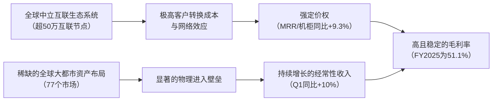

# Gangtise 公司一页通：Equinix（EQIX.O）

> 拉取日期：2026-07-30 ｜ 来源：gangtise-agent `stock-one-pager`

## 公司概况

易昆尼克斯（Equinix）是全球最大的零售型数据中心运营商，定位为全球数字基础设施公司。公司提供运营商中立的托管（Colocation）、互联（Interconnection）及边缘解决方案，其核心价值在于构建了一个汇聚超过10,500家企业、云服务商、网络服务商及AI参与者的全球性数字生态系统。截至2026年Q1，公司在全球36个国家的77个市场运营着281个数据中心，拥有超过50万个互联节点，是数字经济的核心物理枢纽。  

## 公司近况跟踪

- **Q1业绩超预期，全年指引上调**：2026年Q1公司实现营收24.44亿美元，同比增长10%（可比口径增长8%）；调整后EBITDA为12.45亿美元，同比增长17%，利润率创下51%的历史新高。基于强劲的订单积压和需求前景，管理层上调了2026年全年指引，预计营收增长10-11%，调整后EBITDA利润率约51%，AFFO每股增长9-11%。  
- **AI推理需求成为核心增长极**：管理层在2026年Q1电话会及6月NAREIT会议上强调，企业级AI应用正从试点转向规模化部署，Agentic AI工作负载对分布式、低延迟、中立互联基础设施的需求与公司核心能力高度契合。Q1约60%的大额交易与AI相关，前十大AI模型提供商中的8家及前五大Neocloud中的4家已在Equinix平台积极扩张，部署了超过110个独立网络节点。  
- **大规模产能扩张计划推进中**：公司正执行“Build Bolder”计划，目标到2030年将足迹翻倍。2026年Q1资本开支达12.56亿美元，同比增长67%，全年预计约41亿美元。同时，公司宣布与CPP Investments合作收购北欧高密度数据中心提供商atNorth，以增强在欧洲市场的布局。  
- **管理层变动**：公司于2026年3月迎来新任CFO Olivier Leonetti。2026年7月14日，公司公告服务17年的首席业务官（Chief Business Officer）Jon Lin离职，其职责将分配给现有高管团队，并计划近期任命新的首席产品官。 

## 短期逻辑

1.  **Q2财报及长期指引更新为关键催化剂**：公司将于2026年7月29日盘后公布Q2业绩。根据管理层给出的Q2指引，营收中点为25.91亿美元（同比增长14.8%），调整后EBITDA利润率中点为52.8%。市场关注点在于公司能否延续Q1的强劲预订势头（年化总预订量3.78亿美元）并实现利润率扩张。更重要的是，管理层在6月NAREIT会议上暗示，由于当前增长已超越2025年分析师日设定的长期目标，可能在Q2或Q3业绩会上调2026-2029年的长期增长指引。花旗预测，公司可能将年化收入增长目标从7-10%上调至8-11%，AFFO每股增长目标从5-9%上调至7-11%。 
2.  **AI推理货币化路径的验证**：未来一个季度，市场将密切关注AI推理需求从“主题投资”向“业绩兑现”的转化。Q1互联业务收入同比增长9%，Fabric收入同比增长26%，Fabric预订量同比增长74%，显示出AI驱动的高带宽连接需求正在加速。若Q2互联业务增速进一步提升，将直接验证公司作为AI推理受益者的逻辑，并可能触发市场对其估值体系的重塑，从传统数据中心REIT向AI基础设施平台转变。  
3.  **管理层过渡期的执行风险与机遇**：首席业务官Jon Lin的离职在短期内引发了市场对公司销售执行连续性的担忧。然而，新任CFO Olivier Leonetti在6月会议中展现出对资本配置和运营效率的清晰思路，强调优先通过债务融资支持增长、维持投资级评级，并持续推动SG&A效率提升。若Q2业绩未受管理层变动影响，将迅速消除市场疑虑，成为股价稳定的积极信号。  

## 长期逻辑

1.  **AI推理驱动的“网络效应”护城河拓宽**：公司的长期增长核心在于其全球互联生态系统的不可复制性。随着企业AI工作负载从集中式训练转向分布式推理，数据需要在多云、多模型、多地点之间进行低延迟交换。Equinix作为全球最大的中立互联枢纽，其“一对多”的连接能力（拥有超过50万个互联节点）构成了结构性壁垒。管理层指出，AI推理的部署架构与公司“靠近用户、连接一切”的价值主张高度契合，这一趋势将在未来3年持续推动客户入驻和互联业务收入增长，使公司的护城河从“物理空间租赁”向“AI生态入口”演变。  
2.  **“Build Bolder”计划下的规模与回报双击**：为抓住AI和云计算的结构性需求，公司计划到2030年将全球容量翻倍，涉及约2GW的新增容量。尽管短期资本开支强度加大（2026年预计41亿美元），但管理层强调新项目的无杠杆现金回报率仍维持在25%左右的中值区间，与历史水平一致。关键在于，通过建设更大规模的园区（支持1-5MW部署）和采用半预售模式（2026年零售扩容中约25%已预售），公司有望在2029-2030年迎来收入和自由现金流的集中释放期，实现规模效应下的回报率提升。  
3.  **xScale合资模式的资本效率优化**：针对超大规模客户（Hyperscalers）的单租户整体设施需求，公司通过xScale合资企业模式（与GIC、CPP Investments等合作）进行表外开发。该模式解决了此类业务资本密集、回报率较低（高个位数至低双位数）的痛点，同时增强了公司在电力和设备采购上的规模优势，并深化了与最大客户群的战略关系。随着xScale项目的逐步交付，其贡献的净收入将从2026年的约1100万美元增长至2030年的约1.14亿美元（伯恩斯坦预测），成为长期AFFO增长的重要补充。  

## 风险提示

- **竞争加剧与市场份额流失风险**：全球多租户数据中心市场竞争高度激烈且分散。公司近年来因建设速度落后于市场，其占全球市场供应的份额已从2020年的约8%下降至2025年的约5%。尽管“Build Bolder”计划旨在扭转这一趋势，但若执行不力或竞争对手（如Lumen等电信运营商）在互联领域推出更具吸引力的替代方案，可能导致公司定价能力减弱和增长前景受损。 
- **资本开支强度与回报不及预期风险**：公司正处于历史性的投资周期，2026年资本开支预计高达41亿美元，占营收比例超过40%。如此高强度的投资若遭遇宏观经济下行、AI需求不及预期或电力供应瓶颈，可能导致新增产能利用率不足，资产回报率下降，并对自由现金流和股息增长构成压力。伯恩斯坦指出，公司近期的投资存在“边际回报递减”的风险。 
- **技术过时与资产减值风险**：随着AI工作负载对高功率密度（单机柜可达100kW以上）和液冷技术的需求增加，公司部分老旧数据中心面临技术过时风险。尽管管理层表示超过100个数据中心已支持液冷，且通过“将合适的工作负载部署在合适的地点”来管理风险，但若技术迭代速度超预期，可能导致部分旧设施竞争力下降，甚至触发资产减值。 

## 近期要闻

- **2026年4月29日**：公司发布2026年Q1财报。营收、调整后EBITDA及AFFO均超市场预期，同时上调2026年全年业绩指引。管理层在电话会上详细阐述了AI推理需求对公司业务的驱动作用。  
- **2026年6月2-3日**：公司在NAREIT REITweek投资者大会上与花旗等机构进行会谈。新任CFO Olivier Leonetti分享了积极的业务展望，强调互联业务增长潜力、SG&A效率提升空间，并暗示可能上调长期财务目标。 
- **2026年7月14日**：公司提交8-K文件，宣布首席业务官Jon Lin离职，并将于7月18日生效。公司表示已制定过渡计划，将其职责分配给现有高管团队，并计划近期任命新的首席产品官。 

## 未来催化

- **2026年7月29日**：公司预计发布2026年Q2财报。市场将重点关注Q2业绩是否达到或超越指引，以及管理层是否会正式上调2026-2029年的长期增长和盈利目标。 
- **2026年9月-10月**：公司可能在2026年Q3财报季进一步更新“Build Bolder”计划的执行进展，包括atNorth收购的完成情况、新园区建设进度及预售情况。任何关于超大规模客户（Hyperscalers）的xScale租赁协议签署，都将成为股价的积极催化剂。 

## 公司业务模式及拆分

**业务边际变化**：公司近年正从传统的零售托管和互联服务商，向AI时代的分布式数字基础设施平台转型。核心变化在于：1）AI推理工作负载正成为新的增长驱动力，带动了高密度机柜、液冷解决方案和Fabric虚拟连接的需求；2）通过xScale合资模式切入超大规模市场，与核心零售业务形成协同；3）推出“分布式AI Hub”等新产品，简化企业对AI生态的访问。  

**盈利模式**：公司主要依靠“基础设施即服务”模式盈利，收入具有高度经常性（经常性收入占比超90%）。其盈利核心并非简单的空间租赁，而是通过构建一个全球性、中立、高互联的生态系统，产生强大的“网络效应”，从而获得高于同行的定价权和客户粘性。客户支付的溢价不仅包含空间和电力，更包含接入这个全球最大数字生态系统的价值。  

**业务拆分**：
公司业务按产品线可分为托管（Colocation）、互联（Interconnection）、托管基础设施（Managed Infrastructure）及其他。公司当前处于由AI驱动的**新一轮成长周期**，表现为互联业务增速重新加速，高密度机柜部署量显著增长。 

**细分业务拆分（单位：百万美元）**

| 业务板块 | FY2023 | FY2024 | FY2025 | FY2026 Q1 |
| :--- | :--- | :--- | :--- | :--- |
| **托管（Colocation）** | | | | |
| 收入 | - | 6,058 | 6,475 | 1,730 |
| 同比 | - | - | 7% | 12% |
| 占总营收比 | - | 69% | 70% | 71% |
| **互联（Interconnection）** | | | | |
| 收入 | - | 1,519 | 1,655 | 446 |
| 同比 | - | - | 9% | 13% |
| 占总营收比 | - | 17% | 18% | 18% |
| **托管基础设施（Managed Infra.）** | | | | |
| 收入 | - | 467 | 466 | 115 |
| 同比 | - | - | 0% | 0% |
| 占总营收比 | - | 5% | 5% | 5% |
| **其他** | | | | |
| 收入 | - | 140 | 143 | 40 |
| **经常性收入合计** | - | **8,184** | **8,739** | **2,331** |
| **非经常性收入** | - | 564 | 478 | 113 |
| **总营收** | **8,188** | **8,748** | **9,217** | **2,444** |

*注：FY2023年分业务数据未在资料中完整提供。*

**各业务板块分析（2026年Q1）**：
- **托管业务**：作为公司最大的收入来源，Q1收入17.30亿美元，同比增长12%，增速显著提升。增长主要由AI推理和云工作负载驱动的高密度机柜部署推动。Q1新签约机柜的平均功率密度达到6.6kW，同比增长36%，带动了每机柜月均经常性收入（MRR）同比增长9.3%至2,524美元。这表明公司正成功地将电力密度提升转化为定价能力。  
- **互联业务**：作为公司生态壁垒的核心，Q1收入4.46亿美元，同比增长13%，增速重新加快。增长动力来自AI生态参与者（Neoclouds、模型提供商）的入驻，它们需要高速、低延迟的连接来访问云服务商和企业客户。Fabric虚拟连接收入同比增长26%，预订量同比增长74%，显示软件定义互联正成为新的增长引擎。  
- **托管基础设施**：Q1收入1.15亿美元，同比基本持平。该业务主要为客户提供远程运维和支持服务，增长相对平稳，但在增强客户粘性方面扮演重要角色。 

## 核心竞争力

**竞争要素 1：依托极高转换成本与网络效应构筑的生态系统护城河**

- **护城河定性**：**结构性护城河**。Equinix的核心竞争力并非单个数据中心，而是其全球互联生态系统。超过10,500家客户、2,000+网络服务商和超过50万个互联节点构成了一个复杂的“一对多”网络。客户选择Equinix的根本原因是为了接入这个生态，与合作伙伴、云服务商和AI模型提供商进行低延迟数据交换。这种网络效应使得客户离开Equinix的成本极高，因为这意味着断开与整个数字生态的连接。  
- **数据验证**：公司50大客户贡献了约36%的经常性收入，客户基础高度分散，单一最大客户收入占比低于3%。超过90%的月度经常性收入预订来自现有客户，显示出极高的客户粘性。互联业务收入增速（Q1为13%）持续高于托管业务，且Fabric虚拟连接预订量同比增长74%，表明生态系统的价值在加速增长。  
- **动态演变**：**护城河变宽**。随着AI推理工作负载的爆发，企业需要在靠近用户的边缘节点访问多个AI模型和数据源，这使得Equinix作为中立互联枢纽的战略地位更加凸显。前八大AI模型提供商和四大Neocloud的入驻，正在为公司吸引更多企业客户，形成新的AI生态网络效应，进一步巩固和拓宽其护城河。  

**竞争要素 2：全球化的稀缺物理资产布局**

- **护城河定性**：**结构性护城河**。公司在全球36个国家77个大都市的核心地段拥有并运营数据中心，这些位置靠近人口、商业和光纤枢纽，而非仅仅寻求廉价电力。这种大都市内的战略位置具有稀缺性和不可复制性，新建数据中心面临土地、电力、社区许可等多重壁垒，构成了强大的先发优势和进入壁垒。  
- **数据验证**：公司宣称其全球布局可使90%的世界人口在10毫秒内触达其服务。公司控制着约3GW的开发容量土地，并已为未来五年储备了充足的土地、电力和水资源。其资产规模（281个数据中心）和全球覆盖范围远超任何竞争对手。  
- **动态演变**：**护城河巩固**。公司正通过“Build Bolder”计划，在核心大都市建设更大规模、更高密度的数据中心园区，以适应AI工作负载的需求。同时，通过收购atNorth等区域性资产，补强其在关键市场的布局。这种持续的、大规模的资本投入，进一步巩固了其物理资产的稀缺性和领先优势。  

**现阶段核心驱动力总结**：公司的Alpha在于其**不可复制的全球互联生态系统**，这使其成为AI推理时代的核心受益者。其Beta则来自于**全球数字化和AI投资周期**。公司的财务表现是这一强大竞争地位的直接体现：高客户粘性带来稳定且加速的经常性收入，互联业务的网络效应带来高于同行的定价能力和利润率。  

**竞争格局传导逻辑图**：

## 产销链

- **客户情况**：公司客户基础高度分散且多元化，涵盖云和IT服务商、网络服务商、金融、内容与数字媒体及各类企业。截至2025年底，拥有超过10,500家客户。**客户集中度风险极低**，单一最大客户收入占比低于3%，前50大客户合计贡献约36%的经常性收入。2026年Q1，公司完成了3,800笔交易，涉及3,100多个独立客户，显示出强大的客户获取能力和广泛的市场需求。新客户方面，前十大AI模型提供商中的8家已成为其客户，并正在积极扩张。  
- **供应商情况**：公司的主要“供应商”包括电力公司、房地产开发商、网络运营商和设备制造商。在电力方面，公司凭借其30年的运营历史和规模优势，与全球主要公用事业公司建立了深厚关系，2026年未因电力约束导致项目延迟。公司通过多元化供电策略（电网、天然气、绿色能源）和长期电力采购协议来管理成本和供应风险。在网络方面，公司依赖电信运营商提供连接，但双方更多是竞合关系，Equinix的生态价值使其在与运营商的合作中具备较强话语权。 
- **成本传导能力**：公司具备较强的成本传导能力。当上游成本（如电力、建设成本）上升时，公司能够通过提高机柜价格（MRR/机柜同比增长9.3%）和互联服务费用将成本转嫁给客户。这得益于其提供的服务对客户业务至关重要，且客户缺乏同等替代方案。公司赚取的是**“生态接入费”和“低延迟连接溢价”**，而非单纯的“加工费”。  

## 财务数据

**关键财务数据（单位：亿美元）**

| 项目 | FY2023 截止2023-12-31 | FY2024 截止2024-12-31 | FY2025 截止2025-12-31 | FY2026 Q1 截止2026-03-31 |
| :--- | :--- | :--- | :--- | :--- |
| **营业收入** | 81.88 | 87.48 | 92.17 | 24.44 |
| 营收同比 | 12.74% | 6.84% | 5.36% | 9.84% |
| 营业成本 | 42.28 | 44.67 | 45.08 | 11.86 |
| **毛利润** | 39.60 | 42.81 | 47.09 | 12.58 |
| **毛利率** | 48.37% | 48.93% | 51.09% | 51.47% |
| 营业开支 | 25.09 | 26.57 | 27.43 | 6.85 |
| **营业利润** | 14.51 | 16.24 | 19.66 | 5.73 |
| 归母净利润 | 9.69 | 8.15 | 13.50 | 4.15 |
| 归母净利润同比 | 37.45% | -15.89% | 65.64% | 20.99% |
| 稀释每股收益（美元） | 10.31 | 8.50 | 13.76 | 4.20 |
| 经营活动现金流净额 | 32.17 | 32.49 | 39.11 | 7.17 |
| 资本性支出 | 31.65 | 34.03 | 53.05 | 13.79 |
| **自由现金流** | 0.52 | -1.54 | -13.94 | -6.62 |

**财务分析**：
- **成长能力**：公司营收增速在FY2025触底（+5.4%）后，于FY2026 Q1强劲反弹至近10%，主要受AI和云计算需求驱动。管理层预计FY2026全年营收增长10-11%，标志着公司进入新一轮增长加速期。归母净利润在FY2024因减值等因素下滑后，FY2025大幅反弹，FY2026 Q1延续增势。  
- **盈利能力**：毛利率从FY2023的48.4%持续提升至FY2026 Q1的51.5%，显示出公司在规模扩张的同时实现了经营杠杆的改善。调整后EBITDA利润率在FY2026 Q1达到51%的历史新高，同比提升300个基点，反映了公司在成本控制和产品组合优化（高利润互联业务占比提升）方面的成效。  
- **运营与偿债能力**：公司处于大规模投资周期，资本开支强度（Capex/Revenue）从FY2023的38.7%大幅攀升至FY2026 Q1的56.4%，导致自由现金流为负。这是公司为抓住AI机遇而主动进行的战略投资。截至FY2026 Q1，公司净杠杆率（Net Debt/Adj. EBITDA）为3.8倍，处于投资级评级的合理范围内，短期偿债风险可控。  

## 行业及竞争分析

**行业分析**：公司处于全球多租户数据中心（MTDC）行业，该市场巨大且高度分散，预计有超过2,400家参与者。行业正经历由云计算和AI驱动的结构性扩张期。需求端，企业IT架构向混合云、多云和分布式AI推理演进，对第三方中立、高互联、低延迟的数据中心需求激增。供给端，受限于核心都市圈的电力、土地资源和审批壁垒，优质数据中心空间供不应求，这为现有龙头提供了强大的定价能力和扩张优势。花旗预测，AI推理的普及将加速零售型数据中心的租赁需求。  

**竞争格局**：Equinix是零售型MTDC市场的绝对领导者，其核心竞争优势在于其全球化的互联生态系统，市场份额远超同业。其主要竞争对手包括Digital Realty（DLR）、NTT等，但Equinix在互联密度和生态系统规模上保持显著领先。竞争也来自电信运营商（如Lumen）和超大规模云服务商的自建设施，但Equinix凭借其中立性和“一对多”的连接能力，与这些参与者形成了竞合关系。  

**可比公司分析**：

| 公司名称 | 股票代码 | 业务模式对比 | 竞争优势对比 |
| :--- | :--- | :--- | :--- |
| Digital Realty (DLR) | DLR | 业务更偏向超大规模和批发型托管，零售互联业务占比低于EQIX。 | 全球规模与EQIX相当，但在互联生态系统密度和网络效应上存在差距。 |
| American Tower (AMT) | AMT | 核心业务为通信铁塔，通过收购CoreSite进入数据中心互联市场。 | 在通信基础设施领域拥有垄断性资产，但在全球数据中心互联生态上与EQIX有显著差距。 |

**总结分析**：与可比公司相比，Equinix的差异化优势在于其构建的全球性、中立、高互联的数字生态系统。这一系统具有强大的网络效应，使其在吸引AI和云工作负载方面具备独特优势，其估值溢价也源于此。DLR在超大规模市场有更强布局，而AMT的优势领域在通信铁塔。EQIX的独特定位使其在AI推理驱动的分布式计算时代处于有利地位。  

## 市场焦点议题

**议题一：AI推理需求的业绩兑现能力与可持续性**

- **背景**：市场已充分认知AI训练对数据中心的需求，但对AI推理能否成为EQIX这类零售型数据中心的长期增长引擎存在分歧。乐观者认为分布式推理是EQIX的天然优势，谨慎者则担忧推理负载最终会集中在超大规模云平台。 
- **问题列表**：
  - Q1约60%的大额交易与AI相关，这一比例的持续性如何？AI相关预订的增长是由少数大客户驱动，还是已呈现广泛的企业级需求？
  - 互联业务（尤其是Fabric）的加速增长（Q1同比+26%）能否持续，并最终显著提升其在总收入中的占比？
  - 公司如何量化AI推理带来的潜在市场空间（TAM），以及其渗透率目标？

**议题二：大规模资本开支的回报率与自由现金流拐点**

- **背景**：公司正处于历史性的投资周期，资本开支强度超过40%，导致自由现金流为负。市场担忧如此高强度的投资能否维持历史水平的回报率（~25%），以及自由现金流何时能实现转正。 
- **问题列表**：
  - 公司如何确保在建设更大规模、更高密度数据中心时，仍能维持25%左右的无杠杆现金回报率？
  - 随着“Build Bolder”计划的推进，资本开支强度何时会达到峰值并开始下降？
  - 公司预计何时能实现自由现金流的显著改善并覆盖股息支出？

**议题三：管理层变动后的战略连续性与执行风险**

- **背景**：公司在短期内经历了CFO和首席业务官两位核心高管的更替，引发了市场对公司战略连续性和销售执行稳定性的担忧。 
- **问题列表**：
  - 新任CFO在资本配置策略（债务/股权融资、并购）上是否会与前任存在显著差异？
  - 首席业务官的离职是否会影响与大客户的关系及销售团队士气？过渡计划的具体安排是什么？
  - 新任命的首席产品官将如何影响公司的产品创新战略，尤其是在AI相关产品方面？

## 市场分歧探讨

**核心分歧：当前估值是否已充分反映AI增长潜力，还是仍存在预期差？**

- **看多方逻辑**：认为公司是AI推理时代的“核心基础设施”，其护城河将随着AI生态的扩张而显著拓宽。当前的高资本开支是为未来3-5年的高增长铺路，2029-2030年将迎来收入和现金流的集中释放。花旗、古根海姆等机构认为，公司有望上调长期增长指引，其基于2027年EV/EBITDA（约23.4倍）和P/AFFO（约25.4倍）的估值与高增长前景相比仍具吸引力。看多方强调，互联业务的加速增长和AI生态的快速扩张是尚未被充分定价的催化剂。  

- **看空方逻辑**：认为当前股价已透支了AI预期。公司P/AFFO倍数（约25.4倍）显著高于其历史均值（约23.3倍）和行业 peers（约18.8倍），而AFFO增速指引（+9-11%）并未相应大幅提升。看空方担忧大规模资本开支将长期压制自由现金流，且AI推理需求若不及预期，或竞争加剧导致回报率下降，当前估值将面临较大的下行风险。部分观点认为，公司市场份额近年有所下滑，其增长故事更多是行业Beta而非个体Alpha。  

- **综合分析**：分歧的本质在于对AI推理商业化的节奏和公司护城河宽度的判断不同。看多方的逻辑更侧重于长期结构性变化，而看空方则更关注短期估值和财务指标。公司的优势在于其生态系统的独特性和AI趋势的确定性，但风险在于战略执行和资本开支纪律。若公司能在未来几个季度持续兑现互联业务的高增长，并成功上调长期指引，将有效证伪看空逻辑，推动估值中枢上移。 

## 盈利预测与估值

**券商盈利预测与估值**

| 机构 | 评级 | 目标价(美元) | 财务指标 | FY2025A | FY2026E | FY2027E | FY2028E |
| :--- | :--- | :--- | :--- | :--- | :--- | :--- | :--- |
| 花旗 (2026-06-29) | 买入 | 1,260 | 营收(百万美元) | 9,217 | 10,216 | 11,080 | 12,146 |
| | | | AFFO/股(美元) | 38.33 | 43.24 | 47.40 | 52.72 |
| 古根海姆 (2026-05-20) | 买入 | 1,235 | 营收(百万美元) | 9,217 | 10,483 | 11,775 | 12,920 |
| | | | AFFO/股(美元) | 38.33 | 44.14 | 48.64 | 52.73 |
| 伯恩斯坦 (2026-03-10) | 跑赢大盘 | 1,128 | 营收(百万美元) | 9,217 | 10,220 | 10,944 | 12,047 |
| | | | AFFO/股(美元) | 38.42 | 41.89 | 44.92 | 49.12 |
| 瑞银 (2026-02-13) | 买入 | 1,010 | 营收(百万美元) | 9,217 | 10,181 | - | - |
| | | | AFFO/股(美元) | 38.33 | 42.45 | 45.83 | 49.38 |

**盈利预期与估值分析**：主流券商对公司的评级均为“买入”，显示出市场对公司基本面的广泛看好。对FY2026的AFFO/股预测集中在42-44美元区间，观点较为一致。估值方法上，由于公司作为REIT，折旧摊销等非现金费用较高，市场普遍采用**P/AFFO**和**EV/EBITDA**作为核心估值指标。花旗和古根海姆的目标价基于2027年约25-28倍P/AFFO或23-26倍EV/EBITDA，反映了对公司进入新一轮增长周期的预期。伯恩斯坦的估值相对保守，其目标价基于25倍2027年AFFO/股，更侧重于公司长期产能释放后的价值。    

**管理层最新指引**：公司上调后的FY2026全年指引为：营收101.4-102.4亿美元（同比增长10-11%），调整后EBITDA为51.7-52.5亿美元（利润率约51%），AFFO为42.0-42.8亿美元（同比增长12-14%），AFFO/股为42.31-43.11美元（同比增长9-11%）。
