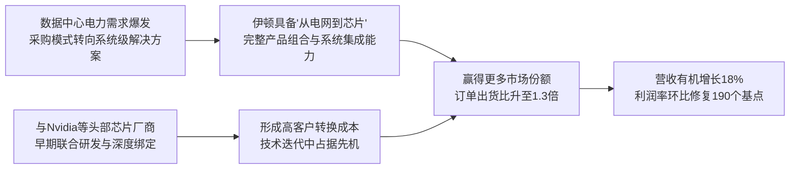

<!-- 匹配到的证券/行业：伊顿(ETN.N) -->
操作成功

### 一页通 （伊顿 (ETN.N)）
日期：2026-08-05
内容："""
## 公司概况

伊顿是一家全球领先的智能动力管理公司，核心业务围绕电气化、数字化及能源转型展开。公司产品覆盖数据中心、公用事业、工业、商业建筑、住宅、航空航天及车辆等多个终端市场，致力于提供从电网到芯片（Grid-to-Chip）的全链条电力解决方案。2025年公司营收274.48亿美元，服务全球180个国家的客户。近年来，伊顿正经历一场重大的投资组合转型，通过大规模并购强化数据中心与航空航天业务，同时剥离增长较慢的车辆/移动出行业务，以聚焦更高增长、更高利润的领域。  

## 公司近况跟踪

- <strong>2Q26业绩全面超预期，利润率修复启动</strong>：公司2Q26实现营收85.31亿美元，同比增长21%，有机增长14%，均显著高于市场预期。调整后每股收益3.15美元，超出指引中值0.10美元。核心电气美洲业务利润率环比提升190个基点至27.5%，标志着市场最为关注的利润率修复已经开始兑现。管理层澄清，二季度IRA退款影响低于300万美元，对业绩的贡献可忽略不计，超预期部分全部来自运营改善。  
- <strong>电气全球业务增长加速，Boyd液冷贡献超预期</strong>：电气全球业务2Q26有机增长18%，其中数据中心有机收入增速高达65%，远超23%的市场平均水平，显示份额持续提升。新收购的Boyd液冷业务在并表后的首个完整季度实现收入4.32亿美元，超出公司内部预期20%，全年收入指引上调至18亿美元。  
- <strong>订单与积压订单持续创纪录，需求广泛且强劲</strong>：电气美洲滚动12个月订单有机增长41%，订单出货比升至1.3倍；电气全球滚动12个月订单有机增长33%，总积压订单同比增长103%。除数据中心外，机器OEM、商业与机构、公用事业等终端市场均实现两位数增长，显示增长动力广泛。  
- <strong>全年有机增长与盈利指引上调</strong>：基于强劲的上半年表现和持续旺盛的需求，公司将2026年全年有机增长指引中值上调200个基点至12%，调整后每股收益中值上调0.22美元至13.50美元。电气美洲和电气全球的全年有机增长指引分别上调至15%和12%。  
- <strong>移动出行业务剥离方案确定</strong>：公司于6月宣布将通过反向莫里斯信托交易，将移动出行业务与Dana公司合并，预计于2027年一季度完成。此举旨在进一步聚焦高增长、高利润的电气和航空航天业务。  

## 短期逻辑

1. <strong>电气美洲利润率修复路径清晰，构成未来两个季度最核心的交易锚点</strong>：1Q26电气美洲利润率因产能爬坡初期投入和原材料成本滞后传导，同比大幅下滑440个基点至25.6%，一度引发市场对盈利能力的担忧。2Q26利润率已环比修复190个基点至27.5%。管理层在业绩会上给出了量化的下半年修复路径：从上半年到下半年，利润率将提升450至500个基点，其中300个基点来自已实施的提价措施对成本滞后影响的消除，150至200个基点来自产量提升和生产率改善。这一指引意味着4Q26电气美洲利润率将重回30%以上，为2027年的盈利弹性奠定坚实基础。若该路径如期兑现，将有效打消市场对“利润率能否回归”的核心疑虑，驱动估值修复。  

2. <strong>Boyd液冷业务持续超预期，打开数据中心“白区”价值增量空间</strong>：伊顿于2026年3月完成对Boyd Thermal的收购，正式切入数据中心液冷赛道。Boyd在并表后的首个完整季度即实现4.32亿美元收入，超出公司内部预期20%，全年收入指引从17亿美元上调至18亿美元。Boyd的竞争优势在于：是多家头部芯片厂商的设计合作伙伴，能优先获得合作机会；在冷板和CDU领域具备市场领先的规模化交付能力；其团队源自航空航天领域，具备高可靠性的质量基因。随着Nvidia Rubin等下一代高功率芯片平台在2026年下半年逐步放量，液冷需求将进入爆发期，Boyd有望持续贡献超预期业绩。  

3. <strong>电气全球业务增长加速，成为新的超预期变量</strong>：电气全球业务2Q26有机增长18%，远超市场预期的约8%。所有区域（EMEA、APAC）均实现约20%的增长，数据中心有机收入增速高达65%，机器OEM增长超20%。公司已将电气全球全年有机增长指引从7.5%大幅上调至12%。这一加速趋势若持续，将改变市场对伊顿“增长主要依赖美洲”的固有认知，打开估值上行空间。  

## 长期逻辑

1. <strong>数据中心电力基础设施的超级周期，提供至少5年以上的高确定性增长跑道</strong>：据公司披露，美国数据中心总积压订单已增长至307GW，按2025年建设速度计算，相当于15年的积压量，其中大部分项目预计在2028年及以后交付。公司预计2026年整体终端市场增长约10%，数据中心及分布式IT维持强劲的两位数增长。这一需求体量和持续性，为伊顿的电气业务提供了远超传统经济周期的增长动力。公司每兆瓦数据中心电力内容价值约340万美元，随着向800V直流架构演进，单瓦价值量有望进一步提升。  

2. <strong>“从电网到芯片”的全栈能力，构筑难以复制的系统级竞争壁垒</strong>：伊顿通过有机投资和并购（Fiberbond、Resilient Power、Boyd），已构建起覆盖中压配电、固态变压器（SST）、直流断路器、UPS电力电子、液冷（冷板与CDU）以及模块化预制解决方案的完整产品组合。管理层指出，在向800V直流架构转型的过程中，需要同时具备中压固态变压器、直流断路器技术、电力电子与电能质量、冷却技术四大核心技术模块，以及强大的服务网络。伊顿是目前唯一具备这一全系列能力的供应商。这种系统级交付能力显著提高了客户的转换成本，并扩大了公司在单个项目中的钱包份额。  

3. <strong>投资组合转型提升长期盈利质量与估值中枢</strong>：公司正在执行一项重大的投资组合重塑：通过约120亿美元的并购（Boyd、Fiberbond、Ultra PCS、Resilient），将业务重心进一步向数据中心和航空航天等高增长、高利润领域倾斜；同时剥离增长缓慢、利润率较低且周期波动大的移动出行业务。据机构测算，转型完成后，公司约70%的销售额将来自长期增长型终端市场，数据中心收入占比将提升至约30%。这一转型将提升公司整体收入增速与利润率中枢，降低周期波动性，从而支撑更高的估值倍数。   

## 风险提示

- <strong>利润率修复不及预期的风险</strong>：电气美洲下半年利润率修复路径高度依赖提价对成本滞后影响的消除，以及新增产能的产量爬坡和生产率提升。若原材料成本进一步上涨，或新工厂工人熟练度提升速度慢于预期，可能导致利润率修复幅度不及指引，进而影响2027年的盈利预期。 
- <strong>数据中心资本开支增速放缓的风险</strong>：公司当前的高增长和高估值很大程度上建立在数据中心电力基础设施需求持续高增的预期之上。若宏观经济下行、AI投资回报率不及预期，或技术路径变化导致超大规模云服务商削减资本开支，将对公司订单和收入增速产生重大影响。 
- <strong>巨额并购后的整合与杠杆风险</strong>：公司在过去一年内完成了约120亿美元的并购，净债务大幅上升。尽管公司已暂停2026年的股份回购以优先去杠杆，但若Boyd等被收购业务的整合不及预期，或协同效应未能如期兑现，将对公司财务状况和股东回报产生负面影响。 

## 近期要闻

- <strong>2026年6月10日</strong>：伊顿宣布与Dana Incorporated达成最终协议，将通过反向莫里斯信托交易，将移动出行业务分离并与Dana合并。交易预计于2027年一季度完成，伊顿股东将持有合并后公司至少50.1%的股份，伊顿将获得约11亿美元的现金分配。  
- <strong>2026年7月31日</strong>：伊顿公布2Q26业绩，营收与利润均超市场预期。公司上调全年有机增长指引至11%-13%，调整后每股收益指引至13.40-13.60美元。电气美洲利润率环比显著修复，Boyd液冷业务收入超预期。股价在业绩公布后上涨7.32%。  

## 未来催化

- <strong>2026年8月-9月</strong>：公司提价措施（已于二季度和八月初实施）的效果将逐步在财务报表中体现，市场将密切关注电气美洲月度/季度的利润率改善节奏，以验证下半年利润率修复指引的可实现性。 
- <strong>2026年10月-11月</strong>：3Q26业绩发布。若电气美洲利润率能如期实现环比250个基点的提升，将进一步增强市场对2027年盈利弹性的信心。同时，Boyd液冷业务的订单和收入趋势将是另一重要关注点。 
- <strong>2027年一季度</strong>：移动出行业务剥离交易预计完成。交易完成后，伊顿将获得约11亿美元现金，用于偿还债务，改善资产负债表。同时，剩余业务将呈现更高的收入增速和利润率，有望触发市场的估值重评。  

## 公司业务模式及拆分

### 业务边际变化

伊顿正经历近二十年来最大规模的投资组合转型。公司战略性地将资本和资源集中于电气化和航空航天两大长期增长领域。过去一年，公司投入约120亿美元进行并购，其中约90%的资金用于数据中心领域（Boyd Thermal液冷、Fiberbond模块化电力外壳、Resilient Power固态变压器），以构建从电网到芯片的完整电力解决方案。同时，公司于2026年1月宣布，并于6月确定方案，将剥离增长较慢、利润率较低的移动出行业务（车辆与车辆电气化）。这一“进”与“出”的组合拳，旨在提升公司整体的增长速度和盈利质量。   

### 盈利模式

伊顿的盈利模式正从传统的“产品制造商”向“系统解决方案提供商”演进。其核心盈利来源包括：1）依托在配电、电能质量、液冷等领域的技术领先性和完整产品组合，为客户提供高附加值的系统级解决方案，获取高于单一产品的溢价和钱包份额；2）通过深度绑定数据中心、航空航天等终端市场的头部客户，形成较高的转换成本和重复采购需求；3）利用全球化的制造和服务网络，实现规模效应和本地化服务优势。  

### 业务拆分

公司业务自1Q26起重新划分为四大板块：电气美洲、电气全球、航空航天、移动出行（车辆与车辆电气化合并）。电气业务（美洲+全球）是公司的绝对核心，2025年收入占比约73%，且增速最快、利润率最高。航空航天业务是第二大板块，受益于全球航空业的复苏和国防开支增长，增长稳健。移动出行业务收入占比约11%，增长和利润率均低于公司平均水平，已宣布将被剥离。公司当前处于产能爬坡和投资组合转型的业绩兑现期。  

<strong>细分业务拆分（单位：亿美元）</strong>

| 业务板块 | 2023年收入 | 2024年收入 | 2025年收入 | 1H26收入 | 2025年收入占比 | 2025年营业利润率 | 1H26营业利润率 |
|---|---|---|---|---|---|---|---|
| 电气美洲 | 100.98 | 114.36 | 132.76 | 75.51 | 48% | 29.9% | 26.6% |
| 电气全球 | 60.84 | 62.48 | 68.15 | 44.63 | 25% | 19.4% | 19.6% |
| 航空航天 | 34.13 | 37.44 | 42.49 | 23.62 | 16% | 23.9% | 24.7% |
| 移动出行 | 36.02 | 34.52 | 31.09 | 16.07 | 11% | 13.1% | 12.3% |
| <strong>总计</strong> | <strong>231.96</strong> | <strong>248.78</strong> | <strong>274.48</strong> | <strong>159.82</strong> | <strong>100%</strong> | <strong>24.5%</strong> | <strong>22.9%</strong> |

*注：2023-2025年数据为历史财年数据，1H26为2026年上半年数据。历史数据已按新口径重述。营业利润率为分部营业利润率。*

<strong>电气美洲（2026年上半年）</strong>：实现收入75.51亿美元，有机增长16%。该板块是公司最大的收入和利润来源，主要受益于数据中心市场的爆发式增长（2Q26数据中心有机收入增长约55%）、机器OEM的强劲复苏，以及商业和机构市场的稳健增长。2Q26营业利润率27.5%，环比提升190个基点，主要驱动力为提价措施对成本滞后影响的消除（贡献约100个基点）和产量提升（贡献约90个基点）。订单出货比升至1.3倍，积压订单同比增长33%，显示需求远大于供给，为未来收入增长提供高可见度。  

<strong>电气全球（2026年上半年）</strong>：实现收入44.63亿美元，有机增长14%（2Q26加速至18%）。增长主要由数据中心（2Q26有机收入增长65%）、机器OEM和公用事业驱动。Boyd液冷业务自2026年3月并表，上半年贡献收入约5.24亿美元，是收入增长的另一重要引擎。2Q26营业利润率19.8%，环比提升60个基点。积压订单同比增长103%（有机增长54%），订单增长33%，显示全球电气化需求强劲。  

<strong>航空航天（2026年上半年）</strong>：实现收入23.62亿美元，有机增长8%。增长主要来自商业OEM和商业售后市场的强劲需求。Ultra PCS收购贡献了约6个百分点的增长。1H26营业利润率24.7%，同比提升210个基点，受益于销量增长、有利的产品组合以及一季度一处设施出售的收益。积压订单同比增长28%，订单出货比1.2倍，显示需求稳健。  

<strong>移动出行（2026年上半年）</strong>：实现收入16.07亿美元，有机下降4%。收入下降主要受公司主动退出低利润的北美轻型车业务，以及欧洲市场需求疲软的影响。1H26营业利润率12.3%，同比提升40个基点，运营效率提升部分抵消了销量下降的负面影响。该业务已被宣布将剥离。  

## 核心竞争力

<strong>竞争要素 1：依托完整产品组合与系统级交付能力构筑的解决方案壁垒</strong>

- <strong>护城河定性</strong>：<strong>结构性护城河</strong>。随着数据中心电力需求激增、功率密度提升和项目规模扩大，客户采购模式正从购买单一产品转向采购整体系统解决方案。伊顿通过有机投资和并购，构建了覆盖中压配电、固态变压器、直流断路器、UPS、液冷和模块化预制解决方案的完整“从电网到芯片”产品组合。管理层指出，公司是目前唯一具备这一全系列能力的供应商。这种系统级交付能力显著提高了客户转换成本，并扩大了公司在单个项目中的钱包份额。自2020年以来，系统解决方案占公司电气业务销售额的比例已从55%提升至75%。   
- <strong>数据验证</strong>：电气美洲业务滚动12个月订单有机增长41%，订单出货比高达1.3倍，积压订单同比增长33%。电气全球业务数据中心有机收入增速65%，远超23%的市场平均水平。这些数据表明，公司的解决方案战略正在赢得市场份额。  
- <strong>动态演变</strong>：<strong>护城河变宽</strong>。随着行业向800V直流架构演进，对供应商的技术和系统集成能力要求进一步提高。伊顿在固态变压器、直流断路器、液冷等关键技术上的前瞻布局，使其在下一轮技术迭代中占据先机，有望进一步拉大与竞争对手的差距。  

<strong>竞争要素 2：深度绑定头部客户生态，具备高转换成本特征</strong>

- <strong>护城河定性</strong>：<strong>结构性护城河</strong>。伊顿与Nvidia等头部芯片厂商和超大规模云服务商建立了深度合作关系，从芯片设计的早期阶段即参与供电和冷却方案的联合开发。例如，公司与Nvidia合作开发Eaton Beam Rubin DSX平台，共同推进800V DC数据中心供电架构。这种早期嵌入和联合研发的模式，形成了极高的客户粘性和转换成本。此外，Boyd作为多家芯片厂商的设计合作伙伴，进一步强化了公司在芯片生态中的卡位优势。  
- <strong>数据验证</strong>：公司已连续八个季度在数据中心领域实现超35%的增长。Boyd的积压订单在过去六个月内翻了一倍。与Nvidia的合作已从Blackwell平台延续至下一代Rubin平台。这些事实表明，公司的客户关系稳固且持续深化。  
- <strong>动态演变</strong>：<strong>护城河变宽</strong>。随着AI芯片迭代加速和功率持续攀升，电力与冷却方案的技术复杂性日益增加，头部客户对供应商的技术能力和系统级交付能力的要求越来越高。伊顿的全栈能力和早期合作模式，使其更有可能成为长期战略合作伙伴，护城河有望持续拓宽。  

<strong>现阶段核心驱动力总结</strong>：伊顿的Alpha来源于其在数据中心电力基础设施这一高景气赛道中的系统级解决方案能力和深度客户绑定，这使其能够获得超越行业平均水平的增长和利润。其Beta则来源于全球电气化、数字化和再工业化等宏观趋势对电力设备需求的广泛拉动。  

<strong>竞争格局传导逻辑图</strong>

## 产销链

### 客户情况

伊顿的客户群体广泛，涵盖数据中心运营商、公用事业公司、工业制造商、商业建筑开发商、航空航天OEM及车辆制造商等。在电气业务中，销售主要通过分销商、代理商以及直接面向OEM和终端用户。2025年，电气业务（美洲+全球）22%的销售额来自六个大型客户，客户集中度适中。航空航天业务中，2025年20%的销售额来自三家大型飞机制造商，存在一定的大客户依赖。移动出行业务中，2025年37%的销售额来自四家大型车辆OEM，集中度较高，这也是该业务被剥离的原因之一。新客户方面，公司在数据中心液冷领域正通过Boyd与头部芯片厂商和超大规模云服务商深化合作，处于大规模交货的早期阶段。 

### 供应商情况

公司的主要原材料包括铁、钢、铜、镍、铝、铅、银、金、钛、橡胶、塑料、电子元器件、化学品和流体等。原材料从众多供应商处采购，正常情况下供应无虞。为应对供应链风险，公司持续投资于供应链韧性建设，并与关键合作伙伴紧密合作。 

### 成本传导能力

当上游原材料（如铜、钢）涨价时，伊顿具备较强的成本转嫁能力。公司通常能够通过提价措施将成本压力传导至下游客户。2Q26电气美洲利润率修复的核心驱动力之一，就是二季度和八月初实施的提价措施，逐步消除了此前原材料成本上涨的滞后影响。管理层预计，下半年价格/成本关系将基本恢复中性。这表明公司赚取的是基于技术和解决方案价值的“品牌溢价”，而非单纯的“加工费”。  

## 财务数据

<strong>关键财务数据（单位：亿美元）</strong>

| 财务指标 | FY2023 截止2023-12-31 | FY2024 截止2024-12-31 | FY2025 截止2025-12-31 | 1H26 截止2026-06-30 |
|---|---|---|---|---|
| 营业总收入 | 231.96 | 248.78 | 274.48 | 159.82 |
| 收入同比 | 11.78% | 7.25% | 10.33% | 19.23% |
| 营业成本 | 147.62 | 153.75 | 171.31 | 104.76 |
| 毛利率 | 36.36% | 38.20% | 37.59% | 34.45% |
| 营业利润 | 38.85 | 46.32 | 52.09 | 25.63 |
| 营业利润率 | 16.75% | 18.62% | 18.98% | 16.04% |
| 归母净利润 | 32.18 | 37.94 | 40.87 | 16.87 |
| 归母净利润同比 | 30.71% | 17.90% | 7.72% | -13.26% |
| 稀释每股收益（美元） | 8.02 | 9.50 | 10.45 | 4.33 |
| 经营活动现金流净额 | 36.24 | 43.27 | 44.72 | 16.34 |
| 资本性支出 | 7.57 | 8.08 | 9.19 | 4.46 |
| 自由现金流 | 28.67 | 35.19 | 35.53 | 11.88 |

*注：自由现金流 = 经营活动现金流净额 - 资本性支出。1H26收入同比为对比1H25的增速。*

### 财务分析

<strong>成长能力</strong>：公司收入增速在2025年重新加速至10.33%，2026年上半年进一步提速至19.23%（有机增长约12%），主要由电气业务（尤其是数据中心相关）的强劲需求和并购贡献驱动。归母净利润在2023-2024年实现高增后，2025年增速放缓至7.72%，主要受产能扩张初期投入和原材料成本滞后传导对利润率的暂时性压制。1H26归母净利润同比下降13.26%，主要由于巨额并购带来的利息支出增加和无形资产摊销显著上升，但调整后每股收益同比增长5%，反映核心业务盈利能力依然稳健。 

<strong>盈利能力</strong>：公司毛利率在2024年达到38.20%的高点后，2025年小幅回落至37.59%，1H26进一步降至34.45%，主要受原材料成本上涨和新增产能爬坡初期的效率损失影响。营业利润率呈现类似趋势。随着提价措施生效和产能利用率提升，预计下半年利润率将显著修复。管理层指引2026年全年分部利润率24.1%-24.5%。  

<strong>运营能力与现金流</strong>：公司经营活动现金流保持健康，2025年为44.72亿美元。1H26自由现金流为11.88亿美元，同比有所下降，主要受并购相关交易成本和利息支出增加的影响。公司计划2026年资本支出约11.5亿美元，用于扩张产能以支持未来增长。由于2026年进行了大规模并购，公司已暂停股份回购，优先用于去杠杆。  

## 行业及竞争分析

伊顿核心投入的赛道是<strong>数据中心电力基础设施</strong>，这是一个由AI算力需求爆发驱动的、兼具高增速与长周期特征的细分市场。 

<strong>市场规模与增速</strong>：据机构测算，2025年全球数据中心热管理市场规模约151亿美元，预计到2030年将增长至398亿美元，年复合增长率约21%。其中，液冷市场增速最快，预计从2025年的30亿美元增长至2030年的156亿美元，年复合增长率约39%。伊顿管理层预计，2026年公司整体终端市场将增长约10%，其中数据中心及分布式IT市场将维持强劲的两位数增长。 

<strong>行业发展趋势</strong>：1）<strong>算力需求驱动功率密度持续提升</strong>：AI芯片功耗不断攀升，单机柜功率正从传统的6-8kW向30kW乃至50kW以上跃迁，对供电和散热系统提出更高要求。2）<strong>供电架构向800V直流演进</strong>：为提升效率、降低损耗，数据中心供电架构正从传统的交流UPS向800V高压直流（HVDC）和固态变压器（SST）方案转型。3）<strong>液冷成为散热标配</strong>：随着GPU功率超过风冷极限，液冷（包括冷板和浸没式）正成为AI数据中心的必选项。4）<strong>模块化预制解决方案兴起</strong>：为应对建设速度要求和现场施工劳动力短缺，工厂预制的模块化电力解决方案（如伊顿的Power Cube和Fiberbond产品）渗透率快速提升。  

<strong>竞争格局</strong>：在数据中心电力基础设施这一宽泛赛道中，伊顿的主要竞争对手包括施耐德电气、ABB、西门子、维谛等全球工业巨头。伊顿的差异化优势在于：1）<strong>全栈能力</strong>：通过并购，伊顿是目前唯一同时具备中压配电、SST、直流断路器、UPS和液冷完整产品组合的供应商。2）<strong>芯片生态卡位</strong>：通过与Nvidia的深度合作和Boyd在芯片厂商中的设计合作伙伴地位，伊顿在技术迭代的最前端占据了有利位置。3）<strong>模块化能力</strong>：通过Fiberbond，伊顿在模块化预制解决方案这一新兴细分领域建立了市场领先地位。  

<strong>可比公司</strong>

| 公司名称 | 股票代码 | 对标维度 |
|---|---|---|
| 施耐德电气 | SU.PA | 全球电气化与数据中心电力解决方案巨头，产品组合广泛，是伊顿在系统级项目中最直接的竞争对手。 |
| ABB | ABBN.SW | 在工业自动化和电力设备领域全球领先，在大电流固态断路器等技术上与伊顿存在竞争。 |
| 维谛 | VRT.N | 专注于数据中心关键基础设施，在UPS、热管理和配电领域与伊顿直接竞争，尤其是在液冷和HVDC赛道。 |

总结来看，伊顿在数据中心电力基础设施赛道的竞争地位正在强化。其通过积极的并购策略，快速补齐了液冷和模块化解决方案等关键短板，构建了差异化的全栈能力。与Nvidia的深度绑定，为其在下一代技术演进中提供了重要的先发优势。  

## 市场焦点议题

<strong>议题一：电气美洲利润率修复的节奏与幅度</strong>

- <strong>背景</strong>：1Q26电气美洲利润率同比大幅下滑440个基点，一度引发市场对“增长是否以牺牲利润为代价”的担忧。2Q26利润率环比改善190个基点，但同比仍下降200个基点。市场高度关注下半年利润率能否如期实现强劲修复。  
- <strong>问题列表</strong>：
  - 公司指引下半年利润率较上半年提升450-500个基点，其中300个基点来自价格/成本改善。提价措施能否在竞争环境中完全传导？
  - 新增产能的产量爬坡和工人熟练度提升是否符合预期？是否存在其他未被预见的成本压力？
  - 4Q26利润率能否如期回到30%以上，为2027年设定一个健康的盈利起点？

<strong>议题二：巨额并购后的整合执行与财务健康度</strong>

- <strong>背景</strong>：公司在过去一年内完成了约120亿美元的并购，净债务大幅上升。市场关注公司能否有效整合被收购业务，实现预期的协同效应，并在增长投资与股东回报之间取得平衡。  
- <strong>问题列表</strong>：
  - Boyd液冷业务的超预期表现能否持续？其与伊顿原有配电业务的交叉销售协同效应何时能规模化体现？
  - 公司计划何时恢复股份回购？去杠杆的优先路径和时间表是什么？
  - 移动出行业务剥离交易的完成时间和最终条款是否存在不确定性？

<strong>议题三：数据中心需求的可持续性与非数据中心市场的健康状况</strong>

- <strong>背景</strong>：公司当前的高增长高度依赖数据中心市场。尽管积压订单充足，但市场仍担忧AI资本开支的周期性风险。同时，非数据中心市场（如工业、商业建筑）的复苏力度，是判断公司增长是否“广泛且健康”的关键。  
- <strong>问题列表</strong>：
  - 307GW的数据中心项目储备中，有多少已获得最终投资决策？转化为实际订单和收入的确定性如何？
  - 工业、商业与机构等非数据中心市场的增长是周期性的复苏，还是结构性的改善？其可持续性如何？
  - 若宏观经济下行，哪些非数据中心业务可能面临需求回落的风险？

## 市场分歧探讨

<strong>核心分歧：当前的高估值是否已充分反映了公司未来的增长潜力与转型红利？</strong>

- <strong>乐观方逻辑与依据</strong>：认为伊顿正站在一个长达数年的超级增长周期的起点。核心依据是：1）数据中心电力基础设施需求具有高确定性和长周期性，307GW的项目储备提供了至少5年以上的增长可见度。2）公司通过并购构建的“从电网到芯片”全栈能力，是难以复制的结构性护城河，将推动其市场份额和利润率持续提升。3）移动出行业务剥离后，剩余业务将呈现更高的收入增速（预计11%的有机增长）和利润率（30%+），应享有更高的估值倍数。机构测算，转型后公司2025-30年每股收益年复合增长率有望达到18%，显著高于管理层此前指引的12%，据此给予31倍市盈率，目标价534美元。  

- <strong>谨慎方逻辑与依据</strong>：认为当前估值已处于历史高位，进一步扩张空间有限，且短期面临执行风险。核心依据是：1）电气美洲利润率的修复路径虽已明确，但执行过程中仍存在不确定性，尤其是在原材料价格和劳动力市场紧张的背景下。2）巨额并购带来的高杠杆和整合风险不容忽视，去杠杆过程可能持续压制股东回报。3）数据中心需求虽然强劲，但部分需求可能已被提前透支，且市场对AI资本开支的预期已非常饱满，任何边际上的负面信号都可能导致估值回调。有机构给予“持有”评级，目标价350-360美元，认为当前估值已合理反映了利好因素。  

- <strong>总结分析</strong>：市场分歧的本质在于对“增长质量”和“估值锚”的判断不同。乐观方更看重公司长期竞争壁垒和转型后的盈利算法，愿意为高确定性增长支付溢价。谨慎方则更关注短期利润修复的执行风险和估值的安全边际。从最新业绩看，公司2Q26在收入和利润率两端均超预期，且上调了全年指引，这为乐观方提供了有力论据。利润率修复路径的初步兑现，是打破僵局的关键一步。后续需持续跟踪利润率改善的幅度和节奏，以及Boyd液冷业务的订单趋势，以验证长期增长逻辑。 

## 盈利预测与估值

<strong>管理层最新指引（2026年全年）</strong>：
- 有机增长：11%-13%
- 分部营业利润率：24.1%-24.5%
- 调整后每股收益：13.40-13.60美元

<strong>券商盈利预测与估值</strong>

| 机构 | 评级 | 目标价(美元) | 财务指标 | FY2025A | FY2026E | FY2027E | FY2028E |
|---|---|---|---|---|---|---|---|
| Bernstein (2026-08-03) | 跑赢大盘 | 534.00 | 调整后EPS(美元) | 12.07 | 13.50 | 16.00 | - |
| | | | 营收(亿美元) | 274.49 | 328.59 | 365.32 | - |
| Citi (2026-08-03) | 买入 | 485.00 | 调整后EPS(美元) | - | 13.50 | 15.65 | - |
| 摩根士丹利 (2026-07-31) | 超配 | 500.00 | 调整后EPS(美元) | 12.07 | 13.31 | 15.34 | 17.07 |
| 华泰证券 (2026-08-03) | 增持 | 471.00 | 调整后EPS(美元) | - | 12.74 | 15.32 | 17.99 |
| UBS (2026-08-04) | 中性 | 360.00 | 调整后EPS(美元) | 12.06 | 13.38 | 15.34 | 17.07 |
| Barclays (2026-02-09) | 持平 | 350.00 | 调整后EPS(美元) | 12.07 | 13.47 | 15.14 | 16.77 |

*注：机构预测数据均来自其最新发布的研究报告。部分机构预测未包含2028年数据。*

机构间对伊顿的盈利预测和估值存在显著分歧。乐观方（Bernstein、Citi、摩根士丹利）基于对公司投资组合转型后更高增长和利润率的预期，给出了较高的目标市盈率（30-33倍2027年EPS），目标价在485-534美元之间。谨慎方（UBS、Barclays）则更关注短期利润率修复的不确定性和估值压力，给予的目标市盈率较低（23-24倍2027年EPS），目标价在350-360美元之间。这种分歧反映了市场对公司转型红利能否如期兑现的不同判断。
"""
