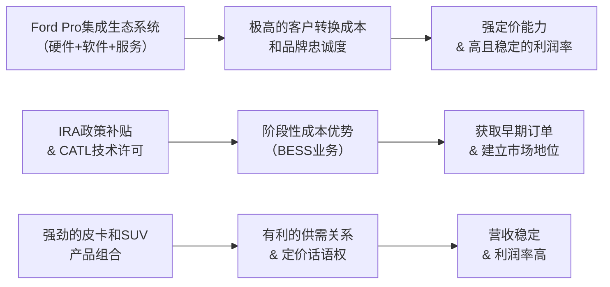

<!-- 匹配到的证券/行业：福特汽车(F.N) -->
操作成功

### 一页通 （福特汽车 (F.N)）
日期：2026-08-06
内容："""
## 公司概况
福特汽车是一家总部位于美国密歇根州的全球化汽车制造商，业务涵盖设计、制造、销售及服务全系列福特品牌卡车、多功能车、轿车及林肯品牌豪华车。公司通过 <strong>Ford Blue（燃油及混动车）、Ford Model e（电动车及软件）、Ford Pro（商用及车队业务）</strong> 三大业务板块运营，并拥有提供汽车金融服务的子公司Ford Credit。福特是美国市场的皮卡和商用车领导者，F系列皮卡已连续多年蝉联全美最畅销车型。 

## 公司近况跟踪
- <strong>2Q26业绩超预期并上调全年指引</strong>：公司2Q26实现调整后EBIT <strong>25亿美元</strong>，同比增长17%，高于市场一致预期的约21亿美元。调整后EPS为 <strong>0.42美元</strong>，超一致预期0.06美元。管理层将2026全年调整后EBIT指引中点上调 <strong>10亿美元</strong> 至 <strong>100亿-110亿美元</strong>，主要受强劲的定价和产品组合驱动。    
- <strong>F系列及Super Duty产能恢复在即</strong>：因2025年铝供应商Novelis火灾导致的F系列皮卡产量损失正在恢复。管理层指引2H26 F系列产量将环比大幅增长约30%，且加拿大Oakville工厂新增 <strong>10万辆</strong> Super Duty年产能将于4Q26投产，为2027年提供增量。   
- <strong>软件及服务订阅量高速增长</strong>：2Q26总付费订阅量同比增长约50%至 <strong>160万个</strong>，其中高利润的Ford Pro Intelligence付费订阅超90万，同比增长超20%。管理层重申软件及物理服务业务年复合增速约8%，是利润率扩张的关键驱动力。  
- <strong>电池储能业务（BESS）取得早期进展</strong>：公司已与EDF Power Solutions签署框架协议，后者可在2028年起每年采购最多4GWh储能系统。管理层表示正与更广泛的客户（可能包括数据中心）进行深入谈判，并指出肯塔基工厂20GWh产能有潜力扩至40GWh。   
- <strong>欧洲业务战略调整</strong>：福特与吉利汽车达成协议，将在西班牙瓦伦西亚工厂成立合资公司（福特持股66%），共享产能生产面向欧洲市场的多能源车型，首款新车计划于2028年下线，旨在降低欧洲制造成本并应对竞争。    

## 短期逻辑
1. <strong>2H26盈利强修复的确定性交易</strong>：2025年因铝供应商火灾损失的F系列产量及产生的 <strong>15-20亿美元</strong> 替代采购成本，将在2H26迎来拐点。随着Novelis工厂产能爬坡并于4Q26接近满产，这部分临时成本将消退，同时被压抑的批发销量将集中释放。花旗测算2H26 F系列产量环比增长约30%，将直接推升Ford Blue和Ford Pro的利润率。管理层指引2H26调整后EBIT（剔除1Q26一次性IEEPA收益）与1H26基本持平，但市场共识可能尚未充分反映这一修复斜率，构成业绩持续超预期的窗口。   

2. <strong>定价能力与产品组合升级的结构性重估</strong>：尽管2Q26批发销量同比下降12%，但营收仅下降4%，调整后EBIT同比增长17%，核心在于产品组合向高利润车型（越野系列、V8、大型SUV）的强势转移。管理层将全年行业定价假设从持平上调至 <strong>+0.5%</strong>，并强调越野车型已占美国销量的25%。这一趋势与美国监管环境放松（排放标准放宽）相契合，使得福特能够更自由地销售高利润内燃机产品。若这一组合升级被市场从“周期性”重新认定为“结构性”，将驱动估值中枢上移。  

3. <strong>非汽车业务（BESS/国防）的期权价值重估</strong>：福特能源（BESS）业务正从概念走向落地。与EDF的框架协议及管理层对“广泛客户”的暗示，使市场开始定价这一高增长、高利润的增量市场。瑞银测算，BESS业务在2030年可贡献约 <strong>0.13美元</strong> 的EPS。此外，公司已与美国国防部签订基于Super Duty的军用原型车合同，虽然短期体量小，但“国防供应商”的标签可能触发估值体系的部分重塑。任何新的BESS客户或国防订单公告，都可能成为股价的短期强催化。  

## 长期逻辑
1. <strong>Ford Pro的护城河深化与利润池扩张</strong>：Ford Pro不仅是卖车，更是提供硬件、软件、服务的集成式商业解决方案。其超过 <strong>90万</strong> 的付费软件订阅用户构建了高转换成本的生态系统，车队管理者更换供应商的隐性成本极高。随着远程服务、预测性维护和充电管理等服务的渗透，Pro的经常性收入占比将持续提升，其利润率（2Q26为9.7%）和抗周期性显著优于传统汽车业务。Oakville工厂新增的10万辆Super Duty产能，将直接满足积压的刚性商用需求，为Pro业务在未来2-3年提供清晰的销量和利润增长路径。   

2. <strong>从“硬件制造商”向“软硬件一体化平台”的艰难转型</strong>：福特的长期价值重估取决于能否成功转型为一家“软硬件一体化”公司。其下一代Universal Electric Vehicle（UEV）平台，计划于2027年交付，起售价约 <strong>3万美元</strong>，并搭载完全自研的区域化电气架构和软件系统。这是福特摆脱“硬件组装厂”标签、建立软件护城河和用户全生命周期价值捕获能力的关键战役。若UEV平台能实现成本、性能和智能化体验的突破，并成功将BlueCruise等软件订阅服务规模化，将打开利润率从个位数向双位数跃升的空间。  

3. <strong>BESS业务打开第二增长曲线</strong>：依托与CATL的技术许可协议和美国的《通胀削减法案》（IRA）补贴，福特能源在北美储能市场具备独特的成本优势和合规壁垒。其LFP电池系统符合生产税收抵免（PTC）和投资税收抵免（ITC）资格，对客户极具吸引力。随着AI数据中心和电网级储能需求的爆发，福特能源有望在十年内成长为一个年收入超 <strong>40亿美元</strong>、利润率超10%的高价值业务，为福特提供超越汽车行业周期的增长引擎。 

## 风险提示
- <strong>核心盈利引擎高度集中且面临竞争加剧</strong>：公司利润高度依赖F系列皮卡和Ford Pro业务。美国皮卡市场竞争日趋激烈，通用、Ram均在加大新品投放和产能扩张。若行业需求下滑或竞争导致价格战，福特的定价能力和利润率将受到显著冲击。同时，其在美国市场的成功与监管环境（如排放标准放松）密切相关，政策转向可能带来风险。   
- <strong>电动车及软件转型的长期执行风险</strong>：Model e业务2Q26仍亏损 <strong>9.19亿美元</strong>，且营收规模萎缩。UEV平台的成功与否是决定福特能否在电动化时代立足的关键，但大规模量产、成本控制、软件质量及消费者接受度均存在不确定性。公司在软件和智能化领域面临来自特斯拉及中国车企的巨大竞争压力，转型失败可能导致长期战略价值被侵蚀。  
- <strong>全球贸易政策与供应链的持续扰动</strong>：作为高度依赖北美一体化供应链的制造商，福特对《美墨加协定》（USMCA）的谈判结果高度敏感。任何提高区域内容要求或改变关税规则的结果，都可能增加其制造成本。此外，全球地缘政治风险、大宗商品（如铝、DRAM芯片）价格波动，以及潜在的供应链中断，仍是影响其盈利稳定性的重要变量。  

## 近期要闻
- <strong>2026年5月18日</strong>：福特能源宣布与EDF Power Solutions North America签署五年框架协议，后者可每年采购最多4GWh的DC Block储能系统，用于美国电网级项目，预计2028年开始交付。   
- <strong>2026年6月</strong>：福特在J.D. Power 2026年美国新车质量研究（IQS）中，位列主流品牌第一名，这是自2010年以来的首次。该成绩被视为其质量改进和未来保修成本下降的积极信号。  
- <strong>2026年7月23日</strong>：福特汽车与吉利汽车宣布达成协议，将在西班牙瓦伦西亚成立合资公司，共享福特工厂产能，生产面向欧洲市场的福特和吉利品牌多能源汽车。福特持股66%。   
- <strong>2026年7月28日</strong>：福特公布2Q26业绩，调整后EBIT和EPS均超市场预期，并上调2026年全年利润和自由现金流指引。      

## 未来催化
- <strong>2026年8月-10月</strong>：Novelis铝工厂产能爬坡进展及F系列皮卡产量恢复的月度数据。若产量恢复速度超预期，将直接催化股价。  
- <strong>2026年下半年</strong>：福特能源（BESS）可能宣布新的重大客户（如大型数据中心或公用事业公司），这将验证其储能业务的商业化前景和增长潜力。  
- <strong>2026年第四季度</strong>：加拿大Oakville工厂新增的Super Duty产能正式投产。这不仅将缓解供需矛盾，也为2027年的销量和利润增长提供可见性。   
- <strong>2026年第四季度</strong>：公司可能发放特别股息。基于管理层40%-50%的自由现金流分配政策及2026年上调后的FCF指引，市场存在特别股息的预期。  

## 公司业务模式及拆分
### 业务边际变化
公司正经历从传统燃油车业务向“燃油车盈利输血、电动车及软件服务培育增长”的战略转型期。2025年底，公司宣布重组电动车资产，包括处置与SK On的电池合资企业BlueOval SK，并为此计提了约 <strong>200亿美元</strong> 的会计费用（其中现金支出约55亿美元）。此举标志着福特从激进的电动化投资转向更务实、资本效率更高的策略。同时，公司正式推出电池储能系统（BESS）业务，将其作为Model e部门实现盈利的新支柱。  

### 盈利模式
福特的盈利模式呈现“双轮驱动”特征：<strong>传统业务（Ford Blue & Pro）通过规模效应、品牌溢价和产品组合优化赚取高利润，为转型提供现金流</strong>；<strong>新兴业务（Model e）则致力于通过软件订阅、BESS和下一代电动车平台构建长期、高粘性的利润来源</strong>。Ford Credit则通过提供汽车金融和租赁服务，赚取利差和手续费，并支持车辆销售。 

### 业务拆分
公司近年业务结构清晰，利润核心是Ford Pro，增长潜力在Model e内的软件和能源业务。2025年受铝供应中断和关税影响，整体利润率承压。2026年进入业绩修复期，主要受定价和产品组合改善驱动。 

<strong>细分业务拆分（单位：亿美元）</strong>

| 业务板块 | 2024财年收入 | 2024财年EBIT | 2024财年EBIT率 | 2025财年收入 | 2025财年EBIT | 2025财年EBIT率 | 1H26收入 | 1H26 EBIT | 1H26 EBIT率 |
|---|---|---|---|---|---|---|---|---|---|
| <strong>Ford Blue</strong> | 1,019.00 | 51.00 | 5.0% | 1,019.00 | 30.24 | 3.0% | 521.00 | 30.77 | 5.9% |
| <strong>Ford Model e</strong> | 62.00 | -47.00 | -75.8% | 58.00 | -48.06 | -82.9% | 20.00 | -16.96 | -84.8% |
| <strong>Ford Pro</strong> | 667.00 | 90.00 | 13.5% | 663.00 | 68.43 | 10.3% | 350.00 | 34.03 | 9.7% |
| <strong>Ford Credit</strong> | 137.00 | 17.00 | - | 138.32 | 25.57 | - | 68.00 | 15.40 | - |
| <strong>公司总计</strong> | <strong>1,849.92</strong> | <strong>102.08</strong> | <strong>5.5%</strong> | <strong>1,872.67</strong> | <strong>67.80</strong> | <strong>3.6%</strong> | <strong>915.49</strong> | <strong>59.88</strong> | <strong>6.5%</strong> |

*注：公司总计EBIT为调整后数据。1H26指2026年上半年。*

<strong>Ford Blue（燃油及混动车）</strong>：2026年上半年，该部门受益于强劲的产品组合（越野车型、V8、大型SUV）和净定价能力，EBIT利润率从2025年的3.0%大幅反弹至5.9%。尽管批发销量因车型换代和主动削减低利润的租赁业务而下降，但营收相对稳定，显示了其在高利润细分市场的定价权。 

<strong>Ford Model e（电动车、软件及能源）</strong>：该部门仍处于深度亏损，但亏损额同比有所收窄。1H26 EBIT亏损16.96亿美元，较2025年同期改善。改善主要来自第一代电动车的成本削减和产量调整。该部门现在包含了公司未来高增长的业务种子：软件订阅服务（总付费订阅达160万）和电池储能业务（BESS）。管理层指引2026全年Model e亏损约 <strong>40亿美元</strong>，其中包含约10亿美元对UEV平台和BESS的增量投资。 

<strong>Ford Pro（商用及车队业务）</strong>：作为公司的利润基石，该部门在1H26实现EBIT <strong>34.03亿美元</strong>，利润率9.7%。尽管受到铝供应中断影响，收入和利润同比有所下滑，但其软件和物理服务的增长展现了商业模式的韧性。随着2H26 Super Duty产能恢复和Oakville新工厂投产，该部门预计将重回增长轨道。 

## 核心竞争力
<strong>竞争要素 1：依托极高转换成本与集成服务构筑的客户粘性（Ford Pro）</strong>
- <strong>护城河定性</strong>：<strong>结构性护城河</strong>。Ford Pro不仅销售车辆，更提供一套集成了远程信息处理、预测性维护、充电管理和支付结算的完整数字生态系统。商业车队客户一旦将运营流程深度嵌入该平台，其转换供应商的金钱、时间和运营风险成本极高，形成了强大的客户粘性。 
- <strong>数据验证</strong>：Ford Pro Intelligence的付费订阅用户数已超 <strong>90万</strong>，同比增长超20%。该部门在面临铝供应中断导致车辆交付受阻的情况下，其软件和物理服务收入依然保持增长，证明了其商业模式的粘性和抗周期性。其EBIT利润率（1H26为9.7%）远高于公司整体水平。  
- <strong>动态演变</strong>：<strong>护城河变宽</strong>。随着公司增加Super Duty产能、扩展移动服务车队，并深化软件功能（如ADAS），Ford Pro为客户创造的价值和嵌入深度将持续增加，进一步巩固其市场领导地位。 

<strong>竞争要素 2：依托先发规模和IRA政策构筑的阶段性成本优势（Ford Energy/BESS）</strong>
- <strong>护城河定性</strong>：<strong>行业阶段性红利</strong>。福特能源的竞争优势主要源于其较早利用与CATL的技术许可协议，在美国本土建立LFP电池产能，从而有资格获得IRA法案下的生产税收抵免（PTC，约45美元/kWh）。这使得其产品在成本上相比依赖进口的非合规产品具有显著优势，并能帮助客户获得投资税收抵免（ITC）。 
- <strong>数据验证</strong>：瑞银测算，在PTC补贴下，福特BESS的电芯成本可降至约 <strong>26美元/kWh</strong>，系统总成本约 <strong>176美元/kWh</strong>，具备较强竞争力。公司已获得EDF的20GWh框架协议，并正与更广泛的客户谈判。 
- <strong>动态演变</strong>：<strong>面临不确定性</strong>。该优势的持续性取决于IRA政策的稳定性、PTC补贴的逐步退坡（2030年开始），以及未来其他竞争对手（如特斯拉、韩国电池厂）在北美本土LFP产能的扩张速度。长期看，成本优势可能收窄，竞争将转向品牌、服务和系统集成能力。 

<strong>现阶段核心驱动力总结</strong>：福特当前的Alpha来源于其<strong>传统优势业务（Pro和卡车）的定价能力和产品组合升级</strong>，这带来了强劲的现金流和业绩修复。其Beta则在于<strong>BESS和下一代电动车平台等增长期权</strong>，这些业务决定了公司的长期估值天花板，但目前仍处于高投入、待验证阶段。 

<strong>竞争格局传导逻辑图</strong>：

## 产销链
- <strong>客户情况</strong>：福特的主要客户分为三类：1）通过经销商网络购买的个人消费者；2）大型商业车队客户（Ford Pro的核心客群）；3）租赁公司。公司正主动削减低利润的租赁渠道销量，以保护剩余价值。Ford Pro的客户关系稳固，2027款车型的早期签约进度比去年同期快约一个月，显示出强劲的续购需求。公司不存在对单一客户的过度依赖。 
- <strong>供应商情况</strong>：公司供应链高度全球化，但正面临多重挑战。铝供应商Novelis的火灾暴露了单一关键供应商的风险，公司为此在2026年承担了约 <strong>15亿美元</strong> 的替代采购成本。此外，全球DRAM芯片供应紧张，公司已与美光签订战略客户协议以锁定供应，但这可能带来不利的成本条款。为应对地缘政治风险和USMCA潜在的新规，公司正与供应商合作评估供应链近岸化。  
- <strong>经销商情况</strong>：公司采用传统的经销商网络进行销售。2Q26美国零售库存为 <strong>52天</strong> 供应量，略低于55-65天的目标，库存水平健康。公司正与经销商共同投资，扩大服务能力和移动服务车队，以提升客户体验和售后收入。 
- <strong>成本传导能力</strong>：福特在皮卡和大型SUV等核心市场拥有较强的品牌溢价和定价权，能够部分传导原材料成本上涨的压力。但在竞争激烈的电动车和轿车市场，其成本传导能力较弱。总体而言，公司赚取的是 <strong>“品牌溢价”+“规模制造”</strong> 的钱，其利润对大宗商品价格和供应链稳定性高度敏感。 

## 财务数据
<strong>关键财务数据（单位：亿美元）</strong>

| 项目 | FY2023 | FY2024 | FY2025 | 1H2026 |
|---|---|---|---|---|
| <strong>截止日期</strong> | 2023-12-31 | 2024-12-31 | 2025-12-31 | 2026-06-30 |
| <strong>营业总收入</strong> | 1,761.91 | 1,849.92 | 1,872.67 | 915.49 |
| 收入同比 | 11.47% | 5.00% | 1.23% | 0.78% |
| <strong>营业成本</strong> | 1,505.50 | 1,584.34 | 1,744.66 | 775.27 |
| <strong>毛利润</strong> | 256.41 | 265.58 | 128.01 | 140.22 |
| <strong>毛利率</strong> | 14.55% | 14.35% | 6.84% | 15.32% |
| <strong>营业利润</strong> | 149.39 | 162.71 | 19.52 | 85.31 |
| <strong>归母净利润</strong> | 43.47 | 58.79 | -81.82 | 12.21 |
| <strong>基本EPS (美元)</strong> | 1.09 | 1.48 | -2.06 | 0.31 |
| <strong>自由现金流</strong> | 66.82 | 67.39 | 124.67 | 9.03 |

*注：自由现金流由经营活动现金流净额减去资本性支出计算得出。FY2025归母净利润大幅为负主要受BlueOval SK合资企业处置相关的一次性非现金费用影响。*

<strong>财务分析</strong>：
- <strong>盈利能力</strong>：公司毛利率在2025年因铝供应中断、大宗商品成本上涨和保修费用增加而大幅下滑至6.84%。进入2026年，随着定价改善和成本控制措施生效，上半年毛利率已恢复至15.32%。然而，净利润端受Model e的持续亏损和重组费用拖累，波动较大。调整后EBIT利润率是更好的观察指标，1H26为6.5%，较2025年的3.6%显著修复。 
- <strong>运营能力</strong>：2025年应收账款大幅下降，主要与业务结构调整有关。存货水平相对稳定。公司正通过主动削减租赁销量、增加认证二手车销售等方式，优化车辆残值管理。 
- <strong>偿债能力与现金流</strong>：公司维持着强劲的流动性，截至1H26末持有现金 <strong>186.03亿美元</strong>，总流动性 <strong>434亿美元</strong>。2025年经营活动现金流净额高达 <strong>212.82亿美元</strong>，自由现金流为 <strong>124.67亿美元</strong>，表现强劲，主要受益于营运资金的积极变化。管理层指引2026全年调整后自由现金流为 <strong>60亿-70亿美元</strong>，资本支出为95亿-105亿美元，现金流状况健康，足以支撑其转型投资和股东回报。 

## 行业及竞争分析
福特所处的全球汽车行业正经历百年未有之大变局，呈现“传统燃油车存量博弈、电动车渗透率波动、软件定义汽车兴起”的复杂格局。 

- <strong>美国核心市场</strong>：这是一个成熟且高度集中的市场，福特和通用等本土巨头凭借皮卡和SUV的统治地位，享有结构性优势。2026年上半年美国车市年化销量（SAAR）维持在 <strong>1600-1650万辆</strong> 的健康水平。该市场的竞争壁垒主要来自消费者对本土品牌的忠诚度、经销商网络以及针对中国电动车的严格关税壁垒。然而，高企的新车均价和贷款利率对消费者承受能力构成压力。行业趋势是混动车（HEV）需求强劲增长，而纯电动车（BEV）需求增速放缓，这对在内燃机和混动技术上有深厚积累的福特有利。 

- <strong>全球电动车及中国市场</strong>：中国是全球最大的电动车市场，由比亚迪、特斯拉及众多新势力主导，竞争极为惨烈。福特在中国市场采取收缩战略，聚焦于优势细分市场。在欧洲，随着2035年禁燃令的临近，电动车渗透率快速提升，但中国车企正凭借高性价比产品大举进入，对包括福特在内的传统欧洲车企构成严峻挑战。福特与吉利在西班牙的合资，正是在此背景下降低制造成本、应对竞争的战略举措。  

- <strong>储能（BESS）市场</strong>：这是一个高增长的新兴市场，受AI数据中心扩张和电网稳定性需求驱动。瑞银预测，2030年美国BESS市场规模可达约 <strong>200GWh</strong>。竞争格局尚未定型，特斯拉目前是领导者，但福特凭借其本土制造能力、LFP技术路线和IRA补贴资格，有望成为强有力的挑战者。 

<strong>可比公司分析</strong>

| 公司名称 | 股票代码 | 核心业务对比 | 盈利能力（EBIT率） | 估值水平（P/E） | 战略差异点 |
|---|---|---|---|---|---|
| <strong>通用汽车 (GM)</strong> | GM | 全尺寸皮卡/SUV强势，电动车平台Ultium，Cruise自动驾驶 | 高于福特 | 低于福特 | 更早退出不盈利市场，资本配置更激进（大规模回购），自动驾驶投入更聚焦。 |
| <strong>Stellantis (STLA)</strong> | STLA | 多品牌组合，北美皮卡/Jeep利润丰厚，欧洲业务庞大 | 高于福特 | 远低于福特 | 面临更严峻的中国车企竞争和欧洲市场挑战，库存和定价问题突出，处于困境反转阶段。 |
| <strong>特斯拉 (TSLA)</strong> | TSLA | 纯电动车领导者，FSD自动驾驶软件，能源业务 | 远高于传统车企 | 远高于传统车企 | 纯科技公司估值逻辑，增长来自新车、FSD和机器人，与传统车企的盈利模式不同。 |

<strong>总结分析</strong>：与通用相比，福特在资本配置和业务聚焦上显得更为保守，但其Ford Pro的商业模式和BESS业务的潜力提供了差异化的增长叙事。与Stellantis相比，福特在北美市场的地位更为稳固，受欧洲和中国市场竞争的冲击相对较小。与特斯拉相比，福特代表了汽车行业的“现在”，拥有强大的现金流和制造能力，但在科技属性和增长预期上存在显著折价。福特的投资逻辑在于其传统业务的现金牛地位能否持续，以及新兴业务能否成功兑现增长预期，从而驱动估值向科技公司靠拢。 

## 市场焦点议题
<strong>议题一：Ford Pro的利润率趋势与增长可持续性</strong>
- <strong>背景</strong>：Ford Pro是福特最核心的利润引擎，但其2Q26 EBIT同比下降26%，利润率从12.3%降至9.7%，主要受铝供应中断影响。市场高度关注这一高利润业务的增长是否已见顶，以及其抵御经济下行的能力。  
- <strong>问题列表</strong>：
  - 随着Oakville新增产能投产和供应链恢复，Pro的利润率能否在2027年回到并超越2024年的峰值水平（13.5%）？
  - 软件订阅的ARPU和渗透率提升能否有效对冲新车销售的周期性波动，使Pro的盈利更具韧性？
  - 面对通用和Ram在商用车领域的竞争加剧，Pro的定价能力和市场份额能否维持？

<strong>议题二：电动车及BESS业务的盈利路径与资本回报</strong>
- <strong>背景</strong>：Model e部门持续巨额亏损，消耗大量现金。公司已将未来押注于UEV平台和BESS业务，但这两项业务均处于早期阶段，面临技术、市场和政策的不确定性。 
- <strong>问题列表</strong>：
  - UEV平台能否在2027年如期交付，并实现其 <strong>3万美元</strong> 起售价的成本目标？其盈利能力何时能转正？
  - BESS业务的客户拓展进度如何？除了EDF，何时能签下超大规模数据中心客户？20GWh产能何时能满产？
  - 考虑到IRA补贴的逐步退坡，BESS业务的长期可持续利润率中枢在哪里？

<strong>议题三：资本配置的优先级与股东回报</strong>
- <strong>背景</strong>：公司拥有强劲的自由现金流，但同时也面临电动化、智能化和BESS业务的高额资本开支需求。市场关注管理层如何在投资未来与回报股东之间取得平衡。  
- <strong>问题列表</strong>：
  - 2026年上调后的60亿-70亿美元自由现金流中，有多少将用于再投资，多少用于分红或回购？
  - 公司是否会遵循其40%-50%的FCF分配政策，在2026年发放特别股息？
  - 面对高昂的转型成本，公司是否会考虑分拆或引入外部资本来释放BESS或Ford Pro等业务的价值？

## 市场分歧探讨
<strong>核心分歧：福特当前强劲的业绩修复是周期性顶点还是结构性改善的起点？</strong>

- <strong>乐观方观点：结构性改善，估值应重估</strong>
  - <strong>逻辑</strong>：福特已不再是单纯的周期性汽车制造商。Ford Pro的集成服务模式创造了高粘性、高利润的经常性收入流，其商业模式的韧性在本次供应链危机中已得到验证。同时，BESS和国防等非汽车业务提供了超越汽车周期的增长期权。公司在J.D. Power质量排名中的跃升，标志着其长期困扰的保修成本问题将得到根本性改善。因此，其盈利质量和增长可持续性应享有比传统车企更高的估值。 
  - <strong>支撑依据</strong>：1H26调整后EBIT利润率已恢复至6.5%，接近2024年水平。软件订阅用户数高速增长。BESS业务已获得首个大客户框架协议。 

- <strong>谨慎方观点：周期性修复，高光时刻难以持续</strong>
  - <strong>逻辑</strong>：当前业绩的强劲反弹，主要得益于后疫情时代被压抑的换车需求、有利的产品组合（监管放松）以及供应链恢复带来的一次性补库效应。美国车市已处于周期高位，消费者承受能力恶化，未来需求下行风险加大。Model e的巨额亏损和UEV平台的高额投入将持续侵蚀利润。BESS业务远水难解近渴，且面临政策风险。一旦行业周期下行，福特的定价能力和利润率将迅速恶化。 
  - <strong>支撑依据</strong>：2Q26批发销量同比下降12%，表明终端需求可能正在走弱。美国新车均价和贷款利率处于历史高位。公司历史上多次在周期顶峰加大投资，随后在低谷期陷入困境。 

<strong>总结分析</strong>：福特正处在转型的关键十字路口。其传统业务的护城河（Ford Pro和卡车）依然坚固，并展现出超越以往周期的盈利韧性，这构成了公司价值的安全垫。然而，其估值能否实现质的飞跃，取决于新兴业务（软件、BESS、UEV）能否成功规模化并兑现盈利承诺。当前市场对这两方面的定价均不充分，既未完全奖励其业务结构的改善，也未过度惩罚其转型的不确定性。未来的股价方向将取决于上述两项核心分歧的逐步明朗化。 

## 盈利预测与估值
<strong>管理层最新指引</strong>：公司上调2026全年调整后EBIT指引至 <strong>100亿-110亿美元</strong>，调整后自由现金流指引至 <strong>60亿-70亿美元</strong>。资本支出维持 <strong>95亿-105亿美元</strong> 不变。管理层对2027年的初步展望为“存在平衡的利好与利空因素”，利好包括Novelis临时成本的消失和成本持续改善，利空包括IEEPA一次性收益的消失和UEV/BESS的上市投入。 

<strong>券商盈利预测与估值</strong>

| 机构 | 评级 | 目标价(美元) | 财务指标 | FY2025A | FY2026E | FY2027E | FY2028E |
|---|---|---|---|---|---|---|---|
| <strong>花旗 (2026-07-29)</strong> | 买入 | 20.00 | 调整后EPS (美元) | 1.09 | 1.90 | 2.10 | 2.30 |
| <strong>摩根大通 (2026-07-29)</strong> | 超配 | 17.00 | 调整后EPS (美元) | 1.09 | 1.87 | 1.95 | 2.00 |
| <strong>高盛 (2026-08-03)</strong> | 中性 | 16.00 | 调整后EPS (美元) | 1.09 | 1.90 | 2.00 | 2.10 |
| <strong>摩根士丹利 (2026-07-29)</strong> | 均配 | 15.00 | 调整后EPS (美元) | 1.09 | 1.79 | 1.86 | 2.15 |
| <strong>瑞银 (2026-07-30)</strong> | 买入 | 17.00 | 调整后EPS (美元) | 1.09 | 1.69 | 1.95 | 2.13 |

<strong>盈利预期与估值分析</strong>：主要券商对福特2026年的EPS预测集中在 <strong>1.69-1.90美元</strong> 区间，反映了对下半年利润率修复程度的不同假设。市场一致预期2026年调整后EBIT约为 <strong>96亿美元</strong>，低于公司指引中点的105亿美元，表明市场对公司指引的可实现性仍存疑虑。估值方法上，多数机构采用市盈率（P/E）估值，目标倍数在 <strong>8-9倍</strong> 之间，反映了其传统汽车业务的周期性折价。瑞银和花旗给出了更高的目标价，主要因为它们在估值中计入了BESS业务的期权价值，认为其应享有比传统汽车业务更高的估值倍数。机构间观点存在分歧，乐观方（花旗、摩根大通、瑞银）强调盈利上修和增长期权，而谨慎方（高盛、摩根士丹利）则更关注竞争和转型风险。
"""
