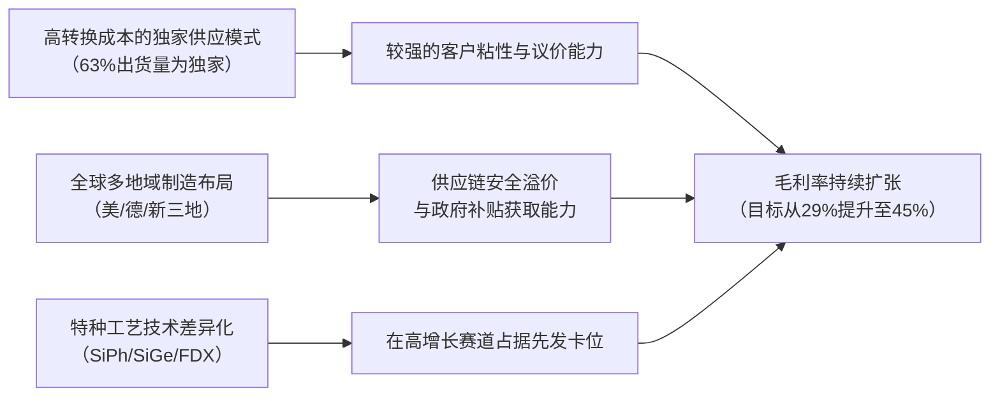

<!-- 匹配到的证券/行业：Globalfoundries(GFS.O) -->
操作成功

### 一页通 （Globalfoundries (GFS.O)）
日期：2026-08-06
内容："""
## 公司概况

GlobalFoundries（格芯）是全球第三大半导体代工厂，专注于12nm及以上成熟制程和特种工艺。公司定位为差异化、必需芯片的制造商，而非追逐最先进制程节点。其产品覆盖射频、超低功耗CMOS、硅光子、功率半导体等技术平台，服务于智能移动设备、汽车、家庭与工业物联网、通信基础设施与数据中心四大终端市场。公司拥有横跨美国、德国、新加坡三大洲的制造布局，是唯一具备全球规模化制造足迹的代工厂，这一地缘多元化特征是其区别于亚洲竞争对手的核心资产。 

## 公司近况跟踪

- <strong>Q2业绩超预期，毛利率提前达标</strong>：2026年Q2营收17.86亿美元，环比增长9%，同比增长6%，高于指引上限。非IFRS毛利率达<strong>29.9%</strong>，同比提升470个基点，创Q2历史新高，并提前实现约30%的毛利率目标。业绩超预期主要由高毛利的通信基础设施与数据中心（CID）业务强劲增长及产品组合优化驱动。 
- <strong>CID业务增长预期大幅上调</strong>：受硅光子（SiPh）和硅锗（SiGe）需求爆发驱动，管理层将2026全年CID业务营收增长预期从此前的约30%以上，上调至<strong>50%-60%</strong>。硅光子业务预计全年营收同比翻倍以上，SiGe产能2027年全年已被超额预订。  
- <strong>战略收购完成，IP/定制芯片能力增强</strong>：公司于2026年6月完成了对Synopsys ARC处理器IP业务的收购，与先前收购的MIPS形成互补，构建了完整的RISC-V处理器IP和定制芯片设计能力。2026全年技术性服务收入贡献预期上调至<strong>1亿至1.2亿美元</strong>。 
- <strong>首次启动资本回报计划</strong>：公司于2026年7月支付了首次季度现金股息，每股<strong>0.12美元</strong>，并设定了将调整后自由现金流的最高50%通过股息和回购返还股东的目标。 
- <strong>政府合作持续深化</strong>：2026年7月，公司与美国商务部签署意向书，拟获得<strong>3亿美元</strong>拨款用于加速下一代硅光子技术研发；此前5月，公司已就量子计算项目获得<strong>3.75亿美元</strong>拨款意向。  

## 短期逻辑

1. <strong>CID业务高增长驱动业绩持续超预期</strong>：公司已将2026全年CID业务增长指引上调至50%-60%，其中硅光子营收预计翻倍以上。Q2 CID营收同比增长62%，为连续第七个季度双位数增长。考虑到AI数据中心对光互联的强劲需求，以及公司SiGe产能已超额预订至2027年，该业务在下半年大概率维持高增速，为整体营收和毛利率提供持续上行支撑。Q3指引营收中值18.85亿美元，毛利率30.5%，环比继续扩张。  

2. <strong>定价环境改善，2027年将迎来更广泛的提价</strong>：管理层在Q2电话会上明确表示，已与客户就多个技术领域的提价达成共识，预计将于<strong>2027年</strong>开始在营收中体现。当前成熟制程代工产能利用率持续改善，公司Q2利用率已处于80%以上高位，供需趋紧为提价提供了有利背景。这一预期差尚未完全反映在当前的盈利预测中，可能成为未来几个季度持续上修EPS的催化剂。 

3. <strong>智能手机业务加速下滑，倒逼业务结构优化</strong>：公司已将2026年智能手机业务全年预期从此前的“高个位数下降”下调至<strong>10%-15%的降幅</strong>。虽然短期构成拖累，但这一加速下滑正在倒逼公司业务结构向高毛利、高增长的CID和汽车领域更快转型。Q2智能手机收入占比已降至约36%，市场预期该比例在2027年可能降至30%以下，届时公司整体增长轮廓将显著改善，可能触发估值重评。 

## 长期逻辑

1. <strong>从手机驱动的周期股，转型为AI/特种工艺平台</strong>：公司正经历根本性的业务结构转型。管理层在2026年投资者日上提出，到2030年，CID、汽车和物联网将贡献75%的制造服务收入（2025年为55%），智能手机收入占比将降至25%以下。这一转型的核心驱动力来自硅光子、数据中心电源管理和物理AI三大赛道，公司预计这三条赛道将在2030年分别贡献<strong>20亿美元、10亿美元和10亿美元</strong>的增量收入。若转型成功，公司将从低增长的消费电子周期股，重估为高增长的特种半导体平台。   

2. <strong>全球多地域布局是地缘政治溢价的核心来源</strong>：公司在美国、德国、新加坡拥有四大制造基地，且技术可在各厂区间迁移。在客户日益寻求非中国/非台湾产能保障的背景下，这一布局构成了独特的竞争壁垒。公司约<strong>95%</strong>的新设计中标为独家供应，且2025年新增超过500个设计中标。随着CHIPS法案等政府补贴落地，公司预计可获得30%-50%的资本开支回收，显著降低净投资强度，提升长期自由现金流回报。  

3. <strong>IP和定制芯片业务有望提升客户粘性与盈利能力</strong>：通过收购MIPS和Synopsys ARC，公司正从纯代工厂向“技术解决方案平台”演进。这一模式使公司能在客户设计周期更早阶段介入，提供处理器IP、软件工具和定制设计服务，从而增强客户粘性并获取更高附加值。管理层预计该业务到2030年可实现<strong>10亿美元</strong>年收入，且其毛利率（80%-90%）显著高于公司整体水平，将成为长期利润率扩张的重要引擎。   

## 风险提示

- <strong>智能手机与消费类IoT市场持续疲软</strong>：智能手机仍占公司营收约36%，2026年预计下滑10%-15%。若全球消费电子需求持续低迷，或存储芯片短缺进一步抑制手机出货量，该业务的下滑幅度可能超出预期，部分抵消CID和汽车业务的增长。此外，家庭与工业IoT虽在Q2出现反弹，但其复苏的可持续性仍需观察。 
- <strong>硅光子等新业务面临激烈的竞争与执行风险</strong>：尽管公司在硅光子领域具备先发优势，但台积电的COUPE平台和Tower Semiconductor均在积极争夺市场份额。硅光子市场虽在快速扩张，但若公司无法在CPO/NPO等下一代技术路线中保持领先，或产能扩张速度不及竞争对手，可能导致份额流失。此外，公司设定的2028年硅光子10亿美元营收目标，高度依赖可插拔光模块需求的持续性和CPO的按时量产。 
- <strong>大规模产能扩张带来折旧压力与资本开支强度</strong>：公司计划2026年净资本开支占收入15%-20%，长期目标为20%，显著高于过去几年的7%-10%。大规模投资虽为满足需求所必需，但将增加折旧压力，并可能在需求波动时导致产能利用率下降，拖累毛利率。公司预计折旧将对毛利率构成约<strong>100个基点</strong>的逆风。 

## 近期要闻

- <strong>2026年5月7日</strong>：公司举办投资者日，公布长期财务模型，提出10%-12%的贯穿周期营收复合增长率，2028年底毛利率目标40%，2030年目标45%，并宣布首次季度股息。  
- <strong>2026年5月21日</strong>：公司宣布成立量子技术解决方案（QTS）业务，并与美国商务部签署意向书，拟获得3.75亿美元拨款，政府将获得约1%股权。  
- <strong>2026年6月1日</strong>：公司完成对Synopsys ARC处理器IP解决方案业务的收购，交易对价约4.55亿美元，进一步强化RISC-V IP和定制芯片能力。 
- <strong>2026年7月14日</strong>：公司支付了历史上首次季度现金股息，每股0.12美元。 
- <strong>2026年7月29日</strong>：公司与美国商务部签署一份不具约束力的意向书，拟获得3亿美元拨款，用于加速下一代硅光子技术在美国的研发和制造。 

## 未来催化

- <strong>2026年8月5日</strong>：公司发布Q2财报，业绩超预期并上调全年CID增长指引，构成正面催化。 
- <strong>2026年9月-10月</strong>：公司预计在Q3完成第二个SCALE（CPO/NPO）平台的设计中标。若新增重要客户或超大规模客户采用其CPO方案，将进一步提升市场对其在下一代光互联领域地位的信心。 
- <strong>2026年下半年</strong>：公司预计将从2026年下半年开始，在部分供给受限的技术领域（如FDX、SiGe、SiPh）逐步落实与客户达成的提价协议。具体的提价幅度和范围若超预期，将直接提振2027年的盈利预测。 
- <strong>2026年Q4</strong>：随着Synopsys ARC业务整合完成，以及MIPS业务持续放量，技术性服务收入的贡献有望进一步提升。该业务毛利率极高，其收入占比的提升将对整体利润率产生结构性拉动。 

## 公司业务模式及拆分

<strong>业务边际变化</strong>：公司正经历从以智能手机代工为主的商业模式，向多元化特种工艺平台的战略转型。核心变化包括：1）通过收购AMF、MIPS、InfiniLink和Synopsys ARC，将业务从纯晶圆制造向上游IP授权、软件和定制芯片设计延伸；2）大幅增加对硅光子、SiGe、FDX等高成长、高毛利技术走廊的资本开支；3）主动管理智能手机业务的收缩，将资源重新配置到数据中心和汽车领域。  

<strong>盈利模式</strong>：公司主要依靠技术差异化（特种工艺、独家供应）和全球化制造布局获取溢价，而非单纯比拼制程先进性。约<strong>63%</strong>的晶圆出货量为独家供应产品，客户转换成本较高。此外，公司通过长期协议锁定部分收入，截至2025年底，长期协议的剩余收入承诺约为<strong>110亿美元</strong>。 

<strong>业务拆分</strong>：公司从2026年Q1起将收入分类从“晶圆收入/非晶圆收入”改为“制造服务/技术性服务”，以反映其向平台化解决方案提供商的转型。制造服务包括晶圆制造和先进封装，技术性服务包括IP授权、软件、掩模版、NRE等。当前公司处于<strong>业务结构转型期</strong>，高毛利的CID和汽车业务占比持续提升，低毛利的智能手机业务占比下降。 

<strong>细分业务拆分（按终端市场）</strong>

| 终端市场 (百万美元) | FY2023 | FY2024 | FY2025 | FY2025占比 | FY2026 H1 | FY2026 H1占比 | FY2026 H1同比 |
|---|---|---|---|---|---|---|---|
| <strong>截止日期</strong> | 2023-12-31 | 2024-12-31 | 2025-12-31 | | 2026-06-30 | | |
| 智能移动设备 | 3,023 | 3,048 | 2,678 | 39% | 1,202 | 35% | -5.3% |
| 通信基础设施与数据中心 | 863 | 577 | 745 | 11% | 507 | 15% | +47.0% |
| 家庭与工业物联网 | 1,604 | 1,267 | 1,189 | 18% | 586 | 17% | -6.7% |
| 汽车 | 1,046 | 1,206 | 1,410 | 21% | 715 | 21% | +5.6% |
| 非晶圆/技术性服务 | 856 | 652 | 769 | 11% | 410 | 12% | +15.8% |
| <strong>总计</strong> | <strong>7,392</strong> | <strong>6,750</strong> | <strong>6,791</strong> | <strong>100%</strong> | <strong>3,420</strong> | <strong>100%</strong> | <strong>+4.5%</strong> |

*注：2026年H1数据中，原“非晶圆收入”已重分类为“技术性服务”，历史数据已做同口径调整。*

<strong>智能移动设备</strong>：2026年H1营收12.02亿美元，同比下降5.3%，占比35%。该业务主要受全球智能手机市场疲软及存储芯片短缺影响，公司预计全年下滑10%-15%。但公司约三分之二收入来自高端机型，表现相对优于行业。长期看，公司假设该业务收入持平，占比将持续下降。  

<strong>通信基础设施与数据中心</strong>：2026年H1营收5.07亿美元，同比大增47.0%，占比提升至15%，是公司增长最快的板块。增长主要由硅光子（可插拔光模块）、高性能SiGe（光网络TIA/Driver）和卫星通信三大引擎驱动。公司预计2026全年该业务增长50%-60%，硅光子营收翻倍以上。该业务毛利率显著高于公司平均水平，是短期和长期利润率扩张的核心驱动力。  

<strong>家庭与工业物联网</strong>：2026年H1营收5.86亿美元，同比下降6.7%，但Q2已出现反弹（环比+30%，同比+10%）。公司已将全年增长预期从此前的中个位数上调至<strong>10%-15%</strong>，主要受库存正常化、需求信号改善及新一代产品爬坡推动。长期看，该业务被定位为物理AI的核心受益板块，预计贯穿周期实现中双位数增长。  

<strong>汽车</strong>：2026年H1营收7.15亿美元，同比增长5.6%，占比21%。Q2受客户出货时间安排影响环比下滑，但公司维持全年<strong>低双位数增长</strong>预期。增长动力来自MCU市场份额扩大、智能传感器、雷达、摄像头等新应用放量。公司已是全球前三大汽车MCU制造商的代工合作伙伴。  

<strong>技术性服务</strong>：2026年H1营收4.10亿美元，同比增长15.8%，占比12%。该业务包括IP授权、软件、掩模版、NRE等，受益于MIPS并表及客户流片活动增加。公司预计全年该业务收入贡献将处于10%-12%区间的高端，其毛利率（部分业务达80%-90%）显著高于制造服务，是利润率结构性改善的重要来源。  

## 核心竞争力

<strong>竞争要素 1：依托高转换成本与独家供应构筑的客户粘性</strong>

- <strong>护城河定性</strong>：<strong>结构性护城河</strong>。公司约<strong>63%</strong>的晶圆出货量为独家供应产品，客户一旦采用其特种工艺进行设计并完成认证，转换代工厂将面临高昂的重新设计、重新认证成本和时间周期（尤其在汽车和航空航天领域）。2025年公司新增超过500个设计中标，其中约95%为独家供应，表明其技术差异化和客户锁定能力在持续增强。 
- <strong>数据验证</strong>：2025年来自长期协议的剩余收入承诺约为<strong>110亿美元</strong>，为未来收入提供了较高的可见性。汽车业务收入从2020年的约1亿美元增长至2025年的14.1亿美元，五年增长约14倍，且客户基础从少数MCU厂商扩展至全球前三大MCU供应商（英飞凌、恩智浦、瑞萨）。 
- <strong>动态演变</strong>：<strong>护城河变宽</strong>。随着公司向IP授权和定制芯片领域延伸，客户在设计阶段即与公司深度绑定，转换成本进一步提高。同时，地缘政治驱动的供应链多元化需求，使得公司多地域制造布局的吸引力持续上升。  

<strong>竞争要素 2：依托全球多地域布局的供应链安全溢价</strong>

- <strong>护城河定性</strong>：<strong>结构性护城河</strong>。公司是美国本土唯一具备规模化半导体制造能力的纯代工厂，同时在德国和新加坡拥有核心产能。在客户日益寻求非中国/非台湾产能保障的背景下，这一布局构成了独特的竞争壁垒。技术可在各厂区间迁移，客户一次设计即可获得多地域生产选择。 
- <strong>数据验证</strong>：公司预计可从政府补贴中获得30%-50%的资本开支回收。2025年已获得来自美国CHIPS法案的<strong>15亿美元</strong>直接资助批准，以及纽约州<strong>5.7亿美元</strong>支持。2026年又陆续获得硅光子和量子计算领域的政府拨款意向。这些补贴显著降低了公司的净投资强度。 
- <strong>动态演变</strong>：<strong>护城河变宽</strong>。全球供应链去风险化趋势仍在强化，公司作为“可信代工厂”的战略价值持续提升。近期与洛克希德·马丁等航空航天客户的合作，进一步验证了其在美国国防供应链中的独特地位。 

<strong>现阶段核心驱动力总结</strong>：公司的Alpha来源于业务结构从低毛利消费电子向高毛利数据中心和汽车特种工艺的主动转型，以及IP/定制芯片业务带来的盈利能力升级。Beta则来源于全球半导体供应链重构（去中国化/去台湾化）和AI基础设施投资周期的双重顺风。 

<strong>竞争格局传导逻辑图</strong>

## 产销链

<strong>客户情况</strong>：公司客户集中度较高，2025年前十大客户占应收账款约<strong>72.3%</strong>。其中，单一客户A占晶圆收入约16.4%，客户C占约13.9%。公司通过长期协议锁定核心客户需求，但需关注单一客户订单波动对营收的影响。新客户方面，公司正积极拓展数据中心领域的超大规模客户和光模块供应商，目前与全球前五大光收发器供应商中的四家合作。在汽车领域，公司已成为全球前三大MCU制造商的代工伙伴。 

<strong>供应商情况</strong>：公司对关键原材料SOI晶圆的供应商高度集中。2025年，公司<strong>71.4%</strong>的SOI晶圆采购来自单一供应商Soitec。双方签订了多项长期供应协议以保障供应稳定性。其他原材料（如硅晶圆、气体、化学品）虽多数有多个供应源，但部分关键材料仍存在独家供应情况。2026年Q2，因中东冲突导致的供应链不确定性，公司提前加强了氦气、氢气等关键气体和化学品的备货，预计对后续季度毛利率造成约<strong>0.5个百分点</strong>的压力。  

<strong>成本传导能力</strong>：公司赚取的是“技术溢价+供应链安全溢价”，而非单纯的加工费。当上游原材料或能源成本上升时，公司具备一定的成本转嫁能力，但存在时滞。2026年Q2电话会上，管理层表示已与客户就多个技术领域的提价达成共识，预计2027年开始体现，这表明在供需趋紧的特种工艺领域，公司的议价能力在增强。但在竞争更充分的智能手机等大宗应用领域，成本传导能力相对有限。 

## 财务数据

<strong>关键财务数据</strong>

| 项目 (百万美元) | FY2023 | FY2024 | FY2025 | FY2026 H1 |
|---|---|---|---|---|
| <strong>截止日期</strong> | 2023-12-31 | 2024-12-31 | 2025-12-31 | 2026-06-30 |
| 营业总收入 | 7,392 | 6,750 | 6,791 | 3,420 |
| 营收同比 | -8.8% | -8.7% | +0.6% | +4.5% |
| 营业成本 | 5,291 | 5,099 | 5,101 | 2,464 |
| <strong>毛利润</strong> | <strong>2,101</strong> | <strong>1,651</strong> | <strong>1,690</strong> | <strong>956</strong> |
| <strong>毛利率</strong> | <strong>28.4%</strong> | <strong>24.5%</strong> | <strong>24.9%</strong> | <strong>28.0%</strong> |
| 研发费用 | 428 | 496 | 518 | 306 |
| 销售及管理费用 | 473 | 427 | 375 | 296 |
| <strong>营业利润</strong> | <strong>1,129</strong> | <strong>-214</strong> | <strong>797</strong> | <strong>354</strong> |
| 营业利润率 | 15.3% | -3.2% | 11.7% | 10.4% |
| 归母净利润 | 1,020 | -265 | 885 | 269 |
| 归母净利润同比 | -29.6% | -126.0% | +434.0% | -38.6% |
| 稀释EPS (美元) | 1.83 | -0.48 | 1.59 | 0.48 |
| 经营活动现金流 | 2,125 | 1,722 | 1,731 | 947 |
| 资本支出 | 1,804 | 625 | 722 | 723 |
| <strong>自由现金流</strong> | <strong>321</strong> | <strong>1,097</strong> | <strong>1,009</strong> | <strong>224</strong> |

*注：FY2024营业利润和净利润受9.35亿美元长期资产减值的一次性影响。自由现金流 = 经营活动现金流 - 资本支出。*

<strong>财务分析</strong>：

- <strong>成长能力</strong>：公司营收在经历2023-2024年的下滑后，于2025年企稳，2026年H1恢复至4.5%的同比增长。增长动力主要来自CID和汽车业务，但被智能手机和消费类IoT的下滑部分抵消。剔除FY2024一次性减值影响后，营业利润呈改善趋势。 
- <strong>盈利能力</strong>：毛利率从FY2024的24.5%持续改善至FY2026 H1的28.0%，主要驱动因素为产品组合优化（高毛利CID和汽车业务占比提升）、产能利用率提高以及成本改善。非IFRS毛利率（剔除股权激励等）在Q2已达29.9%，公司预计全年约30%。研发费用率从FY2023的5.8%上升至FY2026 H1的8.9%，反映对MIPS、ARC等收购业务的整合以及在硅光子、定制芯片等领域的持续投入。 
- <strong>现金流</strong>：公司持续产生正向经营现金流和自由现金流。FY2025自由现金流为10.09亿美元，自由现金流率约14.9%。FY2026 H1自由现金流为2.24亿美元，主要受资本开支大幅增加影响（H1资本开支7.23亿美元，已接近FY2025全年水平）。公司预计2026全年自由现金流率约10%。 

## 行业及竞争分析

<strong>行业赛道</strong>：公司所处的特种工艺代工市场，是半导体代工行业中一个差异化、高附加值的细分领域。与台积电、三星主导的先进制程（5nm及以下）代工市场不同，特种工艺代工聚焦于射频、模拟、混合信号、功率半导体、硅光子等非尺寸依赖型技术。这些技术广泛应用于汽车电子、工业控制、航空航天、光通信和AI基础设施等领域。市场预计，随着AI驱动数据中心光互联需求爆发、汽车电动化智能化渗透率提升，以及全球供应链重构，特种工艺代工市场将迎来结构性增长机遇。公司预计其可服务市场将从2025年的750亿美元增长至2030年的1200亿美元。 

<strong>竞争格局</strong>：在特种工艺代工领域，公司的主要竞争对手包括台积电（在部分成熟制程和先进封装领域存在竞争）、联电、Tower Semiconductor（在硅光子、SiGe等领域直接竞争），以及部分IDM厂商的代工业务。公司的差异化优势在于：1）全球多地域布局，是唯一在美国本土拥有规模化产能的纯代工厂；2）在FDX、SiGe、硅光子等特定技术平台上的先发优势和客户积累；3）约63%的独家供应比例，客户粘性较高。劣势在于：1）在先进制程领域完全缺位；2）整体营收规模远小于台积电，规模效应有限；3）对智能手机等周期性市场的敞口仍较大。 

<strong>可比公司</strong>

| 公司名称 | 股票代码 | 主要竞争维度 | 差异化分析 |
|---|---|---|---|
| 台积电 (TSMC) | TSM | 先进封装、部分成熟制程、硅光子 | 台积电在先进制程和CoWoS封装领域绝对领先，但在特种工艺和全球多地域布局上，格芯具备差异化优势。台积电的COUPE平台是格芯SCALE在CPO领域的直接竞争对手。 |
| 联电 (UMC) | UMC | 成熟制程代工 | 联电主要聚焦成熟制程的逻辑代工，技术平台广度不及格芯，且产能集中在亚洲，缺乏格芯的全球布局优势。 |
| Tower Semiconductor | TSEM | 硅光子、SiGe、射频 | Tower在硅光子领域增长迅速（2025年收入约2.28亿美元），是格芯在该领域最直接的竞争对手。但格芯在300mm产能、与超大规模客户的合作深度以及政府资源支持方面更具优势。 |

总结来看，格芯在特种工艺代工市场具备独特的竞争地位，其“技术差异化+全球布局+政府关系”的组合拳，在当前的产业环境下较难被复制。但来自台积电和Tower的竞争不容忽视，尤其在硅光子这一关键增长赛道。 

## 市场焦点议题

<strong>议题一：硅光子业务的增长天花板与竞争壁垒</strong>

- <strong>背景</strong>：硅光子是公司当前最核心的增长叙事，管理层已给出2028年10亿美元、2030年20亿美元的营收目标。但市场对该业务的竞争格局和可持续性存在疑问。  
- <strong>问题列表</strong>：
  - 公司硅光子业务2026年预计翻倍至约4亿美元，这一增速能否持续？2028年10亿美元的目标中，可插拔光模块和CPO/NPO分别贡献多少？
  - 台积电的COUPE平台和Tower Semiconductor均在积极争夺硅光子市场份额，公司的SCALE平台有何差异化优势？客户是否会在不同供应商之间进行多源采购？
  - 硅光子业务的毛利率水平如何？随着竞争加剧，是否存在价格战风险？

<strong>议题二：毛利率目标的实现路径与可信度</strong>

- <strong>背景</strong>：公司提出了2028年底40%、2030年45%的长期毛利率目标，较当前约30%的水平有巨大提升空间。市场对这一目标的实现路径和假设条件高度关注。  
- <strong>问题列表</strong>：
  - 从30%到40%的毛利率提升中，产品组合优化、利用率提升、成本改善和定价分别贡献多少？其中哪些是结构性因素，哪些是周期性因素？
  - 公司预计折旧将对毛利率构成约100个基点的逆风，这一估算是否充分？若资本开支强度持续高于20%，会否带来更大的折旧压力？
  - 2026年Q2毛利率已达29.9%，提前实现30%目标。这是否意味着后续提升速度可能慢于预期？

<strong>议题三：智能手机业务下滑的拖累程度与转型节奏</strong>

- <strong>背景</strong>：智能手机仍占公司营收约36%，且2026年预计下滑10%-15%。市场担心该业务的持续萎缩会否抵消CID和汽车业务的增长，导致整体营收增速不及预期。 
- <strong>问题列表</strong>：
  - 智能手机业务下滑的主要驱动因素是市场份额丢失还是终端市场萎缩？若是后者，何时能企稳？
  - 公司预计智能手机收入占比到2030年降至25%以下，这一转型节奏是否足够快？在转型完成前，整体营收增速是否会被持续拖累？
  - 智能手机业务的固定成本能否随着收入下滑而同步削减？若不能，会否对整体利润率造成负杠杆效应？

## 市场分歧探讨

<strong>核心分歧：当前估值是否已充分反映了公司的转型前景？</strong>

<strong>乐观方观点</strong>：公司正处于从低增长消费电子代工厂向高增长AI/特种工艺平台的“戴维斯双击”阶段。硅光子、数据中心电源管理、物理AI三大赛道将在2030年贡献超过40亿美元的增量收入，推动整体营收实现10%-12%的复合增长率。毛利率有望从当前的30%提升至45%，EPS到2030年可达6美元。当前约22-25倍2027年EPS的估值，相对于这一增长前景并不昂贵。此外，公司作为美国本土唯一规模化代工厂的战略价值，应享有估值溢价。 

<strong>谨慎方观点</strong>：公司的转型故事虽具吸引力，但当前财务表现尚未提供充分验证。2026年H1营收同比仅增长4.5%，且智能手机和消费类IoT仍在拖累整体增速。硅光子业务虽增长迅速，但2026年预计收入仅约4亿美元，占整体营收不足6%，尚不足以完全对冲传统业务的下滑。40%以上的毛利率目标高度依赖CPO、定制芯片等尚处于早期阶段业务的成功放量，存在较大执行风险。当前约36倍2026年EPS的估值，已显著高于联电（约16倍）等成熟制程代工同行，也高于台积电（约28倍），溢价已较为充分。 

<strong>总结分析</strong>：市场分歧的本质在于对“转型进度”和“估值方法”的判断差异。乐观方倾向于用2030年的终局愿景来折现估值，而谨慎方更关注未来1-2年的实际财务表现。从当前时点看，公司的转型方向明确，CID业务的增长动能强劲，且定价环境正在改善，基本面处于上行通道。但智能手机业务的加速下滑和持续高强度的资本开支，确实为短期盈利带来了不确定性。估值层面，相对于亚洲代工同行，公司因全球布局和战略稀缺性享有一定溢价具有合理性，但溢价幅度是否合理，取决于CID业务能否在未来2-3个季度持续超预期并带动整体营收增速显著提升。 

## 盈利预测与估值

<strong>券商盈利预测</strong>

| 机构 | 评级 | 目标价(美元) | 财务指标 | FY2025A | FY2026E | FY2027E | FY2028E |
|---|---|---|---|---|---|---|---|
| 花旗 (2026-08-06) | 中性 | 58.00 | 营收(百万美元) | 6,791 | 7,306 | 8,492 | 9,226 |
| | | | EPS(美元) | 1.73 | 1.96 | 2.62 | 3.16 |
| 摩根士丹利 (2026-08-06) | 等权重 | 60.00 | 营收(百万美元) | 6,791 | 7,276 | 8,038 | 9,170 |
| | | | EPS(美元) | 1.73 | 2.00 | 2.44 | 3.28 |
| 瑞银 (2026-05-08) | 中性 | 77.00 | 营收(百万美元) | 6,791 | 7,306 | 8,492 | 9,226 |
| | | | EPS(美元) | 1.73 | 1.96 | 2.62 | 3.16 |
| 高盛 (2026-05-09) | 中性 | 70.00 | 营收(百万美元) | 6,791 | 7,400 | 8,077 | 8,770 |
| | | | EPS(美元) | 1.59 | 1.60 | 2.22 | 2.61 |
| 坎特菲茨杰拉德 (2026-05-14) | 增持 | 100.00 | 营收(百万美元) | 6,791 | 7,200 | 8,000 | - |
| | | | EPS(美元) | 1.72 | 1.85 | 2.50 | - |

*注：各机构EPS口径可能存在差异（IFRS vs Non-IFRS），预测年份为财年（FY）。*

<strong>盈利预测与估值分析</strong>：机构间对公司的营收预测相对接近，FY2026E营收中值约73亿美元，FY2027E约80-85亿美元。但对EPS的预测分歧较大，FY2027E EPS预测区间为2.22-2.62美元，反映对毛利率扩张速度和运营费用率的假设差异。评级方面，多数机构持中性或等权重观点，仅坎特菲茨杰拉德给予增持评级，其目标价100美元显著高于其他机构（58-77美元），主要基于对2030年6美元EPS的乐观折现。估值方法上，机构普遍采用P/E估值，倍数区间为22-29倍2027/2028年EPS，部分机构也参考EV/EBITDA。   

<strong>管理层最新指引</strong>：2026年Q3指引为营收18.85亿美元（±2500万），毛利率约30.5%（±100bps），稀释EPS为0.51美元（±0.05美元）。长期模型提出10%-12%的贯穿周期营收复合增长率，2028年底毛利率目标40%，2030年目标45%，EPS目标分别为4美元和6美元。
"""
