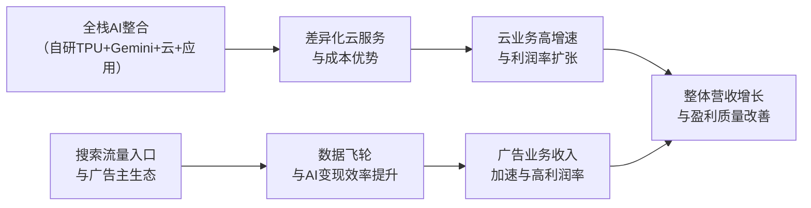

# Gangtise 公司一页通：谷歌（GOOGL.O）

> 拉取日期：2026-07-29 ｜ 来源：gangtise-agent `stock-one-pager`

## 公司概况

谷歌母公司Alphabet是全球最大的数字广告平台与第三大公有云服务商。公司核心业务分为两大板块：**Google Services**（含搜索、YouTube广告、订阅与设备）贡献约79%营收，是利润基石；**Google Cloud**贡献约21%营收，是当前增长主引擎。Alphabet同时是全球AI技术研发的领军者，其自研TPU芯片与Gemini大模型构成了从基础设施到应用层的全栈AI能力。公司拥有Android、Chrome、YouTube等覆盖数十亿用户的生态入口，在搜索市场占据全球约90%份额。  

## 公司近况跟踪

- **云业务爆发式增长，首次确认TPU系统销售收入**：FY2026 Q2 Google Cloud营收同比+82%至247.68亿美元，增速较Q1的+63%进一步大幅跳升。增长由AI基础设施、企业AI解决方案及首次对外销售的TPU系统共同驱动。管理层明确表示，即使剔除TPU销售，云收入增速仍显著加快。云业务积压订单（Backlog）环比增加约520亿美元至**5140亿美元**，其中略超50%预计在未来24个月内确认为收入。   

- **资本开支年内第二次上调，自由现金流转负**：公司将2026全年资本开支指引从1800-1900亿美元上调至**1950-2050亿美元**，并明确2027年资本开支将“显著增加”。Q2资本开支达449亿美元，导致公司上市以来首次出现单季自由现金流转负（-58.55亿美元）。为支撑投资，公司于6月完成普通股、强制可转换优先股及多币种债券发行，净募资近700亿美元，并设立了400亿美元ATM增发计划。    

- **Gemini生态用户指标强劲，但旗舰模型发布延迟**：Gemini App月活用户达**9.5亿**，日活同比翻三倍；API每分钟处理Token数从Q1的160亿增至**220亿**。然而，原计划6月推出的Gemini 3.5 Pro因编码能力未达内部目标而延迟，管理层已将重心转向规模更大的**Gemini 4**预训练，并承诺未来模型迭代频率将加快。     

- **搜索与YouTube广告保持健康增长**：Q2 Google Search & Other收入同比+17%，由零售、金融、科技等行业驱动，AI Overviews与AI Mode带来增量查询。YouTube广告收入同比+13%，受益于Direct Response与品牌广告双轮驱动，以及FIFA世界杯带来的CTV端流量。    

- **为缓解算力瓶颈，引入高价第三方容量**：由于内部算力供给持续受限，公司已与SpaceX签订GPU租赁协议（月费约9.2亿美元），并计划在Q3扩大第三方云容量使用，以承接大型客户多年期合同。管理层坦言此举短期将对云业务利润率形成温和压力。    

## 短期逻辑

1. **云业务增速与利润率能否持续超预期的验证期**：Q2 Google Cloud 82%的增速与35.6%的营业利润率远超市场预期，但管理层已明确指引，随着Q3起第三方高价算力租赁扩大及Wiz整合成本计入，云利润率将承压。未来一个季度，市场将紧密跟踪云收入增速能否在TPU销售爬坡和核心GCP需求支撑下维持高位，以及利润率压缩幅度是否可控。若云业务能在利润率温和回落的同时保持70%以上的增速，将强化市场对AI投入回报的信心；反之，若增速放缓与利润率下行同时发生，将加剧估值压力。     

2. **Gemini 4模型发布成为重塑AI竞争力叙事的关键催化剂**：Gemini 3.5 Pro的延迟发布已引发市场对谷歌在编码和Agent能力上落后于Anthropic和OpenAI的担忧。管理层已将战略重心转向Gemini 4，称其为“规模更大的下一代前沿模型”，并承诺发布后模型迭代将提速至月度级别。Gemini 4若能展现出与GPT-5.6、Claude Opus 4.6等竞品相当甚至领先的编码与推理能力，将有效修复市场对谷歌AI模型竞争力的质疑，并可能触发估值重评。     

3. **资本开支与自由现金流的“压力测试”窗口**：公司Q2自由现金流转负，且2026全年资本开支指引上调至最高2050亿美元，2027年还将“显著增加”。尽管公司通过股权和债务融资储备了大量资金，但市场对AI投入何时能转化为正向自由现金流的耐心正在消磨。未来三个月，任何关于2027年资本开支规模、融资计划或成本优化（如数据中心折旧年限调整）的信号，都将直接影响股价。若管理层能给出2027年资本开支增速放缓或自由现金流改善的路径指引，将是重要的积极信号。     

## 长期逻辑

1. **全栈AI战略构建的“芯片-模型-平台-应用”闭环护城河**：谷歌是目前唯一一家在AI基础设施层（自研TPU芯片、数据中心）、模型层（Gemini系列）、平台层（Vertex AI、Gemini Enterprise）和应用层（搜索、YouTube、Workspace）实现全栈覆盖的科技巨头。这一架构使其能够通过内部协同优化成本结构（TPU降低推理成本）、加速模型迭代（自有算力优先训练前沿模型），并通过应用生态实现商业变现。截至Q2，近90%的财富100强企业使用Gemini Enterprise，超过900万开发者使用谷歌模型，全栈闭环的飞轮效应正在显现。    

2. **云业务从“第三名追赶者”向“AI原生云领导者”的转型机遇**：谷歌云当前全球市场份额约14%，仍落后于AWS和Azure，但在AI云服务这一增量市场中，其竞争力显著强于传统云时代。凭借TPU的性价比优势、Gemini模型的差异化能力，以及对Anthropic等头部AI公司的深度绑定（Anthropic承诺五年2000亿美元支出），谷歌云有望在AI工作负载迁移浪潮中获取超比例份额。Q2积压订单5140亿美元，同比增长近4倍，为未来2-3年的高增速提供了极高可见度。    

3. **AI对核心广告业务的“护城河加固”与“变现效率提升”**：市场曾担忧生成式AI聊天机器人会侵蚀谷歌搜索流量，但实际情况是，AI Overviews和AI Mode带来了增量查询，AI Mode月活已超10亿。更重要的是，AI提升了广告匹配效率和转化率——AI Max广告主转化率提升15%，购物广告相关性提升20%。随着AI Agent能力成熟，谷歌搜索有望从“信息检索入口”升级为“交易闭环平台”（如AI预订、AI购物），进一步拓宽广告业务的变现边界和用户粘性。     

## 风险提示

- **AI资本开支回报不及预期的风险**：公司2026年资本开支预计高达1950-2050亿美元，2027年还将显著增加，但云业务和广告业务的增量利润能否覆盖如此庞大的投资仍存不确定性。若云业务增速放缓或利润率持续承压，市场对AI投资回报周期的担忧将加剧，可能导致估值中枢下移。公司已出现单季自由现金流转负，若该状况持续，将迫使公司进一步依赖外部融资，稀释股东回报。     

- **模型竞争力持续落后于竞争对手的风险**：Gemini 3.5 Pro的延迟发布暴露了谷歌在编码和Agent能力上的短板，而Anthropic和OpenAI已在开发者生态中建立显著优势。若Gemini 4未能展现出与竞品相当的前沿能力，谷歌在吸引AI初创公司和开发者使用其云平台时将面临更大阻力，云业务的增长势头可能受到侵蚀。此外，多名资深AI研究人员近期转投竞争对手，人才流失风险不容忽视。     

- **客户集中度与地缘政治风险**：Anthropic单家客户贡献了谷歌云积压订单中约2000亿美元（近40%），构成显著的客户集中度风险。若Anthropic未来转向自建算力或分散供应商，谷歌云的收入增长将受到较大冲击。此外，谷歌在全球范围内面临多起反垄断诉讼（如美国DOJ搜索案、欧盟广告技术案），可能被迫改变商业模式或支付巨额罚款，增加合规成本与经营不确定性。    

## 近期要闻

- **2026年5月**：谷歌I/O大会发布Gemini 3.5 Flash模型及AI智能眼镜，宣布与Warby Parker、Gentle Monster合作，产品预计秋季上市。  

- **2026年6月**：Alphabet完成大规模融资，包括普通股公开发行（净募资205亿美元）、伯克希尔·哈撒韦定向增发（100亿美元）、强制可转换优先股发行（净募资190亿美元），并设立400亿美元ATM增发计划。同月，谷歌与SpaceX签订GPU租赁协议，月费约9.2亿美元。    

- **2026年7月初**：欧盟法院驳回谷歌对2018年Android反垄断案的上诉，维持41亿欧元罚款，谷歌于7月支付52亿美元罚款及利息。  

- **2026年7月21日**：谷歌发布Gemini 3.6 Flash、3.5 Flash-Lite及3.5 Flash Cyber三款效率模型，同时确认Gemini 4已启动预训练。  

## 未来催化

- **2026年8-9月**：三星Galaxy Glasses智能眼镜（搭载Android XR与Gemini）预计秋季正式上市，这是谷歌在AI可穿戴设备领域挑战Meta Ray-Ban的关键产品落地。  

- **2026年Q3**：Gemini 4模型可能发布。管理层已表示将重心转向Gemini 4，并承诺加快模型迭代频率。若发布时间早于市场预期的Q4，且能力对标前沿，将是重大正面催化。     

- **2026年10月**：谷歌Q3财报发布。市场将重点关注云业务增速在高基数下的可持续性、TPU销售爬坡进度、第三方算力租赁对云利润率的影响幅度，以及管理层对2027年资本开支的初步展望。    

- **2026年下半年**：美国DOJ搜索反垄断案及广告技术反垄断案的后续进展。搜索案中谷歌已提起上诉，广告技术案仍在等待最终判决。任何结构性补救措施（如强制剥离资产）的明确信号都将对股价产生重大影响。  

## 公司业务模式及拆分

**业务边际变化**：公司正处于从“移动互联网广告平台”向“AI原生全栈服务商”的深度转型期。核心变化包括：1）云业务从传统IaaS/PaaS向AI基础设施与平台服务升级，TPU系统对外销售开辟了全新的硬件收入来源；2）搜索业务从关键词匹配转向AI驱动的对话式交互与Agent执行，AI Mode和AI Overviews成为新的用户入口；3）通过Gemini App、AI智能眼镜等产品，公司正积极布局AI时代的消费者端新入口。    

**盈利模式**：公司核心盈利模式仍以广告为主（约占营收72%），通过搜索引擎和YouTube的流量入口，向广告主出售精准投放能力。云业务采用“消费计费+订阅+硬件销售”的混合模式，其中AI训练与推理的算力消耗是增长最快的收入来源。公司赚取的是“技术壁垒溢价”与“规模效应红利”——自研TPU降低了内部算力成本，全栈整合提升了客户粘性，而数十亿用户的生态入口则为广告和AI应用提供了无可替代的分发渠道。  

**业务拆分**：

公司近年业务结构呈现“广告稳、云快、硬件新”的特征。Google Services（含搜索、YouTube、Network广告及订阅/设备）是绝对收入主体，但占比从FY2023的89%逐步降至FY2026 H1的80%，反映云业务的快速扩张。Google Cloud占比从11%升至20%，成为增长主引擎。公司当前处于**AI驱动的产能爬坡与业绩兑现期**——大规模资本开支投向算力基础设施，同时云业务收入和积压订单快速增长，验证了AI投入的商业回报。   

**细分业务拆分（按GAAP口径，单位：亿美元）**

| 业务板块 | FY2023 收入 | FY2023 占比 | FY2024 收入 | FY2024 占比 | FY2025 收入 | FY2025 占比 | FY2026 H1 收入 | FY2026 H1 占比 |
|---|---|---|---|---|---|---|---|---|
| Google Search & Other | 1750.33 | 57% | 1980.84 | 57% | 2245.32 | 56% | 1236.70 | 54% |
| YouTube Ads | 315.10 | 10% | 361.47 | 10% | 403.67 | 10% | 209.38 | 9% |
| Google Network | 313.12 | 10% | 303.59 | 9% | 297.92 | 7% | 142.74 | 6% |
| Google Subscriptions, Platforms & Devices | 346.88 | 11% | 403.40 | 12% | 480.30 | 12% | 252.95 | 11% |
| **Google Services 合计** | **2725.43** | **89%** | **3049.30** | **87%** | **3427.21** | **85%** | **1841.77** | **80%** |
| Google Cloud | 330.88 | 11% | 432.29 | 12% | 587.05 | 15% | 447.96 | 20% |
| Other Bets | 15.27 | 0% | 16.48 | 0% | 15.37 | 0% | 7.93 | 0% |
| Hedging Gains/Losses | 2.36 | 0% | 2.11 | 0% | -1.27 | 0% | -0.74 | 0% |
| **总营收** | **3073.94** | **100%** | **3500.18** | **100%** | **4028.36** | **100%** | **2296.92** | **100%** |

*注：公司未单独披露各细分业务的毛利率。*

**Google Search & Other（FY2026 H1收入占比54%）**：公司最核心的利润来源。收入来自谷歌搜索资产（含AI Overviews、AI Mode）及Gmail、Google Maps等自有平台的广告。Q2收入633亿美元，同比+17%，增长由零售、金融、科技等行业驱动。AI功能带来了增量查询——AI Mode月活超10亿，查询长度是传统搜索的3倍。变现端，AI Max广告主转化率提升15%，购物广告相关性提升20%。量价拆分看，Q2付费点击量同比+13%，单次点击成本同比+3%。    

**YouTube Ads（FY2026 H1收入占比9%）**：收入来自YouTube平台的视频广告。Q2收入111亿美元，同比+13%，由Direct Response和品牌广告双轮驱动，CTV端表现强劲。FIFA世界杯期间，超17亿独立用户观看相关内容。管理层表示YouTube订阅收入增速已快于广告收入。    

**Google Network（FY2026 H1收入占比6%）**：收入来自第三方网站和应用的广告分成。Q2收入73亿美元，同比-1%，延续收缩趋势。主要因AdSense收入下降，部分被AdMob增长抵消。该业务在AI搜索体验提升背景下，结构性承压。    

**Google Subscriptions, Platforms & Devices（FY2026 H1收入占比11%）**：收入来自YouTube订阅（Music/Premium/TV）、Google One（含AI套餐）、Google Play应用商店分成及Pixel设备销售。Q2收入129亿美元，同比+15%，增长主要由YouTube订阅和Google One的AI套餐需求驱动。    

**Google Cloud（FY2026 H1收入占比20%）**：公司增长最快的业务。收入来自GCP（AI基础设施、平台服务、TPU系统销售）、Google Workspace订阅及网络安全服务。Q2收入248亿美元，同比+82%，增速较Q1的+63%大幅跳升。Q2首次确认TPU系统对外销售收入，但管理层强调即使剔除该部分，云收入增速仍显著加快。Q2云业务营业利润88亿美元，营业利润率35.6%，同比提升14.8个百分点。积压订单5140亿美元，其中绝大多数来自典型GCP合同。    

## 核心竞争力

**竞争要素 1：依托全栈AI整合构筑的系统性成本与体验优势**

- **护城河定性**：属于**结构性护城河**。谷歌是全球唯一在AI芯片（TPU）、数据中心、大模型（Gemini）、云平台（Vertex AI）和消费者应用（搜索、YouTube）各层均实现自研与深度整合的科技巨头。这种全栈能力使其能够通过软硬件协同设计实现极致的推理成本效率，同时将AI能力无缝嵌入数十亿用户日常使用的产品中，形成竞争对手难以复制的“芯片-模型-平台-应用”飞轮。    
- **数据验证**：Q2 Google Cloud营业利润率从去年同期的20.7%大幅提升至**35.6%**，在收入同比+82%的同时实现利润率扩张，体现了自研TPU带来的基础设施成本优势。Gemini App月活达**9.5亿**，AI Mode月活超**10亿**，AI Overviews月活达**20亿**，这些用户触达能力是纯模型公司无法比拟的分发优势。    
- **动态演变**：护城河正在**变宽**。随着TPU对外销售开辟新收入来源，以及Gemini模型能力持续追赶前沿，全栈整合的协同效应将进一步增强。但需关注，若Gemini 4未能缩小与竞品在编码和Agent能力上的差距，模型层的短板可能制约上层应用和云服务的竞争力。    

**竞争要素 2：搜索广告业务依托极高转换成本与数据飞轮构筑的持久定价权**

- **护城河定性**：属于**结构性护城河**。谷歌搜索占据全球约90%市场份额，广告主已深度依赖其精准投放能力和ROI衡量体系。AI的引入不仅未削弱这一地位，反而通过提升广告匹配效率和转化率（AI Max转化率+15%），加固了广告主从谷歌获取客户的依赖度。数十亿用户的搜索行为数据持续训练模型，形成“更多用户→更好模型→更高广告效率→更多广告主预算”的数据飞轮。    
- **数据验证**：Q2 Google Search & Other收入633亿美元，同比+17%，在如此大体量下仍实现加速增长。AI功能带来增量查询，且AI Overviews的变现表现与现有搜索持平。Google Services整体营业利润率维持在**41.8%**的高位，体现了广告业务的强大定价权。    
- **动态演变**：护城河**维持稳固**。尽管面临ChatGPT、Perplexity等AI搜索竞品的挑战，但谷歌凭借用户习惯、广告主生态和AI功能整合，目前未见份额流失。长期风险在于，若AI Agent成为新的信息获取入口，用户绕过搜索引擎直接获取服务，可能削弱谷歌的流量枢纽地位。    

**现阶段核心驱动力总结**：谷歌的Alpha来自AI驱动的云业务超高速增长与广告业务效率提升，Beta则受益于全球企业AI采用率提升的行业顺风。公司正从“广告平台”向“AI全栈基础设施+应用生态”转型，这一过程中资本开支强度显著上升，但云业务积压订单和收入增速提供了可见的回报路径。   

**竞争格局传导逻辑图**：

## 产销链

**客户情况**：
- **广告主**：谷歌广告业务服务数百万广告主，客户高度分散，无单一客户依赖。Q2广告收入816亿美元，零售和金融是最大贡献行业。    
- **云客户**：存在显著的客户集中度风险。Anthropic单家客户承诺五年支出约2000亿美元，占云业务积压订单5140亿美元的近**40%**。除Anthropic外，谷歌云还服务近90%的财富100强企业，客户基础广泛。新客户获取速度同比翻倍，现有客户实际使用量超出合同承诺50%以上。    

**供应商情况**：
- **芯片与硬件**：谷歌自研TPU芯片（Broadcom、联发科等协助设计），同时大量采购英伟达GPU。为缓解算力瓶颈，公司还向SpaceX租赁约11万颗GPU。公司正加大TPU部署比例以降低对外部供应商的依赖。    
- **电力与数据中心**：公司通过长期电力购买协议（PPA）和数据中心租赁合同锁定供给。截至Q2，公司已签署的未来采购承诺和其他合同义务总额达**7070亿美元**，其中绝大多数为技术基础设施相关的长期供应协议。此外，还有852亿美元的已签署但未开始的租赁合同（主要为数据中心）。   

**成本转嫁能力**：当上游芯片和能源成本上升时，谷歌具备较强的成本消化与转嫁能力。一方面，自研TPU提供了替代方案，降低了对英伟达GPU的议价依赖；另一方面，云服务的定价权（尤其在AI算力供不应求的环境下）和广告业务的规模效应，使其能够将部分成本压力传导至下游客户或通过运营效率提升内部消化。公司赚取的核心是**技术壁垒溢价**与**规模效应红利**，而非单纯的资源加工费。  

## 财务数据

**关键财务数据（GAAP口径，单位：亿美元）**

| 财务指标 | FY2023 | FY2024 | FY2025 | FY2026 H1 |
|---|---|---|---|---|
| **截止日期** | 2023-12-31 | 2024-12-31 | 2025-12-31 | 2026-06-30 |
| 营业总收入 | 3073.94 | 3500.18 | 4028.36 | 2296.92 |
| 收入同比 | 8.68% | 13.87% | 15.09% | 23.05% |
| 营业成本 | 1333.32 | 1463.06 | 1625.35 | 872.14 |
| 毛利率 | 56.63% | 58.20% | 59.65% | 62.03% |
| 研发费用 | 454.27 | 493.26 | 610.87 | 352.51 |
| 销售及管理费用 | 443.42 | 419.96 | 501.75 | 267.61 |
| 营业利润 | 842.93 | 1123.90 | 1290.39 | 804.66 |
| 营业利润率 | 27.42% | 32.11% | 32.03% | 35.03% |
| 归母净利润 | 737.95 | 1001.18 | 1321.70 | 1746.85 |
| 归母净利润同比 | 23.05% | 35.67% | 32.01% | 178.44% |
| 稀释EPS（美元） | 5.80 | 8.04 | 10.81 | 14.24 |
| 经营活动现金流 | 1017.46 | 1252.99 | 1647.13 | 848.59 |
| 资本开支 | -322.51 | -525.35 | -914.47 | -805.98 |
| 自由现金流 | 694.95 | 727.64 | 732.66 | 42.61 |

*注：FY2026 H1归母净利润包含约1357亿美元的其他收益（主要来自SpaceX和Anthropic等股权投资的未实现收益），剔除该影响后的核心净利润约为390亿美元。*

**财务分析**：

- **成长能力**：公司收入增速连续加速，从FY2023的+8.68%提升至FY2026 H1的+23.05%，主要由云业务爆发驱动。但需注意，FY2026 H1的归母净利润增速（+178%）严重受股权投资未实现收益扭曲，不具备可持续性。剔除该因素后，核心盈利增速约为30-35%，仍属健康。    

- **盈利能力**：毛利率从FY2023的56.63%持续提升至FY2026 H1的62.03%，反映收入结构向高毛利广告业务倾斜及云业务利润率改善。营业利润率从27.42%升至35.03%，但Q2单季营业利润率34.0%较Q1的36.1%小幅回落，主要因研发费用和G&A费用增长较快（Q2研发费用同比+32%）。    

- **现金流与资本开支**：经营活动现金流保持强劲增长（FY2026 H1同比+33%），但资本开支增速更快（同比+103%），导致自由现金流大幅收缩。Q2单季自由现金流转负（-58.55亿美元），为上市以来首次。TTM自由现金流533亿美元，自由现金流收益率约1.2%。公司通过大规模股权和债务融资补充资金，截至Q2末持有现金及有价证券2425亿美元，长期债务982亿美元，净现金状况仍健康。    

## 行业及竞争分析

**数字广告行业**：谷歌在全球数字广告市场占据约39%份额（含搜索与视频），核心竞争对手包括Meta、Amazon Ads及新兴的AI搜索平台（ChatGPT、Perplexity）。行业长期趋势是AI驱动的精准投放与闭环交易——广告平台正从“流量分发”向“交易促成”演进。谷歌凭借搜索意图数据优势和AI Overviews/Mode的整合，在商业查询领域保持强势。但需关注，若消费者习惯转向直接在AI助手中完成交易，谷歌的流量入口地位可能被削弱。  

**云计算行业**：全球公有云市场由AWS（约28%）、Azure（约21%）和谷歌云（约14%）主导。AI云服务是增长最快的细分市场，谷歌凭借自研TPU的性价比优势和Gemini模型的差异化能力，在AI工作负载领域竞争力显著强于传统云时代。Q2谷歌云82%的增速远超AWS（预计约33%）和Azure（预计约40%+），正在快速缩小份额差距。行业关键竞争要素正从“资源规模”转向“AI能力+芯片效率+生态锁定”。  

**可比公司**：

| 公司 | 股票代码 | 云业务收入增速（最新季度） | 云业务营业利润率 | AI战略定位 |
|---|---|---|---|---|
| Amazon (AWS) | AMZN | ~33%（预计） | ~35-38% | 全球最大公有云，自研Trainium/Inferentia芯片，与Anthropic深度合作 |
| Microsoft (Azure) | MSFT | ~40%+（预计） | ~45%+ | 与OpenAI独家合作，Copilot生态全面嵌入Office与Dynamics |
| Meta | META | 不适用（非云厂商） | 不适用 | 开源模型Llama系列，自研MTIA芯片，广告AI化 |
| 谷歌 (Google Cloud) | GOOGL | 82% | 35.6% | 全栈AI整合，自研TPU，Gemini模型，Anthropic为主要客户 |

谷歌云的核心差异化在于**全栈整合能力**——客户可在同一平台上获取自研芯片（TPU）、前沿模型（Gemini）、开发平台（Vertex AI）和企业应用（Workspace），而AWS和Azure在芯片层更依赖第三方（英伟达/AMD）。但谷歌云的规模仍显著小于AWS和Azure，且对Anthropic单一客户的依赖度较高。    

## 市场焦点议题

**议题一：AI资本开支的回报率与自由现金流拐点**

- **背景**：谷歌2026年资本开支指引已上调至1950-2050亿美元，2027年还将“显著增加”，而Q2自由现金流首次转负。市场对巨额AI投入何时能产生正向现金流回报的耐心正在消磨。历史上，科技行业的大规模基础设施投资周期（如3G/4G、云计算早期）都曾经历“投入期股价承压→回报期估值扩张”的过程。    
- **问题列表**：
  - 云业务积压订单5140亿美元中，有多少能在未来2-3年内转化为实际收入和利润？
  - 2027年资本开支的“显著增加”具体规模是多少？是否已接近峰值？
  - 公司是否考虑通过延长数据中心折旧年限等方式优化账面利润率？
  - 若AI投入回报不及预期，公司有何资本配置的调整机制（如缩减回购、控制开支）？

**议题二：Gemini模型竞争力与人才流失风险**

- **背景**：Gemini 3.5 Pro因编码能力未达标而延迟发布，多位资深AI研究人员近期转投OpenAI和Anthropic。市场担忧谷歌在AI模型竞赛中正从“第一梯队”滑落，而模型能力直接关系到云业务的客户吸引力和广告业务的变现效率。     
- **问题列表**：
  - Gemini 4能否在编码、Agent能力和推理基准测试中达到或超越GPT-5.6和Claude Opus 4.6的水平？
  - 公司采取了哪些措施来留住核心AI研究人才？算力资源分配是否构成人才流失的原因之一？
  - 若自研模型持续落后，公司是否考虑加大对第三方模型（如Anthropic Claude）的依赖？

**议题三：云业务客户集中度与增长可持续性**

- **背景**：Anthropic单家客户贡献了云业务积压订单的近40%。虽然谷歌云也在服务广泛的财富100强企业，但Anthropic的超大规模合同对短期增速的拉动作用不可忽视。    
- **问题列表**：
  - 剔除Anthropic后，云业务的有机增速是多少？积压订单的客户构成如何？
  - Anthropic合同的生命周期价值与利润率是否与其他客户可比？
  - 若Anthropic未来自建算力或分散供应商，谷歌云有何应对策略？

## 市场分歧探讨

**核心分歧：谷歌当前的AI大规模投资是“泡沫前夜的盲目扩张”还是“长期护城河的前瞻性构建”？**

**看多方逻辑**：认为AI投资正在产生可验证的商业回报。核心论据包括：1）云业务Q2增速82%，积压订单5140亿美元，需求远超供给，证明AI算力市场空间巨大；2）云业务利润率从20.7%提升至35.6%，说明自研TPU带来了结构性成本优势，并非单纯“烧钱换规模”；3）AI对搜索广告的赋能已体现为收入加速（+17%）和转化率提升，核心业务护城河在加固而非削弱；4）公司全栈AI战略（芯片-模型-平台-应用）构建了竞争对手难以复制的系统性优势。    

**谨慎方逻辑**：担忧资本开支规模已超出合理回报的边界。核心论据包括：1）2026年资本开支1950-2050亿美元，已超过TTM经营现金流（1860亿美元），自由现金流转负，公司不得不通过股权和债务融资支撑投资，稀释股东价值；2）Gemini模型在编码和Agent能力上仍落后于Anthropic和OpenAI，若模型层无法达到前沿水平，上层应用和云服务的竞争力将受制约；3）云业务对Anthropic单一客户依赖度过高，收入质量存疑；4）历史上，科技行业大规模基础设施投资周期往往伴随产能过剩和回报率低于预期（如2000年光纤泡沫）。     

**综合分析**：当前谷歌的AI投资与2000年互联网泡沫存在本质区别——彼时需求是预期的，而谷歌云5140亿美元的积压订单和82%的增速表明需求是真实且超预期的。但谨慎方的担忧也不无道理：资本开支增速远超经营现金流增速，且模型竞争力存在不确定性。关键观察变量是：1）云业务能否在2027-2028年维持50%以上的增速并实现正向自由现金流；2）Gemini 4能否证明谷歌仍处于模型能力第一梯队。若两个条件均满足，当前投资将被视为前瞻性布局；若均不满足，则可能面临估值与盈利双杀。    

## 盈利预测与估值

**管理层最新指引**：
- 2026全年资本开支上调至**1950-2050亿美元**（此前为1800-1900亿美元）。    
- 2027年资本开支将“显著增加”，但未给出具体数字。    
- Q3汇率将对合并收入形成轻微负面影响；Search将面临去年同期增长加速后的较高基数。    
- 云业务强劲需求将持续，TPU系统销售将在2026年下半年逐步爬坡，但绝大多数收入将在2027年实现。    
- 随着技术基础设施投资扩大，折旧、数据中心运营成本和第三方容量使用将持续影响利润率与自由现金流。    

**券商盈利预测与估值（单位：亿美元，除EPS和目标价外）**

| 机构 | 评级 | 目标价（美元） | 财务指标 | FY2025A | FY2026E | FY2027E | FY2028E |
|---|---|---|---|---|---|---|---|
| 摩根士丹利 (2026-07-27) | Overweight | 400 | 营收 | 4028 | 5006 | 6535 | 7936 |
| | | | GAAP EPS | 10.81 | 20.62 | 15.08 | 18.16 |
| | | | 营业利润 | 1290 | 1764 | 2275 | 2809 |
| 花旗 (2026-07-23) | Buy | 447 | 营收 | 4028 | 4962 | 6404 | 7737 |
| | | | GAAP EPS | 10.81 | 20.67 | 15.72 | 19.06 |
| 瑞银 (2026-07-24) | Neutral | 379 | 营收 | 4028 | 5198 | 6689 | 6605 |
| | | | GAAP EPS | 10.81 | 20.99 | 17.21 | 13.52 |
| 伯恩斯坦 (2026-07-24) | Market-Perform | 385 | 营收 | 4028 | 4961 | 6169 | - |
| | | | GAAP EPS | 10.81 | 20.84 | 15.26 | - |

**盈利预期与估值分析**：

机构间对FY2026-FY2027的营收预测分歧较大，FY2027营收预测区间为6169-6689亿美元，反映对云业务增速和TPU销售的不同假设。EPS预测分歧更为显著——FY2026 EPS受股权投资未实现收益的扭曲（Q2单季贡献约6美元EPS），各机构对全年EPS的预测在20.62-20.99美元之间；FY2027 EPS预测区间为15.08-17.21美元，核心分歧在于资本开支带来的折旧压力与云业务利润贡献的平衡。     

估值方法上，摩根士丹利（400美元）和花旗（447美元）采用P/E估值，分别给予24倍和28倍FY2027/FY2028平均EPS，看好云业务高增长带来的估值溢价。瑞银（379美元）和伯恩斯坦（385美元）则更为谨慎，瑞银采用26倍P/E，伯恩斯坦采用50/50的EV/EBIT与DCF混合估值，并将EV/EBIT倍数从28倍下调至24倍，以反映“盈利质量下降”（自由现金流转负、股权稀释）。     

整体而言，看多方（花旗、摩根士丹利）认为云业务增速和利润率扩张将支撑估值溢价，看谨慎方（瑞银、伯恩斯坦）则担忧资本开支对自由现金流和股东回报的持续压力。当前市场定价更接近谨慎方预期。
