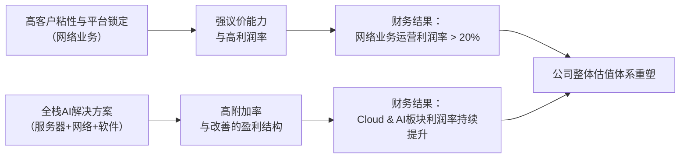

<!-- 匹配到的证券/行业：慧与(HPE.N) -->
操作成功

### 一页通 （慧与 (HPE.N)）
日期：2026-08-05
内容："""
## 公司概况

慧与是一家全球性的边缘到云（Edge-to-Cloud）平台即服务公司，核心业务是为企业提供AI时代所需的关键数字基础设施。公司通过三大业务板块运营：<strong>Cloud & AI</strong>（含AI服务器、传统服务器、存储和金融服务）、<strong>Networking</strong>（含园区与分支、数据中心网络、路由和安全）以及<strong>Corporate Investments and Other</strong>。在完成对Juniper Networks的收购后，慧与已从一家以服务器为主的硬件供应商，转型为一家以<strong>高利润的网络业务为核心利润引擎</strong>、并具备完整AI基础设施堆栈交付能力的公司。其客户覆盖从中小企业到全球大型企业和政府机构。  

## 公司近况跟踪

- <strong>FY2026 Q2业绩大幅超预期并上调全年指引</strong>：公司于2026年6月2日发布的FY2026 Q2财报显示，总营收<strong>107亿美元</strong>，同比增长<strong>40%</strong>，远超此前<strong>96-100亿美元</strong>的指引。Non-GAAP摊薄每股收益（EPS）为<strong>0.79美元</strong>，远超<strong>0.51-0.55美元</strong>的指引。基于强劲的订单和积压订单，管理层将FY2026全年Non-GAAP摊薄EPS指引上调至<strong>3.35-3.45美元</strong>（此前为约2.30-2.50美元），并将自由现金流指引上调至<strong>至少35亿美元</strong>。  

- <strong>提前两年实现财务目标并发布FY2027框架</strong>：管理层表示，FY2026的业绩表现使其提前两年实现了原定于FY2028的EPS和自由现金流目标。同时，公司发布了FY2027的初步增长框架，预计营收增长<strong>8%-12%</strong>，Non-GAAP摊薄EPS增长<strong>12%-16%</strong>，自由现金流至少<strong>45亿美元</strong>。 

- <strong>Juniper整合进展超预期，网络业务成核心增长引擎</strong>：收购Juniper Networks后，公司在五个月内完成了1万名员工的整合，统一了销售团队，并发布了涵盖四大网络领域的联合产品路线图。管理层表示，第一年的协同效应目标（超过2亿美元）正<strong>超前完成</strong>。网络业务需求强劲，订单同比增长<strong>20%</strong>，远超营收增速。  

- <strong>AI服务器积压订单创纪录，传统服务器需求爆发</strong>：FY2026 Q2 AI系统订单达<strong>18亿美元</strong>，累计AI订单达<strong>164亿美元</strong>，AI积压订单达<strong>59亿美元</strong>（后更新为<strong>63亿美元</strong>）。传统服务器订单同比增长<strong>三位数</strong>，主要由企业为部署AI而进行的现代化改造和推理工作负载驱动。  

- <strong>完成H3C股权出售，加速去杠杆</strong>：公司于2026年5月完成了其在中国H3C公司剩余股权的出售，总现金对价约<strong>13.6亿美元</strong>。此举不仅简化了公司结构，消除了地缘政治风险，所得现金将用于加速偿还债务，使净杠杆率目标（2倍）的实现时间从FY2027年底提前至<strong>FY2026年底</strong>。  

## 短期逻辑

1.  <strong>AI驱动的服务器升级周期正在从GPU扩展至CPU，打开更大市场空间</strong>：市场此前对慧与的AI叙事主要聚焦于搭载GPU的AI服务器，但近期财报和调研显示，由Agentic AI和推理工作负载驱动的<strong>传统服务器需求正在爆发</strong>。管理层在2026年6月的投资者峰会上指出，传统服务器订单同比增长三位数，客户正积极将老旧的7台服务器整合为1台新一代服务器，以节省<strong>65%的能源</strong>并提升性能。这一由AI引发的、覆盖更广的IT基础设施现代化周期，为慧与的Cloud & AI业务提供了超越纯AI服务器的新增长维度，其持续性和利润率可能超出市场预期。  

2.  <strong>网络业务的结构性高增长和利润率扩张故事刚开始被市场定价</strong>：慧与完成Juniper收购后，网络业务已成为其核心利润引擎。在FY2026 H1，网络业务以<strong>27%的营收</strong>贡献了约<strong>44%</strong> 的分部运营利润。管理层在2026年7月的投资者交流中透露，AI网络（Networks for AI）的累计订单到FY2026年底将超过<strong>20亿美元</strong>，且公司在数据中心互联（DCI）、Scale-Out和Scale-Up网络领域均有新产品布局。随着Juniper协同效应的持续释放（目标为到FY2028年实现<strong>6亿美元</strong>的年化成本节约），网络业务的运营利润率有望从当前的<strong>21.6%</strong> 向FY2027指引的<strong>中高20%区间</strong>攀升。这一利润结构的质变，是驱动公司整体估值体系从“低利润硬件商”向“高价值网络平台”切换的关键催化剂。  

3.  <strong>资本回报加速的催化剂已确立，但尚未完全反映在股价中</strong>：公司已明确表示，由于H3C出售和强劲的现金流，其净杠杆率将在<strong>FY2026年底</strong>降至2倍的目标，比原计划提前一年。管理层承诺，在此之后将把<strong>约75%的自由现金流返还给股东</strong>，形式包括更具规模的股票回购和持续增长的股息。考虑到FY2027至少<strong>45亿美元</strong>的自由现金流指引，这意味着超过<strong>33亿美元</strong>的潜在股东回报规模。这一明确的、即将启动的大规模资本回报计划，为股价提供了坚实的下行保护，并有望吸引注重现金回报的增量资金。 

## 长期逻辑

1.  <strong>从“卖箱子”到“卖平台”：网络业务构筑长期护城河</strong>：慧与通过收购Juniper，获得了从园区到数据中心、从路由到安全的完整网络产品组合，以及关键的<strong>自研芯片能力</strong>（如Trio、Express系列）和<strong>AI运维平台（Mist）</strong>。管理层在2026年6月的Discover大会上强调，网络已成为AI基础设施的<strong>核心瓶颈和主要性能制约点</strong>，而慧与是唯一能提供覆盖Scale-Up、Scale-Out和Scale-Across全架构网络解决方案的厂商。这种“自驱动网络”的战略定位，将客户关系从一次性硬件销售转变为深度集成的平台型合作，<strong>客户转换成本极高</strong>。随着AI数据中心建设的持续，网络的价值量占比（约<strong>15%</strong>）和战略重要性将持续提升，为慧与带来长期的、高利润的经常性收入。 

2.  <strong>混合云和AI推理的长期趋势与慧与的“边缘到云”战略高度契合</strong>：管理层判断，到2030年，<strong>至少80%的AI计算需求将来自推理</strong>，且大量企业出于数据安全、合规和成本（Tokenomics）考虑，会将推理工作负载部署在本地或边缘。慧与的HPE GreenLake平台和Private Cloud AI解决方案，正是为企业提供这种从边缘到云的统一、安全的混合AI部署和管理体验。通过将AI工厂、网络、存储和软件服务打包，慧与能够显著提高单客户价值（“附加率”），并从传统的资本支出（CapEx）模式向更具粘性的运营支出（OpEx）和订阅模式转型，增强长期收入和利润的可预见性。 

3.  <strong>主权AI和超级计算领导地位提供独特的、高壁垒的增长赛道</strong>：慧与在超级计算领域拥有绝对领先地位（如为美国国家实验室打造了全球最快的三台超级计算机），这使其在主权AI这一新兴市场中占据了独特的卡位优势。主权AI客户（政府、国防、受监管行业）对技术自主、数据安全和长期信任有极高要求，这构成了天然的进入壁垒。管理层在2026年6月的投资者峰会上透露，公司正在与<strong>12-15个</strong>主权AI项目合作。这些项目周期长、金额大，且能带动高利润的网络、软件和服务销售，为慧与提供了超越传统商业市场竞争的、可持续的增长动力。 

## 风险提示

- <strong>供应链约束与成本通胀风险</strong>：公司明确表示，<strong>供应而非需求是当前增长的主要瓶颈</strong>。内存（DRAM）、NAND、CPU等关键组件供应紧张，且成本持续上涨。尽管公司通过长期协议（LTA）和提价策略积极管理，但DRAM成本已占服务器物料清单的<strong>60%以上</strong>。若成本上涨速度超过提价能力，或供应中断导致无法按时交付，将对公司的营收增长和利润率造成压力。管理层预计通胀环境将至少持续到2027年。  

- <strong>Juniper整合与执行风险</strong>：尽管目前整合进展顺利，但完成对Juniper这一价值约140亿美元的收购仍存在长期执行风险。实现<strong>6亿美元</strong>的年化成本协同效应、有效交叉销售产品、以及整合复杂的研发和销售团队，均可能遇到挑战。若协同效应释放不及预期，或整合过程中出现客户流失，将对公司的增长和盈利目标构成威胁。FY2026 Q2网络业务运营利润率（<strong>21.6%</strong>）同比和环比均有所下降，部分反映了整合初期的成本压力。 

- <strong>AI服务器业务的低利润率与周期性风险</strong>：尽管AI服务器带来了巨大的营收增长，但其本质上是“低利润率的走量业务”，尤其是面向超大规模客户的销售。公司对此采取选择性参与策略，优先考虑主权和企业客户。然而，若市场竞争加剧导致价格战，或AI资本开支周期出现波动，该部分业务可能拖累公司整体盈利能力，并导致应收账款和库存风险增加。 

## 近期要闻

- <strong>2026年5月13日/28日</strong>：慧与完成其在中国H3C公司剩余<strong>19%</strong> 股权的出售，总现金对价约<strong>13.6亿美元</strong>。此举标志着公司彻底退出中国网络市场，消除了长期的地缘政治风险，并获得了大量现金以加速去杠杆。 

- <strong>2026年6月2日</strong>：慧与发布FY2026 Q2财报，营收和EPS均大幅超出市场预期。公司同时大幅上调了FY2026全年业绩指引，并首次提供了强劲的FY2027增长框架，引发股价在盘后交易中大幅上涨约28%。  

- <strong>2026年6月16-18日</strong>：慧与在拉斯维加斯举办年度Discover大会。会上，公司发布了以网络为核心的AI基础设施战略，推出了多款针对AI数据中心的网络新产品（如QFX5252、QFX5250交换机），并展示了与NVIDIA和AMD的深度合作。管理层在投资者峰会上进一步阐述了需求的持久性和对FY2027指引的信心。 

## 未来催化

- <strong>2026年9月初（预计）</strong>：慧与将发布FY2026 Q3财报。鉴于管理层已提供强劲的季度指引（营收<strong>115-121亿美元</strong>，Non-GAAP摊薄EPS <strong>0.88-0.93美元</strong>），且公司积压订单创纪录，市场将高度关注公司是否能再次超越指引，以及是否会进一步上调全年业绩展望。 

- <strong>2026年9月-10月</strong>：AMD Helios AI机架系统预计将开始向客户发货。慧与是该系统的独家网络合作伙伴（提供QFX5252交换机）。该产品的市场接受度和早期客户反馈，将是验证慧与在Scale-Up AI网络领域竞争力的关键催化剂，并可能成为公司切入超大规模服务器市场的新入口。 

- <strong>2026年下半年</strong>：随着公司净杠杆率在FY2026年底达到2倍目标，市场预期公司将公布具体的、大规模的股东资本回报计划（如加速股票回购）。该计划的细节和规模将成为直接催化股价的重要因素。 

## 公司业务模式及拆分

### 业务边际变化

慧与近年来最核心的业务变化是通过收购Juniper Networks，将业务重心从传统的服务器/存储转向<strong>以网络为核心、覆盖AI基础设施全栈的平台型公司</strong>。自FY2026 Q1起，公司将报告分部重组为Cloud & AI、Networking和Corporate Investments and Other，以反映这一战略转型。同时，公司完成了对H3C股权的全部出售，彻底退出了中国网络市场，简化了公司结构并聚焦于西方市场。  

### 盈利模式

慧与的盈利模式正从传统的硬件销售向<strong>平台化、高附加值服务</strong>转型。其盈利主要依靠：1）<strong>技术壁垒与产品差异化</strong>：在网络领域，通过自研芯片和AI运维平台（Mist）提供独特价值，获取高毛利；2）<strong>全栈解决方案的“附加率”</strong>：通过将服务器、存储、网络、软件和服务打包成AI工厂或GreenLake平台，提高单客户价值；3）<strong>客户粘性与转换成本</strong>：尤其是在网络和存储业务中，一旦客户采用其平台，替换成本极高；4）<strong>金融服务</strong>：通过提供融资和租赁服务，降低客户采购门槛，并赚取金融收入。  

### 业务拆分

公司自FY2026 Q1起采用新的业务分部结构。新结构下，<strong>Cloud & AI</strong> 是最大的收入来源，但<strong>Networking</strong> 是利润最高的板块，且增速最快。公司当前处于<strong>业绩兑现期</strong>和<strong>由AI驱动的IT基础设施升级周期</strong>的早期阶段。 

<strong>细分业务拆分（新口径）</strong>

| 业务板块 (单位：亿美元) | FY2024 收入 | FY2024 收入占比 | FY2024 运营利润率 | FY2025 收入 | FY2025 收入占比 | FY2025 运营利润率 | FY2026 H1 收入 | FY2026 H1 收入占比 | FY2026 H1 运营利润率 |
| :--- | :--- | :--- | :--- | :--- | :--- | :--- | :--- | :--- | :--- |
| <strong>Networking</strong> | - | - | - | - | - | - | <strong>53.96</strong> | <strong>27.0%</strong> | <strong>22.6%</strong> |
| <strong>Cloud & AI</strong> | - | - | - | - | - | - | <strong>140.41</strong> | <strong>70.3%</strong> | <strong>11.4%</strong> |
| 其中：Server | - | - | - | - | - | - | <strong>96.86</strong> | <strong>48.5%</strong> | - |
| 其中：Storage | - | - | - | - | - | - | <strong>22.36</strong> | <strong>11.2%</strong> | - |
| 其中：Financial Services | - | - | - | - | - | - | <strong>17.80</strong> | <strong>8.9%</strong> | - |
| <strong>Corporate Investments and Other</strong> | - | - | - | - | - | - | <strong>5.42</strong> | <strong>2.7%</strong> | <strong>-3.9%</strong> |
| <strong>HPE合计</strong> | <strong>301.27</strong> | <strong>100%</strong> | <strong>7.3%</strong> | <strong>342.96</strong> | <strong>100%</strong> | <strong>-1.3%</strong> | <strong>199.79</strong> | <strong>100%</strong> | <strong>6.1%</strong> |

*注：新口径下历史财年（FY2024/FY2025）的分部数据未在本次提供资料中重述，故以“-”表示。运营利润率均为GAAP口径。*

<strong>Networking (FY2026 H1)</strong>

该板块是公司战略转型的核心，FY2026 H1营收<strong>53.96亿美元</strong>，GAAP运营利润率为<strong>22.6%</strong>。其强劲增长主要由收购Juniper Networks带来的并表效应驱动。板块内包含：
- <strong>Campus & Branch</strong>：营收<strong>25.49亿美元</strong>，同比增长<strong>46.2%</strong>（标准化增长约10%）。受Wi-Fi 7升级周期和AI运维平台（Mist）的差异化优势驱动。 
- <strong>Data Center Networking</strong>：营收<strong>7.64亿美元</strong>，同比增长<strong>306.4%</strong>（标准化增长约6%）。增长来自AI数据中心对高性能交换机的强劲需求。 
- <strong>Security</strong>：营收<strong>5.28亿美元</strong>，同比增长<strong>133.6%</strong>（标准化增长约16%）。 
- <strong>Routing</strong>：营收<strong>15.55亿美元</strong>，是Juniper带来的全新业务线，主要服务于AI数据中心的互联（DCI）。 

<strong>Cloud & AI (FY2026 H1)</strong>

该板块是公司最大的收入来源，FY2026 H1营收<strong>140.41亿美元</strong>，GAAP运营利润率为<strong>11.4%</strong>。其增长主要由AI驱动的服务器ASP（平均售价）大幅上涨推动。 
- <strong>Server</strong>：营收<strong>96.86亿美元</strong>，同比增长<strong>14.5%</strong>。增长主要由更高的ASP驱动，传统服务器需求因企业AI现代化改造而爆发，AI服务器积压订单创纪录。 
- <strong>Storage</strong>：营收<strong>22.36亿美元</strong>，同比增长<strong>1.5%</strong>。增长相对温和，但Alletra MP产品需求强劲，连续多季度实现三位数增长。 
- <strong>Financial Services</strong>：营收<strong>17.80亿美元</strong>，同比增长<strong>2.9%</strong>。为客户的IT投资提供融资和租赁服务。 

## 核心竞争力

<strong>竞争要素 1：依托极高转换成本与平台粘性的网络业务护城河</strong>

-   <strong>护城河定性</strong>：<strong>结构性护城河</strong>。慧与通过收购Juniper，构建了覆盖园区、数据中心、路由和安全的完整网络产品组合，并拥有自研芯片和AI运维平台（Mist）。一旦客户将网络基础设施深度集成到其IT架构中，并依赖Mist平台进行自动化运维，其替换成本极高，形成了强大的客户粘性。  
-   <strong>数据验证</strong>：网络业务的GAAP运营利润率在FY2026 H1达到<strong>22.6%</strong>，显著高于公司整体水平（<strong>6.1%</strong>）和Cloud & AI板块（<strong>11.4%</strong>），这是其强议价能力和高客户粘性的直接财务体现。管理层目标到FY2027年将该利润率提升至<strong>中高20%区间</strong>。 
-   <strong>动态演变</strong>：<strong>护城河变宽（巩固）</strong>。随着Juniper整合的深入，协同效应释放，以及AI数据中心对网络依赖性的增强，慧与的网络产品组合和技术领先优势将进一步巩固。公司正在将自驱动网络能力扩展到路由和安全领域，并计划在下一代交换机芯片层面融合网络与安全功能，这将持续拉大与竞争对手的差距。 

<strong>竞争要素 2：依托先发规模与全栈整合能力的AI基础设施优势</strong>

-   <strong>护城河定性</strong>：<strong>行业阶段性红利</strong>，但正通过全栈整合向结构性护城河演进。慧与在AI服务器和超级计算领域的早期布局使其获得了显著的先发规模优势，AI系统累计订单已超<strong>164亿美元</strong>。但单纯的服务器销售壁垒较低，公司正通过将网络、存储、软件和服务整合成“AI工厂”和GreenLake平台，提供一站式解决方案，从而提升客户粘性。 
-   <strong>数据验证</strong>：Cloud & AI板块的运营利润率从FY2025 Q2的<strong>6.6%</strong> 提升至FY2026 Q2的<strong>12.4%</strong>，表明“附加率”策略正在生效，高利润的网络、软件和服务正在改善该板块的盈利结构。AI积压订单中，<strong>61%</strong> 来自主权和企业客户，这类订单的利润率通常优于超大规模客户订单。  
-   <strong>动态演变</strong>：<strong>护城河变宽（巩固）</strong>。随着AI工作负载从训练转向推理，企业客户对本地部署和混合云解决方案的需求将增加，这恰好是慧与全栈解决方案的优势所在。公司正通过Private Cloud AI等产品，将硬件优势转化为平台和生态优势，从而构建更深层次的护城河。 

<strong>现阶段核心驱动力总结</strong>：
公司的Alpha来源于其战略转型——通过收购Juniper，将业务重心转向高利润、高粘性的网络业务，并利用AI浪潮，从单纯的服务器供应商升级为全栈AI基础设施平台提供商。其Beta则受益于宏观的AI资本开支周期和企业IT现代化浪潮。 

<strong>竞争格局传导逻辑图</strong>：

## 产销链

- <strong>客户情况</strong>：公司客户基础广泛且分散，涵盖中小企业、大型企业和政府机构。FY2025年报披露，有一家分销商占公司总营收约<strong>10%</strong>，主要集中在服务器和网络板块，存在一定的客户集中度风险。公司正积极拓展主权AI和企业级AI客户，这类客户的订单周期长、粘性高，有助于优化客户结构。AI积压订单中，主权和企业客户占比达<strong>61%</strong>。  

- <strong>供应商情况</strong>：公司依赖全球供应链，对某些关键组件存在单一或有限来源依赖，例如CPU（Intel、AMD）、GPU（NVIDIA）和网络芯片（Broadcom）。管理层在2026年6月的投资者峰会上表示，慧与是<strong>Broadcom最大的OEM合作伙伴</strong>，这为其在网络芯片供应上带来一定优势。为应对内存等组件的供应紧张和成本上涨，公司已与主要供应商签订了<strong>长达五年的长期协议（LTA）</strong>，以保障FY2027的供应。  

- <strong>经销商情况</strong>：公司采用直销和渠道销售相结合的模式，<strong>超过70%</strong> 的业务通过合作伙伴生态系统完成。FY2025年报提到，有一家分销商占公司总营收的10%，凸显了渠道伙伴的重要性。Juniper整合后，公司正在优化和统一销售渠道，以消除重叠并实现交叉销售。 

- <strong>成本传导能力</strong>：当上游原材料（如DRAM内存）涨价时，公司具备一定的成本转嫁能力。管理层在2026年6月的会议上表示，公司率先在2025年11月提价，并成功与客户重新谈判合同条款，客户因理解全行业的成本压力而接受。公司赚取的是<strong>技术整合与平台服务溢价</strong>，而非单纯的“加工费”或“周期资源钱”。 

## 财务数据

<strong>关键财务数据</strong>

| 指标 (单位：亿美元) | FY2023 (截止2023-10-31) | FY2024 (截止2024-10-31) | FY2025 (截止2025-10-31) | FY2026 H1 (截止2026-04-30) |
| :--- | :--- | :--- | :--- | :--- |
| <strong>营业总收入</strong> | 291.35 | 301.27 | 342.96 | 199.79 |
| 收入同比 | 2.24% | 3.40% | 13.84% | 29.05% |
| <strong>营业成本</strong> | 188.96 | 202.49 | 239.19 | 127.39 |
| <strong>毛利润</strong> | 102.39 | 98.78 | 103.77 | 72.40 |
| <strong>毛利率</strong> | 35.1% | 32.8% | 30.3% | 36.2% |
| <strong>营业利润</strong> | 20.89 | 21.90 | -4.37 | 12.17 |
| 营业利润率 | 7.2% | 7.3% | -1.3% | 6.1% |
| <strong>归母净利润</strong> | 20.25 | 25.54 | -0.59 | 10.18 |
| 归母净利润同比 | 133.29% | 26.12% | -102.31% | 311.64% |
| <strong>稀释每股收益 (美元)</strong> | 1.54 | 1.93 | -0.04 | 0.75 |
| <strong>自由现金流</strong> | 22.38 | 22.97 | 9.86 | 16.23 |

*注：自由现金流数据来自公司年报/半年报MD&A部分的Non-GAAP披露。FY2025营业利润和归母净利润为负，主要受收购Juniper相关的一次性费用和<strong>16.21亿美元</strong>的商誉减值影响。*

<strong>财务分析</strong>

- <strong>成长能力</strong>：公司营收在FY2025和FY2026 H1加速增长，主要驱动力来自收购Juniper带来的并表效应和AI驱动的服务器ASP上涨。FY2026 H1营收同比增长<strong>29.05%</strong>，若剔除Juniper影响，标准化增长约为<strong>高双位数</strong>，仍属强劲。 

- <strong>盈利能力</strong>：GAAP毛利率在FY2025触底（<strong>30.3%</strong>）后，于FY2026 H1大幅反弹至<strong>36.2%</strong>，这得益于高利润的网络业务占比提升和服务器业务的定价纪律。Non-GAAP毛利率也从FY2025的<strong>31.5%</strong> 提升至FY2026 H1的<strong>36.7%</strong>。营业利润率在FY2025因商誉减值而失真，FY2026 H1恢复至<strong>6.1%</strong>，Non-GAAP营业利润率则达到<strong>13.0%</strong>，显示出核心业务的盈利能力显著改善。 

- <strong>运营能力</strong>：FY2026 H1的现金转换周期为<strong>23天</strong>，较FY2025年末的30天有所改善。但存货周转天数（DOS）从FY2025年末的89天升至FY2026 Q2末的<strong>120天</strong>，主要因公司为应对下半年强劲的AI系统出货而主动增加库存。应收账款周转天数（DSO）也从49天升至53天。 

- <strong>偿债能力</strong>：为收购Juniper，公司杠杆率大幅提升。FY2025末的净债务达到<strong>165.92亿美元</strong>。但公司现金流强劲，并已通过出售H3C股权获得资金，管理层预计在<strong>FY2026年底</strong>将净杠杆率降至2倍的目标。  

## 行业及竞争分析

慧与主要参与<strong>AI基础设施</strong>和<strong>企业网络</strong>两大市场。  

- <strong>AI基础设施市场</strong>：该市场正处于由生成式AI驱动的爆发式增长期。花旗模型预测，2026年全球AI服务器支出将达<strong>6136亿美元</strong>，同比增长<strong>91.5%</strong>。市场正从以训练为主（当前约占70%）转向以推理为主，慧与管理层预计到2030年<strong>至少80%</strong> 的需求将来自推理。竞争格局方面，慧与在AI服务器领域的主要竞争对手是Dell和Supermicro。慧与的差异化策略在于聚焦主权和企业客户，提供全栈解决方案，而非单纯参与低利润的超大规模服务器竞争。 

- <strong>企业网络市场</strong>：该市场正受益于AI数据中心建设和企业园区网络现代化（如Wi-Fi 7）的双重驱动。慧与管理层引用行业数据指出，网络设备占AI数据中心建设成本的约<strong>15%</strong>，是一个巨大的新增市场。在园区交换机、数据中心交换机、路由器和安全等多个细分市场，慧与（含Juniper）与<strong>Cisco</strong>形成全面竞争，并在特定领域与<strong>Arista</strong>、<strong>Palo Alto Networks</strong>等公司竞争。慧与的竞争优势在于其通过收购Juniper获得的完整产品组合、自研芯片能力和AI运维平台（Mist）。 

<strong>可比公司分析</strong>

| 公司名称 | 股票代码 | 慧与 vs. 可比公司 |
| :--- | :--- | :--- |
| <strong>Dell Technologies</strong> | DELL | 同为顶级AI服务器供应商，但慧与的网络业务更强大，且正通过全栈解决方案提升利润率；Dell的营收增速更快，但整体利润率较低。 |
| <strong>Cisco Systems</strong> | CSCO | 企业网络市场的传统领导者，慧与通过收购Juniper成为其最直接的挑战者。慧与在AI数据中心网络和自驱动网络方面攻势迅猛。 |
| <strong>Arista Networks</strong> | ANET | 在高速数据中心交换机领域是强劲对手。慧与通过Juniper的QFX系列和自研芯片能力与其竞争，并具备更广泛的产品线。 |

总结来看，慧与正处在一个独特的位置：它既能在AI服务器市场与Dell等公司竞争，又能在高利润的网络市场挑战Cisco和Arista。其“全栈”能力使其能够提供从计算到网络的一体化解决方案，这是其关键的差异化优势。 

## 市场焦点议题

- <strong>议题一：FY2027增长框架的可持续性与保守性</strong>
    - <strong>背景</strong>：公司提前提供了强劲的FY2027增长指引，但市场对其可持续性存在疑虑，担心当前需求是否为“抢跑”或一次性拉动。 
    - <strong>问题列表</strong>：
        1.  FY2027 <strong>8%-12%</strong> 的营收增长指引中，有多少是由已确认的积压订单和供应协议支撑的？
        2.  在AI服务器ASP因通胀而大幅上涨的背景下，未来的增长将更多由<strong>单位销量</strong>还是<strong>价格</strong>驱动？
        3.  管理层称网络业务指引是基于“订单转化能力”而非“订单增长”，这是否意味着指引偏保守，存在上行空间？

- <strong>议题二：利润率扩张的路径与天花板</strong>
    - <strong>背景</strong>：公司毛利率和营业利润率在FY2026 H1显著改善，但市场对其未来能否持续扩张，以及扩张的驱动力存在分歧。 
    - <strong>问题列表</strong>：
        1.  网络业务运营利润率从FY2026 Q2的<strong>21.6%</strong> 提升至FY2027目标的<strong>中高20%区间</strong>，主要驱动力是协同效应、规模效应还是产品组合优化？
        2.  Cloud & AI板块的利润率改善，在多大程度上依赖于高利润的网络和服务“附加率”，而非服务器业务本身的利润率提升？
        3.  持续的通胀环境（尤其是内存成本）是否会侵蚀未来的利润率扩张空间？

- <strong>议题三：Juniper整合的执行风险与收入协同效应</strong>
    - <strong>背景</strong>：收购Juniper是公司历史上最大的一笔交易，整合的成败直接关系到公司的未来。 
    - <strong>问题列表</strong>：
        1.  尽管成本协同效应超前，但<strong>6亿美元</strong>的年化目标中，有多少是已确定并可量化的？
        2.  收入协同效应（交叉销售）何时能开始对财报产生实质性贡献？管理层提到的FY2027时间点是否可实现？
        3.  在整合销售团队和渠道的过程中，是否存在客户流失或市场份额被竞争对手（如Cisco、Arista）蚕食的风险？

## 市场分歧探讨

市场对慧与的核心分歧在于：<strong>当前的强劲增长和利润率扩张，是结构性的、可持续的质变，还是由AI资本开支周期和价格通胀驱动的、不可持续的周期性繁荣？</strong>

- <strong>乐观方观点与逻辑</strong>：
    - <strong>逻辑1：利润结构已发生质变</strong>。收购Juniper后，高利润的网络业务已成为公司的核心利润引擎，这将永久性地提升公司的利润率中枢和估值体系。公司不再是单纯的服务器“盒子”销售商。 
    - <strong>逻辑2：AI驱动的需求具有长期性</strong>。企业AI现代化、推理工作负载的爆发以及主权AI的兴起，将创造一个长达数年的IT基础设施升级周期。慧与的全栈解决方案使其能够抓住这一机遇。 
    - <strong>逻辑3：指引保守，存在持续超预期可能</strong>。管理层已明确表示FY2027指引受限于供应而非需求，且订单和管道规模远超营收指引。随着供应缓解，业绩有持续超预期的潜力。 

- <strong>谨慎方观点与逻辑</strong>：
    - <strong>逻辑1：营收质量存疑，通胀效应不可持续</strong>。当前服务器业务的强劲增长主要由ASP上涨驱动，而非健康的单位销量增长。一旦通胀缓解或需求疲软，高价将难以为继，营收和利润率可能面临双杀。 
    - <strong>逻辑2：网络业务利润率提升路径不确定</strong>。尽管目标远大，但FY2026 Q2网络业务运营利润率（<strong>21.6%</strong>）同比和环比均出现下滑。实现中高20%区间的目标需要完美的执行，且面临Cisco等强大竞争对手的压力。 
    - <strong>逻辑3：AI服务器业务本质上是低利润率的“苦差事”</strong>。尽管公司试图通过“附加率”改善盈利，但AI服务器硬件本身的利润率极低，且占用大量营运资金。这块业务的快速膨胀可能拖累公司的整体资本回报率。 

综合来看，乐观方的逻辑在战略层面更具说服力，即公司的业务结构确实在发生根本性转变。然而，谨慎方提出的关于通胀效应和短期利润率波动的风险也值得警惕。公司能否在FY2027及以后持续兑现其利润率目标，将是弥合这一分歧的关键。 

## 盈利预测与估值

<strong>管理层最新指引</strong>：
- <strong>FY2026</strong>：营收增长<strong>29%-33%</strong>（标准化增长高双位数）；Non-GAAP摊薄EPS为<strong>3.35-3.45美元</strong>；自由现金流至少<strong>35亿美元</strong>。 
- <strong>FY2027</strong>：营收增长<strong>8%-12%</strong>；Non-GAAP摊薄EPS增长<strong>12%-16%</strong>（基于FY2026）；自由现金流至少<strong>45亿美元</strong>。 

<strong>券商盈利预测与估值</strong>

| 机构 (研报发布时间) | 评级 | 目标价 (美元) | 营业收入 (百万美元) | FY2025A | FY2026E | FY2027E | FY2028E |
| :--- | :--- | :--- | :--- | :--- | :--- | :--- | :--- |
| <strong>花旗 (2026-07-24)</strong> | 买入 | 74.00 | Non-GAAP摊薄EPS (美元) | 1.94 | 3.47 | 4.11 | 4.64 |
| <strong>花旗 (2026-07-09)</strong> | 买入 | 70.00 | Non-GAAP摊薄EPS (美元) | 1.94 | 3.44 | 3.96 | 4.43 |
| <strong>美国银行 (2026-06-22)</strong> | 买入 | 80.00 | Non-GAAP摊薄EPS (美元) | 1.94 | 3.45 | 4.02 | 4.46 |
| <strong>Truist证券 (2026-06-24)</strong> | 买入 | 69.00 | Non-GAAP摊薄EPS (美元) | 1.94 | 3.45 | 4.15 | 4.39 |
| <strong>富国证券 (2026-06-24)</strong> | 持平 | 67.00 | Non-GAAP摊薄EPS (美元) | 1.94 | 3.45 | 4.00 | 4.50 |

*注：花旗7月24日报告上调了盈利预测和目标价。*

<strong>盈利预测与估值分析</strong>：
主要券商对慧与均持<strong>积极看法</strong>，评级均为“买入”或“持平”。对FY2026的EPS预测高度一致，集中在<strong>3.44-3.47美元</strong>，接近公司指引上限。对FY2027的EPS预测区间为<strong>3.96-4.15美元</strong>，普遍高于公司<strong>12%-16%</strong> 的增长指引所隐含的<strong>3.86-4.00美元</strong>区间，显示出卖方分析师认为公司指引偏保守。 

估值方法上，花旗和美银均采用<strong>市盈率（P/E）</strong> 估值法，基于未来12个月（N24M）的EPS预测。花旗给予<strong>16倍</strong>P/E，美银给予<strong>20倍</strong>P/E，均显著高于公司历史中枢（约9倍），理由是网络业务占比提升带来的业务结构改善和估值体系重塑。目标价区间为<strong>67-80美元</strong>。
"""
