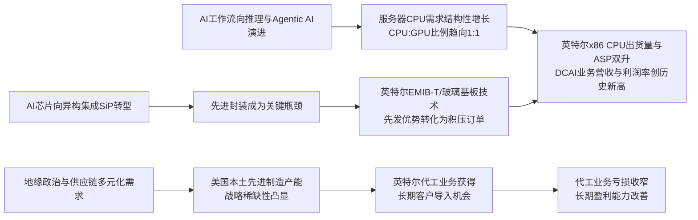

<!-- 匹配到的证券/行业：英特尔(INTC.O) -->
操作成功

### 一页通 （英特尔 (INTC.O)）
日期：2026-08-06
内容："""
## 公司概况
英特尔是全球领先的半导体设计与制造公司，采用整合元件制造商（IDM）模式，同时经营CPU等逻辑芯片的设计、销售与先进制程的晶圆代工业务。公司核心产品为基于x86架构的客户端（PC）与服务器CPU，长期主导全球PC和服务器处理器市场。近年来，公司战略重心转向“AI无处不在”，通过CPU、专用芯片（ASIC）、先进封装（EMIB-T）和晶圆代工服务，参与AI基础设施全栈建设。公司是美国本土唯一具备领先逻辑芯片研发与大规模制造能力的企业，其战略地位在地缘政治背景下日益凸显。  

## 公司近况跟踪
- <strong>Q2业绩与Q3指引全面超预期</strong>：公司2026年Q2营收161.28亿美元，同比增长25.4%，创近15年最快增速，大幅超出此前138-148亿美元的指引上限。Non-GAAP毛利率41.8%，Non-GAAP EPS为0.42美元，均为指引的两倍以上。Q3营收指引中值为163亿美元，毛利率指引42%，均显著高于市场一致预期。    
- <strong>数据中心业务（DCAI）成为增长核心引擎</strong>：Q2 DCAI营收62.62亿美元，同比激增59%，运营利润率高达40%，首次在运营利润上超越客户端业务。增长由超大规模云客户对服务器CPU的强劲需求驱动，同时定制ASIC业务年化收入接近20亿美元，同比增长近3倍。    
- <strong>制造工艺与代工业务取得关键进展</strong>：Intel 18A制程产能爬坡超预期，Q2晶圆产出超内部目标约25%，环比增长超50%，良率持续优于预期。18A-P已进入风险生产。下一代14A制程的PDK 0.9预计于2026年10月交付，公司正式承诺于2028年实现14A的大规模量产。    
- <strong>资本开支大幅上调以应对需求</strong>：基于强劲的客户需求信号和长期协议，公司将2026年资本开支指引上调至超过200亿美元，并预告2027年资本开支将“显著高于”2026年水平，绝大部分将投入美国本土的制造网络。    
- <strong>先进封装业务需求强劲</strong>：EMIB-T技术的客户兴趣和积压订单持续增长，良率与可靠性达标，公司正积极扩产以满足2027年的客户量产需求，并聘请了存储领域资深人士领导先进封装业务。    

## 短期逻辑
1. <strong>供给释放驱动Q4业绩非线性增长</strong>：公司明确表示，当前服务器CPU需求远超供给，Q3供给增长将集中在季末，Q4有望加速。管理层指引Q3营收环比仅微增1%，但暗示Q4将出现显著的环比增长。这一“供给释放”逻辑为Q4业绩提供了较高的确定性。若Q3末至Q4的产能（尤其是Intel 3节点和先进封装基板）如期释放，将直接转化为营收和利润的强劲增长，构成未来一个季度最核心的交易驱动力。  

2. <strong>14A PDK 0.9交付：外部代工客户突破的关键催化剂</strong>：公司计划于2026年10月交付14A制程的0.9版工艺设计套件（PDK）。这是外部无晶圆厂客户评估并启动芯片设计的关键技术节点。管理层表示，14A的缺陷密度和晶体管性能均优于18A同期水平，客户接洽势头强劲。若PDK 0.9顺利交付并引发积极的市场反馈，甚至获得早期客户订单承诺，将是对英特尔代工战略长期可行性的有力验证，有望显著提振市场信心和估值。   

3. <strong>ASIC业务高增长验证“系统级代工”价值</strong>：Q2 ASIC设计服务收入同比增长近3倍，年化收入接近20亿美元，并有望在未来达到40亿美元。该业务结合了英特尔的CPU IP、先进封装和制造能力，为客户提供定制化计算方案。ASIC业务的快速增长，证明了英特尔“系统级代工”模式的商业价值，并为其切入超千亿美元的ASIC市场提供了有力支撑，是短期内验证公司新业务模式变现能力的重要观察点。    

## 长期逻辑
1. <strong>Agentic AI驱动的服务器CPU市场结构性扩张</strong>：随着AI工作负载从模型训练转向推理和Agentic AI，CPU在AI基础设施中的角色正被重新定义。公司指出，CPU与GPU的部署比例已接近1:1，未来甚至可能进一步向CPU倾斜。管理层预计，今明两年服务器CPU行业出货量将实现强劲的双位数增长，且增长势头将延续至2028年。这一结构性趋势为英特尔的核心x86服务器业务提供了长期、坚实的增长基础，使其成为AI算力扩张的核心受益者。    

2. <strong>“系统级代工”模式构筑差异化壁垒</strong>：英特尔正将其代工业务从单纯的晶圆制造，升级为涵盖CPU IP、先进封装（EMIB-T、玻璃基板）和晶圆制造的“系统级代工”模式。随着AI芯片从单片SoC向异构集成系统（SiP）演进，先进封装成为关键瓶颈。英特尔在EMIB-T和玻璃基板上的先发优势，使其能够承接台积电CoWoS的外溢需求，并吸引对高密度互连有需求的客户。这一模式有望将代工业务从高资本开支、低利润率的商品化业务，转变为高附加值、高客户粘性的增长引擎。    

3. <strong>美国本土先进制造产能的战略稀缺性</strong>：在地缘政治风险加剧、全球供应链追求韧性的背景下，英特尔作为美国唯一具备领先逻辑芯片研发与制造能力的公司，其战略价值日益凸显。公司计划2021-2026年在美国的设备与厂房总资本支出接近1000亿美元。这一庞大的本土产能不仅是满足美国政府《芯片法案》目标的基石，也成为寻求供应链多元化的全球科技巨头（如苹果、英伟达、谷歌等）的重要战略备选，为英特尔代工业务提供了长期的客户导入机会。   

## 风险提示
- <strong>资本开支与自由现金流的失衡风险</strong>：公司上调2026年资本开支至超200亿美元，并预告2027年将“显著增加”。尽管管理层强调投资与客户需求挂钩，但短期内巨额资本开支将导致自由现金流转负或处于低位。若未来需求增长不及预期，或先进制程回报率低于预期，公司将面临巨大的资产折旧和财务压力，可能需要进行额外的股权融资，从而稀释股东价值。    
- <strong>外部代工客户获取与执行的重大不确定性</strong>：尽管14A等先进制程进展顺利，但截至目前，英特尔尚未公布任何为14A或18A-P带来实质性收入的大型外部代工客户。代工业务的成功不仅取决于技术竞争力，还依赖于建立客户信任、提供完善的IP生态和设计服务。若2026年10月PDK 0.9发布后未能转化为明确的客户订单，市场对代工业务的长期预期可能落空。  
- <strong>地缘政治冲突对核心制造资产的直接威胁</strong>：公司在以色列拥有重要的Fab 28晶圆厂，该厂是Intel 7节点产品（贡献当前大部分营收）的核心生产基地。2026年Q2的10-Q文件明确指出，该工厂未投保战争或政治暴力险。鉴于中东地区冲突升级，且伊朗已将英特尔列为潜在报复目标，该工厂的任何生产中断都将对公司营收和供应链造成重大且难以量化的冲击。 

## 近期要闻
- <strong>2026年4月</strong>：英特尔以142亿美元现金回购了阿波罗全球管理公司持有的爱尔兰Fab 34工厂49%的少数股权，从而100%掌控了这一Intel 3/4制程的核心生产基地。 
- <strong>2026年7月</strong>：英特尔宣布向其爱尔兰莱克斯利普园区追加50亿欧元投资，用于扩大Intel 3制程产能，以满足至强6及下一代至强处理器的强劲需求。   
- <strong>2026年7月</strong>：公司宣布对数据中心事业部（DCG）进行新一轮组织架构调整和人员裁撤，旨在提高运营效率，是公司持续“瘦身”计划的一部分。 

## 未来催化
- <strong>2026年8月-9月</strong>：随着Q3末产能逐步释放，市场将密切关注公司供应链改善的进度，特别是Intel 3制程和先进封装基板的供给情况，这直接影响Q4的业绩弹性。  
- <strong>2026年10月</strong>：英特尔计划交付14A制程的0.9版工艺设计套件（PDK）。这是外部客户能否正式启动基于英特尔最先进节点进行芯片设计的关键里程碑，任何相关的客户承诺或合作消息都将成为股价的重要催化剂。  
- <strong>2026年下半年</strong>：公司预计14A有望在2026年下半年获得早期客户订单承诺。任何来自苹果、谷歌、英伟达、AMD等潜在大客户的合作传闻或官方公告，都将是对其代工战略的最强有力背书。  

## 公司业务模式及拆分
<strong>盈利模式</strong>：英特尔采用IDM模式，盈利来源于两部分：一是“英特尔产品”部门，通过设计和销售CPU、ASIC等芯片获取收入，其盈利能力依赖于产品性能、定价和生态壁垒；二是“英特尔代工”部门，通过为内部和外部客户提供晶圆制造和先进封装服务获取收入，其盈利模式依赖于制程技术的领先性、产能规模、良率和客户组合。目前，产品部门是利润中心，代工部门因巨额资本投入和早期爬坡成本而处于亏损状态。  

<strong>业务拆分</strong>：
公司近年业务结构发生重大变化，于2025年Q1将网络与边缘（NEX）业务整合进CCG和DCAI，并确立了“英特尔产品”（含CCPG和DCAI）、“英特尔代工”和“其他”三大板块。当前，公司处于<strong>业绩兑现期</strong>，产品业务受益于AI驱动的CPU需求强劲增长，代工业务亏损随规模效应和良率改善而收窄。  

<strong>细分业务拆分（单位：亿美元）</strong>

| 业务板块 | 指标 | FY2024 | FY2025 | FY2026 H1 |
| :--- | :--- | :--- | :--- | :--- |
| <strong>英特尔产品</strong> | | | | |
| <strong>CCPG</strong> | 营收 | 333.46 | 322.28 | 166.04 |
| | 营收占比 | 63% | 61% | 56% |
| | 运营利润率 | 35% | 29% | 29% |
| <strong>DCAI</strong> | 营收 | 161.25 | 169.19 | 113.14 |
| | 营收占比 | 30% | 32% | 38% |
| | 运营利润率 | 9% | 20% | 35% |
| <strong>英特尔代工</strong> | 营收 | 173.17 | 178.26 | 111.86 |
| | 运营利润率 | -77% | -58% | -40% |
| <strong>其他</strong> | 营收 | 36.01 | 35.63 | 13.29 |
| <strong>合计</strong> | 营收 | 531.01 | 528.53 | 297.05 |

*注：FY2026 H1数据为2026年前两个季度累计值。CCPG为客户端计算与物理AI事业部，DCAI为数据中心与AI事业部。*

<strong>CCPG业务（2026年Q2）</strong>：营收88.77亿美元，同比增长12.8%，主要受产品组合向高端AI PC转移和提价带来的ASP增长驱动，但销量同比下滑8%。运营利润23.43亿美元，利润率26.4%，环比下滑主要因公司为优化产能而计提了库存减值。AI PC收入已占客户端总营收的三分之二。 

<strong>DCAI业务（2026年Q2）</strong>：营收62.62亿美元，同比增长59%，创历史新高。增长由超大规模云客户需求驱动，服务器ASP同比提升48%，出货量增长9%。运营利润24.74亿美元，利润率高达39.5%，首次超越CCPG成为公司最大利润池。定制ASIC业务年化收入接近20亿美元，同比增长近3倍。 

<strong>英特尔代工业务（2026年Q2）</strong>：营收57.65亿美元，同比增长30.5%，主要由18A等先进制程晶圆产出增加驱动。运营亏损20.89亿美元，亏损率36.2%，同比和环比均显著收窄。外部代工收入仅2.93亿美元，主要来自已剥离的Altera。该业务仍处于内部产品主导的产能爬坡和成本优化阶段。 

## 核心竞争力
<strong>竞争要素 1：依托x86生态与系统级能力的客户粘性</strong>
- <strong>护城河定性</strong>：<strong>结构性护城河</strong>。x86架构在过去四十年建立了庞大且深入的软件生态系统，构成了极高的客户转换成本，尤其在企业和数据中心市场。英特尔正将这一优势与先进封装、定制ASIC设计能力结合，从单纯的CPU供应商转变为系统级解决方案提供商，进一步加深了与关键客户的绑定。  
- <strong>数据验证</strong>：Q2 DCAI业务运营利润率高达40%，显示出强大的定价能力和盈利水平。公司与谷歌、AWS等头部客户签订了长期合作协议，共同开发定制化CPU和ASIC IPU，证明了其系统级能力的商业价值。 
- <strong>动态演变</strong>：<strong>护城河变宽（巩固）</strong>。随着AI工作流向推理和Agentic AI演进，CPU的战略重要性回升，x86生态的价值被重新定价。同时，公司通过提供CPU+ASIC+先进封装的组合方案，满足了客户对差异化硬件的需求，进一步巩固了其在AI基础设施中的核心地位。 

<strong>竞争要素 2：依托先发规模与技术突破的先进封装优势</strong>
- <strong>护城河定性</strong>：<strong>行业阶段性红利</strong>。在AI芯片从单片向异构集成（SiP）转型的浪潮中，先进封装成为关键瓶颈。英特尔在EMIB-T和玻璃基板技术上具备先发优势，其技术能支持更大尺寸、更高密度的芯片互连，这是当前台积电CoWoS等主流方案难以实现的。  
- <strong>数据验证</strong>：公司披露EMIB-T的积压订单持续增长，良率和可靠性已达标，并计划于2027年支持客户量产。公司已与联发科等客户就EMIB-T展开合作，并聘请了存储领域资深人士领导该业务，显示出其战略优先级。  
- <strong>动态演变</strong>：<strong>维持</strong>。先进封装市场正在快速扩张，台积电等竞争对手也在积极布局。英特尔的先发优势能否转化为持久的市场份额，取决于其能否快速、高质量地实现大规模量产，并持续进行技术迭代。  

<strong>现阶段核心驱动力总结</strong>：公司的Alpha在于其IDM模式在AI时代的战略价值重估，即“产品”（x86 CPU、ASIC）和“制造”（先进制程、先进封装）两大引擎开始协同发力，驱动业绩超预期增长。其Beta则高度绑定于全球AI基础设施的资本开支周期，尤其是服务器CPU市场的结构性扩张。  

<strong>竞争格局传导逻辑图</strong>：

## 产销链
- <strong>客户情况</strong>：公司客户集中度较高，2025年前三大客户贡献了43%的营收。客户主要为全球头部PC OEM（如联想、惠普、戴尔）、超大规模云服务商（CSP，如谷歌、亚马逊、AWS）和ODM。Q2期间，公司透露已与客户签订了10份数据中心CPU及相关芯片的长期供货协议（LTA），期限为3-5年，部分锁定价格，部分锁定供应量，这极大地增强了未来需求的可见性。新客户方面，ASIC业务正与Fortinet等企业合作开发安全处理器，并积极拓展其他CSP客户。  
- <strong>供应商情况</strong>：公司依赖全球复杂的供应链，其中ASML是EUV光刻机的唯一供应商，对先进制程扩张至关重要。近期，公司面临全行业范围的硅晶圆、基板和存储器供应短缺，这已成为限制其出货量增长的主要瓶颈。为应对此问题，公司正与供应商签订长期协议并支付预付款以锁定产能。  
- <strong>成本传导能力</strong>：公司具备较强的成本传导能力。面对上游原材料和制造成本的通胀压力，公司通过产品组合向高端迁移和直接提价，成功提升了服务器CPU和客户端CPU的ASP，从而在Q2实现了毛利率的显著扩张。这表明公司赚取的是“技术/生态溢价”，而非单纯的“加工费”。 

## 财务数据
<strong>关键财务数据</strong>

| 指标 | FY2023 | FY2024 | FY2025 | FY2026 H1 |
| :--- | :--- | :--- | :--- | :--- |
| <strong>截止日期</strong> | 2023-12-30 | 2024-12-28 | 2025-12-27 | 2026-06-27 |
| <strong>营业总收入（亿美元）</strong> | 542.28 | 531.01 | 528.53 | 297.05 |
| 营收同比 | -14.00% | -2.08% | -0.47% | 16.37% |
| <strong>毛利率</strong> | 40.0% | 32.7% | 34.8% | 39.9% |
| <strong>营业利润（亿美元）</strong> | 0.31 | -47.08 | -0.23 | 29.00 |
| 营业利润率 | 0.1% | -8.9% | -0.04% | 9.8% |
| <strong>归母净利润（亿美元）</strong> | 16.89 | -187.56 | -2.67 | -147.61 |
| <strong>Non-GAAP EPS (美元)</strong> | 1.05 | -0.13 | 0.42 | 0.72 |
| <strong>自由现金流（亿美元）</strong> | -142.79 | -156.56 | -49.49 | 14.33 |

*注：FY2026 H1自由现金流根据经营活动现金流（81.02亿）减去资本支出（61.92亿）及融资租赁付款（8.32亿）后，并加回与爱尔兰SCIP相关的合伙人分配（14.34亿）等非经常性项目估算得出。*

<strong>财务分析</strong>：
- <strong>成长能力</strong>：公司营收在经历两年下滑后，于FY2026 H1重回强劲增长轨道，同比增16.4%，主要由DCAI业务驱动。这表明公司已成功切入AI基础设施这一高增长赛道，其产品组合正从成熟的PC市场向高价值的AI数据中心市场倾斜。 
- <strong>盈利能力</strong>：毛利率从FY2024的低谷持续反弹，FY2026 H1达到39.9%，Q2单季已达41.8%。这得益于高毛利的数据中心业务占比提升、先进制程良率改善带来的成本下降，以及ASP的提升。营业利润率在FY2026 H1转正至9.8%，显示出公司严格的费用控制（研发与销售管理费用同比下降7%）和强劲的经营杠杆。 
- <strong>现金流状况</strong>：尽管盈利能力改善，但公司正处于大规模资本开支周期。FY2026 H1自由现金流转正，但考虑到公司已上调全年资本开支至超200亿美元，且Q2单季因回购爱尔兰工厂股权导致融资性现金流大幅流出，预计全年自由现金流将面临压力。公司的现金生成能力与巨额投资需求之间的平衡，是未来需要持续关注的核心财务指标。 

## 行业及竞争分析
<strong>行业分析</strong>：英特尔所处的核心赛道正从传统的PC和服务器CPU市场，向AI基础设施市场（包括AI服务器CPU、AI加速器、定制ASIC和先进封装）快速延伸。据IDC预测，全球AI基础设施总支出将从2026年的4970亿美元增长至2029年的1.08万亿美元。其中，服务器CPU市场正经历结构性扩张，AMD预计2030年该市场TAM将达到2200亿美元，而英特尔自身也预计行业出货量将实现多年双位数增长。这一增长的核心驱动力是AI工作负载从训练转向推理和Agentic AI，导致CPU在AI集群中的配比和重要性大幅提升。  

<strong>竞争格局</strong>：
- <strong>服务器CPU市场</strong>：英特尔与AMD构成双寡头，但正面临来自ARM架构（如亚马逊Graviton、Ampere）的竞争。英特尔凭借x86生态粘性和近期产品执行力的改善，在AI驱动的需求浪潮中保住了市场份额，但AMD的份额仍在持续增长。竞争焦点在于单核性能、多核密度、能效比和AI推理加速能力。  
- <strong>AI加速器市场</strong>：英伟达凭借其GPU和CUDA生态占据绝对主导地位。英特尔通过Gaudi系列和后续的GPU产品（Crescent Island, Jaguar Shores）参与竞争，但目前市场份额有限。公司更现实的路径是，通过其CPU在AI集群中的高配比，以及为CSP提供定制ASIC，来间接参与AI加速器市场的增长。  
- <strong>晶圆代工市场</strong>：台积电是绝对的领导者，尤其在先进制程（N3, N2）上。英特尔作为挑战者，正通过18A和14A制程追赶，并试图以“系统级代工”和地缘政治优势实现差异化。三星是另一主要竞争对手。竞争核心在于制程技术的性能、功耗、良率、产能规模、IP生态系统和客户信任。  

<strong>可比公司</strong>

| 公司名称 | 股票代码 | 对标维度 | 分析 |
| :--- | :--- | :--- | :--- |
| AMD | AMD | 服务器CPU、AI加速器 | 在x86服务器CPU市场直接竞争，AMD份额持续增长。在AI加速器领域，AMD的Instinct GPU是英伟达的主要替代选择，而英特尔在该领域份额较小。 |
| 英伟达 | NVDA | AI加速器、系统级方案 | 在AI加速器市场占据主导地位，其CUDA生态是强大的护城河。在系统级方案上，英伟达的CPU+GPU组合与英特尔的方案形成竞争。 |
| 台积电 | TSM | 晶圆代工 | 晶圆代工市场的绝对领导者，是英特尔代工业务追赶的目标。两者在先进制程技术、客户资源和产能规模上全面竞争。 |

<strong>总结分析</strong>：英特尔的核心竞争逻辑并非在AI加速器市场正面击败英伟达，而是在AI基础设施的“非GPU”部分，即CPU、ASIC和先进封装领域，利用其IDM 2.0战略建立优势。其服务器CPU业务正受益于AI带来的市场扩张，而代工业务则试图通过“系统级代工”和地缘政治定位，在台积电主导的市场中开辟差异化空间。  

## 市场焦点议题
<strong>议题一：资本开支激增与自由现金流的平衡</strong>
- <strong>背景</strong>：公司上调2026年资本开支至超200亿美元，并预告2027年将大幅增长，这与市场对AI投资回报率的担忧形成对比。历史上，英特尔曾因过度投资导致资产减值和现金流恶化。  
- <strong>问题列表</strong>：
  - 2027年资本开支的规模究竟有多大？公司预计何时能实现自由现金流转正？
  - 巨额资本开支是否已获得明确的客户订单或预付款支持，还是基于管理层对未来需求的预判？
  - 若未来AI资本开支周期放缓，公司将如何应对可能出现的产能过剩和资产减值风险？

<strong>议题二：外部代工客户获取的可见度与时间表</strong>
- <strong>背景</strong>：尽管18A/14A制程进展顺利，但英特尔代工业务目前几乎全部收入来自内部。市场期待看到能带来实质性收入贡献的外部大客户落地，以验证其代工战略的商业可行性。  
- <strong>问题列表</strong>：
  - 14A PDK 0.9在2026年10月交付后，预计何时能转化为首批外部客户的流片（Tape-out）？
  - 除了已宣布的与联发科、Fortinet的合作，是否有与头部CSP或手机芯片厂商就先进制程晶圆代工进行实质性谈判？
  - 公司如何解决潜在客户（尤其是与英特尔产品存在竞争关系的公司）对IP保护和产能分配方面的顾虑？

<strong>议题三：服务器CPU市场份额的长期趋势</strong>
- <strong>背景</strong>：尽管DCAI业务增长强劲，但AMD在x86服务器市场的份额仍在持续增长，且ARM架构CPU也在不断渗透。市场关心英特尔在供给缓解后，能否在竞争中保持当前的增长势头和定价能力。  
- <strong>问题列表</strong>：
  - 当前服务器CPU的高ASP增长中，有多少是由结构性产品组合升级驱动，有多少是由暂时性供需失衡驱动？
  - 随着2027年Coral Rapids等新品的推出，英特尔能否在单核性能和能效比上缩小与AMD的差距，甚至重回领先地位？
  - 面对谷歌、亚马逊等CSP自研ARM服务器CPU的趋势，英特尔如何维持其在CSP客户中的份额？

## 市场分歧探讨
<strong>核心分歧：当前强劲的业绩增长是AI驱动的结构性需求爆发，还是由供应链短缺导致的暂时性“虚假繁荣”？</strong>

- <strong>乐观方观点（结构性需求驱动）</strong>：认为AI工作负载正从训练转向推理和Agentic AI，这从根本上改变了数据中心架构，使得CPU的角色从辅助变为核心。CPU与GPU的配比将从1:8向1:1甚至更高比例演进，这将为服务器CPU市场带来多年的结构性增长。英特尔凭借其x86生态、产品组合和IDM模式下的供应保障能力，是这一趋势的核心受益者。当前供不应求的局面，正是需求远超预期的证明。  

- <strong>谨慎方观点（暂时性供需失衡）</strong>：认为当前服务器CPU的强劲增长，很大程度上是由于全行业供应链短缺（晶圆、基板、内存）导致客户恐慌性下单和重复下单，叠加部分客户因竞争压力提前拉货。一旦供应链瓶颈缓解，客户库存恢复正常，需求可能回落。同时，AMD的份额仍在增长，且ARM架构的威胁长期存在。英特尔当前的定价能力和高利润率可能无法持续，随着其自身和竞争对手产能的释放，价格战风险将加大。  

<strong>总结分析</strong>：当前英特尔的强劲表现是结构性趋势与周期性因素叠加的结果。AI工作负载的演变确实为CPU带来了长期增量需求，这是结构性的一面。但供给短缺放大了短期需求信号，并推高了ASP，这是周期性的一面。公司的优势在于，其IDM模式使其在供应紧张时期能够更好地保障核心客户的供应，从而巩固客户关系并签订长期协议。然而，风险在于，当供给全面恢复后，市场竞争将回归产品性能、成本和能效比的本质。届时，英特尔能否兑现其产品路线图（如Coral Rapids），将是决定其能否守住市场份额和利润率的关键。  

## 盈利预测与估值
<strong>管理层最新指引</strong>：
- <strong>2026年Q3</strong>：营收预计为158-168亿美元，Non-GAAP毛利率约为42%，Non-GAAP EPS为0.38美元。 
- <strong>2026全年</strong>：资本开支上调至超过200亿美元。预计全年Non-GAAP运营费用约为165亿美元。 
- <strong>2027年</strong>：资本开支将显著高于2026年水平。 

<strong>券商盈利预测与估值</strong>

| 机构 | 评级 | 目标价(美元) | 财务指标 | FY2026E | FY2027E | FY2028E |
| :--- | :--- | :--- | :--- | :--- | :--- | :--- |
| 美银 (2026-07-28) | 买入 | 160.00 | 营收(亿美元) | 628.62 | 731.16 | 847.03 |
| | | | Non-GAAP EPS(美元) | 1.49 | 2.09 | 3.01 |
| 瑞银 (2026-07-28) | 中性 | 121.00 | 营收(亿美元) | 644.48 | 751.92 | 873.82 |
| | | | Non-GAAP EPS(美元) | 1.56 | 2.17 | 2.82 |
| 花旗 (2026-07-24) | 买入 | 130.00 | 营收(亿美元) | 636.69 | 913.18 | - |
| | | | Non-GAAP EPS(美元) | 1.54 | 2.78 | - |
| 摩根大通 (2026-07-24) | 低配 | 85.00 | 营收(亿美元) | 633.36 | 776.79 | 942.91 |
| | | | Non-GAAP EPS(美元) | 1.58 | 2.44 | 3.60 |
| 摩根士丹利 (2026-07-24) | 均配 | 84.00 | 营收(亿美元) | 627.20 | 712.64 | 801.95 |
| | | | Non-GAAP EPS(美元) | 1.57 | 2.00 | 2.63 |

<strong>盈利预期与估值分析</strong>：券商对英特尔未来几年的营收和EPS增长普遍持乐观态度，但分歧巨大。乐观方（如美银、花旗）基于AI服务器CPU市场的强劲增长和代工业务的潜在爆发，给出了较高的营收和EPS预测，并采用基于未来EPS的PE估值或SOTP估值，目标价显著高于当前股价。谨慎方（如摩根大通、摩根士丹利）虽然也上调了预测，但对资本开支压力、外部代工客户获取的难度以及长期市场份额存在担忧，因此给出的目标价低于当前股价。估值方法上，由于公司短期GAAP净利润受非现金项目严重扭曲，市场普遍采用Non-GAAP PE、EV/Sales或SOTP进行估值。当前股价对应2027年Non-GAAP EPS的一致预期（约2.4美元）的PE已超过40倍，显示市场已计入较高的增长预期。未来股价的进一步上涨空间，将高度依赖于公司能否持续超预期兑现业绩，并在外部代工客户上取得突破性进展。
"""
