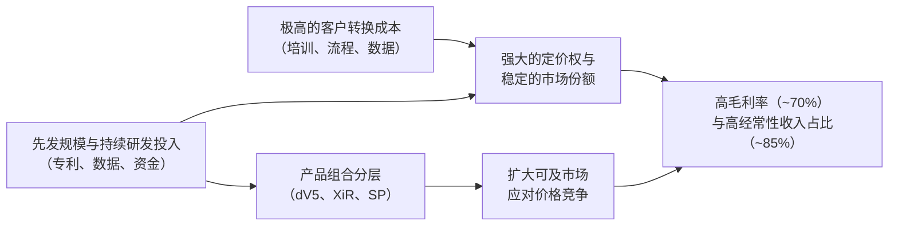

# Gangtise 公司一页通：直觉外科（ISRG.O）

> 拉取日期：2026-07-30 ｜ 来源：gangtise-agent `stock-one-pager`

## 公司概况
直觉外科是全球软组织手术机器人领域的绝对领导者，其核心产品达芬奇手术系统自1999年商业化以来，已构建起涵盖多孔、单孔及腔内诊断的完整产品矩阵。公司通过“设备装机—手术量增长—耗材与服务收入”的飞轮模式，实现了超过80%的经常性收入占比，形成了极高的客户粘性和持续的收入流。截至2026年6月30日，全球达芬奇系统安装基数已超11,710台，累计完成超2,000万例手术，市场地位稳固。  

## 公司近况跟踪
- **美国手术量增速放缓引发市场担忧**：2026年Q2，美国达芬奇手术量同比增长**12%**，较Q1的14%进一步放缓，创下自2021年以来的最低增速。管理层将此归因于**ACA增强保费补贴到期**导致部分可择期手术（如良性疝修补、胆囊切除）被推迟，以及**GLP-1药物对减重手术的持续冲击**（美国减重手术量高个位数下滑）。  
- **全年手术量指引未上调，但指向中值**：尽管上半年全球手术量增长接近15%，公司仍维持2026全年达芬奇手术量增长**13.5%-15.5%**的指引，并明确表示预计将**接近中值（14.5%）**。这暗示下半年增速将因高基数和ACA影响而放缓，低于市场此前对指引上调的普遍预期。  
- **推出全方位降本战略，颠覆传统盈利模式**：公司宣布将从2027年上半年开始，对部分高频EndoWrist器械实施**延长使用计划**，以降低单台手术耗材成本。此举旨在应对日益激烈的市场竞争和成本敏感型市场的需求，但市场担忧这将直接冲击其利润率最高的耗材收入。  
- **新一代柔性GI机器人提交510(k)申请**：公司近期向FDA提交了一款用于**胃肠道的基础性、非商业化柔性机器人内窥镜系统**的510(k)申请，标志着其正将机器人辅助技术拓展至核心软组织手术之外的全新疾病领域。  
- **欧洲分销渠道完成直营化转型**：公司于2026年3月完成了对意大利、西班牙、葡萄牙等地分销业务的收购，转为直销模式，旨在加强对欧洲这一关键增长市场的控制力与客户响应速度。  

## 短期逻辑
1.  **美国手术量放缓是“周期性”还是“结构性”的预期差博弈**
    市场当前的核心焦虑在于，美国手术量增速的放缓是否意味着核心市场正触及渗透率天花板。管理层将其定性为受ACA补贴到期影响的**“温和且非持久性”**冲击，并指出被推迟的手术最终会回归。若未来1-2个季度，随着患者适应新的保险环境或被推迟的刚性需求释放，美国手术量增速能稳定甚至回升至13%以上，将有力证伪市场的“增长见顶”叙事，触发估值修复。投资者需密切关注月度/季度手术量高频数据以验证此逻辑。  

2.  **延长使用计划（EUP）的量化冲击与“以价换量”效果**
    公司计划在2026年Q3财报中量化EUP对2027年收入的影响。市场参考2019年经验，担忧这将导致耗材单台手术收入出现约**7%**的下滑。然而，若公司能清晰展示降价后带来的手术量弹性（尤其是在日间手术中心ASC和国际市场），证明“以价换量”能有效对冲价格压力并扩大总可及市场，则这一战略将被重新定义为积极的长期增长驱动力，而非单纯的利润侵蚀。Q3电话会将是关键节点。  

3.  **达芬奇5升级周期与产品组合策略支撑业绩韧性**
    尽管手术量承压，但达芬奇5的升级换代仍在加速，Q2占新增装机量的**53%**。其更高的售价和更强的耗材拉动力（如力反馈器械、SP吻合器）正驱动收入增长持续快于手术量增长。同时，公司通过推出低成本的翻新版XiR系统，成功打入ASC和对价格敏感的国际市场，Q2在ASC装机**27台**（其中20台为XiR）。这种“高低搭配”的产品组合策略，有望在宏观压力下维持系统装机增长，为未来的耗材和服务收入奠定基础。  

## 长期逻辑
1.  **全球渗透率仍处极低水平，国际市场提供广阔成长空间**
    尽管在美国核心术式中的渗透率已较高，但在全球范围内，机器人辅助手术的渗透率仍不足**5%**。特别是在美国以外市场，2026年Q2手术量增长达**20%**，显著高于美国。公司在日本（新增报销政策）、印度（近期获批达芬奇5）等亚洲市场及欧洲市场仍有大量未饱和的增量空间。管理层将可及市场从2024年的700万例扩展至2026年的**900万例**，长期目标指向**2,000万例**的微创手术市场，成长天花板极高。  

2.  **以数据和AI为核心的生态系统正在构筑下一代竞争壁垒**
    直觉外科正将其超过**1,700台**达芬奇5系统及每年数百万例手术产生的海量数据（包括独特的力反馈和运动学数据）转化为结构性竞争优势。公司已发布清晰的五层AI能力框架，从数据、洞察、术中指导到增强操控和受监督的自主能力。My Intuitive+平台的订阅服务和Case Insights等数字化产品，不仅增强了客户粘性，更有望在未来开辟出高利润的软件和服务收入流，使公司的商业模式从单纯的“剃刀+刀片”向“硬件+耗材+数据服务”的生态平台演进。  

3.  **平台化扩张战略打开远超软组织手术的长期天花板**
    公司正系统性地将其技术平台拓展至新的临床领域。**Ion腔内系统**在肺癌活检领域已展现出巨大潜力，Q2手术量增长**36%**，累计手术量超40万例，并正整合ROSE和EBUS技术以扩展至治疗领域。**SP单孔平台**手术量增长**61%**，在NSM（乳头保留乳房切除术）等新术式上创造了增量市场。此外，近期提交申请的**GI柔性机器人**和已获FDA批准的**心脏手术**适应症，预示着公司正从软组织手术龙头向多学科、多平台的微创诊疗平台型公司转型。  

## 风险提示
- **美国核心市场增长放缓风险**：美国市场贡献了公司约三分之二的收入，其手术量增速已连续多个季度放缓。若ACA补贴到期的影响比预期更持久，或“大数定律”下核心术式渗透率提升速度慢于预期，将导致公司整体增长中枢下移，对当前估值构成持续压力。  
- **竞争格局加剧风险**：强生OTTAVA系统已获FDA批准进入美国软组织手术市场，美敦力Hugo系统也在持续扩大适应症，同时中国市场面临微创、精锋等本土企业的激烈价格战。新进入者可能侵蚀直觉外科的市场份额，并对其系统定价和耗材利润率造成冲击。  
- **延长使用计划（EUP）的执行风险**：计划于2027年实施的EUP旨在通过降价刺激手术量，但若手术量弹性不及预期，或降价幅度过大，将直接导致公司利润率最高、现金流最稳定的耗材业务收入出现结构性下滑，从而影响整体盈利能力。  

## 近期要闻
- **2026年4月22日**：公司公布2026年Q1业绩，收入与利润均超预期，并上调全年手术量增长指引至13.5%-15.5%，同时宣布完成对南欧分销业务的收购。  
- **2026年5月21日**：公司宣布推出超过100项针对达芬奇5平台的更新与增强功能，涵盖远程呈现、模拟培训和手术团队工作流程等领域，并提交了多项创新技术的510(k)申请。  
- **2026年7月16日**：公司公布2026年Q2业绩，营收与利润再次超预期，但因美国手术量增速放缓且全年指引未上调，引发股价盘后大幅下跌。  

## 未来催化
- **2026年10月（预计）**：2026年Q3财报发布。管理层承诺将在本次电话会上量化延长使用计划（EUP）对2027年收入的预期影响，这将是决定市场能否重新定价公司长期盈利模型的关键事件。 
- **2026年下半年**：达芬奇5系统在印度市场的商业化启动。印度是增长迅速的新兴市场，达芬奇5的获批和上市有望成为国际市场新的增长点。 
- **2026年下半年至2027年初**：GI柔性机器人510(k)申请的审批进展。若获得FDA批准，将为公司打开一个全新的、规模庞大的胃肠道诊疗市场，提供长期估值提升的催化剂。 
- **2026年下半年**：日本市场对新报销政策（6月1日生效）的反应。新增的7项手术报销和对高利用率医院的激励措施，有望逐步释放日本市场被压抑的资本和手术需求。 

## 公司业务模式及拆分
- **业务边际变化**：公司正经历从单一高端设备销售向“产品分层+服务驱动+数字化赋能”的商业模式转型。在设备端，通过高端的达芬奇5和低成本的翻新XiR系统覆盖不同层级的客户；在耗材端，通过延长使用计划主动管理价格与销量的平衡；在服务端，My Intuitive+等数字化订阅服务正成为新的价值增长点。此外，公司正通过SP、Ion和GI机器人等新平台，将业务从软组织手术拓展至单孔、腔内诊断及治疗等新领域。 

- **盈利模式**：公司采用经典的“剃须刀+刀片”模式，但已进化为“生态系统”模式。主要利润来源于**耗材和服务**，2026年Q2经常性收入（耗材+服务+经营租赁）占总收入的**85%**。公司通过销售或租赁系统建立装机基础，然后通过持续的耗材销售、服务合同以及日益增长的数字化订阅服务实现长期、高粘性的现金流入。其盈利的核心在于手术量的持续增长和耗材的持续消耗。  

- **业务拆分**：公司业务主要分为三大板块：器械及配件（Instruments & Accessories）、系统（Systems）和服务（Services）。耗材是最大的收入和利润来源，系统收入受产品组合和租赁比例影响波动较大，服务收入则随装机量稳定增长。公司当前处于**业绩兑现期与战略转型期**的重叠阶段，核心业务仍在强劲增长，但已开始主动调整策略以应对未来的市场和竞争变化。  

**细分业务拆分**
*单位：亿美元*

| 业务板块 | FY2023 | FY2024 | FY2025 | FY2026 H1 |
|---|---|---|---|---|
| **器械及配件** | | | | |
| 收入 | 42.77 | 50.79 | 60.19 | 34.21 |
| 同比 | - | 18.8% | 18.5% | 20.4% |
| 占总收入比例 | 60.0% | 60.8% | 59.8% | 60.4% |
| **系统** | | | | |
| 收入 | 16.80 | 19.66 | 24.74 | 13.36 |
| 同比 | - | 17.0% | 25.8% | 21.7% |
| 占总收入比例 | 23.6% | 23.5% | 24.6% | 23.6% |
| **服务** | | | | |
| 收入 | 11.68 | 13.07 | 15.72 | 9.06 |
| 同比 | - | 11.9% | 20.3% | 20.1% |
| 占总收入比例 | 16.4% | 15.6% | 15.6% | 16.0% |
| **总收入** | **71.24** | **83.52** | **100.65** | **56.63** |

*注：历史财年数据来源于公司年报，最新一期数据来源于2026年中报。*

- **器械及配件（2026年H1）**：收入34.21亿美元，同比增长20.4%。增长由全球达芬奇手术量增长**15%**和Ion手术量增长**36%**驱动。单台达芬奇手术耗材收入约为**1,830美元**，同比提升，主要受SP和达芬奇5手术占比提升推动，但部分被客户订购模式和胆囊切除术占比增加所抵消。该业务是公司利润的核心来源，其增长直接与手术量挂钩。  
- **系统（2026年H1）**：收入13.36亿美元，同比增长21.7%。增长主要由达芬奇系统装机量增加驱动，Q2新增装机**468台**，其中达芬奇5占**246台**。系统平均售价（ASP）约为**160万美元**，高于去年同期的150万美元，得益于达芬奇5和双操控台系统的高价值组合。但管理层预计，更高的以旧换新比例和XiR系统销售将给ASP带来下行压力。经营租赁模式占比提升至**54%**，虽会延迟收入确认，但能降低客户门槛并带来长期稳定的收入流。  
- **服务（2026年H1）**：收入9.06亿美元，同比增长20.1%。增长主要受达芬奇和Ion系统安装基数分别扩大**12%**和**21%**所推动。达芬奇5系统更高的服务合同价格也对收入增长有所贡献。服务收入具有高度可预见性和稳定性，是公司重要的经常性收入来源。  

## 核心竞争力
**竞争要素 1：依托极高转换成本与生态系统锁定构筑的客户粘性**
- **护城河定性**：**结构性护城河**。直觉外科通过数十年的经营，构建了一个涵盖硬件、软件、培训、服务和数据的深度整合生态系统。全球已有超过**50,000名**外科医生接受过达芬奇系统培训，医院在采购系统后，还需投入大量资源进行流程改造和团队建设。更换其他品牌的机器人系统意味着巨大的财务成本、时间成本和人员再培训成本，这种高转换成本构成了强大的竞争壁垒。  
- **数据验证**：公司的经常性收入占比高达**85%**，表明一旦系统装机，后续的耗材和服务收入流非常稳定。此外，在美国**18家**最大的整合交付网络（IDN）中，已有达芬奇5系统入驻，许多已标准化为直觉外科平台，显示出极高的客户忠诚度。 
- **动态演变**：**护城河变宽（巩固）**。随着达芬奇5系统带来的力反馈、更强大的计算平台和My Intuitive+数字生态系统，客户对直觉外科平台的依赖度进一步加深。特别是AI和数据服务的发展，将使客户被锁定在一个不断进化的、能提供持续临床价值的生态系统中，转换成本只会越来越高。  

**竞争要素 2：依托先发规模与持续创新形成的成本与技术优势**
- **护城河定性**：**结构性护城河**。直觉外科拥有超过**5,600项**已授权专利和**2,500项**在申请专利，覆盖了机械臂、视觉系统、器械等核心技术。同时，其全球累计超过**2,000万例**手术所积累的真实世界数据，是任何竞争对手在短期内都无法复制的宝贵资产，这些数据正被用于训练AI模型，以开发下一代智能手术辅助功能。  
- **数据验证**：公司每年投入超过**13亿美元**用于研发（FY2025），占收入的**13%**，这一投入规模远超潜在竞争对手。其非GAAP毛利率高达**70%**（2026年Q2），显示出强大的定价能力和规模效应带来的成本优势，使其在应对价格战时拥有充足的缓冲空间。 
- **动态演变**：**维持**。尽管公司在技术和数据上拥有显著优势，但来自强生、美敦力等巨头的竞争正在加剧，尤其是在中国市场，本土企业凭借高性价比产品正在快速获取份额。公司通过推出XiR翻新系统和延长使用计划等策略主动应对，旨在通过成本优势和技术下沉来巩固市场地位，但这也可能对利润率造成一定压力。 

**现阶段核心驱动力总结**：
直觉外科的Alpha属性在于其作为行业先驱所建立的**生态系统型护城河**，这使其能够在竞争加剧的环境中保持定价权和客户粘性。其Beta属性则与全球微创手术的渗透率提升、新兴市场的医疗基础设施建设和人口老龄化等宏观趋势紧密相关。当前，公司的增长正从单纯的“市场扩张”驱动，转向“市场扩张+技术创新+模式升级”的复合驱动阶段。 

**竞争格局传导逻辑图**：

## 产销链
- **客户情况**：公司客户主要为全球范围内的医院和日间手术中心（ASC）。客户集中度低，无单一客户占比超过10%。在美国，约**70%**的系统通过租赁方式获取，这降低了医院的资本门槛，但也使公司的收入暴露于医院运营和手术量波动的风险之下。近期，部分美国客户因ACA参保趋势不确定性而表达谨慎态度，但尚未对资本销售管道产生实质性影响。  
- **供应商情况**：公司生产依赖大量定制和标准组件，部分关键零部件由**单一或独家供应商**提供。其大部分耗材在墨西哥墨西卡利生产，内窥镜主要在德国制造。这使得其供应链暴露于全球贸易摩擦和关税风险之下。2026年Q2，关税和相关贸易措施对总成本的影响为**2,080万美元**，但公司也获得了**3,590万美元**的IEEPA关税退款。管理层预计2026全年关税对毛利率的负面影响约为**100个基点**。  
- **经销商情况**：公司在美国、欧洲（部分）、中国（通过合资企业）、日本等主要市场采用直销模式。在其他市场则通过分销商销售。2026年3月，公司完成了对意大利、西班牙和葡萄牙分销业务的收购，转为直销，旨在加强对关键欧洲市场的控制。Q2分销商市场表现强劲，装机**71台**系统，其中**42台**为X或XiR系统，显示出在成本敏感型市场的渗透策略初见成效。  
- **议价能力与成本传导**：直觉外科凭借其强大的品牌和生态系统，对下游客户拥有较强的议价能力，能够将部分成本压力（如关税）通过价格调整转嫁。然而，随着竞争加剧和客户对成本日益敏感，公司也开始主动通过推出XiR系统和延长使用计划等方式，与客户分享成本节约，以换取更大的市场份额和手术量。公司赚取的是**“技术溢价+生态锁定”**的钱，而非简单的加工费。 

## 财务数据
**关键财务数据**
*单位：亿美元，除每股收益外*

| 项目 | FY2023 | FY2024 | FY2025 | FY2026 H1 |
|---|---|---|---|---|
| **截止日期** | 2023-12-31 | 2024-12-31 | 2025-12-31 | 2026-06-30 |
| **营业总收入** | 71.24 | 83.52 | 100.65 | 56.63 |
| 收入同比 | 14.49% | 17.24% | 20.51% | 20.66% |
| **营业成本** | 23.95 | 27.18 | 34.22 | 18.72 |
| **毛利润** | 47.29 | 56.34 | 66.42 | 37.91 |
| 毛利率 | 66.4% | 67.5% | 66.0% | 66.9% |
| **营业利润** | 17.67 | 23.49 | 29.45 | 18.27 |
| 营业利润率 | 24.8% | 28.1% | 29.3% | 32.3% |
| **归母净利润** | 17.98 | 23.23 | 28.56 | 16.40 |
| 归母净利率 | 25.2% | 27.8% | 28.4% | 29.0% |
| **稀释每股收益（美元）** | 5.03 | 6.42 | 7.87 | 4.57 |
| **自由现金流** | 7.50 | 13.04 | 24.90 | 17.57 |

*注：自由现金流由经营活动现金流净额减去资本性支出计算得出。FY2026 H1数据为截至2026年6月30日的6个月数据。*

- **成长能力**：公司收入增速连续三年提升，显示出强劲的增长势头。2026年上半年收入同比增长**20.66%**，维持高位。尽管美国市场手术量增速放缓，但创新产品（达芬奇5、SP、Ion）和国际市场的强劲表现，驱动收入增长持续快于手术量增长。 
- **盈利能力**：毛利率在FY2025因关税影响下滑后，于2026年上半年企稳回升。营业利润率持续显著提升，2026年上半年达到**32.3%**，主要得益于收入规模扩大带来的经营杠杆效应，销售和管理费用率从FY2023的27.6%下降至2026年上半年的21.7%。这表明公司在快速增长的同时，实现了良好的费用控制。 
- **现金流与资本配置**：公司是典型的现金牛企业，自由现金流增长强劲。2026年上半年自由现金流达到**17.57亿美元**，同比增长**71%**。公司持续通过大规模股票回购（2026年上半年回购了**15.07亿美元**）回馈股东，同时保有**86.25亿美元**的现金及投资，资产负债表极为健康，为研发投入和战略性并购提供了充足弹药。 

## 行业及竞争分析
直觉外科所处的**软组织手术机器人**行业，是医疗器械领域中增长最快、壁垒最高的细分市场之一。该市场预计未来5-7年仍将保持**14%-17%**的年复合增长率。增长驱动力包括：微创手术的临床优势得到广泛认可、应用术式从泌尿科和妇科向普外科、胸外科等领域的持续拓展、以及新兴市场医疗基础设施的完善。 

**竞争格局**：市场正从直觉外科“一家独大”向“一超多强”的格局演变。 
- **直觉外科**：凭借超过20年的先发优势、全面的产品矩阵、深厚的临床数据积累和强大的生态系统，依然占据全球约**60%-70%**的市场份额，处于绝对领导地位。 
- **主要挑战者**：
  - **强生 (Johnson & Johnson)**：其OTTAVA系统采用独特的手术台集成式设计，已获FDA批准进入美国市场，主打空间效率和普外科主流术式，被视为最具潜力的挑战者。  
  - **美敦力 (Medtronic)**：Hugo RAS系统已在国际市场销售，并于2025年12月获得FDA批准用于泌尿外科手术，正凭借其模块化设计和Touch Surgery生态系统积极拓展。 
  - **CMR Surgical**：其Versius系统以小型化、模块化和低成本为特点，已在美国以外市场完成超45,000例手术，并于2024年获得FDA批准用于胆囊切除术，正逐步进入美国市场。 
  - **中国本土企业**：以微创机器人、精锋医疗等为代表，凭借高性价比和本地化服务，在中国市场对直觉外科构成了严峻挑战，并开始积极布局海外市场。 

**可比公司分析**：直觉外科的估值显著高于传统医疗器械巨头，这反映了其作为行业领导者的稀缺性、更高的增长速度和更强的盈利能力。 

| 公司名称 | 股票代码 | 2026E 收入增速 | 2026E 市盈率 | 2026E 毛利率 |
|---|---|---|---|---|
| 直觉外科 (Intuitive Surgical) | ISRG | ~17% | ~37x | ~68% |
| 史赛克 (Stryker) | SYK | ~8% | ~19x | ~64% |
| 美敦力 (Medtronic) | MDT | ~4% | ~13x | ~66% |
| 波士顿科学 (Boston Scientific) | BSX | ~8% | ~12x | ~69% |

*注：预测数据为多家机构一致预期范围的中值。*

直觉外科的估值溢价，本质上是对其**稀缺的成长性、强大的盈利能力和深厚的护城河**的定价。尽管面临竞争，但其在软组织手术机器人领域的领导地位在中期内难以被撼动。 

## 市场焦点议题
- **议题一：美国手术量增速放缓的性质与持续性**
  - **背景**：美国市场是公司最大的收入和利润来源。2026年Q2，美国达芬奇手术量增速降至12%，为近年来低点，引发市场对核心市场增长见顶的担忧。  
  - **问题列表**：
    - ACA补贴到期对可择期手术的影响是一次性的还是会在未来几个季度持续？
    - 被推迟的手术需求何时能够回归？回归的强度如何？
    - 除ACA影响外，“大数定律”下核心术式渗透率提升的自然放缓程度如何？
    - 公司如何通过拓展急诊手术、良性妇科等新领域来对冲成熟术式的增长放缓？

- **议题二：延长使用计划（EUP）对盈利模型的长期影响**
  - **背景**：公司计划在2027年实施的EUP，旨在通过降低耗材单次使用成本来刺激手术量，但市场普遍担忧这会对其高利润的耗材业务造成永久性伤害。  
  - **问题列表**：
    - 2027年EUP对单台手术耗材收入的具体量化影响是多少？是否会重演2019年约7%的下滑幅度？
    - “以价换量”的策略能否成功？需要多高的手术量弹性才能完全对冲价格下降的影响？
    - 该计划是否主要针对竞争激烈或成本敏感的市场和术式，从而保护高端市场的定价权？
    - 这是否标志着公司盈利模式从“高毛利、高定价”向“高周转、广覆盖”的永久性转变？

- **议题三：日益激烈的竞争格局对公司市场份额和定价权的威胁**
  - **背景**：强生OTTAVA获批、美敦力Hugo系统扩大适应症，以及中国本土企业的崛起，正逐步打破直觉外科的垄断地位。 
  - **问题列表**：
    - 新进入者（尤其是强生）在美国市场的商业化进展如何？是否已开始对直觉外科的系统定价或耗材份额产生实质性影响？
    - 在中国市场，面对本土企业的价格战和政策倾斜，直觉外科的市场份额和盈利能力将如何演变？
    - 公司除了推出XiR和EUP等防御性策略外，还有哪些主动进攻的策略来维护其市场领导地位？

## 市场分歧探讨
当前市场对直觉外科的核心分歧在于：**美国市场手术量增速放缓，究竟是暂时的周期性波动，还是标志着公司核心增长引擎进入结构性减速阶段？**

- **乐观方观点：短期扰动，长期无忧**
  - **逻辑**：认为Q2的放缓主要由ACA补贴到期这一**一次性政策因素**驱动，导致部分可择期手术被暂时推迟，而非需求消失。随着患者适应新环境，被压抑的医疗需求将逐步释放。 
  - **依据**：管理层明确表示潜在疾病负担并未改变，且国际市场（+20%）和新兴术式（如急诊手术+26%）增长依然强劲。达芬奇5的升级周期仍在早期，其更高的利用率和耗材拉动力将支撑未来增长。当前的估值回调（远期市盈率约32倍）已充分反映了短期悲观预期，提供了难得的买入机会。 

- **谨慎方观点：渗透率瓶颈与竞争压力显现**
  - **逻辑**：认为美国市场在经过多年高速增长后，在核心术式（如泌尿科、子宫切除）中的渗透率已较高，自然增速放缓是必然趋势。ACA补贴到期只是压垮骆驼的最后一根稻草。 
  - **依据**：美国手术量增速已连续多个季度下滑，且公司提及“大数定律”的影响。同时，来自强生、美敦力等巨头的竞争即将进入实质性阶段，而公司推出的EUP策略正是为了应对日益激烈的价格战和成本压力，这恰恰说明其原有的高定价、高毛利模式正面临挑战。未来收入和利润增速可能持续放缓，当前估值仍有下行风险。 

从中立视角看，直觉外科的长期增长逻辑（全球低渗透率、新产品平台、AI生态）依然稳固，但短期确实面临美国市场周期性和结构性双重因素叠加的逆风。EUP策略是公司主动适应市场变化、旨在扩大长期可及市场的积极举措，但其对短期财务指标的冲击程度和“以价换量”的实际效果，是决定公司能否平稳度过转型期的关键。 

## 盈利预测与估值
**券商盈利预测与估值**
*单位：美元，除特别注明外*

| 机构 | 评级 | 目标价 | 财务指标 | FY2025A | FY2026E | FY2027E | FY2028E |
|---|---|---|---|---|---|---|---|
| 美国银行 (2026-07-22) | 买入 | 470.00 | 营业收入(百万美元) | 10,065 | 11,877 | 12,923 | 14,251 |
| | | | 调整后EPS | 8.93 | 10.89 | 11.72 | 13.04 |
| 蒙特利尔银行 (2026-07-27) | 跑赢大市 | 518.00 | 营业收入(百万美元) | 10,065 | 11,778 | 13,255 | - |
| | | | 调整后EPS | 8.94 | 10.77 | 11.78 | - |
| 瑞银 (2026-07-17) | 中性 | 550.00 | 营业收入(百万美元) | 10,065 | 11,576 | 13,059 | 14,770 |
| | | | 调整后EPS | 8.93 | 10.37 | 11.53 | 12.84 |
| 花旗 (2026-07-17) | 买入 | 500.00 | 营业收入(百万美元) | 10,065 | 11,790 | 13,270 | 15,140 |
| | | | 调整后EPS | - | 10.76 | 11.73 | 13.37 |
| 杰富瑞 (2026-07-17) | 持有 | 430.00 | 营业收入(百万美元) | 10,065 | 11,791 | 13,530 | 15,358 |
| | | | 调整后EPS | 8.94 | 10.81 | 12.38 | 14.10 |
| 摩根大通 (2026-07-17) | 超配 | 450.00 | 营业收入(百万美元) | 10,065 | 11,743 | 13,464 | 15,248 |
| | | | 调整后EPS | 8.93 | 10.73 | 12.56 | 14.44 |
| 中金公司 (2026-07-22) | 中性 | 389.00 | 营业收入(百万美元) | 10,065 | 11,538 | 13,003 | - |
| | | | 归母净利润(百万美元) | 2,856 | 2,801 | 3,402 | - |

*注：机构预测数据均来源于其最新发布的研究报告。*

- **盈利预期与估值分析**：各机构对FY2026和FY2027的收入预测较为一致，但对EPS的预测存在分歧，反映出对EUP影响和利润率走向的不同假设。估值方面，多数机构采用市盈率（P/E）作为主要估值方法，目标价基于2027年EPS的倍数从**32倍至44倍**不等，显示出市场对公司长期增长前景的判断存在较大差异。整体而言，机构观点偏向积极（买入/超配为主），但目标价在Q2财报后普遍下调，反映了对短期增长放缓的担忧。       
- **管理层指引**：公司维持2026全年达芬奇手术量增长**13.5%-15.5%**的指引，并预计将**接近中值（14.5%）**。同时，将全年非GAAP毛利率指引上调至**68%-69%**，并预计非GAAP运营费用增长在**11%-13%**之间。
