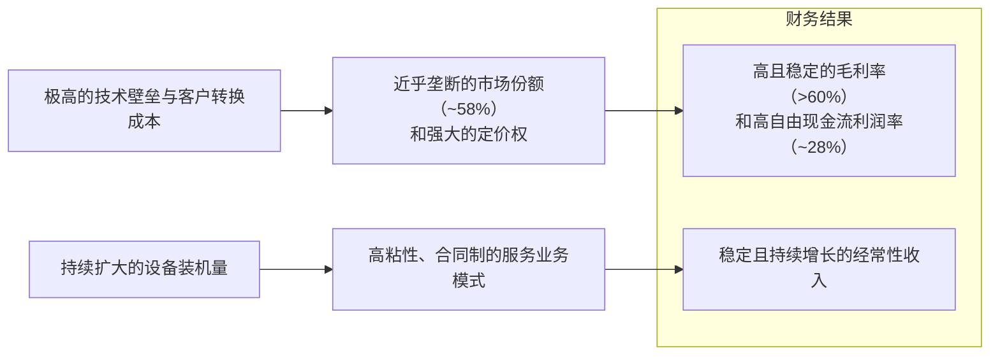

<!-- 匹配到的证券/行业：科磊(KLAC.O) -->
操作成功

### 一页通 （科磊 (KLAC.O)）
日期：2026-08-06
内容："""
## 公司概况

科磊是全球半导体过程控制（量检测）领域的绝对龙头，主要提供晶圆检测、量测、数据分析和相关服务，帮助芯片制造商在研发到量产的整个过程中提升良率、降低成本。公司在光学检测、电子束检测、掩模检测等核心环节拥有<strong>约58%的市场份额</strong>，是第二名竞争对手的<strong>约6倍</strong>。其业务高度集中于半导体过程控制（营收占比约89%），并延伸至先进封装、特种半导体工艺和PCB检测。公司客户覆盖全球所有主要逻辑代工、存储IDM及先进封装厂商，深度嵌入AI基础设施扩张的关键路径。   

## 公司近况跟踪

- <strong>FY26Q4业绩超预期</strong>：FY26Q4（截至2026年6月30日）营收<strong>36.58亿美元</strong>，同比增长<strong>15%</strong>，环比增长<strong>7%</strong>，创历史新高，高于指引中值（35.75亿美元）。Non-GAAP毛利率<strong>62.4%</strong>，位于指引区间上沿。Non-GAAP摊薄EPS <strong>1.05美元</strong>，高于指引中值（0.99美元）。   
- <strong>WFE展望年内第四次上修</strong>：公司将2026年晶圆设备（WFE，含先进封装）市场规模预期从<strong>1400亿美元以上</strong>上调至<strong>约1500亿美元的低位</strong>，较2025年约1200亿美元增长<strong>约25%</strong>。同时，公司首次给出2027年WFE初步展望，认为市场共识约<strong>1900亿美元</strong>（增长约25%）是合理的，并正按更乐观情景储备产能。   
- <strong>先进封装业务指引大幅上调</strong>：公司将2026年先进封装过程控制营收预期从<strong>约10亿美元</strong>上调至<strong>约11亿美元</strong>，同比增长超过<strong>70%</strong>，增速接近先进封装市场整体增速的两倍。增长主要来自前道设计系统向封装环节的加速导入和份额提升。   
- <strong>订单积压强劲</strong>：截至FY26Q4末，公司未交付订单（RPO/Backlog）约<strong>125亿美元</strong>，同比增长约<strong>60%</strong>，为2026年下半年及2027年的增长提供较强可见性。公司整体平均交期约<strong>12个月</strong>，部分高需求产品交期达<strong>18-24个月</strong>。  
- <strong>存储成本逆风持续</strong>：公司用于图像处理计算机的DRAM芯片成本持续上涨，对毛利率的负面影响超过<strong>100个基点</strong>，管理层预计该逆风将至少持续至2027年。公司正通过新产品重新定价和设计优化（如转向DDR5）来应对。   

## 短期逻辑

1. <strong>2H26营收加速兑现与CY27增长预期强化</strong>：公司指引FY27Q1（9月季度）营收<strong>40亿美元</strong>（环比+9.4%），并预计2026年下半年营收较上半年增长<strong>约20%</strong>，隐含12月季度营收约<strong>44-45亿美元</strong>。这一加速主要由长交期零部件供应缓解驱动。更重要的是，公司基于约125亿美元的积压订单和对客户投资的可见度，表达了对2027年“显著增长”的信心。若后续季度指引持续上修，将推动市场对CY27的盈利预期上调，构成股价上行催化。   

2. <strong>先进封装业务超预期增长</strong>：公司将2026年先进封装过程控制营收预期上调至<strong>11亿美元</strong>（同比增长超70%），增速远超市场整体。这一上调主要源于前道量检测设备在先进封装环节的加速渗透和份额提升，尤其是混合键合（Hybrid Bonding）和SoIC等新技术对更高精度检测的需求。该业务交期较短，对营收的拉动效应在2026年下半年将更为显著，且市场一致预期其2027年有望延续强劲增长，成为公司超越WFE增速的关键结构性驱动力。   

3. <strong>WFE市场展望上修与客户群扩大</strong>：公司年内第四次上修2026年WFE展望至<strong>约1500亿美元</strong>，并指出2027年有望达到<strong>1900亿美元</strong>。增长动力正从过去集中于台积电等少数领先厂商，扩散至英特尔、三星、Rapidus、TeraFab等更多参与者，同时DRAM（尤其是HBM）和NAND的投资也在增加。这种客户和终端市场的广度，增强了KLA在2027年跑赢WFE市场增长的可能性，尤其是当更多新进入者在先进制程爬坡初期对过程控制有更高依赖度时。   

## 长期逻辑

1. <strong>过程控制强度结构性提升</strong>：随着芯片制程向2nm及以下演进、EUV光刻层数增加、芯片设计复杂度（如大尺寸Die、3D堆叠）提升，制造过程中产生致命缺陷的概率和成本急剧上升。这推动芯片制造商在研发和量产阶段增加检测和量测的步骤与采样率，使得过程控制支出占WFE的比例（过程控制强度）持续提升。公司预计2025-2030年其WFE份额将再提升<strong>超过150个基点</strong>，这是其长期营收增速超越WFE市场增速的核心逻辑。  

2. <strong>AI驱动的先进封装新赛道</strong>：AI芯片对高带宽内存（HBM）和异构集成的需求，推动了2.5D/3D先进封装技术的爆发。封装环节的精度要求正从微米级向纳米级演进，使得原本用于前道晶圆制造的检测和量测设备（如激光扫描、宽带等离子体检测）被大量引入封装产线。KLA凭借在前道过程控制的绝对优势，在这一新兴市场占据了领先份额，并有望在未来数年持续受益于SoIC、混合键合等技术的渗透率提升，开辟出可观的增量市场。  

3. <strong>高粘性服务业务构建稳定现金流</strong>：公司的服务业务营收约<strong>80%</strong> 基于长期合同，随着累计装机设备基数的扩大和系统复杂度的提升，客户对KLA服务的依赖度日益增强。FY26Q4服务营收<strong>8.20亿美元</strong>，同比增长<strong>17%</strong>。管理层预计服务业务的长期增速将维持在<strong>13%-15%</strong> 的区间，且随着2026-2027年大量新设备出货，未来增速有望向区间上沿靠拢。这种“剃须刀+刀片”的商业模式为公司提供了穿越周期的稳定现金流和较高的盈利可预测性。   

## 风险提示

- <strong>存储芯片成本逆风与毛利率压力</strong>：公司产品中大量使用DRAM芯片，当前存储芯片价格持续上涨，对毛利率造成超过<strong>100个基点</strong>的负面影响，且管理层预计该逆风将至少持续至2027年。尽管公司尝试通过新产品重新定价和设计优化来应对，但短期内难以完全对冲，可能压制毛利率的扩张速度，使公司长期毛利率目标（63.5%±500bps）的实现路径延长。   

- <strong>2026年WFE份额增长乏力</strong>：由于2026年WFE支出结构偏向DRAM（尤其是HBM）和特定逻辑客户的产能扩张，而KLA在这些领域的相对过程控制强度低于其在先进逻辑节点的水平，导致其2026年营收增速可能仅与WFE市场持平或略高，未能显著跑赢。若2027年这一趋势延续，将动摇市场对其“结构性跑赢WFE”的核心投资逻辑。  

- <strong>地缘政治与出口管制风险</strong>：公司约<strong>26%</strong> 的营收来自中国大陆，且美国对华半导体出口管制政策持续收紧。近期对华虹等特定晶圆厂的限制已产生一定影响。若未来管制范围进一步扩大至更多中国客户或更广泛的设备类型，可能导致公司损失部分市场，并面临中国本土竞争对手在受限市场加速替代的风险。  

## 近期要闻

- <strong>2026年6月11日</strong>：公司完成<strong>10比1</strong>的股票拆分，并宣布将季度股息上调<strong>21%</strong> 至每股0.23美元（拆分后），同时新增<strong>70亿美元</strong>的股票回购授权。 
- <strong>2026年7月28日</strong>：公司发布FY26Q4财报，营收创历史新高，同时将2026年WFE展望上调至约1500亿美元，并给出强劲的FY27Q1指引。但由于指引仅略超市场预期，且毛利率逆风持续，股价在盘后交易中下跌。  

## 未来催化

- <strong>2026年10月（预计）</strong>：公司发布FY27Q1（9月季度）财报。若实际营收和毛利率达到或超过指引中值（40亿美元/62.5%），并进一步上调2027年WFE或公司自身增长展望，将有望提振市场信心。 
- <strong>2026年下半年</strong>：主要客户（如英特尔、三星、台积电）可能公布更详细的2027年资本开支计划。若其资本开支指引显著高于市场预期，尤其是对先进逻辑和先进封装的投资，将直接催化KLA股价。  
- <strong>2026年9月-11月</strong>：行业峰会（如SEMICON Taiwan）期间，公司管理层或产业链其他环节可能透露更乐观的2027年需求信号和订单能见度，强化市场对半导体设备行业超级周期的预期。 

## 公司业务模式及拆分

### 业务边际变化

公司近年业务重心持续向半导体过程控制（SPC）集中，该板块营收占比已提升至约<strong>89%</strong>。增长驱动力从传统的逻辑代工，扩展至AI驱动的HBM存储和先进封装。先进封装过程控制成为增长最快的新兴业务，公司预计2026年该业务营收将达<strong>11亿美元</strong>（同比增长超70%）。同时，公司于2024年退出了平板显示业务，并持续优化PCB和特种半导体业务的结构，聚焦于受高性能计算和先进封装拉动的高价值领域。  

### 盈利模式

公司盈利模式的核心是基于<strong>技术壁垒和客户粘性</strong>的“剃须刀+刀片”模式。一方面，公司通过销售高精度、高价值的检测和量测系统获取一次性收入，其技术领先地位和接近垄断的市场份额赋予了较强的定价权。另一方面，随着设备装机量的累积，公司通过提供长期的维护、维修、咨询和软件升级服务，获得稳定且持续增长的经常性收入。这种模式使得公司营收和利润的可预测性高于多数半导体设备同行。  

### 业务拆分

公司业务主要按三个报告分部划分：半导体过程控制（SPC）、特种半导体工艺、以及PCB和元件检测。SPC是公司的绝对核心，营收占比约90%，其增长态势决定了公司的整体业绩走向。PCB和元件检测业务在FY26Q4因AI芯片封装检测需求拉动而同比大增<strong>56%</strong>，成为重要的增量贡献者。公司当前处于<strong>业绩兑现期</strong>，受益于前期大量订单的交付和AI需求的持续落地。  

<strong>细分业务拆分（按报告分部，含服务）</strong>

| 报告分部 (单位：亿美元) | FY2024 | FY2025 | FY2026 | FY26Q4 占比 |
|---|---|---|---|---|
| <strong>截止日期</strong> | <strong>2024-06-30</strong> | <strong>2025-06-30</strong> | <strong>2026-06-30</strong> | <strong>2026-06-30</strong> |
| <strong>半导体过程控制</strong> | - | - | - | - |
| 收入 | 87.34 | 109.47 | 121.61 | 89% |
| 同比 | - | 25.3% | 11.1% | - |
| <strong>特种半导体工艺</strong> | - | - | - | - |
| 收入 | 5.29 | 5.87 | 5.85 | 4% |
| 同比 | - | 11.0% | -0.3% | - |
| <strong>PCB和元件检测</strong> | - | - | - | - |
| 收入 | 5.52 | 6.22 | 8.33 | 7% |
| 同比 | - | 12.7% | 33.9% | - |
| <strong>总计</strong> | <strong>98.12</strong> | <strong>121.56</strong> | <strong>135.79</strong> | <strong>100%</strong> |

*注：历史财年分部数据未在资料中完整披露，此处FY2024-FY2026数据根据财报及研报信息整理，FY26Q4占比为近似值。*

<strong>半导体过程控制（SPC）</strong>：FY26Q4（即2026年4-6月季度）该分部营收<strong>32.57亿美元</strong>，同比增长<strong>13%</strong>，环比增长<strong>6%</strong>。增长主要来自AI驱动的先进逻辑代工和HBM存储客户的持续投资。其中，来自代工/逻辑客户的系统收入占比约<strong>79%</strong>，存储客户占比约<strong>21%</strong>（存储中DRAM占90%）。该业务是公司高毛利率的核心来源，系统毛利率通常在<strong>70%以上</strong>。  

<strong>特种半导体工艺</strong>：FY26Q4营收<strong>1.60亿美元</strong>，同比增长<strong>13%</strong>，环比下降<strong>3%</strong>。该业务主要为MEMS、射频、功率半导体等提供真空沉积和刻蚀设备，市场相对稳定，增长受特定客户项目周期影响。  

<strong>PCB和元件检测</strong>：FY26Q4营收<strong>2.41亿美元</strong>，同比大增<strong>56%</strong>，环比增长<strong>44%</strong>。强劲增长主要受AI芯片所使用的高性能计算封装和IC基板检测需求拉动，尤其是高密度PCB（HDI PCB）转型带来的增量机会。该业务已成为公司重要的增长极。  

## 核心竞争力

<strong>竞争要素 1：依托极高转换成本与技术领先构筑的结构性护城河</strong>

- <strong>护城河定性</strong>：<strong>结构性护城河</strong>。过程控制设备需深度嵌入客户的制造流程，其算法和模型需与客户特定工艺长期磨合和校准。一旦客户在某个技术节点采用了KLA的检测方案，其良率学习曲线便与KLA设备深度绑定。更换供应商意味着需要重新进行耗时长、成本高的数据积累和模型训练，并承担巨大的良率损失风险。同时，KLA在光学检测、电子束检测等核心技术上的持续高研发投入，使其产品性能始终保持行业领先。  
- <strong>数据验证</strong>：公司过程控制市场份额高达<strong>约58%</strong>，是第二名竞争对手的<strong>约6倍</strong>。公司FY2026的Non-GAAP毛利率高达<strong>62.4%</strong>，FY26Q4的Non-GAAP营业利润率为<strong>43.7%</strong>，均显著高于半导体设备行业平均水平，体现了强大的定价能力和规模效应。  
- <strong>动态演变</strong>：<strong>护城河变宽（巩固）</strong>。随着芯片制程向2nm及以下演进、芯片结构从单芯片向3D异构集成发展，制造过程的复杂度和对缺陷的敏感度呈指数级上升。这进一步提升了过程控制的重要性，并加大了客户更换供应商的风险和成本，从而巩固了KLA的市场地位。  

<strong>竞争要素 2：以“剃须刀+刀片”模式构建的客户粘性与经常性收入</strong>

- <strong>护城河定性</strong>：<strong>结构性护城河</strong>。公司的服务业务并非简单的维修保养，而是涵盖设备性能优化、良率管理咨询和软件升级的高价值服务。随着KLA设备装机量的累积和系统复杂度的提升，客户对KLA服务的依赖度日益增强。服务合同续约率高，为公司提供了高度可预测的经常性收入流，平滑了设备销售的周期性波动。  
- <strong>数据验证</strong>：FY26Q4服务业务营收<strong>8.20亿美元</strong>，同比增长<strong>17%</strong>，已连续<strong>17年</strong>实现同比增长。服务业务约<strong>80%</strong> 的收入来自长期合同，为公司贡献了稳定的现金流。过去12个月（LTM）自由现金流达<strong>40亿美元</strong>，自由现金流利润率<strong>28%</strong>。  
- <strong>动态演变</strong>：<strong>护城河变宽（巩固）</strong>。随着2026-2027年大量新系统出货，公司的设备装机基数将进一步扩大，为未来数年的服务业务增长奠定基础。管理层预计服务业务的长期增速将维持在<strong>13%-15%</strong>，且有望向区间上沿靠拢。 

<strong>现阶段核心驱动力总结</strong>：公司的Alpha来源于其在过程控制领域近乎垄断的市场地位和由技术复杂性带来的高转换成本，这使其能够持续获得超越行业平均的盈利能力和增长。其Beta则与全球半导体资本开支周期，尤其是先进逻辑和存储的资本开支强度密切相关。当前，AI驱动的技术升级周期为KLA提供了强劲的Beta，而先进封装和过程控制强度的提升则构成了其独特的Alpha来源。 

<strong>竞争格局传导逻辑图</strong>

## 产销链

- <strong>客户情况</strong>：公司客户高度集中，主要为全球领先的逻辑代工厂（如台积电、英特尔、三星）和存储IDM（如三星、SK海力士、美光）。FY26Q4，<strong>两个客户</strong>各自贡献了超过10%的营收。公司对头部客户的依赖度较高，但客户结构正从过去集中于台积电，向英特尔、三星、Rapidus等更多参与者扩散，这在一定程度上有助于分散风险。公司正与多家客户就2027年及以后的产能需求进行积极沟通。  
- <strong>供应商情况</strong>：公司采用外包制造策略，依赖众多供应商提供零部件和子系统。部分关键零部件（如高端光学元件、特定DRAM芯片）存在单一或有限来源风险。近期，用于图像处理计算机的DRAM芯片因供应商停产和行业需求激增而出现短缺和大幅涨价，对公司的成本结构构成了显著压力。公司正通过重新设计系统以兼容新一代内存（DDR5）来缓解长期供应风险。  
- <strong>成本传导能力</strong>：当上游原材料（如DRAM芯片）涨价时，公司短期内难以将成本完全转嫁给客户，尤其是在已签订单上。公司赚取的是<strong>技术溢价</strong>，而非简单的加工费。其应对策略是通过推出新一代产品，在提升性能的同时重新定价，以反映新的成本结构并获取新增价值。因此，成本传导存在一定的时滞，短期毛利率会承压，但长期可通过产品迭代修复。 

## 财务数据

<strong>关键财务数据</strong>

| 项目 (单位：亿美元) | FY2024 | FY2025 | FY2026 |
|---|---|---|---|
| <strong>截止日期</strong> | <strong>2024-06-30</strong> | <strong>2025-06-30</strong> | <strong>2026-06-30</strong> |
| 营业总收入 | 98.12 | 121.56 | 135.79 |
| 收入同比 | -6.51% | 23.89% | 11.71% |
| 营业成本 | 39.28 | 47.52 | 52.55 |
| <strong>毛利润</strong> | <strong>58.84</strong> | <strong>74.04</strong> | <strong>83.24</strong> |
| <strong>毛利率</strong> | <strong>60.0%</strong> | <strong>60.9%</strong> | <strong>61.3%</strong> |
| 研发费用 | 12.79 | 13.60 | 15.32 |
| 销售及管理费用 | 9.70 | 10.30 | 11.32 |
| <strong>营业利润</strong> | <strong>36.36</strong> | <strong>50.14</strong> | <strong>56.61</strong> |
| <strong>营业利润率</strong> | <strong>37.1%</strong> | <strong>41.2%</strong> | <strong>41.7%</strong> |
| 归母净利润 | 27.62 | 40.62 | 48.31 |
| <strong>归母净利润率</strong> | <strong>28.1%</strong> | <strong>33.4%</strong> | <strong>35.6%</strong> |
| 稀释每股收益 (美元) | 20.28 | 30.38 | 36.60 |
| 经营活动现金流净额 | 33.09 | 40.82 | 41.43 |
| 自由现金流 | 30.31 | 37.47 | 37.67 |

*注：自由现金流根据财报数据计算（经营活动现金流净额 - 资本性支出）。FY2026资本性支出为3.76亿美元。*

<strong>财务分析</strong>

- <strong>成长能力</strong>：公司FY2026营收同比增长<strong>11.71%</strong>，较FY2025的<strong>23.89%</strong> 有所放缓，但仍处于稳健增长区间。归母净利润同比增长<strong>18.94%</strong>，高于营收增速，显示出盈利能力的持续改善。增长主要由AI驱动的先进逻辑和HBM投资，以及服务业务的持续扩张推动。 
- <strong>盈利能力</strong>：公司FY2026毛利率为<strong>61.3%</strong>，同比提升0.4个百分点；营业利润率为<strong>41.7%</strong>，同比提升0.5个百分点；归母净利润率为<strong>35.6%</strong>，同比提升2.2个百分点。利润率提升主要得益于服务业务占比增加、产品组合优化和规模效应，部分被存储芯片成本上涨和关税所抵消。公司盈利能力在半导体设备行业中处于顶尖水平。 
- <strong>运营能力</strong>：FY2026末存货为<strong>36.49亿美元</strong>，同比增加<strong>13.6%</strong>，存货周转天数约为<strong>236天</strong>，维持在较高水平，这与公司为支持未来数个季度的营收增长而主动增加库存的策略一致。应收账款为<strong>28.89亿美元</strong>，同比增加<strong>27.6%</strong>，应收账款周转天数约为<strong>61天</strong>，处于合理范围。 
- <strong>偿债能力与股东回报</strong>：FY2026末，公司总债务为<strong>58.87亿美元</strong>，现金及现金等价物和有价证券合计<strong>49.03亿美元</strong>，净债务约为<strong>9.84亿美元</strong>。公司现金流强劲，FY2026自由现金流为<strong>37.67亿美元</strong>。公司持续通过大规模回购（FY26回购<strong>22.90亿美元</strong>）和分红（FY26分红<strong>10.58亿美元</strong>）回报股东，显示出管理层对业务前景的信心和优秀的资本配置能力。 

## 行业及竞争分析

科磊所处的核心赛道是<strong>半导体过程控制（量检测）</strong>，这是一个高度专业化、技术壁垒极高的细分市场。该市场是半导体制造过程中不可或缺的一环，其需求与芯片设计复杂度、制造工艺难度和良率要求直接相关。 

- <strong>市场规模与增速</strong>：过程控制市场是WFE市场的重要组成部分。随着AI芯片对先进制程和先进封装的需求激增，过程控制强度持续提升，其市场增速有望持续高于整体WFE市场。公司预计其2025-2030年的WFE份额将提升超过150个基点。  
- <strong>行业发展趋势</strong>：1）<strong>检测精度向纳米级迈进</strong>：随着制程微缩和3D堆叠技术（如GAA、HBM）的应用，对纳米级缺陷的检测需求急剧增加，推动了更高精度光学和电子束检测设备的应用。2）<strong>过程控制从晶圆厂延伸至封装厂</strong>：先进封装（如CoWoS、SoIC）的精度要求已接近前道工艺，使得原本用于晶圆制造的量检测设备开始在封装环节大规模应用，开辟了全新的增量市场。3）<strong>AI赋能数据分析</strong>：KLA等公司正将AI算法集成到检测设备中，以加速缺陷识别、分类和根本原因分析，提升设备效率和客户良率。  
- <strong>竞争格局</strong>：KLA在该市场占据<strong>约58%</strong> 的份额，处于绝对主导地位，其规模是第二名竞争对手的<strong>约6倍</strong>。主要竞争对手包括应用材料（AMAT）、ASML、日立高新（Hitachi High-Tech）、Lasertec和Onto Innovation等。竞争格局相对稳定，KLA凭借其完整的产品组合、深厚的技术积累和与头部客户的深度绑定，持续巩固其护城河。在中国市场，由于出口管制，部分本土竞争对手获得了一些份额，但在全球范围内的公平竞争环境下，KLA的领先地位难以撼动。  

<strong>可比公司</strong>

| 公司名称 | 股票代码 | 主要竞争领域 | 与科磊的差异 |
|---|---|---|---|
| 应用材料 (Applied Materials) | AMAT | 过程控制、薄膜沉积、刻蚀等 | 平台型公司，业务线更广，但在过程控制领域份额远低于KLA。 |
| ASML Holding | ASML | 光刻、电子束检测 | 在光刻领域垄断，但在过程控制领域仅涉及部分电子束检测，与KLA形成互补而非全面竞争。 |
| 泛林半导体 (Lam Research) | LRCX | 刻蚀、薄膜沉积 | 以刻蚀见长，不直接参与过程控制市场的竞争。 |
| Lasertec Corporation | 6920.T | 掩模检测、晶圆检测 | 在EUV掩模检测等特定细分市场是KLA的直接竞争对手，但规模和产品线广度远不及KLA。 |

总结来看，科磊在其核心的过程控制市场中，凭借技术、产品组合和客户粘性构建了强大的竞争壁垒，其市场地位短期内难以被撼动。AI驱动的技术升级和先进封装市场的爆发，为公司的长期增长提供了广阔空间。 

## 市场焦点议题

<strong>议题一：2026年WFE份额增长停滞，过程控制强度提升逻辑是否被打破？</strong>

- <strong>背景</strong>：公司长期的核心投资逻辑是过程控制强度提升将使其营收增速持续超越WFE市场增速。然而，2026年由于WFE支出结构偏向DRAM和特定逻辑客户，KLA的营收增速与WFE市场增速的差距并不显著，引发市场对其长期Alpha的质疑。  
- <strong>问题列表</strong>：
  - 2026年KLA的WFE份额是否仅能持平或微增？这是短期供应限制还是结构性变化？
  - 2027年随着更多先进逻辑客户（如英特尔、Rapidus）和新建晶圆厂（Greenfield）的加入，过程控制强度能否显著提升并驱动KLA跑赢WFE？
  - 在DRAM（尤其是HBM）领域，KLA的过程控制强度提升空间有多大？能否复制其在先进逻辑领域的优势？

<strong>议题二：存储芯片成本逆风对毛利率的压制何时缓解？</strong>

- <strong>背景</strong>：公司产品中大量使用的DRAM芯片价格持续上涨，对毛利率造成了超过100个基点的负面影响，且管理层预计将持续至2027年。这直接压制了公司毛利率向长期目标（63.5%）迈进的步伐。  
- <strong>问题列表</strong>：
  - 公司能否通过向客户提价来完全对冲存储芯片成本的上涨？提价策略的执行难度和时滞如何？
  - 转向DDR5等新一代内存的设计优化何时能完成，并在多大程度上缓解成本压力？
  - 存储芯片价格何时能迎来拐点？若价格回落，是否能迅速转化为毛利率的显著提升？

<strong>议题三：先进封装业务的增长质量和可持续性</strong>

- <strong>背景</strong>：先进封装过程控制是公司增长最快的新兴业务，2026年营收预期已上调至11亿美元。市场关注这一高增长是否主要由头部客户（如台积电CoWoS）的一次性大规模扩产驱动，以及其长期增长潜力。  
- <strong>问题列表</strong>：
  - 2026年先进封装业务超70%的增长中，有多少来自市场总规模（TAM）的扩张，多少来自KLA的份额提升？
  - 先进封装业务的毛利率水平如何？随着规模扩大，其盈利能力能否向公司平均水平靠拢？
  - 混合键合、SoIC等新技术的渗透率提升，将为KLA带来多大的增量市场空间？

## 市场分歧探讨

<strong>核心分歧：KLA在2027年及以后能否持续跑赢WFE市场增长？</strong>

- <strong>乐观方观点</strong>：认为2026年KLA增长与WFE持平是暂时的，主要受供应限制和特定客户支出节奏影响。2027年，随着英特尔、三星、Rapidus等更多客户进入先进制程大规模投资阶段，以及大量新建晶圆厂（Greenfield）对过程控制设备的初始需求，过程控制强度将显著提升。此外，先进封装和HBM对过程控制的高需求将成为结构性驱动力，使KLA在2027年及以后重新获得显著超越WFE的增长。公司约<strong>125亿美元</strong>的强劲积压订单和客户对2027年交付的积极讨论，为这一观点提供了支撑。  

- <strong>谨慎方观点</strong>：担忧AI驱动的这轮资本开支周期中，WFE的增长更多来自“量”的扩张（即大量建设产能），而非“质”的提升（即技术复杂度提升）。在产能扩张阶段，刻蚀、沉积等设备的支出比例可能更高，而过程控制强度可能被稀释。此外，存储（尤其是DRAM）在WFE中的占比提升，对KLA相对不利，因为其在存储领域的过程控制强度低于先进逻辑。如果2027年WFE增速放缓，而KLA未能展现出明显的Alpha，其当前较高的估值可能面临下行压力。  

<strong>总结分析</strong>：从产业趋势看，过程控制强度提升的逻辑依然稳固。AI芯片的复杂度、先进封装技术的渗透以及更多玩家进入先进制程，都构成了对KLA有利的结构性因素。2026年的增长持平更可能是一次性的“换挡”期，而非趋势的逆转。然而，KLA能否在2027年实现显著的超额增长，将取决于其能否在DRAM和先进封装领域成功复制其在先进逻辑领域的统治力，以及全球半导体资本开支的持续性。当前估值已部分反映了乐观预期，任何低于预期的增长信号都可能导致股价波动。 

## 盈利预测与估值

<strong>管理层最新指引</strong>：
- <strong>FY27Q1（2026年9月季度）</strong>：营收预计为<strong>40亿美元</strong>（±2亿美元）；Non-GAAP毛利率预计为<strong>62.5%</strong>（±1个百分点）；Non-GAAP摊薄EPS预计为<strong>1.16美元</strong>（±0.10美元）。  
- <strong>2026全年（CY2026）</strong>：预计营收将实现<strong>中20%区间</strong>的增长；Non-GAAP毛利率预计约为<strong>62.5%</strong>。 

<strong>券商盈利预测与估值</strong>

| 机构 | 评级 | 目标价(美元) | 财务指标 | FY2026A | FY2027E | FY2028E |
|---|---|---|---|---|---|---|
| <strong>美国银行</strong> (2026-05-06) | 买入 | 2100 | 营业收入(百万美元) | 13,497 | 16,785 | 19,355 |
| | | | Non-GAAP EPS(美元) | 36.93 | 49.04 | 57.56 |
| <strong>摩根大通</strong> (2026-07-29) | 超配 | 238 | 营业收入(百万美元) | 13,579 | 18,030 | - |
| | | | Non-GAAP EPS(美元) | 3.77 | 5.47 | - |
| <strong>花旗</strong> (2026-07-29) | 买入 | 290 | 营业收入(百万美元) | 13,579 | 17,837 | 21,115 |
| | | | Non-GAAP EPS(美元) | 3.76 | 5.36 | 6.59 |
| <strong>高盛</strong> (2026-08-04) | 中性 | 210 | 营业收入(百万美元) | 13,580 | 18,425 | 21,472 |
| | | | Non-GAAP EPS(美元) | 3.76 | 5.58 | 6.61 |
| <strong>瑞银</strong> (2026-07-30) | 中性 | 215 | 营业收入(百万美元) | 13,579 | 18,135 | 23,475 |
| | | | Non-GAAP EPS(美元) | 3.77 | 5.47 | 7.63 |

*注：各机构财年截止日期均为6月30日。美国银行预测数据为拆分前价格，EPS为拆分前数据。*

<strong>分析</strong>：各机构对KLA的盈利预测存在一定分歧，反映了市场对2027年及以后增长前景的不同看法。乐观方（如花旗、摩根大通）基于WFE市场持续扩张和过程控制强度提升，给出了更高的营收和EPS预测，并使用了较高的市盈率进行估值。谨慎方（如高盛、瑞银）则更关注公司短期增长放缓和毛利率压力，估值倍数相对保守。整体而言，市场对KLA的评级仍以“买入”或“超配”为主，显示出对其长期价值的认可，但对短期催化剂的强度和估值水平存在争议。
"""
