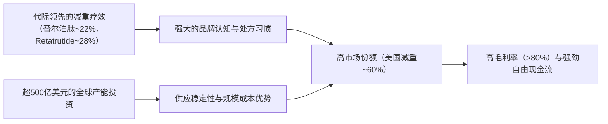

# Gangtise 公司一页通：礼来（LLY.N）

> 拉取日期：2026-07-30 ｜ 来源：gangtise-agent `stock-one-pager`

## 公司概况

礼来是全球领先的跨国制药巨头，核心业务聚焦人类药品的发现、开发、制造与销售。公司当前处于由GLP-1/GIP双靶点药物替尔泊肽驱动的超级成长周期，该系列产品已登顶全球“药王”。凭借在心脏代谢健康领域的绝对统治力，礼来已成为全球市值最大的制药公司，并正利用其强劲的现金流向肿瘤、免疫、神经科学及基因治疗等领域进行史无前例的多元化扩张。 

## 公司近况跟踪

- **口服GLP-1药物Foundayo（orforglipron）商业化启动但早期爬坡低于预期**：该药于2026年4月1日获FDA批准，4月9日上市。截至7月中旬，周度总处方量约2.7万张，市场份额约13.6%，低于市场此前的高预期。管理层指出，80%以上的处方来自GLP-1新患，且约80%的处方由初级保健医生开具，显示其具有市场扩张效应。IQVIA数据存在约10%的捕获缺口，且公司尚未启动大规模推广，预计3Q26开启全面促销活动。  
- **Retatrutide（GLP-1/GIP/GCG三靶点激动剂）公布两项关键III期阳性数据**：TRIUMPH-2（合并2型糖尿病的肥胖）和TRIUMPH-3（合并心血管疾病的重度肥胖）均达主要终点，12mg剂量组80周减重分别达20.8%和22.6%。公司计划于1Q27提交生物制品许可申请。TRIUMPH-3中MACE-3（心血管死亡、心梗、卒中）HR为1.12，但事件数极少，且治疗中分析HR为0.92，市场对此存在一定分歧。  
- **替尔泊肽注射剂系列持续强劲，市占率稳固**：1Q26 Mounjaro收入86.62亿美元，Zepbound收入41.60亿美元。截至1Q26，Mounjaro在美国2型糖尿病总处方市占率约51%，Zepbound在美国减重总处方市占率约60%。公司整体肠促胰素资产全球市占率达53.2%。 
- **Medicare减肥药覆盖正式落地**：自2026年7月1日起，Medicare“桥接计划”启动，符合条件的受益人可按每月50美元的自付费用获取Zepbound和Foundayo。首周数据显示，Zepbound KwikPen处方量周环比增长23.8%，显示早期需求强劲。 
- **并购狂潮持续，加速非代谢领域布局**：2026年上半年，礼来完成了超250亿美元的并购交易，涵盖体内CAR-T、环状RNA、迷幻药、疫苗、AI制药等多个前沿领域。7月宣布以最高38亿美元收购迷幻药公司AtaiBeckley，进军精神疾病治疗领域。   

## 短期逻辑

1. **2Q26财报（8月5日）的预期差博弈**：市场普遍预期2Q26业绩将再次由海外Mounjaro驱动超预期。机构预测营收约208亿美元，高于市场共识的205亿美元。核心变量在于：1）海外Mounjaro的环比增长动能，共识预期仅2%环比增长，而机构预测可达10%以上；2）公司是否会上调全年收入指引，目前机构预测全年收入861亿美元，高于公司指引上限的850亿美元。若公司上调指引，有望复制1Q26财报后的股价强势表现。Foundayo的疲软已被市场充分消化，不太可能构成负面冲击。  

2. **口服GLP-1市场的认知重塑**：Foundayo早期处方数据平淡，与诺和诺德口服司美格鲁肽的强劲表现形成对比，导致市场对礼来在口服减肥药领域的竞争力产生怀疑。然而，随着3Q26全面促销开启、所有主要PBM（药品福利管理机构）均提供覆盖、以及Medicare渠道的放量，Foundayo的处方增长轨迹可能出现拐点。任何显示加速的信号都可能修复市场对该产品远期价值的折价。   

3. **Retatrutide监管路径的明确化**：TRIUMPH-3数据公布后，市场对MACE-3的轻微失衡存在疑虑。未来数月内，随着公司与FDA的沟通进展及更多数据分析的披露，若市场对心血管安全性信号的担忧消退，并认可其作为生物制品的监管优势（更长的市场独占期、免受IRA小分子惩罚），将有助于提升对这款下一代核心产品的估值预期。  

## 长期逻辑

1. **GLP-1特许经营权的深度与广度扩张**：替尔泊肽系列正从单纯的降糖/减重药物演变为心肾代谢综合征的基础疗法。其已获批阻塞性睡眠呼吸暂停，并有望获批心血管适应症。后续管线中，三靶点Retatrutide（减重近30%）、Amylin联合疗法（减重25-29%）和口服周制剂等下一代产品，将构建起从注射到口服、从单靶点到多靶点的全方位矩阵。机构预测全球GLP-1市场2030年可达1300-1900亿美元，礼来有望凭借其产品代际优势占据约65%的市场份额。 

2. **“现金牛”驱动的平台型公司转型**：礼来正利用替尔泊肽带来的史无前例的现金流，进行一场目标明确的战略转型。2026年上半年超250亿美元的并购并非盲目撒网，而是系统性地补强了基因治疗、细胞治疗、神经科学和AI药物发现四大技术平台。这一策略旨在摆脱对单一产品的过度依赖，将公司重塑为拥有多技术引擎的制药平台，为2030年代中期替尔泊肽专利到期后的增长真空做好准备。   

3. **AI驱动的研发效率革命**：礼来正将AI深度整合进从药物发现到生产的全价值链。公司与英伟达合作建设制药行业最强大的AI超级计算机，并推出TuneLab平台，利用其超过10亿美元成本积累的专有实验数据训练模型。管理层预计，AI可将药物从概念到临床的时间从4年缩短至18个月，并将早期临床成功率从5-8%提升至15-19%。若这一愿景实现，将从根本上改变公司的研发投入产出比，构成难以复制的数据-算力飞轮。  

## 风险提示

- **产品集中度风险**：Mounjaro和Zepbound在1Q26贡献了公司约65%的总收入。任何针对替尔泊肽的严重安全性事件、竞争格局突变（如诺和诺德高剂量Wegovy、CagriSema的冲击）或超预期的价格压力，都将对公司财务表现和估值中枢产生不成比例的负面影响。 
- **定价与政策风险**：尽管公司与美国政府达成了初步定价协议，但《通胀削减法案》已选定Trulicity和Verzenio在2028年进行政府定价谈判，未来替尔泊肽系列被纳入谈判是大概率事件。此外，美国政府对药品定价的持续干预以及全球范围内的成本控制措施，可能导致公司净售价的下降速度快于预期，侵蚀其高毛利率。  
- **研发与整合风险**：公司正在进行大规模、高密度的并购，后续的管线整合、文化融合及项目推进存在固有的失败风险。Retatrutide的心血管安全性仍需更大规模的结局研究验证，Eloralintide等早期管线也存在临床失败的可能。迷幻药等新兴领域的监管路径仍存在不确定性。    

## 近期要闻

- **2026年4月1日**：FDA批准礼来口服GLP-1药物Foundayo（orforglipron）用于治疗肥胖症。  
- **2026年4月21日**：美国医疗保险和医疗补助服务中心决定将Medicare肥胖GLP-1“桥接”覆盖计划延长至2027年底。 
- **2026年5月28日**：礼来宣布美国三大PBM均对其肥胖症产品组合提供覆盖，包括CVS/Caremark从6月1日起覆盖Foundayo。 
- **2026年7月1日**：Medicare GLP-1“桥接计划”正式启动，符合条件的受益人可按每月50美元获取礼来减肥药。 
- **2026年7月16日**：礼来宣布以最高38亿美元收购迷幻药公司AtaiBeckley，进军精神疾病治疗领域。  
- **2026年7月22日**：礼来公布Retatrutide两项III期研究（TRIUMPH-2和TRIUMPH-3）的阳性顶线数据，并计划于1Q27提交上市申请。  

## 未来催化

- **2026年8月5日**：礼来将公布2Q26财报。市场关注点在于海外Mounjaro能否再次驱动业绩超预期，以及公司是否会同步上调全年业绩指引。  
- **2026年第三季度**：Foundayo将开启全面商业推广活动。随着促销力度加大和Medicare渠道放量，其周度处方量增长轨迹将成为评估其商业潜力的关键观察窗口。   
- **2026年下半年**：Retatrutide的BLA申请前沟通及更多数据分析的披露，将进一步明确其监管路径和心血管安全性特征。此外，Eloralintide与替尔泊肽联用的二期数据预计也将公布。   

## 公司业务模式及拆分

### 业务边际变化

公司正处于由GLP-1产品驱动的历史性强劲增长期，同时正以前所未有的速度进行业务多元化。2026年上半年，礼来斥资超250亿美元进行并购，将业务版图从传统的小分子和生物制剂，迅速扩展至体内CAR-T、环状RNA、迷幻药、疫苗和AI制药等新兴技术领域。公司已从一家以代谢为核心的增长型药企，向多技术平台的制药巨头加速演进。   

### 盈利模式

公司依靠强大的研发能力创造专利保护的创新药物，并通过其全球商业化和生产规模优势，以显著高于生产成本的专利定价获取超额利润。其盈利模式的核心是**专利壁垒**和**临床数据护城河**。替尔泊肽系列的成功将这一模式放大到极致，为公司创造了巨大的现金流，使其能够投资于下一代技术和外部并购，形成“创新-现金流-再创新”的飞轮。 

### 业务拆分

公司近年业务结构发生剧变，心脏代谢健康产品已成为绝对核心。2025年，以Mounjaro和Zepbound为代表的心脏代谢产品收入占比超过75%，而肿瘤、免疫和神经科学等其他业务板块虽保持增长，但占比相对下降。公司当前处于由核心产品驱动的**业绩兑现期**，同时正通过大规模并购为下一轮增长周期播种。  

**细分业务拆分（单位：亿美元）**

| 产品 | FY2023 收入 | FY2024 收入 | FY2025 收入 | 1Q26 收入 | 1Q26 收入占比 | 1Q26 同比 |
| :--- | :--- | :--- | :--- | :--- | :--- | :--- |
| **心脏代谢健康** | | | | | | |
| Mounjaro | 51.63 | 115.40 | 229.65 | 86.62 | 43.7% | 125% |
| Zepbound | 1.76 | 49.26 | 135.42 | 41.60 | 21.0% | 80% |
| Jardiance | 27.44 | 33.41 | 34.32 | 11.14 | 5.6% | 10% |
| Trulicity | 71.32 | 52.54 | 42.76 | 9.19 | 4.6% | -16% |
| 其他 | 44.53 | 44.60 | 40.06 | 9.05 | 4.6% | -4% |
| **肿瘤** | | | | | | |
| Verzenio | 38.63 | 53.07 | 57.23 | 13.02 | 6.6% | 12% |
| 其他 | 27.95 | 34.46 | 36.53 | 9.66 | 4.9% | 22% |
| **免疫** | | | | | | |
| Taltz | 27.60 | 32.60 | 35.63 | 7.33 | 3.7% | -4% |
| 其他 | 10.38 | 11.33 | 16.84 | 4.70 | 2.4% | 44% |
| **神经科学** | 28.79 | 14.74 | 13.91 | 3.82 | 1.9% | 40% |
| **其他** | 11.22 | 9.03 | 9.43 | 1.87 | 0.9% | -12% |
| **总收入** | **341.24** | **450.43** | **651.79** | **197.99** | **100%** | **56%** |

*注：FY2023-FY2025数据来自年报，1Q26数据来自季报。*

**Mounjaro（2型糖尿病）**：1Q26收入86.62亿美元，同比增长125%。美国市场增长59%，主要受强劲需求驱动，但被较低的实际售价部分抵消。美国以外市场收入44.30亿美元，主要受以量换价驱动，尤其是进入中国国家医保目录后价格大幅下降带来的销量激增。 

**Zepbound（肥胖症）**：1Q26收入41.60亿美元，同比增长80%。美国市场增长79%，同样由强劲需求驱动，但被为扩大可及性而主动降低的现金支付价格和商业保险折扣所抵消。公司正通过推出多剂量KwikPen和不同剂量的单剂量小瓶，以分层定价策略覆盖更广泛的支付能力人群。 

**肿瘤业务**：Verzenio（乳腺癌）1Q26收入13.02亿美元，同比增长12%，增长稳健。其他肿瘤产品增长22%，主要由Jaypirca（79%增长）和新上市的Inluriyo贡献。该板块正成为公司多元化的重要支柱。 

**免疫业务**：Taltz收入同比下滑4%，面临市场竞争压力。但以Omvoh和Ebglyss为代表的新一代免疫产品组合增长44%，显示出接棒潜力。 

## 核心竞争力

**竞争要素 1：基于代际优势疗效构筑的结构性护城河**

- **护城河定性**：**结构性护城河**。在疗效驱动处方的减重药市场，礼来凭借替尔泊肽（~22%减重）和下一代Retatrutide（~28%减重）建立了明确的代际疗效优势。这种优势转化为强大的品牌认知和处方习惯，使得竞争对手难以通过小幅改良或价格战实现超越。  
- **数据验证**：替尔泊肽系列在1Q26单季收入达128亿美元，在美国减重市场总处方市占率约60%。其毛利率维持在80%以上，1Q26为81.9%，体现了强大的定价能力。Retatrutide在TRIUMPH-1中实现28.3%的减重，远超当前所有已获批药物，进一步拉大了疗效差距。   
- **动态演变**：**护城河变宽**。随着Retatrutide和Amylin联合疗法等下一代管线在3-5年内陆续上市，礼来有望在减重疗效上持续保持领先。同时，口服Foundayo的上市使其能够覆盖对注射有顾虑的广阔人群，形成注射+口服的双维度覆盖，进一步巩固市场地位。 

**竞争要素 2：史无前例的资本开支构筑的规模与供应链壁垒**

- **护城河定性**：**结构性护城河**。GLP-1药物的生产具有极高的资本和技术壁垒。礼来正在全球范围内进行超过500亿美元的制造扩张投资，其产能规模是竞争对手难以在短期内复制的。这确保了公司能够满足全球爆发式增长的需求，并通过对供应链的掌控维持高毛利率。 
- **数据验证**：2025年资本支出达78.41亿美元，1Q26为25.30亿美元。公司在美国北卡罗来纳州的两家新工厂已投产，并有多个新工厂在建。机构测算，其注射笔平台峰值销售容量可达1000亿美元，可服务约2500万患者。这种产能优势直接转化为市场独占性和供应稳定性。 
- **动态演变**：**护城河变宽**。随着新工厂在未来几年陆续投产，礼来的产能优势将进一步扩大。同时，公司正将AI和数字孪生技术应用于生产，有望进一步提升生产效率和成功率，将规模优势升级为技术驱动的智能制造优势。 

**现阶段核心驱动力总结**：公司的Alpha来源于其GLP-1产品组合的**代际疗效优势**和**无与伦比的产能规模**，这使其在肥胖和糖尿病这一Beta属性极强的超级赛道中，能够持续获取超额份额并维持高利润率。 

**竞争格局传导逻辑图**

## 产销链

- **客户情况**：公司在美国主要通过三大批发商（McKesson、Cencora、Cardinal Health）进行分销，2025年每家均占其合并收入10%以上，集中度较高。终端客户包括医疗机构、药房和患者。公司正通过LillyDirect直接面向消费者的平台，降低对中间渠道的依赖，增强对终端定价和患者数据的话语权。2026年7月Medicare覆盖的开启，为公司新增了约2000万潜在客户。  
- **供应商情况**：公司主要原料和中间体供应商来源多样，但部分关键物料依赖单一来源。为保障供应链安全，公司正投入巨资在全球建设自有API和制剂工厂，以内部化核心生产环节，降低对外部供应商的依赖。地缘政治风险，尤其是对中国供应链的潜在限制，是公司关注的重点。 
- **经销商情况**：公司采用直销与经销相结合的模式。在美国，批发商是主要渠道，但LillyDirect平台的处方量和销售占比正在增长，2025年已成为业务的重要组成部分。在国际市场，公司根据当地情况采用自建销售团队或与当地合作伙伴合作的方式。 
- **成本传导能力**：公司赚取的是**品牌溢价**和**创新溢价**。尽管面临全球范围内的降价压力，但其超过80%的毛利率表明，公司能够通过持续创新和疗效优势，在很大程度上将成本压力（包括原材料和关税）消化或转嫁，保持极强的盈利能力。 

## 财务数据

**关键财务数据（单位：亿美元）**

| 项目 | FY2023  (截止2023-12-31) | FY2024  (截止2024-12-31) | FY2025  (截止2025-12-31) | 1Q26  (截止2026-03-31) |
| :--- | :--- | :--- | :--- | :--- |
| **营业总收入** | 341.24 | 450.43 | 651.79 | 197.99 |
| 收入同比 | 19.56% | 32.00% | 44.70% | 55.55% |
| 营业成本 | 70.82 | 84.18 | 110.52 | 35.77 |
| **毛利** | 270.42 | 366.25 | 541.27 | 162.22 |
| **毛利率** | 79.25% | 81.31% | 83.05% | 81.93% |
| 研发费用 | 93.13 | 109.91 | 133.37 | 35.10 |
| 销售及管理费用 | 74.04 | 85.94 | 110.94 | 29.34 |
| **营业利润** | 103.25 | 170.40 | 296.96 | 97.78 |
| **归母净利润** | 52.40 | 105.90 | 206.40 | 73.96 |
| 归母净利润同比 | -16.09% | 102.10% | 94.90% | 168.04% |
| **稀释每股收益（美元）** | 5.80 | 11.71 | 22.95 | 8.26 |
| **经营活动现金流净额** | 42.40 | 88.18 | 168.13 | 53.33 |
| 资本性支出 | -34.48 | -50.58 | -78.41 | -25.30 |
| **自由现金流** | 7.92 | 37.60 | 89.72 | 28.03 |

### 财务分析

- **成长能力**：公司正处于爆发式增长阶段。1Q26收入同比增长55.55%，归母净利润同比增长168.04%，显示出强大的经营杠杆。增长主要由Mounjaro和Zepbound的放量驱动，尤其是美国以外市场的Mounjaro，1Q26收入同比增长273%，成为新的增长引擎。 
- **盈利能力**：毛利率在FY2025达到83.05%的峰值后，1Q26小幅回落至81.93%，主要受产品降价影响，但依然维持在极高水平。营业利润率从FY2023的30.26%飙升至1Q26的49.38%，体现了收入规模效应远超运营费用增长。净利润率同样从15.36%提升至37.35%，盈利能力冠绝全球大型药企。 
- **运营能力**：公司正处于大规模资本开支周期，1Q26资本支出25.30亿美元，主要用于全球产能扩张。尽管资本支出强度大，但强劲的经营现金流（1Q26为53.33亿美元）足以覆盖，并产生了28.03亿美元的自由现金流。存货和应收账款随收入规模同步增长，运营健康。 
- **偿债能力**：截至1Q26，公司总债务为433.70亿美元，较FY2025末的425.03亿美元略有增加。但考虑到其强大的现金流（年化超200亿美元）和现金储备（52.82亿美元），偿债能力无忧。公司正利用低成本债务为并购和资本开支提供资金。 

## 行业及竞争分析

礼来所处的核心赛道是**心脏代谢疾病治疗市场**，特别是由GLP-1受体激动剂驱动的**糖尿病和肥胖症市场**。这是一个全球性的、规模达千亿美元级别且仍在快速扩张的市场。根据机构预测，全球GLP-1市场规模到2030年将达到1300-1900亿美元，主要驱动因素包括：1）肥胖症渗透率从当前的个位数向20-30%提升；2）口服剂型的推出扩大可及性；3）适应症向心血管、睡眠呼吸暂停、肝病等领域的拓展；4）以中国和巴西为代表的新兴市场放量。 

竞争格局呈现“一超一强”的寡头特征。礼来凭借替尔泊肽的疗效优势，在全球肠促胰素市场占据约53%的份额，处于领先地位。诺和诺德是其主要竞争对手，拥有司美格鲁肽系列（Wegovy/Ozempic/Rybelsus）。竞争焦点正从单纯的减重幅度，转向**口服便利性、耐受性、多适应症获益和供应链规模**的全方位比拼。 

**可比公司分析**

| 公司名称 | 股票代码 | 核心竞争维度 | 与礼来的差异分析 |
| :--- | :--- | :--- | :--- |
| 诺和诺德 | NVO | GLP-1领域的主要挑战者 | 拥有先发优势和庞大的患者基础，但在疗效（减重约15% vs 22%）和下一代管线（CagriSema数据不及预期）上暂时落后。其口服司美格鲁肽上市早于礼来，占据先机。 |
| 辉瑞 | PFE | 传统制药巨头，GLP-1领域的追赶者 | 在GLP-1领域布局较晚，尚处早期阶段。其增长面临核心产品专利到期的巨大压力，正通过并购寻求转型，与礼来的强劲增长势头形成鲜明对比。 |

总结来看，礼来在心脏代谢领域凭借**疗效代际优势**和**产能规模壁垒**，已建立起显著的竞争优势。其当前的战略重心是利用这一优势创造的现金流，通过大规模并购，在肿瘤、免疫、神经科学等领域复制其成功，以构建更均衡、更可持续的增长矩阵。 

## 市场焦点议题

**议题一：Foundayo的商业化前景与口服GLP-1市场格局**

- **背景**：Foundayo作为礼来在口服减肥药市场的关键布局，其上市后的表现远逊于诺和诺德的口服司美格鲁肽，引发了市场对其商业潜力的质疑。同时，口服药是否会侵蚀注射剂市场也存在争议。  
- **问题列表**：
  - Foundayo的处方量增长何时能出现拐点？3Q26的全面推广能否显著提升其市场份额？
  - 在诺和诺德口服药已占据先发优势的情况下，Foundayo的差异化竞争策略是什么？其市场定位是注射剂的替代品还是补充品？
  - 口服GLP-1市场的长期竞争格局将如何演变？是双雄并立，还是一方主导？

**议题二：Retatrutide的监管路径与心血管安全性**

- **背景**：Retatrutide作为下一代核心产品，其III期数据虽显示优效，但TRIUMPH-3中MACE-3的HR为1.12，引发了市场对其心血管安全性的担忧。同时，其BLA申请时间从4Q26推迟至1Q27，也增加了不确定性。  
- **问题列表**：
  - MACE-3的轻微失衡是统计噪音还是真实的安全信号？FDA对此将持何种态度？
  - 作为生物制品申报BLA，将如何影响其监管审评时间和市场独占期？这是否能弥补其上市时间晚于预期的缺憾？
  - Retatrutide的最终定价和医保覆盖策略将如何制定？其高疗效是否能支撑其相对于替尔泊肽的溢价？

**议题三：大规模并购的整合风险与战略逻辑**

- **背景**：礼来在2026年上半年斥资超250亿美元进行并购，横跨多个陌生技术领域。市场担心这种“扫货”式并购可能导致整合失败、资本配置效率低下。   
- **问题列表**：
  - 公司如何有效整合这些技术平台各异、文化不同的被收购公司？管理层的精力和能力边界在哪里？
  - 这些并购的潜在协同效应是什么？是单纯为了获取管线，还是旨在构建如AI制药、基因治疗等长期技术平台？
  - 如此大规模的资本开支和并购支出，是否会影响到公司未来的股东回报计划（如分红和回购）？

## 市场分歧探讨

**核心分歧：礼来当前的高估值是对其GLP-1特许经营权确定性的合理溢价，还是已透支了未来多年的增长预期？**

- **乐观方逻辑与依据**：
  - **增长确定性高**：GLP-1市场空间巨大且仍在快速扩张，礼来凭借疗效和产能优势，市场份额稳固。1Q26业绩和全年指引上调是强有力的证据。  
  - **管线接力棒清晰**：Retatrutide和Eloralintide等下一代产品数据优异，能够无缝衔接替尔泊肽，确保护城河在2030年代依然稳固。 
  - **平台化转型提升估值天花板**：大规模并购正将公司从单一产品驱动的药企，转型为多技术平台巨头，这有助于降低单一产品风险，并打开新的增长空间，理应享受估值溢价。   

- **谨慎方逻辑与依据**：
  - **定价与政策风险被低估**：全球性的降价压力和IRA的潜在影响，可能导致公司净售价和毛利率的下降速度超预期，从而侵蚀利润。  
  - **管线存在不确定性**：Retatrutide的心血管安全性仍需验证，Foundayo的商业化前景不明，大规模并购的整合效果存疑。任何管线失败都可能造成估值的大幅回调。   
  - **估值已处于历史高位**：当前股价对应的远期市盈率超过30倍，已远高于传统制药巨头。市场可能已计入了过多乐观预期，一旦增长放缓，将面临“戴维斯双杀”的风险。 

从中性视角看，礼来的核心业务基本面极为强劲，其GLP-1产品的竞争优势在未来2-3年内难以被撼动。乐观方的逻辑在中期内成立。然而，谨慎方提出的政策风险和管线不确定性是长期投资者必须正视的潜在风险。当前估值反映了市场对“完美叙事”的期待，任何低于预期的数据点都可能导致股价剧烈波动。 

## 盈利预测与估值

**管理层最新指引**：2026年全年收入指引为820亿-850亿美元，Non-GAAP每股收益指引为35.50-37.00美元。  

**券商盈利预测与估值**

| 机构 | 评级 | 目标价(美元) | 财务指标 | FY2025A | FY2026E | FY2027E | FY2028E |
| :--- | :--- | :--- | :--- | :--- | :--- | :--- | :--- |
| 摩根士丹利 (2026-07-24) | 超配 | 1,347 | EPS (美元) | 24.20 | 36.86 | 47.23 | 57.92 |
| 瑞银 (2026-07-22) | 买入 | 1,425 | EPS (美元) | 24.20 | 34.13 | 44.88 | 52.21 |
| 高盛 (2026-07-24) | 买入 | 1,283 | EPS (美元) | - | 33.81 | 44.43 | 50.78 |
| 中金公司 (2026-05-07) | 中性 | 1,107 | EPS (美元) | 24.20 | 35.98 | 46.24 | - |

机构间对FY2026的EPS预测存在一定分歧，范围在33.81至36.86美元之间，主要源于对Foundayo收入、运营费用和IPR&D支出的不同假设。但整体方向一致，均预测公司未来几年将保持高速增长。估值方法上，多数机构采用远期市盈率，瑞银和高盛分别给予28倍和28倍，显示出市场对其增长溢价的认可。
