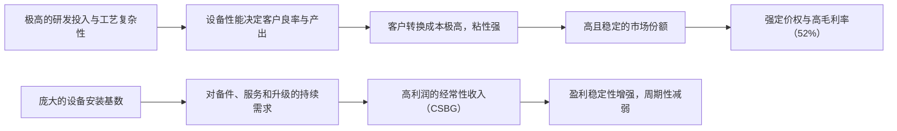

<!-- 匹配到的证券/行业：拉姆研究(LRCX.O) -->
操作成功

### 一页通 （拉姆研究 (LRCX.O)）
日期：2026-08-06
内容："""
## 公司概况

拉姆研究是全球领先的半导体晶圆制造设备（WFE）供应商，核心能力集中在<strong>刻蚀（Etch）、薄膜沉积（Deposition）和清洗（Clean）</strong>三大工艺环节。公司产品是制造逻辑芯片、存储芯片（DRAM/NAND）和先进封装的关键设备，客户涵盖台积电、三星、英特尔等全球头部半导体制造商。其市场地位稳固，尤其在<strong>导体刻蚀领域拥有全球超过40,000个反应腔的安装基数</strong>，并在3D NAND高深宽比刻蚀和先进封装电镀领域占据领导地位。     

## 公司近况跟踪

- <strong>FY2026Q4（CY26Q2）业绩全面超预期</strong>：公司实现<strong>创纪录的营收67.2亿美元</strong>（QoQ+15%，YoY+30%），Non-GAAP毛利率<strong>52.0%</strong>（近20年最高），营业利润率<strong>38.4%</strong>，Non-GAAP每股收益<strong>1.82美元</strong>，均超出指引上限。FY2026全年营收<strong>232.3亿美元</strong>（YoY+26%），Non-GAAP每股收益<strong>5.82美元</strong>（YoY+41%）。      
- <strong>NAND业务环比翻倍增长</strong>：NAND收入占系统收入比重从上季度的12%跃升至<strong>23%</strong>，主要驱动力来自客户加速向<strong>256层及以上器件</strong>的转换，以满足AI驱动的企业级SSD需求。      
- <strong>客户支持业务（CSBG）连续三季度创新高</strong>：CSBG收入达<strong>24.7亿美元</strong>（QoQ+17%，YoY+43%），主要由创纪录的升级收入驱动，备件和服务需求维持强劲。      
- <strong>上调2026年WFE展望并给出积极的2027年定性判断</strong>：公司将2026年全球WFE支出预期从约1400亿美元上调至<strong>1500亿美元低位区间</strong>。管理层形容2027年WFE增长前景为“非凡”，预计DRAM将成为增长最快的领域，其次是代工/逻辑，最后是NAND。       
- <strong>上修长期盈利目标</strong>：公司更新了多年盈利框架，计划在未来数年内将毛利率提升至<strong>55%左右</strong>，营业利润率提升至<strong>45%左右</strong>，显著高于此前50%+/35%+的目标。      

## 短期逻辑

1. <strong>FY2027Q1（9月季度）指引强劲，业绩有望继续超预期</strong>：公司指引9月季度营收<strong>81亿美元</strong>（中值QoQ+20.5%），毛利率<strong>52%</strong>，每股收益<strong>2.15美元</strong>，均大幅超越市场一致预期。管理层暗示CSBG收入将环比持平，意味着系统收入需实现<strong>超过30%的环比增长</strong>。考虑到公司在手订单和客户提前锁定产能的意愿，该指引具备较高确定性，实际业绩有望再次超出指引上限。      

2. <strong>NAND升级周期加速，成为短期业绩核心增量</strong>：公司此前提出的约<strong>400亿美元NAND升级机会</strong>，大部分预计在2027年底前通过升级方式实现。管理层在业绩会上表示，客户正专注于向200层以上设备升级，今年已有少量新建产能，升级需求正在提前释放。NAND收入在6月季度环比翻倍，且9月季度指引强劲，表明该升级周期正在加速，为未来2-3个季度提供清晰的增长动力。      

3. <strong>AI资本开支叙事强化，板块情绪修复带来估值弹性</strong>：尽管公司基本面强劲，但股价在7月29日财报发布后仍下跌7%，主要受整个半导体板块因资金面因素被抛售的拖累。然而，财报后盘后股价已反弹超5%，且多家买方机构（如对冲基金）在7月31日重新开始买入半导体设备股。随着公司业绩持续兑现，市场将重新聚焦于其强劲的基本面和AI驱动的长期增长逻辑，估值修复空间显著。  

## 长期逻辑

1. <strong>AI驱动的技术升级周期具有多年持续性，公司可服务市场（SAM）持续扩大</strong>：AI正从训练向推理、Agentic乃至Physical AI逐波推进，推动对先进逻辑（GAA架构）、DRAM（HBM堆叠）和NAND（高层数）的需求。这些技术转型显著提升了刻蚀和沉积工艺的强度。公司预计其SAM占WFE的比例将从2025年初的<strong>低30%区间</strong>，在2026年达到<strong>约36%-36.5%</strong>，并最终迈向<strong>高30%区间</strong>。随着NAND从128层向500层以上演进，<strong>每片晶圆的SAM有望翻倍</strong>，为长期增长提供结构性支撑。      

2. <strong>产品组合扩展与份额提升，构筑超越行业周期的增长能力</strong>：公司不仅在传统优势领域（NAND）保持领先，更在DRAM和代工/逻辑领域实现突破。新一代导体刻蚀平台<strong>Akara</strong>已从2nm及以下的GAA逻辑应用拓展至先进DRAM，安装基数自推出以来<strong>每年翻倍</strong>。在DRAM领域，公司凭借<strong>VECTOR硬掩膜沉积</strong>和<strong>扩散阻挡层系统</strong>等差异化产品，正将已验证的代工逻辑技术迁移至存储领域，有望持续获得份额。先进封装业务2026年收入预计同比增长<strong>超过70%</strong>，受益于公司在TSV刻蚀和铜电镀领域的领导地位。      

3. <strong>经常性收入（CSBG）占比提升，增强盈利稳定性和可预测性</strong>：CSBG业务（包括备件、服务和升级）已占公司总收入的<strong>三分之一以上</strong>，且连续三个季度创下收入新高。随着全球设备安装基数持续扩大，以及公司推出的<strong>Dextro协作机器人</strong>和<strong>设备智能（Equipment Intelligence）</strong>等增值服务逐步渗透，该部分收入有望在未来数年维持低双位数的长期增速。这种“剃须刀+刀片”的商业模式，有助于平滑设备销售的周期性波动，提升公司整体估值中枢。     

## 风险提示

- <strong>WFE周期性风险与估值压力</strong>：半导体设备行业具有强周期性。尽管当前AI驱动的需求强劲，但若未来宏观经济下行、AI资本开支回报不及预期或存储芯片价格大幅下跌，客户可能削减或推迟设备订单。公司当前股价对应FY2027年一致预期盈利约<strong>30倍市盈率</strong>，虽较前期高点有所回落，但仍高于其5年平均约24倍的水平。若行业周期逆转，估值和盈利可能面临双杀。  
- <strong>地缘政治与出口管制风险</strong>：中国大陆是公司重要市场，FY2026Q4收入占比为<strong>26%</strong>（上季度为34%）。美国对华半导体出口管制政策持续收紧，可能进一步限制公司向中国客户销售先进设备。此外，中国对镓、锗等关键原材料的出口管制，也可能对公司的供应链成本和稳定性构成潜在威胁。    
- <strong>NAND市场供需失衡风险</strong>：公司短期业绩高度依赖NAND升级周期的强度。有第三方机构预测，随着产能释放，2027年下半年NAND市场可能出现供过于求。尽管管理层表示当前客户讨论仍集中在升级现有产能，但若NAND价格松动，客户可能迅速放缓投资节奏，对公司营收和利润率造成冲击。    

## 近期要闻

- <strong>2026年7月29日</strong>：公司发布FY2026Q4财报，营收、毛利率、营业利润率和每股收益均创纪录，并大幅上调9月季度指引。同时，公司将2026年WFE展望上调至1500亿美元低位区间，并给出积极的2027年定性展望。      
- <strong>2026年7月29日</strong>：尽管财报表现强劲，公司股价在当日常规交易时段下跌<strong>7.04%</strong>，主要受整个半导体板块因资金面因素被抛售的拖累。但在盘后交易时段，股价反弹<strong>5.31%</strong>。 
- <strong>2026年7月30日</strong>：多家华尔街投行（如花旗、摩根大通、伯恩斯坦）发布报告，维持或上调公司评级，并大幅上调目标价，普遍认为业绩和指引验证了AI驱动的设备超级周期逻辑。    

## 未来催化

- <strong>2026年8月中下旬</strong>：主要云计算厂商（Hyperscaler）如微软、亚马逊、谷歌等将发布季度财报，其资本开支指引是判断AI基础设施投资持续性的关键先行指标。若资本开支指引继续上调，将直接强化对拉姆研究等设备公司的需求预期。 
- <strong>2026年8月-9月</strong>：公司FY2026全年10-K报告预计将在8月发布，其中将披露更详细的财务数据和业务信息，包括日本地区“已发货待验收”的库存金额。该数据是判断下游客户设备接受意愿和未来收入转化效率的重要微观指标。 
- <strong>2026年9月-10月</strong>：公司预计将在10月发布FY2027Q1（9月季度）财报。鉴于公司给出了极为强劲的指引，若实际业绩能再次超出预期，将进一步提升市场对其全年及2027年增长前景的信心，有望成为股价向上突破的关键催化剂。 

## 公司业务模式及拆分

<strong>业务边际变化</strong>：公司近年业务重心正从传统的NAND存储设备，向<strong>DRAM和代工/逻辑</strong>领域显著扩展。FY2026Q4，代工业务占系统收入的44%，DRAM占23%，两者合计占比已超过三分之二。这一变化源于AI推动的GAA晶体管架构转型、HBM内存堆叠和先进封装等新技术对刻蚀和沉积设备的需求强度大幅提升。公司正将3D NAND领域的垂直扩展经验成功迁移至DRAM和逻辑领域。    

<strong>盈利模式</strong>：公司依靠<strong>技术壁垒和客户粘性</strong>盈利。半导体制造商一旦将特定设备集成到生产线中，通常会长期依赖该供应商的设备，因为更换成本极高。公司通过销售高价值的半导体制造设备（系统收入）获取一次性收入，并通过提供备件、服务和升级（CSBG收入）获得贯穿设备全生命周期的经常性收入。近期，公司正通过提价和推出高价值的新产品（如Akara、VECTOR）来提升盈利能力。    

<strong>业务拆分</strong>：
公司业务主要按产品类型分为<strong>系统收入</strong>和<strong>客户支持相关收入（CSBG）</strong>两大类别。系统收入又可进一步按下游应用分为代工、DRAM、NAND和逻辑/其他。当前公司处于<strong>AI驱动的技术升级超级周期</strong>中，各业务板块均呈现强劲增长态势。   

<strong>细分业务拆分（按产品类型）</strong>

| 项目 (百万美元) | FY2024 | FY2025 | FY2026 | FY2026Q4 |
|---|---|---|---|---|
| <strong>截止日期</strong> | 2024-06-30 | 2025-06-29 | 2026-06-28 | 2026-06-28 |
| <strong>系统收入</strong> | 8,921.64 | 11,491.28 | - | 4,250.00 |
| 同比 | - | 28.8% | - | 23.6% |
| 占比 | 59.9% | 62.3% | - | 63.2% |
| <strong>客户支持相关收入(CSBG)</strong> | 5,983.74 | 6,944.31 | - | 2,472.00 |
| 同比 | - | 16.1% | - | 42.6% |
| 占比 | 40.1% | 37.7% | - | 36.8% |
| <strong>总收入</strong> | 14,905.39 | 18,435.59 | 23,233.00 | 6,722.00 |

*注：FY2026全年细分数据未在资料中完整披露，此处仅展示季度数据。*

<strong>系统收入（Systems Revenue）</strong>
该业务在FY2026Q4实现收入<strong>42.50亿美元</strong>（QoQ+13.9%，YoY+23.6%），占总收入的63.2%。增长主要由NAND业务环比翻倍驱动，DRAM收入维持历史高位，代工业务中成熟制程投资回落被先进制程和先进封装投资所抵消。公司通过提供刻蚀、沉积、清洗等设备，满足客户在先进制程上的关键工艺需求。近期，公司凭借<strong>Akara导体刻蚀平台</strong>和<strong>VECTOR沉积系统</strong>等新产品，在DRAM和代工/逻辑领域持续获得市场份额。      

<strong>客户支持业务（CSBG）</strong>
该业务在FY2026Q4实现收入<strong>24.72亿美元</strong>（QoQ+17.1%，YoY+42.6%），连续第三个季度创下历史新高，占总收入的36.8%。增长主要由<strong>创纪录的升级收入</strong>驱动，这得益于NAND客户加速向200层以上技术转换。此外，行业整体高利用率支撑了备件和服务的强劲需求。公司正通过推广<strong>Dextro协作机器人</strong>和<strong>设备智能（Equipment Intelligence）</strong>等增值服务，提升该业务的长期增长潜力和盈利稳定性。      

## 核心竞争力

<strong>竞争要素 1：依托极高技术壁垒和客户转换成本构筑的结构性护城河</strong>

- <strong>护城河定性</strong>：<strong>结构性护城河</strong>。半导体制造工艺极度复杂，设备性能直接影响芯片的良率和性能。一旦设备被验证并集成到生产线中，客户更换供应商的成本和风险极高，因此倾向于与现有供应商长期合作。拉姆研究在<strong>导体刻蚀领域拥有全球超过40,000个反应腔的安装基数</strong>，这构成了强大的客户粘性和竞争壁垒。     
- <strong>数据验证</strong>：公司FY2026Q4的Non-GAAP毛利率高达<strong>52.0%</strong>，为近20年最高，FY2026全年毛利率为<strong>50.6%</strong>。显著高于行业平均水平的盈利能力，是其技术壁垒和客户粘性的直接财务体现。公司研发投入占营收比重持续维持在<strong>10%以上</strong>（FY2026Q4为10.0%），持续巩固技术领先地位。      
- <strong>动态演变</strong>：<strong>护城河变宽（巩固）</strong>。随着半导体制造向3D架构（GAA、CFET）和更复杂材料演进，刻蚀和沉积工艺的难度和重要性持续提升。公司凭借其深厚的技术积累和与头部客户的紧密合作，在新一轮技术升级周期中正获得更多市场份额，其可服务市场（SAM）占WFE的比例正从30%中段向高段迈进。     

<strong>竞争要素 2：从“卖设备”向“卖服务”转型，构建高粘性、高利润的经常性收入模式</strong>

- <strong>护城河定性</strong>：<strong>结构性护城河</strong>。公司的客户支持业务（CSBG）不仅提供备件，更通过升级服务和设备智能解决方案，深度嵌入客户的运营流程。这种“剃须刀+刀片”模式，使得公司在设备销售后仍能持续创造价值，并与客户保持高频互动，进一步巩固了客户关系。     
- <strong>数据验证</strong>：CSBG业务在FY2026Q4实现收入<strong>24.72亿美元</strong>，占总收入的<strong>36.8%</strong>，且连续三个季度创下新高。该业务的增长不仅来自安装基数的扩大，更来自<strong>创纪录的升级收入</strong>和增值服务的渗透。这部分收入具有高利润率和强周期性的特点，能有效平滑设备销售波动。      
- <strong>动态演变</strong>：<strong>护城河变宽（巩固）</strong>。公司正将Dextro协作机器人和设备智能服务从NAND领域拓展至DRAM，并计划在未来数年持续推出新的增值服务。随着全球设备安装基数持续增长，CSBG业务有望维持低双位数的长期增速，其“服务化”转型将显著提升公司整体盈利的稳定性和可预测性。    

<strong>现阶段核心驱动力总结</strong>：
公司的Alpha来自其在<strong>刻蚀和沉积领域的技术领导地位</strong>，以及通过新产品（Akara、VECTOR）和增值服务（CSBG）持续扩大市场份额和提升盈利能力的能力。公司的Beta则紧密挂钩于<strong>全球半导体资本开支周期</strong>，尤其是AI驱动的先进制程和存储芯片投资。当前，公司正处于Alpha和Beta共振的有利阶段。   

<strong>竞争格局传导逻辑图</strong>

## 产销链

- <strong>客户情况</strong>：公司客户集中度较高，主要客户包括<strong>三星电子、台积电、英特尔</strong>等全球头部半导体制造商。FY2026Q4，来自代工客户的系统收入占比为<strong>44%</strong>，存储客户（DRAM+NAND）占比为<strong>46%</strong>。公司正积极与一家<strong>新的美国逻辑客户</strong>接洽，这有望成为未来的增量来源。从区域看，<strong>中国台湾（27%）</strong>、<strong>中国大陆（26%）</strong>和<strong>韩国（20%）</strong>是前三大收入来源地。中国大陆收入占比环比下降8个百分点，其中在华跨国客户收入环比增长，而本土客户收入下降，该分化趋势预计将持续。    
- <strong>供应商情况</strong>：资料中未提供关于公司供应商集中度、成本结构的具体数据。 
- <strong>经销商情况</strong>：公司采用直销模式，未提及经销商网络。 
- <strong>成本传导能力定性</strong>：公司凭借其技术壁垒和关键设备地位，具备较强的定价权。管理层明确表示，公司始终致力于<strong>为所交付的价值获得合理报酬</strong>，FY2026Q4毛利率的提升部分即来自定价措施。这表明公司有能力将上游成本压力或自身价值提升向下游传导，赚取的是<strong>技术溢价和品牌溢价</strong>。    

## 财务数据

<strong>关键财务数据</strong>

| 项目 (百万美元) | FY2024 | FY2025 | FY2026 |
|---|---|---|---|
| <strong>截止日期</strong> | 2024-06-30 | 2025-06-29 | 2026-06-28 |
| <strong>营业总收入</strong> | 14,905.39 | 18,435.59 | 23,233.00 |
| 同比 | -14.48% | 23.68% | 26.02% |
| <strong>营业成本</strong> | 7,853.00 | 9,457.00 | 11,507.00 |
| <strong>毛利润</strong> | 7,052.39 | 8,978.59 | 11,726.00 |
| <strong>毛利率</strong> | 47.32% | 48.70% | 50.47% |
| <strong>营业利润</strong> | 4,282.00 | 5,901.00 | 8,200.00 |
| <strong>营业利润率</strong> | 28.73% | 32.01% | 35.29% |
| <strong>归母净利润</strong> | 3,827.77 | 5,358.22 | 7,265.00 |
| 同比 | -15.14% | 39.98% | 35.59% |
| <strong>稀释每股收益 (美元)</strong> | 2.90 | 4.15 | 5.76 |
| <strong>经营活动现金流净额</strong> | 4,652.00 | 6,173.00 | 5,858.00 |
| <strong>资本性支出</strong> | -397.00 | -759.00 | -966.00 |
| <strong>自由现金流</strong> | 4,255.00 | 5,414.00 | 4,892.00 |

<strong>财务分析</strong>

- <strong>成长能力</strong>：公司FY2026营收同比增长<strong>26.02%</strong>，较FY2025的23.68%进一步加速，显示出强劲的增长势头。归母净利润同比增长<strong>35.59%</strong>，虽略低于FY2025的39.98%，但仍维持高位，表明公司在扩大规模的同时保持了优异的盈利增长。      
- <strong>盈利能力</strong>：公司毛利率从FY2024的47.32%持续提升至FY2026的<strong>50.47%</strong>，营业利润率从28.73%提升至<strong>35.29%</strong>，改善趋势显著。这主要得益于有利的产品组合、运营效率提升和定价策略。FY2026Q4单季毛利率更是达到<strong>52.0%</strong>，为近20年最高，验证了其盈利能力的持续提升。      
- <strong>运营能力</strong>：FY2026Q4存货周转率改善至<strong>3.0次</strong>，为近五年最高水平，表明公司在营收快速增长的同时，供应链管理效率也在提升。应收账款周转天数为72天，环比有所增加，需关注后续回款情况。    
- <strong>偿债能力与资本配置</strong>：公司财务结构稳健，FY2026年末现金及现金等价物为<strong>55.79亿美元</strong>，长期债务为<strong>37.30亿美元</strong>，净现金头寸充裕。公司持续通过股票回购（FY2026全年回购约<strong>38.51亿美元</strong>）和支付股息（FY2026全年约<strong>12.71亿美元</strong>）回报股东，资本配置策略对股东友好。      

## 行业及竞争分析

<strong>行业分析</strong>：
公司所处的半导体设备行业，尤其是<strong>晶圆制造设备（WFE）</strong>市场，正经历由AI驱动的强劲扩张周期。2026年全球WFE市场规模预期已被公司上调至<strong>1500亿美元低位区间</strong>，较年初预期增长超10%。增长动力主要来自：1）<strong>DRAM</strong>：HBM需求激增和制程升级（向1c/1γ节点迁移）推动资本开支；2）<strong>代工/逻辑</strong>：GAA晶体管架构转型和先进封装投资；3）<strong>NAND</strong>：向200层以上器件的升级周期加速。展望2027年，随着新增洁净室产能逐步释放，WFE市场有望实现更大幅度的增长。          

<strong>竞争格局</strong>：
公司在刻蚀和沉积领域面临的主要竞争对手是<strong>应用材料（Applied Materials）</strong>和<strong>东京电子（Tokyo Electron）</strong>。在清洗领域，主要竞争对手包括<strong>Screen Holdings</strong>和<strong>东京电子</strong>。拉姆研究的差异化优势在于其在<strong>导体刻蚀</strong>和<strong>3D NAND高深宽比刻蚀</strong>领域的领导地位，以及在<strong>先进封装电镀</strong>市场的强势份额。公司正通过新产品（Akara、VECTOR）将其技术优势扩展至DRAM和代工/逻辑领域，从而在更广阔的市场中获取份额。    

<strong>可比公司</strong>

| 公司名称 | 股票代码 | 对标维度 |
|---|---|---|
| 应用材料 (Applied Materials) | AMAT | 产品线最全面的WFE供应商，在沉积、刻蚀、检测等多个领域与LRCX直接竞争。 |
| 东京电子 (Tokyo Electron) | - | 在刻蚀和沉积领域与LRCX形成竞争，尤其在介质刻蚀方面。 |
| 科磊 (KLA Corporation) | KLAC | 半导体过程控制和良率管理领域的领导者，与LRCX同属WFE核心供应商，但产品侧重点不同。 |

<strong>总结分析</strong>：与应用材料相比，拉姆研究的产品线更为聚焦，但在其核心的刻蚀和特定沉积领域拥有更深的技术护城河。与东京电子相比，拉姆研究在导体刻蚀和3D NAND相关工艺上优势明显。当前，AI驱动的技术升级周期对刻蚀和沉积工艺的强度要求显著提升，这为拉姆研究创造了超越行业平均增速的结构性机遇。   

## 市场焦点议题

<strong>背景</strong>：公司股价在FY2026Q4财报发布后出现大幅波动，反映出市场对AI驱动的设备支出周期能否持续存在分歧。尽管公司业绩和指引均超预期，但投资者对估值、地缘政治风险和周期持续性等问题高度关注。  

<strong>议题列表</strong>：

1.  <strong>毛利率的可持续性与长期目标的可实现性</strong>
    - <strong>背景</strong>：公司FY2026Q4毛利率达到<strong>52.0%</strong>，并提出了<strong>55%左右</strong>的长期目标。市场关注这一高利润率水平是否由短期供需紧张和一次性定价措施驱动，还是由产品组合升级和运营效率提升等结构性因素支撑。      
    - <strong>问题列表</strong>：
        - 52%的毛利率中，有多少来自不可持续的一次性因素（如短期提价），有多少来自结构性改善？
        - 公司计划如何将毛利率从52%提升至55%？具体的时间表和驱动因素是什么？
        - 随着新增产能释放和供应紧张缓解，公司能否维持当前的定价能力？

2.  <strong>NAND升级周期的节奏与2027年后的需求持续性</strong>
    - <strong>背景</strong>：NAND业务是公司短期业绩的核心增量，但市场对其持续性存疑。公司提出的约400亿美元升级机会大部分将在2027年底前完成，之后的需求能否由新建产能接续，是市场关注的焦点。      
    - <strong>问题列表</strong>：
        - 如何量化2027年NAND WFE中，升级需求和新建产能需求各自的贡献？
        - 在400亿美元升级机会基本兑现后，2028年及以后的NAND设备需求增长点在哪里？
        - 如何评估第三方机构关于2027年下半年NAND市场可能供过于求的预测？

3.  <strong>中国大陆业务的未来走向与地缘政治风险</strong>
    - <strong>背景</strong>：中国大陆是公司重要市场，但收入占比已从FY2026Q3的34%下降至FY2026Q4的<strong>26%</strong>。美国出口管制政策持续收紧，给公司在中国大陆的业务带来不确定性。    
    - <strong>问题列表</strong>：
        - 中国大陆收入占比下降是短期波动还是长期趋势？公司对中国市场2027年的展望如何？
        - 美国对华出口管制政策的最新动态和潜在影响是什么？公司如何管理这一风险？
        - 中国本土半导体设备厂商的崛起是否对公司在华业务构成实质性竞争威胁？

## 市场分歧探讨

市场对拉姆研究的核心分歧在于：<strong>当前强劲的业绩增长是AI驱动的多年超级周期的开端，还是一个即将见顶的周期性高点？</strong>

<strong>乐观方观点：AI超级周期论，业绩高增具备多年持续性</strong>
- <strong>逻辑</strong>：AI发展正从训练转向推理，应用端（如Agentic AI、Physical AI）的爆发将驱动对算力、存储（HBM、NAND）和先进封装的海量需求。这并非短期炒作，而是一个长达数年的技术基础设施投资周期。      
- <strong>支撑依据</strong>：
    - <strong>WFE市场持续上修</strong>：公司已将2026年WFE展望从年初的1350亿美元上调至1500亿美元，并认为2027年增长前景“非凡”。       
    - <strong>技术升级驱动含量提升</strong>：GAA、HBM、3D NAND等新技术对刻蚀和沉积工艺的强度要求倍增，公司SAM持续扩大，有望实现超越WFE市场的增长。      
    - <strong>客户行为验证</strong>：客户已公布多年期新厂建设计划，并提前锁定设备订单，显示出对长期需求的信心。公司递延收入在FY2026Q4环比增加2.13亿美元，客户预付款回升，是需求强劲的佐证。    

<strong>谨慎方观点：周期见顶论，高增长难以持续，估值已提前反应</strong>
- <strong>逻辑</strong>：半导体设备行业具有强周期性，当前的高增长部分源于过去几年投资不足后的补偿性需求。随着新增产能逐步释放，2027年下半年后市场可能面临供过于求的风险，导致资本开支放缓。   
- <strong>支撑依据</strong>：
    - <strong>估值处于历史高位</strong>：尽管股价有所回调，但公司FY2027年预期市盈率仍在<strong>30倍左右</strong>，高于其5年平均约24倍的水平，估值已计入较多乐观预期。   
    - <strong>NAND周期风险</strong>：公司短期业绩高度依赖NAND升级，而该升级周期的大部分将在2027年底前完成。有第三方机构预测2027年下半年NAND市场可能供过于求。    
    - <strong>地缘政治不确定性</strong>：中国大陆市场收入占比已开始下滑，出口管制风险是悬而未决的长期威胁。    

<strong>总结分析</strong>：从FY2026Q4的业绩和指引来看，乐观方的逻辑得到了更强有力的数据支撑。公司不仅交出了创纪录的业绩，更在NAND、DRAM、代工/逻辑和CSBG等所有业务板块均展现出强劲的增长势头。管理层对2027年的定性判断极为积极，且客户行为（提前锁定订单）也验证了需求的可持续性。谨慎方关于周期见顶的担忧，目前缺乏来自公司层面或客户层面的微观证据。然而，其关于估值偏高和地缘政治风险的提示，是投资中需要持续关注和评估的因素。      

## 盈利预测与估值

<strong>管理层最新指引</strong>：
- <strong>FY2027Q1（2026年9月季度）</strong>：营收<strong>81亿美元</strong>（±4亿美元），Non-GAAP毛利率<strong>52%</strong>（±1pct），Non-GAAP营业利润率<strong>39.5%</strong>（±1pct），Non-GAAP每股收益<strong>2.15美元</strong>（±0.15美元）。      
- <strong>长期盈利框架</strong>：计划在未来数年内将毛利率提升至<strong>55%左右</strong>，营业利润率提升至<strong>45%左右</strong>。      

<strong>券商盈利预测与估值</strong>

| 机构 | 评级 | 目标价(美元) | 财务指标 | FY2026A | FY2027E | FY2028E |
|---|---|---|---|---|---|---|
| 瑞银 (2026-08-03) | 买入 | 435 | 营业收入(百万美元) | 23,233 | 36,475 | 46,450 |
| | | | Non-GAAP EPS(美元) | 5.82 | 10.34 | 14.26 |
| 汇丰 (2026-07-31) | 持有 | 325 | 营业收入(百万美元) | 23,233 | 37,314 | 45,374 |
| | | | Non-GAAP EPS(美元) | 5.82 | 10.45 | 13.41 |
| 摩根大通 (2026-07-30) | 超配 | 340 | 营业收入(百万美元) | 23,233 | 34,634 | - |
| | | | Non-GAAP EPS(美元) | 5.82 | 9.40 | - |
| 花旗 (2026-07-30) | 买入 | 450 | Non-GAAP EPS(美元) | - | - | - |
| 高盛 (2026-07-31) | 买入 | 380 | Non-GAAP EPS(美元) | - | - | - |

<strong>盈利预期与估值分析</strong>：
主流券商对公司的盈利预测存在一定分歧，FY2027年Non-GAAP每股收益预测区间在<strong>9.40美元至10.45美元</strong>之间，但均显著高于FY2026年的5.82美元，反映出市场对FY2027年业绩高增的共识。估值方法上，各机构普遍采用<strong>市盈率（P/E）估值法</strong>，基于FY2027或FY2028年的盈利预期进行定价。目标价区间为<strong>325-450美元</strong>，对应FY2027年预期市盈率约<strong>30-43倍</strong>。瑞银和花旗的目标价最为乐观，主要基于对公司WFE份额持续扩大和利润率提升的更高预期。汇丰则相对谨慎，给予“持有”评级，认为强劲的增长前景已大部分在股价中得到体现。
"""
