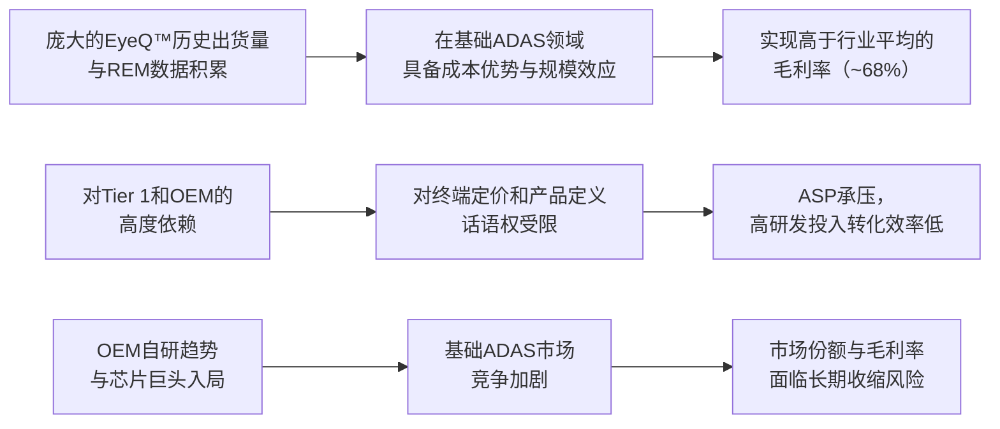

<!-- 匹配到的证券/行业：Mobileye Global(MBLY.O) -->
操作成功

### 一页通 （Mobileye Global (MBLY.O)）
日期：2026-07-24
内容："""
## 公司概况
Mobileye Global Inc. 是全球领先的先进驾驶辅助系统（ADAS）和自动驾驶技术解决方案开发商与部署商。公司于1999年在以色列成立，开创了ADAS技术，并持续向全自动驾驶演进。其核心产品为EyeQ™系列系统级芯片（SoC），通过向Tier 1汽车供应商销售，已嵌入全球超过<strong>2.58亿辆</strong>汽车。公司正将业务版图从汽车ADAS拓展至Robotaxi服务和通过收购Mentee Robotics进入人形机器人领域，定位为"物理AI"综合供应商。

## 公司近况跟踪
- <strong>创始人兼CEO宣布卸任</strong>：公司创始人Amnon Shashua在2026年7月23日的财报电话会上宣布，将在董事会选定继任者后卸任CEO职务，未来将专注于技术战略、创新及人形机器人等前沿领域，董事会已邀请其担任董事长。此举引发市场对管理层稳定性的担忧，财报发布后股价单日下跌约<strong>15%</strong>。
- <strong>获得以色列新R&D激励</strong>：2026年Q2起，以色列新研发激励法案生效，Mobileye在Q2确认了<strong>9300万美元</strong>的研发费用抵免（包含Q1追溯影响），全年预计贡献<strong>1.8-2亿美元</strong>。该政策具有可持续性，无明确终止日期，显著提升了公司账面利润率和盈利能力。
- <strong>赢得Stellantis Cloud-Enhanced ADAS项目</strong>：公司近期获得Stellantis集团高产量项目定点，将于<strong>2027年</strong>起基于现有EyeQ6 Lite项目的软件升级，实现高速公路脱手驾驶功能。该升级对OEM投资小、收益显著，单位毛利与Surround ADAS相当，为基础ADAS的两倍以上。
- <strong>宣布自建Robotaxi车队</strong>：公司于2026年6月宣布将建立完全垂直整合的Robotaxi业务，计划<strong>2027年</strong>在至少一个美国城市启动，初期部署100-200辆车，五年内扩展至约<strong>1.7万辆</strong>。此举标志着公司战略从单纯的技术供应商向运营服务商延伸。
- <strong>SuperVision出货量超预期但全年指引未上调</strong>：Q2 SuperVision交付量约<strong>2万台</strong>，高于预期，上半年累计超<strong>4万台</strong>。但公司认为客户存在主动建立库存以防范零部件短缺的行为，因此维持全年<strong>略低于6万台</strong>的出货指引，预计下半年将消耗库存。

## 短期逻辑
1. <strong>CEO交接进程与市场信心重建</strong>：创始人Shashua的卸任决定是未来一个季度最核心的交易变量。市场对继任者的背景（是内部运营型人才还是外部空降兵）以及Shashua作为董事长与技术战略官的参与深度极为敏感。若新任CEO具备规模化运营和资本配置经验，能够清晰阐述Robotaxi和ADAS业务的商业化路径，将有助于重建投资者信心，触发估值修复。反之，若交接过程漫长或人选不符预期，管理层真空可能加剧战略执行的不确定性。
2. <strong>Robotaxi战略的具体化与预期差博弈</strong>：公司从供应商转向自营Robotaxi车队的战略在6月引发市场分歧。未来三个月，市场将高度关注该计划的落地细节，包括：2027年首发城市的具体选址、车辆平台合作伙伴的确认、初始资本开支的规模与融资方案、以及Moovit子公司重组后如何具体支持车队运营。任何超出或低于市场预期的执行细节披露，都将直接引发股价波动。当前市场对该战略的资本消耗和与现有合作伙伴（如大众）的潜在竞争关系存在疑虑，管理层能否有效沟通并消除这些疑虑是关键。
3. <strong>Q3业绩指引与"核心业务"盈利能力的重估</strong>：尽管Q2业绩超预期，但主要受一次性R&D激励提振。公司对Q3的指引显示，营收将同比下降<strong>5%-6%</strong>，毛利率因产品组合（中国OEM占比提升）将略低于Q2，且不含Q1追溯影响的R&D激励将显著下降。市场将密切关注Q3实际业绩是否触及"核心业务"（剔除R&D激励后）的盈利底部，以及中国OEM出口高增长与ASP下降之间的平衡能否在Q3后改善。若Q3核心盈利好于悲观预期，可能成为股价阶段性企稳的信号。

## 长期逻辑
1. <strong>Surround ADAS升级周期驱动ASP结构性提升</strong>：Mobileye正推动其庞大的基础ADAS客户群向价值量更高的Surround ADAS系统升级。Surround ADAS的ASP约为<strong>100-150美元</strong>，是基础ADAS的数倍，毛利率约<strong>70%</strong>。公司已获得大众、通用（美国头部OEM）和印度Mahindra三家客户的定点，仅现有订单预计在量产后每年可贡献超过<strong>10%</strong>的收入增长。随着全球NCAP安全评级标准趋严，Surround ADAS有望成为中端车型的标配，驱动公司未来3-5年的收入与利润结构性上移。
2. <strong>Robotaxi市场的"卖铲人"与"挖矿者"双重角色</strong>：公司通过自建车队，从单纯的自动驾驶系统供应商（"卖铲人"）转变为同时运营Robotaxi服务的"挖矿者"。管理层认为，垂直整合模式下单车年收入可达<strong>12.5万美元</strong>，是纯供应商模式的<strong>5倍</strong>，且能加速技术迭代。同时，公司仍通过大众MOIA等项目维持供应商角色。若两种模式均能跑通，Mobileye将拥有独特的市场卡位，既能从行业扩张中受益，又能直接捕获终端服务的高价值利润。
3. <strong>REM众包地图数据构建的长期网络效应</strong>：Mobileye的REM（Road Experience Management）技术利用全球数百万辆已售车辆采集道路数据，构建高精度地图。截至2025年底，已采集<strong>915亿英里</strong>的道路数据，覆盖欧美<strong>95%</strong>以上的主要道路。这种低成本、高覆盖、实时更新的地图方案是高级别自动驾驶的关键基础设施，其数据规模和更新频率构成了难以复制的竞争壁垒。随着Cloud-Enhanced ADAS和Surround ADAS的渗透率提升，REM的覆盖范围和商业价值将进一步扩大。

## 风险提示
- <strong>CEO交接与战略执行风险</strong>：创始人Shashua的卸任是公司近30年来最重大的管理层变动。新任CEO需要同时驾驭核心ADAS业务的升级、Robotaxi自营业务的从零到一、以及人形机器人业务的早期孵化。多重战略并举对管理层的精力和资源分配构成巨大挑战，存在战略失焦或执行不及预期的风险。
- <strong>Robotaxi业务的高资本消耗与竞争风险</strong>：自建Robotaxi车队将使公司从轻资产模式转向重资产运营，初期1-2万辆车的资本开支预计将消耗公司大部分现金储备。同时，该市场已存在Waymo（Alphabet）、Tesla、Zoox（Amazon）等资金雄厚且先发优势明显的竞争对手。Mobileye作为后来者，在技术成熟度、运营经验和资金规模上均不占优，存在投资回报不及预期甚至失败的风险。
- <strong>客户集中度高与潜在竞争关系</strong>：公司前四大客户收入占比超过<strong>70%</strong>，客户集中度极高。同时，公司自建Robotaxi车队的决策，可能使其与同样布局Robotaxi的客户（如大众）形成潜在的竞争关系，影响未来的合作深度与订单获取。此外，部分核心客户（如大众）自身也面临战略重组和成本削减压力，可能影响对Mobileye产品的采购节奏和定价。

## 近期要闻
- <strong>2026年4月</strong>：公司宣布启动<strong>2.5亿美元</strong>的股票回购计划，以抵消股权激励和收购Mentee带来的稀释效应。
- <strong>2026年6月</strong>：公司正式宣布将利用其Mobileye Drive技术，建立完全垂直整合的Robotaxi业务，计划于2027年在美国启动。
- <strong>2026年7月22日</strong>：公司宣布赢得Stellantis的Cloud-Enhanced ADAS项目，为Stellantis提供基于REM地图的高速公路脱手驾驶功能，计划2027年量产。
- <strong>2026年7月23日</strong>：公司公布2026年Q2财报，同时宣布创始人兼CEO Amnon Shashua计划在选定继任者后卸任。财报发布后，股价单日下跌约<strong>15%</strong>。

## 未来催化
- <strong>2026年Q3-Q4</strong>：新任CEO人选公布。继任者的背景和能力将直接影响市场对公司未来战略执行力的判断。
- <strong>2026年下半年</strong>：公司自有Robotaxi业务的具体商业计划发布，包括首发城市、车队规模、车辆平台合作伙伴及资本开支计划。
- <strong>2026年下半年</strong>：大众MOIA在奥兰多的Robotaxi项目预计达到关键绩效指标（KPIs），并可能启动带安全员的商业运营，这是验证公司L4级技术成熟度的关键里程碑。
- <strong>2026年下半年</strong>：保时捷SuperVision项目量产前进行全球客户演示，若性能表现出色，有望推动更多OEM客户做出采用决策。

## 公司业务模式及拆分
- <strong>业务边际变化</strong>：公司正经历从单一ADAS芯片供应商向"ADAS+Robotaxi运营+人形机器人"三位一体的"物理AI"公司转型。2026年2月，公司以<strong>9亿美元</strong>收购了由CEO Shashua联合创立的人形机器人公司Mentee Robotics，正式进入机器人领域。同年6月，公司宣布将利用自有技术直接运营Robotaxi车队，标志着商业模式从单纯的B2B向B2C服务延伸。在核心ADAS领域，公司正通过Cloud-Enhanced ADAS和Surround ADAS推动现有客户的价值量升级。

- <strong>盈利模式</strong>：公司核心盈利模式是通过销售搭载专有软件算法的EyeQ™ SoC芯片获取收入，具备典型的技术壁垒和规模效应特征。随着业务向Robotaxi运营延伸，未来将增加按里程收费的服务性收入。公司盈利对研发投入依赖度高，历史上研发费用占收入比重超过<strong>50%</strong>。

- <strong>业务拆分</strong>：
公司近年业务结构以EyeQ™ SoC销售为绝对核心，但正逐步向系统解决方案和运营服务拓展。2026年上半年，EyeQ™ SoC收入占比约<strong>91%</strong>，SuperVision系统收入占比约<strong>9%</strong>。公司当前处于<strong>业绩兑现期与战略转型期</strong>的重叠阶段：核心ADAS业务在经历2024年客户去库存冲击后恢复增长，而高级别自动驾驶和机器人业务仍处于商业化早期，需要大量投入。

<strong>细分业务拆分（单位：百万美元）</strong>

| 项目 | FY2023 | FY2024 | FY2025 | FY2026 H1 |
|---|---|---|---|---|
| <strong>截止日期</strong> | 2023-12-30 | 2024-12-28 | 2025-12-27 | 2026-06-27 |
| <strong>EyeQ™ SoC</strong> | - | - | - | - |
| 收入 | 1,853.0 | 1,415.0 | 1,731.0 | 1,047.0 |
| 收入占比 | 89% | 86% | 91% | 98% |
| <strong>SuperVision™</strong> | - | - | - | - |
| 收入 | 132.6 | 138.4 | 64.9 | - |
| 收入占比 | 6% | 8% | 3% | - |
| <strong>其他（Moovit等）</strong> | - | - | - | - |
| 收入 | 93.0 | 101.0 | 99.0 | 19.0 |
| 收入占比 | 5% | 6% | 5% | 2% |
| <strong>总营收</strong> | <strong>2,079.0</strong> | <strong>1,654.0</strong> | <strong>1,894.0</strong> | <strong>1,066.0</strong> |

*注：公司未按产品线详细披露利润数据。*

- <strong>EyeQ™ SoC业务（2026年上半年）</strong>：该业务是公司的基石，通过向Tier 1供应商销售芯片实现收入。2026年上半年收入为<strong>10.47亿美元</strong>，同比增长<strong>13%</strong>，增长动力主要来自中国OEM（比亚迪、奇瑞等）出口量增加、在核心西方客户中份额提升以及新兴市场ADAS渗透率提高。但中国OEM出口占比提升导致平均售价（ASP）承压，Q2 ASP同比下降约<strong>2%</strong>。该业务毛利率较高，是公司主要的利润和现金流来源。

- <strong>SuperVision™业务（2026年上半年）</strong>：该业务是公司目前主推的L2+级"脱手"驾驶系统，包含11个摄像头、2个EyeQ™芯片及ECU。2026年上半年出货量超<strong>4万台</strong>，但终端需求约3万台，存在客户建立库存的情况。全年出货指引维持<strong>略低于6万台</strong>。该业务因包含较多第三方硬件，毛利率低于EyeQ™芯片业务，但因其ASP远高于基础ADAS，单台毛利额更高。保时捷和奥迪的SuperVision项目预计于<strong>2027年下半年</strong>启动量产。

## 核心竞争力
<strong>竞争要素 1：依托先发规模与数据积累形成的阶段性成本优势</strong>
- <strong>护城河定性</strong>：属于<strong>行业阶段性红利</strong>。Mobileye在ADAS视觉芯片领域拥有超过25年的量产经验，其EyeQ™ SoC累计出货量超过<strong>2.58亿片</strong>，庞大的保有量摊薄了研发和制造成本，使其在基础ADAS领域具备显著的成本优势。同时，基于全球数百万辆搭载REM技术的车辆，公司构建了低成本、高覆盖的众包地图数据网络，这是竞争对手短期内难以复制的。
- <strong>数据验证</strong>：公司2025财年调整后毛利率为<strong>68%</strong>，2026年Q2调整后毛利率为<strong>66%</strong>，显示出较强的定价能力和成本控制。其REM地图已覆盖欧美<strong>95%</strong>以上的主要道路，数据采集的边际成本极低。
- <strong>动态演变</strong>：该优势在基础ADAS领域正面临<strong>收缩</strong>。随着地平线、黑芝麻等中国本土芯片厂商的崛起，以及高通、英伟达等巨头推出集成度更高的解决方案，基础ADAS芯片市场呈现同质化竞争特征，Mobileye的ASP持续承压。但在高级别ADAS和自动驾驶领域，其数据积累和量产经验仍是与OEM合作时的重要信任状，护城河能否拓宽取决于Surround ADAS和SuperVision的推广速度。

<strong>竞争要素 2：产业链话语权较弱导致的盈利模式受挤压</strong>
- <strong>护城河定性</strong>：属于<strong>生态依存度较高</strong>。Mobileye的商业模式高度依赖Tier 1供应商和OEM的量产决策。公司不直接接触终端用户，其芯片作为二级供应商被集成到Tier 1的系统中，对最终定价和产品定义的话语权有限。同时，公司所有EyeQ™ SoC均由STMicroelectronics独家供应，存在单一供应商依赖风险。
- <strong>数据验证</strong>：公司前四大客户收入占比超过<strong>70%</strong>，客户集中度极高。2026年Q2，因中国OEM客户（定价较低）出货量增加，导致整体ASP同比下降<strong>2%</strong>，显示出下游客户结构变化对盈利能力的直接影响。公司研发费用占收入比重长期超过<strong>50%</strong>，高投入并未完全转化为对下游的议价能力。
- <strong>动态演变</strong>：该要素正面临<strong>进一步挤压的风险</strong>。部分核心OEM客户（如特斯拉、蔚来、小鹏）选择自研自动驾驶系统，而大众、通用等客户也在引入高通、英伟达等竞争对手的方案。公司自建Robotaxi车队的战略，也可能使其与现有OEM客户形成竞争，进一步复杂化其产业链地位。

<strong>现阶段核心驱动力总结</strong>：
公司的Alpha在于能否成功将庞大的基础ADAS客户群升级至价值量更高的Surround ADAS和SuperVision系统，并在Robotaxi运营领域证明其商业模式的可行性。Beta则高度依赖于全球汽车产量、ADAS渗透率提升的行业趋势以及地缘政治风险（特别是以色列地区的稳定）。

<strong>竞争格局传导逻辑图</strong>：

## 产销链
- <strong>客户情况</strong>：公司客户主要为全球大型OEM，但通过Tier 1汽车供应商（如Aptiv、Magna、Valeo）进行销售。客户集中度极高，2026年上半年，前四大客户（A、D、C、B）收入占比分别为<strong>27%</strong>、<strong>16%</strong>、<strong>16%</strong>、<strong>15%</strong>，合计超过<strong>70%</strong>。其中最大客户收入占比达<strong>27%</strong>，存在核心客户依赖风险。新客户方面，公司近期赢得了Stellantis的Cloud-Enhanced ADAS项目，并正与印度Mahindra合作开发Surround ADAS和SuperVision，处于<strong>已进入供应商名录</strong>阶段。
- <strong>供应商情况</strong>：公司所有EyeQ™ SoC均由<strong>STMicroelectronics</strong>独家供应，双方已合作开发了六代芯片，存在严重的单一供应商依赖风险。为分散风险，公司已与<strong>台积电（TSMC）</strong>签订协议，未来将由其生产部分成像雷达组件和下一代EyeQ™产品。ECU的开发和组装则依赖<strong>Quanta Computer</strong>等供应商。
- <strong>成本传导能力</strong>：当上游原材料（如内存）涨价时，在SuperVision等系统级产品中，公司直接采购并承担成本，但已<strong>将成本上涨完全转嫁给客户</strong>。在基础ADAS芯片业务中，内存等成本由客户间接承担，公司不直接受影响。总体而言，公司赚取的是基于技术壁垒的"技术溢价"，而非单纯的"加工费"，具备一定的成本转嫁能力，但受制于竞争格局，转嫁空间并非无限。

## 财务数据
<strong>关键财务数据（单位：亿美元）</strong>

| 项目 | FY2023 | FY2024 | FY2025 | FY2026 H1 |
|---|---|---|---|---|
| <strong>截止日期</strong> | 2023-12-30 | 2024-12-28 | 2025-12-27 | 2026-06-27 |
| 营业总收入 | 20.79 | 16.54 | 18.94 | 10.66 |
| 收入同比 | 11.24% | -20.44% | 14.51% | 12.92% |
| 营业成本 | 10.32 | 9.13 | 9.90 | 5.56 |
| 毛利 | 10.47 | 7.41 | 9.04 | 5.10 |
| <strong>毛利率</strong> | <strong>50.36%</strong> | <strong>44.80%</strong> | <strong>47.73%</strong> | <strong>47.84%</strong> |
| 研发费用 | 8.89 | 10.83 | 11.51 | 5.30 |
| 营业利润 | -0.33 | -5.30 | -4.40 | -1.38 |
| 归母净利润 | -0.27 | -30.90 | -3.92 | -38.39 |
| 基本每股收益（美元） | -0.03 | -3.82 | -0.48 | -4.70 |
| 经营活动现金流净额 | 3.94 | 4.00 | 6.02 | 2.10 |
| 资本性支出 | 0.98 | 0.81 | 0.79 | 0.51 |
| <strong>自由现金流</strong> | <strong>2.96</strong> | <strong>3.19</strong> | <strong>5.23</strong> | <strong>1.59</strong> |

*注：自由现金流 = 经营活动现金流净额 - 资本性支出。FY2024和FY2026 H1的净利润包含巨额商誉减值（分别为26.95亿和37.88亿美元），为非现金项目。*

<strong>财务分析</strong>：
- <strong>成长能力</strong>：公司营收在2024年因下游客户去库存出现<strong>20.44%</strong>的下滑后，2025年恢复增长<strong>14.51%</strong>，2026年上半年同比增长<strong>12.92%</strong>，显示出核心ADAS业务的韧性。增长主要受中国OEM出口和新兴市场ADAS渗透率提升驱动。
- <strong>盈利能力</strong>：公司GAAP口径下持续亏损，主要受巨额无形资产摊销和商誉减值拖累。剔除这些非现金项目后，2025年调整后营业利润率为<strong>15%</strong>，2026年Q2因R&D激励提振，调整后营业利润率升至<strong>31%</strong>。调整后毛利率稳定在<strong>66%-69%</strong>的高位，表明核心产品盈利能力强健。
- <strong>现金流与运营能力</strong>：公司经营活动现金流健康，2025年自由现金流达<strong>5.23亿美元</strong>，显示出良好的盈余质量。但需注意，2026年上半年因收购Mentee Robotics支付<strong>5.91亿美元</strong>现金，导致现金余额从18.36亿美元降至13.11亿美元。

## 行业及竞争分析
<strong>行业赛道</strong>：公司横跨汽车ADAS/自动驾驶和新兴的人形机器人两个赛道。此处聚焦其核心的ADAS/自动驾驶行业。

- <strong>行业发展趋势</strong>：汽车行业正从L2级辅助驾驶向L2+/L3级高级辅助驾驶和L4级自动驾驶演进。监管是重要驱动力，全球NCAP安全评级标准日趋严格，将更多ADAS功能（如自动紧急制动）纳入评分体系，推动OEM将其作为标配。在Robotaxi领域，行业领先者（如Waymo）已实现商业运营，验证了技术可行性，竞争焦点正从"技术验证"转向"规模化与成本控制"。

- <strong>竞争格局</strong>：ADAS和自动驾驶市场竞争激烈。Mobileye面临来自多个维度的竞争：
  - <strong>芯片厂商</strong>：英伟达（NVIDIA）、高通（Qualcomm）、地平线（Horizon Robotics）等提供高算力、开放的计算平台，吸引希望自研算法的OEM。
  - <strong>Tier 1供应商</strong>：博世（Bosch）、大陆（Continental）等传统Tier 1也在开发自己的ADAS解决方案。
  - <strong>OEM自研</strong>：特斯拉（Tesla）、蔚来（NIO）、小鹏（Xpeng）等新势力车企，以及通用（GM）、奔驰（Mercedes-Benz）等传统巨头，均在投入巨资自研自动驾驶系统。
  - <strong>Robotaxi运营商</strong>：Waymo、Cruise、Zoox、Pony.ai等公司在Robotaxi运营方面已领先Mobileye数个身位。

<strong>可比公司</strong>：

| 公司名称 | 股票代码 | 对标维度 | 分析 |
|---|---|---|---|
| Qualcomm | QCOM | 汽车芯片供应商 | 凭借Snapdragon Ride平台和与Wayve AI的合作，在高级别ADAS领域势头强劲，提供开放的计算平台，吸引寻求差异化的OEM。 |
| NVIDIA | NVDA | 自动驾驶计算平台 | 其Drive平台是高算力自动驾驶方案的标杆，通过提供参考设计和开放软件栈，赋能OEM和Tier 1自研，对Mobileye的"黑盒"交付模式构成挑战。 |
| Aptiv | APTV | Tier 1供应商/自动驾驶方案商 | 作为传统Tier 1，具备强大的系统集成能力和客户关系。其与现代汽车的合资公司Motional是Robotaxi领域的重要玩家。 |
| Horizon Robotics | - | 中国本土ADAS芯片厂商 | 在中国市场凭借高性价比和本地化服务，正快速蚕食Mobileye在基础ADAS市场的份额，并逐步向高级别方案渗透。 |

<strong>总结分析</strong>：Mobileye在基础ADAS市场凭借先发优势和规模效应占据领先地位，但在向高级别自动驾驶演进的过程中，其封闭的"算法+芯片"捆绑销售模式正面临来自开放平台和OEM自研的双重挑战。在Robotaxi运营领域，公司是后来者，面临资金、技术和运营经验均占优的强大竞争对手。

## 市场焦点议题
<strong>议题一：CEO交接与战略延续性</strong>
- <strong>背景</strong>：创始人Shashua在公司中具有无可替代的地位，其技术远见和行业号召力是公司估值的重要组成部分。他的卸任发生在公司战略从ADAS供应商向Robotaxi运营商和机器人公司转型的关键时期，市场担忧新CEO能否驾驭如此复杂的多线作战局面。
- <strong>问题列表</strong>：
  - 新任CEO的背景是偏向运营执行还是技术研发？能否稳定核心团队并吸引新的人才？
  - Shashua作为董事长和技术战略官，与新CEO的权力分配和协作模式将如何？
  - 公司的长期战略，特别是Robotaxi自营和人形机器人业务，是否会因CEO变更而进行调整？

<strong>议题二：Robotaxi自营战略的资本回报与竞争定位</strong>
- <strong>背景</strong>：公司从轻资产的技术供应商转向重资产的Robotaxi运营商，这一战略转变在6月宣布后引发市场巨大分歧。市场担忧其资本消耗、与现有客户的潜在竞争以及在高度竞争市场中的后发劣势。
- <strong>问题列表</strong>：
  - 公司计划如何为初始1-2万辆Robotaxi的车队提供资金？是否会寻求外部融资或合作伙伴？
  - 管理层测算的单车年收入<strong>12.5万美元</strong>、成本低于<strong>10万美元</strong>的假设依据是什么？在规模化运营中能否实现？
  - 公司如何平衡自有车队运营与向大众MOIA等合作伙伴提供技术支持的潜在利益冲突？

<strong>议题三：核心ADAS业务的增长质量与盈利能力</strong>
- <strong>背景</strong>：近期营收增长在很大程度上依赖于中国OEM的出口，这部分业务的ASP和利润率较低。市场关注剔除R&D激励等一次性因素后，公司核心业务的内生增长动力和盈利趋势。
- <strong>问题列表</strong>：
  - 中国OEM出口高增长的可持续性如何？是否存在因贸易壁垒或竞争加剧而放缓的风险？
  - 剔除R&D激励后，公司核心业务的运营利润率在2026年下半年及2027年的走势如何？
  - Surround ADAS和Cloud-Enhanced ADAS的升级周期何时能对ASP和利润率产生显著的正向拉动？

## 市场分歧探讨
<strong>核心分歧：公司自建Robotaxi车队是价值创造还是价值毁灭？</strong>

- <strong>乐观方逻辑</strong>：认为这是公司最大化其技术价值的必然选择。管理层声称，垂直整合模式下单车收入是纯供应商模式的<strong>5倍</strong>，且能加速技术迭代。公司拥有约<strong>12-13亿美元</strong>的现金储备和每年约<strong>3.5亿美元</strong>的经营现金流，足以支持初期投入。此举也展示了管理层对自身L4级技术的绝对信心，有助于在资本市场重塑其作为"物理AI"领导者的形象，而非仅仅是汽车零部件供应商。
- <strong>谨慎方逻辑</strong>：认为此举风险远大于机遇。首先，公司作为Robotaxi运营的后来者，在技术成熟度、运营经验和资金规模上均远逊于Waymo、Tesla等竞争对手。其次，自建车队将使其与现有核心客户（如大众）形成直接竞争，可能危及价值量更高的ADAS系统供应业务。最后，重资产运营模式将消耗公司大量现金，且回报周期漫长，在利率高企的环境下，资本市场对这类"烧钱"故事已愈发谨慎。公司近期股价的下跌反映了市场对这一战略的投票。

<strong>总结分析</strong>：公司从供应商转向运营商，本质上是希望在自动驾驶价值链上攫取更大份额，但这一战略选择充满了"生存者偏差"的风险。其成功高度依赖于两个前提：一是其L4技术必须在成本、安全和效率上迅速追平甚至超越行业领先者；二是在与OEM客户形成竞争的同时，仍能维持核心的ADAS供应业务不受影响。目前来看，这两个前提均面临巨大挑战，市场给予的估值折价正是对这一不确定性的合理反映。

## 盈利预测与估值
<strong>券商盈利预测与估值</strong>

| 机构 | 评级 | 目标价(美元) | 财务指标 | FY2025A | FY2026E | FY2027E | FY2028E |
|---|---|---|---|---|---|---|---|
| 瑞银 (2026-07-24) | 中性 | 9.00 | 营业收入(百万美元) | 1,894 | 2,009 | 2,102 | 2,438 |
| | | | 调整后EPS(美元) | 0.35 | 0.52 | 0.50 | 0.57 |
| 高盛 (2026-07-24) | 中性 | 9.00 | 营业收入(百万美元) | 1,894 | 1,993 | 2,131 | 2,329 |
| | | | GAAP EPS(美元) | 0.01 | 0.05 | 0.05 | 0.10 |
| 摩根士丹利 (2026-07-24) | 中性 | 10.00 | 营业收入(百万美元) | - | - | - | - |
| | | | 调整后EPS(美元) | 0.35 | 0.22 | 0.25 | 0.56 |
| 摩根大通 (2026-07-24) | 中性 | 9.00 | 营业收入(百万美元) | - | - | - | - |
| | | | 调整后EPS(美元) | - | 0.50 | - | 0.78 |

<strong>管理层最新指引</strong>：2026年全年营收指引为<strong>19.70亿至20.20亿美元</strong>，调整后营业利润为<strong>3.65亿至4.25亿美元</strong>（包含<strong>1.8亿至2亿美元</strong>的R&D激励贡献）。

<strong>盈利预期与估值分析</strong>：各机构评级均为"中性"，目标价集中在<strong>9-10美元</strong>，显示出市场对公司的谨慎态度。盈利预测存在分歧，主要源于对R&D激励的持续性、Robotaxi业务的投入规模以及高级别ADAS产品的商业化节奏的不同假设。估值方法上，瑞银和高盛均下调了目标市盈率，以反映CEO交接、盈利质量（依赖政府激励）和战略不确定性带来的更高风险溢价。瑞银将其目标P/E倍数从30倍下调至<strong>17倍</strong>，高盛则从18倍下调至<strong>12倍</strong>。整体而言，市场对公司长期增长潜力持观望态度，等待更明确的战略执行信号和商业化成果。
"""
