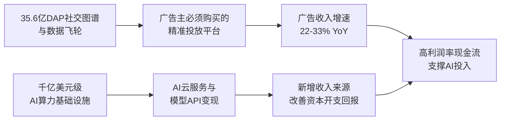

# Gangtise 公司一页通：Meta（META.O）

> 拉取日期：2026-07-29 ｜ 来源：gangtise-agent `stock-one-pager`（注：拉取于财报发布当日，内容为财报前预期）

## 公司概况

Meta Platforms 是全球最大的社交网络公司，旗下拥有 Facebook、Instagram、WhatsApp、Messenger 和 Threads 等产品，构成覆盖即时通讯、综合社交、视觉内容与文字社交的完整产品矩阵。公司几乎全部收入来自广告，2025 年广告收入占比约 97.6%，是全球第二大数字广告平台。公司同时通过 Reality Labs 部门布局 VR/MR 头显和 AI 智能眼镜等下一代计算平台，目前该部门仍处于战略性亏损阶段。 

## 公司近况跟踪

- **AI 云业务计划浮出水面**：2026 年 7 月，彭博报道 Meta 正在规划云基础设施业务，计划向外部客户出售多余 AI 算力及提供模型访问服务。该业务隶属于内部“Meta Compute”计划，由基础设施负责人桑托什·贾纳丹、MSL 负责人之一丹尼尔·格罗斯和总裁迪娜·鲍威尔·麦考密克共同领导。扎克伯格在 5 月股东大会上已暗示这一方向，称“几乎每周都有其他公司联系 Meta，希望以溢价购买其闲置算力”。 

- **Muse 大模型家族密集发布**：2026 年 4 月发布首款闭源多模态模型 Muse Spark；7 月 7 日发布首款 AI 图像模型 Muse Image，在 Arena 文生图排名中仅次于 GPT Image 2；7 月 9 日升级至 Muse Spark 1.1，定位面向 agentic 任务的多模态推理模型，通过 Meta Model API 向美国开发者开放公测预览。同时披露下一代闭源模型“Watermelon”和首款 AI 视频模型 Muse Video 的计划。  

- **数据中心与算力扩张加速**：2026 年 7 月，Meta 宣布将路易斯安那州 Hyperion 数据中心投资加码至 500 亿美元，容量锁定 5GW；同月在加拿大阿尔伯塔省动工建设 1GW 数据中心，总投资约 92 亿美元。据路透社报道的内部备忘录，Meta 计划 2026 年部署 7GW 算力，2027 年翻倍至 14GW。  

- **自研芯片 Iris 计划 9 月量产**：据路透社 2026 年 7 月报道，Meta 计划于 9 月开始生产自研 AI 芯片 Iris，由博通协助设计、台积电代工，是 MTIA 四代芯片路线图的一部分，目标约每 6 个月推出一代新芯片。 

- **组织调整与裁员**：2026 年 5 月，Meta 宣布裁员约 8,000 人（约 10% 员工），同时将约 7,000 名员工重新调配至 AI 相关岗位。2026 年 Q1 财报显示，公司已增加基础设施合同承诺 1,070 亿美元，并将全年资本开支指引上修至 1,250-1,450 亿美元。 

## 短期逻辑

**1. Q2 财报（7 月 29 日）有望超预期，但资本开支仍是核心变量**

Meta 将于 7 月 29 日盘后发布 Q2 财报。管理层此前指引营收 580-610 亿美元（同比增长 22%-28%），多家机构预计营收将接近指引上限约 610 亿美元。美银预计 Q2 营收/GAAP EPS 为 606 亿美元/7.50 美元，高于市场一致预期的 602 亿美元/7.18 美元。Q1 广告展示量同比增长 19%、广告单价同比增长 12%，AI 驱动的推荐系统升级（Andromeda、GEM）和 Advantage+ 自动化套件持续推动广告转化率提升。但市场焦点将集中在：1）2026 年全年资本开支指引是否再度上修（Q1 已上修 100 亿美元至 1,250-1,450 亿美元）；2）2027 年资本开支的初步信号——买方预期已普遍在 2,000-2,250 亿美元区间，远高于市场一致预期的约 1,650 亿美元。若资本开支指引再度上调，可能短期压制股价；但若同时披露 AI 云业务的具体变现路径，则有望对冲负面情绪。 

**2. AI 云业务变现预期差可能驱动估值重估**

7 月初 Meta 计划出租算力的消息一度推动股价单日上涨超 10%，但随后因“算力过剩”担忧出现回调。德意志银行测算，若 Meta 在 2027 年以 50/50 的 Iris 芯片与 GPU 混合部署 5.5GW 增量容量，平均成本约 300 亿美元/GW，对应资本开支约 1,650 亿美元，与买方预期接近。若对外出租 2-3GW 冗余容量，按年化收入 100-150 亿美元/GW 估算，年化收入空间可达 200-450 亿美元。花旗预计 Meta Compute 可显著改善自由现金流，将其 2027 年 GAAP EPS 预期上调至 36.36 美元。市场正从“AI 投入是无底洞”的叙事转向“AI 基础设施可以变现”，这一预期差若在 Q2 电话会上得到管理层确认，可能成为短期股价催化剂。  

**3. 智能眼镜新品放量与 Reality Labs 亏损峰值预期**

2026 年 6 月，Meta 推出自有品牌智能眼镜 Adventurer、Fury 和 Starfire（与 Kylie Jenner 联名），起售价 299 美元，较 Ray-Ban Meta 第二代降低 80 美元。2025 年 AI 眼镜销量超 700 万副，EssilorLuxottica 表示正考虑将年产能从 1,000 万副提升至 2,000 万副。杰富瑞测算，若 AI 眼镜达到 Apple Watch 级别的采用率（约 3,500-4,500 万副/年），硬件收入空间约 140-180 亿美元。扎克伯格在 Q4 业绩会上表示，预计 2026 年 Reality Labs 亏损将与 2025 年相似，并可能在此后逐步收窄。若 Q2 电话会释放亏损收窄信号，将改善市场对部门长期价值的评估。 

## 长期逻辑

**1. AI 驱动广告业务从“量价齐升”走向“效率革命”**

Meta 的广告系统正经历从传统机器学习向大语言模型驱动的范式升级。2024 年 12 月发布的 Andromeda 检索引擎将模型容量提升 10,000 倍，实现 6% 召回率提升和 8% 广告质量改善；2025 年 11 月推出的 GEM 生成式推荐模型使 Instagram 广告转化率提升 5%、Facebook Feed 转化率提升 3%。Advantage+ 自动化套件的年化收入运行率已从 2025 年 Q1 的 200 亿美元增长至 Q3 的 600 亿美元。更关键的是，WhatsApp（日活超 15 亿）和 Threads（月活超 5 亿）等平台广告变现才刚刚开始，WhatsApp Status 广告预计 2026 年内完成全球铺开。AI 驱动的广告效率提升叠加新广告位释放，有望支撑未来 3 年广告收入保持 15-20% 的复合增速。  

**2. AI 云服务有望成为第二增长曲线**

Meta 的 AI 基础设施投资规模已使其成为全球最大的算力持有者之一。据路透社报道，公司计划 2027 年总算力达到 14GW。若参照 Google Cloud 每 GW 支撑 150-250 亿美元年化收入的水平，即使仅将 2-3GW 冗余容量对外变现，也可创造 300-750 亿美元的年化收入空间。Truist 预计，Meta 的订阅服务（包括 FoA 的 Plus  tiers 和 Meta One AI 订阅）到 2030 年可贡献 200 亿美元以上高利润率收入。若 AI 云服务与订阅收入同时放量，Meta 的收入结构将从几乎单一依赖广告转向“广告+云服务+订阅”的多元组合，有助于提升估值中枢。  

**3. 智能眼镜有望成为端侧 AI 的核心入口**

Meta 已构建覆盖 299-799 美元四个价格带的智能眼镜产品矩阵，2025 年占据全球 AI 眼镜市场约 85% 的份额。扎克伯格在 Q2 业绩会上表示，智能眼镜是“历史上增长最快的消费电子产品类别之一”，并预测数年后大多数人佩戴的眼镜都将是 AI 眼镜。与智能手机时代不同，Meta 在智能眼镜领域具备先发优势：1）与 EssilorLuxottica 的独家合作锁定了全球最大的眼镜制造和零售网络；2）Muse Spark 多模态模型为眼镜提供“语音+视觉”交互能力；3）Meta AI 月活用户已突破 10 亿，为眼镜提供用户基础。若智能眼镜年出货量在 2030 年前达到 5,000 万副以上，该业务有望成为 Meta 继广告之后的第三大收入来源。 

## 风险提示

- **资本开支回报不及预期的风险**：2026 年资本开支预算 1,250-1,450 亿美元，2027 年可能进一步增长至 2,000 亿美元以上。若 AI 云服务、订阅等新业务的变现速度不及算力扩张节奏，折旧压力将显著侵蚀利润率和自由现金流。2026 年 Q1 折旧费用已从去年同期的 38.4 亿美元升至 56.8 亿美元，年化超 220 亿美元。  

- **AI 模型竞争落后于前沿的风险**：Muse Spark 在 Artificial Analysis 智能指数中得分 52，落后于 Claude Fable 5（60 分）和 GPT-5.5（57 分），在编码和抽象推理领域差距尤为明显。若下一代 Watermelon 模型无法追平前沿水平，Meta 在模型 API 市场的竞争力将受限，AI 云服务可能更多依赖低利润率的裸算力出租。 

- **监管与诉讼风险持续高企**：Meta 面临来自 FTC、欧盟（DMA/DSA/GDPR）的多项监管行动，以及青少年心理健康、隐私侵权等大规模诉讼。2026 年 Q1 季报披露，新墨西哥州总检察长案拟寻求高达 628.5 亿美元的罚款；FTC 正寻求修改 2020 年隐私和解令，可能限制公司对未成年人数据的使用和新产品发布能力。欧盟已因 DMA 违规对 Meta 处以 2 亿欧元罚款，并要求修改“订阅免广告”模式。 

## 近期要闻

- **2026 年 5 月 27 日**：Meta 在全球推出 Facebook Plus、Instagram Plus 和 WhatsApp Plus 消费者订阅 tiers，定价分别为 3.99 美元/月、3.99 美元/月和 2.99 美元/月。同时在部分市场测试 Meta One Plus（7.99 美元/月）和 Meta One Premium（19.99 美元/月）AI 订阅服务。 

- **2026 年 6 月初**：Meta 全球推出 Business Agent，该 AI 商务助手已覆盖 WhatsApp、Instagram 和 Messenger，超过 100 万家企业使用。同月，Meta 推出 Forum 应用（基于 Facebook Groups 的独立社区讨论产品）和 Instants 阅后即焚照片功能。 

- **2026 年 7 月 1 日**：彭博报道 Meta 计划推出云基础设施业务，向外部客户出售 AI 算力和模型访问权限。消息推动 Meta 股价当日上涨 8.81%，但引发全球芯片股抛售，费城半导体指数当日下跌 6.27%。 

- **2026 年 7 月 8-9 日**：Meta 宣布加拿大阿尔伯塔省 1GW 数据中心项目（投资 92 亿美元）；发布 Muse Image 和 Muse Spark 1.1；路透社报道 Meta 计划 9 月量产自研芯片 Iris，2027 年算力目标 14GW。  

## 未来催化

- **2026 年 7 月 29 日**：Q2 2026 财报发布。市场将重点关注：1）Q2 营收是否达到指引上限 610 亿美元；2）2026 年全年资本开支指引是否再度上修；3）管理层对 2027 年资本开支的初步展望；4）AI 云业务（Meta Compute）的具体变现路径和时间表；5）Muse Spark 1.1 API 的开发者采用情况。 

- **2026 年 8 月-9 月**：Meta 可能发布下一代前沿模型 Watermelon。据 The Information 报道，该模型在内部基准测试中已追平 GPT-5.5，使用约 10 倍于 Muse Spark 的计算资源训练。若 Watermelon 在独立评测中达到或接近前沿水平，将显著改善市场对 Meta AI 竞争力的评估。  

- **2026 年 9 月**：Meta 计划开始量产自研 AI 芯片 Iris。若 Iris 成功量产并在推理工作负载中展现成本优势，将有助于降低对英伟达 GPU 的依赖，改善 AI 基础设施的单位经济效益。 

- **2026 年下半年**：Meta 与 Anthropic 的算力租赁协议可能落地。据纽约时报 7 月中旬报道，双方正洽谈一笔价值高达 100 亿美元（两年期）的算力租赁协议。若协议达成，将成为 Meta Compute 的首个重大客户，验证 AI 云业务的商业可行性。 

## 公司业务模式及拆分

**业务边际变化**：Meta 近年正从纯广告平台向“广告+AI+硬件”多元化方向转型。2025 年公司重组 AI 团队，成立 Meta 超级智能实验室（MSL），并投资约 145 亿美元收购 Scale AI 49% 非投票股权。2026 年，公司从开源策略转向闭源，推出 Muse 系列模型，并开始布局 AI 云服务和消费者订阅。Reality Labs 部门从以 Quest VR 头显为核心的“元宇宙”叙事，转向以 AI 智能眼镜为主导的“下一代个人终端”路线。 

**盈利模式**：Meta 的核心盈利模式是通过全球 35.6 亿日活用户（DAP，2026 年 Q1）的社交网络效应，向广告主出售精准投放能力。AI 推荐系统（Andromeda、GEM）和自动化广告工具（Advantage+）持续提升广告转化率，使公司具备较强的定价权。新兴的盈利方向包括：AI 云服务（出售算力和模型 API）、消费者订阅（Plus tiers 和 Meta One）、WhatsApp 付费消息和智能眼镜硬件销售。 

**业务拆分**：公司财报分为两大分部：Family of Apps（FoA）和 Reality Labs（RL）。FoA 贡献约 99% 收入，其中广告收入占绝对主导；RL 目前收入规模极小且持续亏损。公司近年未改变分部报告口径。 

**细分业务拆分**

| 项目 | FY2023 | FY2024 | FY2025 | FY2026 Q1 |
|---|---|---|---|---|
| **截止日期** | 2023-12-31 | 2024-12-31 | 2025-12-31 | 2026-03-31 |
| **Family of Apps 收入（亿美元）** | 1,330.06 | 1,623.55 | 1,987.58 | 559.09 |
| 同比 | - | 22.1% | 22.4% | 33.4% |
| 占总收入比例 | 98.6% | 98.7% | 98.9% | 99.3% |
| 其中：广告收入（亿美元） | 1,319.48 | 1,606.32 | 1,961.74 | 550.24 |
| 同比 | - | 21.7% | 22.1% | 32.9% |
| 其他收入（亿美元） | 10.58 | 17.22 | 25.84 | 8.85 |
| **Reality Labs 收入（亿美元）** | 18.96 | 21.46 | 22.07 | 4.02 |
| 同比 | - | 13.2% | 2.8% | -2.4% |
| 占总收入比例 | 1.4% | 1.3% | 1.1% | 0.7% |
| **总营收（亿美元）** | 1,349.02 | 1,645.01 | 2,009.66 | 563.11 |
| **FoA 营业利润（亿美元）** | 628.71 | 871.09 | 1,024.69 | 269.00 |
| 利润率 | 47.3% | 53.7% | 51.6% | 48.1% |
| **RL 营业亏损（亿美元）** | -161.20 | -177.29 | -191.93 | -40.28 |
| **总营业利润（亿美元）** | 467.51 | 693.80 | 832.76 | 228.72 |

*注：数据来源于公司年报及季报。FY2026 Q1 数据为单季度数据。*

**Family of Apps（FoA）**：2026 年 Q1 收入同比增长 33.4% 至 559.09 亿美元，增长主要由广告业务驱动。广告展示量同比增长 19%，广告平均单价同比增长 12%。在线商务垂直行业是广告收入增长的最大贡献者。AI 推荐系统升级（Andromeda、GEM、Lattice）和 Advantage+ 自动化套件持续提升广告转化率——2026 年 Q1 落地页浏览广告转化率提升超 6%，使用视频生成工具的广告主转化率提升超 3%。WhatsApp Status 广告日均触达数亿用户，全球铺开预计 2026 年内完成；Threads 月活用户超 5 亿，广告已向全球广告主开放，但管理层表示 2026 年内不会成为重大收入贡献者。 

**Reality Labs（RL）**：2026 年 Q1 收入同比下降 2.4% 至 4.02 亿美元，主要受 Quest 头显销售下滑拖累，但 AI 眼镜收入保持强劲增长，日活用户同比增长 3 倍。营业亏损同比收窄 4.3% 至 40.28 亿美元。公司预计 2026 年 RL 营业亏损与 2025 年相似，并可能在此后逐步收窄。2026 年 RL 运营支出中约 70% 投向可穿戴设备（AI 眼镜），30% 投向 VR 和 Horizon 项目。 

## 核心竞争力

**竞争要素 1：依托全球最大社交图谱的网络效应与数据飞轮**

- **护城河定性**：**结构性护城河**。Meta 拥有全球最大的社交网络用户基础（2026 年 Q1 DAP 35.6 亿），覆盖 Facebook、Instagram、WhatsApp、Messenger 和 Threads 五大平台。用户在其平台上的社交关系链、兴趣图谱和行为数据构成了极难复制的数据飞轮——更多用户产生更多数据，更多数据训练出更好的 AI 推荐模型，更好的推荐模型吸引更多用户参与，形成自我强化的闭环。 

- **数据验证**：2025 年全年广告收入 1,961.74 亿美元，同比增长 22.1%，在 ID 隐私政策冲击后已完全恢复并超越此前峰值。2026 年 Q1 广告收入增速进一步加速至 32.9%。Advantage+ 自动化套件年化收入运行率达 600 亿美元（2025 年 Q3），使用 GenAI 创意工具的广告主已超 800 万。这些数据表明，Meta 的广告平台在 AI 赋能下正持续扩大竞争优势。 

- **动态演变**：**护城河变宽**。随着 Muse Spark 等大语言模型被嵌入广告推荐系统（2026 年 2 月已宣布计划），以及 WhatsApp、Threads 等平台开始广告变现，Meta 的数据飞轮效应将进一步增强。AI 驱动的个性化能力提升有望持续推高广告单价和广告主 ROI，巩固其作为“必须购买”的广告平台地位。 

**竞争要素 2：AI 基础设施的先发规模优势**

- **护城河定性**：**行业阶段性红利**，但正向结构性护城河演变。Meta 2026 年计划资本开支 1,250-1,450 亿美元，2027 年算力目标 14GW，是全球最大的 AI 算力投资者之一。这种规模的算力基础设施需要 3-5 年建设周期和数千亿美元资金投入，形成了极高的进入壁垒。但当前这一优势更多体现为“先发规模”，能否转化为可持续的竞争壁垒，取决于算力能否有效变现（广告、云服务、模型 API）。 

- **数据验证**：截至 2026 年 Q1，Meta 已签署约 2,380 亿美元的多年期基础设施合同承诺。公司拥有 Prometheus（1GW+）、Hyperion（5GW）等超大规模数据中心，并与英伟达、AMD、博通、Arm 等建立多供应商芯片战略。2025 年 Q1 单一季度增加基础设施合同承诺 1,070 亿美元。 

- **动态演变**：**面临不确定性**。若 AI 云服务（Meta Compute）成功商业化，算力优势将从成本中心转化为利润中心，护城河将显著拓宽。但若前沿模型持续落后于 Anthropic 和 OpenAI，算力优势可能无法有效转化为模型 API 市场的竞争力，仅能通过低利润率的裸算力出租实现部分变现。 

**现阶段核心驱动力总结**：Meta 的 Alpha 来源于 AI 驱动的广告效率提升和新变现渠道（WhatsApp、Threads）的释放，Beta 则与全球数字广告市场增速和 AI 基础设施投资周期高度相关。公司正处于从“纯广告平台”向“广告+AI 基础设施+硬件”多元化转型的关键期，AI 云服务的商业化进展将是决定估值中枢能否上移的核心变量。 

**竞争格局传导逻辑图**：

## 产销链

**客户情况**：Meta 的客户是广告主，以中小企业和直接响应广告主为主。公司无单一客户占收入超过 10%，客户集中度极低。2025 年在线商务垂直行业是广告收入增长的最大贡献者。2026 年 Q1，超过 800 万广告主使用至少一项 GenAI 创意工具，Advantage+ 已成为销售、潜客和应用推广类广告的默认投放结构。公司通过 AI 工具持续降低广告门槛，扩大广告主基数。 

**供应商情况**：Meta 的 AI 基础设施供应链高度依赖少数几家芯片和硬件供应商。英伟达是 GPU 主力供应商，2026 年 2 月签署覆盖 Blackwell 和 Rubin GPU 的多年跨代供应协议。AMD 在 2026 年 2 月与 Meta 达成 6GW 规模的 Instinct GPU 合作。博通协助设计自研 MTIA 芯片，台积电负责代工。公司正通过自研芯片（Iris）和与三星代工洽谈合作来降低对单一供应商的依赖。2026 年 Q1，CFO 表示内存等组件价格上涨是资本开支上调的主要原因。 

**成本传导能力**：Meta 的毛利率维持在 82% 左右（2025 年 82.6%，2026 年 Q1 82.4%），表明公司在广告业务端具有较强的定价权，能够消化上游基础设施成本上涨。但 Reality Labs 的硬件业务毛利率较低，且面临组件成本压力。公司赚的主要是“广告技术溢价”——通过 AI 推荐系统将用户数据转化为广告主的转化率提升，而非单纯的流量贩卖。 

## 财务数据

| 项目 | FY2023 | FY2024 | FY2025 | FY2026 Q1 |
|---|---|---|---|---|
| **截止日期** | 2023-12-31 | 2024-12-31 | 2025-12-31 | 2026-03-31 |
| **营业总收入（亿美元）** | 1,349.02 | 1,645.01 | 2,009.66 | 563.11 |
| 同比 | 15.69% | 21.94% | 22.17% | 33.08% |
| **营业成本（亿美元）** | 259.59 | 301.61 | 361.75 | 102.18 |
| **毛利率** | 80.76% | 81.67% | 82.00% | 81.86% |
| **研发费用（亿美元）** | 384.83 | 438.73 | 573.72 | 176.99 |
| 占收入比 | 28.53% | 26.67% | 28.55% | 31.43% |
| **销售及管理费用（亿美元）** | 237.09 | 210.87 | 241.43 | 55.22 |
| 占收入比 | 17.57% | 12.82% | 12.01% | 9.81% |
| **营业利润（亿美元）** | 467.51 | 693.80 | 832.76 | 228.72 |
| 营业利润率 | 34.66% | 42.18% | 41.44% | 40.62% |
| **归母净利润（亿美元）** | 390.98 | 623.60 | 604.58 | 267.73 |
| 同比 | 68.53% | 59.50% | -3.05% | 60.86% |
| 净利率 | 28.98% | 37.91% | 30.08% | 47.54% |
| **稀释 EPS（美元）** | 14.87 | 23.86 | 23.49 | 10.44 |
| **经营活动现金流（亿美元）** | 711.13 | 913.28 | 1,158.00 | 322.26 |
| **资本支出（亿美元）** | 270.45 | 372.56 | 721.23 | 189.97 |
| **自由现金流（亿美元）** | 430.10 | 521.03 | 435.85 | 123.86 |

*注：FY2026 Q1 数据为单季度数据。自由现金流 = 经营活动现金流 - 资本支出（含融资租赁本金支付）。FY2025 年归母净利润同比下降受 OBBBA 法案导致的 159.3 亿美元一次性递延税资产估值备抵影响。*

**财务分析**：

**成长能力**：公司收入增速从 FY2023 的 15.69% 加速至 FY2026 Q1 的 33.08%，AI 驱动的广告效率提升和新广告位释放是主要动力。但 FY2025 年归母净利润同比下降 3.05%，主要受美国 OBBBA 法案导致的 159.3 亿美元一次性税务费用影响。剔除该影响后，FY2025 年实际有效税率仅约 13%，经营利润同比增长 20%。 

**盈利能力**：毛利率稳定在 82% 左右，但研发费用率从 FY2024 的 26.67% 升至 FY2026 Q1 的 31.43%，反映 AI 人才和基础设施投入的持续增长。营业利润率从 FY2024 的 42.18% 小幅下降至 FY2026 Q1 的 40.62%，但仍在健康水平。FY2026 Q1 净利率高达 47.54%，包含 80.3 亿美元的一次性税务收益，剔除后约 33%。 

**运营能力与现金流**：FY2025 年经营活动现金流达 1,158 亿美元，同比增长 26.8%，现金流生成能力强劲。但资本支出从 FY2024 的 372.56 亿美元激增至 FY2025 的 721.23 亿美元（+93.6%），导致自由现金流从 521.03 亿美元下降至 435.85 亿美元。FY2026 Q1 资本支出年化已超 760 亿美元，全年指引 1,250-1,450 亿美元意味着自由现金流将持续承压。 

**偿债能力**：截至 FY2026 Q1，公司持有现金及短期投资 811.80 亿美元，长期债务 587.48 亿美元，净现金头寸约 224 亿美元。2025 年 11 月和 2026 年 5 月分别发行 300 亿和 250 亿美元债券，债务水平有所上升，但整体财务健康。 

## 行业及竞争分析

**数字广告行业**：Meta 在全球数字广告市场位居第二，仅次于 Google。2025 年全球数字广告市场规模约 7,000-8,000 亿美元，Meta 市场份额约 25-28%。行业增长驱动力包括：用户时间持续向数字媒体迁移、AI 驱动的广告精准度提升、社交电商和短视频广告的快速增长。竞争格局方面，Google（搜索广告+YouTube）、Amazon（电商广告）、TikTok（短视频广告）和 Apple（隐私政策限制第三方定向）是主要竞争对手。AI 时代的新变量是 OpenAI（SearchGPT 等）和 Perplexity 等 AI 原生平台可能分流搜索广告预算。 

**AI 大模型与云服务行业**：Meta 通过 MSL 和 Meta Compute 进入这一市场，与 OpenAI、Anthropic、Google DeepMind 在前沿模型领域竞争，与 AWS、Azure、Google Cloud 在云服务领域竞争。Muse Spark 在 Artificial Analysis 智能指数中得分 52，落后于 Claude Fable 5（60 分）和 GPT-5.5（57 分），但 Muse Spark 1.1 在 agent 工具使用基准 MCP-Atlas 上以 88.1 分排名第一。定价方面，Muse Spark 1.1 的 API 价格（输入 1.25 美元/百万 token，输出 4.25 美元/百万 token）显著低于 GPT-5.5（5/30 美元）和 Claude Opus 4.8（5/25 美元），具备性价比优势。  

**智能眼镜/XR 行业**：Meta 在 AI 眼镜市场占据约 85% 份额，是绝对领先者。主要竞争对手包括：Snap（Spectacles AR 眼镜，定价 2,195 美元，预计 2026 年秋季发货）、Google（Android XR 智能眼镜，预计 2026 年秋季发布）、Apple（N50 项目，预计 2027 年发布）。Meta 的先发优势体现在：与 EssilorLuxottica 的独家合作、千万级出货规模、以及 Meta AI 的软件生态整合。 

**可比公司**：

| 公司 | 股票代码 | 核心业务 | 与 Meta 的差异 |
|---|---|---|---|
| Alphabet（Google） | GOOGL | 搜索广告、YouTube 广告、Google Cloud | 搜索广告为主，云服务成熟，AI 模型（Gemini）处于前沿 |
| Amazon | AMZN | 电商广告、AWS 云服务 | 电商广告增速快，AWS 是云服务市场领导者 |
| Microsoft | MSFT | LinkedIn 广告、Azure 云服务 | 企业软件+云服务，通过 OpenAI 投资获得前沿模型访问 |
| Snap | SNAP | 社交广告（Snapchat） | 规模较小，AI 眼镜（Spectacles）定价高端，用户以年轻人为主 |

总结来看，Meta 在社交广告领域的竞争地位稳固，AI 推荐系统持续提升广告效率，WhatsApp 和 Threads 的变现尚未充分释放。在 AI 大模型领域，公司目前处于第二梯队，但算力规模和用户分发优势使其具备追赶潜力。在智能眼镜领域，Meta 拥有明确的先发优势，但 Apple 和 Google 的入局可能在 2027-2028 年改变竞争格局。 

## 市场焦点议题

**议题一：AI 资本开支的回报路径与 2027 年指引**

**背景**：Meta 2026 年资本开支指引 1,250-1,450 亿美元，较 2025 年的 722 亿美元近乎翻倍。市场对 2027 年资本开支的买方预期已普遍在 2,000-2,250 亿美元区间，部分极端预期高达 2,750 亿美元。Q1 财报后股价一度下跌 7%，反映市场对“投入巨大、回报不明”的担忧。但 7 月以来，AI 云服务计划和自研芯片进展使市场情绪有所改善。 

**问题列表**：
- 2027 年资本开支的初步规模预期？能否给出大致区间？
- Meta Compute 云服务的具体商业模式和时间表？预计何时能产生实质性收入？
- 自研芯片 Iris 的成本优势量化数据？何时能大规模替代外部 GPU？
- 14GW 算力目标中，内部使用与外部变现的比例规划？

**议题二：Muse 模型能否追平前沿水平**

**背景**：Muse Spark 在多项基准测试中落后于 Claude 和 GPT 系列，尤其在编码和抽象推理领域。下一代 Watermelon 模型据称在内部测试中追平 GPT-5.5，但尚未经独立验证。若模型能力无法达到前沿水平，Meta 在模型 API 市场的竞争力将受限。 

**问题列表**：
- Watermelon 模型的预计发布时间和独立评测结果？
- MSL 团队在人才招聘和留存方面的最新进展？2025 年重组后的离职率？
- 模型研发策略是继续闭源还是部分开源？Llama API 下线后的开发者生态策略？
- 与 Anthropic 的算力租赁协议谈判进展？是否意味着在模型层面存在合作可能？

**议题三：Reality Labs 亏损何时见顶**

**背景**：RL 部门 2025 年营业亏损 191.93 亿美元，2026 年 Q1 亏损 40.28 亿美元。管理层预计 2026 年亏损与 2025 年相似，并可能在此后逐步收窄。智能眼镜销量快速增长（2025 年超 700 万副），但 Quest 头显销售下滑，VR 生态投资持续。 

**问题列表**：
- 智能眼镜的毛利率水平？何时能实现盈亏平衡？
- Quest 头显的未来定位？是否继续投入 VR 游戏和 Horizon Worlds？
- RL 部门 2027 年的亏损预期？能否给出亏损收窄的量化指引？

**议题四：监管与诉讼风险对业务的影响**

**背景**：Meta 面临 FTC 修改 2020 年隐私和解令的程序、欧盟 DMA/DSA 的多项调查和罚款、以及青少年心理健康大规模诉讼。2026 年 Q1 季报披露，新墨西哥州案拟寻求 628.5 亿美元罚款，FTC 拟议禁令可能限制未成年人数据使用和新产品发布。 

**问题列表**：
- FTC 修改隐私和解令的最新进展？若禁令生效，对广告业务的影响量化？
- 欧盟 DMA 对“订阅免广告”模式的最终裁决预期？对欧洲市场收入的影响？
- 青少年心理健康诉讼的和解进展？潜在赔偿金额的合理估计？

## 市场分歧探讨

**核心分歧：Meta 的 AI 投资是“建设下一代 AWS”还是“重复元宇宙的失败”？**

**乐观方观点**：AI 基础设施正在成为 Meta 的第二增长曲线。逻辑支撑：1）AI 云服务市场空间巨大——参照 Google Cloud 每 GW 支撑 150-250 亿美元年化收入，若 Meta 对外出租 2-3GW 冗余容量，年化收入空间可达 300-750 亿美元；2）自研芯片 Iris 有望显著降低算力成本——若芯片成本较英伟达 GPU 降低 50%，每 GW 建设成本可从约 350 亿美元降至约 300 亿美元；3）Muse 模型能力正在快速追赶——Muse Spark 1.1 在 agent 工具使用基准上已排名第一，Watermelon 模型据称追平 GPT-5.5；4）智能眼镜出货量快速增长，有望成为端侧 AI 的核心入口。 

**谨慎方观点**：AI 投入回报高度不确定，资本开支可能严重拖累自由现金流和股东回报。逻辑支撑：1）Meta 在模型能力上仍落后于 Anthropic 和 OpenAI，在编码和抽象推理等关键领域差距明显，模型 API 市场可能只能以低价竞争；2）AI 云服务市场已有 AWS、Azure、Google Cloud 三大巨头，Meta 缺乏企业销售团队和客户关系，进入难度大；3）2026 年 Q1 年化资本开支已超 760 亿美元，若 2027 年达到 2,000 亿美元以上，折旧费用将大幅侵蚀利润——2026 年 Q1 折旧费用已同比增加 48%；4）中国开源模型（如 Kimi K3）的快速进步可能使模型 API 市场利润微薄，Meta 的闭源策略可能难以获得足够回报；5）Reality Labs 持续亏损（年化超 160 亿美元），智能眼镜虽增长快但毛利率低，短期内难以扭转部门亏损。 

**综合分析**：乐观方与谨慎方的核心分歧在于时间维度。乐观方着眼于 3-5 年的长期变现潜力，谨慎方关注 1-2 年内的现金流压力。从已有数据看，AI 对广告业务的赋能已被验证——广告收入增速从 2023 年的 16% 加速至 2026 年 Q1 的 33%，Advantage+ 年化收入运行率达 600 亿美元。但 AI 云服务、模型 API 和智能眼镜的商业化仍处于极早期，尚未在财务报表中产生实质性贡献。Meta 的优势在于：1）广告业务产生的强劲现金流（年化超 1,200 亿美元）为 AI 投入提供了“缓冲垫”；2）35.6 亿用户的社交生态为 AI 产品提供了无可比拟的分发优势；3）AI 基础设施的多路径变现（广告、云服务、模型 API、订阅）降低了单一变现路径失败的风险。劣势在于：1）前沿模型能力尚未追平，模型 API 市场可能被迫以价格竞争；2）资本开支规模远超同行，自由现金流将持续承压；3）监管和诉讼风险可能随时改变业务边界。 

## 盈利预测与估值

| 机构 | 评级 | 目标价（美元） | 财务指标 | FY2025A | FY2026E | FY2027E | FY2028E |
|---|---|---|---|---|---|---|---|
| 花旗（2026-07-02） | 买入 | 850 | 营收（亿美元） | 2,009.65 | 2,545.15 | 3,056.15 | 3,593.83 |
| | | | GAAP EPS（美元） | 23.49 | 33.27 | 36.36 | 43.54 |
| 美银（2026-07-22） | 买入 | 835 | 营收（亿美元） | 2,009.65 | 2,543.28 | 3,158.27 | 3,769.86 |
| | | | GAAP EPS（美元） | 23.49 | 34.07 | 35.00 | 38.75 |
| 杰富瑞（2026-07-21） | 买入 | 825 | 营收（亿美元） | 2,009.65 | 2,525.09 | 3,003.84 | - |
| | | | GAAP EPS（美元） | 23.49 | 29.61 | 35.65 | - |
| Truist（2026-06-17） | 买入 | 840 | 营收（亿美元） | 2,009.65 | 2,535.47 | 3,030.90 | 3,547.85 |
| | | | GAAP EPS（美元） | 23.49 | 32.87 | 33.27 | 38.28 |
| 摩根大通（2026-07-13） | 中性 | 725 | 营收（亿美元） | 2,009.66 | 2,540.57 | 3,048.93 | - |
| | | | GAAP EPS（美元） | 23.49 | 32.38 | 34.19 | - |
| 中信建投（2026-07-23） | 买入 | - | 营收（亿美元） | 2,009.66 | 2,568.03 | 3,099.12 | 3,597.72 |
| | | | GAAP EPS（美元） | 23.36 | 33.40 | 35.61 | 40.39 |

*注：机构预测数据来源于各券商研究报告。花旗预测数据为 Citi Research 2026 年 7 月 1 日报告；美银预测数据为 BofA Securities 2026 年 7 月 22 日报告；杰富瑞预测数据为 Jefferies 2026 年 7 月 21 日报告；Truist 预测数据为 Truist Securities 2026 年 6 月 17 日报告；摩根大通预测数据为 J.P. Morgan 2026 年 7 月 13 日报告；中信建投预测数据为 2026 年 7 月 23 日报告。*

**机构观点分析**：主要券商对 Meta 的评级以“买入”为主，目标价区间 725-850 美元。FY2026 年营收预期集中在 2,525-2,568 亿美元区间（同比增长约 26-28%），与公司 Q1 增速（33%）相比有所放缓，反映对下半年宏观不确定性和同比基数抬升的考量。FY2027 年营收预期分歧较大（3,004-3,158 亿美元），主要差异在于对 AI 云服务收入贡献的假设不同——美银已将 2027 年 AI 云服务收入 50 亿美元纳入预测，而部分机构尚未明确量化。EPS 预期同样存在分歧，FY2027 年 GAAP EPS 预期区间为 33.27-36.36 美元，差异主要来自对资本开支折旧和 AI 云服务利润率的假设。      

**管理层指引**：根据 FY2026 Q1 财报电话会，管理层维持 FY2026 年总费用指引 1,620-1,690 亿美元，资本开支指引 1,250-1,450 亿美元。预计 FY2026 年全年营业利润高于 FY2025 年。预计 FY2026 年 RL 营业亏损与 FY2025 年相似。预计 FY2026 年有效税率在 13-16% 区间（剔除一次性项目后）。
