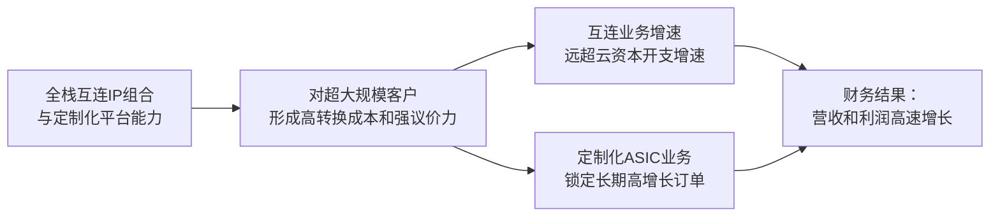

<!-- 匹配到的证券/行业：迈威尔科技(MRVL.O) -->
操作成功

### 一页通 （迈威尔科技 (MRVL.O)）
日期：2026-08-06
内容："""
## 公司概况

迈威尔科技（Marvell Technology, Inc.）是一家全球领先的数据基础设施半导体解决方案供应商，采用无晶圆厂（Fabless）模式运营。公司核心能力在于开发和规模化复杂的系统级芯片（SoC）架构，集成模拟、混合信号及数字信号处理功能，其产品组合覆盖从数据中心核心到网络边缘的全链路。公司主要服务于<strong>数据中心</strong>和<strong>通信及其他</strong>两大终端市场，其中数据中心业务是绝对主力，贡献了约四分之三的营收。迈威尔凭借其在高速SerDes、光互连DSP、定制化ASIC及以太网交换等领域的深厚知识产权积累，深度嵌入全球超大规模云服务商的AI基础设施供应链。  

## 公司近况跟踪

- <strong>FY1Q27业绩超预期，全年及远期指引大幅上调</strong>：公司于2026年5月28日发布FY1Q27（截至2026年5月2日）财报，营收达<strong>24.18亿美元</strong>，同比增长28%，环比增长9%。管理层将FY2027全年营收指引上调至约<strong>115亿美元</strong>（同比增长约40%），并将FY2028营收指引大幅上调至<strong>165亿美元</strong>（同比增长约45%），核心驱动力来自数据中心业务的加速增长，尤其是AI驱动的互连和定制化计算需求。   

- <strong>与NVIDIA达成深度战略合作，确立生态位优势</strong>：2026年3月，NVIDIA向迈威尔投资<strong>20亿美元</strong>购买可转换优先股。双方合作围绕三大支柱展开：1）深化在Scale-Up光互连（NPO/CPO）领域的技术合作；2）通过NVLink Fusion平台实现定制化XPU与NVIDIA生态的互操作性；3）在AI-RAN（无线接入网）领域整合双方技术。此举验证了迈威尔在AI连接技术领域的核心地位。  

- <strong>完成关键收购，补全Scale-Up互连版图</strong>：公司于2026年2月完成了对<strong>Celestial AI</strong>（光子 fabric技术）和<strong>XConn</strong>（PCIe/CXL交换技术）的收购。Celestial AI的CPO技术预计在FY4Q28实现<strong>5亿美元</strong>年化收入，FY4Q29达到<strong>10亿美元</strong>。XConn则增强了公司在UALink和PCIe交换领域的实力。   

- <strong>定制化ASIC业务迎来拐点，多项目驱动增长</strong>：管理层预计定制化业务在FY2027增长超20%，并在FY2028实现<strong>同比翻倍以上</strong>的增长。增长由三大引擎驱动：现有旗舰XPU项目持续放量、超过10个XPU附属项目（如CXL、NIC）进入量产、以及新Tier-1客户（微软Maia）的XPU项目启动。公司重申FY2029定制化业务收入超<strong>100亿美元</strong>的长期目标。   

- <strong>CFO平稳过渡</strong>：2026年6月，公司宣布任命拥有超过30年半导体行业经验的新任CFO Dan Durn，接替Willem Meintjes。前任CFO将留任至2027年4月以确保平稳交接，公司同时重申了FY2Q27的财务指引。 

## 短期逻辑

1.  <strong>FY2Q27业绩与FY2027全年指引的持续上修预期</strong>：公司预计FY2Q27营收中点为<strong>27亿美元</strong>（环比增长12%），且各季度营收将环比加速增长。考虑到AI网络需求持续强劲，以及定制化芯片新项目开始贡献收入，公司业绩大概率再次超出指引。市场将密切关注FY2Q27的实际业绩及管理层是否在电话会上进一步上调全年展望。任何超出预期的业绩和指引上调，都可能成为股价短期上涨的直接催化剂。   

2.  <strong>NVIDIA生态合作的深化与具体产品落地</strong>：NVIDIA的战略投资标志着迈威尔在AI基础设施中的地位从“供应商”升级为“战略合作伙伴”。短期内，市场将高度关注双方合作的具体产品进展，尤其是在<strong>Scale-Up光互连</strong>和<strong>NVLink Fusion平台</strong>上的联合开发成果。任何关于产品送样、客户导入或联合解决方案发布的公告，都将强化市场对迈威尔长期增长逻辑的信心，并可能触发估值重估。  

3.  <strong>Celestial AI的CPO技术商业化进展</strong>：Celestial AI的Photonic Fabric技术是公司在Scale-Up互连领域的核心布局。尽管大规模收入贡献预计在FY2028，但短期内任何关于其产品<strong>通过客户验证、进入量产阶段或获得新客户订单</strong>的消息，都将是对该技术路线可行性和市场需求的强有力证明。考虑到CPO技术被市场视为AI网络的下一个重要演进方向，该业务的进展将是影响投资者情绪和估值溢价的关键变量。  

4.  <strong>CXL内存扩展与控制器的需求爆发</strong>：随着AI推理和Agentic AI的发展，CPU与GPU的比例发生变化，对高带宽内存的需求激增。在HBM产能紧张和成本高企的背景下，CXL技术作为内存池化和扩展的关键解决方案，其需求有望迎来爆发式增长。迈威尔在该领域布局深厚，其CXL控制器和扩展器产品已获得多个客户设计订单。短期内，若公司披露更多CXL相关的设计订单或收入指引，将成为一个重要的增量催化因素。  

## 长期逻辑

1.  <strong>AI驱动的数据中心资本开支超级周期</strong>：公司长期增长的核心驱动力是全球超大规模云服务商为构建下一代AI基础设施而进行的持续巨额资本开支。摩根士丹利预测，超大规模云服务商的资本开支将从2024年的<strong>2610亿美元</strong>增长至2028年的<strong>1.4万亿美元</strong>，四年增长超5倍。这笔庞大的支出正从计算（GPU）向网络（互连）和存储（HBM/CXL）扩散，而迈威尔的产品组合精准卡位了这三大环节，尤其是其互连业务增速预计将长期<strong>超越云资本开支增速</strong>，显示出强大的结构性增长动力。 

2.  <strong>从“连接”到“平台”的战略升维，构建端到端解决方案</strong>：通过有机研发和收购（Inphi、Innovium、Celestial AI、XConn），迈威尔已构建起覆盖数据中心内部（Scale-Out）、数据中心之间（Scale-Across）以及XPU内部（Scale-Up）的全场景互连解决方案。公司不仅提供DSP、TIA/Driver等核心光学组件，还具备定制化XPU、以太网交换芯片、PCIe/CXL交换和CPO光引擎的完整设计能力。这种“计算+网络+光互连”的端到端平台化能力，使其能够为超大规模客户设计和优化整个机架级基础设施，从而大幅提升单客户价值量（“wallet share”）和客户粘性，构筑了强大的竞争壁垒。  

3.  <strong>定制化ASIC业务的非线性增长潜力</strong>：随着AI工作负载的多样化和对能效的极致追求，超大规模客户正加速自研定制化芯片（XPU）。迈威尔凭借其丰富的互连IP库（高速SerDes、Die-to-Die接口、定制HBM接口）和先进的封装技术，成为这一趋势的核心受益者。公司已锁定多个旗舰XPU项目，并拥有超过25个XPU及附属芯片的设计订单。管理层预计该业务收入将在FY2029年超过<strong>100亿美元</strong>，这意味着从FY2026的约15亿美元起，将实现近7倍的增长，是公司长期价值创造的最重要引擎。   

## 风险提示

- <strong>客户集中度风险</strong>：公司业务高度依赖少数几个大型客户。FY2026，前十大客户贡献了<strong>82%</strong> 的总营收，其中两个客户（一个直销客户和一个分销商）各自占比超过10%。任何主要客户因战略调整、自研替代方案或转向竞争对手而导致采购量下降，都将对公司营收和盈利能力产生重大不利影响。  

- <strong>定制化ASIC业务的竞争与项目波动风险</strong>：尽管公司在定制化芯片领域具备差异化优势，但仍面临来自博通（Broadcom）等传统ASIC巨头以及世芯电子（Alchip）、创意电子（GUC）等台湾设计服务公司的激烈竞争。定制化项目具有“赢者通吃”且收入高度集中的特点，单个大项目的获取或丢失、项目进度延迟或客户需求预测失误，都可能导致公司业绩出现大幅波动。 

- <strong>供应链与地缘政治风险</strong>：公司依赖台积电等少数第三方晶圆厂进行生产，且大部分产品制造和封装测试集中在亚洲地区。任何地缘政治紧张局势（尤其是台海局势）、自然灾害或供应链中断都可能导致产能受限和交付延迟。此外，美国对华出口管制政策的任何变化，都可能影响公司向中国客户的销售，FY1Q27以发货目的地计，中国地区收入占比高达<strong>44%</strong>。  

## 近期要闻

- <strong>2026年5月28日</strong>：公司发布FY1Q27财报，营收和EPS均超出市场预期。管理层大幅上调了FY2027和FY2028的营收指引，主要受数据中心业务，特别是AI互连和定制化计算需求强劲增长的推动。   

- <strong>2026年6月11日</strong>：公司宣布CFO过渡计划，任命半导体行业资深人士Dan Durn为新任CFO，接替Willem Meintjes。公司同时重申了FY2Q27的财务指引，表明此次人事变动为有序过渡。 

- <strong>2026年6月3日</strong>：在2026年Evercore全球TMT会议上，公司管理层详细阐述了与NVIDIA合作的三大支柱、Celestial AI CPO技术的商业化路径，以及定制化ASIC业务的多元化增长驱动因素，进一步增强了市场对其长期战略的信心。 

## 未来催化

- <strong>2026年8月底（预计）</strong>：公司发布FY2Q27财报。市场将重点关注营收和EPS是否再次超出指引，以及管理层是否会进一步上调FY2027全年业绩展望。这是短期内最直接、最重要的股价催化剂。  

- <strong>2026年下半年</strong>：NVIDIA Spectrum 6以太网平台（100T）的发布及相关生态合作进展。作为NVIDIA的战略合作伙伴，迈威尔的交换和互连产品在该平台中的集成情况，将是市场评估其技术地位和增长潜力的关键事件。 

- <strong>2026年下半年至2027年初</strong>：Celestial AI的CPO产品预计将进入量产阶段。任何关于该产品通过最终客户验证、获得批量订单或成功部署的消息，都将标志着公司在下一代光互连技术领域取得实质性突破，并可能开启新的估值空间。  

## 公司业务模式及拆分

### 业务边际变化

公司近年经历了深刻的业务转型，从一家业务线相对分散的半导体公司，战略性地重组为一家高度聚焦于数据基础设施的领导者。FY2025，公司通过重组计划，将研发资源集中投入数据中心市场，并剥离了汽车以太网业务。随后，公司通过收购Inphi（光互连DSP）、Innovium（数据中心交换）、Celestial AI（CPO）和XConn（PCIe/CXL交换），快速构建起一个覆盖计算、网络、光互连和存储的完整AI基础设施平台。目前，公司正处于由AI驱动的<strong>业绩加速兑现期</strong>，各项业务均呈现强劲增长势头。  

### 盈利模式

公司盈利模式的核心是<strong>依托其深厚的技术壁垒和知识产权（IP）组合，通过销售高性能、高壁垒的半导体解决方案来获取收入</strong>。其盈利驱动力主要来自两方面：1）<strong>标准产品销售</strong>：通过销售业界领先的光互连DSP、以太网交换芯片、存储控制器等标准产品，凭借技术代际领先优势获取高市场份额和溢价；2）<strong>定制化解决方案</strong>：为超大规模客户提供深度定制化的ASIC（XPU）及附属芯片，通过提供从前端设计到后端制造的全套服务，深度绑定客户并获取长期、高粘性的收入流。这种“标准品+定制化”的混合模式，既保证了规模效应，又增强了客户粘性。  

### 业务拆分

公司近年业务结构发生显著变化，数据中心业务已成为绝对核心。从FY4Q26开始，公司将原先的“企业网络、运营商基础设施、消费、汽车/工业”四个终端市场合并为“通信及其他”市场，与“数据中心”市场并列。这一变化反映了公司战略重心全面转向数据中心。当前公司正处于AI驱动的<strong>业绩加速兑现期</strong>。  

<strong>细分业务拆分（按终端市场）</strong>

| 项目 (百万美元) | FY2024 | FY2025 | FY2026 | FY1Q27 |
| :--- | :--- | :--- | :--- | :--- |
| <strong>数据中心</strong> | | | | |
| 收入 | 2,216.7 | 4,164.2 | 6,100.3 | 1,832.7 |
| 同比 | - | 87.9% | 46.5% | 27.2% |
| 占总收入比 | 40% | 72% | 74% | 76% |
| <strong>通信及其他</strong> | | | | |
| 收入 | 3,291.0 | 1,603.1 | 2,094.3 | 585.1 |
| 同比 | - | -51.3% | 30.6% | 28.7% |
| 占总收入比 | 60% | 28% | 26% | 24% |
| <strong>总计</strong> | <strong>5,507.7</strong> | <strong>5,767.3</strong> | <strong>8,194.6</strong> | <strong>2,417.8</strong> |

*注：公司未按终端市场披露毛利率。*

<strong>数据中心业务（FY1Q27）</strong>
该业务是公司增长的绝对引擎，FY1Q27收入<strong>18.33亿美元</strong>，同比增长27%，环比增长11%。增长由AI驱动的所有产品线共同推动。  
- <strong>互连（Interconnect）</strong>：是数据中心业务中最大和增长最快的部分。产品包括PAM4 DSP、相干DSP、DCI模块、AEC DSP、TIA/Driver等。受益于AI集群规模扩大，对高速率（800G/1.6T）、长距离光互连需求激增。管理层预计FY2027该业务收入增长<strong>超70%</strong>。  
- <strong>定制化计算（Custom Silicon）</strong>：为超大规模客户定制开发XPU（AI加速器）及附属芯片（CXL、NIC）。该业务正处于多项目放量初期，预计FY2027增长超20%，FY2028将<strong>同比翻倍以上</strong>。  
- <strong>交换（Switching）</strong>：包括Scale-Out（Teralynx系列）和Scale-Up（UALink/PCIe）以太网交换芯片。受益于AI网络对高带宽、低延迟交换的需求，预计FY2027收入超<strong>6亿美元</strong>，同比翻倍。  
- <strong>其他</strong>：包括存储控制器（HDD/SSD）、处理器（DPU）等传统优势产品，受益于数据中心存储需求增长，预计FY2027收入超<strong>10亿美元</strong>。 

<strong>通信及其他业务（FY1Q27）</strong>
该业务FY1Q27收入<strong>5.85亿美元</strong>，同比增长29%，环比增长3%。该市场已基本从客户库存修正中恢复，增长主要反映了企业网络、运营商和消费市场的潜在需求趋势。公司预计FY2027该业务增长约10%，FY2028为低个位数增长，增速远低于数据中心业务。  

## 核心竞争力

<strong>竞争要素 1：依托全栈互连IP组合构筑的技术平台壁垒</strong>

-   <strong>护城河定性</strong>：公司通过长期研发和一系列并购，构建了从数据中心内部（PAM4 DSP）、数据中心之间（相干DSP/DCI模块）到芯片内部（Die-to-Die SerDes）的全场景、全速率覆盖的互连IP组合。这种<strong>结构性护城河</strong>使得公司能够为超大规模客户提供从“计算”到“连接”的端到端优化方案，竞争对手难以在短期内复制如此完整且经过大规模量产验证的IP库。  
-   <strong>数据验证</strong>：公司互连业务在FY2027预计增长<strong>超70%</strong>，远超云资本开支增速。其TIA和驱动器业务年化收入已达<strong>10亿美元</strong>级别。在关键的1.6T PAM4 DSP市场，公司率先推出产品并保持<strong>绝大多数市场份额</strong>。这些数据证明了其技术领先性已成功转化为市场主导地位。  
-   <strong>动态演变</strong>：随着AI网络向更高带宽（3.2T）和更先进封装（CPO）演进，对互连IP的性能和集成度要求呈指数级上升。公司通过收购Celestial AI和内部研发，已率先布局下一代技术。其护城河有望在技术代际切换中进一步<strong>变宽</strong>，因为新进入者面临更高的技术门槛和客户认证壁垒。  

<strong>竞争要素 2：定制化ASIC业务的平台化能力与客户粘性</strong>

-   <strong>护城河定性</strong>：公司的定制化ASIC业务并非简单的设计服务，而是基于其强大的互连IP库、先进封装技术和系统级理解，为客户提供深度差异化的XPU解决方案。这种模式使得公司与客户形成了紧密的“联合研发”关系，客户转换成本极高。这构成了<strong>结构性护城河</strong>。 
-   <strong>数据验证</strong>：公司已获得超过<strong>25个</strong>XPU及附属芯片的设计订单，覆盖所有美国超大规模客户。其旗舰XPU项目已成功实现多代际量产，并锁定了下一代产品的订单。管理层预计该业务收入将从FY2026的约15亿美元增长至FY2029的<strong>超100亿美元</strong>，这种高确定性的长期增长是客户粘性的最佳证明。  
-   <strong>动态演变</strong>：随着AI工作负载日益复杂，超大规模客户对定制化芯片的依赖度将持续加深。公司凭借其平台化能力和成功的交付记录，有望在新项目中继续扩大份额。其护城河将随着与客户合作的代际深入而持续<strong>巩固</strong>。  

<strong>现阶段核心驱动力总结</strong>：
公司的Alpha在于其通过“自研+并购”构建的、难以复制的全栈互连IP平台，以及在定制化ASIC领域展现出的强客户粘性和项目获取能力。其Beta则高度依赖于AI驱动的数据中心资本开支超级周期。公司当前正处于Alpha与Beta共振的业绩加速兑现期。 

<strong>竞争格局传导逻辑图</strong>：

## 产销链

- <strong>客户情况</strong>：
  公司客户集中度较高。FY2026，前十大客户贡献了<strong>82%</strong> 的总营收。其中，一个直销客户（Customer A）和一个分销商（Distributor A）的营收占比分别达到<strong>14%</strong> 和<strong>37%</strong>。FY1Q27，这两个客户的营收占比分别为<strong>16%</strong> 和<strong>45%</strong>，集中度有进一步上升趋势。这种高度集中的客户结构意味着公司业绩对核心客户的需求波动和资本开支计划高度敏感。在新客户方面，公司已成功获得微软（Microsoft）作为其定制化XPU的新Tier-1客户，该项目正处于开发后期，预计在FY2028开始量产，这有助于未来客户结构的多元化。  

- <strong>供应商情况</strong>：
  作为一家Fabless公司，迈威尔主要依赖台积电（TSMC）等少数第三方晶圆厂进行芯片制造，并将封装测试外包给位于亚洲的合作伙伴。为应对AI需求爆发带来的产能紧张，公司采取了积极的供应链管理策略，包括与供应商签订长期产能预留协议并支付预付款。公司计划在FY2027支付约<strong>10亿美元</strong>的预付款以锁定未来产能。这种模式虽然增加了短期现金流压力，但确保了在供应紧张环境下的增长确定性。  

- <strong>成本传导能力</strong>：
  当上游晶圆代工或先进封装环节涨价时，公司凭借其产品在性能和功耗上的技术领先性，以及在定制化业务中与客户的深度绑定关系，具备较强的成本转嫁能力。公司赚取的是基于其核心IP和系统级解决方案的“技术溢价”和“平台价值”，而非单纯的“加工费”。 

## 财务数据

<strong>关键财务数据</strong>

| 项目 (百万美元) | FY2024 | FY2025 | FY2026 | FY1Q27 |
| :--- | :--- | :--- | :--- | :--- |
| <strong>截止日期</strong> | 2024-02-03 | 2025-02-01 | 2026-01-31 | 2026-05-02 |
| <strong>营业总收入</strong> | 5,507.7 | 5,767.3 | 8,194.6 | 2,417.8 |
| 同比 | -6.96% | 4.71% | 42.09% | 27.57% |
| <strong>营业成本</strong> | 3,214.1 | 3,385.1 | 4,013.9 | 1,157.0 |
| <strong>Non-GAAP毛利润</strong> | - | 3,520.6 | 4,871.8 | 1,423.8 |
| <strong>Non-GAAP毛利率</strong> | - | 61.0% | 59.5% | 58.9% |
| <strong>营业利润</strong> | -567.7 | -720.3 | 1,322.9 | 339.4 |
| <strong>归母净利润 (GAAP)</strong> | -933.4 | -885.0 | 2,670.1 | 34.5 |
| <strong>Non-GAAP摊薄EPS (美元)</strong> | - | 1.57 | 2.85 | 0.80 |
| <strong>经营活动现金流</strong> | 1,370.5 | 1,681.2 | 1,750.5 | 638.8 |
| <strong>资本性支出</strong> | 336.3 | 284.6 | 354.1 | 155.7 |
| <strong>自由现金流</strong> | 1,034.2 | 1,396.6 | 1,396.4 | 483.1 |

*注：Non-GAAP数据来源于公司财报及研究报告。*

<strong>财务分析</strong>

- <strong>成长能力</strong>：公司营收在FY2026重回高速增长轨道，同比增长<strong>42.1%</strong>，FY1Q27增速也达到<strong>27.6%</strong>。增长主要由数据中心业务驱动，该业务FY2026同比增长<strong>46.5%</strong>。Non-GAAP净利润在FY2026同比大增<strong>79.0%</strong>，显示出强劲的盈利增长杠杆效应。  

- <strong>盈利能力</strong>：公司Non-GAAP毛利率在FY2026和FY1Q27分别为<strong>59.5%</strong>和<strong>58.9%</strong>，保持在较高水平，但呈现轻微下降趋势，主要受定制化ASIC业务（毛利率通常低于标准产品）占比提升的影响。Non-GAAP营业利润率从FY2025的28.9%大幅提升至FY2026的<strong>35.3%</strong>，FY1Q27为<strong>35.0%</strong>，显示出随着营收规模扩大，运营杠杆正在显著改善。  

- <strong>运营能力</strong>：FY1Q27应收账款为<strong>18.72亿美元</strong>，相较于FY2026年末的21.87亿美元有所下降，DSO（应收账款周转天数）约为70天。存货为<strong>14.01亿美元</strong>，较FY2026年末的13.88亿美元略有增加，存货周转天数约为110天，处于健康水平，反映了为支持未来收入增长而进行的主动备货。 

- <strong>偿债能力与现金流</strong>：截至FY1Q27末，公司持有现金<strong>38.44亿美元</strong>，总债务为<strong>49.61亿美元</strong>，净债务约为<strong>11.17亿美元</strong>。公司杠杆率健康，净债务与TTM调整后EBITDA的比率远低于1倍。FY1Q27自由现金流为<strong>4.83亿美元</strong>，显示出良好的现金生成能力。公司有充足的财务资源支持其资本开支、收购和股东回报计划。 

## 行业及竞争分析

公司所处的核心赛道是<strong>AI数据中心基础设施半导体</strong>，具体可细分为以下几个高增长市场：

1.  <strong>数据中心互连（DCI）与光通信</strong>：
    - <strong>供需与规模</strong>：AI集群规模的扩大驱动了对高速率（800G/1.6T/3.2T）、低延迟光互连需求的爆发式增长。Jefferies专家预计，全球光模块市场2026年将翻倍，2027年增至三倍，且1.6T产品面临约<strong>30%</strong> 的短缺。机构预测，到2030年DCI可插拔模块市场规模将增长超5倍。 
    - <strong>竞争格局</strong>：迈威尔（通过收购Inphi）与博通（Broadcom）是该市场，尤其是PAM4 DSP领域的双寡头。迈威尔凭借率先推出每一代产品，持续保持<strong>绝大多数市场份额</strong>。在TIA/Driver、AEC DSP和相干DSP领域，公司也处于领先地位。主要竞争对手包括博通、Credo、瑞昱等。  

2.  <strong>定制化AI ASIC（XPU）</strong>：
    - <strong>供需与规模</strong>：超大规模客户为寻求差异化、更高能效和更低成本，正加速自研AI芯片。管理层预计其可服务的定制化AI ASIC市场规模（TAM）到2028年将达到<strong>550亿美元</strong>。 
    - <strong>竞争格局</strong>：市场主要参与者为博通和迈威尔。与博通相比，迈威尔的优势在于其更全面的互连IP组合和更灵活的客户合作模式。来自台湾的设计服务公司（如世芯电子、创意电子）是另一类竞争者，但它们主要提供后端物理设计服务，缺乏核心IP，迈威尔在高端XPU市场的差异化优势明显。 

3.  <strong>数据中心交换（Switching）</strong>：
    - <strong>供需与规模</strong>：AI网络对高带宽、低延迟、大吞吐量交换机的需求驱动市场快速增长。 
    - <strong>竞争格局</strong>：该市场由博通主导，迈威尔通过Innovium的Teralynx系列交换机芯片，凭借其在能效和低延迟方面的优势，正在快速获取市场份额。公司预计其Scale-Out交换业务FY2027收入超<strong>6亿美元</strong>，并有望在FY2028达到<strong>10亿美元</strong>年化收入。  

<strong>可比公司</strong>

| 公司名称 | 股票代码 | 对标维度 | 分析 |
| :--- | :--- | :--- | :--- |
| 博通 (Broadcom) | AVGO | AI ASIC、网络交换、光DSP | 在定制化ASIC和交换芯片市场是迈威尔最直接的竞争对手，规模更大，但迈威尔在光互连DSP和CPO等新兴领域展现出更强的增长锐度。 |
| 英伟达 (Nvidia) | NVDA | AI计算平台、网络 | 是AI计算GPU的绝对领导者，同时也是迈威尔的战略合作伙伴。两者在Scale-Up网络（NVLink）上合作，但在定制化ASIC领域存在间接竞争。 |
| Credo Technology | CRDO | 光互连DSP、AEC | 在高速DSP和AEC市场是迈威尔的直接竞争对手，但产品线和IP组合的广度远不及迈威尔。 |
| Astera Labs | ALAB | PCIe/CXL连接 | 在PCIe Retimer和CXL内存互连领域是迈威尔（通过XConn）的直接竞争对手。 |

<strong>总结分析</strong>：迈威尔在多个高增长的AI基础设施细分市场均占据领先地位，其独特的竞争优势在于其<strong>跨计算、网络、光互连和存储的全栈IP组合</strong>。这使得公司能够提供端到端的优化解决方案，与博通、英伟达等行业巨头形成既竞争又合作的复杂关系。相较于纯粹的连接芯片公司（如Credo）或设计服务公司，迈威尔的平台化能力是其最深的护城河。 

## 市场焦点议题

- <strong>议题一：AI资本开支的可持续性与投资回报率</strong>
    - <strong>背景</strong>：公司业绩与超大规模云服务商的资本开支高度相关。尽管当前资本开支强劲，但市场对如此庞大的投资能否带来相应的回报，以及这种支出强度能否持续存在长期疑虑。近期部分科技巨头财报显示自由现金流承压，加剧了这一担忧。 
    - <strong>问题列表</strong>：
        1.  公司如何评估其客户AI投资的回报率？是否有量化数据支持客户的投资正在产生效益？
        2.  如果云服务商因宏观环境或投资回报率问题而削减资本开支，公司有何应对预案？
        3.  公司营收增速远超云资本开支增速的趋势，在FY2028及以后能否持续？驱动力是什么？

- <strong>议题二：定制化ASIC业务的客户集中度与项目波动</strong>
    - <strong>背景</strong>：定制化ASIC业务具有“大单驱动”的特征，单个项目的成败对公司业绩影响巨大。市场对公司能否持续获得新的大客户订单，以及现有项目的生命周期存在分歧。 
    - <strong>问题列表</strong>：
        1.  公司FY2029定制化业务超100亿美元的收入目标中，来自已签约客户和潜在新客户的比例分别是多少？
        2.  微软Maia项目的收入贡献预期和量产时间表是否明确？是否存在项目延迟或规模缩减的风险？
        3.  面对博通等竞争对手，公司如何确保在下一代XPU项目中继续保持高胜率？

- <strong>议题三：毛利率趋势与盈利模型</strong>
    - <strong>背景</strong>：随着定制化ASIC（毛利率较低）和CPO等新业务（初期毛利率可能不高）的占比提升，市场关注公司整体毛利率是否存在持续下行的压力，以及运营杠杆能否有效对冲。 
    - <strong>问题列表</strong>：
        1.  公司对FY2027和FY2028的毛利率指引是什么？定制化业务占比提升对毛利率的稀释效应有多大？
        2.  Celestial AI的CPO产品在达到5亿美元年化收入时的目标毛利率是多少？长期稳态毛利率水平如何？
        3.  公司计划通过哪些具体措施（如运营费用控制）来实现FY2028接近<strong>38-40%</strong> 的营业利润率目标？

## 市场分歧探讨

<strong>核心分歧：公司当前的高估值是否已充分反映了其长期增长潜力，还是仍被低估？</strong>

- <strong>乐观方观点</strong>：迈威尔已从一个周期性半导体公司，成功转型为一个拥有独特全栈IP平台的AI基础设施核心供应商。其增长是由AI这一长期结构性趋势驱动，而非短期周期波动。公司在光互连和定制化ASIC领域的技术护城河深厚，与NVIDIA的战略合作进一步打开了其市场空间。FY2029年定制化业务100亿美元的收入目标若能实现，将带来巨大的盈利弹性，当前估值（约30-35倍FY2028 Non-GAAP P/E）相对于其超过50%的EPS增速（PEG小于1）而言，仍然具备吸引力。  

- <strong>谨慎方观点</strong>：公司当前估值已处于历史高位，充分甚至过度反映了乐观预期。其业绩高度依赖少数超大规模客户的资本开支，而资本开支本身具有周期性。一旦AI投资回报率不及预期，或出现技术路径切换，公司业绩将面临巨大波动。此外，定制化ASIC业务的毛利率较低，其占比提升将结构性拖累公司整体盈利水平。公司通过大量发行股票和可转换优先股进行收购，稀释了现有股东权益，且GAAP净利润与Non-GAAP净利润之间存在巨大差距，真实的盈利能力有待验证。  

<strong>总结分析</strong>：公司的长期成长逻辑清晰，技术护城河深厚，短期业绩动能强劲，这是其享受估值溢价的基础。然而，高客户集中度、定制化业务的固有波动性以及因收购带来的股权稀释和GAAP盈利压力，是其不可忽视的风险点。当前估值已隐含了未来几年高增长的预期，容错空间相对有限。任何低于预期的业绩指引或关键项目进展延迟，都可能导致估值出现显著回调。 

## 盈利预测与估值

<strong>管理层最新指引（基于FY1Q27业绩会）</strong>：
- <strong>FY2027</strong>：预计总营收约<strong>115亿美元</strong>，同比增长约40%。其中数据中心营收同比增长约50%，互连业务增长超70%。Non-GAAP运营费用约<strong>24.5亿美元</strong>。  
- <strong>FY2028</strong>：预计总营收约<strong>165亿美元</strong>，同比增长约45%。其中数据中心营收同比增长约55%，定制化计算业务收入同比翻倍以上。Non-GAAP运营费用增长中高双位数百分比，营业利润率有望达到<strong>38-40%</strong> 目标区间的上限。  

<strong>券商盈利预测与估值</strong>

| 机构 | 评级 | 目标价(美元) | 财务指标 | FY2026A | FY2027E | FY2028E | FY2029E |
| :--- | :--- | :--- | :--- | :--- | :--- | :--- | :--- |
| 瑞银 (2026-06-02) | 买入 | 230 | Non-GAAP EPS (美元) | 2.85 | 3.96 | 6.09 | 8.60 |
| 美国银行 (2026-05-29) | 买入 | 240 | Non-GAAP EPS (美元) | 2.85 | 4.06 | 6.11 | 10.02 |
| 摩根士丹利 (2026-06-01) | 持有 | 195 | Non-GAAP EPS (美元) | 2.85 | 3.98 | 5.93 | 8.28 |
| 高盛 (2026-05-29) | 中性 | 180 | Non-GAAP EPS (美元) | 2.85 | 4.05 | 6.15 | 9.25 |
| 德意志银行 (2026-05-29) | 买入 | 240 | Non-GAAP EPS (美元) | 2.85 | 4.06 | 6.27 | 9.10 |
| 摩根大通 (2026-06-01) | 超配 | 240 | Non-GAAP EPS (美元) | 2.85 | 4.04 | 6.43 | - |
| 华兴证券 (2026-06-03) | 买入 | 247 | Non-GAAP EPS (美元) | 2.86 | 4.21 | 7.04 | 10.46 |
| 中金公司 (2026-06-02) | 跑赢行业 | 240 | Non-GAAP EPS (美元) | 2.85 | 4.00 | 6.07 | - |

*注：预测数据来源于各机构研究报告，部分机构预测周期不同，已按财年对齐。*

<strong>盈利预期与估值分析</strong>：
各大券商对迈威尔的盈利预测和评级存在高度共识，均为“买入”或“超配”评级。对FY2027和FY2028的Non-GAAP EPS预测均值分别为<strong>4.05美元</strong>和<strong>6.26美元</strong>，显示出对公司未来两年盈利高速增长的强烈信心。估值方法上，机构普遍采用市盈率（P/E）估值法，基于FY2028或CY2028的盈利预测，给予<strong>25倍至35倍</strong>的估值倍数，目标价集中在<strong>180美元至247美元</strong>之间。估值倍数的差异反映了市场对公司长期增长确定性、竞争格局和宏观风险的不同看法。整体而言，市场对公司的盈利预期较为一致，分歧主要在于对高增长可持续性的判断，从而体现在估值倍数的选择上。
"""
