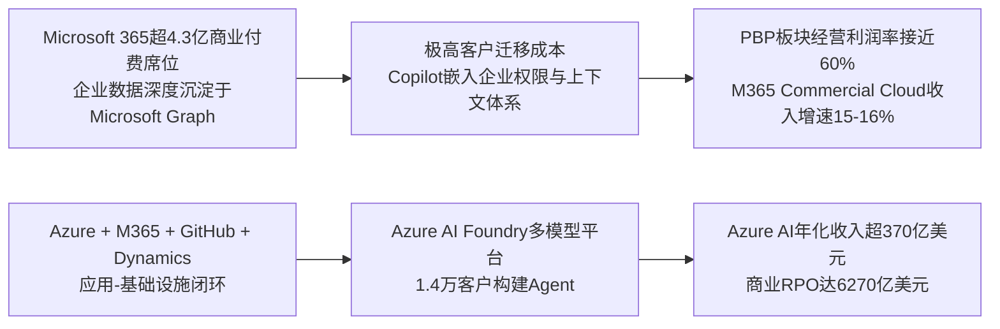

# Gangtise 公司一页通：微软（MSFT.O）

> 拉取日期：2026-07-29 ｜ 来源：gangtise-agent `stock-one-pager`（注：拉取于财报发布当日，内容为财报前预期）

## 公司概况

微软是全球最大的软件与云服务公司，核心业务围绕**操作系统、生产力套件、云基础设施与AI平台**展开。公司通过“生产力与商业流程”（Microsoft 365、LinkedIn、Dynamics 365）、“智能云”（Azure）和“更多个人计算”（Windows、Xbox、搜索）三大板块运营。微软凭借Windows与Office在PC时代确立的软件标准，在云转型期成功将收入模式从一次性授权切换为订阅与云消耗，当前正依托Azure和Copilot向AI工作流平台升级。FY2025公司营收2817.24亿美元，Azure年收入首次超过750亿美元，是全球第二大IaaS公有云服务商。 

## 公司近况跟踪

- **Xbox业务大规模重组与裁员**：2026年7月6日，微软宣布裁员约4800人，其中Xbox部门占1600人，并计划在FY2027内累计裁减约3200人（占Xbox员工总数约20%），同时剥离四家游戏工作室、为第五家启动战略评估。Xbox负责人明确表示该业务“目前状况并不健康”，每投入1美元产生约64美分亏损，Game Pass订阅用户约3000万，远低于此前预期的7700万。此举旨在将资源集中于Minecraft、Candy Crush等核心品牌，并提升盈利能力。   

- **成立Frontier Company加码企业AI部署**：微软投入25亿美元成立Microsoft Frontier Company，配备约6000名专家，专职帮助企业客户整合微软自研及第三方AI工具、对接内部数据，实现AI规模化落地。微软商用业务总裁承认，三年前打造Copilot时“只绑定OpenAI模型是一个错误”，企业真正需要的是能灵活替换顶尖模型、自主微调的平台。 

- **自研MAI模型开始替代外部模型**：微软已在Excel、Outlook等产品中用自研MAI模型部分取代OpenAI和Anthropic的模型，每周处理数万条AI提示请求。微软AI负责人Mustafa Suleyman明确表示目标是“降低并最终消除”向外部模型供应商支付的费用。6月Build大会上微软发布了7款自研MAI模型，其中MAI-Thinking-1在盲测中优于Claude Sonnet 4.6。  

- **发布网络安全专用AI模型**：2026年7月27日，微软推出首款网络安全专用模型MAI-Cyber-1-Flash及多智能体漏洞识别修复平台MDASH，在CyberGym基准测试中综合成功率95.95%，较第二名Mythos高出12个百分点。同步发布智能防御系统Project Perception，将于8月3日开启公开预览。  

- **CEO密集发声倡导模型多样性**：CEO Satya Nadella在6-7月连续发表博客，警告企业“将价值拱手让给少数模型”的风险，主张“前沿生态系统而非单一前沿模型”，强调企业应拥有“编码自身机构知识的学习循环”。这一表态被市场解读为微软在为其多模型平台战略造势，同时也引发了对微软与OpenAI关系是否出现摩擦的猜测。 

## 短期逻辑

1. **FY26Q4财报（7月29日）是验证AI投资回报的关键催化剂**：市场对微软的核心担忧在于AI资本开支能否转化为现金流，本次财报将直接回答这一问题。买方对Azure固定汇率增速的预期约为41%（高于公司指引39-40%），同时期待管理层重申FY27上半年Azure“小幅加速”的指引。若Azure增速达到或超过41%，且Copilot付费席位净增超过500万（公司指引为“超过”500万），将有助于缓解市场对AI ROI的疑虑。但需注意，部分渠道反馈显示Azure存在外部客户容量受限的问题，可能限制超预期幅度。  

2. **资本开支指引将成为股价分水岭**：公司已指引CY2026总资本开支约1900亿美元（含约250亿美元组件涨价影响）。市场买方对FY27资本开支的预期已升至2550-2600亿美元区间，显著高于卖方共识的2300-2350亿美元。若公司给出FY27资本开支指引，且数字接近或低于买方预期区间，可能被解读为“资本开支增速见顶”的积极信号；反之，若大幅超出，叠加近期谷歌、甲骨文因资本开支上调后股价承压的先例，微软股价可能面临进一步压力。  

3. **M365价格上调与E7捆绑包的ARPU拉动效应开始显现**：2026年7月1日起，M365商业版价格上调正式生效，同时5月推出的E7“Frontier Suite”捆绑包（含E5+Copilot+Agent 365+Entra，定价99美元/月）开始逐步渗透。瑞银测算，仅7月价格上调一项即可在FY27为M365商业云贡献约150个基点的增速提振。若FY27Q1（9月季度）的M365商业云增速指引出现明显上行，将直接验证微软在应用层的AI变现能力，成为扭转市场对Copilot“叫好不叫座”印象的重要契机。 

## 长期逻辑

1. **Azure AI从“裸金属”向“全栈平台”的变现升级**：市场当前对Azure AI的定价隐含了“商品化算力提供商”的悲观假设。摩根士丹利的情景分析显示，若Azure AI能实现类似Core Azure的平台化变现水平（Rev/MW从当前约8-10百万美元提升至13-14百万美元），则FY28 Azure收入存在约12%的上行空间；若进一步实现“全栈AI平台”级别的变现（Rev/MW超过20百万美元），上行空间可达49%。微软的差异化在于，Azure AI不仅是算力，更是Microsoft 365、GitHub、Dynamics、Security等应用层需求的天然承接平台，这种“应用-基础设施”闭环是纯IaaS厂商难以复制的。 

2. **Copilot驱动的ARPU重定价是微软历史上最大的单体变现机会之一**：Microsoft 365拥有超过4.3亿商业付费席位，Copilot定价30美元/月/席位，相当于E3价格的83%、E5价格的53%。当前付费席位仅约2000万（渗透率不足5%），若渗透率提升至20-30%，仅席位收入即可贡献数百亿美元的年化增量。更重要的是，微软正将商业模式从“纯席位订阅”升级为“席位+用量消费”混合模式（GitHub Copilot已率先切换），这意味着AI收入将不再受限于用户数量，而是与使用强度挂钩，打开了更长期的ARPU上行空间。 

3. **运营杠杆与成本优化可部分对冲毛利率压力**：尽管AI基础设施投入持续推高折旧与云服务成本，微软正通过多重手段管理利润率：a）自研MAI模型降低对外部模型供应商的依赖和支付成本；b）自研Maia 200 AI加速器（声称token效率提升30%以上）和Cobalt CPU逐步替代第三方硬件；c）严格控制运营费用，管理层已明确FY27运营费用将保持中到高个位数增长，且员工人数同比下降。长期来看，若Azure AI毛利率能从当前的20-30%逐步向Core Azure的60%+靠拢，公司整体ROIC有望维持在20%以上。 

## 风险提示

- **AI资本开支回报不及预期的风险**：微软FY2026资本开支预计约1900亿美元，FY2027可能进一步增至2500亿美元以上。当前自由现金流已显著承压（FY26Q3自由现金流仅158亿美元，远低于经营现金流的467亿美元）。若Azure AI的变现速度和毛利率提升慢于预期，或Copilot付费渗透率停滞在低个位数，巨额资本开支将长期拖累自由现金流和ROIC，市场可能进一步压缩估值倍数。  

- **OpenAI合作关系变化与模型层竞争加剧的风险**：微软与OpenAI的合作关系已从“独家”转为“非独家”，OpenAI可自由向其他云服务商采购算力。同时，开源模型（如DeepSeek、Kimi K3等）能力快速追赶，正在压缩前沿闭源模型的定价权。若OpenAI的竞争优势被削弱，或微软自研MAI模型未能及时填补能力缺口，Azure AI作为“OpenAI算力承接方”的叙事将受到冲击，且微软在模型层的战略定位将面临挑战。 

- **M365 Copilot面临“替代而非增强”的长期风险**：当前Copilot的定位是Office的AI增值层，但若未来企业工作流不再经过Word、Excel、PowerPoint，而是由独立Agent直接从各系统抽取数据、生成结论并推送结果，Office工具层的打开频率可能下降。微软需要证明Copilot/Agent能成为“企业数据与权限入口”，而非仅仅是“办公软件的功能增强”，否则M365的长期价值命题将面临重估。 

## 近期要闻

- **2026年7月6日**：微软宣布裁员约4800人（占全球员工总数2.1%），其中Xbox部门当日裁撤1600人，并计划在FY2027内累计裁减约3200人。同时宣布剥离四家游戏工作室，为第五家启动战略评估。Xbox负责人称该业务“目前状况并不健康”。   

- **2026年7月6日**：微软宣布成立Microsoft Frontier Company，投入25亿美元、配备约6000名专家，专职企业AI规模化部署。 

- **2026年7月8日**：据彭博社报道，微软开始在Excel、Outlook等产品中用自研MAI模型部分替代OpenAI和Anthropic的模型，以降低AI使用成本。  

- **2026年7月27日**：微软发布首款网络安全专用AI模型MAI-Cyber-1-Flash及多智能体平台MDASH，在CyberGym基准测试中成功率95.95%，显著超越竞品。同步发布智能防御系统Project Perception。  

## 未来催化

- **2026年7月29日**：微软发布FY26Q4财报。市场关注Azure固定汇率增速能否达到或超过41%、Copilot付费席位净增是否超过500万、FY27资本开支指引是否低于买方预期的2550-2600亿美元、以及管理层对FY27毛利率和运营利润率的定性指引。  

- **2026年8月3日**：微软Project Perception智能防御系统开启公开预览。若市场反馈积极，将强化微软在AI安全领域的差异化定位，并为Azure安全服务带来新的变现机会。  

- **2026年9月季度**：M365价格上调（7月1日生效）的影响将在FY27Q1财报中首次全面体现。若M365商业云增速出现明显上行，将成为Copilot和E7捆绑包之外验证微软AI应用层变现能力的又一重要证据。 

## 公司业务模式及拆分

**业务边际变化**：微软正处于从“云服务平台”向“AI工作流平台”升级的关键阶段。核心变化包括：a）商业模式从“纯席位订阅”向“席位+用量消费”混合模式转型（GitHub Copilot已于2026年6月1日率先切换）；b）从“单一OpenAI能力输出”走向“多模型与Agent平台”（Azure AI Foundry已支持OpenAI、DeepSeek、Meta、xAI等多类模型）；c）自研MAI模型体系快速补齐，开始在Office产品中替代外部模型；d）Xbox业务大幅收缩，资源向AI基础设施和核心生产力业务集中。  

**盈利模式**：微软的盈利模式是“基础订阅+高阶套餐升级+AI增值付费+云资源消耗”的混合变现体系。Microsoft 365和Dynamics 365以按席位订阅为主，Copilot作为高价值增值层（30美元/月/席位）拉动ARPU；Azure以按资源和使用量计费为主，收入弹性高但资本强度大；GitHub Copilot已转向usage-based billing，将推理成本与客户使用强度直接挂钩。公司整体赚的是“企业工作流入口+云基础设施平台”的双重价值，护城河来自高迁移成本、企业数据沉淀和生态绑定。 

**业务拆分**：

公司近年业务结构以“生产力与商业流程”和“智能云”为双核心增长引擎，“更多个人计算”占比持续萎缩。FY2026前三季度，智能云收入占比约42%，首次成为第一大板块；生产力与商业流程占比约41%；更多个人计算占比约17%。增速方面，智能云受Azure AI驱动保持30%左右的高增长，生产力与商业流程维持中双位数稳健增长，更多个人计算受Xbox和Windows OEM拖累呈负增长。公司当前处于**AI基础设施投入高峰期**，资本开支增速显著快于收入增速，毛利率和自由现金流阶段性承压。  

**细分业务拆分**

| 业务板块 | 指标 | FY2023 | FY2024 | FY2025 | FY2026 Q1-Q3 |
|---|---|---|---|---|---|
| **截止日期** | | 2023-06-30 | 2024-06-30 | 2025-06-30 | 2026-03-31 |
| **生产力与商业流程** | 收入(亿美元) | 777.28 | 1208.10 | 1392.24 | 1042.85 |
| | 同比(%) | - | 55.43 | 15.24 | 16.50 |
| | 收入占比(%) | 36.68 | 49.29 | 49.42 | 43.12 |
| **智能云** | 收入(亿美元) | 1053.62 | 1062.65 | 1368.24 | 1028.06 |
| | 同比(%) | - | 0.86 | 28.76 | 29.50 |
| | 收入占比(%) | 49.72 | 43.35 | 48.57 | 42.51 |
| **更多个人计算** | 收入(亿美元) | 620.32 | 546.49 | 533.87 | 347.41 |
| | 同比(%) | - | -11.90 | -2.31 | -5.50 |
| | 收入占比(%) | 29.27 | 22.30 | 18.95 | 14.37 |
| **总计** | 收入(亿美元) | 2119.15 | 2451.22 | 2817.24 | 2418.32 |
| | 同比(%) | 6.88 | 15.67 | 14.93 | 17.80 |

*注：FY2024生产力与商业流程收入大幅增长主要受收购动视暴雪及并表影响，但动视暴雪的游戏内容收入主要归入“更多个人计算”板块。上述分部分类以FY2025年报口径为准。*

**生产力与商业流程（FY2026 Q1-Q3收入1042.85亿美元，占比43.12%，同比+16.5%）**：该板块是微软的利润底盘，经营利润率接近60%。核心收入来自Microsoft 365 Commercial Cloud（付费席位超4.3亿，同比+7%），Copilot付费席位已突破2000万（FY26Q3数据），按30美元/月标价静态测算对应年化收入约72亿美元。Dynamics 365收入同比+22%（FY26Q3），LinkedIn收入同比+12%。该板块正从“纯席位订阅”向“席位+用量消费”混合模式转型，E7捆绑包（99美元/月）于2026年5月推出，M365价格上调于7月1日生效，共同构成FY27的ARPU提升驱动。  

**智能云（FY2026 Q1-Q3收入1028.06亿美元，占比42.51%，同比+29.5%）**：该板块是微软的增长引擎，但利润率受AI基础设施投入影响承压。核心收入来自Azure及Azure AI。Azure FY2025年收入首次超过750亿美元，FY2026前三季度保持约40%的固定汇率增速。Azure AI年化收入运行率已超370亿美元（FY26Q3），同比+123%。Azure AI Foundry多模型客户数环比翻倍，超过1万家客户使用过至少两种模型。该板块经营利润率约39.7%（FY26Q3），低于公司整体水平，主要受AI基础设施折旧和GitHub Copilot使用量增加影响。  

**更多个人计算（FY2026 Q1-Q3收入347.41亿美元，占比14.37%，同比-5.5%）**：该板块持续萎缩，主要受Xbox硬件和内容收入下滑（FY26Q3同比-5%）、Windows OEM收入下降（同比-2%）拖累。搜索和新闻广告收入同比+12%是少数亮点。Xbox业务已于2026年7月启动大规模重组，计划裁员约3200人并剥离多家工作室，未来将更聚焦平台和分发角色。  

## 核心竞争力

**竞争要素 1：依托极高转换成本与数据飞轮构筑的企业工作流入口**

- **护城河定性**：**结构性护城河**。Microsoft 365拥有超过4.3亿商业付费席位，覆盖文档、邮件、会议、协作等高频工作场景，企业数据（邮件、文档、会议纪要、组织关系）深度沉淀在Microsoft Graph中。迁移到其他办公体系不仅涉及软件替换，还涉及员工培训、格式兼容、历史文件处理和IT管理成本。Copilot在此基础上叠加了“企业上下文与权限体系”的壁垒——通用AI工具无法安全调用企业内部邮件、文档、组织关系和权限数据，而Copilot通过Microsoft Graph可在用户权限范围内实现这一点。 

- **数据验证**：Microsoft 365 Commercial Cloud收入FY2026前三季度保持约15-16%的固定汇率增速，付费席位同比+7%，显示AI工具（ChatGPT、Claude、Gemini等）的涌入并未造成明显用户流失。PBP板块经营利润率接近60%，是公司最稳定的利润来源。  

- **动态演变**：护城河面临“Agent可能重写Office价值命题”的长期挑战。如果未来企业工作流不再经过Word、Excel、PowerPoint，而是由独立Agent直接从各系统抽取数据并推送结果，Office工具层的打开频率可能下降。微软的应对策略是将Copilot/Agent升级为“企业任务执行平台”（而非仅仅是Office的功能增强），并通过E7捆绑包、Copilot Cowork等产品将AI能力嵌入工作流。**护城河维持，但面临技术范式变化的潜在侵蚀风险**。 

**竞争要素 2：应用-基础设施闭环形成的平台网络效应**

- **护城河定性**：**结构性护城河**。微软的差异化在于，Azure不仅是IaaS/PaaS云平台，更是Microsoft 365、GitHub、Dynamics、Security、Power Platform等应用层需求的天然承接平台。企业客户从Office场景进入，自然产生对Azure云资源、数据服务、AI推理和Agent部署的需求，形成“应用拉动基础设施”的闭环。这种闭环是纯IaaS厂商（AWS）或纯应用厂商（Salesforce）难以复制的。 

- **数据验证**：Azure AI Foundry已有1.4万名客户用于构建Agent，80%的Fortune 500已使用Foundry。同时使用Foundry和Fabric的客户达1.5万家，同比+60%。Azure AI年化收入运行率超370亿美元，同比+123%。商业RPO（剩余履约义务）达6270亿美元，同比+99%，其中约25%预计在未来12个月内确认为收入。  

- **动态演变**：随着微软从“单一OpenAI能力输出”走向“多模型与Agent平台”，Azure AI Foundry的战略定位正在从“OpenAI算力承接方”升级为“企业AI应用平台”。这一转型有助于降低对单一模型供应商的依赖，但也要求微软在自研模型（MAI）和自研芯片（Maia、Cobalt）上持续投入以维持竞争力。**护城河变宽（巩固中）**。 

**现阶段核心驱动力总结**：微软的Alpha来自“企业工作流入口+云基础设施平台”的双重卡位，以及从“纯席位订阅”向“席位+用量消费”混合模式的变现升级。Beta来自全球企业AI adoption的加速和云迁移的持续。当前市场对微软的定价分歧主要集中在“AI资本开支能否转化为自由现金流”这一问题上，而非对其竞争地位的质疑。 

**竞争格局传导逻辑图**：

## 产销链

**客户情况**：微软客户结构高度分散，以企业客户为主。Microsoft 365商业付费席位超4.3亿，覆盖从大型企业到中小企业的广泛客群。Azure客户同样分散，但存在对OpenAI的高度依赖——据报道，微软商业RPO中约45%来自OpenAI单一客户。这一集中度构成潜在风险：若OpenAI将更多工作负载转移至其他云服务商（其与微软的独家合作关系已结束），微软可能面临短期算力利用率和收入增速的双重压力。 

**供应商情况**：微软的主要供应商包括GPU/CPU芯片厂商（英伟达为主，同时自研Maia和Cobalt芯片）、存储芯片厂商、数据中心基础设施供应商（电力、冷却、网络设备等）。FY2026资本开支中约三分之二用于GPU/CPU等短周期资产。公司已指引CY2026资本开支中含约250亿美元的组件涨价影响，主要来自存储芯片价格飙升。微软正通过自研芯片（Maia 200声称token效率提升30%以上）和多元化供应链来管理成本压力。 

**成本传导能力**：当上游硬件（GPU、存储）和电力成本上升时，微软的毛利率阶段性承压（FY26Q4云毛利率指引降至64%，同比下滑）。但公司具备一定的成本传导能力：a）Azure AI采用按资源消耗计费模式，可通过定价调整部分传导硬件成本；b）M365 Copilot的30美元/月定价远高于基础订阅，提供了毛利缓冲；c）GitHub Copilot转向usage-based billing，将推理成本与客户使用强度直接挂钩。公司赚的是“平台入口费+增值服务溢价”，而非单纯的“资源转售差价”。 

## 财务数据

| 项目 | FY2023 | FY2024 | FY2025 | FY2026 Q1-Q3 |
|---|---|---|---|---|
| **截止日期** | 2023-06-30 | 2024-06-30 | 2025-06-30 | 2026-03-31 |
| 营业总收入(亿美元) | 2119.15 | 2451.22 | 2817.24 | 2418.32 |
| 同比(%) | 6.88 | 15.67 | 14.93 | 17.80 |
| 营业成本(亿美元) | 658.63 | 741.14 | 878.31 | 768.49 |
| 毛利率(%) | 68.92 | 69.76 | 68.82 | 68.22 |
| 研发费用(亿美元) | 271.95 | 295.10 | 324.88 | 255.65 |
| 销售及管理费用(亿美元) | 303.34 | 320.65 | 328.77 | 247.84 |
| 营业利润(亿美元) | 885.23 | 1094.33 | 1285.28 | 1146.34 |
| 营业利润率(%) | 41.77 | 44.64 | 45.62 | 47.40 |
| 归母净利润(亿美元) | 723.61 | 881.36 | 1018.32 | 979.83 |
| 同比(%) | -0.52 | 21.80 | 15.54 | 31.35 |
| 稀释EPS(美元) | 9.68 | 11.80 | 13.64 | 13.14 |
| 经营现金流(亿美元) | 875.82 | 1185.48 | 1361.62 | 1274.94 |
| 资本开支(亿美元) | 297.77 | 1136.09 | 705.29 | 801.46 |
| 自由现金流(亿美元) | 578.05 | 49.39 | 656.33 | 473.48 |

*注：FY2026 Q1-Q3自由现金流为经营现金流1274.94亿美元减去资本开支801.46亿美元。资本开支口径为现金流量表中的“资本性支出”，不含融资租赁。*

**财务分析**：

**成长能力**：公司营收增速从FY2023的6.88%持续回升至FY2026前三季度的17.80%，主要受智能云板块（Azure AI）强劲增长驱动。归母净利润增速波动较大，FY2026前三季度同比+31.35%，部分受益于运营杠杆释放和税率优化。需注意，营收增速仍显著低于资本开支增速（FY2026前三季度资本开支同比大幅增长），收入确认与资本投入之间存在时间差。  

**盈利能力**：毛利率从FY2024的69.76%高点逐步回落至FY2026前三季度的68.22%，反映AI基础设施投入带来的折旧和云服务成本上升。但营业利润率从FY2023的41.77%持续提升至FY2026前三季度的47.40%，主要得益于销售及管理费用率的压缩（从14.31%降至10.25%）和研发费用率的控制（从12.83%降至10.57%）。公司通过严格的运营费用管理（包括裁员）对冲了毛利率的下行压力。  

**运营能力与偿债能力**：公司资产负债率从FY2023的49.94%降至FY2026Q3的40.31%，长期债务从419.90亿美元降至314.23亿美元，财务结构稳健。但需关注，若资本开支持续以当前速度增长，公司可能需要增加债务融资。瑞银测算FY27自由现金流可能接近盈亏平衡（仅约30亿美元），但认为公司通过股权融资的概率较低。 

## 行业及竞争分析

**云计算与AI基础设施行业**：微软Azure所处的全球IaaS公有云市场2024年规模约1718亿美元（Gartner数据），同比+22.5%。AWS以37.7%市占率居首，Azure以23.9%位列第二，Google Cloud为第三。AI基础设施需求正成为云市场增长的核心驱动力，Gartner预计全球AI市场2030年将接近2万亿美元，数据中心电力消耗将增长三倍。行业竞争焦点正从“云资源规模”转向“AI平台能力”——包括模型多样性、Agent开发框架、数据平台集成度和企业应用生态。 

**生产力与AI应用行业**：Microsoft 365 Copilot所处的“AI办公助手”市场竞争激烈，主要对手包括Google Workspace Gemini、OpenAI ChatGPT Work、Anthropic Claude Cowork、Salesforce Einstein GPT等。微软的核心优势在于Office场景的高频刚需、企业数据沉淀和权限体系，但面临“Agent可能绕过Office直接完成任务”的长期范式挑战。当前Copilot付费渗透率仅约5%，行业整体处于早期采用阶段。 

**可比公司**：

| 公司名称 | 股票代码 | 对标维度 | 差异分析 |
|---|---|---|---|
| 亚马逊(AWS) | AMZN | IaaS云基础设施 | AWS在IaaS规模上领先，但微软在PaaS/SaaS层和应用生态上更具优势 |
| 谷歌(Google Cloud) | GOOGL | 云+AI模型 | 谷歌在自研AI模型(Gemini)和TPU芯片上更具纵深，但微软在企业分发和Office生态上领先 |
| 甲骨文 | ORCL | 云基础设施 | 甲骨文在数据库和混合云上差异化，AI云增速快但规模远小于Azure |
| 赛富时 | CRM | 企业应用+AI | 赛富时在CRM领域领先，微软Dynamics+Office的集成生态构成差异化竞争 |

微软在“云基础设施+企业应用+AI平台”三位一体的布局上具有独特优势，单一维度上均面临强劲竞争，但跨维度的生态整合能力是核心差异化。 

## 市场焦点议题

**议题一：AI资本开支的回报路径与自由现金流拐点**

- **背景**：微软FY2026资本开支预计约1900亿美元，FY2027可能进一步增至2500亿美元以上，而FY2026前三季度自由现金流仅约473亿美元。市场对“AI资本开支能否转化为自由现金流”的担忧是压制股价的核心因素。谷歌在发布强劲云收入增长（+82%）后股价仍下跌，表明市场已从“资本开支=需求强劲”的叙事切换至“资本开支=现金流承压”的担忧。  

- **问题列表**：
  - Azure AI的增量收入能否在FY27覆盖增量资本开支带来的折旧和运营成本？
  - 公司能否提供“每美元资本开支对应的增量收入/利润”的量化指标，帮助市场评估AI投资的回报效率？
  - 若OpenAI将更多工作负载转移至其他云服务商，微软的AI基础设施利用率是否会显著下降？

**议题二：Copilot的付费渗透率与ARPU提升的可实现性**

- **背景**：Copilot付费席位约2000万，渗透率不足M365商业席位的5%。虽然管理层指引FY26Q4将再增加超过500万席位，但市场对“Copilot能否从试点走向全员部署”仍存疑虑。部分渠道反馈显示，Copilot的定价（30美元/月）对中小企业偏高，且使用频率和ROI验证仍处于早期阶段。  

- **问题列表**：
  - Copilot付费席位的净增速度能否持续加速？是否存在“试点后不续费”或“部署范围收缩”的情况？
  - E7捆绑包（99美元/月）的实际成交价和折扣幅度如何？能否有效拉动M365商业云的整体ARPU？
  - 从“席位订阅”向“席位+用量消费”混合模式的转型，是否会导致部分客户因成本不可预测而减少使用？

**议题三：自研模型与外部模型供应商关系的战略平衡**

- **背景**：微软正加速推进自研MAI模型在Office产品中替代OpenAI和Anthropic的模型，同时CEO公开发声倡导“模型多样性”和“企业应拥有自己的学习循环”。这些信号引发了市场对微软与OpenAI合作关系是否出现摩擦的猜测。 

- **问题列表**：
  - 自研MAI模型的能力何时能达到完全替代外部前沿模型的水平？在过渡期内，微软如何平衡成本节约与模型性能？
  - 与OpenAI的合作关系变化（从独家到非独家）对Azure AI的算力需求和定价权有何影响？
  - 微软的“多模型平台”战略是否意味着公司已放弃在基础模型能力上与OpenAI、Anthropic、谷歌直接竞争？

## 市场分歧探讨

**核心分歧：微软的AI资本开支是“构筑长期护城河的战略投资”还是“回报不确定的军备竞赛”？**

**看多方逻辑**：AI资本开支正在转化为可验证的收入增长。Azure AI年化收入运行率超370亿美元（同比+123%），商业RPO达6270亿美元（同比+99%），其中约25%将在未来12个月内确认为收入。微软的差异化在于“应用-基础设施”闭环——M365 Copilot、GitHub Copilot、Dynamics等应用层需求反向拉动Azure AI工作负载，这种闭环是纯IaaS厂商难以复制的。此外，公司通过严格的运营费用管理（员工人数同比下降、Xbox裁员等）和自研芯片/模型来管理利润率，FY27运营利润有望保持双位数增长。摩根士丹利认为，当前约16倍FY28 GAAP EPS的估值“对于超过20%的盈利增长来说太便宜了”。  

**谨慎方逻辑**：资本开支增速（FY26同比约+66%）远超收入增速（约+17%），自由现金流已显著承压。Copilot付费渗透率仅约5%，按当前采用速度，回收1900亿美元资本开支可能需要近十年。更重要的是，AI基础设施具有“短周期资产”特征（GPU/CPU使用寿命约5-6年），即使初始需求强劲，持续的更新换代将形成“永久性高资本开支”的压力。此外，微软对OpenAI的高度依赖（约45%的商业RPO来自OpenAI）构成集中度风险，若合作关系进一步松动，可能影响Azure AI的利用率和收入增速。瑞银测算FY27自由现金流可能接近盈亏平衡，若资本开支继续超预期，公司可能面临增加债务融资或削减股东回报的压力。 

**综合分析**：当前的分歧本质上是“时间维度”的差异。看多方关注的是3-5年后AI基础设施全面投产、Copilot渗透率提升至20-30%后的盈利潜力；谨慎方关注的是未来1-2年内自由现金流持续承压、估值倍数可能进一步压缩的风险。从FY26Q3的数据看，Azure AI的收入增速（+123%）确实快于资本开支增速（+49%），但绝对值上资本开支（319亿美元/季度）仍远超AI年化收入（370亿美元/年）。关键验证节点是FY27上半年——若Azure增速能如管理层指引“小幅加速”至42%+，且Copilot付费席位持续快速增长，则看多逻辑将获得支撑；反之，若Azure增速因容量限制或需求疲软而放缓，谨慎方的担忧将加剧。  

## 盈利预测与估值

| 机构 | 评级 | 目标价(美元) | 财务指标 | FY2025A | FY2026E | FY2027E | FY2028E |
|---|---|---|---|---|---|---|---|
| 摩根士丹利(2026-07-27) | 增持 | 600 | 营业收入(亿美元) | - | 3295.33 | 3893.10 | 4740.72 |
| | | | GAAP EPS(美元) | 13.64 | 17.35 | 19.62 | 23.86 |
| 瑞银(2026-07-28) | 买入 | 480 | 营业收入(亿美元) | - | - | - | - |
| | | | GAAP EPS(美元) | - | - | - | - |
| 美银(2026-07-22) | 买入 | 500 | 营业收入(亿美元) | - | 3293.03 | 3846.95 | 4545.11 |
| | | | GAAP EPS(美元) | 13.64 | 17.38 | 19.50 | 22.91 |
| 富国证券(2026-07-22) | 增持 | 625 | 营业收入(亿美元) | - | - | - | - |
| | | | GAAP EPS(美元) | - | - | - | - |
| 伯恩斯坦(2026-07-23) | 跑赢大盘 | 646 | 营业收入(亿美元) | - | 3301.25 | 3917.39 | 4639.39 |
| | | | 调整后EPS(美元) | 13.64 | 16.85 | 19.16 | 22.77 |

*注：瑞银和富国证券的详细财务预测在资料中未完整披露。各机构财年截止日均为6月30日。*

**盈利预测与估值分析**：主要券商对微软的评级高度一致（均为买入/增持），但对目标价的判断存在一定分歧（480-646美元），反映了市场对AI资本开支回报时间线的不确定性。摩根士丹利采用25倍FY28 EPS（23.86美元）的PE估值，认为1.2倍PEG相对于大型软件同业仍有折价。瑞银采用21倍CY27非GAAP PE，较此前22倍小幅下调，理由是“AI基础设施市场情绪走弱”。伯恩斯坦采用29倍NOPLAT的P/FE倍数，估值最为积极。     

**管理层指引**：FY26Q3业绩会上，管理层给出FY26Q4指引：收入867-878亿美元，Azure固定汇率增速39-40%，云毛利率约64%。对于FY27，管理层初步框架包括：双位数收入和运营利润增长、中到高个位数运营费用增长、资本开支继续增加（CY2026约1900亿美元）、Azure增速在CY2026下半年小幅加速。公司未给出FY27的正式资本开支指引，但表示计划在未来两年内将数据中心总容量翻倍。
