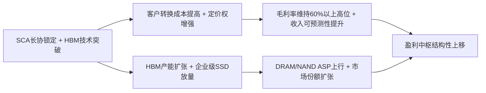

<!-- 匹配到的证券/行业：美光科技(MU.O) -->
操作成功

### 一页通 （美光科技 (MU.O)）
日期：2026-08-06
内容："""
## 公司概况

美光科技是全球三大存储芯片巨头之一，与三星电子、SK海力士共同占据全球DRAM市场约90%以上份额。公司采用垂直整合制造模式，产品矩阵涵盖DRAM、NAND闪存及NOR闪存，广泛应用于数据中心、移动终端、汽车电子及工业等领域。在AI驱动的新一轮需求周期中，公司凭借HBM（高带宽内存）产品的技术突破和规模化量产，正从传统的“容量供应商”向“算力存储解决方案领导者”转型。   

## 公司近况跟踪

- <strong>战略客户协议密集落地</strong>：截至FY26Q3末，公司已签署<strong>16份</strong>战略客户协议，覆盖数据中心、消费电子及汽车三大终端市场，协议期限以<strong>5年</strong>为主。这些协议采用take-or-pay机制，并引入价格上下限设计，上限对应CY26Q2市场价格水平，下限对应毛利率仍高于公司历史周期峰值。其中14份协议按最低价测算，对应保底合同收入约<strong>1000亿美元</strong>，并带来约<strong>220亿美元</strong>客户预付款及相关财务承诺，其中现金约<strong>180亿美元</strong>。公司预计全部目标SCA落地后，约<strong>50%以上</strong>收入将纳入长协框架。  

- <strong>HBM4量产推进超预期</strong>：公司HBM4已于FY26Q1量产出货，专为英伟达Vera Rubin平台设计，总带宽超<strong>2.8TB/s</strong>。截至FY26Q3末，HBM4累计收入已超<strong>10亿美元</strong>，产能爬坡和良率均优于市场预期。HBM4E（基于1γ DRAM工艺）开发中，预计<strong>2027年</strong>量产。公司重申HBM全球市场份额目标将与整体DRAM市场份额一致，对应约<strong>20%-25%</strong>。  

- <strong>资本开支大幅上调</strong>：公司上调FY26资本开支至<strong>270亿美元</strong>（此前指引约250亿美元），并指引FY27季度资本开支将高于FY26Q4水平（FY26Q4指引约100亿美元），隐含FY27全年资本开支超<strong>400亿美元</strong>。公司同时宣布计划在2035年前将对美国本土的投资总额提升至超过<strong>2500亿美元</strong>，目标是将美国产能占其DRAM总产量的比例提升至<strong>40%</strong>。     

- <strong>企业级SSD单季收入突破50亿美元</strong>：FY26Q3数据中心SSD收入超过<strong>50亿美元</strong>，环比翻倍以上，市场份额连续四年提升。公司PCIe Gen6规格的Micron 9650企业级SSD已率先量产，读取性能较Gen5翻倍，专为AI推理负载优化。  

- <strong>与福特、通用等车企签署长期协议</strong>：公司近期与福特汽车、通用汽车以及高通、现代摩比斯、哈曼等汽车零部件供应商签署了长期战略客户协议，锁定汽车AI内存芯片的长期供应。    

## 短期逻辑

1. <strong>FY26Q4业绩及FY27资本开支指引或持续超预期</strong>：公司FY26Q3业绩大幅超预期，FY26Q4指引营收<strong>500±10亿美元</strong>，Non-GAAP毛利率约<strong>86%</strong>，Non-GAAP EPS约<strong>31美元±1美元</strong>。考虑到公司已连续多个季度超预期，且当前DRAM/NAND价格仍在上行通道中，FY26Q4实际业绩大概率再次超预期。更重要的是，公司已明确FY27季度资本开支将高于FY26Q4的约100亿美元水平，隐含全年超400亿美元。这一激进的资本开支计划将直接推升市场对公司长期产能扩张和收入增长的预期。   

2. <strong>SCA细节持续披露或催化估值体系切换</strong>：公司已披露16份SCA的框架性条款，但市场对其定价机制、客户构成、取消条款等细节仍存在信息不对称。随着后续季报和投资者交流中更多细节浮出水面，市场对“SCA能否真正锁定中长期盈利中枢”的疑虑有望逐步消除。一旦市场确认SCA能有效将公司盈利模式由“周期驱动”切换为“订单驱动”，存储板块的估值方法将加速从周期股向成长股切换，这将是未来一个季度最核心的催化剂。   

3. <strong>12月资本回报启动或成重要催化剂</strong>：公司明确表示，在CHIPS Act协议两周年（2026年12月9日）后，将拥有完全的资本回报灵活性，并计划将<strong>100%的自由现金流</strong>通过分红和回购返还股东，且以回购为主。以当前市值和FY27自由现金流预期测算，回购规模可能达到市值的<strong>10%以上</strong>，这将成为股价的重要支撑。  

## 长期逻辑

1. <strong>SCA重塑商业模式，盈利中枢结构性上移</strong>：公司已签署的16份SCA覆盖约<strong>20%的DRAM出货量</strong>和<strong>1/3的NAND出货量</strong>，且全部目标SCA落地后约<strong>50%以上</strong>收入将纳入长协框架。SCA采用take-or-pay机制，并引入价格上下限设计，下限对应毛利率仍高于公司历史周期峰值（对应低60%毛利率区间）。这意味着即使在行业下行周期中，公司也有望维持远高于历史均值的盈利能力。这一结构性变化将从根本上改变公司“周期股”的属性，使其盈利可预测性大幅提升，进而支撑估值中枢的系统性上移。   

2. <strong>Agentic AI驱动存储需求结构性增长</strong>：随着AI从训练走向推理，Agentic AI架构对存储系统提出全新要求。单个Agentic查询可同时调用<strong>4-5个</strong>并行Agent，每个Agent执行独立的CPU任务并持续与GPU/ASIC加速器交互，从而对CPU周期、DRAM容量、GPU时间、HBM带宽和SSD存储产生乘数级需求增长。KV Cache的指数级膨胀（上下文长度从数千扩展至百万量级）正推动DRAM容量和NAND存储需求同步扩张。公司预计HBM TAM突破<strong>1000亿美元</strong>的时点已从2028年提前至<strong>2027年</strong>，且供需紧张格局将延续至<strong>2027年之后</strong>。   

3. <strong>美国本土制造龙头的战略溢价</strong>：公司计划在2035年前对美国本土投资超<strong>2500亿美元</strong>，目标是将美国DRAM产能占比提升至<strong>40%</strong>。在《芯片与科学法案》提供约<strong>64亿美元</strong>补贴及<strong>35%</strong>投资税收抵免的支持下，公司正成为继英特尔之后美国先进制造的新标杆。这一战略定位不仅有助于分散地缘风险、稳定供应链，更可能使公司在中长期获得政策溢价和本土客户偏好。      

## 风险提示

- <strong>存储行业周期再现风险</strong>：尽管SCA提供了下行保护，但SCA仅覆盖约50%的收入，剩余部分仍暴露于现货价格波动。若AI算力投资增速边际放缓，叠加三大原厂新增产能集中释放，非SCA部分的收入和利润仍可能面临较大压力。历史上存储行业每一轮上行末期都伴随供给方扩产纪律的瓦解，这一规律是否被彻底打破仍需时间验证。   

- <strong>竞争格局变化风险</strong>：SK海力士已完成美股IPO，募资<strong>265亿美元</strong>，资本实力进一步增强。三星电子以<strong>39%</strong>的DRAM市场份额重返全球第一，且正加速HBM产能扩张。此外，中国长鑫存储（CXMT）正加速产能释放，预计2026年底月产能将达到<strong>35万片</strong>，虽然目前在HBM领域仍落后，但在中低端DRAM市场可能形成价格压力。   

- <strong>SCA执行与客户履约风险</strong>：SCA虽为take-or-pay结构，但在极端行业下行周期中，客户可能寻求重新谈判条款或利用合同漏洞减少履约义务。此外，约<strong>220亿美元</strong>的客户预付款将在合同后期返还，届时可能对公司现金流产生一次性影响。   

## 近期要闻

- <strong>2026年6月24日</strong>：公司发布FY26Q3财报，营收<strong>414.56亿美元</strong>（同比+346%，环比+74%），Non-GAAP毛利率<strong>84.9%</strong>（环比+9.4pct），Non-GAAP EPS <strong>25.11美元</strong>，均大幅超市场预期。公司同时披露已签署16份SCA，并指引FY26Q4营收500±10亿美元，毛利率约86%。   

- <strong>2026年7月6日</strong>：公司宣布与福特汽车签署长期战略客户协议，这是继7月1日与通用汽车签署类似协议后的又一汽车领域SCA。同月，公司还宣布与高通、现代摩比斯、哈曼等汽车零部件供应商签署SCA。    

- <strong>2026年7月9日</strong>：公司宣布将美国本土投资计划从2000亿美元上调至<strong>2500亿美元</strong>以上，目标是将美国DRAM产能占比提升至40%。纽约州克莱工厂完成首次混凝土浇筑，比原计划提前超一个季度。     

- <strong>2026年7月30日-31日</strong>：三星电子和SK海力士先后发布财报，确认存储芯片短缺将持续至2027年，且客户正签署多年期合同以锁定供应。三星股价单日上涨<strong>27%</strong>，SK海力士触及<strong>30%</strong>涨幅上限。但美光股价在随后交易日下跌<strong>5.9%</strong>，反映美国市场对存储周期持续性的分歧。  

## 未来催化

- <strong>2026年9月下旬</strong>：公司预计发布FY26Q4财报。考虑到当前DRAM/NAND价格仍在上行通道中，且公司已连续多个季度超预期，FY26Q4实际业绩大概率再次超预期。同时，市场将高度关注SCA进展更新及FY27资本开支的具体指引。   

- <strong>2026年12月9日</strong>：CHIPS Act协议两周年，公司将拥有完全的资本回报灵活性。公司已明确计划将100%的自由现金流通过分红和回购返还股东，且以回购为主。这一时间节点可能成为公司启动大规模回购的催化剂。  

- <strong>2026年下半年至2027年初</strong>：HBM4产能爬坡进展、HBM4E（基于1γ DRAM工艺）的客户认证和量产进度，以及英伟达Vera Rubin平台的放量节奏，将成为影响公司HBM市场份额和盈利能力的关键变量。  

## 公司业务模式及拆分

<strong>业务边际变化</strong>：公司正经历从“周期驱动的商品化存储供应商”向“长协锁定的AI存储解决方案龙头”的战略转型。核心变化包括：1）SCA覆盖度快速提升，约50%以上收入将纳入长协框架，盈利可预测性大幅增强；2）HBM业务从FY25的约<strong>55亿美元</strong>爆发式增长，预计FY26将超<strong>140亿美元</strong>，成为最重要的增长引擎；3）企业级SSD单季收入突破<strong>50亿美元</strong>，NAND业务正从消费级向高毛利企业级市场结构性转型；4）公司已退出Crucial消费品牌业务，进一步将资源集中于高利润企业级和数据中心客户。   

<strong>盈利模式</strong>：公司依靠<strong>技术壁垒</strong>和<strong>规模制造能力</strong>盈利。在DRAM领域，公司凭借1β、1γ等先进制程节点和HBM的3D堆叠封装技术，在AI存储赛道构建了较强的技术护城河。在NAND领域，公司通过232层/276层3D NAND技术和QLC架构降低单位成本。SCA的引入正在将公司的盈利模式从“赚取周期波动的价格差价”升级为“赚取长期订单的技术溢价和规模成本优势”。   

<strong>业务结构概览</strong>：公司自FY25Q4起按终端市场重组业务单元，分为四大板块。FY26Q3，<strong>CMBU</strong>（云存储，含HBM）和<strong>CDBU</strong>（核心数据中心）合计收入占比约<strong>61%</strong>，是公司最重要的收入和利润来源。<strong>MCBU</strong>（移动与客户端）占比约<strong>28%</strong>，<strong>AEBU</strong>（汽车与嵌入式）占比约<strong>11%</strong>。公司当前处于<strong>产能爬坡期</strong>与<strong>价格上行期</strong>叠加的超级景气周期，HBM和高端DRAM/NAND的供需紧张格局预计延续至2027年之后。  

<strong>细分业务拆分</strong>（按技术，单位：亿美元）

| 业务板块 | FY2023 | FY2024 | FY2025 | FY26Q1-Q3 |
|---|---|---|---|---|
| <strong>截止日期</strong> | 2023-08-31 | 2024-08-29 | 2025-08-28 | 2026-05-28 |
| DRAM收入 | 109.74 | 176.03 | 285.78 | 609.08 |
| DRAM同比 | -51.0% | +60.4% | +62.3% | +210.8% |
| DRAM收入占比 | 70.6% | 70.1% | 76.5% | 77.1% |
| NAND收入 | 42.06 | 72.27 | 85.03 | 176.83 |
| NAND同比 | -46.2% | +71.8% | +17.7% | +182.9% |
| NAND收入占比 | 27.1% | 28.8% | 22.7% | 22.4% |
| 其他（主要为NOR） | 3.60 | 2.81 | 2.97 | 3.68 |
| 总收入 | 155.40 | 251.11 | 373.78 | 789.59 |

*注：FY26Q1-Q3为前三季度累计数据（截至2026年5月28日），非单季度数据。*

<strong>DRAM业务</strong>（FY26Q3单季）：收入<strong>313.28亿美元</strong>，同比+343%，环比+67%。量价拆分：bit出货量环比增长<strong>低个位数百分比</strong>，ASP环比上涨<strong>low-60s%</strong>。增长主要受AI服务器对HBM及DDR5的强劲需求驱动。公司1γ DRAM节点正以创纪录速度达到成熟良率，预计2026年年中成为量产主力。HBM4已于FY26Q1量产出货，累计收入超10亿美元，产能爬坡快于预期。  

<strong>NAND业务</strong>（FY26Q3单季）：收入<strong>99.43亿美元</strong>，同比+361%，环比+99%。量价拆分：bit出货量环比增长<strong>mid-single-digit%</strong>，ASP环比上涨<strong>mid-80s%</strong>。增长主要受数据中心SSD需求爆发驱动，企业级SSD单季收入突破50亿美元。公司PCIe Gen6 SSD已率先量产，G9 NAND（276层）正加速放量。  

## 核心竞争力

<strong>竞争要素 1：依托SCA构建的客户粘性与盈利可预测性</strong>

- <strong>护城河定性</strong>：属于<strong>结构性护城河</strong>。SCA通过take-or-pay机制、价格上下限设计及客户预付款（约220亿美元），将公司与核心客户的利益深度绑定。客户一旦签署3-5年期协议并支付大额预付款，其转换成本极高，这为公司提供了远超传统存储周期的收入可预测性。   

- <strong>数据验证</strong>：16份SCA按最低价测算对应保底合同收入约<strong>1000亿美元</strong>，覆盖约20%的DRAM出货量和1/3的NAND出货量。公司预计全部目标SCA落地后约<strong>50%以上</strong>收入将纳入长协框架。管理层明确表示，SCA下限对应毛利率仍高于公司历史周期峰值（对应低60%毛利率区间），而公司历史峰值毛利率为FY22的<strong>45%</strong>和FY26Q3的<strong>84.9%</strong>。约<strong>180亿美元</strong>的客户现金预付款进一步验证了客户承诺的真实性。   

- <strong>动态演变</strong>：护城河正在<strong>变宽</strong>。公司正将SCA从数据中心客户扩展至汽车（福特、通用、高通、现代摩比斯等）和消费电子领域，覆盖的客户范围和收入占比持续扩大。随着SCA框架成为行业标准（三星、SK海力士也在推进类似LTA），存储行业的周期性波动有望结构性收敛。   

<strong>竞争要素 2：HBM领域的技术追赶与份额扩张</strong>

- <strong>护城河定性</strong>：属于<strong>行业阶段性红利</strong>，但正快速向<strong>结构性护城河</strong>演变。HBM的本质是通过3D堆叠和TSV技术实现超高带宽，其技术壁垒在于先进封装工艺和与客户GPU平台的深度适配。公司HBM3E已批量出货，HBM4率先量产并深度绑定英伟达Vera Rubin平台，HBM4E预计2027年量产，技术迭代节奏已与SK海力士基本同步。   

- <strong>数据验证</strong>：公司HBM4已于FY26Q1量产出货，累计收入超<strong>10亿美元</strong>，产能爬坡速度是HBM3E的<strong>2倍</strong>。公司目标HBM市场份额与整体DRAM份额一致（约<strong>20%-25%</strong>），而FY25其HBM市场份额估计约<strong>19%</strong>。HBM的trade ratio（DDR:HBM）预计将从HBM3E的<strong>3:1</strong>提升至HBM4E的<strong>4:1</strong>，这意味着HBM对晶圆产能的消耗将持续增加，从而结构性收紧整体DRAM供给。   

- <strong>动态演变</strong>：护城河正在<strong>变宽</strong>。公司正通过HBM4E（基于1γ节点）和HBM4 16层堆叠产品的研发，缩小与SK海力士的技术差距。但需注意，SK海力士在HBM市场仍占据约<strong>47%</strong>的份额（FY26E），且其与英伟达的绑定深度仍高于美光。三星HBM产能也在快速扩张，预计FY26份额将提升至<strong>35%</strong>。HBM领域的竞争格局仍存在不确定性。   

<strong>现阶段核心驱动力总结</strong>：公司的Alpha在于SCA驱动的盈利模式升级和HBM领域的技术追赶，Beta在于AI算力投资驱动的存储需求结构性增长。SCA为公司提供了下行保护，HBM和高端DRAM/NAND的供需紧张提供了上行弹性。   

## 产销链

<strong>客户情况</strong>：FY26Q1-Q3，公司<strong>单一客户</strong>收入占比分别为<strong>17%</strong>和<strong>13%</strong>（FY26Q1和前三季度累计），市场普遍认为该客户为英伟达。公司客户集中度较高，FY25前十大客户贡献约<strong>50%</strong>收入。SCA的签署正在改变客户结构，16份SCA覆盖数据中心、消费电子及汽车三大领域，客户预付款约<strong>220亿美元</strong>（其中现金约180亿美元），体现了核心客户对长期供应的强烈承诺。新客户方面，公司已与福特、通用、高通、现代摩比斯等汽车领域客户签署SCA，处于<strong>已进入供应商名录并锁定长期供应</strong>的阶段。  

<strong>供应商情况</strong>：公司主要原材料包括硅晶圆、化学品、光刻胶、气体、靶材等。公司已与环球晶圆签署<strong>10年期</strong>供应协议，并向其提供<strong>5亿美元</strong>战略融资，以锁定美国本土300mm硅晶圆产能。公司还与ASML签署多年期EUV设备采购协议，以支持1γ及后续节点的产能扩张。半导体制造设备交付周期已延长<strong>50%-100%</strong>，供应紧张可能制约短期产能扩张节奏。   

<strong>成本传导能力</strong>：公司采用IDM模式，固定成本（折旧）占比较高。FY26Q3折旧费用约<strong>23.64亿美元</strong>，占营收约<strong>5.7%</strong>。在价格上行周期，由于成本相对固定，价格涨幅几乎全部转化为利润（FY26Q3毛利率84.9%，环比+9.4pct）。在价格下行周期，公司可通过技术升级（如1γ节点）降低单位成本，但若价格跌幅超过成本降幅，利润率将快速承压。SCA的价格下限设计为公司提供了下行保护。公司赚取的是<strong>技术溢价</strong>和<strong>规模制造优势</strong>，而非单纯的“周期资源钱”。  

## 财务数据

| 财务指标 | FY2023 | FY2024 | FY2025 | FY26Q1-Q3 |
|---|---|---|---|---|
| <strong>截止日期</strong> | 2023-08-31 | 2024-08-29 | 2025-08-28 | 2026-05-28 |
| 营业总收入(亿美元) | 155.40 | 251.11 | 373.78 | 789.59 |
| 收入同比(%) | -49.48 | +61.59 | +48.85 | +202.95 |
| 营业成本(亿美元) | 169.56 | 194.98 | 225.05 | 185.02 |
| 毛利(亿美元) | -14.16 | 56.13 | 148.73 | 604.57 |
| 毛利率(%) | -9.1 | 22.4 | 39.8 | 76.6 |
| 营业利润(亿美元) | -54.50 | 10.54 | 98.70 | 556.32 |
| 营业利润率(%) | -35.1 | 4.2 | 26.4 | 70.5 |
| 归母净利润(亿美元) | -58.33 | 7.78 | 85.39 | 472.68 |
| 净利率(%) | -37.5 | 3.1 | 22.8 | 59.9 |
| 基本EPS(美元) | -5.34 | 0.70 | 7.65 | 41.97 |
| 稀释EPS(美元) | -5.34 | 0.70 | 7.59 | 41.40 |
| 经营现金流(亿美元) | 15.59 | 85.07 | 175.25 | 457.02 |
| 资本支出(亿美元) | 76.76 | 83.86 | 158.57 | 196.02 |
| 自由现金流(亿美元) | -61.17 | 1.21 | 16.68 | 261.00 |

*注：FY26Q1-Q3为前三季度累计数据（截至2026年5月28日），非单季度数据。自由现金流=经营现金流-资本支出。*

<strong>成长能力</strong>：公司FY26前三季度收入已达<strong>789.59亿美元</strong>，同比+203%，远超FY25全年水平。增长主要由ASP驱动而非出货量增长——FY26Q3 DRAM bit出货量环比仅增长低个位数百分比，但ASP环比上涨low-60s%。这反映了AI驱动的存储需求远超供给的行业格局。  

<strong>盈利能力</strong>：FY26前三季度毛利率<strong>76.6%</strong>，其中FY26Q3单季毛利率达<strong>84.9%</strong>，创历史新高。营业利润率从FY25的26.4%飙升至FY26前三季度的70.5%，体现了存储行业在超级上行周期中的极高经营杠杆。但需注意，这种盈利能力具有周期性，一旦价格回落，利润率可能快速收缩。  

<strong>运营能力</strong>：FY26Q3末存货为<strong>85.67亿美元</strong>，存货周转天数约<strong>122天</strong>，较FY25末的约140天有所下降，反映需求旺盛下库存消化加速。应收账款从FY25末的<strong>92.65亿美元</strong>飙升至FY26Q3末的<strong>310.25亿美元</strong>，主要因收入大幅增长及SCA客户账期安排。  

<strong>偿债能力与现金流</strong>：FY26Q3末公司净现金头寸为<strong>244.06亿美元</strong>（现金及投资301.28亿美元减去总债务57.22亿美元），较FY25末的净债务26.41亿美元大幅改善。公司于FY26上半年完成了约<strong>94亿美元</strong>的债务提前偿还，财务结构显著优化。FY26前三季度自由现金流为<strong>261亿美元</strong>，已远超FY25全年的16.68亿美元。  

## 行业及竞争分析

<strong>行业赛道</strong>：公司所处的存储芯片行业是半导体产业中规模最大的单一品类。据SIA数据，2026年3月存储芯片占全球半导体行业总销售额的<strong>50.6%</strong>，为历史首次突破50%。行业正经历由“传统周期波动”向“AI结构性驱动”的范式转移。AI训练和推理对HBM、DDR5及企业级SSD的需求呈指数级增长，而供给端受制于新建晶圆厂建设周期长（约3年）、HBM对晶圆消耗量是传统DRAM的<strong>3倍</strong>以上、以及节点迁移的bit增益递减，供需紧张格局预计延续至2027年之后。   

<strong>竞争格局</strong>：全球DRAM市场由三星（约<strong>39%</strong>份额）、SK海力士（约<strong>35%</strong>）和美光（约<strong>22%</strong>）三寡头垄断。HBM市场SK海力士领先（约<strong>47%</strong>份额），三星（约<strong>35%</strong>）和美光（约<strong>19%</strong>）正加速追赶。NAND市场格局相对分散，三星、铠侠/闪迪、SK海力士和美光为主要参与者。   

<strong>可比公司</strong>：

| 公司名称 | 股票代码 | FY26E PE | FY27E PE | 核心差异 |
|---|---|---|---|---|
| SK海力士 | 000660.KS | 7.7x | 5.3x | HBM市场份额领先，与英伟达绑定最深 |
| 三星电子 | 005930.KS | 6.8x | 4.9x | DRAM/NAND双龙头，HBM份额快速追赶 |
| 闪迪 | SNDK.O | 26.6x | 8.9x | 纯NAND/SSD标的，企业级SSD敞口高 |
| 美光科技 | MU.O | 13.3x | 6.4x | 唯一美国本土存储龙头，SCA驱动盈利确定性 |

*注：可比公司PE基于Bloomberg一致预期，数据截至2026年7月3日。美光PE基于国泰海通证券预测。*

美光相较于韩系竞争对手的核心差异在于：1）作为唯一美国本土存储龙头，享有《芯片法案》补贴和本土客户偏好；2）SCA推进速度最快，盈利可预测性最强；3）HBM市场份额虽落后但追赶势头强劲。相较于闪迪，美光拥有DRAM（尤其是HBM）的更高弹性。   

## 市场焦点议题

<strong>议题一：SCA能否真正锁定中长期盈利中枢？</strong>

- <strong>背景</strong>：公司已签署16份SCA，覆盖约20% DRAM和1/3 NAND出货量，并预计最终约50%以上收入将纳入长协。但市场对SCA的执行力、客户履约意愿以及价格下限的真实水平仍存疑虑。历史上存储行业从未有过如此大规模的长协安排，缺乏先例验证。   

- <strong>问题列表</strong>：1）SCA的价格下限对应毛利率“高于历史周期峰值”，但公司历史峰值毛利率为FY22的45%和当前84.9%，具体下限水平是多少？2）在极端行业下行周期中，客户是否可能寻求重新谈判或利用合同漏洞减少履约？3）约220亿美元客户预付款将在合同后期返还，届时是否会对公司现金流产生一次性冲击？

<strong>议题二：HBM竞争格局与公司份额能否持续提升？</strong>

- <strong>背景</strong>：公司HBM4已率先量产并深度绑定英伟达Vera Rubin平台，但SK海力士在HBM市场仍占据约47%份额，且其与英伟达的绑定深度仍高于美光。三星HBM产能也在快速扩张。市场关注公司能否在HBM4/HBM4E周期中实现份额的实质性突破。   

- <strong>问题列表</strong>：1）公司HBM4的产能爬坡速度和良率能否持续优于预期？2）HBM4E（基于1γ节点）预计2027年量产，能否通过英伟达等核心客户的认证并获取可观份额？3）SK海力士和三星的HBM扩产计划会否导致2027年后出现供过于求？

<strong>议题三：资本开支激增会否侵蚀自由现金流和股东回报？</strong>

- <strong>背景</strong>：公司FY26资本开支指引上调至270亿美元，FY27隐含超400亿美元。虽然SCA客户预付款（约180亿美元现金）可部分支撑资本开支，但大规模扩产仍将消耗大量现金流。市场关注资本开支的回报率和自由现金流的可持续性。   

- <strong>问题列表</strong>：1）FY27超400亿美元资本开支中，多少是用于HBM/先进DRAM的产能扩张，多少是用于基础设施建设？2）公司预计12月启动资本回报，但大规模资本开支会否限制回购规模？3）新建晶圆厂从投产到满产通常需要2年，期间折旧压力会否拖累利润率？

## 市场分歧探讨

<strong>核心分歧：存储行业是否已从“周期行业”转变为“成长行业”？</strong>

<strong>乐观方观点</strong>：本轮存储周期与以往有本质区别。需求端，AI训练和推理对HBM、DDR5及企业级SSD的需求呈指数级增长，且Agentic AI架构将推动存储需求从“训练侧一次性爆发”转向“推理侧持续性消耗”。供给端，HBM对晶圆消耗量是传统DRAM的3倍以上，且新建晶圆厂建设周期长达3年，供给弹性显著受限。更重要的是，SCA的引入为行业提供了历史上从未有过的盈利可预测性。乐观方认为，存储行业正从“周期股”向“成长股”估值范式切换，当前FY27约5-6x PE的估值远未反映其中长期盈利中枢的结构性上移。   

<strong>谨慎方观点</strong>：存储行业的周期性根深蒂固，历史上每一轮上行末期都伴随供给方扩产纪律的瓦解。当前三大原厂已宣布合计超万亿美元的扩产计划，虽然短期难以释放产能，但2028年后可能出现大规模产能集中投放。此外，SCA仅覆盖约50%的收入，剩余部分仍暴露于现货价格波动。一旦AI算力投资增速边际放缓，非SCA部分的收入和利润仍可能面临较大压力。谨慎方认为，当前股价已充分反映了乐观预期，而市场可能低估了2028年后行业下行周期的风险。   

<strong>综合分析</strong>：SCA的引入确实为存储行业提供了历史上从未有过的盈利可预测性，这是本轮周期与以往的本质区别。但需注意，SCA的覆盖度（约50%）和期限（5年为主）意味着公司仍无法完全摆脱周期属性。更合理的定位是：公司正从“强周期股”向“周期成长股”过渡，盈利中枢结构性上移，但并非完全消除周期性。当前FY27约6x PE的估值已为下行风险提供了一定安全边际，但若市场对2028年后盈利下滑的担忧加剧，估值可能进一步承压。   

## 盈利预测与估值

| 机构 | 评级 | 目标价(美元) | 财务指标 | FY2025A | FY2026E | FY2027E | FY2028E |
|---|---|---|---|---|---|---|---|
| 富国证券(2026-07-01) | 增持 | 1525 | 营收(亿美元) | 373.78 | 1302.18 | 2521.18 | 2598.74 |
| | | | EPS(美元) | 7.59 | 73.94 | 157.99 | 160.85 |
| 华泰证券(2026-06-29) | 买入 | 1800 | 营收(亿美元) | 373.78 | 1298.89 | 2444.08 | 3005.20 |
| | | | EPS(美元) | 8.40 | 75.95 | 153.48 | 186.69 |
| 国泰海通(2026-07-04) | 增持 | 1629 | 营收(亿美元) | 373.78 | 1292.44 | 2548.19 | 3101.35 |
| | | | EPS(美元) | - | 74.00 | 163.00 | 180.00 |
| 道明证券(2026-06-19) | 买入 | 1600 | 营收(亿美元) | 373.78 | 1289.87 | 2460.01 | - |
| | | | EPS(美元) | 8.29 | 73.09 | 155.30 | - |
| 瑞银(2026-06-13) | 买入 | 1625 | 营收(亿美元) | 373.78 | 1165.96 | 2432.93 | 2994.89 |
| | | | EPS(美元) | 8.29 | 63.74 | 151.27 | 187.88 |
| 花旗(2026-08-03) | 买入 | 1400 | 营收(亿美元) | 373.78 | - | - | - |
| | | | EPS(美元) | 7.43 | 72.15 | 137.69 | 151.81 |

*注：各机构预测口径可能不同，部分机构使用Non-GAAP EPS，部分使用GAAP EPS。目标价和评级截至各报告发布日期。*

<strong>盈利预测分析</strong>：主流券商对FY26-FY28的盈利预测存在一定分歧，FY27 EPS预测区间为<strong>137-163美元</strong>，FY28 EPS预测区间为<strong>152-188美元</strong>。乐观方（富国、华泰、国泰海通）预计FY27 EPS在<strong>155-163美元</strong>区间，且FY28仍有小幅增长；谨慎方（花旗）预计FY27 EPS约<strong>138美元</strong>，且FY28增速放缓至约10%。分歧的核心在于对2028年后存储价格走势和SCA盈利保护效果的判断。   

<strong>估值方法</strong>：由于公司处于超级景气周期，传统PE估值可能低估其盈利能力。多数券商采用<strong>FY27或FY28 PE</strong>作为主要估值锚，目标PE区间为<strong>8-12x</strong>。华泰证券给予FY27 <strong>11.7x PE</strong>，目标价1800美元；富国证券基于FY28 <strong>9.5x PE</strong>，目标价1525美元。部分券商（如瑞银）采用远期EPS折现法，将FY29E EPS以约12%的权益成本折现至FY28，再赋予15x PE。   

<strong>管理层指引</strong>：FY26Q4营收指引<strong>500±10亿美元</strong>，Non-GAAP毛利率约<strong>86%</strong>，Non-GAAP EPS约<strong>31美元±1美元</strong>。FY26全年资本开支指引<strong>270亿美元</strong>，FY27季度资本开支将高于FY26Q4水平（约100亿美元），隐含全年超<strong>400亿美元</strong>。公司预计DRAM和NAND供需紧张格局将延续至<strong>2027年之后</strong>，HBM TAM突破1000亿美元的时点已从2028年提前至<strong>2027年</strong>。
"""
