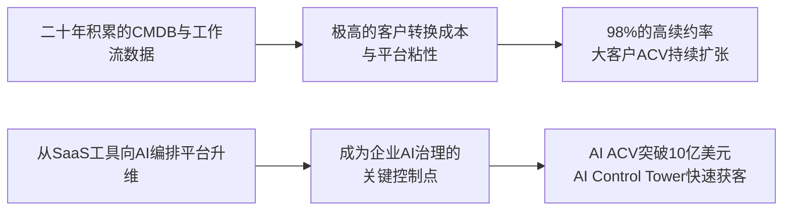

<!-- 匹配到的证券/行业：ServiceNow(NOW.N) -->
操作成功

### 一页通 （ServiceNow (NOW.N)）
日期：2026-08-06
内容："""
## 公司概况

ServiceNow 是一家全球领先的企业级AI平台公司，核心产品为基于云的 ServiceNow AI Platform。该平台通过单一数据模型和统一架构，帮助大型企业和政府机构打通跨部门的数字工作流，实现IT服务管理、客户服务、人力资源、安全风险等业务流程的自动化与智能化编排。公司定位为企业AI时代的“控制塔”与“编排层”，其平台不仅承载客户自身的数字化流程，更日益成为管理和治理企业内部成百上千个AI代理的核心中枢。目前，公司年收入规模已突破150亿美元，在全球企业软件市场中占据关键生态位。  

## 公司近况跟踪

- <strong>AI商业化取得里程碑式突破</strong>：2026年Q2，公司AI产品的年度合同价值（AI ACV）首次突破10亿美元大关，净新增AI ACV环比增长超40%。管理层明确表示，正稳步迈向2026年底AI ACV达到15亿美元的目标，并已提前达到2030年AI占ACV 30%的长期目标。  
- <strong>安全业务平台化整合加速</strong>：继收购领先的物联网安全公司Armis和身份安全公司Veza后，公司正将其与自研的AI Control Tower深度整合，构建覆盖网络风险、暴露管理、身份与访问安全的统一安全平台。管理层称，安全与风险业务已是年收入超10亿美元、在十大企业网络安全公司中增长最快的业务。  
- <strong>联邦政府业务需求强劲</strong>：Q2业绩超预期部分得益于美国联邦政府客户的强劲需求，部分原计划于Q3确认的本地部署（on-premise）收入提前至Q2确认，显示出公共部门数字化转型的迫切性。管理层表示政府业务“从未如此强劲”。  
- <strong>产品定价模式持续演进</strong>：公司推出新的AI原生SKU，升级到新SKU的客户实现了20%-30%的价格提升，而Pro Plus SKU的价格提升持续超过30%。同时，约50%的净新增业务已来自非席位（non-seat-based）定价模式，显示出向消费导向模式转型的进展。  
- <strong>大客户与平台粘性增强</strong>：年化合同价值（ACV）超过500万美元的大客户数量增至658家，同比增长约23%。前20大交易中有18笔包含8个或更多产品，表明客户正在ServiceNow平台上进行深度整合。整体续约率保持在98%的行业高位。  

## 短期逻辑

1.  <strong>AI Control Tower与安全业务的“交叉销售”兑现</strong>：未来一个季度，市场将密切关注ServiceNow新整合的安全产品组合能否转化为实际订单。公司在Q2已展示了AI Control Tower对安全与风险业务的“超级充电”效应，安全解决方案出现在16笔前20大交易中。随着企业对AI代理治理和日益扩大的攻击面（联网设备激增）的担忧加剧，ServiceNow作为能提供从“发现”到“行动”闭环的统一安全平台，其安全业务的订单增长有望成为短期股价催化剂。这一逻辑的核心在于，ServiceNow并非从零开始，而是在其现有庞大客户基础中激活安全需求，转化成本低、路径清晰。  

2.  <strong>Q3联邦政府业务季节性高峰的预期差</strong>：尽管Q2的部分强劲表现源于联邦政府收入的提前确认，但这恰恰印证了下游需求的旺盛。从历史规律看，Q3通常是美国联邦政府预算执行的旺季，ServiceNow的政府业务往往在该季度达到高峰。管理层在电话会上表示Q3的政府业务管线（pipeline）健康。当前市场对Q3的指引相对保守（订阅收入固定汇率增长20%），若政府业务如期放量，叠加商业市场AI需求的持续增长，公司Q3业绩有较大概率再次超出市场预期。  

3.  <strong>AI原生新产品的市场反馈与定价能力验证</strong>：公司即将正式发布一款无需工单的“对话式服务台”AI原生新产品，并计划在未来数周推出更多AI原生应用。这些新产品的市场接受度、特别是其带来的20%-30%的价格提升能否被客户广泛接受，将是验证ServiceNow在AI时代定价权的关键。若新产品获得积极市场反响，将有力反驳市场关于“AI将商品化软件”的悲观论调，并可能推动公司整体增长中枢上移。  

## 长期逻辑

1.  <strong>从“工作流记录系统”到“AI编排控制塔”的定位升维</strong>：ServiceNow的长期价值在于其正从企业内部的流程自动化工具，演变为管理和编排所有AI代理的“AI编排层”。随着企业部署成百上千个来自不同厂商的AI代理，对这些代理进行身份认证、权限管理、行为监控、成本核算和结果审计的需求将呈指数级增长。ServiceNow凭借其二十年积累的、横跨各业务部门的深厚工作流数据和CMDB（配置管理数据库），构成了竞争对手和通用大模型公司难以复制的“上下文护城河”。这一平台级卡位一旦确立，将使公司成为企业AI基础设施中不可或缺的一环，其市场空间（TAM）将从流程自动化市场扩展至整个AI治理与编排市场。   

2.  <strong>“平台效应”驱动的多业务协同增长</strong>：ServiceNow已不再是单一的ITSM（IT服务管理）厂商。其业务已成功扩展至CRM（年化ACV达20亿美元）、安全（年收入超10亿美元）、数据与分析（RaptorDB Pro交易量同比增长80%）以及HR等多个领域。这些新业务并非孤立发展，而是得益于统一平台的协同效应——客户在IT部门使用ServiceNow后，更容易将同一平台扩展至客户服务、人力资源和安全部门。这种“一次登陆，多部门扩张”的平台销售模式，不仅降低了获客成本，也显著提升了客户单客价值（ACV超2000万美元的客户数持续增加），为未来1-3年的持续高增长提供了多引擎驱动力。   

3.  <strong>混合定价模式打开收入天花板</strong>：公司正从传统的纯席位（per-seat）定价，成功过渡到“席位+消费”的混合定价模式。目前已有约50%的净新业务来自非席位模式。这一转变具有战略意义：在AI提升效率、可能减少企业员工数量的背景下，纯席位模式存在收入通缩风险。而基于AI消费量（如Assists使用次数）和解决方案价值的定价模式，使ServiceNow的收入与客户获得的实际价值和AI使用量直接挂钩，理论上收入天花板远高于受限于人头数的传统SaaS模式。随着AI代理在生产环境中部署量9个月内增长9倍，消费量驱动的收入将成为长期增长的重要引擎。  

## 风险提示

- <strong>AI颠覆传统SaaS模式的风险</strong>：市场持续担忧，具备自主执行任务能力的AI代理（如OpenAI的Presence）将直接取代传统软件，压缩ServiceNow等公司的市场空间。尽管公司正积极转型为AI编排平台，但如果客户倾向于使用基础模型公司提供的原生AI工具来替代ServiceNow的核心工作流，或AI导致企业IT预算被大幅压缩，公司的增长前景将面临严峻挑战。  
- <strong>大规模并购整合与财务拖累风险</strong>：公司在过去一年内连续收购了Moveworks、Veza和Armis，导致资产负债表从净现金转为净负债，商誉及无形资产激增。Q2的GAAP订阅毛利率因收购会计处理（无形资产摊销）同比下降了约650个基点。若被收购业务增长放缓、整合不及预期，或产生商誉减值，将对公司财务报表和市场信心造成双重打击。此外，管理层虽承诺到2026年底将员工总数恢复至收购前水平，但执行存在不确定性。  
- <strong>毛利率持续承压的风险</strong>：由于更多客户选择在超大规模云服务商（Hyperscaler）上部署和使用AI功能，公司的订阅毛利率指引已下调至81%。尽管管理层认为这是短期现象，并预计随着规模扩大和AI推理成本下降，毛利率压力将缓解，但如果AI消费量的增长持续快于成本优化速度，或公司无法将新增成本有效转嫁给客户，公司的盈利能力将受到结构性压制。  

## 近期要闻

- <strong>2026年5月</strong>：公司在年度Knowledge大会上发布新的AI原生SKU和产品分层策略，并推出20个AI Specialist（AI专家），覆盖IT、HR、安全等场景，可端到端完成任务。同时，公司举办了金融分析师日，公布了2030年实现300亿美元以上订阅收入、运营“60法则”（营收增长率+自由现金流利润率>60%）的长期目标。  
- <strong>2026年7月22日</strong>：公司公布2026年Q2业绩，订阅收入、cRPO及营业利润率均超出指引上限。AI ACV突破10亿美元成为最大亮点。但由于市场对OpenAI发布企业级AI代理产品Presence的担忧，以及Q3指引相对保守，股价在业绩发布后次日收跌。  

## 未来催化

- <strong>2026年8月-9月</strong>：公司计划正式发布一款无需工单的“对话式服务台”AI原生新产品，并将在未来数周内推出更多全新的AI原生应用。新产品的市场初步反馈和早期客户采用情况将是验证公司AI战略的关键节点。 
- <strong>2026年9月-10月（Q3业绩期）</strong>：Q3是美国联邦政府业务的传统旺季。鉴于Q2已显示出强劲的政府需求，Q3的联邦政府订单表现将成为验证公共部门数字化转型持续性的重要窗口。若政府业务超预期，将有力支撑全年业绩。  
- <strong>2026年下半年</strong>：Armis、Veza与ServiceNow现有安全及AI控制塔产品的整合进展，以及是否能如管理层所言，在2026年底实现员工总数与收购前持平，从而驱动运营利润率提升，将是市场关注的重点。  

## 公司业务模式及拆分

<strong>业务边际变化</strong>：近年来，ServiceNow的业务重心正从传统的IT工作流自动化，全面转向“AI驱动的平台化整合”。公司不再仅仅是一个SaaS工具集合，而是通过自研和收购（Moveworks、Veza、Armis），将自己重塑为企业的“AI编排层”和“安全控制塔”。这一转变体现在产品上，是从单一的Now Assist生成式AI功能，发展到具备端到端任务执行能力的AI Specialist（AI专家），再到管理所有AI代理的AI Control Tower。业务边界也从ITSM大幅扩展至CRM、安全和数据平台。   

<strong>盈利模式</strong>：公司的盈利模式正从纯粹的订阅席位费，向“基础订阅+AI消费”的混合模式演进。传统上，公司按用户席位收取年度订阅费。现在，随着AI功能的深度嵌入，公司在保留可预测的席位费基础上，增加了基于AI使用量（Assists）的消费收入，以及因客户升级到更高阶AI SKU带来的20%-30%的价格提升。这种模式兼具了基础收入的稳定性和AI创新带来的增量弹性。  

<strong>业务拆分</strong>：
公司营收主要分为订阅收入（Subscription）和专业服务及其他收入（Professional services and other）。订阅收入是绝对核心，占比超过97%。公司内部将产品划分为四大工作流领域：Technology（技术）、CRM and Industry（客户关系管理与行业）、Core Business（核心业务）、Creator and Other（创建者及其他），但未在财报中按此拆分收入。公司正处在由AI驱动的“业绩加速兑现期”，AI相关产品的ACV增长迅猛，正成为驱动整体增长的新引擎。  

<strong>细分业务拆分</strong>

| 业务板块 (百万美元) | FY2023 | FY2024 | FY2025 | FY2026 H1 |
| :--- | :--- | :--- | :--- | :--- |
| <strong>订阅收入</strong> | 8,680.00 | 10,646.00 | 12,883.00 | 7,548.00 |
| 同比 (%) | 23.82% | 22.44% | 20.88% | 23.07% |
| 占总收入比 (%) | 96.8% | 96.9% | 97.0% | 97.3% |
| <strong>专业服务及其他收入</strong> | 291.00 | 338.00 | 395.00 | 209.00 |
| 同比 (%) | - | 16.15% | 16.86% | 12.97% |
| 占总收入比 (%) | 3.2% | 3.1% | 3.0% | 2.7% |
| <strong>总收入</strong> | <strong>8,971.00</strong> | <strong>10,984.00</strong> | <strong>13,278.00</strong> | <strong>7,757.00</strong> |

*注：毛利率数据未在本次提供的资料中按此业务维度详细拆分。*

<strong>订阅业务</strong>：作为公司的核心收入来源，订阅业务在FY2026 H1实现收入75.48亿美元，同比增长23.07%，显示出强劲的增长韧性。增长主要得益于新客户的获取和现有客户的扩张。Q2单季订阅收入达38.77亿美元，同比增长24.5%（固定汇率23%），超出指引上限。增长动力来自强劲的净新增ACV和美国联邦政府需求的提前释放。AI产品的渗透是驱动客户扩张和升级的关键因素，Pro Plus和新的AI原生SKU带来了显著的价格提升。  

<strong>专业服务及其他业务</strong>：该业务FY2026 H1收入为2.09亿美元，同比增长12.97%，增速慢于订阅业务，占总收入比重进一步下降至2.7%。该业务主要包括实施、配置和培训服务，公司持续依赖合作伙伴生态来交付大部分服务，自身服务团队则聚焦于战略客户和高价值项目。其毛利率通常为负或微利，因其战略定位是推动产品采用而非盈利中心。  

## 核心竞争力

<strong>竞争要素 1：依托极高转换成本与深厚数据积累构筑的平台粘性</strong>

-   <strong>护城河定性</strong>：构成了<strong>结构性护城河</strong>。ServiceNow的平台已深度嵌入全球大型企业的核心运营流程中，承载着IT、HR、CRM等关键业务。其CMDB（配置管理数据库）经过二十年积累，存储了海量的企业IT资产、业务服务及其相互依赖关系，构成了独特的“上下文数据”优势。替换ServiceNow意味着不仅要迁移软件，更要重建整个数字业务图谱和自动化流程，转换成本和业务中断风险极高。   
-   <strong>数据验证</strong>：公司整体续约率持续保持在<strong>98%</strong>的行业顶尖水平，这是高转换成本最直接的财务证据。此外，ACV超过500万美元的大客户数同比增长<strong>23%</strong>至658家，前20大交易中<strong>90%</strong>（18笔）包含8个或以上产品，表明客户不仅不流失，反而在持续扩大消费和加深平台依赖。  
-   <strong>动态演变</strong>：护城河正在<strong>变宽</strong>。随着AI代理时代的到来，企业需要一个“记录系统”来管理和治理所有AI代理。ServiceNow凭借其已有的CMDB和工作流数据，天然适合担任这一角色。其推出的AI Control Tower进一步巩固了这一地位，将管理范围从传统IT资产扩展到AI代理，使客户对其依赖度从“流程自动化”升级为“AI治理中枢”，替换难度呈指数级上升。  

<strong>竞争要素 2：从“单点工具”到“AI编排平台”的生态卡位优势</strong>

-   <strong>护城河定性</strong>：构成了<strong>结构性护城河</strong>。ServiceNow正从一个SaaS工具集合，演变为一个连接、管理和编排企业所有其他系统（包括第三方AI代理）的中央平台。其价值主张从“提高某一部门效率”升维为“确保整个企业AI战略的治理、安全与ROI”。这种“平台的平台”的定位，使其成为企业AI基础设施中的关键控制点。  
-   <strong>数据验证</strong>：AI ACV突破<strong>10亿美元</strong>，且净新增AI ACV环比增长超<strong>40%</strong>，表明客户愿意为这个平台化战略支付高额溢价。AI Control Tower在推出六个月内就获得超过<strong>500家</strong>客户，证明了市场对这一“AI治理中枢”定位的迫切需求。与微软、英伟达、Anthropic等公司的战略合作，也表明其作为中立编排层的地位正获得更广泛生态的认可。  
-   <strong>动态演变</strong>：护城河正在<strong>变宽</strong>。通过收购Armis和Veza，公司迅速补强了在OT/IoT安全和身份治理领域的能力，使其AI控制塔的覆盖范围从软件代理扩展到物理设备和所有身份（人类及非人类）。这种“连接一切、治理一切、自动化一切”的平台愿景，一旦实现，将形成强大的网络效应和生态锁定。  

<strong>现阶段核心驱动力总结</strong>：ServiceNow的Alpha来源于其从传统SaaS向AI PaaS的成功转型，这体现在AI ACV的爆发式增长和平台化战略的快速落地。其Beta则在于，作为企业软件巨头，其业绩仍与全球大型企业的IT支出景气度相关，但AI驱动的数字化转型浪潮为其提供了超越宏观周期的结构性需求。  

## 产销链

- <strong>客户情况</strong>：公司拥有超过8,700家客户，覆盖各行各业，客户基础呈现多元化。但存在单一客户高度集中的情况，一个美国联邦渠道合作伙伴和系统集成商，在FY2026 H1贡献了总收入的<strong>13%</strong>，占应收账款的比例为<strong>12%</strong>。该客户集中度较高，虽历史回款无虞，但需关注其预算变化或合同续约风险。新客户方面，公司正通过AI原生SKU和产品主导的增长模式，积极拓展财富50万强企业，并已观察到首次购买ServiceNow Agentic AI的客户交易量同比增长超45%。  
- <strong>供应商情况</strong>：公司的主要成本来自数据中心、云服务和IT设备。公司正越来越多地采用超大规模云服务商（Hyperscaler）的基础设施，这导致了短期毛利率压力，但管理层认为随着规模扩大，单位成本将下降。公司与一家IT设备供应商签订了不可撤销的采购协议，截至2026年Q2，剩余支付义务约<strong>14亿美元</strong>，需在FY2028年前支付。此外，与多家云服务商的协议剩余支付义务高达数十亿美元，显示出公司对未来基础设施需求的强劲预期。  
- <strong>成本传导能力</strong>：当上游云服务或AI推理成本上升时，公司短期内自身消化了部分成本，导致订阅毛利率承压（Non-GAAP订阅毛利率同比下降约250个基点）。但公司具备一定的成本转嫁能力，其定价模式正从纯席位费转向“席位+消费”的混合模式，并通过对高阶AI产品收取20%-30%的溢价来覆盖新增成本。长期来看，公司赚取的是“AI编排与治理”的平台价值钱，而非单纯的“软件加工费”，这为其维持高毛利率提供了支撑。  

## 财务数据

<strong>关键财务数据</strong>

| 项目 (百万美元) | FY2023 | FY2024 | FY2025 | FY2026 H1 |
| :--- | :--- | :--- | :--- | :--- |
| <strong>截止日期</strong> | 2023-12-31 | 2024-12-31 | 2025-12-31 | 2026-06-30 |
| <strong>营业总收入</strong> | 8,971.00 | 10,984.00 | 13,278.00 | 7,757.00 |
| 同比 (%) | 23.82% | 22.44% | 20.88% | 23.07% |
| <strong>营业成本</strong> | 1,921.00 | 2,287.00 | 2,983.00 | 2,109.00 |
| <strong>毛利润</strong> | 7,050.00 | 8,697.00 | 10,295.00 | 5,648.00 |
| 毛利率 (%) | 78.59% | 79.18% | 77.53% | 72.81% |
| <strong>营业利润</strong> | 762.00 | 1,364.00 | 1,824.00 | 665.00 |
| 营业利润率 (%) | 8.49% | 12.42% | 13.74% | 8.57% |
| <strong>归母净利润</strong> | 1,731.00 | 1,425.00 | 1,748.00 | 767.00 |
| 归母净利率 (%) | 19.30% | 12.97% | 13.16% | 9.89% |
| <strong>稀释每股收益 (美元)</strong> | 1.68 | 1.37 | 1.67 | 0.74 |
| <strong>经营活动现金流净额</strong> | 3,398.00 | 4,267.00 | 5,444.00 | 2,257.00 |
| <strong>资本性支出</strong> | -694.00 | -852.00 | -868.00 | -255.00 |
| <strong>自由现金流</strong> | 2,704.00 | 3,415.00 | 4,576.00 | 2,002.00 |

<strong>财务分析</strong>：

- <strong>成长能力</strong>：公司营收在巨大体量下仍保持超20%的强劲增长，FY2026 H1增速甚至回升至23.07%，显示出AI产品对增长的拉动作用。订阅收入作为核心驱动力，增长稳健。RPO（剩余履约义务）在Q2末达到<strong>290亿美元</strong>，同比增长22%（固定汇率），为未来收入提供了极高的可见性。  
- <strong>盈利能力</strong>：GAAP毛利率在FY2026 H1出现明显下滑，从FY2025的77.53%降至72.81%，主要受两大因素影响：一是收购Armis和Veza带来的无形资产摊销增加（非现金支出），二是AI和云服务使用量增加导致的成本上升。Non-GAAP口径下，毛利率同样承压，但营业利润率在收入超预期和费用管控下保持稳健。公司预计随着规模效应和AI推理成本优化，毛利率压力将逐步缓解。  
- <strong>现金流与资本配置</strong>：公司是典型的“现金牛”企业，经营活动现金流强劲，FY2025自由现金流达到45.76亿美元。然而，FY2026 H1自由现金流为20.02亿美元，同比有所下降，主要原因是公司为收购Armis和Veza进行了大规模债务融资，导致利息支出增加，同时持续进行激进的股票回购（H1花费22.25亿美元）。公司资产负债表从净现金状态转为净负债状态，但经营现金流足以覆盖利息和投资需求。  

## 行业及竞争分析

ServiceNow所处的核心赛道是<strong>企业级AI平台与自动化</strong>市场，这是一个由AI驱动的、快速扩张的领域。公司并非在单一软件类别中竞争，而是横跨ITSM、CRM、安全、HR、数据分析等多个市场，其独特的平台定位使其与传统SaaS厂商和新兴AI公司既竞争又合作。  

- <strong>行业趋势</strong>：企业正从“购买SaaS工具”转向“构建AI驱动的自动化平台”。这要求一个能够连接数据、编排工作流、治理AI代理的中央神经系统。ServiceNow正是这一趋势的主要受益者和推动者。其TAM（可寻址市场）因其平台化战略而大幅扩张，管理层预计到2030年订阅收入可达300亿美元以上。  
- <strong>竞争格局</strong>：竞争来自多个维度。与<strong>微软、Salesforce、ServiceNow</strong>等传统软件巨头在CRM、ITSM、低代码等领域存在竞争。同时，与<strong>OpenAI、Anthropic</strong>等基础模型公司也存在潜在的竞争关系，因为这些公司正试图向上构建应用层和代理编排能力。然而，ServiceNow的差异化优势在于其中立性和深厚的企业上下文数据，使其更适合作为连接和治理所有AI代理（无论来自哪个厂商）的中央平台。  

<strong>可比公司分析</strong>

| 可比公司 | 股票代码 | 对标维度 | 分析 |
| :--- | :--- | :--- | :--- |
| Salesforce | CRM | CRM工作流、AI代理 | 两者均在CRM和AI代理领域竞争。Salesforce优势在于销售云和营销云，ServiceNow则从客户服务和现场服务切入，强调跨部门流程编排。ServiceNow的CRM业务ACV已达20亿美元，增长迅速，但其规模仍远小于Salesforce。 |
| Microsoft | MSFT | IT服务管理、AI平台、安全 | 在ITSM和低代码领域与ServiceNow竞争，其Azure云和Copilot AI是强大的底层设施。但ServiceNow的AI Control Tower定位为跨平台治理，与微软是竞合关系，双方已宣布在AI代理治理方面进行集成合作。 |
| Palo Alto Networks | PANW | 网络安全 | ServiceNow通过收购Armis和Veza强势进入安全领域，其安全业务年收入已超10亿美元。与Palo Alto等传统安全厂商相比，ServiceNow的差异化在于将安全响应与IT/业务工作流深度集成，实现从“发现威胁”到“自动修复”的闭环。 |

<strong>总结分析</strong>：ServiceNow的竞争壁垒在于其“平台中立性”和“上下文数据”的结合。它不与任何单一厂商在单点功能上死磕，而是通过成为连接所有系统的“编排层”来创造独特价值。在AI代理泛滥的未来，这种“瑞士军刀”式的平台定位，可能比任何单点工具都更具战略价值。  

## 市场焦点议题

- <strong>议题一：AI对传统SaaS商业模式的颠覆风险</strong>
    - <strong>背景</strong>：市场持续担忧，以OpenAI的Presence为代表的通用AI代理将直接取代ServiceNow等传统软件，导致“软件消亡”。这种担忧是公司股价今年大幅回调的主要原因之一。  
    - <strong>问题列表</strong>：
        1.  ServiceNow的AI ACV增长中，有多少是来自新增预算，有多少是替代了其传统SaaS产品的预算？
        2.  随着AI代理能力增强，企业是否会减少对ServiceNow传统ITSM和CRM产品的席位订阅，从而影响其核心收入？
        3.  面对基础模型公司的向上整合，ServiceNow的“编排层”战略能否构成足够深的护城河？

- <strong>议题二：大规模并购整合的执行力与财务影响</strong>
    - <strong>背景</strong>：公司在半年内连续完成对Moveworks、Veza和Armis三笔重大收购，总耗资近百亿美元，使资产负债表从净现金转为净负债，并带来了巨大的无形资产摊销压力。  
    - <strong>问题列表</strong>：
        1.  公司能否在2026年底前实现员工总数与收购前持平的目标，从而兑现运营杠杆承诺？
        2.  Armis和Veza的整合进展如何？其收入增速和协同效应能否达到预期，以证明高昂收购价格的合理性？
        3.  巨额商誉（98.37亿美元）和无形资产在未来是否存在减值风险？

- <strong>议题三：毛利率的短期压力与长期趋势</strong>
    - <strong>背景</strong>：Q2的GAAP订阅毛利率因收购摊销同比下降650个基点，Non-GAAP口径也因AI和云服务成本而承压。公司下调了全年毛利率指引。  
    - <strong>问题列表</strong>：
        1.  随着AI消费量指数级增长，相关的云基础设施和推理成本是否会持续侵蚀毛利率？
        2.  公司通过提价和混合定价模式转嫁成本的能力有多强？能否在中期内使毛利率重回上升通道？
        3.  管理层提出的“毛利率80%为合理底线”的判断是否过于乐观？

## 市场分歧探讨

<strong>核心分歧点：ServiceNow是AI时代的“卖水人”还是被颠覆的“淘金者”？</strong>

市场对ServiceNow的定位存在根本性分歧，这直接决定了其估值逻辑。  

- <strong>看多方的逻辑：不可或缺的“AI控制塔”</strong>。看多方认为，ServiceNow正从SaaS工具转型为AI时代的核心基础设施。其逻辑支撑在于：1）<strong>上下文数据护城河</strong>：公司二十年积累的CMDB和工作流数据，是训练和运行企业级AI代理不可或缺的“燃料”，这是通用大模型公司不具备的独特资产。2）<strong>中立编排层定位</strong>：企业未来将使用来自不同厂商的成百上千个AI代理，需要一个中立平台进行统一治理、安全管控和ROI衡量。ServiceNow的AI Control Tower正是为此而生，其平台价值将随AI代理数量增加而指数级上升。3）<strong>定价权验证</strong>：AI原生SKU带来20%-30%的价格提升，且客户愿意买单，证明其提供的AI价值并非“商品化”，而是具有显著溢价能力。  

- <strong>谨慎方的逻辑：面临“上下夹击”的竞争风险</strong>。谨慎方认为，ServiceNow的护城河可能没有看起来那么深。其担忧在于：1）<strong>来自底层的颠覆</strong>：基础模型公司（如OpenAI）能力快速提升，可能直接构建原生AI应用来替代ServiceNow的核心工作流，使“编排层”的价值被架空。2）<strong>来自上层的竞争</strong>：像Microsoft这样的平台巨头，拥有从云基础设施到AI模型再到办公套件的完整栈，其Copilot生态可能对客户形成更强的捆绑效应，挤压ServiceNow作为独立平台的空间。3）<strong>财务数据的“噪音”</strong>：近期的高增长部分源于收购并表（Armis贡献约125个基点）和联邦政府收入的提前确认，其内生增长质量和可持续性仍有待时间检验。毛利率的持续下滑也可能预示着其商业模式的盈利能力正在发生结构性弱化。  

从中立视角看，ServiceNow的AI叙事正在从“概念”走向“现实”，AI ACV突破10亿美元和客户对AI原生SKU的接受是强有力的证据。然而，其面临的竞争格局确实比以往任何时候都更复杂。公司未来的关键在于，能否在基础模型公司和平台巨头之间，成功卡位并巩固其作为“独立、可信的AI治理中枢”的地位，并将这一战略优势持续转化为财务上的高质量增长。  

## 盈利预测与估值

<strong>管理层最新指引</strong>：
- <strong>FY2026全年</strong>：订阅收入指引上调至<strong>157.60亿-157.80亿美元</strong>，按固定汇率同比增长约<strong>21%</strong>（包含Armis约125个基点的贡献）。预计Non-GAAP营业利润率为<strong>31.5%</strong>，自由现金流利润率为<strong>35%</strong>。  
- <strong>FY2026 Q3</strong>：预计订阅收入为<strong>39.75亿-39.80亿美元</strong>，按固定汇率同比增长约<strong>20%</strong>。预计cRPO按固定汇率同比增长<strong>20%</strong>。  

<strong>券商盈利预测与估值</strong>

| 机构 | 评级 | 目标价(美元) | 财务指标 | FY2025A | FY2026E | FY2027E | FY2028E |
| :--- | :--- | :--- | :--- | :--- | :--- | :--- | :--- |
| 汇丰 (2026-07-24) | Buy | 179.00 | 营收(百万美元) | 13,278 | 16,444 | 20,340 | 25,120 |
| | | | Non-GAAP EPS(美元) | 3.51 | 4.23 | 5.32 | 6.85 |
| 摩根士丹利 (2026-07-27) | Overweight | 180.00 | 营收(百万美元) | - | 16,000 | - | - |
| | | | Non-GAAP EPS(美元) | 3.51 | 4.09 | 5.06 | 6.05 |
| 花旗 (2026-07-15) | Buy | 156.00 | 营收(百万美元) | 13,278 | 16,120 | 19,249 | 22,924 |
| | | | Non-GAAP EPS(美元) | 3.51 | 3.83 | 4.79 | 6.04 |
| 美银 (2026-07-28) | Buy | 130.00 | 营收(百万美元) | 13,278 | 16,209 | 19,213 | 22,767 |
| | | | Non-GAAP EPS(美元) | 3.50 | 4.17 | 5.04 | 6.09 |
| 德银 (2026-07-27) | Buy | 135.00 | FCF(百万美元) | - | 5,676 | 6,810 | - |
| 摩根大通 (2026-07-27) | Overweight | 150.00 | uFCF(百万美元) | - | - | 7,200 | - |

*注：各机构预测口径可能略有差异，此处摘录主要指标。*

机构间对ServiceNow普遍持积极看法，评级均为“买入”或“超配”。但在具体估值和盈利预测上存在一定分歧。目标价范围从130美元到180美元不等，反映了市场对AI带来的增长溢价和潜在风险的不同评估。多数机构采用现金流折现（DCF）或EV/FCF估值法，显示出对公司强劲自由现金流生成能力的认可。汇丰和摩根士丹利的目标价相对乐观，主要基于对AI驱动增长加速的更高预期。而花旗和美银的目标价相对保守，可能纳入了更多对毛利率压力和竞争风险的考量。
"""
