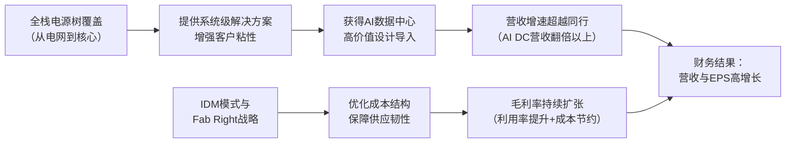

<!-- 匹配到的证券/行业：安森美半导体(ON.O) -->
操作成功

### 一页通 （安森美半导体 (ON.O)）
日期：2026-08-06
内容："""
## 公司概况
安森美半导体（onsemi）是一家全球领先的功率半导体与智能感知解决方案供应商，核心业务聚焦于为汽车、工业及AI数据中心等市场提供<strong>智能电源（Intelligent Power）</strong> 与<strong>智能感知（Intelligent Sensing）</strong> 技术。公司通过其碳化硅（SiC）产品、电源管理IC及图像传感器，在汽车电气化、先进驾驶辅助系统（ADAS）及AI数据中心电源树等高增长领域占据关键卡位。公司采用IDM模式，拥有全球化的前端晶圆制造与后端封测网络，并正通过“Fab Right”战略持续优化其制造布局。 

## 公司近况跟踪
- <strong>AI数据中心业务指引大幅上修</strong>：公司已将2026年AI数据中心营收预期从“翻倍”上调至<strong>“翻倍以上”</strong>，预计该业务全年营收将显著超过5亿美元。其中，AI数据中心应用的SiC营收预计同比增长约<strong>60%</strong>。 *(2026年8月业绩会)*
- <strong>收购Synaptics，补强边缘AI计算能力</strong>：公司于2026年6月宣布以<strong>全股票交易</strong>收购Synaptics，企业价值约<strong>70亿美元</strong>，预计于<strong>2027年中</strong>完成。此举旨在整合Synaptics的AI原生计算平台（Astra）与无线连接技术，将公司能力从电源、感知、控制拓展至连接计算，构建完整的物理AI智能系统解决方案。 *(2026年6月并购电话会)*
- <strong>推进“Fab Right”战略，剥离非核心制造资产</strong>：公司宣布出售位于美国宾夕法尼亚州Mountain Top和菲律宾Tarlac的两座工厂，预计每年可节省约<strong>3500万美元</strong>成本，效益将从2027年开始显现，2028年完全实现。这标志着公司非核心业务退出计划已基本完成，累计退出年化营收约9亿美元。 *(2026年7月公告)*
- <strong>实施第二轮涨价以对冲成本压力</strong>：由于原材料和外部制造成本持续上升，公司正在实施<strong>第二轮涨价</strong>，预计效益将在未来几个季度显现。管理层预计2027年不会出现价格环境走软的情况。 *(2026年8月业绩会)*
- <strong>产能利用率与交期显著提升</strong>：Q2产能利用率从77%提升至<strong>83%</strong>，产品平均交期从约27周延长至约<strong>32周</strong>，book-to-bill比率连续多个季度显著高于1，部分客户已开始为2028年锁定供应。 *(2026年8月业绩会)*

## 短期逻辑
1.  <strong>AI数据中心业务指引上修带来的业绩与估值双击</strong>：公司Q2财报后将2026年AI数据中心营收指引从“翻倍”上调至“翻倍以上”，这是一个显著的边际变化。该业务在2025年营收约2.5亿美元，若2026年实现翻倍以上增长，其营收占比将从约4%提升至约8%以上。考虑到该业务的高成长性和较高的毛利率，其加速增长有望显著提升公司整体营收增速和盈利能力，触发市场对公司进行价值重估。9月16日的分析师日可能公布更详细的AI数据中心业务展望和长期财务模型，构成短期催化剂。   

2.  <strong>毛利率持续扩张的确定性较高</strong>：公司Q2毛利率环比提升80个基点至39.3%，并指引Q3毛利率中值环比提升170个基点至41%。这一扩张趋势具备较高确定性，驱动力来自：1）产能利用率从Q1的77%提升至Q2的83%，且利用率每提升1个百分点将带来25-30个基点的毛利率改善，该效益通常滞后约两个季度体现，意味着Q4将充分受益；2）公司实施的第二轮涨价将逐步抵消成本压力；3）产品组合持续向高毛利的AI数据中心和Treo平台产品倾斜。毛利率的持续改善是短期内驱动盈利超预期和股价上涨的核心动力。    

3.  <strong>供给紧张格局下的议价权提升</strong>：公司产品交期已延长至32周，book-to-bill持续高于1，部分客户已开始为2028年锁定供应。这表明公司在特定高增长领域（如AI数据中心电源）已出现供不应求。公司主动将产能优先分配给AI数据中心，并在需求强劲的领域进行针对性提价。这种供需格局强化了公司的议价能力，有助于在未来几个季度维持甚至提升产品定价。   

## 长期逻辑
1.  <strong>AI数据中心电源树的全栈覆盖能力构建结构性增长极</strong>：公司是唯一一家能够覆盖从电网到GPU核心（wall-to-core）全电源树的美国宽基功率半导体供应商。随着AI服务器功耗从当前125kW向1MW演进，以及架构向800V DC配电过渡，单机柜的半导体内容价值将从当前的约<strong>1.5万美元</strong>增长至2030年的约<strong>11.5万美元</strong>。公司凭借SiC MOSFET/JFET、垂直GaN、硅基电源管理IC等完整产品组合，有望在这一结构性增长趋势中获得持续份额。公司已将2030年AI数据中心TAM从约120亿美元上调至约<strong>475亿美元</strong>，隐含年复合增长率约72%。   

2.  <strong>汽车电动化与智能化带来的单车价值量持续提升</strong>：尽管全球汽车产量增长平缓，但公司汽车业务营收增速持续超越整车产量。2026年上半年，公司中国汽车营收同比增长<strong>13%</strong>，而同期整车销量下降4%。这得益于SiC在电动车（尤其是中国800V平台）中的渗透率提升，以及Treo平台带来的10BASE-T1S以太网、超声波感应等新产品的内容扩张。公司预计2026年中国汽车SiC营收将同比增长<strong>60%-70%</strong>。随着软件定义汽车和区域架构的普及，公司单车可服务市场（SAM）将持续扩大。  

3.  <strong>“Fab Right”战略与经营杠杆释放驱动利润率结构性上行</strong>：公司正通过“Fab Right”战略系统性地优化其全球制造布局，包括剥离低效或非核心工厂、将产能降低约12%等。这些举措预计将贡献约200个基点的毛利率改善。同时，公司已基本完成约9亿美元年化营收的非核心业务退出，使业务组合更加聚焦于高毛利产品。随着营收规模恢复增长，轻量化的资产结构和聚焦的产品组合将释放出显著的经营杠杆，推动利润率向长期目标（毛利率53%，营业利润率40%）靠拢。  

## 风险提示
- <strong>AI数据中心业务的高成长性已被充分定价</strong>：公司股价年初至今已上涨近50%，当前估值（约25倍Forward P/E）已隐含了市场对AI数据中心业务高成长的乐观预期。若AI数据中心资本开支节奏放缓，或公司新产品的导入和爬坡不及预期，可能导致估值回调。此外，AI数据中心业务当前仅占公司总营收约8%，其增长尚不足以完全对冲汽车和工业市场的周期性波动。   

- <strong>汽车与工业市场需求复苏的不确定性</strong>：尽管公司Q2汽车和工业业务显示出企稳迹象，但汽车业务环比下降2%，工业业务仅环比增长1%，表明复苏力度依然温和。欧洲汽车市场的季节性疲软和传统工业需求的低迷仍是短期逆风。若全球宏观经济环境恶化，或电动汽车渗透率提升不及预期，公司核心业务可能面临需求再度放缓的风险。  

- <strong>SiC市场竞争加剧与成本压力</strong>：SiC市场正吸引大量资本涌入，包括中国本土竞争对手的崛起和同业大厂的产能扩张。TechInsights预测，产能的快速增长可能导致SiC市场出现阶段性供过于求，使公司在享受市场扩张红利的同时，面临价格压力和份额争夺的风险。同时，原材料和外协制造成本的持续上升，也考验公司通过提价传导成本的能力。 

## 近期要闻
- <strong>2026年7月7日</strong>：安森美宣布将出售位于菲律宾Tarlac和美国宾夕法尼亚州Mountain Top的两座制造工厂，分别出售给超丰电子和Silex Microsystems。此举是“Fab Right”战略的一部分，预计每年可节省约3500万美元成本。     
- <strong>2026年6月25日</strong>：安森美宣布与Synaptics达成最终收购协议，以全股票交易方式收购Synaptics，企业价值约70亿美元。交易预计于2027年中完成，旨在整合Synaptics的连接计算能力，拓展物理AI市场。   
- <strong>2026年5月11日</strong>：公司发行了<strong>15亿美元</strong>的0%可转换优先票据（2031年到期），并使用部分净收益回购了3.1百万股普通股。 
- <strong>2026年5月4日</strong>：公司完成了对Codasip s.r.o.的RISC-V处理器IP业务的收购，旨在加速其计算能力。 

## 未来催化
- <strong>2026年9月16日</strong>：安森美计划在纽约举办分析师日。预计公司将在此次会议上公布更详细的长期财务模型、AI数据中心业务的具体增长路径和内容价值框架、以及“Fab Right”战略的进一步进展，有望成为股价的重要催化剂。  
- <strong>2026年8月17日</strong>：安森美与Synaptics根据HSR法案提交的并购审查等待期将于此日结束，除非被延长或提前终止。审查结果将直接影响并购交易的时间表和确定性。 
- <strong>2026年Q3财报（预计10月底-11月初）</strong>：公司Q3指引显示营收和毛利率将环比显著增长。若实际业绩能兑现甚至超越指引，特别是AI数据中心业务继续保持强劲增长，将进一步验证公司的增长逻辑，驱动股价上行。    

## 公司业务模式及拆分
<strong>业务边际变化</strong>：公司近年来正经历深刻的业务组合转型。一方面，公司主动退出了约9亿美元年化营收的非核心、低毛利或价格压力较大的业务，以改善整体盈利质量。另一方面，公司通过有机投资和并购，将资源集中于高增长的AI数据中心电源、汽车SiC和Treo模拟混合信号平台。收购Synaptics是这一战略的最新体现，旨在将能力边界从电源和感知拓展至边缘AI计算，构建完整的智能系统解决方案。  

<strong>盈利模式</strong>：公司主要依靠<strong>技术壁垒和产品差异化</strong>实现盈利。在AI数据中心和汽车SiC等高增长领域，公司凭借其覆盖全电源树的完整产品组合、领先的宽禁带（SiC, GaN）技术以及垂直整合的制造能力，提供高能效、高功率密度的解决方案，从而获得溢价。在模拟混合信号领域，Treo平台通过可复用的技术模块加速产品开发，并以较高的毛利率（>70%）贡献利润。  

<strong>业务拆分</strong>：
公司业务分为三个可报告部门：电源方案部（PSG）、模拟与混合信号部（AMG）和智能感知部（ISG）。从营收结构看，PSG是最大的部门，且其占比因AI数据中心和汽车SiC的强劲需求而持续提升。AMG是毛利率最高的部门，受益于产品组合优化。ISG部门在经历了2025年的库存调整后，盈利能力正在恢复。公司当前处于<strong>业绩兑现期</strong>，前期的战略调整和产品布局开始转化为营收增长和利润率扩张。  

<strong>细分业务拆分</strong>

| 项目 | FY2023 | FY2024 | FY2025 | FY2026 H1 |
| :--- | :--- | :--- | :--- | :--- |
| <strong>截止日期</strong> | 2023-12-31 | 2024-12-31 | 2025-12-31 | 2026-07-03 |
| <strong>PSG</strong> | | | | |
| 收入(亿美元) | 38.80 | 33.48 | 28.05 | 15.66 |
| 同比(%) | - | -13.7 | -16.2 | +16.6 |
| 收入占比(%) | 47.0 | 47.3 | 46.8 | 50.3 |
| 毛利(亿美元) | 18.22 | 13.84 | 6.88 | 4.31 |
| 毛利率(%) | 47.0 | 41.3 | 24.5 | 27.5 |
| <strong>AMG</strong> | | | | |
| 收入(亿美元) | 30.57 | 26.09 | 22.62 | 10.86 |
| 同比(%) | - | -14.7 | -13.3 | -3.2 |
| 收入占比(%) | 37.0 | 36.8 | 37.7 | 34.8 |
| 毛利(亿美元) | 14.21 | 13.06 | 11.57 | 5.81 |
| 毛利率(%) | 46.5 | 50.1 | 51.1 | 53.5 |
| <strong>ISG</strong> | | | | |
| 收入(亿美元) | 13.16 | 11.25 | 9.28 | 4.65 |
| 同比(%) | - | -14.5 | -17.5 | +3.6 |
| 收入占比(%) | 16.0 | 15.9 | 15.5 | 14.9 |
| 毛利(亿美元) | 6.40 | 5.25 | 1.40 | 1.88 |
| 毛利率(%) | 48.7 | 46.7 | 15.1 | 40.4 |
| <strong>合计</strong> | | | | |
| 收入(亿美元) | 82.53 | 70.82 | 59.95 | 31.17 |
| 毛利(亿美元) | 38.84 | 32.16 | 19.84 | 11.99 |
| 毛利率(%) | 47.1 | 45.4 | 33.1 | 38.5 |

*注：FY2026 H1数据为截至2026年7月3日的六个月累计数据。*

<strong>PSG（电源方案部）</strong>：FY2026 H1营收15.66亿美元，同比增长16.6%，是公司增长的主要引擎。增长动力来自AI数据中心对电源产品的强劲需求，以及汽车SiC业务的持续爬坡。毛利率为27.5%，同比大幅提升，主要得益于产能利用率提高和产品组合优化，但相较于其他部门仍偏低，反映其重资产制造属性。 

<strong>AMG（模拟与混合信号部）</strong>：FY2026 H1营收10.86亿美元，同比微降3.2%，表现相对平稳。该部门是公司毛利率最高的部门，FY2026 H1毛利率达到53.5%，受益于向高毛利产品（如Treo平台产品）的混合转变。 

<strong>ISG（智能感知部）</strong>：FY2026 H1营收4.65亿美元，同比增长3.6%。该部门毛利率在FY2025因大额过剩和 obsolete 库存费用而大幅下滑，但在FY2026 H1已恢复至40.4%，显示出业务正在正常化。 

## 核心竞争力
<strong>竞争要素 1：依托AI数据中心全电源树覆盖形成的系统级解决方案壁垒</strong>
- <strong>护城河定性</strong>：这属于<strong>结构性护城河</strong>。公司是唯一一家能提供从高压电网级设备到低压核心处理器供电（wall-to-core）全系列电源半导体产品的美国供应商。这种全栈能力使其能为客户提供系统级解决方案，而非单一器件，增加了客户粘性和转换成本。  
- <strong>数据验证</strong>：公司Q2“其他”业务（含AI数据中心）营收环比增长34%，远超汽车和工业业务增速。公司已将2030年AI数据中心TAM从120亿美元大幅上调至约475亿美元，并预计2026年该业务营收翻倍以上，SiC部分增长约60%。单机柜内容价值从当前的1.5万美元增长至2030年的11.5万美元的预测，直接验证了其全电源树覆盖带来的价值量扩张。   
- <strong>动态演变</strong>：随着AI服务器功耗持续攀升并向800V高压直流架构演进，对高压、高效电源半导体的需求将呈指数级增长。公司凭借其先发优势和完整产品组合，护城河正在<strong>变宽</strong>。  

<strong>竞争要素 2：依托垂直整合制造（IDM）与“Fab Right”战略形成的成本与供应韧性</strong>
- <strong>护城河定性</strong>：这属于<strong>结构性护城河</strong>。在供应链安全日益重要的背景下，尤其是在汽车和工业市场，公司超过60%的制造为内部完成，这为其提供了更强的供应保障和成本控制能力。同时，“Fab Right”战略通过剥离低效资产、优化产能布局，系统性地改善了成本结构。  
- <strong>数据验证</strong>：公司已累计退出约9亿美元年化营收的非核心业务，并将晶圆厂产能降低约12%。近期出售的两家工厂预计每年可节省约3500万美元。Q2产能利用率提升至83%，带动毛利率环比扩张80个基点。管理层指引利用率每提升1个百分点，将带来25-30个基点的毛利率改善。   
- <strong>动态演变</strong>：随着“Fab Right”战略的持续推进和非核心业务剥离的完成，公司的制造网络将更加精简和高效。这一成本优势将随着营收规模的增长而进一步放大，护城河正在<strong>巩固</strong>。 

<strong>现阶段核心驱动力总结</strong>：公司的Alpha来自其独特的AI数据中心全电源树覆盖能力，这使其成为AI算力基建的核心受益者，具备超越行业平均水平的增长潜力。其Beta则与全球汽车和工业市场的周期性复苏紧密相关。当前阶段，Alpha属性（AI数据中心驱动）正显著增强，成为公司业绩和估值的主要驱动力。  

<strong>竞争格局传导逻辑图</strong>

## 产销链
- <strong>客户情况</strong>：公司采用分销与直销相结合的模式，FY2025分销商销售占比约54%。客户集中度较低，FY2025单一分销商客户占营收比例约11%。在AI数据中心领域，公司已扩大在NVIDIA MGX生态系统的供货，并赢得了AWS和中国长城等关键客户的电源平台项目。在汽车领域，公司在中国市场与吉利（极氪）、小米等领先EV制造商深度合作，并在北美进入Rivian R2平台。  
- <strong>供应商情况</strong>：公司采用IDM模式，内部制造占比超过60%，但仍有约34%的制造输入成本来自第三方承包商。公司正通过“Fab Right”战略优化内部产能，并出售非核心工厂。近期原材料和外协制造成本持续上升，是公司实施第二轮涨价的主要原因。  
- <strong>成本传导能力</strong>：当上游原材料或外协成本上升时，公司具备一定的成本转嫁能力，但存在时滞。Q2的提价基本被成本上涨所抵消，未对毛利率产生净提振。公司预计通过后续的涨价和内部效率提升来消化成本压力，表明其赚取的是“技术溢价+规模制造”的钱，而非单纯的周期资源钱。 

## 财务数据

| 项目 | FY2023 | FY2024 | FY2025 | FY2026 H1 |
| :--- | :--- | :--- | :--- | :--- |
| <strong>截止日期</strong> | 2023-12-31 | 2024-12-31 | 2025-12-31 | 2026-07-03 |
| 营业总收入(亿美元) | 82.53 | 70.82 | 59.95 | 31.17 |
| 营收同比(%) | -0.88 | -14.19 | -15.35 | 6.94 |
| 营业成本(亿美元) | 43.70 | 38.66 | 40.12 | 19.17 |
| 毛利(亿美元) | 38.84 | 32.16 | 19.84 | 11.99 |
| <strong>毛利率(%)</strong> | <strong>47.06</strong> | <strong>45.41</strong> | <strong>33.09</strong> | <strong>38.48</strong> |
| 营业利润(亿美元) | 26.14 | 19.02 | 7.51 | 5.76 |
| 归母净利润(亿美元) | 21.84 | 15.73 | 1.21 | 1.93 |
| 归母净利润同比(%) | 14.80 | -27.98 | -92.31 | 161.24 |
| 基本每股收益(美元) | 5.07 | 3.68 | 0.29 | 0.49 |
| 经营活动现金流(亿美元) | 19.77 | 19.06 | 17.60 | 6.99 |
| 资本性支出(亿美元) | 15.39 | 6.94 | 3.41 | 0.56 |
| <strong>自由现金流(亿美元)</strong> | <strong>4.38</strong> | <strong>12.12</strong> | <strong>14.19</strong> | <strong>6.43</strong> |

<strong>财务分析</strong>：
- <strong>成长能力</strong>：公司FY2023至FY2025营收连续两年下滑，主要受半导体下行周期、汽车和工业市场需求疲软及主动退出非核心业务影响。但FY2026 H1营收同比增长6.94%，标志着公司已重回增长轨道，主要由AI数据中心业务的强劲增长驱动。  
- <strong>盈利能力</strong>：毛利率在FY2025大幅下滑至33.09%，主要原因是产能利用率下降、过剩和 obsolete 库存费用以及产品组合恶化。但FY2026 H1毛利率已显著回升至38.48%，Q2单季Non-GAAP毛利率达39.3%，并指引Q3进一步提升至41%，盈利能力呈V型复苏态势。归母净利润在FY2025因高额重组和资产减值费用而大幅下滑，但在FY2026 H1已实现同比大幅扭亏。  
- <strong>运营能力</strong>：公司正通过“Fab Right”战略优化资产结构。资本性支出从FY2023的15.39亿美元大幅缩减至FY2025的3.41亿美元，资本开支占营收比重从19%降至约6%，并预计在FY2026低于5%。这驱动自由现金流在FY2025创下14.19亿美元的新高，自由现金流率达到23.7%。  
- <strong>偿债能力</strong>：公司于2026年5月发行了15亿美元的0%可转换票据，同时账上现金及短期投资约39亿美元，总流动性达54亿美元。净杠杆率远低于1倍，财务状况稳健。 

## 行业及竞争分析
<strong>AI数据中心电源市场</strong>：这是一个由AI算力需求爆发驱动的高增长市场。随着GPU功耗和机架功率密度急剧上升，对高效、高功率密度的电源转换与分配方案需求激增。行业趋势是从传统的12V/48V架构向800V高压直流配电演进，以降低损耗。公司预计该市场TAM将从当前约120亿美元增长至2030年的约475亿美元，年复合增长率达72%。安森美凭借其覆盖全电源树的完整产品组合（SiC MOSFET/JFET、硅基电源管理IC、垂直GaN等），在该市场中定位独特，是少数能提供系统级方案的供应商。   

<strong>汽车半导体市场</strong>：该市场的核心驱动力是汽车电气化和智能化带来的单车半导体含量提升。SiC功率器件在800V电动车平台中因其高效率优势而加速渗透。尽管全球汽车产量增长平缓，但公司通过提升单车价值量（尤其是SiC和Treo平台产品）实现了超越市场的增长。在中国市场，公司SiC份额领先，并持续获得新车型设计导入。   

<strong>可比公司</strong>：

| 公司名称 | 股票代码 | 对标维度 | 分析 |
| :--- | :--- | :--- | :--- |
| 英飞凌 | IFX.DE | 功率半导体 | 全球功率半导体龙头，在汽车和工业领域与安森美全面竞争，尤其在SiC领域投资激进。 |
| 意法半导体 | STM.PA | 汽车与工业半导体 | 在汽车MCU和SiC领域实力强劲，是特斯拉SiC的主要供应商，与安森美在电动车市场直接竞争。 |
| 德州仪器 | TXN.O | 模拟与嵌入式处理 | 全球模拟芯片巨头，产品组合广泛，在电源管理和信号链领域与安森美的AMG部门竞争。 |
| Wolfspeed | WOLF.N | SiC衬底与器件 | 纯粹的SiC半导体公司，在衬底材料领域领先，但在器件端面临安森美等IDM的激烈竞争。 |

<strong>总结分析</strong>：安森美在功率半导体领域面临来自英飞凌、意法半导体等欧洲IDM巨头的激烈竞争，在SiC领域则需应对Wolfspeed等专业厂商的挑战。其差异化优势在于：1）在AI数据中心领域，其全电源树覆盖能力是独特的，竞争对手多聚焦于单一环节；2）在汽车领域，其垂直整合的SiC制造能力和Treo平台带来的新产品扩展，构成了超越单纯器件销售的解决方案优势。然而，在模拟芯片领域，其规模和技术广度与德州仪器相比仍有差距。 

## 市场焦点议题
<strong>议题一：AI数据中心业务的增长质量与可持续性</strong>
- <strong>背景</strong>：公司AI数据中心业务在2025年从几乎为零增长至约2.5亿美元，并预计2026年翻倍以上。该业务的爆发式增长是公司股价年初至今上涨近50%的核心驱动力。市场关注其增长是真实需求驱动，还是渠道囤货，以及未来增速是否会放缓。   
- <strong>问题列表</strong>：
  - AI数据中心营收的翻倍以上增长中，有多少来自真实终端消耗，多少来自客户为锁定供应而增加的库存？
  - 公司预计2030年TAM达475亿美元，其市占率目标是多少？如何应对竞争对手（如英飞凌、意法半导体）的追赶？
  - 800V DC架构的转换预计在2027年底至2028年初开始，这是否意味着2027年AI数据中心业务增速可能阶段性放缓？

<strong>议题二：毛利率恢复的路径与天花板</strong>
- <strong>背景</strong>：公司毛利率从FY2024的45.4%大幅下滑至FY2025的33.1%，目前正处于修复通道中。管理层提出了53%的长期毛利率目标。市场关注其修复的节奏、驱动力以及最终能达到的水平。   
- <strong>问题列表</strong>：
  - 产能利用率提升（当前83%）对毛利率的提振效应（每点25-30bps）何时能完全兑现？利用率恢复到90%以上需要多大规模的营收增长？
  - 第二轮涨价能否在下半年完全抵消原材料成本上涨的压力，从而对毛利率产生净正向贡献？
  - 退出非核心业务和“Fab Right”战略带来的成本节约（如每年3500万美元）能否如期实现，并对毛利率产生预期中的改善？

<strong>议题三：汽车与工业终端市场的真实需求状况</strong>
- <strong>背景</strong>：公司汽车和工业业务在Q2表现平平，汽车环比下降2%，工业仅环比增长1%。市场担忧除去AI数据中心的光环，公司的传统核心业务是否仍面临需求逆风。  
- <strong>问题列表</strong>：
  - 汽车业务Q2的环比下滑是否仅为欧洲的季节性因素，还是反映了更广泛的需求疲软？中国市场的强劲增长能否持续？
  - 工业业务中，能源基础设施和工厂自动化的增长何时能完全抵消传统工业的疲软？
  - 公司表示未看到客户建立库存，但交期延长和催单增加是否预示着未来存在补库存需求？

## 市场分歧探讨
<strong>核心分歧：当前股价的上涨是主要由AI数据中心这一结构性增长故事的估值重塑驱动，还是其传统汽车和工业业务也即将迎来周期性复苏的共振？</strong>

- <strong>乐观方观点</strong>：认为安森美已不再是传统的周期股，而是深度嵌入了AI这一长期结构性增长趋势的成长股。其AI数据中心业务凭借独特的全电源树覆盖能力，具备高进入壁垒和长期增长空间，应享有更高的估值倍数。同时，汽车和工业业务也已触底，即将进入补库存周期，形成业绩的“双轮驱动”。公司“Fab Right”战略带来的利润率扩张将进一步放大盈利弹性。  

- <strong>谨慎方观点</strong>：认为AI数据中心业务当前占比仍不足10%，其高速增长尚不足以完全改变公司整体的周期属性。股价的大幅上涨已提前透支了未来几年的增长预期，当前估值（约25x Forward P/E）已处于历史高位。汽车和工业需求的复苏信号尚不明确，尤其是欧洲市场依然疲软。此外，SiC市场竞争加剧和成本压力可能侵蚀未来的盈利能力。  

<strong>总结分析</strong>：当前市场对安森美的定价已从周期底部修复转向结构性成长。AI数据中心业务是这一转变的核心依据，其增长前景和战略卡位具备合理性。然而，该业务的长期增长轨迹和竞争格局仍存在不确定性。汽车和工业业务的周期性复苏是潜在的看涨期权，但其复苏的时点和力度尚需更多数据验证。公司能否在AI数据中心业务高增长的同时，成功实现传统业务的企稳回升，并兑现利润率扩张的承诺，将是决定其能否支撑当前估值的关键。  

## 盈利预测与估值
<strong>管理层最新指引</strong>：公司预计FY2026 Q3营收为16.5亿至17.5亿美元，Non-GAAP毛利率为40%至42%，Non-GAAP每股收益为0.81至0.93美元。全年资本支出预计低于营收的5%。    

<strong>券商盈利预测与估值</strong>：

| 机构 | 评级 | 目标价(美元) | 财务指标 | FY2025A | FY2026E | FY2027E | FY2028E |
| :--- | :--- | :--- | :--- | :--- | :--- | :--- | :--- |
| 摩根大通 (2026-08-04) | 中性 | - | 营收(百万美元) | 5,995 | 6,570 | 7,560 | 8,594 |
| | | | 调整后EPS(美元) | 2.35 | 3.24 | 4.63 | 5.96 |
| 花旗 (2026-08-04) | 中性 | 98 | 营收(百万美元) | 5,995 | 6,542 | 7,675 | 8,650 |
| | | | 调整后EPS(美元) | 2.34 | 3.14 | 4.65 | 6.10 |
| 高盛 (2026-08-04) | 中性 | 95 | 营收(百万美元) | 5,995 | 6,628 | 7,552 | 8,163 |
| | | | 调整后EPS(美元) | 2.35 | 3.30 | 4.60 | 5.60 |
| 摩根士丹利 (2026-08-04) | 未评级 | - | 营收(百万美元) | 5,995 | 6,566 | 7,551 | - |
| | | | 调整后EPS(美元) | 2.35 | 3.19 | 4.42 | - |

<strong>盈利预期与估值分析</strong>：主要券商对安森美FY2026和FY2027年的营收和EPS预测较为一致，均反映了对公司重回增长轨道并实现利润率扩张的预期。基于FY2026年EPS预期，公司当前股价对应约25倍Forward P/E。花旗和高盛给出的目标价分别为98美元和95美元，基于约16-20倍FY2028年EPS预期，显示在当前估值水平上，上行空间需要由未来两年的业绩高增长来兑现。市场对公司长期盈利能力的预期已较为充分。
"""
