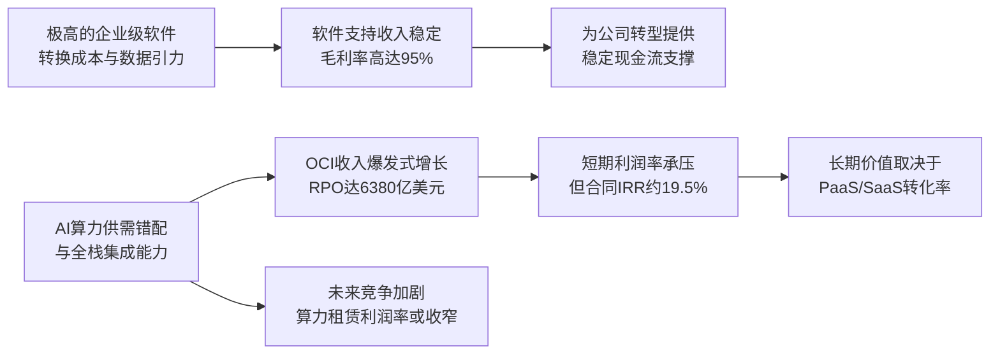

<!-- 匹配到的证券/行业：甲骨文(ORCL.N) -->
操作成功

### 一页通 （甲骨文 (ORCL.N)）
日期：2026-08-06
内容："""
## 公司概况

甲骨文是全球最大的企业级数据库与中间件供应商，正经历从传统本地部署软件许可商向AI云基础设施（OCI）与云应用（SaaS）提供商的战略转型。公司核心业务分为三大板块：云与软件（占总收入87%）、硬件（5%）及服务（8%）。FY2026公司总营收673.57亿美元，同比增长17.35%，其中云收入占比首次突破50%，OCI（IaaS/PaaS）收入同比增速高达77%，是当前核心增长引擎。公司凭借其在高性能数据库、并行计算及企业级客户关系上的深厚积累，正大规模投资AI算力基础设施，试图在由微软、亚马逊、谷歌主导的云计算市场中，以“AI基础设施+企业数据引力”的差异化定位争夺第四极席位。  

## 公司近况跟踪

- <strong>OCI收入加速增长，AI基础设施需求强劲</strong>：FY2026 Q4，云基础设施（OCI）收入同比增速达93%（固定汇率），较Q3的81%显著加速，全年OCI收入达181.01亿美元。管理层指引FY2027总收入约900亿美元，隐含约34%的同比增长，主要由OCI驱动。  
- <strong>资本开支指引大幅上调，自由现金流深度为负</strong>：FY2026全年资本开支达556.63亿美元，同比增162%。管理层指引FY2027资本开支将达900-950亿美元（含融资租赁），导致自由现金流预计为-420亿美元。巨额资本开支主要用于满足以OpenAI为首的大客户AI算力需求。   
- <strong>信用评级遭下调，融资压力凸显</strong>：2026年7月，标普将甲骨文长期信用评级从BBB下调至BBB-（仅比垃圾级高一档），展望稳定。下调主因为巨额资本开支导致自由现金流深度为负，且杠杆率攀升。公司已启动200亿美元ATM股权融资计划，并发行了50亿美元强制可转换优先股。  
- <strong>大规模裁员以优化成本结构</strong>：FY2026公司总员工数减少2.1万人（-13%）至14.1万人，其中研发和销售部门裁员比例最高。此举旨在将资源重新集中于云与AI业务，并利用AI提升内部效率，以对冲基础设施投资带来的利润压力。  
- <strong>斩获美国国防部70亿美元大单</strong>：2026年7月，甲骨文与美国国防部签署了一份为期最长10年、总价值约70亿美元的企业级软件协议，整合国防部各部门的甲骨文软件许可。此订单为传统软件业务提供了重要支撑，并强化了其在政府领域的背书。 

## 短期逻辑

1.  <strong>FY2027 Q1财报（9月中旬）的“预期差”博弈</strong>：当前市场对甲骨文的悲观情绪已达极致，股价自高点回撤超60%，信用违约互换（CDS）利差创历史新高。市场核心担忧在于巨额资本开支对现金流的侵蚀和信用风险。然而，FY2027 Q1（6-8月）业绩大概率将延续OCI收入加速增长的趋势（管理层指引云收入增速57%-63%）。若财报能展示OCI收入超预期增长、或剩余履约义务（RPO）持续强劲，可能触发空头回补和估值修复。需重点关注管理层对FY2027全年资本开支和融资计划的更新，任何资本开支节奏放缓或融资进展顺利的信号，都将被市场视为重大利好。   

2.  <strong>信用评级“稳定展望”下的利差修复窗口</strong>：标普将甲骨文评级下调至BBB-的同时，给出了“稳定”展望，而非“负面”，这为市场情绪提供了一定的底部支撑。当前甲骨文10年期和30年期债券信用利差已分别走阔至约184和240个基点，远高于同评级债券。若公司能按计划推进股权融资、或通过资产出售（如已出售的Ampere股权）改善资产负债表，其信用利差存在显著的收窄空间。利差修复将直接降低其未来的债务融资成本，并提振股权投资者信心。  

3.  <strong>主权AI云与国防订单带来的“叙事升级”催化剂</strong>：甲骨文近期获得美国国防部70亿美元合同，并成为日本政府机密云的有力竞争者。这些项目标志着甲骨文在“主权AI”和“气隙隔离云”（air-gapped cloud）这一高壁垒细分市场的领先地位。此类合同的签订，不仅提供了长期、稳定的收入来源，更重要的是，它向市场传递了甲骨文不仅仅是“OpenAI的房东”，更是具备独特安全与合规能力的战略级AI基础设施提供商的信号，有助于改善其客户集中度风险叙事。  

## 长期逻辑

1.  <strong>从“OpenAI房东”到“企业AI操作系统”的生态位升级</strong>：市场过度关注甲骨文与OpenAI的租赁关系，而忽视了其更深层的战略——将AI能力原生集成至其企业应用生态。甲骨文正将AI代理（Agentic AI）直接嵌入Fusion ERP、HCM、SCM等核心应用，使其从被动记录系统升级为主动决策与执行的“企业AI操作系统”。由于这些应用承载着企业最核心的交易、人事和供应链数据，外部AI难以绕过其既有的治理与安全框架。这种“数据引力+原生AI”的组合，构成了极高的客户转换成本，有望在AI应用层构建起比纯粹IaaS租赁更深厚的护城河。  

2.  <strong>多云数据库战略的潜在价值重估</strong>：甲骨文正积极推动其旗舰数据库产品（Oracle AI Database）在多云环境（如Azure、Google Cloud）中的部署。FY2026，多云数据库消费增长超过1500%。这一战略旨在打破云厂商的锁定效应，让客户可以在任意云上使用甲骨文的高性能数据库服务。若此战略成功，甲骨文数据库将从“本地部署时代的王者”转变为“多云时代的标准”，其可寻址市场将从自建数据中心扩展至整个公有云生态，并带来高利润率的PaaS收入，成为OCI之外的第二增长曲线。  

3.  <strong>资本开支周期后的自由现金流爆发潜力</strong>：当前甲骨文的财务模型类似于一家处于建设期的重资产公用事业公司，巨额前置投入导致自由现金流深度为负。然而，其AI基础设施投资主要由长达5-10年的长期合同（RPO达6380亿美元）所支撑。根据管理层提供的合同经济模型，一份典型的6年期AI基础设施合同，在35%的稳态毛利率下，可实现约19.5%的税前内部收益率（IRR）。随着2027-2028年大规模资本开支高峰过去，前期投入的算力容量将进入收入确认和现金回收期，自由现金流有望在FY2029前后迎来拐点，驱动公司估值从“烧钱模式”向“现金牛模式”切换。 

## 风险提示

- <strong>信用评级进一步下调与融资螺旋风险</strong>：公司目前BBB-的评级仅比垃圾级高一档。若FY2027自由现金流表现不及预期，或股权融资受阻，穆迪可能跟随标普下调其评级至垃圾级。这将引发投资级债券基金的强制抛售，大幅推高融资成本，并触发公用事业公司对数据中心项目更高额的现金抵押要求，形成“评级下调-融资成本上升-现金流恶化-评级再下调”的负反馈螺旋。   
- <strong>对OpenAI的单一客户集中度风险</strong>：市场普遍估计，甲骨文约6380亿美元的RPO中，近一半来自OpenAI。尽管合同具有法律约束力，但若OpenAI因商业化受阻、融资困难或技术路线变更而无法履约，甲骨文将面临巨额沉没成本（已签署的长期数据中心租赁协议）和资产减值风险。这种高度依赖单一客户的模式，使其业务韧性显著弱于拥有广泛客户群的其他云厂商。  
- <strong>AI基础设施投资回报不及预期风险</strong>：公司大规模资本开支的回报高度依赖于AI算力需求的持续高景气度、以及GPU租赁价格的稳定。若未来AI模型训练和推理的硬件效率大幅提升，或出现需求降温，可能导致算力租赁价格下行，使公司前期投资的实际回报率远低于管理层预测的模型，导致资产回报周期拉长甚至出现资产减值。  

## 近期要闻

- <strong>2026年6月11日</strong>：甲骨文发布FY2026 Q4财报，营收和EPS均超市场预期。公司同时提供了强劲的FY2027 Q1及全年业绩指引，但FY2027资本开支指引高达900-950亿美元，远超市场预期，引发市场对现金流和杠杆率的担忧。  
- <strong>2026年7月9日</strong>：标普全球评级将甲骨文的长期信用评级从BBB下调至BBB-，展望稳定。标普指出，尽管AI需求强劲，但巨额资本开支将导致公司在FY2027产生巨额负自由现金流，杠杆率将维持在高位。  
- <strong>2026年7月21日</strong>：甲骨文在新墨西哥州的“木星项目”（Project Jupiter）大型AI数据中心建设遭遇监管挫折，其天然气管道建设申请第二次被拒。该项目是甲骨文为OpenAI托管AI基础设施的关键园区之一，凸显了AI基础设施扩张面临的现实物理瓶颈和监管风险。 
- <strong>2026年7月24日</strong>：美国国防部宣布与甲骨文签署一份价值约70亿美元、为期最长10年的企业级软件协议。此消息一度提振股价，但未能扭转市场对公司的整体悲观情绪。 

## 未来催化

- <strong>2026年9月中旬（预计）</strong>：甲骨文将公布FY2027 Q1财报。市场将高度关注OCI收入增速能否继续加速、RPO增长情况、以及管理层是否会调整FY2027的资本开支和融资计划。任何超预期的业绩表现或资本开支节奏放缓的信号，都可能成为股价反弹的催化剂。  
- <strong>2026年8月-9月</strong>：甲骨文ATM股权融资计划的执行进展。公司已注册最高200亿美元的ATM计划，但截至FY2026末尚未出售任何股份。若公司开始并顺利推进该计划，将有助于缓解市场对其资产负债表和信用评级的担忧。  
- <strong>2026年下半年</strong>：OpenAI的IPO进展。作为甲骨文最大的客户，OpenAI的估值、融资能力和财务状况直接影响市场对甲骨文RPO质量的判断。若OpenAI成功以高估值上市并获得充足融资，将极大缓解市场对甲骨文客户集中度风险的担忧。 

## 公司业务模式及拆分

### 业务边际变化

甲骨文正经历一场根本性的业务模式转型，从销售本地部署的软件许可证和硬件，转向提供云基础设施（IaaS/PaaS）和云应用（SaaS）订阅服务。这一转型在FY2026显著加速，云收入占比首次超过50%。公司投入了史无前例的资本开支（FY2026为556.63亿美元）来建设AI算力中心，以满足以OpenAI为代表的大模型训练和推理需求。同时，公司通过大规模裁员（-13% YoY）来优化成本结构，将节省的资源重新投向云和AI领域。传统软件许可证收入持续萎缩（FY2026同比-9%），而软件支持收入保持稳定，为公司转型提供了关键的现金流支撑。  

### 盈利模式

甲骨文的盈利模式正从高利润率的“软件许可+维护费”模式，向“云订阅+消费”模式转变。传统软件业务依靠其数据库和ERP产品的市场垄断地位，享有极高的毛利率（软件支持业务毛利率稳定在95%左右）。云业务则分为两类：云应用（SaaS）毛利率约70%，而云基础设施（OCI）业务，尤其是AI基础设施部分，毛利率较低（管理层指引稳态30-40%），但合同金额巨大且期限长。公司当前赚的是“算力基础设施投资回报”的钱，其盈利能力高度依赖于规模效应、运营效率以及能否在长期合同中锁定合理的投资回报率。  

### 业务拆分

公司近年业务结构发生根本性变化，增长引擎已完全切换至云业务，尤其是云基础设施（OCI）。FY2026，云与软件业务占总收入87%，其中云收入占总收入51%，首次超过传统软件业务。云基础设施（OCI）是增长最快的板块，收入占比从FY2025的18%跃升至27%。传统软件许可证收入占比则持续萎缩。公司当前处于“产能爬坡期”和“业绩兑现期”的叠加状态，大量已签署的长期合同（RPO）尚未转化为收入，而前置的巨额资本开支已开始对利润表和现金流量表产生显著压力。  

<strong>细分业务拆分（单位：亿美元）</strong>

| 业务板块 | FY2024 收入 | FY2024 占比 | FY2025 收入 | FY2025 占比 | FY2025 同比 | FY2026 收入 | FY2026 占比 | FY2026 同比 |
|---|---|---|---|---|---|---|---|---|
| <strong>云与软件</strong> | <strong>444.64</strong> | <strong>84%</strong> | <strong>492.31</strong> | <strong>86%</strong> | <strong>10.7%</strong> | <strong>585.30</strong> | <strong>87%</strong> | <strong>18.9%</strong> |
| 云应用 (SaaS) | 129.43 | 24% | 142.72 | 25% | 10.3% | 158.88 | 24% | 11.3% |
| 云基础设施 (OCI) | 68.32 | 13% | 102.35 | 18% | 49.8% | 181.01 | 27% | 76.9% |
| 软件许可证 | 50.81 | 10% | 52.01 | 9% | 2.4% | 47.37 | 7% | -8.9% |
| 软件支持 | 196.08 | 37% | 195.23 | 34% | -0.4% | 198.04 | 29% | 1.4% |
| <strong>硬件</strong> | <strong>30.66</strong> | <strong>6%</strong> | <strong>29.36</strong> | <strong>5%</strong> | <strong>-4.2%</strong> | <strong>30.84</strong> | <strong>5%</strong> | <strong>5.0%</strong> |
| <strong>服务</strong> | <strong>54.31</strong> | <strong>10%</strong> | <strong>52.32</strong> | <strong>9%</strong> | <strong>-3.7%</strong> | <strong>57.43</strong> | <strong>8%</strong> | <strong>9.8%</strong> |
| <strong>总收入</strong> | <strong>529.61</strong> | <strong>100%</strong> | <strong>573.99</strong> | <strong>100%</strong> | <strong>8.4%</strong> | <strong>673.57</strong> | <strong>100%</strong> | <strong>17.4%</strong> |

*注：云与软件业务毛利率 FY2024为80.0%，FY2025为77.7%，FY2026为70.8%。*

<strong>云基础设施（OCI）</strong>：FY2026收入181.01亿美元，同比+76.9%，是公司最核心的增长引擎。该业务通过提供裸金属服务器、GPU算力集群、存储和网络服务，满足客户对AI训练和推理、以及传统企业工作负载迁移的需求。其收入增长由AI基础设施合同驱动，客户包括OpenAI、Meta、NVIDIA等。该业务毛利率较低，FY2026估计在36%左右，主要受前置的折旧、数据中心租赁和电力成本影响。管理层指引稳态毛利率为30-40%。  

<strong>云应用（SaaS）</strong>：FY2026收入158.88亿美元，同比+11.3%，保持稳定增长。该业务包括Fusion ERP、NetSuite、HCM、CX等应用套件，通过订阅模式交付。其增长受益于企业将核心业务流程迁移至云端，以及甲骨文在ERP领域的领先地位。该业务毛利率较高，估计在70%左右，是公司重要的利润来源。 

<strong>软件支持</strong>：FY2026收入198.04亿美元，同比+1.4%，是公司的“现金牛”业务。该业务为购买了本地部署软件许可证的客户提供技术支持和版本更新服务，客户续约率极高，毛利率稳定在95%左右。它为公司的云转型提供了稳定的现金流。 

<strong>软件许可证</strong>：FY2026收入47.37亿美元，同比-8.9%，持续萎缩。该业务是公司传统的一次性软件授权销售模式，正被云订阅模式所取代。 

## 核心竞争力

<strong>竞争要素 1：依托极高转换成本与数据引力构筑的企业级应用护城河</strong>

-   <strong>护城河定性</strong>：<strong>结构性护城河</strong>。甲骨文的核心竞争力并非来自单一产品，而是其数据库和ERP应用在企业关键任务中的深度嵌入。全球众多大型企业、银行、政府机构的核心交易系统、人事财务数据均运行在甲骨文的数据库和Fusion应用之上。这些系统承载着数十年的业务流程和数据，迁移成本极高，且存在巨大的业务中断风险。这种“数据引力”构成了强大的客户粘性。  
-   <strong>数据验证</strong>：软件支持业务的续约率极高，且毛利率稳定在<strong>95%</strong>左右，这是强客户粘性和高转换成本在财务上的直接体现。FY2026，尽管许可证收入下滑，但软件支持收入仍维持在<strong>198.04亿美元</strong>，几乎无衰减。 
-   <strong>动态演变</strong>：<strong>维持</strong>。随着公司将AI代理原生集成到Fusion应用中，其ERP系统正从“记录系统”升级为“智能决策与执行系统”，这将进一步巩固其作为企业核心操作系统的地位，使得替换它不仅意味着数据迁移，更意味着业务逻辑和流程的重构，护城河有望加深。 

<strong>竞争要素 2：在AI基础设施领域，依托先发规模与全栈集成形成的阶段性成本优势</strong>

-   <strong>护城河定性</strong>：<strong>行业阶段性红利</strong>。甲骨文在AI基础设施市场并非先行者，但其通过激进的资本开支和与OpenAI的绑定，迅速获得了规模优势。其差异化在于提供从底层RDMA网络、裸金属GPU算力到上层数据库和AI服务的全栈集成，并通过标准化的数据中心设计（如Stargate项目）来优化交付速度和成本。然而，这种优势是阶段性的，主要源于当前AI算力的供需错配。 
-   <strong>数据验证</strong>：OCI收入在FY2026实现了<strong>76.9%</strong>的同比增长，RPO飙升至<strong>6380亿美元</strong>，证明了其获取大规模订单的能力。管理层披露，其AI基础设施的交付时间缩短了<strong>60%</strong>，且已交付的AI算力毛利率达到<strong>32%</strong>，高于30%的指引下限。  
-   <strong>动态演变</strong>：<strong>收缩（面临被侵蚀的风险）</strong>。随着亚马逊、微软、谷歌等竞争对手以及新兴Neocloud厂商的产能逐步释放，AI算力的供需紧张格局可能在未来1-3年缓解。届时，价格竞争将加剧，甲骨文在AI IaaS层的先发规模和成本优势可能被削弱，利润率面临下行压力。其长期竞争力将取决于能否将客户从纯粹的算力租赁，引导至使用其更高利润率的PaaS和SaaS服务。  

<strong>现阶段核心驱动力总结</strong>：甲骨文的Alpha在于其独一无二的企业级软件生态（数据库+ERP）所构筑的深厚护城河，这为其提供了稳定的现金流和庞大的客户基础。其Beta则高度依赖于AI资本开支周期。当前，公司正将Beta的弹性发挥到极致，以换取在AI时代的入场券，但这伴随着巨大的财务风险。长期来看，其Alpha能否成功延伸至AI时代，取决于其能否将OCI的算力客户转化为其更高利润率的数据库和AI应用服务的用户。 

<strong>竞争格局传导逻辑图</strong>：

## 产销链

- <strong>客户情况</strong>：甲骨文的客户群正从广泛分布的企业，转向高度集中于少数AI巨头。<strong>主要客户</strong>：OpenAI是公司最大的单一客户，据标普估计，其合同约占甲骨文6380亿美元RPO的<strong>一半</strong>。其他重要AI客户包括Meta和NVIDIA。这种高集中度（CR1>50%）带来了显著的“砍单”风险。<strong>新客户</strong>：公司正积极拓展主权AI云市场，已获得美国国防部70亿美元合同，并有望赢得日本政府机密云项目。这些客户处于合同签署的早期阶段，其长期价值有待验证。  
- <strong>供应商情况</strong>：甲骨文的主要供应商包括数据中心建设方、电力公司、以及以NVIDIA为首的GPU和网络设备供应商。公司对NVIDIA的AI芯片存在高度依赖。为应对供应链紧张，甲骨文已承诺了更高的采购量和更长的付款周期，并接受了部分不利的供应条款，这增加了其库存和成本风险。公司披露，已获得超过10GW的电力容量，其中超过90%由合作伙伴提供资金。  
- <strong>成本传导能力</strong>：甲骨文在产业链中处于“夹心层”。上游，它面对NVIDIA等具有极强定价权的芯片巨头，以及因AI需求而紧张的电力与土地资源，成本压力巨大。下游，它面对OpenAI等融资能力极强、但自身商业化前景尚不明朗的大客户，其算力租赁合同价格在签订时已基本锁定。因此，当上游硬件或电力成本上涨时，甲骨文难以迅速将其完全转嫁给下游客户，自身毛利率将受到挤压。公司赚取的是“算力基础设施投资与运营”的钱，其回报率高度依赖于初期的成本控制和长期的运营效率。 

## 财务数据

<strong>关键财务数据（单位：亿美元）</strong>

| 项目 | FY2024 截止2024-05-31 | FY2025 截止2025-05-31 | FY2026 截止2026-05-31 |
|---|---|---|---|
| <strong>营业总收入</strong> | 529.61 | 573.99 | 673.57 |
| 收入同比 | 6.02% | 8.38% | 17.35% |
| 营业成本 | 151.43 | 169.27 | 230.21 |
| <strong>毛利润</strong> | 378.18 | 404.72 | 443.36 |
| 毛利率 | 71.41% | 70.51% | 65.82% |
| 营业开支 | 217.47 | 224.20 | 218.92 |
| <strong>营业利润</strong> | 160.71 | 180.52 | 224.44 |
| 营业利润率 | 30.34% | 31.45% | 33.32% |
| <strong>归母净利润</strong> | 104.67 | 124.43 | 169.84 |
| 归母净利润同比 | 23.10% | 18.88% | 36.49% |
| <strong>稀释每股收益（美元）</strong> | 3.71 | 4.34 | 5.83 |
| <strong>经营活动现金流</strong> | 186.73 | 208.21 | 319.77 |
| <strong>资本性支出</strong> | -68.66 | -212.15 | -556.63 |
| <strong>自由现金流</strong> | 118.07 | -3.94 | -236.86 |

### 财务分析

- <strong>成长能力</strong>：公司营收增速在FY2026显著提升至<strong>17.35%</strong>，主要由云基础设施（OCI）业务驱动。剔除一次性投资出售收益（如出售Ampere股权）的影响，归母净利润同比增长<strong>36.49%</strong>，同样呈现加速增长态势。这表明公司的云转型战略在收入端已取得明显成效。 
- <strong>盈利能力</strong>：公司毛利率从FY2024的<strong>71.41%</strong>持续下滑至FY2026的<strong>65.82%</strong>，主要原因是低毛利率的OCI业务（尤其是AI基础设施）占比快速提升。然而，得益于销售与行政费用的有效控制（FY2026同比下降<strong>7.5%</strong>），以及研发费用增速放缓，公司营业利润率反而从FY2024的<strong>30.34%</strong>提升至FY2026的<strong>33.32%</strong>。这显示出公司在主动进行业务结构转型时，通过运营杠杆维持了整体盈利能力的稳定。  
- <strong>现金流状况</strong>：这是公司当前财务状况中最薄弱的环节。尽管经营活动现金流在FY2026大幅增长至<strong>319.77亿美元</strong>，但资本开支飙升至<strong>556.63亿美元</strong>，导致自由现金流为-<strong>236.86亿美元</strong>。这反映了公司为抓住AI机遇而进行的激进投资策略，其现金流已高度依赖外部融资。 

## 行业及竞争分析

甲骨文主要参与两个细分市场：<strong>企业应用软件（SaaS）</strong> 和<strong>云基础设施（IaaS/PaaS）</strong>，后者是其当前战略重心。 

- <strong>云基础设施（IaaS/PaaS）市场</strong>：这是一个由亚马逊AWS、微软Azure和谷歌云主导的寡头市场，但AI的爆发式增长为甲骨文和新兴Neocloud厂商提供了“破坏性创新”的窗口。市场对大规模、高性能、低延迟的GPU算力需求激增，导致短期内供不应求。甲骨文凭借其在高性能计算和数据库领域的技术积累，以及激进的资本投入，迅速切入市场，成为重要的“AI云”提供商。行业趋势显示，AI算力需求正从模型训练向推理倾斜，这对云厂商的网络延迟和成本控制提出了更高要求。甲骨文的RDMA网络和全栈集成策略在此方面具备一定优势。  

- <strong>企业应用软件（SaaS）市场</strong>：这是一个相对成熟的市场，甲骨文与SAP、Workday、Salesforce等厂商展开竞争。甲骨文的优势在于其ERP产品的深度和广度，以及庞大的现有客户基础。AI的融入正成为该市场新的竞争焦点，甲骨文通过将AI代理原生嵌入Fusion应用，试图构建差异化的竞争优势。  

<strong>可比公司分析</strong>

| 公司名称 | 股票代码 | 核心对标维度 | 分析 |
|---|---|---|---|
| 微软 | MSFT | 云平台（Azure）+ 企业应用（Dynamics 365）+ AI（Copilot） | 最全面的竞争对手。Azure是OCI的直接对手，Dynamics 365与Fusion竞争。微软拥有更庞大的生态系统和更强的AI模型能力（与OpenAI合作），但甲骨文在数据库和ERP的深度上更胜一筹。 |
| 亚马逊 | AMZN | 云平台（AWS） | 公有云市场的绝对领导者。AWS拥有最广泛的云服务和最大的规模优势。甲骨文OCI的差异化在于其高性能计算、数据库集成以及对大型单一客户（如OpenAI）的定制化服务能力。 |
| 谷歌 | GOOGL | 云平台（Google Cloud）+ AI模型（Gemini） | 在AI和数据分析领域技术领先，其TPU和AI平台对AI初创公司有吸引力。甲骨文OCI则更侧重于企业级工作负载迁移和主权云。 |
| SAP | SAP | 企业应用软件（S/4HANA） | 在企业ERP市场的传统竞争对手。甲骨文的优势在于其云转型（Fusion）更为彻底，且拥有自己的IaaS层（OCI），能提供从基础设施到应用的全栈解决方案。 |

<strong>总结分析</strong>：甲骨文在云基础设施市场采取的是“集中兵力打歼灭战”的策略，聚焦于服务少数对算力有极致需求的大型AI客户，而非与三大云厂商在通用计算领域全面竞争。在企业应用市场，它则利用“数据引力”和“全栈集成”的优势，抵御SaaS新贵的挑战。其最大的竞争风险在于，AI算力供需失衡缓解后，其OCI业务的差异化优势能否持续。  

## 市场焦点议题

<strong>议题一：资本开支狂潮下的现金流与信用风险</strong>

- <strong>背景</strong>：甲骨文FY2026自由现金流为-236.86亿美元，并指引FY2027资本开支高达900-950亿美元，这将导致自由现金流缺口进一步扩大。市场担忧公司过度杠杆化，其信用评级已被标普下调至BBB-，CDS利差创历史新高。  
- <strong>问题列表</strong>：
    - 甲骨文FY2027的900-950亿美元资本开支计划中，有多少是已签约客户的刚性需求，多少是前瞻性投资？
    - 公司计划如何填补FY2027预计高达420亿美元的自由现金流缺口？200亿美元的ATM股权融资计划何时启动，能否足额完成？
    - 若AI算力需求或融资环境出现不利变化，公司是否有削减或推迟资本开支的灵活性和预案？

<strong>议题二：OpenAI依赖症与RPO质量</strong>

- <strong>背景</strong>：市场普遍估计，甲骨文约6380亿美元的RPO中，近一半来自OpenAI。这使得甲骨文的未来收入高度绑定于一家尚未盈利、且面临激烈竞争的AI初创公司。  
- <strong>问题列表</strong>：
    - OpenAI的合同条款中，是否存在允许其缩减订单或提前终止的条款？甲骨文为OpenAI建设的数据中心，在设计和规格上是否具有通用性，能否在必要时转租给其他客户？
    - 除OpenAI外，甲骨文OCI业务的其他客户（如Meta、NVIDIA）的合同规模和期限如何？客户多元化进展是否符合预期？
    - 甲骨文如何向市场证明，其RPO不仅仅是“纸面富贵”，而是能最终转化为收入和现金流的优质资产？

<strong>议题三：AI IaaS业务的长期利润率中枢</strong>

- <strong>背景</strong>：OCI业务的毛利率（估计36%）远低于公司传统软件业务。市场对于AI IaaS业务在度过产能爬坡期后，能否达到管理层指引的30-40%稳态毛利率，以及其长期竞争壁垒存有疑虑。 
- <strong>问题列表</strong>：
    - 随着AI芯片代际更新（如从Blackwell到Rubin），单位算力的资本开支和租赁价格将如何变化？这对OCI的毛利率和投资回报率有何影响？
    - 在AWS、Azure等巨头和新兴Neocloud的竞争下，AI算力租赁是否会走向商品化，导致价格战和利润率压缩？
    - 公司如何通过提升PaaS（如数据库）和SaaS服务在OCI客户中的渗透率，来结构性提升OCI的整体利润率？

## 市场分歧探讨

<strong>核心分歧：甲骨文的AI基础设施投资，是“泡沫巅峰的疯狂”，还是“周期底部的理性豪赌”？</strong>

- <strong>看空方逻辑与依据</strong>：
    1.  <strong>“庞氏融资”论</strong>：认为甲骨文、英伟达、OpenAI之间形成了“AI循环融资”链条。英伟达投资OpenAI，OpenAI用这笔钱向甲骨文购买算力，甲骨文再向英伟达购买芯片。这种模式在需求高涨时看似完美，但一旦终端应用收入不及预期，整个链条将崩溃。甲骨文作为重资产中间商，将承担最大的资产减值风险。  
    2.  <strong>“无护城河的资本消耗”论</strong>：认为AI IaaS业务本质上是大宗商品业务，缺乏长期护城河。甲骨文当前的规模优势是暂时的，其资本回报率将随着竞争加剧而持续下降。巨额资本开支最终将摧毁股东价值，而非创造价值。 
    3.  <strong>“客户集中”风险论</strong>：将甲骨文视为“OpenAI的影子”。认为其命运已完全系于OpenAI一家的成败，风险极高。一旦OpenAI有任何风吹草动，甲骨文的RPO和收入预期将瞬间崩塌。  

- <strong>看多方逻辑与依据</strong>：
    1.  <strong>“需求真实且可持续”论</strong>：认为AI是新一轮科技革命，对算力的需求是真实且长期的。甲骨文签署的是具有法律约束力的长期合同，且客户多为行业巨头，违约风险低。RPO的快速增长就是需求真实性的最好证明。  
    2.  <strong>“全栈差异化”论</strong>：认为甲骨文并非纯粹的算力“房东”。其核心竞争力在于“硬件+数据库+应用”的全栈集成能力，以及由此带来的性能优势和数据引力。客户一旦将核心数据和工作流部署在OCI上，并深度使用其PaaS和SaaS服务，迁移成本将非常高。  
    3.  <strong>“周期底部”论</strong>：认为市场情绪已过度悲观，股价已充分反映了所有已知风险。公司正处于大规模投资周期的前期，财务数据最差的时候，恰恰是投资的黄金窗口期。随着资本开支高峰过去，自由现金流将迎来拐点，届时市场将重新定价其价值。  

<strong>总结分析</strong>：看空方的逻辑在短期财务数据和信用指标上得到了充分验证，其担忧是合理且现实的。看多方的逻辑则更侧重于长期战略和产业趋势，其能否兑现高度依赖于公司未来的执行力以及AI产业本身的发展轨迹。当前，甲骨文在产业链中的议价能力相对较弱，其投资回报高度受制于上游芯片价格和下游大客户的议价能力。公司能否通过技术差异化（如数据库、AI代理）来摆脱单纯的“算力中间商”角色，是决定其长期投资价值的关键。 

## 盈利预测与估值

<strong>管理层最新指引</strong>：
- <strong>FY2027 Q1</strong>：总收入增长27-29%，云收入增长57-63%，Non-GAAP EPS为1.72-1.76美元。  
- <strong>FY2027全年</strong>：总收入约900亿美元，Non-GAAP EPS约8.05美元（+18% YoY）。  
- <strong>长期目标（FY2029/FY2030）</strong>：FY2029收入超过1660亿美元，FY2030 Non-GAAP EPS约21美元。  

<strong>券商盈利预测与估值</strong>

| 机构 | 评级 | 目标价(美元) | 财务指标 | FY2026A | FY2027E | FY2028E | FY2029E |
|---|---|---|---|---|---|---|---|
| 花旗 (2026-06-04) | 买入 | 330 | 营业收入(百万美元) | 67,257 | 88,514 | 127,120 | - |
| | | | Non-GAAP EPS(美元) | 7.50 | 8.10 | 10.84 | - |
| 巴克莱 (2026-06-12) | 增持 | 240 | 营业收入(百万美元) | 67,211 | 87,984 | 127,580 | - |
| | | | Non-GAAP EPS(美元) | 7.49 | 7.83 | 10.62 | - |
| 德意志银行 (2026-06-02) | 买入 | 300 | 营业收入(百万美元) | 67,263 | 85,800 | 128,306 | 180,330 |
| | | | Non-GAAP EPS(美元) | - | - | - | - |
| 国泰海通 (2026-03-13) | 增持 | 242 | 营业收入(百万美元) | 67,542 | 89,257 | 130,168 | - |
| | | | Non-GAAP EPS(美元) | 7.47 | 8.09 | 10.53 | - |

*注：花旗和巴克莱的预测数据为调整后口径，与公司官方指引可能存在差异。*

<strong>盈利预期与估值分析</strong>：各机构对甲骨文FY2027和FY2028的收入预测较为一致，但对EPS的预测存在分歧，反映了市场对公司在激进投资周期中利润率变化的不同假设。花旗和巴克莱均采用了市盈率（P/E）估值法，基于各自对未来12个月盈利的预测。尽管公司短期自由现金流为负，但卖方分析师普遍基于其长期盈利增长潜力给予“买入”评级，目标价较当前股价有显著的上行空间。这种分歧恰恰体现了市场对甲骨文“短期风险巨大”与“长期回报诱人”并存的核心矛盾。
"""
