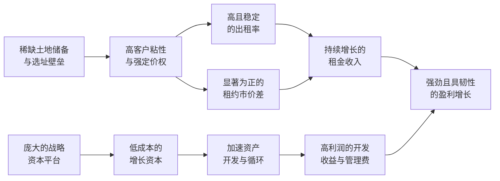

# Gangtise 公司一页通：安博（PLD.N）

> 拉取日期：2026-07-30 ｜ 来源：gangtise-agent `stock-one-pager`

## 公司概况

安博是全球最大的物流房地产投资信托基金，专注于高壁垒、高增长市场的物流设施所有权、开发与管理。公司业务遍及美洲、欧洲及亚洲的20个国家，拥有并管理约13亿平方英尺的物流资产组合，服务超过6,500家客户。其业务模式涵盖两大板块：一是直接持有并运营物流物业的**房地产业务**，二是通过管理第三方资本（战略资本）获取管理费及超额收益分成的**轻资产业务**。公司凭借其稀缺的土地储备、庞大的客户网络及强大的开发能力，构筑了深厚的竞争壁垒。 

## 公司近况跟踪

- **业绩超预期并上调全年指引**：2026年第二季度，公司核心运营现金流（Core FFO）达到**每股1.60美元**（不含promote），超出市场预期。管理层因此将2026全年核心FFO指引上调至**每股6.22至6.30美元**，较此前中点上调约**100个基点**。 
- **租赁需求创历史新高**：第二季度签署了创纪录的**6700万平方英尺**租约，为过去七个季度中的第四个纪录。美国市场净吸纳量达到**6600万平方英尺**，为2022年以来最高水平，主要由电子商务、先进制造业及供应链重构驱动。 
- **数据中心业务加速扩张**：年初至今，数据中心开发启动额已达**21亿美元**，已超过全年指引。公司电力管线扩大至约**5.8吉瓦**，其中约**85%** 有望在2030年前支持项目启动。第二季度启动了一个**260兆瓦**的定制化园区，并完成了一笔**100兆瓦**通电土地的出售，利润率高达**82%**。 
- **资本循环与战略合作深化**：第二季度完成了**18亿美元**的资产收购，主要位于南加州和南佛罗里达等优质沿海市场，收购价格较重置成本有约**20%** 的折价。同时，完成了与La Caisse的**12亿美元**欧洲合资企业交易，进一步拓展了战略资本平台。 
- **市场基本面持续改善**：美国市场空置率降至**7.2%**，大型空间（50万平方英尺以上）供给极为紧张。欧洲市场复苏领先，空置率稳定在**5.2%**。全球投资组合的净有效租约市价差维持在**17%**，隐含近**8亿美元**的未来净运营收入增长潜力。 

## 短期逻辑

1. **物流基本面拐点确认与租金加速增长的预期差**：市场普遍认为物流地产处于复苏初期，但安博第二季度的数据表明，复苏力度可能超出预期。美国市场净吸纳量创多年新高，空置率持续下行，且大型空间已基本售罄。管理层判断市场已进入“下一增长阶段”，并预计2026全年美国净吸纳量将达**2.2亿平方英尺**，超过**1.95亿平方英尺**的竣工量，推动出租率上升。这一供需格局的改善，叠加公司组合内**17%** 的租约市价差，意味着未来几个季度租金增长和同店净运营收入增速有望持续超出市场当前预期，构成业绩上调的核心驱动力。 

2. **数据中心业务从“期权”到“业绩兑现”的价值重估**：安博的数据中心业务正快速从概念阶段进入大规模执行和变现阶段。年初至今**21亿美元**的开发启动额已超过全年指引，且项目均为与超大规模客户签订的长期租约，收益确定性高。公司不仅有能力进行开发，还通过出售通电土地（利润率**82%**）证明了其灵活的变现能力。管理层预计未来**6至9个月**内将再次打包出售稳定资产，这将使市场更清晰地看到该业务的利润贡献和资本循环模式，从而可能触发对公司整体估值体系的重塑，由单纯的物流REIT向“物流+数字基础设施”平台转型。 

3. **战略资本平台的扩张与费用收入增长**：公司近期连续推出多只新基金，包括与GIC和La Caisse的合资企业，显示出其在全球资本市场的强大募资能力。该平台管理的**680亿美元**第三方资本不仅为公司提供了轻资产的增长途径，还贡献了稳定的管理费收入。2026年战略资本收入（不含promote）指引为**6.6亿至6.8亿美元**，同比增长约**13%**。随着新基金的设立和现有基金的增值，这部分高确定性、高毛利的收入流将持续增长，为公司的整体盈利增长提供稳定支撑。 

## 长期逻辑

1. **全球供应链重构与电子商务渗透的结构性红利**：安博的长期增长根植于全球供应链的持续重构和电子商务渗透率的提升。公司研究指出，每**1万亿美元**的数据中心资本支出预计将衍生出**3000万至4000万平方英尺**的增量物流需求，这为需求增长提供了新的结构性支撑。同时，电子商务在拉美、欧洲等市场仍处于追赶阶段，其渗透率提升将持续创造对现代物流设施的需求。安博在全球关键消费市场拥有稀缺的土地储备（**14,000英亩**，可开发**2.4亿平方英尺**），使其成为这一结构性趋势的核心受益者。 

2. **“开发-增值-变现”模式的复利效应**：安博的核心竞争力在于其强大的开发能力和独特的资本循环模式。公司利用其土地储备和开发专长，以低于市场的成本开发高质量物流设施，待物业成熟后，通过出售给旗下战略资本基金或第三方实现价值变现和资本回收。这一模式不仅贡献了高利润率的开发收益（历史利润率约**29%**），还为公司提供了持续的管理费收入。当前**420亿美元**的开发机会储备，叠加数据中心的巨大潜力，意味着这一价值创造飞轮将在未来多年持续运转，驱动公司盈利和净资产价值实现复利增长。  

3. **能源与数据领域的平台化延伸**：安博正将其在物流地产领域的核心能力——土地获取、政府关系、客户网络和开发管理——成功延伸至能源和数据中心领域。公司已控制**5.8吉瓦**的电力管线，并拥有**1.3吉瓦**的屋顶太阳能潜力（目前仅开发了**8%**）。这些业务不仅本身能提供两位数的投资回报率，更重要的是，它们与核心物流业务形成协同效应，增强了客户粘性，并提升了公司土地储备的价值。随着数字经济和电气化趋势的加速，这些相邻业务有望成长为新的价值支柱，拓宽公司的长期增长边界。  

## 风险提示

- **宏观经济与地缘政治不确定性**：物流需求与全球贸易和经济活动高度相关。尽管当前需求强劲，但持续的地缘政治冲突、关税政策变化或经济衰退均可能导致客户推迟或取消扩张计划，从而影响公司的出租率、租金增长和开发项目的租赁进度。公司管理层也承认，宏观环境的影响仍是难以预测的变量。 
- **数据中心业务执行与资本化风险**：数据中心业务虽然前景广阔，但其资本投入巨大（单项目可达数亿至数十亿美元），且面临电力获取、社区审批、供应链瓶颈等执行挑战。尽管公司已证明其开发和变现能力，但如何长期、大规模地为该业务提供高效资本支持，并在不显著增加资产负债表风险的前提下实现价值最大化，仍是需要持续观察的关键点。若市场环境变化导致资产出售不畅，可能对公司的现金流和回报率产生影响。 
- **利率与融资成本风险**：作为资本密集型行业，安博的收购和开发活动高度依赖外部融资。尽管公司目前杠杆率健康（债务/EBITDA为**4.7倍**），且债务加权平均利率仅为**3.2%**，但如果通胀反复导致利率长期维持高位或进一步上升，将增加公司的新增融资成本和再融资压力，从而侵蚀利润并限制其资本部署能力。 

## 近期要闻

- **2026年4月**：公司公布2026年第一季度业绩，核心FFO超出预期，并宣布与新加坡主权财富基金GIC成立**16亿美元**的美国合资企业，以及与La Caisse成立**12亿美元**的泛欧合资企业。  
- **2026年6月**：公司在Nareit投资者大会上表示，物流市场已进入基本面拐点，全球市场租金实现两年来首次正增长。同时披露数据中心电力管线已达**5.6吉瓦**，并强调其土地储备和开发能力在数据中心领域的独特优势。 
- **2026年7月**：公司公布2026年第二季度业绩，再次超出预期并上调全年业绩指引。季度内租赁活动创纪录，数据中心开发启动额超全年目标，并完成了一笔高利润率的通电土地出售，标志着其数据中心变现模式的成功落地。 

## 未来催化

- **2026年8月-10月**：公司预计将在未来**6至9个月**内再次打包出售一批稳定的数据中心资产。此次交易的估值和利润率将成为市场验证其数据中心业务变现能力和价值创造的关键催化剂。 
- **2026年9月-10月**：公司可能在秋季的投资者日或行业会议上，进一步量化数据中心业务的长期财务贡献，并可能公布新的战略资本基金募集进展，为市场提供更清晰的增长路径图。 
- **2026年10月**：公司预计将公布2026年第三季度财报。届时，市场将密切关注物流业务的租金增长趋势、出租率变化以及数据中心业务的新签租约和开发进展，以验证当前强劲的增长势头能否持续。 

## 公司业务模式及拆分

### 业务边际变化

公司近年最显著的边际变化是**数据中心业务的快速崛起**。依托其庞大的工业用地储备和强大的电力采购能力，安博成功将部分物流用地转化为高价值的数据中心开发项目。该业务已从概念验证阶段进入大规模执行和变现阶段，成为公司新的增长极。同时，在核心物流业务方面，公司正从上一轮周期的租金快速增长阶段，过渡到依靠**租约市价差**（lease mark-to-market）逐步兑现租金增长的阶段。  

### 盈利模式

公司的盈利模式是**双轮驱动**：一是通过持有并运营全球核心市场的物流物业，获取稳定的**租金收入**；二是通过**开发并出售/贡献**物业给其管理的战略资本基金，获取高利润率的一次性开发收益，并通过对这些基金的管理获取持续的**管理费收入**和超额收益分成。其核心护城河在于以低成本获取稀缺土地、进行高质量开发，并通过资本循环实现价值变现。  

### 业务拆分

公司业务分为两大板块：**房地产业务**和**战略资本业务**。房地产业务是收入和利润的绝对主体，主要来自美国市场的租金收入。战略资本业务则以轻资产模式运营，收入规模较小但毛利率极高，是公司价值创造和资本循环的关键一环。公司当前处于**业绩兑现期**，即通过租赁活动将过去积累的租金价差逐步转化为实际收入和利润。 

#### 细分业务拆分

| 项目 (百万美元) | FY2023 | FY2024 | FY2025 | 2026 H1 |
|---|---|---|---|---|
| **截止日期** | 2023-12-31 | 2024-12-31 | 2025-12-31 | 2026-06-30 |
| **房地产业务** | | | | |
| 收入 | 8,023 | 8,202 | 8,790 | 4,723 |
| 收入占比 | - | - | - | - |
| 营业成本 | - | - | - | - |
| 毛利润 | - | - | - | - |
| **战略资本业务** | | | | |
| 收入 | - | 672 | 592 | - |
| 收入占比 | - | - | - | - |
| 营业成本 | - | (292) | (271) | - |
| 毛利润 | - | 380 | 321 | - |

*注：公司未披露分板块的营业成本及毛利润，仅披露分板块的净运营收入（NOI）。战略资本业务数据来自年报MD&A。*

#### 房地产业务（Real Estate Segment）

该板块是公司的核心业务，2026年上半年贡献总收入**47.23亿美元**。其收入主要来自客户租金，并通过运营租赁回收大部分物业运营成本。该板块的增长主要由租金上涨、高出租率维持和开发项目完工推动。截至2026年第二季度末，公司合并报表范围内的出租率为**95.5%**，净有效租金变动超过**36%**，显示出强大的定价能力。该板块的净运营收入（NOI）在2026年第一季度为**16.07亿美元**，同比增长约**7%**。   

#### 战略资本业务（Strategic Capital Segment）

该板块代表公司对非并表合资基金的管理业务。收入主要来自为这些基金提供资产和物业管理服务而收取的**经常性费用**，以及提供租赁、收购、开发等服务收取的**交易性费用**。此外，在基金回报超过一定门槛后，公司还能获得**超额收益分成**。2025年，该板块收入为**5.92亿美元**，其中经常性费用为**5.21亿美元**。该板块的净运营收入（NOI）在2026年第一季度为**0.79亿美元**，与去年同期基本持平。2026年第二季度，公司确认了**8300万美元**的promote收入，主要来自墨西哥的Fevra投资组合。   

## 核心竞争力

**竞争要素 1：依托稀缺土地储备和选址壁垒构筑的结构性护城河**

- **护城河定性**：**结构性护城河**。安博在全球关键消费市场的核心物流节点拥有大量战略性土地储备，这些土地因其优越的地理位置（靠近港口、高速公路和终端消费者）和极高的监管与社区准入壁垒而难以复制。这种“先发优势”构成了公司最核心的长期竞争力。 
- **数据验证**：公司拥有**14,000英亩**的土地储备，可支持开发**2.4亿平方英尺**的物流空间，对应约**420亿美元**的总投资机会。其投资组合的租约市价差高达**17%**，隐含近**8亿美元**的额外年化净运营收入，这直接反映了其资产在市场上的稀缺性和高价值。公司全球投资组合的出租率高达**95.5%**，且在大型空间（50万平方英尺以上）市场已接近售罄，证明了其资产对客户的强大吸引力。  
- **动态演变**：**护城河变宽**。随着全球城市化进程和对物流效率要求的提升，位于核心消费区附近的工业用地将愈发稀缺。安博不仅持有大量现有土地，还通过其强大的政府关系和开发团队，持续获取新的土地和电力资源（如**5.8吉瓦**的数据中心电力管线），进一步巩固其资源壁垒。  

**竞争要素 2：轻资产的战略资本平台带来的资本优势和网络效应**

- **护城河定性**：**结构性护城河**。公司管理的战略资本平台规模庞大，与全球顶级机构投资者建立了长期合作关系。该平台不仅为公司提供了稳定、低成本的第三方资本，支持其开发和收购活动，还通过管理费收入增强了盈利的稳定性和可预测性。这种“地产+资管”的模式形成了强大的网络效应，竞争对手难以在短期内复制。 
- **数据验证**：公司管理着**680亿美元**的第三方资本，2025年战略资本业务收入为**5.92亿美元**，其中高毛利的经常性费用收入为**5.21亿美元**。2026年上半年，公司连续成立多只新基金，吸引了数十亿美元的新资本。该平台使公司能够以更资本高效的方式抓住增长机会，同时分散风险。  
- **动态演变**：**护城河变宽**。公司正将战略资本平台的能力从传统物流延伸至数据中心等新领域，为不同风险偏好的投资者提供定制化产品。随着平台规模和产品线的扩张，其对资本的吸引力和费用收入贡献将持续增强。  

**现阶段核心驱动力总结**：
安博的Alpha来源于其将稀缺的土地资源、强大的开发能力和独特的资本循环模式相结合，创造出持续高于行业平均水平的价值增长。其Beta则体现在对全球贸易、电子商务和供应链现代化等宏观趋势的暴露。当前阶段，公司正从核心物流业务的租金兑现和新兴数据中心业务的规模化中获取双重增长动力。 

**竞争格局传导逻辑图**：

## 产销链

- **客户情况**：公司客户基础极为分散，截至2025年底，拥有超过6,500家客户，涵盖制造业、零售业、运输业等多个领域。前25大客户仅占净有效租金的约**23.7%**，单一最大客户亚马逊占比为**6.3%**，不存在对单一客户的重大依赖。近年来，来自数据中心供应商的新需求显著增长，占新租赁的比例从一年前的不足**5%** 升至**10%**，成为新的结构性需求驱动力。  
- **供应商情况**：公司的主要供应商为建筑承包商、建材供应商和电力公司。凭借其巨大的开发体量和采购规模，公司拥有较强的议价能力，能够以较低成本获取建材和电力资源。特别是在数据中心领域，公司通过提前预订长周期设备，形成了对供应链的独特控制力。 
- **成本转嫁能力**：公司赚取的是**稀缺性溢价**和**服务增值**。其物业大多位于供应受限的核心市场，客户可选择的空间有限，因此公司具备较强的成本转嫁能力。运营成本大部分可通过租赁合同中的条款回收。当上游建材或融资成本上升时，最终会传导至市场租金水平，而公司作为市场领导者，是这一趋势的主要受益者。 

## 财务数据

| 项目 (百万美元) | FY2023 | FY2024 | FY2025 | 2026 H1 |
|---|---|---|---|---|
| **截止日期** | 2023-12-31 | 2024-12-31 | 2025-12-31 | 2026-06-30 |
| **营业总收入** | 8,023 | 8,202 | 8,790 | 4,723 |
| 收入同比 | 34.31% | 2.22% | 7.18% | 9.24% |
| **营业利润** | - | - | - | - |
| **归母净利润** | 3,053 | 3,726 | 3,322 | 2,041 |
| 归母净利润同比 | -9.09% | 22.02% | -10.83% | 75.79% |
| **基本每股收益 (美元)** | 3.30 | 4.02 | 3.58 | 2.18 |
| **经营活动现金流净额** | 5,373 | 4,912 | 5,008 | - |
| **投资活动现金流净额** | -6,419 | -3,099 | -3,630 | - |
| **筹资活动现金流净额** | 1,320 | -1,000 | -1,564 | - |

*注：2026 H1归母净利润同比大增，主要因2026年第一季度确认了大额资产处置收益。*

### 财务分析

- **成长能力**：公司收入增长稳健，2025年同比增长**7.18%**，2026年上半年增速提升至**9.24%**，显示出加速增长态势。归母净利润受资产处置收益等非经常性项目影响波动较大，但核心运营现金流（Core FFO）增长更为平稳，2026年全年指引中点上调至**6.26美元/股**，同比增长约**5.7%**。  
- **盈利能力**：作为REIT，公司的核心盈利指标是运营现金流。其同店净运营收入（SSNOI）增长强劲，2026年第二季度现金口径增长**8.5%**，净有效口径增长**6.4%**，表明其核心租赁业务的盈利能力在持续增强。开发业务利润率（Estimated weighted average margin）在2026年第一季度高达**34.0%**，显示出卓越的价值创造能力。  
- **偿债能力与资本结构**：公司资产负债表稳健。截至2026年第一季度末，债务加权平均利率为**3.2%**，平均期限为**8.4年**，债务结构健康。公司拥有**67亿美元**的总流动性，短期偿债压力小。其信用评级为A/A2，融资成本优势显著。  

## 行业及竞争分析

安博所处的**全球物流房地产**行业，正经历由供需关系改善驱动的周期性复苏。在供给端，由于过去几年的利率上升和经济不确定性，新项目开工量大幅下降，2024年全球物流供应仅为疫情前的**35%-40%**，导致当前市场空置率持续下行。在需求端，电子商务、供应链韧性和现代化升级等结构性因素持续驱动需求增长。公司管理层预计，2026年美国市场净吸纳量将达到**2.2亿平方英尺**，超过**1.95亿平方英尺**的竣工量，供需格局有利。  

**竞争格局**方面，物流地产行业高度分散，但安博凭借其全球规模和专注于高壁垒市场的策略，建立了显著的领先优势。其最大的竞争优势在于难以复制的土地储备和强大的客户关系网络。与主要竞争对手相比，安博的独特之处在于其**战略资本平台**和**数据中心业务**带来的额外增长维度，使其不再是一个纯粹的物流地产商。 

**可比公司**：
由于所给资料中未提供具体可比公司名单及对标分析，无法输出此部分内容。 

## 市场焦点议题

- **背景**：公司组合内存在**17%** 的租约市价差，这是过去几年市场租金大幅上涨后积累的潜在收入。市场密切关注这些价差能否以及在多大程度上转化为实际收入和利润。 
- **问题列表**：
  - 当前**17%** 的租约市价差在未来2-3年内将如何逐步兑现为同店净运营收入增长？
  - 在市场租金增长放缓的背景下，续租租金的变化趋势如何？第二季度**36%** 的净有效租金变化率能否持续？
  - 管理层预计全年净有效租金变化接近**40%**，这一目标的实现路径和主要风险是什么？

- **背景**：数据中心业务已成为公司的重要增长极，但其资本投入巨大，回报周期和变现路径尚不完全清晰。 
- **问题列表**：
  - 公司**5.8吉瓦**的电力管线中，预计有多少能最终转化为开发项目？转化率和时间表如何？
  - 数据中心项目的长期回报率（IRR）与物流开发项目相比如何？公司如何平衡两者之间的资本配置？
  - 公司计划通过出售稳定资产来变现数据中心价值，这一模式的可持续性和潜在市场规模有多大？

- **背景**：公司近期成立了多只新基金，战略资本平台持续扩张，市场关注其能否持续吸引第三方资本，以支持其轻资产增长模式。 
- **问题列表**：
  - 公司未来几年计划推出哪些新的基金产品？目标规模和策略是什么？
  - 在当前利率环境下，机构投资者对物流和数据中心资产的配置意愿如何？
  - 战略资本业务的收入增长前景如何？管理费率和超额收益分成的趋势是怎样的？

## 市场分歧探讨

**核心分歧：当前物流市场的强劲需求是结构性复苏的开始，还是周期性补库的短暂脉冲？**

- **乐观方观点**：认为需求具有结构性支撑。电子商务渗透率仍在提升，尤其是在拉美和欧洲等安博重点布局的市场。此外，供应链重构（如制造业回流、近岸外包）和数据中心建设带来的衍生需求是全新的、长期的增长驱动力。安博创纪录的租赁提案管道和大型空间的售罄状态，表明需求基础扎实且广泛，并非单一行业或客户的短期行为。公司管理层也判断市场已进入“下一增长阶段”。 

- **谨慎方观点**：认为当前需求部分源于过去两年因不确定性而被压抑的释放，以及企业为应对关税等风险而进行的预防性囤货。一旦宏观经济出现衰退或贸易政策明朗化，需求可能快速回落。此外，尽管空置率在下降，但除大型空间外，中小型空间的出租率改善并不均衡，且租金增长才刚刚转正，市场定价能力尚未完全恢复。南加州等部分重要市场的复苏滞后，也表明整体复苏的基础尚不牢固。 

- **综合分析**：安博的资产组合质量及其在关键市场的领导地位，使其在本轮复苏中处于优势地位。其需求来源的多样性（电商、制造业、数据中心供应商等）降低了单一行业波动的风险。更重要的是，**17%** 的租约市价差为公司提供了强大的盈利缓冲，即使市场租金增长不如预期，公司仍能通过续租实现显著的内部增长。因此，即使需求复苏的力度存在不确定性，公司未来几个季度业绩的可见性和确定性依然较高。 

## 盈利预测与估值

| 机构 | 评级 | 目标价 | 财务指标 | FY2025 | FY2026E | FY2027E | FY2028E |
|---|---|---|---|---|---|---|---|
| 瑞银 (2026-04-20) | 买入 | 161.00美元 | 核心FFO (美元/股) | 5.81 | 6.18 | 6.57 | 7.04 |
| | | | 调整后FFO (美元/股) | 4.67 | 5.16 | 5.57 | 6.06 |
| | | | 每股分红 (美元) | 4.04 | 4.25 | 4.46 | 4.69 |

瑞银给予安博“买入”评级，并将其目标价从**148美元**上调至**161美元**。该目标价基于其远期核心FFO的**23.9倍**估值，较当前估值水平有所溢价，反映了分析师对工业地产基本面改善和公司数据中心业务机会的乐观预期。瑞银预计公司2026年核心FFO（不含promote）同比增长**6.3%**。 

**管理层最新指引**：公司于2026年第二季度财报中上调了全年业绩指引。预计2026全年核心FFO（不含promote）为**每股6.22至6.30美元**，较此前指引中点上调**100个基点**。同时，管理层将平均出租率指引上调至**95.25%至95.75%**，并将净有效同店增长指引上调至**5.25%至5.75%**。
