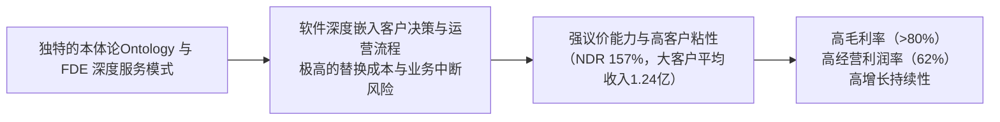

<!-- 匹配到的证券/行业：Palantir(PLTR.O) -->
操作成功

### 一页通 （Palantir (PLTR.O)）
日期：2026-08-06
内容："""
## 公司概况

Palantir 是一家以构建软件平台为核心业务的公司，其平台充当客户的核心操作系统，赋能组织大规模整合数据、决策与运营。公司成立于2003年，初期为美国情报界开发反恐软件，后逐步扩展至商业企业。目前，Palantir 已构建四大主要软件平台：Gotham（面向国防与情报）、Foundry（面向商业企业的核心数据操作系统）、Apollo（持续交付平台）以及 AIP（生成式AI平台）。公司在美国政府及国防领域占据重要供应商地位，同时其商业业务正经历高速增长，已成为美军最大的AI供应商之一。  

## 公司近况跟踪

- <strong>Q2业绩全面超预期，营收增速再创新高</strong>：2026年Q2，公司实现营收<strong>19.35亿美元</strong>，同比增长<strong>93%</strong>，环比增长<strong>19%</strong>，创上市以来最高增速。调整后营业利润率达<strong>62%</strong>，<strong>Rule of 40</strong>评分高达<strong>155%</strong>，连续12个季度扩张。业绩显著超越市场一致预期（营收约18.1亿美元，调整后EPS 0.35美元）。   

- <strong>美国商业业务爆发式增长</strong>：Q2美国商业收入达<strong>7.64亿美元</strong>，同比增长<strong>149%</strong>，环比增长<strong>28%</strong>，增速较Q1的133%进一步加快。增长主要由AIP推动现有客户扩展及新客户转化驱动，项目正从概念验证（POC）进入规模化生产部署阶段。   

- <strong>管理层提出“主权AI”新叙事</strong>：CEO Alex Karp在股东信和电话会上强调，企业客户正从依赖昂贵且存在数据泄露风险的封闭式前沿模型，转向追求“AI主权”——即掌控自身数据、业务逻辑、模型选择权及模型权重。Palantir的AIP平台被定位为实现这一目标的核心控制层，支持模型灵活切换、客户自有环境微调及持续评估。  

- <strong>美国政府业务保持强劲动能</strong>：Q2美国政府收入达<strong>8.09亿美元</strong>，同比增长<strong>90%</strong>，环比增长<strong>18%</strong>。增长受国防数字化、地缘政治及AI军事应用需求推动。Maven智能系统已成为五角大楼的正式项目，进一步巩固了长期增长前景。   

- <strong>订单与剩余履约义务大幅增长</strong>：Q2新签合同总价值（TCV）达<strong>33.73亿美元</strong>，同比增长<strong>49%</strong>。其中，美国商业TCV达<strong>21.32亿美元</strong>，同比增长<strong>153%</strong>。美国商业剩余合同价值（RDV）达<strong>62.38亿美元</strong>，同比增长<strong>124%</strong>。强劲的订单流入为未来收入提供了高可见性。  

## 短期逻辑

1. <strong>“主权AI”叙事有望驱动估值重估</strong>：Q2业绩电话会上，管理层将增长归因于企业对“AI主权”的强烈需求，即企业需在自有安全环境内掌控数据、模型和业务逻辑，避免被第三方模型厂商锁定。这一叙事有效对冲了市场对大模型颠覆软件层的担忧。若该叙事在后续季度持续获得订单验证，有望推动市场对公司护城河进行重新定价，吸引更多长期资金配置。  

2. <strong>美国商业业务加速增长，验证规模化部署拐点</strong>：Q2美国商业收入增速从Q1的133%加速至<strong>149%</strong>，且TCV增速（+153%）远超收入增速，表明需求端仍在加速。结合净美元留存率（NDR）升至<strong>157%</strong>，以及<strong>73笔</strong>超1000万美元的大额交易，显示AIP项目正从POC阶段进入大规模生产部署，现有客户正将更多业务流程迁移至Palantir平台，短期收入能见度极高。  

3. <strong>空头回补与逼空行情可能放大股价弹性</strong>：Q2业绩发布前，市场对AI颠覆软件的担忧导致公司股价年内累计下跌约29%，积累了大量空头头寸。业绩大幅超预期及指引上调后，股价单日暴涨近30%，可能触发大规模空头回补。若后续催化剂持续验证增长逻辑，逼空行情可能进一步推升股价。 

## 长期逻辑

1. <strong>“本体论（Ontology）+ FDE”模式构筑深厚护城河</strong>：Palantir的核心壁垒并非模型本身，而是其“本体论（Ontology）”层——将企业数据、业务逻辑和决策流程映射为可操作的“数字孪生”，并结合前置部署工程师（FDE）深入客户现场进行定制化落地。这种“厚平台+深度服务”的模式使客户转换成本极高。多家客户和合作伙伴反馈，Palantir的“行动引擎”拥有<strong>5年</strong>的竞争护城河，其平台远非简单的LLM包装器可比。  

2. <strong>企业级AI部署的“控制层”卡位</strong>：随着AI从实验走向生产，企业面临模型选择、成本控制、数据安全、合规审计等复杂挑战。Palantir的AIP平台正成为企业AI部署的“控制层”或“操作系统”，提供模型路由、评估、安全护栏和成本管理功能。这一卡位使其有望受益于企业AI支出的长期增长，无论底层模型如何演变。  

3. <strong>政府与国防支出的长期顺风</strong>：全球地缘政治紧张局势加剧，推动各国政府，尤其是美国国防部，大幅增加在AI、数据分析和国防现代化方面的投入。Palantir的Maven系统已成为五角大楼的正式项目，其在美国政府端的渗透率仍极低（过去12个月收入仅占五角大楼预算不到<strong>25个基点</strong>），未来成长空间巨大。政府合同周期长、粘性高，为公司提供了稳定的收入基础。   

## 风险提示

- <strong>估值与增长预期的匹配风险</strong>：尽管业绩强劲，公司股价对应极高的估值倍数（约62.7x CY27e non-GAAP PE）。当前估值已充分甚至过度反映了高增长预期。一旦未来收入增速因基数效应或竞争加剧而放缓，可能引发估值与盈利的“双杀”。管理层已提示，Q2的7.5%季度收入超预期幅度不应被视为新常态。  

- <strong>竞争格局演变的风险</strong>：尽管公司强调其“本体论”护城河，但OpenAI、Anthropic等资金雄厚的前沿模型实验室，以及Databricks等数据平台公司，均在积极招聘FDE并构建企业级AI能力。虽然目前尚未对Palantir造成实质性冲击，但长期来看，若竞争对手成功简化企业AI部署流程或提供更具成本效益的替代方案，可能侵蚀Palantir的市场份额和定价能力。  

- <strong>政府业务集中度与政策风险</strong>：公司业务高度集中于美国市场（Q2收入占比约<strong>81%</strong>），且美国政府是其最大客户之一。任何国防预算削减、政府支出优先级变化或合同流程延迟，都可能对公司业绩产生重大影响。此外，公司与政府国防及情报部门的深度绑定，也使其面临声誉风险，可能影响其海外商业拓展。  

## 近期要闻

- <strong>2026年5月5日</strong>：公司公布2026年Q1业绩，营收同比增长85%，并上调全年指引。电话会上，管理层强调了Maven系统的使用量激增，以及为支持国防工业基地而从商业部门调动资源。  

- <strong>2026年6月初</strong>：Palantir举办AIPCon 10大会，展示了AIP在多个行业的应用案例，并强调了其“AI FDE”产品在提升部署效率和自动化SAP迁移方面的能力。合作伙伴称Palantir的“行动引擎”拥有5年护城河。 

- <strong>2026年7月-8月</strong>：多家券商发布报告，围绕“AI颠覆论”展开辩论。花旗、瑞银等看多方强调公司护城河及商业业务再加速预期；汇丰等谨慎方则提示竞争风险及高估值压力。   

- <strong>2026年8月3日</strong>：公司公布Q2业绩，营收同比增长93%，大幅超预期，并显著上调全年指引。CEO提出“主权AI”叙事，股价盘后及次日大幅上涨近30%。   

## 未来催化

- <strong>2026年8月-10月</strong>：Q2业绩后的分析师日或后续行业会议（如9月的花旗全球科技会议），管理层可能就“主权AI”战略、与NVIDIA的合作细节（模型微调、后训练能力）及长期增长目标提供更清晰的路线图，有望成为股价催化剂。  

- <strong>2026年9月-10月</strong>：美国政府2027财年预算（始于2026年10月）的审议和通过进程。若国防部AI相关预算获得显著增长，将直接提振市场对Palantir政府业务持续高增长的信心。 

- <strong>2026年11月初</strong>：公司预计公布2026年Q3业绩。考虑到Q2订单和RDV的强劲增长，Q3业绩大概率继续超出市场预期。管理层对Q4及2027年的初步展望将成为市场焦点，任何关于增长可持续性的积极信号都可能推动股价上行。 

## 公司业务模式及拆分

### 业务边际变化

公司近年最核心的变化是2023年推出的AIP平台，将生成式AI能力与其现有的Foundry和Gotham平台深度整合。这标志着公司从一家“大数据分析平台”向“企业级AI操作系统”的战略转型。AIP的推出显著加速了商业客户的获取和现有客户的扩展，使公司收入增速从2023年的<strong>16.75%</strong>飙升至2026年Q2的<strong>93%</strong>。同时，公司正将战略重心押注在“主权AI”上，联手NVIDIA在企业环境内进行模型微调和后训练，让客户持有模型权重，进一步深化其平台价值。  

### 盈利模式

公司主要通过销售软件平台的订阅访问权及配套的运营维护（O&M）和专业服务来获取收入。其盈利模式的核心是<strong>技术壁垒与服务粘性的结合</strong>：一方面，其“本体论（Ontology）”平台技术复杂，深度嵌入客户决策流程，替换成本极高；另一方面，其FDE模式通过深度驻场服务，与客户共同解决问题，建立起深厚的信任和依赖关系。这种模式使其毛利率长期稳定在<strong>80%</strong>以上，并随着平台可复用能力的增强，经营杠杆持续提升。  

### 业务拆分

公司近年业务结构以政府业务为基础，商业业务为增长引擎。FY2025，政府业务收入占比<strong>54%</strong>，商业业务占比<strong>46%</strong>。进入FY2026，商业业务增速持续大幅领先，Q2占比已提升至<strong>49%</strong>。美国市场是绝对核心，Q2收入占比约<strong>81%</strong>。公司当前处于<strong>业绩兑现期</strong>，AIP产品推动的商业业务高速增长与盈利能力的快速提升同时发生。  

<strong>细分业务拆分（按客户类型）</strong>

| 业务板块 (百万美元) | FY2023 | FY2024 | FY2025 | FY2026 H1 |
| :--- | :--- | :--- | :--- | :--- |
| <strong>政府业务收入</strong> | 1,222.22 | 1,569.61 | 2,402.29 | 1,848.44 |
| 同比增速 | - | 28.4% | 53.1% | 77.7% |
| 占总收入比重 | 54.9% | 54.8% | 53.7% | 51.8% |
| <strong>商业业务收入</strong> | 1,002.80 | 1,295.90 | 2,073.16 | 1,719.61 |
| 同比增速 | - | 29.2% | 60.0% | 102.9% |
| 占总收入比重 | 45.1% | 45.2% | 46.3% | 48.2% |
| <strong>总收入</strong> | <strong>2,225.01</strong> | <strong>2,865.51</strong> | <strong>4,475.45</strong> | <strong>3,568.05</strong> |

*注：公司未按此维度披露各板块毛利率。*

<strong>政府业务（FY2026 H1）</strong>：该板块在FY2026上半年实现收入<strong>18.48亿美元</strong>，同比增长<strong>78%</strong>。增长主要由美国政府部门驱动，Q2美国政府收入同比增速高达<strong>90%</strong>，受益于国防、情报及AI军事应用需求的快速释放。Maven智能系统成为五角大楼正式项目是关键催化剂。该业务的特点是合同周期长、金额大、客户粘性极高，但受政府预算和采购流程影响较大。 

<strong>商业业务（FY2026 H1）</strong>：该板块在FY2026上半年实现收入<strong>17.20亿美元</strong>，同比增长<strong>103%</strong>，是公司增长的核心引擎。其中，美国商业业务表现尤为突出，Q2同比增速达<strong>149%</strong>。增长主要源于AIP平台推动现有客户大规模扩展部署，以及新客户转化加速。企业客户对“主权AI”的需求，即掌控自身数据和模型，正成为推动该业务增长的新叙事。该业务的净美元留存率（NDR）高达<strong>157%</strong>，表明存量客户的价值挖掘远未结束。 

## 核心竞争力

<strong>竞争要素 1：依托“本体论（Ontology）+ FDE”构筑的极高客户转换成本</strong>

- <strong>护城河定性</strong>：<strong>结构性护城河</strong>。Palantir的核心壁垒并非AI模型本身，而是其独有的“本体论（Ontology）”系统，它能将企业的数据、业务逻辑和决策流程映射为一个可操作的“数字孪生”。结合其FDE深入客户现场的定制化部署，Palantir的软件已深度嵌入客户的日常运营和决策流程中。替换Palantir不仅意味着替换一套软件，更意味着重构一套已经与业务深度融合的操作系统，转换成本和业务中断风险极高。多家客户和合作伙伴将此护城河形容为“5年”的领先优势。  

- <strong>数据验证</strong>：公司的净美元留存率（NDR）在Q2达到<strong>157%</strong>，表明现有客户不仅没有流失，反而在大幅增加支出。前20大客户过去12个月平均收入达<strong>1.24亿美元</strong>，同比增长<strong>67%</strong>。美国商业剩余合同价值（RDV）同比增长<strong>124%</strong>，显示客户正在通过更大额、更长周期的合同锁定与Palantir的合作。  

- <strong>动态演变</strong>：<strong>护城河变宽</strong>。随着AIP平台的推出，Palantir正将AI能力深度整合进其本体论中，使客户能够在其“数字孪生”上构建和部署AI代理。这进一步增强了平台对客户业务逻辑的理解和掌控，使客户更难以脱离。同时，公司提出的“主权AI”叙事，强调客户对自身数据和模型权重的掌控，正切中大型企业核心关切，进一步巩固了其作为企业AI“控制层”的地位。  

<strong>现阶段核心驱动力总结</strong>：公司的Alpha来源于其独特的“本体论+FDE”模式在AI时代构筑的深厚护城河，使其成为企业部署生产级AI的“控制层”。其Beta则受益于全球政府国防支出增加和企业AI应用从实验走向规模化部署的行业顺风。  

<strong>竞争格局传导逻辑图</strong>

## 产销链

- <strong>客户情况</strong>：
   - <strong>主要客户</strong>：公司拥有多元化的客户基础，包括美国政府及其盟友的国防和情报机构，以及金融、能源、制造、医疗等领域的商业巨头。截至Q2，公司拥有<strong>1,049</strong>家客户。虽然没有单一客户收入占比超过10%，但前20大客户过去12个月平均收入高达<strong>1.24亿美元</strong>，同比增长<strong>67%</strong>，显示出对大客户的深度渗透和成功扩展。应收账款方面，客户I占Q2末总应收账款的<strong>27%</strong>，存在一定集中度风险。  
   - <strong>新客户</strong>：公司通过AIP Bootcamp（实战训练营）等方式高效获客，能在数天内基于客户真实数据构建可运行的原型，显著缩短销售周期。Q2美国商业客户数同比增长<strong>35%</strong>，表明新客户拓展仍在快速推进。 

- <strong>供应商情况</strong>：公司的主要成本来自第三方云托管服务。2026年3月，公司修订了一份云服务协议，承诺在未来十年内至少支出<strong>56亿美元</strong>。这表明公司对云基础设施的依赖度较高，但作为大客户，具备一定的议价能力。其他成本主要包括人员薪酬和分包商费用。 

- <strong>成本传导能力</strong>：当上游云服务成本上升时，公司凭借其高毛利的软件订阅模式和强大的客户价值主张，大概率能将成本压力转嫁给客户，维持其高利润率水平。公司赚取的是<strong>技术壁垒与服务粘性带来的“品牌溢价”和“转换成本溢价”</strong>，而非单纯的“加工费”。 

## 财务数据

<strong>关键财务数据</strong>

| 指标 (百万美元) | FY2023 | FY2024 | FY2025 | FY2026 H1 |
| :--- | :--- | :--- | :--- | :--- |
| <strong>截止日期</strong> | 2023-12-31 | 2024-12-31 | 2025-12-31 | 2026-06-30 |
| <strong>营业总收入</strong> | 2,225.01 | 2,865.51 | 4,475.45 | 3,568.05 |
| 收入同比 | 16.75% | 28.79% | 56.18% | 89.03% |
| <strong>营业成本</strong> | 431.11 | 565.99 | 789.18 | 512.67 |
| <strong>毛利润</strong> | 1,793.91 | 2,299.52 | 3,686.27 | 3,055.38 |
| 毛利率 | 80.62% | 80.25% | 82.37% | 85.63% |
| <strong>营业利润</strong> | 119.97 | 310.40 | 1,414.02 | 1,666.00 |
| 营业利润率 | 5.39% | 10.83% | 31.59% | 46.69% |
| <strong>归母净利润</strong> | 209.83 | 462.19 | 1,625.03 | 1,932.42 |
| 归母净利率 | 9.43% | 16.13% | 36.31% | 54.16% |
| <strong>稀释每股收益 (美元)</strong> | 0.09 | 0.19 | 0.63 | 0.75 |
| <strong>自由现金流</strong> | - | - | 2,100.60 | - |

*注：自由现金流数据根据财报数据计算，FY2025为2,100.60百万美元。*

<strong>财务分析</strong>

- <strong>成长能力</strong>：公司营收增速呈显著加速态势，从FY2023的<strong>16.75%</strong>飙升至FY2026 H1的<strong>89.03%</strong>。这一增长主要由AIP产品驱动的美国商业业务爆发式增长所贡献，FY2026 Q2该板块增速高达<strong>149%</strong>。GAAP净利润增速更为惊人，FY2026 H1同比增长<strong>257.35%</strong>，显示出极强的盈利增长弹性。 

- <strong>盈利能力</strong>：公司毛利率持续提升，FY2026 H1达到<strong>85.63%</strong>，体现了高毛利的软件订阅模式及平台复用性带来的成本摊薄效应。营业利润率从FY2023的<strong>5.39%</strong>急剧扩张至FY2026 H1的<strong>46.69%</strong>，验证了其商业模式的经营杠杆威力。调整后营业利润率在Q2更是达到<strong>62%</strong>，冠绝软件行业。 

- <strong>盈余质量</strong>：公司现金流表现优异。FY2026 H1经营活动现金流净额高达<strong>21.15亿美元</strong>，远超同期<strong>19.42亿美元</strong>的净利润，显示利润的现金含量极高。公司拥有大量现金储备（现金及短期投资合计<strong>94.09亿美元</strong>），无有息负债，财务状况极为健康。 

## 行业及竞争分析

Palantir 处于一个交汇点，其业务同时涉及<strong>企业级AI应用平台</strong>和<strong>政府国防数据分析</strong>两个细分市场。 

- <strong>企业级AI应用平台市场</strong>：该市场正处于早期爆发阶段。Gartner预测，到2028年将有超过60%的企业采用某种形式的代理式AI（Agentic AI）。企业需求正从简单的模型调用，转向如何安全、高效地将AI嵌入核心业务流程，并实现可衡量的投资回报率（ROI）。这要求平台具备数据整合、业务逻辑映射（本体论）、模型路由与评估、安全护栏及行动执行等全栈能力。Palantir的AIP平台正是这一需求的直接受益者。竞争格局方面，主要竞争对手包括：1）大型独立软件供应商（ISV）如Salesforce、ServiceNow，它们正将AI功能加入现有产品；2）数据平台公司如Databricks、Snowflake，它们从数据层向上构建AI能力；3）前沿AI实验室如OpenAI、Anthropic，它们从模型层向下探索企业应用。Palantir的差异化优势在于其“本体论”层和深度服务的FDE模式，使其在处理高度复杂、定制化的核心业务决策场景时具备独特优势。 

- <strong>政府国防数据分析市场</strong>：这是一个高壁垒、高粘性的市场。全球地缘政治紧张局势推动各国政府，尤其是美国国防部，加大对AI和数据分析的投入，以提升军事情报、作战指挥和后勤保障效率。Palantir的Gotham平台和Maven系统是该领域的领导者。其竞争优势在于长期服务国防客户积累的深厚信任、处理高密级数据的安全资质，以及对复杂军事作战流程的深刻理解。主要竞争对手为传统的国防承包商（如Lockheed Martin、Raytheon）和系统集成商，但它们通常缺乏Palantir的现代软件工程能力和AI原生平台。 

<strong>可比公司</strong>

| 公司名称 | 股票代码 | 对标维度 | 分析 |
| :--- | :--- | :--- | :--- |
| Datadog | DDOG | 高增长、高利润率SaaS | 同为高增长SaaS公司，但Datadog专注于IT基础设施监控，而Palantir聚焦于业务决策层的AI操作系统。两者在应用场景上差异显著。 |
| Snowflake | SNOW | 数据平台、AI能力 | Snowflake是云数据仓库领导者，正向上构建AI能力。Palantir则从应用层向下整合数据。两者存在竞合关系，但Palantir的“本体论”层是其差异化关键。 |
| Microsoft | MSFT | 企业级AI、政府云 | 微软通过Azure OpenAI Service和Copilot提供广泛的AI服务，并与政府有深厚关系。它是Palantir在商业和政府市场的全面竞争对手，但Palantir在深度定制化决策系统方面更为专注。 |

<strong>总结分析</strong>：Palantir在企业级AI应用领域开辟了一个独特的生态位，即“AI决策操作系统”。与提供通用工具的SaaS公司或提供底层模型的AI实验室不同，Palantir通过其“本体论+FDE”模式，直接切入客户最核心的业务决策流程，从而建立了极高的转换成本和议价能力。其面临的挑战在于，如何在与资金雄厚、技术迭代迅速的竞争对手的长期竞赛中，持续保持其“厚平台”的领先性。  

## 市场焦点议题

<strong>议题一：高增长的可持续性与“主权AI”叙事的验证</strong>

- <strong>背景</strong>：公司营收已连续12个季度加速增长，Q2增速达93%。市场担忧随着基数效应显现，增速是否即将见顶。管理层在Q2提出“主权AI”新叙事，试图将增长归因于更深层的企业需求转变，以论证增长的长期性。 
- <strong>问题列表</strong>：
   - Q2美国商业TCV增速（+153%）远超收入增速（+149%），这一领先指标能否在未来2-3个季度持续，以支撑2027年的高增长预期？
   - “主权AI”叙事能否转化为具体的财务指标，例如，是否有更多客户选择与Palantir签订长期、大额的“全栈迁移”合同？
   - 管理层指引的2026年全年82%的营收增速，是否已充分反映了Q2的超预期表现，还是仍显保守？

<strong>议题二：来自前沿AI实验室的竞争威胁</strong>

- <strong>背景</strong>：OpenAI、Anthropic等公司正积极招聘FDE，并推出企业级产品（如OpenAI的Frontier），市场担忧其可能从模型层向下侵蚀Palantir的市场空间。这是导致公司股价在Q2业绩前大幅回调的核心原因之一。  
- <strong>问题列表</strong>：
   - 在Q2电话会上，管理层称在一次客户对比测试中，通过“FDE+AIP”模式击败了前沿实验室并赢得千万美元合同。这类正面竞争案例是否会越来越频繁？
   - 公司宣布与NVIDIA合作，在企业环境内微调开源模型。这是否意味着公司战略正从“模型无关”转向“主动引导客户使用更经济的开源模型”，以对抗闭源模型厂商的潜在威胁？
   - 如何量化来自AI实验室的竞争压力？例如，客户流失率或项目竞标失败率是否有上升趋势？

<strong>议题三：政府业务的预算依赖与集中度风险</strong>

- <strong>背景</strong>：美国政府业务是公司的重要支柱，Q2收入占比达42%。该业务高度依赖国防预算和特定大型项目（如Maven）。任何预算削减或项目延迟都可能对公司业绩产生重大影响。  
- <strong>问题列表</strong>：
   - 公司政府业务增长在多大程度上依赖于2026财年的国防预算拨款？若2027财年出现持续决议（CR）导致预算延迟，公司有何应对预案？
   - 公司应收账款高度集中于“客户I”（占比27%），该客户的支付能力和合同续约前景如何？
   - 公司在海外政府市场的拓展进展如何？能否有效分散对美国单一市场的依赖？

## 市场分歧探讨

<strong>核心分歧：当前的高增长是AI驱动的结构性需求爆发，还是不可持续的短期“淘金热”？</strong>

- <strong>看多方逻辑</strong>：认为Palantir正处于企业AI部署的“控制层”卡位战中，其增长是结构性的。核心论据包括：1）<strong>“主权AI”叙事</strong>切中了大型企业对数据安全、模型控制和避免供应商锁定的根本性需求，这是一个长期趋势；2）<strong>极高的转换成本</strong>（NDR 157%）证明其产品已深度嵌入客户核心业务，并非浅层应用；3）<strong>订单和RDV等先行指标</strong>的增速远超收入增速，预示着增长的飞轮仍在加速，远未见顶。  

- <strong>谨慎方逻辑</strong>：认为当前增长部分源于AI热潮下的短期支出激增，且面临多重风险。核心论据包括：1）<strong>估值已极度透支预期</strong>，当前约62.7x CY27e non-GAAP PE的估值，已计入未来多年高增长，容错率极低；2）<strong>竞争格局存在不确定性</strong>，尽管目前领先，但资金雄厚的前沿模型实验室和大型软件公司正全力追赶，未来可能侵蚀其市场份额；3）<strong>增速放缓是数学必然</strong>，随着收入基数迅速扩大，维持90%以上的增速难度极大，任何减速都可能被市场放大解读，引发估值收缩。 

<strong>总结分析</strong>：当前市场分歧的本质在于对Palantir护城河“宽度”和“长度”的判断。看多方相信其“本体论+FDE”模式在AI时代构筑了比传统SaaS更深、更宽的护城河，因此应享有极高的估值溢价。谨慎方则认为，技术迭代和竞争可能快速侵蚀这一护城河，且其高人力投入的FDE模式限制了长期盈利能力的上限。Q2业绩和“主权AI”叙事的提出，暂时强化了看多方的逻辑，但长期争论远未结束。  

## 盈利预测与估值

<strong>管理层最新指引（FY2026）</strong>：
- 全年营收：<strong>81.50亿至81.58亿美元</strong>，同比增长约<strong>82%</strong>。   
- 美国商业业务营收：超过<strong>34.24亿美元</strong>，同比增长至少<strong>134%</strong>。   
- 调整后营业利润：<strong>48.89亿至48.97亿美元</strong>。   
- 调整后自由现金流：<strong>45亿至47亿美元</strong>。   

<strong>券商盈利预测与估值</strong>

| 机构 (研报发布时间) | 评级 | 目标价 (美元) | 营业收入 (百万美元) | FY2025A | FY2026E | FY2027E | FY2028E |
| :--- | :--- | :--- | :--- | :--- | :--- | :--- | :--- |
| 花旗 (2026-08-04) | 买入 | 245.00 | 营业收入 | 4,475 | 8,199 | 13,409 | 20,424 |
| | | | 调整后EPS (美元) | 0.75 | 1.72 | 2.61 | 3.84 |
| 高盛 (2026-08-03) | 中性 | 204.00 | 营业收入 | 4,475.4 | 8,371.2 | 12,870.3 | 16,821.4 |
| | | | 调整后EPS (美元) | 0.74 | 1.62 | 2.39 | 3.17 |
| 汇丰 (2026-08-05) | 持有 | 162.00 | 营业收入 | 4,475 | 8,312 | 12,640 | 16,791 |
| | | | 调整后EPS (美元) | 0.75 | 1.68 | 2.55 | 3.21 |
| 摩根士丹利 (2026-08-04) | 均配 | 205.00 | 营业收入 | 4,475 | 8,222 | 11,771 | - |
| | | | 调整后EPS (美元) | 0.74 | 1.73 | 2.48 | - |
| 中金公司 (2026-08-05) | 中性 | 168.00 | 营业收入 | 4,475 | 8,222 | 11,771 | - |
| | | | 调整后EPS (美元) | 0.74 | 1.73 | 2.48 | - |

<strong>盈利预测与估值分析</strong>：上述券商在Q2业绩后均大幅上调了盈利预测，但目标价和评级存在分歧。看多方（如花旗）基于更高的增长预期（5年营收CAGR约58%）和估值倍数（67x FY28E EV/FCF）给出245美元目标价。谨慎方（如汇丰、中金）虽然也上调了预测，但给予的估值倍数较低（如汇丰使用1.75x PEG），目标价在162-168美元，认为当前股价已反映其强劲基本面。机构间的核心分歧在于对公司长期增长中枢和应享有的估值溢价存在不同判断。估值方法上，由于公司利润刚刚释放，多数机构采用远期EV/FCF或PEG估值法。
"""
