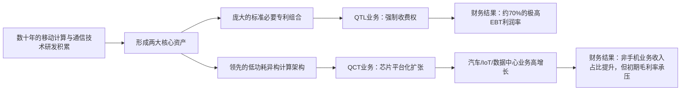

<!-- 匹配到的证券/行业：高通(QCOM.O) -->
操作成功

### 一页通 （高通 (QCOM.O)）
日期：2026-08-06
内容："""
## 公司概况

高通是全球无线通信技术与半导体平台的领导者，核心业务分为两大板块：<strong>QCT（半导体业务）</strong> 负责开发和销售基于骁龙（Snapdragon）和Dragonwing平台的集成芯片及系统软件，覆盖手机、汽车和物联网终端；<strong>QTL（专利授权业务）</strong> 负责向全球通信设备制造商收取基于整机售价百分比的专利授权费。公司正从手机芯片巨头向“手机+汽车+物联网+数据中心”的多元化计算平台公司转型，其长期战略目标是到2029财年实现非手机业务收入400亿美元。  

## 公司近况跟踪

- <strong>FY26Q3业绩与FY26Q4指引</strong>：FY26Q3（截至2026年6月28日）营收99.47亿美元，同比-4%，略超预期；Non-GAAP EPS为2.21美元，同比-20%，与预期持平。但FY26Q4（截至2026年9月）EPS指引中值2.15美元，显著低于市场预期的2.35美元，主要受QCT毛利率承压和苹果收入加速下滑影响。       
- <strong>全面提价以应对成本通胀</strong>：管理层宣布自<strong>2026年9月1日</strong>起对全系列芯片实施<strong>两位数百分比的涨价</strong>，以传导晶圆制造、封装测试、存储等全供应链环节的成本上涨。提价将逐步生效，目标是推动QCT毛利率在未来几个季度重回<strong>48%-50%</strong>的历史区间。                
- <strong>苹果业务退出加速</strong>：由于供应限制和苹果自研基带推进，高通在下一代iPhone中的基带份额将<strong>远低于此前预估的20%</strong>，预计苹果相关产品收入从FY26Q4到FY27Q1将环比下降约<strong>50%</strong>。管理层预计FY27财年来自苹果的产品收入将低于此前“略高于20亿美元”的指引。                
- <strong>汽车业务目标上调</strong>：FY26Q3汽车业务营收15.88亿美元，同比+61%，创历史新高。公司将FY26财年末汽车业务年化营收目标从60亿美元上调至约<strong>70亿美元</strong>，并宣布与宝马达成未来十年数字座舱与ADAS/AD主计算芯片供应商的里程碑协议。                
- <strong>数据中心业务即将产生收入</strong>：两个定制化ASIC项目已获得采购订单并启动晶圆生产，预计从<strong>FY27Q1（2026年12月季度）</strong>开始贡献收入。第一代高带宽计算（HBC）芯片已完成流片，计划于<strong>2027年中</strong>推出。公司重申FY27数据中心收入目标为50亿美元，FY29为150亿美元以上。                

## 短期逻辑

1. <strong>苹果业务“硬着陆”的利空出尽</strong>：市场长期诟病高通对苹果的依赖，而本次财报及指引确认苹果基带收入将在未来两个季度加速归零。尽管短期对EPS造成冲击，但这实质上消除了长期悬在股价上的最大不确定性。管理层明确表示，FY27非手机业务超60%的同比增长将完全替代苹果产品收入。若市场将此视为一次性利空出尽，而非持续性经营恶化，股价可能在对苹果业务完成定价后迎来重估。                

2. <strong>提价对毛利率的修复节奏与效果</strong>：高通宣布自9月1日起全系列芯片提价两位数百分比，这是近年来最明确的一次主动定价权行使。由于半导体行业投入成本全面上涨，此次提价具备行业普遍性（联发科已先行涨价）。关键观察点在于提价能否在FY27H1有效对冲成本通胀并推动QCT毛利率回升至48%-50%区间。若FY27Q1或Q2的财报验证毛利率触底回升，将显著提振市场信心。                

3. <strong>数据中心业务从“故事”到“收入”的实质性跨越</strong>：高通的数据中心战略在6月投资者日上充分阐述，但市场因缺乏收入验证而持怀疑态度。随着两个定制ASIC项目在12月季度开始贡献收入，公司将从“AI叙事”阶段进入“业绩兑现”阶段。初期收入规模（预计单季度约6亿美元）虽小，但“从0到1”的突破对估值逻辑的切换至关重要，可能推动部分投资者将其数据中心业务纳入估值框架。                

## 长期逻辑

1. <strong>从“连接”到“计算”的平台化扩张</strong>：高通正将其在移动端积累的低功耗、高性能计算架构（Oryon CPU、Hexagon NPU）横向扩展至汽车、物联网和数据中心。其核心逻辑在于，随着AI推理从云端向边缘和终端扩散，对“每瓦特性能”的要求变得空前重要，而这正是高通在手机芯片领域积累数十年的核心技术壁垒。若其HBC（高带宽计算）技术能如宣传所言，实现比HBM高6倍的每瓦特带宽，则有可能在AI推理市场开辟一条差异化路径。   

2. <strong>汽车业务的平台型锁定与内容价值倍增</strong>：高通在汽车领域的策略已从单点芯片供应升级为“数字底盘”平台型合作。与宝马达成的十年期主计算芯片协议是这一策略的典型体现。随着汽车电子电气架构向中央计算平台演进，高通凭借在智能座舱和ADAS领域的完整IP组合，有望在单车价值量上实现从当前数十美元向数百甚至上千美元的跃升。公司汽车业务设计订单管线已达650亿美元，为中长期15%的复合增长率提供了较高的可见度。                

3. <strong>QTL业务作为“现金牛”的持续性与韧性</strong>：QTL业务以约70%的EBT利润率为公司提供了稳定的现金流和试错空间。尽管面临华为未续约、苹果授权协议2027年4月到期等风险，但该业务FY26Q3仍实现12.78亿美元收入，展现出较强韧性。只要全球智能手机出货量不出现断崖式下滑，QTL的现金流生成能力大概率能维持，为公司在数据中心等新业务的投资提供资金支持。                

## 风险提示

- <strong>苹果专利授权协议到期风险</strong>：高通与苹果的QTL专利授权协议将于<strong>2027年4月</strong>到期。鉴于苹果已成功自研基带芯片并加速替代高通产品，其在续约谈判中可能寻求大幅降低专利费率，甚至挑战授权模式的合法性。该协议每年贡献约<strong>15-20亿美元</strong>高利润率收入，若未能续约或费率显著下调，将对公司盈利产生重大冲击。                
- <strong>数据中心业务执行与竞争风险</strong>：高通进入的是一个由英伟达、AMD、英特尔及诸多ASIC初创公司激烈争夺的市场。其定制ASIC业务虽已获得两个客户，但初期毛利率显著低于公司平均水平，预计将拖累QCT整体毛利率<strong>1.5-2个百分点</strong>。其服务器CPU产品需至FY28H2才能规模贡献收入，届时将直面英特尔和AMD的成熟生态竞争。若技术落地不及预期或客户项目延期，高额的研发投入将直接侵蚀利润。                
- <strong>智能手机市场结构性逆风</strong>：受存储芯片价格持续上涨和供应短缺影响，全球智能手机市场在2026年预计出现低双位数的销量下滑。这一趋势不仅直接冲击高通QCT手机芯片出货量，还迫使手机OEM厂商在高端机型中选用上一代或规格较低的芯片以控制成本，从而对高通的产品组合和利润率产生双重挤压。若存储价格维持高位至2027年，手机业务的复苏将慢于预期。                

## 近期要闻

- <strong>2026年6月24-25日</strong>：高通举办2026年投资者日，公布全面数据中心产品路线图，涵盖定制ASIC、AI加速器、服务器CPU和连接产品，并宣布Meta为其数据中心CPU客户。公司上调FY29非手机业务收入目标至400亿美元。   
- <strong>2026年7月24日</strong>：据报道，高通已向客户发送涨价通知函，宣布自9月1日起对全系列芯片产品实施两位数百分比的价格上调，以应对供应链成本上涨。          
- <strong>2026年7月29日</strong>：高通发布FY26Q3财报，同时宣布与宝马达成合作协议，成为其未来十年数字座舱与ADAS/AD系统的主计算芯片供应商；并宣布完成对AI软件基础设施公司Modular的收购。                

## 未来催化

- <strong>2026年9月</strong>：高通计划在月底举办的骁龙峰会上发布两款新一代骁龙旗舰移动平台，预计将搭载新一代神经渲染技术和升级的AI引擎，可能成为手机业务产品周期的重要催化剂。 
- <strong>2026年10-11月</strong>：FY26Q4财报发布。市场将重点关注QCT毛利率是否在提价措施下出现企稳迹象，以及数据中心业务在12月季度开始贡献收入前的客户进展更新。                
- <strong>2026年12月季度</strong>：高通数据中心定制ASIC业务预计将首次产生规模收入。这是验证公司AI数据中心战略从“规划”走向“落地”的关键里程碑，任何超预期的客户需求或收入指引上调都可能成为股价的强力催化剂。                

## 公司业务模式及拆分

<strong>盈利模式</strong>：高通通过两种模式获利。<strong>QCT业务</strong>依靠设计和销售基于先进制程的集成芯片（SoC）及配套软件，赚取“技术溢价”和“规模制造”的钱，其盈利水平受产品组合、代工成本和市场竞争影响。<strong>QTL业务</strong>则依靠庞大的标准必要专利（SEP）组合，向全球手机制造商收取基于整机售价百分比的专利费，赚取的是“知识产权垄断”的钱，具有极高的利润率和对手机出货量的直接关联性。 

<strong>业务拆分</strong>：
公司近年业务结构正经历根本性转变。FY26Q3，手机业务虽仍占QCT营收的60%，但同比已下降20%。汽车和物联网业务合计占比已达40%，且分别实现61%和9%的同比增长。公司正处于“新旧动能转换”的关键期：传统手机业务因行业逆风和苹果流失而承压，汽车和物联网业务则处于高速成长期，而数据中心业务即将从零开始贡献收入。                 

<strong>细分业务拆分（按QCT内部应用领域）</strong>

| 业务板块 | FY25Q3 收入 (亿美元) | FY26Q3 收入 (亿美元) | 同比变化 | FY26Q3 收入占比 |
| :--- | :--- | :--- | :--- | :--- |
| 手机 (Handsets) | 63.28 | 50.86 | -20% | 60% |
| 汽车 (Automotive) | 9.84 | 15.88 | +61% | 19% |
| 物联网 (IoT) | 16.81 | 18.30 | +9% | 21% |
| <strong>QCT总收入</strong> | <strong>89.93</strong> | <strong>85.04</strong> | <strong>-5%</strong> | <strong>100%</strong> |

*注：数据来源于公司FY26Q3财报及业绩会。毛利率数据未按此维度详细披露。*

- <strong>手机业务</strong>：FY26Q3营收50.86亿美元，同比-20%。主要受两大因素拖累：一是全行业存储芯片价格上涨和供应短缺，导致手机OEM厂商削减芯片采购订单并消化渠道库存；二是苹果自研基带加速导入，高通在下一代iPhone中的份额将远低于此前20%的预期。管理层判断来自中国OEM的手机收入已于FY26Q3触底，并指引FY26Q4实现环比双位数增长。为应对成本压力，公司已宣布自9月1日起全面提价。                 

- <strong>汽车业务</strong>：FY26Q3营收15.88亿美元，同比+61%，连续多个季度创历史新高。增长由“量”（新车型搭载骁龙数字座舱和ADAS产品出货量增加）和“价”（产品组合优化及平均售价提升）共同驱动。公司与宝马达成十年期主计算芯片供应协议，标志着其正从单点芯片供应商升级为战略平台合作伙伴。公司已将FY26财年末汽车业务年化营收目标上调至约70亿美元。                 

- <strong>物联网业务</strong>：FY26Q3营收18.30亿美元，同比+9%。增长主要由工业、网络和机器人等领域的强劲需求驱动，但部分被消费类平板等产品因内存成本上涨而需求疲软所抵消。公司正在将物联网业务细分为“个人AI与计算”（如AI PC、智能眼镜）和“工业、网络与机器人”两大领域，并计划通过提供完整的软硬件参考设计平台（如Snapdragon Start智能眼镜计划）来加速增长。                 

## 核心竞争力

<strong>竞争要素 1：依托标准必要专利组合构筑的“收费关卡”</strong>

- <strong>护城河定性</strong>：<strong>结构性护城河</strong>。高通在3G、4G、5G等蜂窝通信技术领域拥有大量无法绕开的标准必要专利（SEP）。任何制造支持这些标准的设备的厂商，原则上都需要获得高通的专利授权并支付费用。这种由国际标准组织和法律体系共同构筑的壁垒，具有强制性、长期性和全球性。 
- <strong>数据验证</strong>：QTL业务在FY26Q3以占公司总收入约13%的营收，贡献了约33%的税前利润（EBT），其EBT利润率高达<strong>69%</strong>。这种“低投入、高产出”的财务特征，是知识产权垄断权的直接体现。 
- <strong>动态演变</strong>：<strong>维持</strong>。尽管面临华为未续约、苹果协议2027年到期等挑战，但全球5G/6G标准的持续演进和蜂窝技术向汽车、物联网等领域的渗透，为QTL的长期收费基础提供了支撑。然而，各国监管机构对SEP定价和授权模式的审查日益严格，可能对未来的费率水平构成压力。 

<strong>竞争要素 2：从移动端向边缘和云端延伸的低功耗计算架构</strong>

- <strong>护城河定性</strong>：<strong>行业阶段性红利</strong>，有潜力转化为结构性优势。高通在智能手机时代积累的异构计算、低功耗AI引擎（NPU）和系统级芯片（SoC）设计能力，正契合当前AI推理从云端向边缘和终端扩散的趋势。其“每瓦特性能”优势在功耗和散热受限的汽车、物联网和新兴的AI推理场景中具有差异化竞争力。   
- <strong>数据验证</strong>：汽车业务FY26Q3营收同比+61%，设计订单管线达650亿美元，表明其移动技术平台化复用的策略已获得汽车产业的初步验证。公司宣称其HBC技术可实现比HBM高6倍的每瓦特带宽，若该指标在客户验证中兑现，将成为数据中心业务的关键突破口。*(注：当前公开资料缺乏有效量化数据交叉验证该特征)*
- <strong>动态演变</strong>：<strong>护城河变宽（巩固）</strong>。随着公司成功收购Alphawave（高速连接IP）和Modular（AI软件平台），其正从单纯的芯片供应商向“芯片+连接+软件”的全栈平台提供商演进。这有助于增强客户粘性，并构建更完整的生态壁垒。   

<strong>现阶段核心驱动力总结</strong>：公司的Alpha在于其独特的SEP收费模式和向高增长非手机市场成功横向扩张的能力，而Beta则高度关联于全球智能手机市场的景气度。当前，Alpha属性正在增强（汽车、数据中心贡献增加），而Beta属性（手机周期）正经历逆风。 

<strong>竞争格局传导逻辑图</strong>：

## 产销链

- <strong>客户情况</strong>：公司客户集中度较高。FY25财年，来自<strong>Apple、Samsung和Xiaomi</strong>的收入各自均超过总收入的10%。其中，Apple作为最大客户之一，其业务正加速流失，预计FY27财年贡献将大幅缩减。Samsung是另一重要客户，其约70%的旗舰设备采用骁龙平台。中国OEM厂商（如Xiaomi、OPPO、vivo）是安卓手机收入的主要来源，该部分收入被认为已在FY26Q3触底。新客户方面，公司在数据中心领域已宣布<strong>Meta</strong>为其CPU客户，并与两家未具名的全球规模超大规模客户签订了定制ASIC合同。                  

- <strong>供应商情况</strong>：高通采用<strong>fabless（无晶圆厂）</strong>模式，主要依赖第三方供应商进行晶圆制造、封装和测试。其核心制造合作伙伴包括<strong>台积电（TSMC）、三星电子（Samsung Electronics）和格芯（GlobalFoundries）</strong>。当前，整个半导体供应链面临产能紧张和投入成本全面上涨的压力，从晶圆、封装测试到存储芯片等环节均出现短缺和涨价。这直接推高了高通的芯片成本，是公司决定自9月1日起全面提价的根本原因。  

- <strong>成本传导能力</strong>：当前，高通面临上游成本上涨的压力，但其对下游客户的提价能力受到市场环境的制约。在手机市场，由于需求疲软和OEM厂商成本敏感度提高，高通虽宣布提价，但实际执行效果和传导速度存在不确定性，管理层也承认“成本与定价之间的暂时脱节导致毛利率暂时略有下降”。在汽车和物联网市场，由于其技术平台化带来的附加值较高，议价能力相对更强。总体而言，公司赚取的是“技术溢价”，但短期内正受到“周期成本”的挤压。                 

## 财务数据

<strong>关键财务数据</strong>

| 指标 | FY2023 | FY2024 | FY2025 | FY26 Q1-Q3 |
| :--- | :--- | :--- | :--- | :--- |
| <strong>截止日期</strong> | 2023-09-24 | 2024-09-29 | 2025-09-28 | 2026-06-28 |
| <strong>营业收入 (亿美元)</strong> | 358.20 | 389.62 | 442.84 | 327.98 |
| 同比变化 | -18.96% | 8.77% | 13.66% | -0.65% |
| <strong>营业成本 (亿美元)</strong> | 158.69 | 170.60 | 197.38 | 151.38 |
| <strong>毛利润 (亿美元)</strong> | 199.51 | 219.02 | 245.46 | 176.60 |
| <strong>毛利率</strong> | 55.7% | 56.2% | 55.4% | 53.8% |
| <strong>营业利润 (亿美元)</strong> | 86.50 | 102.50 | 123.94 | 73.99 |
| <strong>归母净利润 (亿美元)</strong> | 72.32 | 101.42 | 55.41 | 123.77 |
| 同比变化 | -44.09% | 40.24% | -45.37% | 42.95% |
| <strong>稀释每股收益 (美元)</strong> | 6.42 | 8.97 | 5.01 | 11.53 |
| <strong>经营活动现金流净额 (亿美元)</strong> | 112.99 | 122.02 | 140.12 | 84.05 |
| <strong>自由现金流 (亿美元)</strong> | 98.49 | 111.61 | 128.20 | 68.27 |

*注：自由现金流 = 经营活动现金流净额 - 资本性支出。FY25归母净利润大幅下降系《大美丽法案》下确认了57亿美元递延税资产估值备抵的一次性非现金费用所致。FY26 Q1-Q3归母净利润包含Q2释放该估值备抵带来的57亿美元非现金税收优惠。*

<strong>财务分析</strong>：

- <strong>盈利能力</strong>：公司毛利率在FY23-FY25期间稳定在55%-56%的高位，但FY26前三季度下滑至53.8%，反映出手机业务疲软和投入成本上涨的压力。剔除FY25和FY26的一次性税收项目影响，公司的正常化净利润展现出较强的盈利韧性。QTL业务以约70%的EBT利润率为公司提供了稳定的利润基石。 

- <strong>成长能力</strong>：营收在FY23经历下滑后，FY24和FY25重回增长轨道，但FY26前三季度增长近乎停滞，主要受手机业务拖累。汽车和物联网业务成为新的增长引擎，但短期内体量尚不足以完全对冲手机业务的下滑。市场关注点在于非手机业务能否在FY27实现管理层指引的60%以上同比增长。                 

- <strong>运营能力与现金流</strong>：公司现金流生成能力强劲，FY23-FY25经营活动现金流净额持续增长。FY26前三季度，尽管利润表受非现金项目影响较大，但经营活动现金流仍达到84.05亿美元。公司持续通过大规模股票回购（FY26前三季度耗资68.06亿美元）和派发股息（28.68亿美元）回馈股东，显示出对自身现金流的信心。 

## 行业及竞争分析

高通所处的核心行业可细分为三个赛道：

1.  <strong>智能手机SoC市场</strong>：这是一个成熟且高度集中的市场。增长驱动力已从“量”的扩张转向“价”的提升（5G渗透、AI功能、高端化）。当前行业正面临存储芯片涨价和供应短缺带来的显著逆风，导致整体出货量承压。竞争格局上，高通在高端安卓市场占据主导地位，但面临<strong>联发科（MediaTek）</strong>在中低端市场的强力竞争，以及主要客户（如Apple、Samsung）通过自研芯片实现垂直整合的威胁。                  

2.  <strong>汽车半导体市场</strong>：该市场正处于由智能座舱、自动驾驶和软件定义汽车驱动的结构性增长期。芯片含量和价值量显著提升。高通凭借其在移动领域积累的CPU/GPU/AI引擎和无线连接技术，迅速成为智能座舱和ADAS芯片的领导者。主要竞争对手包括<strong>英特尔（Mobileye）、英伟达（Nvidia）</strong>以及传统汽车芯片巨头<strong>恩智浦（NXP）、德州仪器（TI）</strong>等。                  

3.  <strong>数据中心AI芯片市场</strong>：这是高通最新进入的市场，规模巨大且增长迅速，主要由AI推理需求驱动。竞争异常激烈，<strong>英伟达（Nvidia）</strong>凭借其GPU和CUDA生态占据绝对主导地位，<strong>AMD</strong>和<strong>英特尔（Intel）</strong>也在积极布局。此外，云服务商（如AWS、Google）的自研定制芯片（ASIC）趋势也为高通提供了机会。高通以低功耗CPU和创新的HBC内存架构作为差异化切入点。                  

<strong>可比公司</strong>：

| 公司名称 | 股票代码 | 对标维度 | 分析 |
| :--- | :--- | :--- | :--- |
| 联发科 (MediaTek) | 2454.TW | 智能手机SoC | 高通在高端安卓市场的主要竞争对手，两者在技术、客户和定价上全面竞争。联发科同样受到手机市场逆风影响，并已宣布涨价。 |
| 英伟达 (Nvidia) | NVDA | 数据中心AI芯片 | 数据中心AI加速器市场的绝对领导者，其GPU和CUDA软件生态构成强大壁垒。高通以低功耗推理和HBC架构作为差异化竞争点，但尚处早期阶段。 |
| 恩智浦 (NXP) | NXPI | 汽车半导体 | 传统汽车芯片巨头，产品线广泛。高通在智能座舱和ADAS领域对其构成直接竞争，增长势头更猛，但在传统车身控制等领域布局较少。 |
| 博通 (Broadcom) | AVGO | 定制ASIC / 专利授权 | 在数据中心定制ASIC（XPU）领域是主要玩家，与高通新业务直接竞争。其专利授权业务模式与高通QTL有相似之处，但覆盖领域不同。 |

<strong>总结分析</strong>：高通正处于从“一家独大”（手机）到“三线作战”（手机、汽车、数据中心）的战略转型期。在手机市场，它是守成者，面临增长放缓和份额流失的挑战；在汽车市场，它是强势的进攻者，凭借平台化方案快速获取份额；在数据中心市场，它则是挑战者，试图凭借能效优势在巨头林立的格局中开辟新天地。其核心竞争力——低功耗计算和通信技术——在不同市场的可迁移性是决定其转型成败的关键。                  

## 市场焦点议题

<strong>议题一：手机业务盈利能力的修复路径与时间表</strong>

- <strong>背景</strong>：FY26Q3手机业务营收同比-20%，QCT EBT利润率降至26%。成本上涨和产品组合恶化共同挤压了利润率。公司已宣布提价，但市场对其效果存疑。                
- <strong>问题列表</strong>：
  - 9月1日的提价能否在FY27H1完全对冲掉成本上涨的影响？提价是否会进一步抑制已经疲软的手机芯片需求？
  - 管理层指引FY26Q3为中国OEM手机收入底部，这一判断是基于真实需求回暖，还是仅仅是库存见底后的被动补库？
  - 在苹果收入加速归零和安卓市场整体下滑的背景下，手机业务何时能恢复至同比正增长？

<strong>议题二：数据中心业务的真实市场空间与竞争力评估</strong>

- <strong>背景</strong>：高通在投资者日上提出了雄心勃勃的数据中心收入目标（FY27 50亿美元，FY29 150亿美元），但市场对其在强敌环伺下的竞争力和盈利能力持高度怀疑态度。                
- <strong>问题列表</strong>：
  - 已宣布的两个定制ASIC客户和Meta CPU客户，其长期订单承诺和收入可见度如何？能否支撑FY27 50亿美元的目标？
  - 高通宣称的HBC内存架构在能效上的优势，能否在客户的实际工作负载测试中得到验证，并转化为显著的TCO（总拥有成本）优势？
  - 数据中心业务初期毛利率显著偏低，其对整体利润率的拖累将持续多久？规模效应何时能使其利润率接近公司平均水平？

<strong>议题三：苹果专利授权续约的重大不确定性</strong>

- <strong>背景</strong>：高通与苹果的QTL协议将于2027年4月到期。鉴于苹果已成功自研基带，其在续约谈判中的立场将更加强硬。                
- <strong>问题列表</strong>：
  - 苹果是否会寻求大幅降低专利费率，或要求将授权模式从整机级别改为芯片级别？
  - 若双方无法达成新协议，高通是否会通过法律诉讼来维护其专利权？诉讼周期和潜在结果如何？
  - 失去或大幅削减来自苹果的授权收入（每年约15-20亿美元），将对公司现金流和长期投资能力产生多大影响？

## 市场分歧探讨

<strong>核心分歧：高通的数据中心战略是“真实的第二增长曲线”还是“用低利润率业务填补营收缺口”？</strong>

- <strong>乐观方观点</strong>：认为高通正站在AI推理需求爆发的起点。其核心逻辑在于，随着AI工作负载从训练转向推理，对“每瓦特性能”和“低TCO”的需求将超越对“绝对算力峰值”的追求。高通在移动端积累的低功耗计算架构、自研Oryon CPU和创新的HBC近存计算技术，恰好切中这一痛点。已宣布的Meta和两家超大规模客户订单，证明了其技术已获得顶级客户的初步认可。随着数据中心业务在FY27产生实质性收入，市场将逐步给予该业务更高的估值，从而驱动公司整体价值重估。   

- <strong>谨慎方观点</strong>：认为高通进入的是一个竞争极度激烈且已被巨头瓜分的市场。其定制ASIC业务虽能带来收入，但本质上是低利润率的“设计服务”，缺乏技术壁垒和可持续性。其AI加速器和CPU产品尚需等到2027-2028年才能规模上市，届时将直面英伟达的下一代产品和AMD/英特尔的成熟生态，成功概率存疑。此外，数据中心业务初期将显著拖累公司整体毛利率，在手机业务本就承压的背景下，可能导致公司整体盈利水平在较长时间内低于预期。市场目前给予高通的低估值，恰恰反映了对其转型前景的不确定性。                

<strong>总结分析</strong>：高通数据中心战略的成败，关键在于其技术差异化能否经受住市场的检验。乐观方的逻辑成立的前提是，HBC等创新技术能带来颠覆性的TCO优势，从而说服客户从成熟的英伟达生态迁移。而谨慎方的担忧则基于现实：在巨头林立的市场，新进入者往往需要付出巨大的利润代价来换取入场券。未来12个月，随着定制ASIC收入落地和HBC芯片送样测试，市场将获得更多客观数据来评判这一分歧。                

## 盈利预测与估值

<strong>管理层最新指引</strong>：
- <strong>FY26Q4</strong>：营收97-105亿美元，Non-GAAP EPS为2.05-2.25美元。                
- <strong>FY27财年</strong>：非手机业务（含数据中心）收入同比增长超60%，足以替代FY26财年的全部苹果产品收入。数据中心业务收入目标为50亿美元。                
- <strong>FY29财年</strong>：非手机业务总收入目标400亿美元，其中汽车与物联网超240亿美元，数据中心超150亿美元。   

<strong>券商盈利预测与估值</strong>

| 机构 | 评级 | 目标价 (美元) | 财务指标 | FY2025A | FY2026E | FY2027E | FY2028E |
| :--- | :--- | :--- | :--- | :--- | :--- | :--- | :--- |
| 瑞银 (2026-08-03) | Neutral | 170 | 营业收入(百万美元) | 44,283 | 42,775 | 44,650 | 52,641 |
| | | | Non-GAAP EPS (美元) | 12.03 | 10.50 | 10.36 | 13.61 |
| 美银 (2026-05-06) | Underperform | 165 | 营业收入(百万美元) | 44,140 | 42,318 | 42,311 | 46,399 |
| | | | Non-GAAP EPS (美元) | 12.05 | 10.60 | 10.72 | 12.42 |
| 高盛 (2026-07-31) | Neutral | 180 | 营业收入(百万美元) | 44,140 | 42,463 | 47,204 | 52,035 |
| | | | Non-GAAP EPS (美元) | 12.03 | 10.73 | 12.40 | 14.70 |
| 摩根大通 (2026-07-30) | Neutral | 215 | 营业收入(百万美元) | 44,140 | 42,909 | 46,061 | 55,458 |
| | | | Non-GAAP EPS (美元) | 12.03 | 10.51 | 10.00 | 13.55 |
| Bernstein (2026-07-30) | Market-Perform | 165 | 营业收入(百万美元) | 44,140 | 42,898 | 44,856 | 52,400 |
| | | | Non-GAAP EPS (美元) | 12.03 | 10.51 | 9.57 | 12.72 |
| 汇丰 (2026-07-30) | Hold | 165 | 营业收入(百万美元) | 44,283 | 42,885 | 43,947 | 49,920 |
| | | | Non-GAAP EPS (美元) | 12.04 | 10.51 | 10.10 | 12.77 |

<strong>盈利预测与估值分析</strong>：机构间对FY27的预测分歧巨大，EPS预测范围在<strong>9.57美元至12.40美元</strong>之间，核心分歧在于对手机业务复苏力度和数据中心业务收入及利润率的假设不同。乐观方（如高盛）认为数据中心业务将显著增厚FY27业绩，而谨慎方（如Bernstein、摩根大通）则更担忧手机业务的下滑和毛利率压力。估值方面，多数机构采用市盈率（P/E）估值法，目标倍数集中在<strong>15-16倍</strong>，反映了市场对公司转型期不确定性的折价。整体而言，市场对高通的短期业绩持谨慎态度，但对其中长期战略转型的成功与否存在显著预期差。
"""
