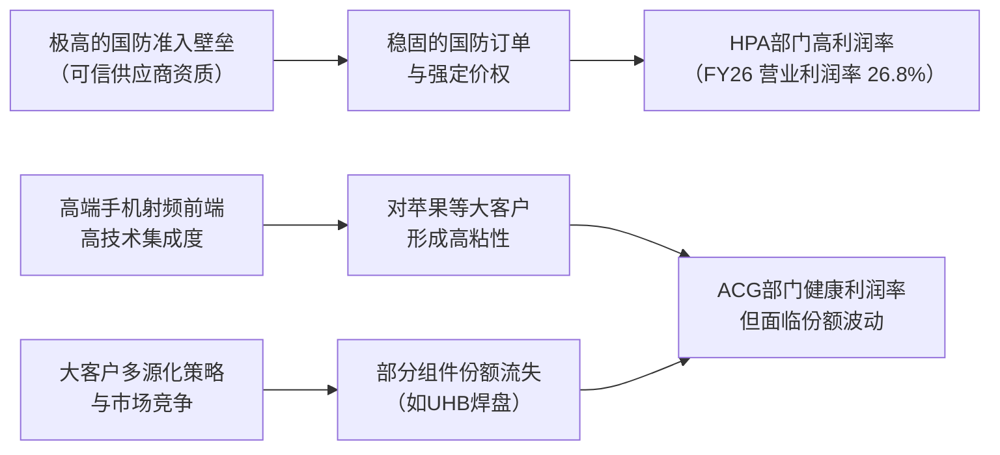

<!-- 匹配到的证券/行业：Qorvo(QRVO.O) -->
操作成功

### 一页通 （Qorvo (QRVO.O)）
日期：2026-07-25
内容："""
## 公司概况

Qorvo 是一家全球领先的射频、模拟混合信号及电源管理解决方案供应商，业务覆盖无线、有线和电源市场。公司通过三大业务部门运营：<strong>高性能模拟芯片 (HPA)</strong>、<strong>连接与传感器 (CSG)</strong> 和<strong>先进蜂窝网络 (ACG)</strong>。其产品广泛应用于智能手机、国防航天、基础设施及物联网等领域。公司是苹果公司射频方案的核心供应商之一，苹果占其2026财年总收入的<strong>50%</strong>。 

## 公司近况跟踪

- <strong>与Skyworks合并推进中</strong>：Qorvo与Skyworks的合并案已于2026年2月11日获双方股东批准。目前正等待包括美国联邦贸易委员会（FTC）在内的反垄断和外国投资审批。管理层预计交易将于<strong>2027年初</strong>完成，但Skyworks管理层近期表示有望在<strong>2026年底</strong>完成。  
- <strong>加速退出低端安卓市场</strong>：公司正加速战略性退出低利润的大众市场安卓智能手机业务。管理层预计，受此战略调整及存储价格上涨影响，FY27安卓业务收入将同比减少约<strong>3亿美元</strong>。  
- <strong>HPA业务持续强劲增长</strong>：受益于国防与航空航天领域的强劲需求，HPA业务在FY26收入同比增长<strong>10.7%</strong>。管理层预计FY27该业务将保持<strong>两位数增长</strong>，收入规模有望达到约<strong>5亿美元</strong>，首次超过安卓业务。  
- <strong>制造足迹持续优化</strong>：公司已完成哥斯达黎加组装测试工厂的关闭，并将北卡罗来纳州的SAW滤波器生产转移至得克萨斯州。这些举措旨在降低资本密集度和产品成本，提升盈利能力。  
- <strong>FY26毛利率大幅提升</strong>：得益于退出低利润安卓业务、有利的产品组合及成本削减，公司FY26毛利率达到<strong>45.9%</strong>，同比提升<strong>4.6个百分点</strong>。管理层预计FY27毛利率将<strong>超过50%</strong>。  

## 短期逻辑

1.  <strong>合并交易的监管审批进展</strong>：Qorvo与Skyworks的合并是未来一个季度最核心的交易逻辑。2026年2月，双方收到了美国联邦贸易委员会（FTC）的"二次请求"，表明监管审查进入关键阶段。任何关于审批进展的消息，无论是获得中国、美国或其他主要司法管辖区的批准，还是出现意外的阻力，都将直接引发股价波动。当前股价已包含合并预期，交易完成时间点的明朗化是主要催化剂。   

2.  <strong>毛利率改善的持续兑现</strong>：公司FY26 Q4毛利率达到<strong>52.6%</strong>，远超市场预期的<strong>48.5%</strong>，主要得益于退出低利润安卓业务和制造优化。管理层已给出FY27毛利率<strong>超过50%</strong>的指引。未来一个季度，市场将密切关注这一高毛利率水平的可持续性。如果后续季度能继续证明毛利率的结构性改善而非一次性收益，将有助于提升市场对合并后公司盈利能力的信心。   

3.  <strong>苹果iPhone 18周期内容变化的消化</strong>：公司在FY26 Q3财报中披露，在下一代iPhone中失去了部分超高频段（UHB）焊盘的份额，但同时在iPad中获得了高波段焊盘的新订单。市场正在消化这一多空交织的内容变化。未来一个季度，随着新iPhone设计的逐步定型，更多关于Qorvo在苹果供应链中具体份额和单机价值量的信息将浮出水面，这将直接影响市场对合并后公司长期收入前景的判断。   

## 长期逻辑

1.  <strong>国防与航空航天业务的长期顺风</strong>：Qorvo的HPA部门是美国国防部"可信供应商"，深度绑定美国及其盟国的国防现代化进程。全球地缘政治紧张局势加剧，推动各国国防开支增加，尤其是在相控阵雷达、电子战和卫星通信等领域。公司特别指出了"金色穹顶"防御系统、F-47战斗机等项目带来的机遇。HPA业务FY26收入<strong>7.06亿美元</strong>，管理层预计FY27将增长至约<strong>5亿美元</strong>（仅国防与航空航天部分），该业务具备高技术壁垒和长项目周期，是公司未来1-3年最确定的增长引擎。   

2.  <strong>从规模驱动转向盈利质量驱动的战略转型</strong>：公司正主动剥离或退出低利润业务，包括出售碳化硅电力器件业务、MEMS传感器业务，以及加速退出低端安卓市场。这一战略转型虽然在短期内压制了收入增长（FY27收入指引中个位数下降），但极大地优化了产品组合和成本结构。FY26毛利率已从FY25的<strong>41.3%</strong> 跃升至<strong>45.9%</strong>，管理层指引FY27将<strong>超过50%</strong>。这种从追求收入规模到追求盈利质量的转变，有望在长期内提升公司的资本回报率和自由现金流生成能力。   

3.  <strong>与Skyworks合并后的协同效应与行业整合</strong>：合并后的新公司将成为射频前端市场的巨无霸，拥有更完整的解决方案、更强的客户议价能力和显著的规模效应。管理层预计合并将带来巨大的成本协同效应，包括整合重叠的运营费用、优化制造布局和提升供应链效率。尽管合并后可能面临苹果等大客户的多源化策略压力，但合并实体通过整合研发资源，有望在下一代技术（如6G）中建立更强的竞争壁垒，减少行业内的无效竞争，提升整个射频行业的盈利水平。   

## 风险提示

- <strong>合并交易失败的风险</strong>：Qorvo与Skyworks的合并案仍需通过美国FTC、中国市场监管总局等多个司法管辖区的反垄断审查。鉴于双方在射频前端市场的领先地位，审查过程可能漫长且存在不确定性。若交易最终被否决，Qorvo的股价将失去合并溢价，并需重新面对独立运营下的竞争压力，包括在苹果供应链中的份额流失和安卓市场的持续萎缩。   
- <strong>大客户依赖与内容流失风险</strong>：公司对苹果的依赖度极高，FY26收入占比达<strong>50%</strong>。苹果一贯采用多供应商策略以分散风险和增强议价能力。公司已确认在下一代iPhone中失去部分超高频段（UHB）焊盘份额。未来，若公司在苹果的其他关键组件（如集成模块、ET PMIC）上继续丢失份额，或苹果加速自研射频组件，将对公司收入和盈利能力造成重大打击。   
- <strong>技术迭代与竞争加剧风险</strong>：射频前端市场竞争激烈，技术路线变化快。在Wi-Fi领域，公司正从Wi-Fi 7向Wi-Fi 8过渡；在蜂窝领域，5G Advanced和未来的6G对射频性能提出更高要求。公司面临来自Broadcom、Qualcomm、Murata等国际巨头以及中国本土射频厂商的双重竞争。若公司在关键技术节点的研发或客户导入上落后，可能导致市场份额和盈利能力的长期受损。   

## 近期要闻

- <strong>2026年5月6日</strong>：Qorvo发布FY26 Q4财报，营收<strong>8.08亿美元</strong>，毛利率<strong>52.6%</strong>，均超市场预期。公司同时宣布回购了<strong>4亿美元</strong>股票。   
- <strong>2026年2月5日</strong>：Qorvo和Skyworks宣布，已收到美国联邦贸易委员会（FTC）关于双方合并案的"二次请求"，要求提供更多信息和文件材料。   
- <strong>2026年2月11日</strong>：Qorvo和Skyworks的股东在各自的特别股东大会上批准了双方的合并协议。   
- <strong>2026年1月28日</strong>：Qorvo发布FY26 Q3财报，并给出远低于市场预期的FY26 Q4指引，主要因加速退出低端安卓市场和在下一代iPhone中失去部分UHB焊盘份额。股价当日大幅下跌。   

## 未来催化

- <strong>2026年8月-10月</strong>：Qorvo发布FY27 Q1财报。这将是公司执行退出低端安卓市场战略后的首个完整季度，市场将密切关注其收入结构变化和毛利率的可持续性，以验证公司战略转型的成效。   
- <strong>2026年下半年</strong>：苹果公司预计将发布新一代iPhone（iPhone 18）。届时，通过拆解报告和供应链信息，市场将能更清晰地量化Qorvo在该机型中的具体内容变化（UHB份额流失 vs. 其他组件增益），从而更准确地评估其苹果业务的前景。   
- <strong>2026年下半年至2027年初</strong>：Qorvo与Skyworks合并案的关键监管审批节点。市场普遍预期交易将在<strong>2026年底至2027年初</strong>完成。在此期间，任何来自美国、中国或欧盟的监管审批进展都将成为股价的直接催化剂。   

## 公司业务模式及拆分

### 业务边际变化

公司近年正经历深刻的业务结构调整，核心是<strong>从追求收入规模转向追求盈利质量</strong>。具体表现为：1）主动剥离或退出低利润业务，包括出售碳化硅电力器件和MEMS传感器业务，以及加速退出低端安卓手机市场；2）将资源和产能集中于高利润、高壁垒的国防航天和高端智能手机市场；3）通过关闭和整合制造设施（如哥斯达黎加工厂、北卡罗来纳州工厂）来降低固定成本和资本密集度。这些举措在短期内压制了收入增长，但显著提升了毛利率和现金流。   

### 盈利模式

Qorvo的盈利模式建立在<strong>高技术壁垒和客户粘性</strong>之上。公司依靠其在射频、化合物半导体（GaAs, GaN）和声学滤波器（BAW, SAW）领域的核心技术和工艺know-how，为高端应用场景提供高性能、高集成度的解决方案。其产品是客户系统性能的关键，具有较高的转换成本。在国防航天领域，其"可信供应商"资质构成了强大的准入壁垒。公司赚取的是<strong>技术溢价和规模效应</strong>带来的利润，而非单纯的加工费。   

### 业务拆分

公司业务分为三大板块。<strong>ACG</strong>是收入支柱，但正经历战略收缩；<strong>HPA</strong>是增长和利润引擎，增速最快且毛利率最高；<strong>CSG</strong>规模较小，仍在亏损但亏损收窄。公司当前处于<strong>主动的业务组合优化期</strong>，即牺牲短期收入增长以换取结构性盈利能力的提升。   

<strong>细分业务拆分</strong>

| 项目 (百万美元) | FY2024 | FY2025 | FY2026 |
| :--- | :--- | :--- | :--- |
| <strong>HPA</strong> | | | |
| 收入 | 572.95 | 637.26 | 705.66 |
| 同比 | - | 11.2% | 10.7% |
| 收入占比 | 15.2% | 17.1% | 19.2% |
| 营业利润 | 82.50 | 108.90 | 189.36 |
| 营业利润率 | 14.4% | 17.1% | 26.8% |
| <strong>CSG</strong> | | | |
| 收入 | 434.54 | 472.52 | 421.65 |
| 同比 | - | 8.7% | -10.8% |
| 收入占比 | 11.5% | 12.7% | 11.5% |
| 营业利润 | -88.65 | -55.84 | -42.25 |
| 营业利润率 | -20.4% | -11.8% | -10.0% |
| <strong>ACG</strong> | | | |
| 收入 | 2,762.02 | 2,609.19 | 2,551.21 |
| 同比 | - | -5.5% | -2.2% |
| 收入占比 | 73.3% | 70.2% | 69.3% |
| 营业利润 | 727.91 | 602.45 | 667.35 |
| 营业利润率 | 26.4% | 23.1% | 26.2% |

*注：FY2024数据来自FY2025年报中的重述。营业利润为分部数据，未分摊总部费用。*

<strong>HPA (高性能模拟芯片)</strong>：FY26收入<strong>7.06亿美元</strong>，同比增长<strong>10.7%</strong>。增长主要来自国防与航空航天领域的项目和内容增加，以及宽带DOCSIS 4.0的过渡和基站产品需求增长。营业利润率从FY25的<strong>17.1%</strong> 大幅提升至<strong>26.8%</strong>，得益于有利的产品组合、产品成本和库存费用的降低。该业务是公司未来增长和利润扩张的核心驱动力。 

<strong>CSG (连接与传感器)</strong>：FY26收入<strong>4.22亿美元</strong>，同比下降<strong>10.8%</strong>。收入下降主要因公司战略性收缩Wi-Fi组件和UWB解决方案的产品组合，聚焦高利润领域。营业亏损从FY25的<strong>5584万美元</strong>收窄至<strong>4225万美元</strong>，得益于产品组合改善、成本降低和运营费用减少。该业务仍处于调整期，目标是实现盈利。 

<strong>ACG (先进蜂窝网络)</strong>：FY26收入<strong>25.51亿美元</strong>，同比下降<strong>2.2%</strong>。收入下降反映了公司退出低端安卓市场的影响，但被旗舰和高端智能手机的内容增长所部分抵消。营业利润率从FY25的<strong>23.1%</strong> 提升至<strong>26.2%</strong>，主要得益于有利的产品组合和运营费用减少。该业务是公司最大的收入来源，但正经历结构性调整，未来增长将更依赖于高端市场的内容增长。 

## 核心竞争力

<strong>竞争要素 1：依托国防领域"可信供应商"资质和深度客户绑定构筑的结构性护城河</strong>

-   <strong>护城河定性</strong>：<strong>结构性护城河</strong>。Qorvo位于得克萨斯州理查森的制造工厂是美国国防部（DoD）认证的1A类"可信供应商"，具备从设计、晶圆制造到先进封装和测试的全流程资质。这一资质构成了极高的准入门槛，因为获得该认证需要长期、大量的安全审查和工艺验证。公司借此深度嵌入美国及其盟国的国防供应链，参与"金色穹顶"防御系统、F-47战斗机等长期、高价值的国家级项目。这种基于国家安全和长期信任的合作关系，使得客户转换成本极高，竞争对手难以在短期内复制。   
-   <strong>数据验证</strong>：HPA部门FY26营业利润率高达<strong>26.8%</strong>，显著高于公司整体水平，体现了其强大的定价能力和技术溢价。管理层预计FY27仅国防与航空航天市场的收入就将达到约<strong>5亿美元</strong>，占HPA部门收入的大部分，并驱动该部门持续两位数增长。   
-   <strong>动态演变</strong>：<strong>护城河变宽（巩固）</strong>。全球地缘政治紧张局势加剧，美国和盟国的国防开支持续增加，特别是在先进雷达、电子战和卫星通信领域。Qorvo作为关键射频和化合物半导体组件的核心供应商，正持续受益于这一宏观趋势，其技术领先地位和客户关系将得到进一步巩固。   

<strong>竞争要素 2：在高度集中的智能手机市场，由技术集成度和客户粘性构成的竞争壁垒，但面临多源化策略的侵蚀风险</strong>

-   <strong>护城河定性</strong>：<strong>行业阶段性红利与结构性护城河并存，但面临收缩风险</strong>。在高端智能手机射频前端市场，Qorvo凭借其BAW滤波器、GaAs/GaN功率放大器和高度集成的模块化解决方案，与苹果、三星等顶级客户建立了深度合作关系。这些定制化、高性能的解决方案构成了较高的技术和合作门槛。然而，大客户为保障供应链安全和增强议价能力，普遍采用多供应商策略。公司已确认在下一代iPhone中失去部分UHB焊盘份额，这表明其在该领域的护城河正面临被侵蚀的风险。   
-   <strong>数据验证</strong>：苹果占公司FY26收入的<strong>50%</strong>，显示出极高的客户集中度。ACG部门FY26营业利润率为<strong>26.2%</strong>，虽然健康，但低于HPA部门，且其收入同比下降<strong>2.2%</strong>，反映出大客户策略和市场竞争带来的压力。   
-   <strong>动态演变</strong>：<strong>收缩（面临被侵蚀的风险）</strong>。短期内，公司在苹果供应链中的份额波动是常态。长期看，其护城河的宽度取决于能否通过持续的技术创新（如在ET PMIC、新频段集成模块上取得突破）来抵消多源化带来的份额损失，并在下一代通信技术（如6G）中重新获得更强的技术卡位。   

<strong>现阶段核心驱动力总结</strong>：Qorvo的Alpha来源于其主动的战略转型，即通过剥离低利润业务和优化制造，实现盈利质量的跃升。其Beta则高度绑定了全球国防开支周期和苹果公司的产品创新周期。当前阶段，公司正经历Alpha（盈利改善）与Beta（苹果业务不确定性）的角力。   

<strong>竞争格局传导逻辑图</strong>

## 产销链

- <strong>客户情况</strong>：
    - <strong>主要客户</strong>：公司对单一客户依赖度极高。苹果公司通过多家代工厂采购，在FY26和FY25分别占公司总收入的<strong>50%</strong>和<strong>47%</strong>。三星电子在FY26和FY25均占收入的<strong>10%</strong>。这两大客户主要采购ACG部门的蜂窝射频解决方案。客户集中度风险显著，任何一家主要客户的订单波动或采购策略变化都将对公司业绩产生重大影响。   
    - <strong>新客户/新业务</strong>：在汽车领域，CSG部门的UWB解决方案已与领先一级供应商合作，在FY26 Q3获得首批量产订单，覆盖数字钥匙、儿童存在检测等应用。在国防领域，公司正与多国客户探讨AESA雷达解决方案。这些新业务处于早期放量阶段，是未来多元化收入来源的关键。   
- <strong>供应商情况</strong>：公司采用集中化采购和供应链管理。其制造过程需要多种原材料，包括GaN-on-SiC晶圆、GaAs晶圆、硅片、钽酸锂和铌酸锂等。公司通过签订长期供应协议和开发替代供应商来管理供应风险。其内部制造主要集中于最具差异化的技术环节，如BAW、GaAs、GaN和SAW晶圆的生产，而标准化的硅基工艺（如SOI、CMOS）则外包给全球领先的代工厂。   
- <strong>成本转嫁能力</strong>：公司赚取的主要是技术溢价，而非单纯的周期资源钱。当上游原材料（如贵金属）涨价时，公司通过其技术领先性和部分领域的准垄断地位，具备一定的成本转嫁能力，但并非绝对。其盈利能力的核心驱动力是产品组合的优化（增加高毛利产品占比）和内部制造效率的提升，而非单纯依赖价格传导。   

## 财务数据

| 项目 (百万美元) | FY2024 | FY2025 | FY2026 |
| :--- | :--- | :--- | :--- |
| <strong>截止日期</strong> | 2024-03-30 | 2025-03-29 | 2026-03-28 |
| 营业总收入 | 3,769.51 | 3,718.97 | 3,678.52 |
| 收入同比 | 5.6% | -1.3% | -1.1% |
| 营业成本 | 2,281.01 | 2,183.38 | 1,990.42 |
| 毛利润 | 1,488.50 | 1,535.59 | 1,688.10 |
| <strong>毛利率</strong> | <strong>39.5%</strong> | <strong>41.3%</strong> | <strong>45.9%</strong> |
| 研发费用 | 682.25 | 747.71 | 726.12 |
| 销售及管理费用 | 389.14 | 403.62 | 380.67 |
| 营业利润 | 91.70 | 95.53 | 411.42 |
| <strong>营业利润率</strong> | <strong>2.4%</strong> | <strong>2.6%</strong> | <strong>11.2%</strong> |
| 归母净利润 | -70.32 | 55.62 | 338.99 |
| 归母净利润同比 | - | 179.1% | 509.5% |
| 稀释每股收益 (美元) | -0.72 | 0.58 | 3.62 |
| 经营活动现金流净额 | 833.19 | 622.20 | 808.63 |
| 资本性支出 | 127.23 | 137.60 | 129.07 |
| <strong>自由现金流</strong> | <strong>705.96</strong> | <strong>484.60</strong> | <strong>679.56</strong> |

*注：自由现金流 = 经营活动现金流净额 - 资本性支出*

### 财务分析

- <strong>盈利能力</strong>：公司FY26盈利能力实现质的飞跃。毛利率从FY25的<strong>41.3%</strong> 跃升至<strong>45.9%</strong>，营业利润率从<strong>2.6%</strong> 飙升至<strong>11.2%</strong>。这主要归因于ACG部门战略性退出低利润安卓市场、HPA部门有利的产品组合以及制造整合带来的成本节约。归母净利润同比暴增<strong>509.5%</strong>，显示出战略转型在利润端的巨大成效。   

- <strong>运营能力</strong>：公司运营效率显著提升。存货从FY25的<strong>6.41亿美元</strong>下降至<strong>5.54亿美元</strong>，降幅达<strong>13.6%</strong>，表明公司在主动去库存和优化库存管理。FY26应收账款为<strong>3.83亿美元</strong>，与上年基本持平，收入质量稳定。   

- <strong>现金流与偿债能力</strong>：公司现金流强劲，FY26经营活动现金流净额为<strong>8.09亿美元</strong>，自由现金流为<strong>6.80亿美元</strong>，均大幅高于FY25。这为公司在FY26 Q4进行<strong>4亿美元</strong>的大规模股票回购提供了坚实基础。公司总负债从FY25的<strong>25.41亿美元</strong>降至<strong>24.81亿美元</strong>，长期债务稳定在<strong>15.49亿美元</strong>，现金及现金等价物增至<strong>12.19亿美元</strong>，净债务进一步缩小，财务状况非常健康。   

## 行业及竞争分析

Qorvo主要参与<strong>射频前端</strong>和<strong>高性能模拟/化合物半导体</strong>两大细分市场。 

<strong>1. 射频前端市场</strong>
- <strong>行业趋势</strong>：该市场主要受智能手机技术升级（5G/6G）驱动，要求更复杂、更高集成度的模组。然而，智能手机整体出货量已进入存量博弈阶段，增长主要来自单机价值量的提升。在非手机领域，Wi-Fi 7/8、UWB、汽车V2X和卫星通信等应用为行业提供了新的增长点。   
- <strong>竞争格局</strong>：市场高度集中，Qorvo的主要竞争对手包括Broadcom、Skyworks、Qualcomm和Murata。竞争焦点在于技术性能、集成能力、成本控制和大客户关系。大客户的多源化策略使得份额争夺异常激烈。Qorvo在BAW滤波器和GaAs/GaN PA方面有差异化技术，但在集成模块领域面临来自Broadcom和Qualcomm的强力竞争。   

<strong>2. 高性能模拟/化合物半导体市场</strong>
- <strong>行业趋势</strong>：该市场由国防现代化、5G基站建设和宽带网络升级（DOCSIS 4.0）驱动。特别是国防领域，相控阵雷达、电子战系统对GaN射频器件的需求激增，市场增长确定性强，且对供应商的资质和可靠性要求极高。   
- <strong>竞争格局</strong>：Qorvo的HPA部门主要与Analog Devices、MACOM和Texas Instruments竞争。在国防航天领域，其"可信供应商"资质构成了强大的护城河，竞争相对缓和，利润率较高。   

<strong>可比公司</strong>

| 公司名称 | 股票代码 | 对标维度 | 分析 |
| :--- | :--- | :--- | :--- |
| Skyworks | SWKS | 业务模式、客户结构 | 与Qorvo高度相似，均为苹果核心射频供应商，面临相同的客户集中度风险和智能手机市场增长瓶颈。两者合并旨在整合资源，降低成本，应对竞争。 |
| Broadcom | AVGO | 技术竞争、产品广度 | 射频前端市场的强大竞争对手，尤其在FBAR滤波器和集成模块领域技术领先。其产品组合远比Qorvo多元化，客户基础更广，抗风险能力更强。 |
| Qualcomm | QCOM | 模块级竞争 | 作为基带芯片霸主，通过提供"基带+射频"捆绑方案，在集成模块市场对Qorvo构成直接威胁。其平台化优势使其在手机OEM中拥有强大的议价能力。 |

<strong>总结分析</strong>：Qorvo在射频前端市场面临激烈的寡头竞争，其核心竞争力在于高端滤波器（BAW）和化合物半导体（GaAs/GaN）的技术积累，以及在国防航天领域的独特市场地位。与Skyworks的合并是应对行业竞争加剧和大客户议价能力过强的战略举措，旨在通过规模效应和成本协同来提升盈利能力和行业话语权。 

## 市场焦点议题

<strong>议题一：苹果业务的前景与份额稳定性</strong>

- <strong>背景</strong>：苹果是Qorvo最大的客户，占FY26收入的<strong>50%</strong>。苹果的多供应商策略和对核心技术的控制欲，使得Qorvo在其供应链中的地位一直存在不确定性。公司已确认在下一代iPhone中失去部分UHB焊盘份额，这加剧了市场对其苹果业务可持续性的担忧。   
- <strong>问题列表</strong>：
    - 公司在iPhone 18中具体失去了哪些组件，价值量多大？新获得的iPad高波段焊盘和ET PMIC增益能否完全抵消损失？
    - 管理层指引FY27苹果收入持平，这一预期是基于怎样的销量和内容假设？是否过于乐观？
    - 长期看，苹果自研射频组件（如基带芯片后的射频前端）的风险有多大？

<strong>议题二：安卓业务收缩的节奏与对盈利的真实影响</strong>

- <strong>背景</strong>：公司正加速退出低端安卓市场，导致FY27安卓收入预计减少<strong>3亿美元</strong>。市场需要区分这是主动的战略选择，还是被动地丢失市场份额。同时，需要评估这种收入收缩对毛利率和运营利润的净影响。   
- <strong>问题列表</strong>：
    - 3亿美元的收入下降中，多少是主动退出，多少是因存储价格上涨导致客户砍单？
    - 退出低端安卓市场后，公司在该市场的剩余收入规模是多少？是否已触底？
    - 收入下降带来的毛利率提升是一次性的，还是结构性的？运营费用能否随收入同步下降以保护利润？

<strong>议题三：毛利率超50%的可持续性与驱动力</strong>

- <strong>背景</strong>：公司FY26 Q4毛利率达到惊人的<strong>52.6%</strong>，并指引FY27全年毛利率<strong>超过50%</strong>。这一水平远超历史表现，市场对其可持续性存在分歧。   
- <strong>问题列表</strong>：
    - 52.6%的季度毛利率中，有多少是来自一次性因素（如产品组合的季节性波动、库存影响）？
    - 指引的50%以上毛利率，其核心驱动力是产品组合优化（HPA占比提升），还是制造降本？各自的贡献度如何？
    - 如果未来苹果或安卓高端市场竞争加剧，需要重新增加研发或降价，毛利率能否维持在50%以上？

## 市场分歧探讨

<strong>核心分歧点：FY26 Q4及FY27的高毛利率是结构性改善的起点，还是由一次性因素驱动的周期性高点？</strong>

- <strong>乐观方观点</strong>：认为毛利率改善是结构性的。其逻辑支撑在于：1）公司主动退出了低毛利的安卓业务，这部分收入的永久性消失将结构性提升整体毛利率；2）高毛利的国防航天业务（HPA）占比持续提升，其FY27收入将首次超过安卓业务，成为新的利润引擎；3）制造整合（关闭工厂、外包）带来的成本节约是永久性的。因此，即使总收入下降，公司盈利能力和自由现金流也将进入一个持续改善的通道。   

- <strong>谨慎方观点</strong>：认为高毛利率难以持续，或存在周期性因素。其逻辑支撑在于：1）FY26 Q4 <strong>52.6%</strong> 的毛利率可能包含了有利的一次性产品组合（如苹果高端机型备货高峰）和库存因素，未来季度可能回落；2）公司在苹果供应链中的份额流失（UHB焊盘）才刚刚开始体现，未来可能面临更多组件的竞争，从而拉低ACG部门的利润率；3）HPA业务虽然增长强劲，但其收入体量仍相对较小，不足以完全抵消ACG部门可能出现的更大规模收入下滑。若苹果业务下滑超预期，规模效应减弱将导致毛利率承压。   

<strong>总结分析</strong>：Qorvo的毛利率改善具备坚实的结构性基础，主动剥离低利润业务和制造优化是真实的利润增厚。然而，谨慎方的担忧也不无道理，苹果业务的不确定性是最大的潜在风险。FY26 Q4的极高毛利率水平大概率包含部分一次性利好，未来可能正常化至50%附近。毛利率能否持续提升，最终取决于HPA业务的增长能否持续超越ACG业务的下滑，以及公司能否在苹果供应链中稳住阵脚并找到新的增长点。   

## 盈利预测与估值

| 机构 | 评级 | 目标价 | 财务指标 | FY2026A | FY2027E | FY2028E | FY2029E |
| :--- | :--- | :--- | :--- | :--- | :--- | :--- | :--- |
| 瑞银 (2026-05-07) | 中性 | $100 | 营业收入(百万美元) | 3,679 | 3,509 | 3,657 | - |
| | | | Non-GAAP EPS (美元) | 7.01 | 7.70 | 8.53 | - |
| 花旗 (2026-05-07) | 中性 | $100 | 营业收入(百万美元) | 3,679 | 3,466 | 3,679 | 3,855 |
| | | | Non-GAAP EPS (美元) | 7.01 | 6.89 | 7.77 | 8.71 |
| 摩根大通 (2026-05-06) | 中性 | $100 | 营业收入(百万美元) | 3,679 | 3,479 | - | - |
| | | | Non-GAAP EPS (美元) | 7.00 | 6.95 | - | - |
| 摩根士丹利 (2026-01-31) | 等权重 | $84 | 营业收入(百万美元) | 3,668 | 3,425 | 3,558 | - |
| | | | Non-GAAP EPS (美元) | 6.54 | 6.88 | 8.21 | - |

*注：各机构预测口径可能略有差异，此处统一采用Non-GAAP口径。目标价均为美元。*

<strong>管理层指引</strong>：由于与Skyworks的合并悬而未决，公司已不再提供季度指引。但管理层重申了FY27的年度目标：收入同比<strong>中个位数下降</strong>，毛利率<strong>超过50%</strong>，Non-GAAP EPS<strong>接近7.00美元</strong>。    

<strong>估值分析</strong>：当前市场对Qorvo的估值逻辑已完全围绕其与Skyworks的合并交易展开。多家机构的目标价均基于合并条款（<strong>0.96股Skyworks股票 + 32.50美元现金</strong>）进行折算，并给予一定的交易风险折价。例如，瑞银和花旗的<strong>100美元</strong>目标价即基于此方法。机构间的盈利预测存在分歧，主要集中在对FY27收入下滑幅度的判断上，但EPS预测普遍在<strong>7.00美元</strong>附近，与管理层指引一致。这表明市场对公司的自我改善能力（毛利率提升）有一定共识，但对收入端的压力程度看法不一。
"""
