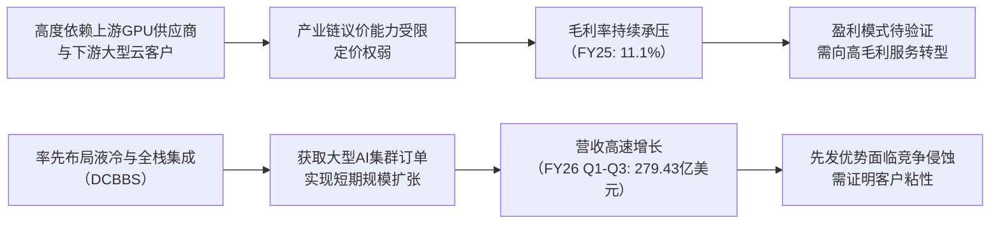

<!-- 匹配到的证券/行业：超微电脑(SMCI.O) -->
操作成功

### 一页通 （超微电脑 (SMCI.O)）
日期：2026-08-06
内容："""
## 公司概况

超微电脑是全球领先的AI服务器与数据中心全栈解决方案提供商，其核心业务是为企业、云服务商及AI实验室提供高度定制化的高性能服务器、存储系统及机架级解决方案。公司凭借模块化架构和直接液冷技术，在AI基础设施领域占据关键位置，是英伟达等GPU厂商的核心合作伙伴。其市场地位处于第一梯队，与戴尔、HPE等巨头直接竞争，尤其在新兴云服务商和主权AI领域具备较强影响力。 

## 公司近况跟踪

- <strong>FY26Q4毛利率指引大幅上调</strong>：公司于2026年7月21日发布初步业绩，预计FY26Q4（截至2026年6月30日）GAAP及Non-GAAP毛利率将达到<strong>15%-17%</strong>，较此前<strong>8.2%-8.4%</strong>的指引近乎翻倍。公司将这一改善归因于有利的客户与产品组合，包括高毛利的DCBBS业务及企业客户收入占比提升。   
- <strong>新增订单量创纪录</strong>：公司披露FY26Q4单季新增订单超过<strong>600亿美元</strong>，推动期末在手订单达到历史新高。这些订单预计将在未来多个季度交付。作为对比，公司FY26全年营收指引为389-404亿美元。   
- <strong>大规模股权融资</strong>：为满足订单交付所需的营运资金，公司于2026年6月宣布一项总额<strong>70亿美元</strong>的股权及股权挂钩融资计划，包括普通股、强制可转换优先股及市场发售计划，用以采购约390亿美元订单所需的关键组件。此举导致约27%的稀释。  
- <strong>客户集中度显著改善</strong>：根据FY26Q3的10-Q文件，公司最大客户收入占比已从FY26Q2的<strong>62.6%</strong>（约79亿美元）降至<strong>27.0%</strong>（约28亿美元），同时企业客户收入占比提升至<strong>28%</strong>，显示客户结构多元化取得进展。  
- <strong>出口管制调查持续</strong>：公司前员工因涉嫌违反出口管制被起诉，公司已启动由独立董事会领导的调查，并强调自身并非调查目标。该事件及公司长期存在的财务内控问题仍是市场对公司治理的主要担忧。  

## 短期逻辑

1.  <strong>毛利率可持续性验证</strong>：FY26Q4的15%-17%毛利率远超市场预期，但市场对其可持续性存在巨大分歧。看多方认为这是DCBBS、软件和服务等高毛利业务结构性占比提升的结果；看空方则认为主要源于特定季度有利的一次性产品组合或组件短缺带来的稀缺性溢价。<strong>8月11日的财报电话会将是关键验证点</strong>，管理层对FY27的毛利率指引及对DCBBS利润贡献的量化说明，将决定市场是否会对公司进行价值重估。  

2.  <strong>创纪录订单的转化与融资压力</strong>：超过600亿美元的新增订单彰显了强劲的AI服务器需求，但市场对其质量存疑，因公司承认这些订单“可能不构成坚定承诺且可被取消”。同时，为满足订单交付，公司已进行大规模股权融资，导致显著稀释。<strong>未来几个季度营收能否如期高速增长，以及公司是否会因更大的在手订单而再次启动融资</strong>，是股价的核心驱动因素。若营收兑现且无需再融资，股价有较大上行空间；反之则面临双重压力。   

3.  <strong>AI资本开支情绪的放大器</strong>：当前市场对AI资本开支的可持续性高度敏感。作为AI基础设施需求的直接受益者，超微电脑的业绩和订单数据被视为行业风向标。其强劲的订单数据短期内提振了市场情绪，并带动戴尔、HPE等同行股价上涨。然而，一旦后续云厂商资本开支指引出现波动，超微电脑作为高Beta标的，其股价也将面临剧烈调整的风险。  

## 长期逻辑

1.  <strong>从服务器组装商向全栈解决方案提供商的战略升级</strong>：公司正通过DCBBS将业务从低毛利的硬件组装，拓展至集成液冷、网络、软件、服务与部署的全栈解决方案。管理层预计DCBBS毛利率可达<strong>20%</strong>以上，并有望在未来贡献超过<strong>25%</strong>的公司总利润。这一战略升级若能成功，将结构性提升公司的盈利能力和客户粘性，从价格战中抽身，构建更深厚的护城河。   

2.  <strong>AI推理与企业级市场的广阔扩张空间</strong>：公司历史上在AI训练领域的新兴云服务商中占据优势，但企业级市场份额较小。随着AI应用向推理阶段过渡，企业客户对定制化、低延迟的本地部署方案需求激增。超微电脑凭借其高度灵活的定制化能力和DCBBS方案，有望在企业级市场（尤其是中大型企业）实现显著渗透，打开第二增长曲线，并改善客户和产品组合，支撑更高的毛利率。  

3.  <strong>液冷技术的先发优势与行业标准化趋势</strong>：随着GPU功耗持续攀升，液冷正从可选项变为必选项。超微电脑在直接液冷领域布局较早，具备从冷板到冷却分配单元的全套自研能力，这是其获取大型AI集群订单的关键差异化优势。若液冷技术成为行业主流标准，公司作为先行者有望持续受益于技术升级带来的价值量提升和市场份额集中。  

## 风险提示

- <strong>公司治理与合规风险</strong>：公司历史上曾因财务造假被SEC处罚，近期又陷入出口管制调查，且财务内控的“重大缺陷”至今未能完全修复。这些持续存在的治理问题严重损害了公司在资本市场的信誉，可能导致客户转向竞争对手、融资成本上升，并构成长期估值折价的核心原因。  
- <strong>毛利率与订单质量不及预期风险</strong>：市场对FY26Q4的高毛利率和创纪录订单反应积极，但若后续季度毛利率回落至个位数，或大量“订单”因非约束性而被取消或延迟，将证伪当前的乐观预期。特别是，公司为满足订单而大规模融资，若订单转化不及预期，将造成严重的财务资源浪费和股东稀释。  
- <strong>激烈市场竞争与客户集中风险</strong>：AI服务器市场竞争激烈，公司面临戴尔、HPE等传统OEM厂商和广达、富士康等ODM厂商的双重挤压。尽管FY26Q3客户集中度有所下降，但历史上公司业绩高度依赖少数大客户，任何主要客户的订单流失或采购策略变更，都将对公司营收和利润产生重大冲击。  

## 近期要闻

- <strong>2026年5月11日</strong>：公司发布FY26Q3财报，营收102.4亿美元，同比增长123%，但环比下降19%，低于指引，主要因客户数据中心准备延迟。毛利率10.1%，超预期。同时披露最大客户收入占比降至27%。  
- <strong>2026年6月9日</strong>：公司宣布一项总额<strong>70亿美元</strong>的股权及股权挂钩融资计划，以支持约390亿美元AI服务器订单的组件采购。消息公布后股价承压。 
- <strong>2026年7月21日</strong>：公司发布FY26Q4初步业绩预告，预计毛利率将达到<strong>15%-17%</strong>，远超此前指引；同时披露单季新增订单超过<strong>600亿美元</strong>，创历史新高。股价当日大幅上涨。   

## 未来催化

- <strong>2026年8月11日</strong>：公司计划于该日召开FY26Q4财报电话会。届时管理层对FY27的营收、毛利率指引，以及对DCBBS业务进展、订单转化前景和出口管制调查影响的详细说明，将是决定股价短期走势的最关键事件。  
- <strong>2026年8月-10月</strong>：主要云厂商（如微软、谷歌、亚马逊）及AI实验室将陆续发布财报并更新资本开支计划。其资本开支指引的增减将直接影响市场对AI服务器需求的预期，从而对超微电脑的估值产生系统性影响。  
- <strong>2026年8月-10月</strong>：英伟达新一代GPU平台（如Vera Rubin）的出货进展及相关供应链消息。作为英伟达的核心合作伙伴，超微电脑能否率先推出基于新平台的系统并获得客户订单，是验证其技术领先性和市场地位的关键催化。  

## 公司业务模式及拆分

### 业务边际变化

公司正经历从传统服务器供应商向数据中心全栈解决方案提供商的战略转型。核心变化在于大力推广DCBBS，该方案整合了服务器、液冷、网络、管理软件和部署服务，旨在提升价值量和客户粘性。同时，公司正积极拓展企业级和主权AI客户，以改善过去高度依赖少数大型云服务商的客户结构。  

### 盈利模式

公司盈利模式正从赚取硬件组装和集成的“加工费”，向通过提供差异化解决方案（DCBBS）、软件和服务来获取“品牌与技术溢价”转变。其盈利能力高度依赖规模效应、供应链管理效率，以及在液冷等前沿技术上的先发优势。  

### 业务拆分

公司业务主要分为“服务器与存储系统”和“子系统与配件”两大类。近年来，服务器与存储系统收入占比持续提升，FY25已占<strong>97%</strong>，是绝对核心。公司当前处于由AI驱动的<strong>产能爬坡与业绩兑现期</strong>，但同时也面临客户集中度高、毛利率波动大的挑战。 

<strong>细分业务拆分（单位：亿美元）</strong>

| 项目 | FY2023 | FY2024 | FY2025 | FY2026 Q1-Q3 |
|---|---|---|---|---|
| <strong>截止日期</strong> | 2023-06-30 | 2024-06-30 | 2025-06-30 | 2026-03-31 |
| <strong>服务器和存储系统</strong> | | | | |
| 收入 | 65.70 | 141.85 | 213.12 | - |
| 同比 | - | 115.9% | 50.2% | - |
| 占总收入比例 | 92.2% | 94.6% | 97.0% | - |
| <strong>子系统和附件</strong> | | | | |
| 收入 | 5.54 | 8.04 | 6.60 | - |
| 同比 | - | 45.2% | -17.9% | - |
| 占总收入比例 | 7.8% | 5.4% | 3.0% | - |
| <strong>总收入</strong> | <strong>71.23</strong> | <strong>149.89</strong> | <strong>219.72</strong> | <strong>279.43</strong> |

<strong>服务器和存储系统业务（FY2025）</strong>：该业务是公司绝对支柱，收入同比增长50.2%，主要受AI GPU服务器和机架级解决方案的强劲需求驱动。AI GPU相关产品收入增长显著，包括液冷和风冷服务器，其平均售价更高。公司特别提到，其DCBBS和软件服务收入正在快速增长，尽管绝对额仍较小，但代表了未来高毛利业务的发展方向。 

<strong>子系统和附件业务（FY2025）</strong>：该业务收入同比下降17.9%，主要因公司战略性地将资源优先集中于服务器和存储系统业务。这部分产品多为标准化组件，毛利率相对较低。 

## 核心竞争力

<strong>竞争要素 1：依托先发规模与全栈集成能力构筑的阶段性解决方案优势</strong>

- <strong>护城河定性</strong>：属于<strong>行业阶段性红利</strong>，而非结构性护城河。超微电脑凭借与英伟达等GPU厂商的紧密合作关系、早期在液冷领域的投入以及灵活的定制化能力，在AI服务器市场爆发初期快速获取了大型客户订单，形成了规模优势。其DCBBS全栈解决方案通过整合硬件、软件和服务，试图从“卖箱子”升级为“卖方案”，以提升客户粘性和利润率。  
- <strong>数据验证</strong>：公司营收从FY2023的71.23亿美元暴增至FY2026前三季度的279.43亿美元，证明了其抓住初期市场机遇的能力。然而，FY2025毛利率已从FY2023的18.0%下滑至11.1%，显示其核心硬件业务仍面临激烈的价格竞争，定价权有限。尽管FY26Q4毛利率指引跳升至15%-17%，但其可持续性待考。  
- <strong>动态演变</strong>：该优势正面临<strong>收缩风险</strong>。随着戴尔、HPE等竞争对手补齐液冷和集成能力，以及ODM厂商直接向大型云客户供货，超微电脑的先发优势正在被侵蚀。其能否通过DCBBS建立真正的客户粘性，是护城河能否巩固的关键。  

<strong>竞争要素 2：产业链话语权较弱导致的盈利脆弱性</strong>

- <strong>护城河定性</strong>：<strong>盈利模式待验证，产业链议价空间受限</strong>。公司处于产业链中游，上游是英伟达等掌握核心芯片的巨头，下游是资本雄厚、议价能力强的云服务商。公司本质上是一个高价值组件的集成商，大部分价值由上游芯片厂商创造，而下游大客户则持续挤压其利润空间。  
- <strong>数据验证</strong>：FY2025毛利率同比下滑2.7个百分点至11.1%，公司明确解释为“提供有竞争力的定价以获取市场份额”和“产品与客户组合变化”。同时，公司营运资本需求巨大，FY26前三季度经营性现金流为-75.57亿美元，不得不通过大规模股权融资来支撑增长，这反映了其在产业链中的弱势地位。  
- <strong>动态演变</strong>：该要素面临<strong>持续压力</strong>。只要公司的业务模式仍以硬件集成为主，其毛利率将长期受上下游挤压。向DCBBS和软件服务转型是改善这一状况的核心路径，但转型成功需要时间和持续的客户验证。  

<strong>现阶段核心驱动力总结</strong>：公司的Alpha在于能否成功执行从硬件集成商到解决方案提供商的战略转型，从而结构性提升盈利能力和客户粘性。其Beta则高度依赖于AI资本开支的宏观周期，是典型的顺周期高弹性标的。 

<strong>竞争格局传导逻辑图</strong>

## 产销链

- <strong>客户情况</strong>：公司客户集中度极高但正在改善。FY26Q3，最大客户（一家数据中心）收入占比为<strong>27.0%</strong>，第二大客户（一家企业）占比<strong>10.3%</strong>。而在FY26Q2，最大客户占比曾高达<strong>62.6%</strong>。公司正积极拓展企业客户和主权AI客户，以分散风险。新客户拓展方面，公司已宣布与西班牙加泰罗尼亚、韩国等地区的主权云合作，并正与多家企业客户进行项目接洽。  
- <strong>供应商情况</strong>：公司核心供应商为英伟达、AMD、英特尔等芯片厂商，以及提供内存、SSD等关键组件的厂商。公司与两家关联方——Ablecom（机箱）和Compuware（电源）存在大量关联交易，FY26前三季度向这两家公司采购额占成本约<strong>2.1%</strong>。这种关联关系既是其快速定制能力的保障，也是市场对其治理结构的长期疑虑点。当前，CPU、GPU和内存等关键组件供应紧张，公司通过实时成本传导和客户协助采购来应对。  
- <strong>成本传导能力</strong>：公司赚取的是“加工费+解决方案溢价”。当上游组件涨价时，公司表示能够将大部分成本增加转嫁给客户，尤其是在供应紧张时期。但其毛利率的历史波动表明，这种传导能力并不稳定，在面对大客户时议价空间有限。  

## 财务数据

<strong>关键财务数据（单位：亿美元）</strong>

| 项目 | FY2023 | FY2024 | FY2025 | FY2026 Q1-Q3 |
|---|---|---|---|---|
| <strong>截止日期</strong> | 2023-06-30 | 2024-06-30 | 2025-06-30 | 2026-03-31 |
| 营业总收入 | 71.23 | 149.89 | 219.72 | 279.43 |
| 收入同比 | 37.09% | 110.42% | 46.59% | 72.33% |
| 毛利 | 12.83 | 20.61 | 24.30 | 22.85 |
| <strong>毛利率</strong> | <strong>18.01%</strong> | <strong>13.75%</strong> | <strong>11.06%</strong> | <strong>8.18%</strong> |
| 营业利润 | 7.61 | 12.11 | 12.53 | 12.82 |
| 营业利润率 | 10.68% | 8.08% | 5.70% | 4.59% |
| 归母净利润 | 6.40 | 11.53 | 10.49 | 10.52 |
| 归母净利率 | 8.98% | 7.69% | 4.77% | 3.76% |
| 稀释EPS (美元) | 1.14 | 1.92 | 1.68 | 1.59 |

<strong>财务分析</strong>：

- <strong>成长能力</strong>：公司营收在AI浪潮驱动下实现爆发式增长，FY2024和FY2025连续两年增速超46%。然而，<strong>增收不增利</strong>的特征明显，FY2025归母净利润同比下降9.01%，显示出高速扩张背后的盈利压力。 
- <strong>盈利能力</strong>：公司毛利率呈持续下滑趋势，从FY2023的18.01%降至FY2026前三季度的8.18%，反映出AI服务器硬件业务竞争的加剧和客户结构的恶化。尽管FY26Q4毛利率指引大幅反弹，但前三季度的整体表现已揭示其硬件集成业务盈利能力的脆弱性。 
- <strong>运营能力</strong>：公司营运资本效率恶化。FY26前三季度，存货激增至<strong>111.03亿美元</strong>（较FY25末增长137%），应收账款飙升至<strong>84.13亿美元</strong>（增长282%），导致经营活动现金流净流出<strong>75.57亿美元</strong>。现金转换周期显著拉长，对资金形成巨大压力。 
- <strong>偿债能力</strong>：为应对营运资金需求，公司杠杆率急剧攀升。截至FY26Q3末，总债务（含可转债）达<strong>87.73亿美元</strong>，而现金仅12.90亿美元，净债务为74.83亿美元。而在FY25末，公司尚处于净现金状态。财务风险显著增加。 

## 行业及竞争分析

公司处于<strong>AI服务器与数据中心基础设施</strong>这一高增长赛道。据管理层引用合作伙伴预测，未来2-3年AI服务器市场规模可达<strong>2-4万亿美元</strong>。需求端由云服务商、AI实验室、主权国家及企业客户的AI训练和推理需求共同驱动，供给端则受限于GPU等关键组件的供应。  

竞争格局激烈，公司面临双重挤压：一是戴尔、HPE等拥有广泛企业客户基础和全面服务能力的传统OEM巨头；二是广达、富士康等具备低成本大规模制造优势的ODM厂商。超微电脑的差异化在于其高度的定制化灵活性、对新兴云服务商的聚焦以及在液冷技术上的先发优势。  

<strong>可比公司分析</strong>

| 公司 | 股票代码 | 竞争定位 | 与超微电脑的差异 |
|---|---|---|---|
| Dell Technologies | DELL | 传统OEM巨头 | 拥有庞大的企业客户基础和全面的IT产品线，AI服务器只是其业务一部分。其服务网络和品牌信任度更强，但在针对新兴云厂商的定制化速度和灵活性上可能不及超微电脑。 |
| Hewlett Packard Enterprise | HPE | 传统OEM巨头 | 与戴尔类似，拥有强大的企业客户关系和混合云解决方案。通过收购Juniper强化了网络能力，但其AI服务器业务增速和市场份额不及超微电脑。 |
| 广达电脑 / 富士康 | - | ODM厂商 | 直接为大型云服务商提供白牌服务器设计制造，成本优势显著。缺乏品牌和直销服务网络，但对超微电脑的目标客户群构成潜在威胁。 |

总结来看，超微电脑在AI服务器市场的特定细分领域（如新兴云服务商）建立了领先优势，但其竞争地位并不稳固。随着市场竞争加剧，其能否通过DCBBS战略实现差异化，并成功拓展至利润更丰厚的企业级市场，是决定其长期竞争力的关键。 

## 市场焦点议题

- <strong>背景</strong>：公司毛利率从FY23的18%一路下滑至FY26Q2的6.4%，FY26Q4初步业绩却跳升至15%-17%，波动巨大。市场对此次改善是结构性拐点还是昙花一现存在根本分歧。 
- <strong>问题列表</strong>：
  - FY26Q4毛利率大幅提升的具体驱动因素是什么？其中，一次性因素（如组件短缺带来的提价、递延收入确认）和可持续因素（如DCBBS、企业客户占比提升）分别贡献了多少？
  - 管理层对FY27全年的毛利率有何指引？能否维持在双位数水平？
  - 随着供应链瓶颈缓解和竞争加剧，公司如何避免毛利率再次回落至个位数？

- <strong>背景</strong>：公司宣布单季新增超600亿美元订单，但同时在脚注中声明这些订单可能不构成坚定承诺且可被取消。市场对这种“软性”订单的真实转化率持怀疑态度。 
- <strong>问题列表</strong>：
  - 这600亿美元订单中，有多少是具备法律约束力的坚定承诺？客户取消订单的条款和罚则是什么？
  - 订单的客户构成如何？是来自少数几个大型客户，还是已经实现了广泛的客户多元化？
  - 公司预计这些订单将在多长时间内转化为收入？转化节奏如何？

- <strong>背景</strong>：公司历史上存在财务造假前科，近期又陷入出口管制调查，且财务内控的“重大缺陷”持续未修复。这些问题严重影响了公司的市场信誉。  
- <strong>问题列表</strong>：
  - 独立董事会对出口管制事件的调查结果如何？是否存在更多未披露的违规行为？
  - 公司财务内控的“重大缺陷”预计何时能够完全修复？修复的具体措施和时间表是什么？
  - 这些治理问题是否已对公司获取新客户、维持供应商关系或融资能力产生了实质性负面影响？

## 市场分歧探讨

<strong>核心分歧：FY26Q4的毛利率飙升是结构性盈利能力改善的起点，还是不可持续的一次性事件？</strong>

- <strong>乐观方观点：战略转型初见成效，盈利拐点已至。</strong>
  其判断逻辑在于，公司向DCBBS、软件和服务等高价值业务的战略转型已开始兑现。这些业务的毛利率（DCBBS约20%）远高于传统硬件集成。同时，企业级客户收入占比提升至28%，改善了客户结构，降低了对低毛利大客户的依赖。因此，15%-17%的毛利率标志着公司盈利模式的结构性升级，未来有望持续并进一步提升。 

- <strong>谨慎方观点：一次性因素主导，高毛利不可持续。</strong>
  其判断逻辑在于，此次毛利率跳升主要由短期因素驱动：一是关键组件（如GPU、内存）短缺带来的“稀缺性溢价”，使公司能临时提价；二是部分低毛利订单因客户数据中心准备延迟而被递延，意外优化了当季产品组合；三是关税、加急费等一次性成本的减少。随着供应链恢复和递延订单在后续季度确认，毛利率大概率将重回个位数水平。公司历史上毛利率的剧烈波动也支持这一判断。  

<strong>综合分析</strong>：公司向高价值解决方案转型的战略方向是正确的，FY26Q4的数据也提供了积极的初步信号。然而，仅凭一个季度的数据就断定结构性拐点已至为时过早。该季度毛利率的改善幅度之大，难以完全用结构性因素解释，其中必然包含显著的一次性因素。<strong>8月11日管理层对FY27的量化指引，尤其是对DCBBS利润贡献的拆分和对毛利率可持续性的判断，将是弥合市场分歧的关键。</strong>

## 盈利预测与估值

<strong>券商盈利预测与估值</strong>

| 机构 | 评级 | 目标价(美元) | 财务指标 | FY2025A | FY2026E | FY2027E | FY2028E |
|---|---|---|---|---|---|---|---|
| Barclays (2026-07-21) | Equal Weight | 38.00 | 营业收入(百万美元) | 21,972 | 39,072 | 56,586 | 67,876 |
| | | | EPS (美元) | 2.06 | 3.56 | 4.23 | 6.75 |
| Goldman Sachs (2026-07-21) | Sell | 30.00 | 营业收入(百万美元) | 21,972 | 39,905 | 49,577 | 54,104 |
| | | | EPS (美元) | 2.01 | 2.63 | 3.12 | 3.44 |
| Citi (2026-07-21) | Neutral/High Risk | 33.00 | 营业收入(百万美元) | 21,972 | 39,693 | 63,613 | 80,302 |
| | | | EPS (美元) | 2.03 | 2.61 | 3.15 | 4.10 |
| BofA (2026-05-08) | Underperform | 28.00 | 营业收入(百万美元) | 21,972 | 39,710 | 50,096 | 60,662 |
| | | | EPS (美元) | 2.05 | 2.59 | 3.15 | 4.34 |

主流券商对公司的评级和盈利预测存在显著分歧。高盛和BofA给出Sell/Underperform评级，目标价较低，其FY27 EPS预测在3.12-3.15美元，对公司盈利前景较为悲观。而Barclays和Citi虽为Equal Weight/Neutral，但Barclays的EPS预测（FY27为4.23美元）和目标价（38美元）明显更高，显示其对公司盈利改善的持续性更为乐观。这种分歧的核心在于对未来毛利率走势的判断不同。    

估值方法上，各机构普遍采用市盈率，但倍数差异较大，从BofA的7倍到Barclays的7倍（基于CY27 EPS）不等，反映了市场对公司治理风险、盈利波动性和订单质量的不同折价。  

<strong>管理层最新指引</strong>：公司于2026年7月21日发布的FY26Q4初步业绩中，预计营收将接近<strong>110亿-125亿美元</strong>指引区间的下限，GAAP及Non-GAAP毛利率预计在<strong>15%-17%</strong>之间。
"""
