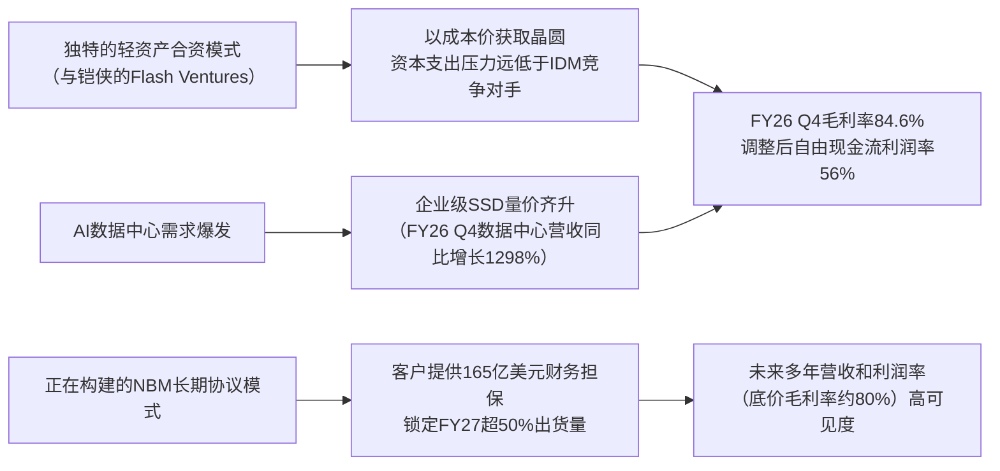

<!-- 匹配到的证券/行业：闪迪(SNDK.O) -->
操作成功

### 一页通 （闪迪 (SNDK.O)）
日期：2026-08-06
内容："""
## 公司概况

闪迪是全球领先的基于NAND闪存技术的数据存储设备及解决方案开发商、制造商与供应商。公司产品线横跨消费级存储卡、企业级固态硬盘（SSD）及数据中心存储解决方案，覆盖数据中心、边缘设备及消费者三大终端市场。公司于2025年2月从西部数据完成分拆，以独立公司身份在纳斯达克重新上市，战略重心聚焦于AI驱动的数据中心存储业务。闪迪依托与铠侠长达二十余年的合资体系（Flash Ventures）获取低成本晶圆供给，并自研控制器，形成差异化竞争力。    

## 公司近况跟踪

- <strong>FY26 Q4业绩大幅超预期，但FY27 Q1营收指引低于市场一致预期</strong>：FY26 Q4营收<strong>89.65亿美元</strong>，同比增长372%，环比增长51%，高于指引上限（77.5亿-82.5亿美元）及市场预期（约86亿美元）。Non-GAAP毛利率<strong>84.6%</strong>，高于指引上限（79%-81%）。Non-GAAP每股收益<strong>39.25美元</strong>，远超指引（30-33美元）。然而，FY27 Q1营收指引中值为<strong>105.5亿美元</strong>，低于市场预期的111.6亿美元，引发盘后股价下跌。EPS指引中值<strong>45美元</strong>，与市场预期基本持平。    

- <strong>新业务模式（NBM）进展显著，已锁定未来大量出货量</strong>：公司已与<strong>8家</strong>客户签署共<strong>10份</strong>NBM协议，加权平均期限超过<strong>4年</strong>。这些协议已锁定FY27 <strong>超过50%</strong> 的bit出货量，以及FY28约<strong>三分之二</strong>的bit出货量。按协议底价计算的最低合同收入达<strong>939亿美元</strong>，客户提供的现金存款和金融担保合计<strong>165亿美元</strong>。   

- <strong>数据中心业务成为核心增长引擎</strong>：FY26 Q4数据中心营收<strong>29.77亿美元</strong>，环比增长103%，同比增长1298%。FY26全财年数据中心营收<strong>51.53亿美元</strong>，同比增长437%。其bit出货量占比从一年前的约<strong>12%</strong> 提升至FY26末的<strong>38%</strong>。  

- <strong>启动大规模股份回购计划</strong>：FY26 Q4公司斥资<strong>45亿美元</strong>回购了283.6万股。董事会新批准<strong>140亿美元</strong>回购计划，使总剩余授权额度达到<strong>155亿美元</strong>。  

- <strong>管理层对市场展望极为乐观</strong>：管理层预计2026日历年NAND行业收入将超<strong>3000亿美元</strong>，2027年将接近<strong>5000亿美元</strong>。客户需求增速快于公司供应增长，bit供应紧张状态预计将持续至<strong>2027年以后</strong>。 

## 短期逻辑

1. <strong>NBM协议的结构性重估机会</strong>：公司已通过NBM协议锁定了FY27超过50%及FY28约三分之二的bit出货量，加权平均期限超4年，且包含底价和财务担保。这一转变将公司业务模式从传统的季度议价、高波动性商品模式，转向具有多年高可见度、高利润率底价保障的类合约模式。市场当前可能仍以周期股框架对其定价，但若后续几个季度NBM协议持续落地并稳定兑现其80%左右的底价毛利率，可能触发对公司盈利可持续性的重新评估，从而带来估值体系从周期PE向更高倍数切换的交易机会。   

2. <strong>FY27 Q1指引低于预期引发的短期情绪波动与预期差</strong>：公司给出的FY27 Q1营收指引中值105.5亿美元，低于市场一致预期的111.6亿美元，主要反映了涨价节奏的主动放缓和因履行NBM协议而增加库存导致的sellable bit增速下调。这可能导致股价短期承压。然而，EPS指引中值45美元与市场预期基本一致，且毛利率指引维持在83%-85%的高位。若后续季度ASP维持温和上涨，而市场过度反应了“增速放缓”的担忧，则可能出现因悲观情绪修复带来的反弹机会。   

3. <strong>高带宽闪存（HBF）的催化潜力</strong>：公司与SK海力士合作，正通过开放计算项目（OCP）推动HBF技术标准化，谷歌已作为早期成员加入。HBF旨在将NAND闪存转变为AI推理架构中靠近GPU的高带宽、高容量内存扩展层，若成功商业化，将大幅拓宽NAND的应用边界和公司的可触达市场。公司计划在2027年上半年推出HBF控制器硬件。任何关于HBF样品、客户导入或新合作伙伴的积极进展，都可能成为提振市场对公司长期增长预期的重要事件性催化剂。   

## 长期逻辑

1. <strong>AI推理驱动的NAND需求结构性扩张</strong>：与以往由PC和智能手机驱动的周期不同，本轮NAND需求的核心驱动力来自AI数据中心。随着大语言模型向更长上下文窗口、多模态和代理式AI演进，推理工作负载对高容量、高性能存储的需求呈指数级增长。具体表现为：训练侧的Checkpoint写入、推理侧的KV Cache因上下文扩展而溢出DRAM后向SSD卸载、以及检索增强生成（RAG）技术带来的高IOPS向量数据库需求。这些应用场景将NAND从传统的“存储”角色提升为影响AI推理性能和成本的关键“内存/存储”层级，其需求粘性和增长持续性远强于消费电子周期。   

2. <strong>NBM模式重塑商业模式，降低周期波动性</strong>：公司推行的NBM协议，通过3-5年的长约、底价机制和客户财务担保，将大部分收入基础从随行就市的现货交易转变为具有高可见度的经常性收入。这不仅为公司提供了未来数年稳定的现金流和利润率底线（约80%毛利率），也从根本上改变了公司与下游客户的关系——从单纯的供应商转变为战略合作伙伴。随着NBM覆盖比例在未来几年进一步提升，公司的盈利波动性有望系统性降低，从而可能推动其估值中枢从周期股向成长股/类SaaS模式靠拢。   

3. <strong>技术领先与产品组合向高价值领域持续迁移</strong>：公司通过BiCS8（218层）技术的大规模量产，在TLC和QLC企业级SSD领域建立了性能和成本优势，并计划于2026年底投产BiCS10（332层）。同时，公司正积极布局下一代高带宽闪存（HBF）技术，旨在以接近DRAM的带宽和更低的成本，切入AI推理的紧耦合内存市场。这一技术路线若成功，将为公司打开一个全新的、规模可达数百亿美元的市场。此外，数据中心业务占比的持续提升（从FY25的约13%升至FY26 Q4的33%）将结构性改善公司的整体利润率水平和收入质量。   

## 风险提示

- <strong>NAND行业周期下行风险</strong>：尽管当前供需极度紧张，但NAND行业历史上具有强周期性。若未来AI基础设施投资增速放缓，或行业新增产能（包括长江存储等新进入者）集中释放，可能导致供需失衡，引发NAND价格大幅下跌。公司当前超高毛利率（84.6%）在很大程度上依赖于有利的定价环境，价格下行将对公司盈利造成非线性冲击。   

- <strong>NBM协议的执行与客户违约风险</strong>：NBM协议是公司估值逻辑重塑的核心，但其执行仍面临不确定性。尽管协议包含165亿美元的财务担保，但在行业进入深度下行周期时，客户仍可能选择违约并支付罚金，尤其是在现货价格远低于合约底价的情况下。此外，协议的具体条款（如价格上限的设定）可能在价格持续上涨时限制公司的盈利弹性。  

- <strong>技术迭代与竞争风险</strong>：公司在3D NAND层数竞赛中并非绝对领先，其当前量产主力BiCS8为218层，落后于SK海力士（321层）和三星（286层）。若公司在向BiCS10及更高层数技术转换过程中出现延迟或良率问题，可能导致其在企业级SSD市场的份额流失。同时，HBF作为一项前沿技术，其商业化前景、客户接受度和最终市场规模仍存在较大不确定性。  

## 近期要闻

- <strong>2026年7月</strong>：存储板块整体大幅回调，闪迪股价单月跌幅显著。市场归因于多重因素：对AI投资回报率的担忧加剧、Meta宣布出租闲置算力引发对算力稀缺性的质疑、以及中国存储厂商长鑫存储上市带来的竞争格局重估。同期，部分投行下调闪迪目标价，但维持“买入”评级。   

- <strong>2026年8月3日</strong>：闪迪与SK海力士宣布，通过开放计算项目（OCP）发布高带宽闪存（HBF）技术规范，谷歌作为联盟成员加入。此举标志着HBF技术在标准化和生态构建上迈出关键一步。  

- <strong>2026年8月5日</strong>：闪迪公布FY26 Q4财报。业绩大幅超出市场预期，但FY27 Q1营收指引低于市场一致预期，导致股价在盘后交易中一度下跌超过8%。   

## 未来催化

- <strong>2026年8月6日</strong>：公司在“未来内存和存储大会（FMS）”上举办HBF专题讨论会，可能披露更多关于HBF技术细节、产品路线图和客户合作进展的信息。  

- <strong>2026年8月（具体日期待定）</strong>：公司计划举办投资者日，预计将更新长期财务目标、市场需求展望、技术路线图以及资本回报计划。这将是市场验证公司NBM模式长期价值和HBF战略的关键窗口。  

- <strong>未来数月</strong>：公司可能宣布与新的超大规模云客户或企业级客户签署NBM协议，进一步提升未来收入的可见性和稳定性。  

## 公司业务模式及拆分

<strong>业务边际变化</strong>：公司自2025年2月独立上市后，战略重心全面转向AI数据中心存储市场。最显著的变化是数据中心业务收入从FY25的<strong>9.60亿美元</strong>（占比13%）爆发式增长至FY26的<strong>51.53亿美元</strong>（占比25%），成为增长的核心引擎。同时，公司大力推行NBM长期供货协议，从根本上改变了过去季度议价的业务模式，转向多年期、高可见度的合约模式。    

<strong>盈利模式</strong>：公司盈利主要来源于NAND闪存产品的制造与销售。其核心竞争力在于依托与铠侠的合资工厂（Flash Ventures）以成本价获取晶圆，叠加自研控制器和固件，形成从晶圆到解决方案的垂直整合能力。在当前的供需格局下，公司凭借技术产品的差异化（尤其是在企业级SSD领域）和行业整体的供给紧张，获得了极强的定价权，从而实现了超高的毛利率水平。   

<strong>业务拆分</strong>：
公司近年业务结构发生重大变化，数据中心业务占比快速提升，而传统的消费类业务占比持续萎缩。公司当前处于由AI驱动的<strong>业绩强兑现期</strong>，量价齐升推动营收和利润爆发式增长。   

<strong>细分业务拆分（按终端市场）</strong>

| 业务板块 | 指标 | FY2024 | FY2025 | FY2026 | FY26 Q4 |
|---|---|---|---|---|---|
| <strong>数据中心</strong> | 收入(亿美元) | 3.25 | 9.60 | 51.53 | 29.77 |
| | 同比(%) | -35.0 | 195.4 | 436.8 | 1298 |
| | 收入占比(%) | 4.9 | 13.1 | 25.4 | 33.2 |
| <strong>边缘计算</strong> | 收入(亿美元) | 40.69 | 41.27 | 121.60 | 54.32 |
| | 同比(%) | 11.9 | 1.4 | 194.6 | 392 |
| | 收入占比(%) | 61.1 | 56.1 | 60.1 | 60.6 |
| <strong>消费类</strong> | 收入(亿美元) | 22.69 | 22.68 | 29.35 | 5.56 |
| | 同比(%) | 16.4 | 0.0 | 29.4 | -5 |
| | 收入占比(%) | 34.1 | 30.8 | 14.5 | 6.2 |
| <strong>合计</strong> | <strong>总收入(亿美元)</strong> | <strong>66.63</strong> | <strong>73.55</strong> | <strong>202.48</strong> | <strong>89.65</strong> |

*注：FY2024和FY2025财年数据来源于公司年报，其中FY2024的年报中终端市场名称为“Cloud”、“Client”和“Consumer”，与FY2025及之后的“Datacenter”、“Edge”和“Consumer”口径一致。*

<strong>数据中心业务（FY26 Q4）</strong>：该业务是公司增长的核心支柱，主要提供面向AI训练和推理工作负载的企业级NVMe SSD。FY26 Q4营收<strong>29.77亿美元</strong>，同比增长1298%，环比增长103%。增长由量价齐升驱动，其中TLC企业级SSD是当前主力，QLC Stargate平台本季度开始贡献收入。该业务的bit出货量占比从一年前的约12%提升至FY26末的38%。   

<strong>边缘计算业务（FY26 Q4）</strong>：该业务覆盖PC、智能手机、汽车、游戏及IoT等领域的OEM客户，提供嵌入式存储产品。FY26 Q4营收<strong>54.32亿美元</strong>，同比增长392%，环比增长48%。增长主要由ASP大幅提升驱动。管理层指出，智能手机和PC市场在2026年面临单位出货量下滑的压力，但预计2027年将企稳并恢复增长。   

<strong>消费类业务（FY26 Q4）</strong>：该业务面向零售渠道，销售SD卡、U盘和消费级SSD等产品。FY26 Q4营收<strong>5.56亿美元</strong>，同比下降5%，环比下降32%。该业务定价调整速度慢于企业级市场，公司仍在寻求价格与出货量的最佳平衡点。   

## 核心竞争力

<strong>竞争要素 1：依托极高转换成本与战略绑定构筑的客户粘性（NBM模式）</strong>

- <strong>护城河定性</strong>：<strong>结构性护城河（正在构建中）</strong>。公司通过推行NBM多年期供货协议，正将客户关系从短期交易转变为长期战略绑定。这些协议包含底价机制和客户提供的巨额财务担保（165亿美元），极大地提高了客户的转换成本。一旦客户将闪迪的产品深度整合进其AI基础设施架构，并依赖其长期供应承诺，替换供应商的成本和风险将变得极高。   

- <strong>数据验证</strong>：截至FY26 Q4，公司已与8家客户签署10份NBM协议，锁定了FY27超50%和FY28约2/3的bit出货量。协议加权平均期限超4年，按底价计算的最低合同收入达<strong>939亿美元</strong>。客户提供的现金存款和金融担保合计<strong>165亿美元</strong>，占最低合同收入的17.5%。管理层表示，即使在底价下，这些协议的毛利率也能维持在<strong>80%左右</strong>。   

- <strong>动态演变</strong>：<strong>护城河变宽（巩固）</strong>。公司计划继续有选择性地与战略客户签署新的NBM协议。随着协议覆盖的出货量比例在未来几年进一步提升，公司业务的可见度和稳定性将持续增强，这将使其护城河不断拓宽。 

<strong>竞争要素 2：依托轻资产合资模式形成的成本与资本效率优势</strong>

- <strong>护城河定性</strong>：<strong>结构性护城河</strong>。闪迪通过与铠侠的合资公司Flash Ventures（闪迪持股49.9%），以成本价获取晶圆供应。这种模式使公司无需独自承担晶圆厂建设的巨额资本开支（CapEx），便能获得前沿工艺节点的产能，实现了轻资产运营。相较于美光、三星等完全垂直整合的IDM竞争对手，闪迪的资本支出压力更小，自由现金流生成能力更强，尤其是在行业上行周期中，盈利弹性更为突出。   

- <strong>数据验证</strong>：FY26 Q4，公司资本支出为<strong>5.62亿美元</strong>，仅占营收的6.3%。调整后自由现金流达到<strong>50.35亿美元</strong>，利润率为56%。公司已还清所有债务，资产负债表上的现金及现金等价物为<strong>47.62亿美元</strong>。公司宣布了总额达<strong>155亿美元</strong>的股票回购授权。  

- <strong>动态演变</strong>：<strong>护城河维持</strong>。公司与铠侠的合资协议已续约至2034年，确保了长期稳定的晶圆供给。公司未来的增长主要通过技术节点转换（如向BiCS10过渡）而非大规模新建晶圆厂来实现，这将使其资本效率优势得以维持。  

<strong>现阶段核心驱动力总结</strong>：公司的Alpha在于其独特的轻资产合资模式带来的结构性成本优势和正在构建的NBM模式带来的客户粘性，这使其在行业上行周期中展现出极强的盈利弹性和现金流生成能力。其Beta则高度依赖于AI驱动的NAND行业景气度，尤其是数据中心需求的持续性和NAND价格的走势。  

<strong>竞争格局传导逻辑图</strong>

## 产销链

- <strong>客户情况</strong>：公司客户结构正从以消费电子OEM和渠道商为主，快速向大型云服务提供商（CSP）和企业级客户倾斜。FY26 Q4，数据中心业务收入占比已达33%。公司已与8家战略客户签署了NBM长期供货协议，这些客户来自数据中心和边缘计算市场。协议包含总额<strong>165亿美元</strong>的客户财务担保，显示了客户对确保供应的强烈意愿和合同的高约束力。FY25及FY24年报显示，没有单一客户收入占比超过10%，但NBM协议的签署意味着未来客户集中度可能显著提升，带来对单一客户依赖的风险。   

- <strong>供应商情况</strong>：公司的核心原材料是NAND晶圆，几乎全部从与铠侠的合资企业Flash Ventures采购。该合资企业运营着位于日本四日市和北上的多家工厂，闪迪持有49.9%的股权。这种安排使闪迪能够以成本价获得稳定、前沿的晶圆供应，是其核心成本优势的来源。此外，公司自研SSD控制器，由第三方代工厂制造。封装测试环节则由公司位于马来西亚槟城的自有工厂和与JCET在中国的合资企业共同完成。  

- <strong>经销商情况</strong>：公司的消费类产品主要通过全球范围内的零售商和分销商网络进行销售。这部分业务在FY26 Q4占总营收的6.2%，且收入同比下降5%，表明在当前高定价环境下，消费类市场的需求受到抑制。公司未披露详细的经销商库存或利润数据。  

- <strong>成本传导能力</strong>：在当前供给严重紧张的卖方市场格局下，公司展现出极强的成本传导能力。当上游原材料或生产成本上升时，公司不仅能顺利将成本转嫁给下游客户，还能通过提高产品售价获取超额利润。FY26 Q4毛利率高达84.6%，是这一能力的直接体现。公司赚取的是<strong>技术、产能稀缺性及品牌溢价</strong>的复合收益，而非单纯的加工费。  

## 财务数据

<strong>关键财务数据</strong>

| 指标 | FY2023 | FY2024 | FY2025 | FY2026 |
|---|---|---|---|---|
| <strong>截止日期</strong> | 2023-06-30 | 2024-06-28 | 2025-06-27 | 2026-07-03 |
| 营业总收入(亿美元) | 60.86 | 66.63 | 73.55 | 202.48 |
| 收入同比(%) | - | 9.48 | 10.39 | 175.30 |
| 营业成本(亿美元) | 56.56 | 55.91 | 51.43 | 59.31 |
| 毛利润(亿美元) | 4.30 | 10.72 | 22.12 | 143.17 |
| <strong>毛利率(%)</strong> | <strong>7.07</strong> | <strong>16.09</strong> | <strong>30.07</strong> | <strong>70.71</strong> |
| 研发费用(亿美元) | 11.67 | 10.61 | 11.32 | 14.59 |
| 销售及管理费用(亿美元) | 5.58 | 4.55 | 5.73 | 4.79 |
| 营业利润(亿美元) | -12.95 | -4.44 | 5.07 | 123.79 |
| 归母净利润(亿美元) | -21.43 | -6.72 | -16.41 | 114.33 |
| 归母净利润同比(%) | - | 68.64 | -144.20 | 796.71 |
| 基本每股收益(美元) | -14.78 | -4.63 | -11.32 | 73.76 |
| 经营活动现金流(亿美元) | -7.13 | -3.09 | 0.84 | 116.71 |
| 资本支出(亿美元) | 2.19 | 1.66 | 2.04 | 1.77 |
| <strong>自由现金流(亿美元)</strong> | <strong>-9.32</strong> | <strong>-4.75</strong> | <strong>-1.20</strong> | <strong>114.94</strong> |

*注：1. FY2026财年包含53周，其他财年为52周。2. 自由现金流 = 经营活动现金流 - 资本支出。*

<strong>财务分析</strong>：

- <strong>成长能力</strong>：公司FY2026营收同比增长<strong>175.30%</strong>，呈现出爆发式增长。这一增长主要由AI数据中心需求驱动的量价齐升所推动，其中ASP（平均售价）的提升是更主要的贡献因素。FY26 Q4营收环比增长51%，其中约三分之二来自价格上涨，三分之一来自出货量增长。   

- <strong>盈利能力</strong>：公司毛利率从FY2025的<strong>30.07%</strong> 飙升至FY2026的<strong>70.71%</strong>，FY26 Q4更是达到<strong>84.6%</strong> 的峰值。这充分体现了公司在供给紧张、需求旺盛的市场环境下的超强定价能力，以及其轻资产模式下成本相对刚性的特点。净利润从FY2025的亏损16.41亿美元转为FY2026的盈利114.33亿美元，实现了质的飞跃。  

- <strong>现金流</strong>：FY2026经营活动现金流高达<strong>116.71亿美元</strong>，自由现金流为<strong>114.94亿美元</strong>，显示出公司强劲的“造血”能力。这与FY2023-FY2025连续三年自由现金流为负的状况形成鲜明对比。健康的现金流使公司能够偿还所有债务，并启动大规模的股份回购计划。  

- <strong>运营能力</strong>：FY26 Q4的现金转换周期为140天，同比减少10天。其中，应收账款周转天数（DSO）为42天，同比减少11天，回款能力增强。库存周转天数（DIO）为158天，同比增加8天，管理层解释为主动增加库存以履行NBM协议和应对更高的零部件成本。  

## 行业及竞争分析

<strong>行业分析</strong>：闪迪所处的NAND闪存行业，正经历由AI驱动的结构性需求扩张。与历史上由PC和智能手机驱动的周期不同，本轮增长的核心驱动力来自数据中心。AI训练中的Checkpoint写入、推理场景下因上下文长度增加而溢出的KV Cache、以及RAG技术带来的高IOPS向量数据库需求，共同构成了对高性能、大容量NAND存储的强劲且持续的需求。管理层预计，2026年NAND行业收入将超<strong>3000亿美元</strong>，2027年将接近<strong>5000亿美元</strong>。数据中心占NAND总TAM的比重预计将从2025年的约30%提升至2026年的约50%。   

供给侧，NAND行业具有高资本壁垒和寡头垄断特征。前五大厂商（三星、SK海力士、铠侠、闪迪、美光）占据了约90%的市场份额。由于主要厂商将资本开支优先投向DRAM和HBM，且3D NAND制造本身面临设备、洁净室和人才等多重长周期约束，行业整体供给增长有限。这种供需错配是当前NAND价格持续上涨、行业景气度维持高位的根本原因。  

<strong>竞争格局</strong>：在企业级SSD市场，三星和SK集团（含Solidigm）凭借先发优势和规模效应占据主导地位，2025年Q4合计市场份额约64%。闪迪的市场份额为4.1%，但增速迅猛（QoQ增长63.6%），正凭借BiCS8技术和自研控制器的差异化产品组合快速追赶。在消费类市场，闪迪拥有强大的品牌认知度和全球渠道网络，但面临长江存储等新进入者的价格竞争。  

<strong>可比公司分析</strong>

| 公司名称 | 股票代码 | 业务侧重 | 估值水平(FY27 P/E) | 核心优势 |
|---|---|---|---|---|
| 三星电子 | 005930.KS | DRAM、NAND、逻辑芯片 | 约5.4x | 规模效应、全产业链布局 |
| SK海力士 | 000660.KS | DRAM、NAND | 约5.9x | HBM市场领导者 |
| 美光科技 | MU.O | DRAM、NAND | 约8.9x | 技术领先、美国本土制造 |
| 铠侠 | - | NAND | 约8x | 与闪迪的合资工厂、NAND技术 |

<strong>总结分析</strong>：与可比公司相比，闪迪作为纯粹的NAND标的，其估值（FY27 P/E约8.8x）高于SK海力士和三星电子，与美光和铠侠相近。这反映了市场对其作为纯NAND标的在AI驱动的数据中心存储市场中高成长性的认可。然而，相较于拥有DRAM/HBM业务的竞争对手，闪迪的业务单一性既是其在NAND上行周期中弹性更大的优势，也是其在行业下行或技术变革时风险更集中的劣势。公司正通过HBF等新技术布局，试图拓宽其业务边界。  

## 市场焦点议题

<strong>议题一：NBM协议能否真正重塑公司的估值范式？</strong>

- <strong>背景</strong>：公司正大力推行NBM长期供货协议，已锁定FY27超50%的出货量。该模式旨在降低周期波动、提高收入可见性。市场对此存在分歧，一方认为这将使公司从周期股转变为类成长股，应享受更高估值；另一方则担忧协议中的价格上限条款会限制公司在超级周期中的盈利弹性，且协议的长期可执行性有待检验。   

- <strong>问题列表</strong>：
  - NBM协议底价对应的80%毛利率，在行业下行周期中是否足够稳固？客户的165亿美元财务担保在系统性风险面前的实际保障效力如何？
  - 协议中的价格上限机制，是否意味着公司已经主动放弃了未来ASP进一步大幅上涨的潜在利润？
  - 随着NBM占比提升，公司的盈利波动性是否会如预期般系统性降低？市场何时会开始以更稳定的现金流折现模型而非周期市盈率对其进行估值？

<strong>议题二：FY27 Q1营收指引低于预期，是增速的阶段性放缓还是景气度的拐点？</strong>

- <strong>背景</strong>：公司给出的FY27 Q1营收指引中值105.5亿美元，低于市场一致预期。公司解释为涨价节奏放缓和为NBM备货导致的sellable bit增速下调。由于股价前期涨幅巨大，市场对任何增速放缓的信号都极为敏感。   

- <strong>问题列表</strong>：
  - 营收指引低于预期，多大程度上是公司为推行NBM模式、维持长期客户关系而主动进行定价克制的结果？
  - 管理层提及的“温和价格上涨”，是否意味着NAND ASP的环比涨幅已接近尾声？Q3行业调研显示消费类价格已见顶，这一趋势是否会向企业级市场蔓延？
  - 公司下调FY27 sellable bit增速至中双位数，这是否意味着公司产能扩张或技术转换节奏慢于预期？

<strong>议题三：HBF技术的商业化前景与潜在市场规模</strong>

- <strong>背景</strong>：HBF被视为闪迪未来增长的重要期权，旨在将NAND闪存的应用边界拓展至紧耦合的AI内存层。公司与SK海力士的合作及谷歌的加入，增加了该技术的可信度。但其最终能否成功商业化，以及能创造多大的市场价值，仍存在巨大的不确定性。   

- <strong>问题列表</strong>：
  - HBF在延迟、写入耐久性等方面的技术挑战能否在2027年样品推出时得到有效解决，以满足AI推理的严苛要求？
  - 除了谷歌，是否有其他超大规模客户（如微软、亚马逊）对HBF表现出明确的导入兴趣？
  - HBF的目标市场是替代部分DRAM/HBM，还是创造一个全新的存储层级？其可触达市场规模（TAM）的量化依据是什么？

## 市场分歧探讨

<strong>核心分歧：当前84.6%的毛利率是结构性提升的起点，还是周期性的顶点？</strong>

市场对闪迪当前超高的盈利能力能否持续存在根本性分歧，这直接决定了公司应被赋予周期股还是成长股的估值。   

<strong>乐观方观点：结构性提升，高毛利率具备持续性。</strong>

- <strong>判断逻辑</strong>：本轮NAND需求由AI这一结构性趋势驱动，而非短暂的库存周期。数据中心客户对高性能存储的需求粘性强、价格敏感度相对较低，且愿意通过NBM长协锁定供应，这使得公司的收入基础和利润率远高于以往周期。  
- <strong>支撑依据</strong>：
  1. <strong>NBM协议锁定高利润率</strong>：公司已签署的NBM协议，即使在底价下也能保证约80%的毛利率，且锁定了FY27超50%的出货量。这为公司未来1-2年的盈利提供了坚实的底线保障。  
  2. <strong>成本优势与定价纪律</strong>：轻资产的合资模式赋予公司结构性成本优势。同时，管理层明确表示，维持mid-80s的毛利率是“公平回报”，并主动通过NBM机制消除行业的“繁荣-萧条”周期，显示出前所未有的定价纪律。  
  3. <strong>需求可见性极强</strong>：客户需求信号已延伸至2020年代末，且已有签约客户在一个季度后就要求增加供应。公司预计bit供应紧张状态将持续至2027年以后。 

<strong>谨慎方观点：周期性顶点，均值回归是必然规律。</strong>

- <strong>判断逻辑</strong>：NAND本质上仍是大宗商品，其价格和利润率最终由供需决定。当前超过80%的毛利率是不可持续的，会吸引新进入者并刺激现有厂商扩张产能，最终导致供给过剩和价格暴跌。NBM协议无法改变这一行业根本属性。  
- <strong>支撑依据</strong>：
  1. <strong>历史周期规律</strong>：存储行业历史上从未有过如此高且持久的利润率。过往的“超级周期”最终都以产能过剩和价格暴跌告终。  
  2. <strong>供给端潜在压力</strong>：尽管短期供给紧张，但长江存储等新玩家正在激进扩产，三星、海力士等巨头也可能在后期将资本开支重新转向NAND。供给的滞后性释放可能在2028年及以后形成巨大压力。  
  3. <strong>需求端的不确定性</strong>：AI基础设施投资本身存在周期性。若未来AI应用的商业化回报不及预期，云厂商的资本开支可能放缓，对NAND的需求将受到直接冲击。消费电子市场的需求已经因高价而受到抑制。  

<strong>总结分析</strong>：当前闪迪的超高毛利率是强现实与强预期共同作用的结果。乐观方的逻辑在短期内（1-2年）有NBM协议和紧张的供需关系作为坚实支撑，难以被证伪。然而，谨慎方提出的周期规律和供给端潜在压力，是悬在长期估值上方的达摩克利斯之剑。公司的投资价值，取决于投资者愿意为当前的高盈利可见性支付多高的价格，以及对管理层能否通过NBM和HBF等战略成功“驯服”周期、实现长期可持续增长的判断。  

## 盈利预测与估值

<strong>管理层最新指引</strong>：
- <strong>FY27 Q1</strong>：营收<strong>103亿-108亿美元</strong>；Non-GAAP毛利率<strong>83%-85%</strong>；Non-GAAP每股收益<strong>44-46美元</strong>。   
- <strong>FY27全年</strong>：sellable bit增长率约<strong>中双位数</strong>（mid-teens），低于长期目标（mid-to-high teens）；资本支出占营收比例降至约<strong>6%</strong>。  

<strong>券商盈利预测与估值</strong>

| 机构 | 评级 | 目标价(美元) | 财务指标 | FY2026E | FY2027E | FY2028E |
|---|---|---|---|---|---|---|
| 高盛 (2026-08-06) | 买入 | 2,200 | 营业收入(百万美元) | 20,124.5 | 53,717.9 | 64,403.4 |
| | | | EPS(美元) | 69.07 | 225.44 | 244.95 |
| 摩根士丹利 (2026-06-22) | 增持 | 1,750 | 营业收入(百万美元) | 19,480 | 48,826 | 43,405 |
| | | | EPS(美元) | 65.03 | 214.73 | 179.97 |
| 花旗 (2026-08-06) | 买入 | 2,500 | 营业收入(百万美元) | - | - | - |
| | | | EPS(美元) | 68.47 | 222.15 | 225.88 |
| 美国银行 (2026-07-02) | 买入 | 2,500 | 营业收入(百万美元) | 20,361.3 | 53,422.6 | 57,483.8 |
| | | | EPS(美元) | 68.89 | 233.07 | 254.24 |
| 东吴证券 (2026-05-27) | 买入 | - | 营业收入(亿美元) | 208.03 | 430.59 | 465.03 |
| | | | EPS(美元) | 74.01 | 179.77 | 185.39 |

<strong>盈利预期与估值分析</strong>：主流券商对闪迪FY2027的EPS预测集中在<strong>215-233美元</strong>区间，显示出对公司中期盈利能力的高度共识。以FY2027年EPS预测计算，公司当前估值约为<strong>6-7倍市盈率</strong>。这一估值水平相较于标普500指数（约20倍）和公司历史峰值周期估值（10-13倍）均有显著折价，反映了市场对其盈利可持续性的深度怀疑和强烈的周期股定价惯性。花旗和美国银行给出的2,500美元目标价，隐含了约11倍的FY27市盈率，其核心假设是NBM模式的成功将推动估值体系切换。而摩根士丹利1,750美元的目标价则更为保守，采用了基于“穿越周期平均EPS”的估值框架，隐含了对未来盈利均值回归的预期。机构间的分歧核心在于对公司“穿越周期”能力的判断。
"""
