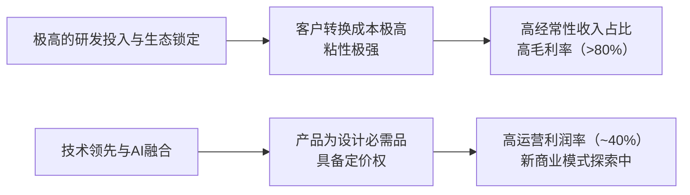

<!-- 匹配到的证券/行业：新思科技(SNPS.O) -->
操作成功

### 一页通 （新思科技 (SNPS.O)）
日期：2026-08-06
内容："""
## 公司概况

新思科技是全球领先的“从硅到系统”工程解决方案提供商，核心业务涵盖电子设计自动化（EDA）软件、半导体知识产权（IP）以及仿真与分析（S&A）软件。公司于2025年7月完成对工程仿真巨头Ansys的收购，将业务版图从芯片设计延伸至多物理场系统级仿真，形成覆盖芯片、IP到系统设计的全栈能力。公司在EDA和接口IP领域稳居全球第一，在S&A领域同样处于全球领导者地位，客户覆盖全球主要半导体、航空航天、汽车及工业厂商。  

## 公司近况跟踪

- <strong>FY26Q2业绩超预期，全年指引上调</strong>：公司FY26Q2（截至2026年4月30日）营收22.76亿美元，同比增长42%，高于市场一致预期。非GAAP运营利润率39.5%，非GAAP每股收益3.35美元，均显著超出指引与市场预期。管理层同步上调FY26全年收入、运营利润率、每股收益及自由现金流指引，全年收入指引中点上移至96.65亿美元，非GAAP每股收益指引中点上移至14.76美元。   

- <strong>Ansys整合加速，成本协同效应提前兑现</strong>：管理层表示，预计到FY26末将实现约50%的承诺成本协同效应（原定目标为交易完成后第三年实现4亿美元），进度快于原计划。首批联合产品（Multiphysics Fusion）已于2026年3月发布，客户评估积极，部分客户有望从评估阶段进入生产使用。   

- <strong>Design IP业务确认触底回升</strong>：管理层明确FY26Q1为IP业务底部，Q2实现环比增长12%，并承诺后续季度持续环比改善。增长动力来自AI超大规模客户对定制化芯片（COT）需求的增加，公司正与客户协商将商业模式从纯授权费转向“授权费+特许权使用费”，以分享客户芯片量产的增量收益。  

- <strong>产品组合优化，退出非核心业务</strong>：公司于2026年4-5月通知三星、SK海力士等十余家芯片制造商，将停售部分传统制造分析产品（如EES、FDC软件），以集中资源发展高利润的AI驱动EDA业务。同时，公司已于2026年6月完成向GlobalFoundries出售处理器IP解决方案业务的交易。  

- <strong>资本配置积极，启动大规模回购</strong>：公司在FY26Q1偿还全部约34亿美元定期贷款后，董事会于2026年2月批准将股票回购计划额度补充至20亿美元。Q2期间，公司签订了2.5亿美元的加速股票回购协议（ASR），并在公开市场额外回购了5000万美元股票。 

## 短期逻辑

1.  <strong>Design IP业务复苏的预期差</strong>：市场对SNPS最大的疑虑之一在于其Design IP业务自FY25以来的持续疲软。然而，FY26Q2的数据（营收4.54亿美元，环比+12%）已初步验证了管理层“Q1为底部”的判断。更重要的是，近期行业动态提供了强劲的复苏催化剂：Intel Foundry的18A-P工艺节点进入风险生产阶段，且据报道已获得苹果、谷歌等关键客户的订单承诺。作为Intel的“主要合作伙伴”和基础IP核心供应商，Synopsys将直接受益于Intel Foundry客户导入带来的IP授权需求。这一需求复苏尚未完全体现在当前市场预期中，构成了未来1-2个季度潜在的业绩超预期空间。  

2.  <strong>Ansys整合的利润率弹性</strong>：市场对大型并购整合的执行风险通常给予折价。SNPS在Q2展示了超预期的成本协同兑现速度（预计FY26末实现50%的4亿美元成本协同目标），并启动了裁员10%的重组计划。随着低毛利传统制造分析产品的退出和Ansys渠道会计处理的调整，公司FY26全年运营利润率指引已上调至约41%。若下半年整合进展继续超预期，利润率存在进一步上修的可能，这将成为驱动股价修复的关键财务指标。  

3.  <strong>Agentic AI与新商业模式的催化</strong>：公司计划于2026年9月30日举办投资者日，届时将详细阐述AgentEngineer技术和IP新商业模式（“工厂2”）的具体变现路径。在7月26日的DAC大会上，公司已展示了与英伟达合作的全自主设计验证智能体工作流，声称可将验证收敛时间从数周压缩至数小时。若投资者日上公司能给出清晰的AI相关收入贡献时间表和量化目标，将有助于市场将SNPS从“AI受益者”的模糊概念重新定价为“AI驱动生产力革命”的核心平台。  

## 长期逻辑

1.  <strong>“硅到系统”全栈平台构筑结构性护城河</strong>：收购Ansys使Synopsys成为唯一一家同时拥有顶级EDA、IP和多物理场仿真能力的厂商。随着芯片设计向3D-IC和Chiplet架构演进，散热、应力、电磁干扰等物理问题已成为设计成败的关键，必须通过多物理场仿真在设计早期解决。SNPS推出的Multiphysics Fusion产品，将Ansys的仿真求解器深度集成到EDA设计流程中，实现了“1+1>2”的技术协同。这种跨领域的深度集成能力极难复制，有望像当年Fusion Compiler整合数字设计流程一样，成为公司长期获取市场份额和定价权的核心武器。  

2.  <strong>AI驱动的设计范式变革打开收入天花板</strong>：公司正在推动EDA从“人类工程师使用工具”向“人类工程师+AI智能体协同设计”的范式转变。其AgentEngineer技术旨在通过多智能体协同，实现从规格定义到验证收敛的全流程自动化。这不仅能够解决半导体行业日益严重的工程师人才短缺问题，更重要的是，它将创造全新的变现层：除了传统的按“席位”收费的订阅模式，未来可能衍生出按“智能体使用量”或“模型微调”收费的新模式。这将使公司的可寻址市场（TAM）从EDA工具支出扩展到客户的整体研发预算，打开长期的收入增长空间。  

3.  <strong>深度绑定AI算力军备竞赛的“卖铲人”</strong>：AI模型的Scaling Law仍在持续，推动超大规模客户（Hyperscalers）不断推出自研定制芯片（如谷歌TPU、亚马逊Trainium），且迭代周期从18个月缩短至12个月。每一代新芯片都需要在更先进的制程节点上进行重新设计和验证，直接驱动了对EDA工具、接口IP和硬件辅助验证系统的刚性需求。Synopsys作为这些环节的全球领导者，其收入增长与AI算力投资的规模和强度高度正相关，具备长期的、穿越周期的结构性增长动力。  

## 风险提示

- <strong>Ansys整合与协同效应兑现不及预期</strong>：尽管成本协同效应兑现较快，但收入协同（如Multiphysics Fusion的规模化和交叉销售）的实现需要更长时间。若客户采用联合产品的速度慢于预期，或整合过程中出现文化冲突与关键人才流失，可能导致预期的“1+1>2”效应无法实现，届时市场将对公司支付的约350亿美元高溢价产生质疑，压制估值。  

- <strong>Design IP业务复苏的可持续性风险</strong>：IP业务具有项目制、收入确认时点集中等特征，波动性天然较高。当前复苏预期部分依赖于Intel Foundry客户导入的进度，而Intel 18A-P工艺的良率爬坡和客户实际投片量仍存在不确定性。若关键客户的芯片项目延迟或取消，IP业务可能再次出现季度间的显著波动，打击市场对公司增长稳定性的信心。  

- <strong>地缘政治与出口管制风险</strong>：公司约15%的收入来自中国市场。美国对华出口管制政策持续收紧，已对公司在中国区的业务（尤其是IP业务）造成负面影响。未来若管制范围进一步扩大至更多EDA工具或更广泛的实体清单，可能导致公司在中国市场的收入进一步下滑，且这部分市场份额可能被中国本土EDA厂商永久性替代。  

## 近期要闻

- <strong>2026年4-5月</strong>：据报道，新思科技通知三星、SK海力士等十余家芯片制造商，将停售部分传统制造分析软件（EES、FDC），以集中资源发展AI相关的高利润业务。  

- <strong>2026年5月27日</strong>：公司公布FY26Q2财报，营收及每股收益均超预期，并上调全年业绩指引。同时披露激进投资者Elliott Management的合伙人Jesse Cohn被任命为公司董事会成员。  

- <strong>2026年6月2日</strong>：公司完成向GlobalFoundries出售处理器IP解决方案业务的交易，进一步优化IP业务组合，聚焦高增长领域。 

- <strong>2026年6月17日</strong>：公司宣布Multiphysics Fusion产品正式商用，该产品是收购Ansys后推出的首款深度融合EDA与仿真分析的一体化解决方案。 

- <strong>2026年7月26日</strong>：在DAC大会上，公司宣布与英伟达合作，推出基于NVIDIA Nemotron模型的全自主芯片设计验证（DV）智能体工作流，号称可将验证时间从数周缩短至数小时。 

## 未来催化

- <strong>2026年8月（预计）</strong>：公司发布FY26Q3财报。市场将重点关注Design IP业务是否延续环比增长态势，以及管理层对全年业绩指引的进一步更新。 

- <strong>2026年9月30日</strong>：公司计划举办投资者日。预计管理层将详细阐述长期财务目标、AI战略（AgentEngineer）的变现路径、IP业务新商业模式的量化贡献，以及Ansys整合后的协同效应和长期增长框架。这是市场重新评估公司价值的核心催化剂。  

- <strong>2026年下半年</strong>：Intel 18A-P工艺节点预计将进入量产阶段。若Intel能顺利实现技术里程碑并获得关键客户订单，将直接拉动Synopsys的IP和EDA工具需求，成为验证公司IP业务复苏逻辑的关键事件。  

## 公司业务模式及拆分

<strong>业务边际变化</strong>：公司近年最重大的变化是于2025年7月完成对Ansys的收购，由此新增了仿真与分析（S&A）业务，并将其整合进设计自动化板块。此举将公司的能力从芯片设计拓展至系统级物理仿真。同时，公司正在进行业务组合优化，于2026年6月出售了处理器IP业务，并宣布停售部分传统制造分析软件，战略重心全面转向AI驱动的EDA、高价值接口IP和多物理场仿真。  

<strong>盈利模式</strong>：公司盈利模式的核心是基于其技术领先性和高客户粘性形成的<strong>结构性定价权</strong>。收入主要来源于三部分：1）EDA软件的订阅式授权（通常为2-3年期合同），提供持续的、可预测的经常性收入；2）IP的授权费（按设计项目收费）和版税收入；3）硬件辅助验证系统的销售。公司正积极探索新的收费模式，包括针对AI智能体的“按使用量付费”和针对定制化IP的“特许权使用费”，旨在从客户因AI带来的生产力提升中分享更多价值。  

<strong>业务拆分</strong>：
公司近年业务结构因收购Ansys和出售软件完整性业务而发生重大变化。目前分为两大报告分部：设计自动化（Design Automation）和设计IP（Design IP）。设计自动化分部包含了传统的EDA软件、硬件辅助验证、服务以及收购的Ansys S&A业务。FY26上半年，受益于Ansys的并表，设计自动化分部收入占比显著提升，成为公司最主要的收入来源。设计IP分部则处于触底复苏阶段，公司正通过聚焦高价值接口IP和探索定制化商业模式来恢复增长。 

<strong>细分业务拆分</strong>

| 项目 (百万美元) | FY2023 | FY2024 | FY2025 | FY26 H1 |
|---|---|---|---|---|
| <strong>截止日期</strong> | 2023-10-31 | 2024-10-31 | 2025-10-31 | 2026-04-30 |
| <strong>设计自动化</strong> | | | | |
| 收入 | 3,775.3 | 4,221.1 | 5,302.4 | 3,823.6 |
| 同比 | - | 11.8% | 25.6% | 78.5% |
| 占比 | 71.0% | 68.9% | 75.2% | 81.6% |
| 调整后运营利润率 | 37.4% | 38.7% | 41.7% | 45.4% |
| <strong>设计IP</strong> | | | | |
| 收入 | 1,542.7 | 1,906.3 | 1,751.8 | 861.2 |
| 同比 | - | 23.6% | -8.1% | -6.1% |
| 占比 | 29.0% | 31.1% | 24.8% | 18.4% |
| 调整后运营利润率 | 33.3% | 38.3% | 23.9% | 20.5% |

*注：FY26 H1数据为截至2026年4月30日的6个月数据，同比增速为与FY25 H1比较。*

- <strong>设计自动化（Design Automation）</strong>：该分部是公司最大的收入和利润来源，包括EDA软件、硬件辅助验证、服务以及Ansys的S&A业务。FY26Q2，该分部收入18.22亿美元，同比增长62.3%，调整后运营利润率为43.3%。增长主要得益于Ansys业务的贡献（Q2贡献约6.52亿美元）以及核心EDA和硬件业务的持续强劲。硬件辅助验证业务表现突出，公司在本季度赢得了一个关键AI/HPC客户的竞标。Ansys的整合进展顺利，管理层预计FY26全年Ansys收入贡献约为29亿美元，并已开始推出首批联合产品。 

- <strong>设计IP（Design IP）</strong>：该分部提供预设计的、可复用的电路模块，主要包括接口IP、基础IP、安全IP和嵌入式处理器IP。FY26Q2，该分部收入4.54亿美元，同比下降5.8%，但环比增长12%，确认了FY26Q1为近期底部。管理层正将业务重心从通用IP转向为AI超大规模客户提供定制化IP解决方案，并计划引入“特许权使用费”模式，以在客户芯片量产时获得增量收入。公司预计IP业务将在FY26下半年持续环比改善，并在FY27回归到公司整体增长水平。 

## 核心竞争力

<strong>竞争要素 1：依托极高转换成本与生态锁定构筑的客户粘性</strong>

-   <strong>护城河定性</strong>：<strong>结构性护城河</strong>。芯片设计是高度复杂、容错率极低的工程，一次失败的流片成本可达数亿美元。因此，客户对经过验证的EDA工具流程和IP具有极强的依赖性，更换供应商不仅需要重新培训工程师，还面临巨大的项目延迟风险。此外，EDA工具与晶圆厂的工艺设计套件（PDK）深度绑定，形成了强大的生态锁定效应。  
-   <strong>数据验证</strong>：公司在先进节点（16nm及以下）已支持超过1,400次流片，其数字设计工具（Fusion Compiler）和签核工具（PrimeTime）是行业“黄金标准”。公司整体客户留存率极高，合同通常为2-3年的不可取消订阅，FY26Q2末的积压订单（Backlog）高达110亿美元，覆盖了未来超过12个月约49%的预期收入，提供了极高的收入可见性。  
-   <strong>动态演变</strong>：<strong>护城河变宽（巩固）</strong>。随着公司通过收购Ansys将能力延伸至多物理场仿真，其平台集成度进一步提高。客户若采用Synopsys的“硅到系统”全流程方案，其转换成本将从单一的EDA工具链扩展到整个设计-仿真平台，粘性进一步增强。  

<strong>竞争要素 2：依托技术领先与AI融合形成的定价权</strong>

-   <strong>护城河定性</strong>：<strong>结构性护城河</strong>。公司在数字IC设计、验证和接口IP领域拥有全球领先的技术，其产品是客户实现芯片性能、功耗和面积（PPA）目标的关键。公司正将AI深度融入设计流程，其Synopsys.ai套件和AgentEngineer技术旨在实现设计自动化，这不仅是效率工具，更是帮助客户应对日益增长的芯片设计复杂度的必需品，从而支撑其定价权。  
-   <strong>数据验证</strong>：公司FY26Q2非GAAP毛利率高达84.6%，调整后运营利润率39.5%，均处于行业领先水平。在IP领域，一套3nm PCIe 7 PHY的授权费可达400-450万美元，体现了其高价值。公司占据全球接口IP市场57%的份额，在USB、PCIe、MIPI等关键领域的市占率均超过60%。  
-   <strong>动态演变</strong>：<strong>护城河变宽（巩固）</strong>。公司正在探索的“按智能体使用量收费”和“IP特许权使用费”等新商业模式，旨在将其技术价值与客户的项目成功更紧密地绑定。若这些新模式成功推广，公司的收入将从一次性或订阅式收费转向持续性、与客户产量挂钩的收费，定价权将得到质的提升。  

<strong>现阶段核心驱动力总结</strong>：
公司的Alpha来自于其通过Ansys整合和AI技术融合，正在构建一个前所未有的“硅到系统”全栈工程平台，这一战略的兑现将在未来1-3年持续创造超额收益。其Beta则与全球半导体研发投入和AI算力投资周期高度相关，是投资AI基础设施的核心受益标的。  

<strong>竞争格局传导逻辑图</strong>：

## 产销链

- <strong>客户情况</strong>：公司客户基础广泛，涵盖全球主要的无晶圆厂芯片设计公司、系统公司（如苹果、谷歌、微软、特斯拉）、集成器件制造商（如英特尔、三星）、晶圆代工厂（如台积电）和存储器公司。FY25年报显示，没有单一客户占营收超过10%，客户集中度风险较低。近年来，系统公司和AI超大规模客户成为增长最快的客户群体，其自研芯片需求为公司的EDA和IP业务带来了强劲增量。公司与英特尔保持着长期“主要合作伙伴”关系，是其代工业务导入客户的关键IP供应商。  

- <strong>供应商情况</strong>：作为一家软件和IP公司，Synopsys对传统意义上的原材料供应商依赖度低。其主要“供应”来自人才和算力。公司通过全球研发中心获取顶尖工程人才，并与英伟达等AI算力提供商合作，以加速其AI驱动EDA工具的开发与运行。  

- <strong>成本传导能力</strong>：公司赚取的是典型的“技术溢价”和“品牌溢价”。其软件和IP产品的直接边际成本极低，FY26Q2非GAAP毛利率高达84.6%。因此，公司对上游成本波动不敏感，其盈利能力主要取决于其技术领先性带来的定价权和对下游客户研发预算的渗透能力。 

## 财务数据

<strong>关键财务数据</strong>

| 项目 (百万美元) | FY2023 | FY2024 | FY2025 | FY26 H1 |
|---|---|---|---|---|
| <strong>截止日期</strong> | 2023-10-31 | 2024-10-31 | 2025-10-31 | 2026-04-30 |
| <strong>营业总收入</strong> | 5,318.0 | 6,127.4 | 7,054.2 | 4,684.8 |
| 同比 | - | 15.2% | 15.1% | 53.1% |
| <strong>营业总成本</strong> | 4,044.8 | 4,771.7 | 6,139.3 | 4,361.3 |
| <strong>营业利润</strong> | 1,273.2 | 1,355.7 | 914.9 | 323.5 |
| <strong>归母净利润</strong> | 1,229.9 | 2,263.4 | 1,332.2 | 82.1 |
| 同比 | - | 84.0% | -41.1% | -87.2% |
| <strong>毛利率</strong> | 80.6% | 79.7% | 77.0% | 72.9% |
| <strong>营业利润率</strong> | 23.9% | 22.1% | 13.0% | 6.9% |
| <strong>稀释每股收益 (美元)</strong> | 7.92 | 14.51 | 8.04 | 0.43 |
| <strong>经营活动现金流</strong> | 1,703.3 | 1,407.0 | 1,518.6 | 1,485.8 |
| <strong>自由现金流</strong> | 1,513.7 | 1,283.9 | 1,349.2 | 1,396.3 |

*注：自由现金流 = 经营活动现金流 - 资本性支出。FY26 H1数据为截至2026年4月30日的6个月数据。*

<strong>财务分析</strong>：

- <strong>成长能力</strong>：公司营收在FY24和FY25保持约15%的稳定增长。进入FY26，受Ansys并表影响，营收增速跃升至50%以上。剔除Ansys影响，核心EDA业务在FY26上半年仍实现了低双位数的有机增长，显示出健康的增长势头。然而，归母净利润在FY25和FY26 H1出现显著下滑，主要原因是收购Ansys带来的巨额无形资产摊销、利息支出增加以及重组费用，这些非现金或一次性项目扭曲了GAAP净利润的真实表现。 

- <strong>盈利能力</strong>：公司毛利率在FY26 H1下降至72.9%，主要受Ansys并表后收入结构变化和无形资产摊销增加的影响。但非GAAP毛利率仍维持在84.6%的高位，表明核心业务的盈利模式依然稳固。营业利润率在GAAP层面大幅下滑，同样受上述一次性因素干扰。公司管理层指引FY26全年非GAAP运营利润率约为41%，并计划通过成本协同和业务优化，长期将利润率提升至中40%区间。 

- <strong>偿债能力与现金流</strong>：为收购Ansys，公司大幅增加了债务，FY25末总债务达到134.85亿美元，净债务为105.24亿美元。但公司现金流强劲，FY26 H1经营活动现金流达14.86亿美元，自由现金流为13.96亿美元。公司已利用强劲的现金流和来自英伟达的20亿美元股权投资，在FY26上半年偿还了全部约34亿美元的定期贷款，并启动了股票回购。资产负债率从FY25末的41.3%下降至FY26 H1末的35.0%，显示出快速去杠杆的能力。 

## 行业及竞争分析

<strong>行业分析</strong>：
公司所处的核心行业是电子设计自动化（EDA）和半导体知识产权（IP），并已通过收购Ansys进入仿真与分析（S&A）市场。这是一个高度集中、技术壁垒极高的市场。  

- <strong>EDA市场</strong>：据SemiAnalysis估计，2025年全球EDA+IP总市场规模约为145亿美元，预计到2030年将增长至280-300亿美元。增长驱动力来自：1）芯片设计复杂度随先进制程演进持续提升；2）AI、HPC、自动驾驶等领域对定制化芯片的需求激增；3）3D-IC和Chiplet等新架构带来的新设计挑战。EDA行业呈现寡头垄断格局，Synopsys与Cadence是两大全球领导者，合计占据绝大部分市场份额。  

- <strong>IP市场</strong>：2025年全球接口IP市场规模约为24.38亿美元，预计到2030年将增长至45.37亿美元，年复合增长率13.2%。增长主要受AI和HPC对高速数据传输需求驱动。Synopsys在该市场占据57%的绝对主导份额，尤其在USB、PCIe、MIPI等关键接口IP领域拥有压倒性优势。 

- <strong>S&A市场</strong>：这是一个更广阔的市场，服务于航空航天、汽车、工业等多个行业。收购Ansys使Synopsys成为该领域的全球领导者，并将其与EDA业务结合，创造出“多物理场融合”这一新的增长赛道。  

<strong>竞争格局</strong>：

<strong>可比公司</strong>

| 公司名称 | 股票代码 | 对标维度 | 分析 |
|---|---|---|---|
| 铿腾电子 (Cadence) | CDNS | 核心EDA竞争对手 | 与Synopsys在数字设计、验证、IP等领域全面竞争。Cadence在模拟和混合信号设计、PCB设计方面有传统优势，而Synopsys在数字实现和签核领域更强。两者战略均转向AI驱动的智能体设计。 |
| 西门子EDA (Siemens EDA) | - | 核心EDA竞争对手 | 通过收购Mentor Graphics进入EDA市场，在物理验证（Calibre）和PCB设计领域是行业标准，但在数字IC设计全流程上竞争力弱于前两家。 |
| ARM Holdings | ARM | IP商业模式可比 | 作为CPU IP的领导者，其商业模式与Synopsys的IP业务高度相似，均采用“授权费+版税”模式。ARM是Synopsys IP的重要生态合作伙伴。 |

<strong>总结分析</strong>：Synopsys在EDA和IP行业拥有稳固的领先地位。其与Cadence的“双寡头”竞争格局稳定，竞争壁垒极高。收购Ansys是其差异化竞争的关键一步，使其能够提供从芯片到系统的统一设计平台，这是Cadence和西门子目前不具备的。在IP市场，虽然面临来自Cadence和Alphawave（已被高通收购）的竞争，但Synopsys在接口IP领域的统治地位短期内难以撼动。公司的核心竞争战略正从“提供最好的单点工具”转向“提供集成度最高、AI驱动的全流程平台”。   

## 市场焦点议题

- <strong>议题一：Design IP业务的复苏路径与可持续性</strong>
    - <strong>背景</strong>：Design IP业务在FY25因中国出口管制、关键客户需求疲软和内部执行问题而出现显著下滑，成为公司最大的拖累项。市场密切关注该业务能否以及何时恢复增长。  
    - <strong>问题列表</strong>：
        1.  FY26Q2的环比增长是否标志着IP业务的趋势性反转？后续季度的增长驱动力是什么？
        2.  公司提出的“工厂2”定制化IP和“特许权使用费”新商业模式，何时能对财务报表产生实质性贡献？其利润率与传统IP模式相比如何？
        3.  在Intel Foundry生态中，Synopsys的IP业务具体扮演什么角色，其收入机会有多大？

- <strong>议题二：Ansys收购后的整合效果与协同效应兑现</strong>
    - <strong>背景</strong>：以约350亿美元收购Ansys是公司历史上最大的一笔交易，显著改变了公司的资产负债表和业务结构。市场对整合风险以及预期的成本和收入协同效应能否实现存在分歧。  
    - <strong>问题列表</strong>：
        1.  成本协同效应的兑现速度（目前已超预期）能否持续？长期运营利润率目标（中40%区间）的实现路径和时间表是什么？
        2.  收入协同效应（如Multiphysics Fusion的销售）何时能规模化？公司如何量化“1+1>2”的交叉销售机会？
        3.  在整合过程中，是否存在客户流失或关键人才流失的风险？

- <strong>议题三：AI对EDA行业的颠覆性影响与公司的应对策略</strong>
    - <strong>背景</strong>：AI大模型的快速发展引发了市场对软件行业商业模式的担忧。投资者关心AI是否会降低EDA工具的门槛，从而削弱Synopsys的护城河，还是为其创造更大的价值。  
    - <strong>问题列表</strong>：
        1.  公司推出的AgentEngineer等AI智能体技术，是防御性的“自我颠覆”，还是能创造增量收入的新增长点？
        2.  公司计划如何对AI智能体功能进行定价和变现？“按使用量付费”模式与现有订阅模式如何共存？
        3.  与英伟达等AI厂商的合作，对公司的技术栈和竞争格局有何战略意义？

## 市场分歧探讨

<strong>核心分歧：Synopsys当前是处于“业绩阵痛期”的尾声，还是面临“增长范式”的长期挑战？</strong>

- <strong>乐观方观点：阵痛已过，即将迎来多引擎驱动的强劲复苏。</strong>
    - <strong>逻辑与依据</strong>：乐观方认为，FY25至FY26上半年的业绩疲软主要是由一系列一次性或周期性因素叠加所致，包括：1）Ansys收购带来的短期财务扭曲（摊销、利息支出）；2）中国出口管制和Intel项目延迟对IP业务的冲击；3）全球半导体非AI领域的周期性低迷。这些因素正在消退或已被充分消化。  
    - <strong>核心支撑</strong>：1）IP业务已在FY26Q1触底，Q2的环比增长和Intel Foundry的积极进展是明确的复苏信号；2）Ansys的成本协同效应兑现速度超预期，收入协同（Multiphysics Fusion）即将进入商业化阶段；3）AI驱动的芯片设计复杂度提升和Agentic AI带来的新商业模式，将为公司打开比传统EDA更大的市场空间。公司FY26全年指引的上调和9月投资者日的积极展望，将是验证这一观点的关键催化剂。  

- <strong>谨慎方观点：核心EDA增长放缓，新业务变现周期漫长，估值承压。</strong>
    - <strong>逻辑与依据</strong>：谨慎方承认公司的技术领导地位，但认为市场对其增长预期过于乐观。他们指出，剔除Ansys并表效应后，公司核心EDA业务的有机增长率已放缓至高个位数，落后于主要竞争对手Cadence。同时，IP业务的复苏仍面临客户项目波动和地缘政治的不确定性。  
    - <strong>核心支撑</strong>：1）Agentic AI和新商业模式（IP特许权使用费）的变现路径尚不清晰，至少要到FY27甚至更晚才能产生有意义的收入贡献，短期内无法弥补核心业务增速放缓的缺口；2）Ansys的收入协同需要较长时间才能验证，且整合大型组织存在固有的执行风险；3）公司当前约33倍的远期市盈率，虽然低于其历史均值，但相较于其放缓的有机增速，估值并不具备显著吸引力。在软件板块整体承压的背景下，估值进一步扩张的空间有限。  

<strong>总结分析</strong>：当前市场分歧的本质在于对公司增长“换挡期”时间长度的判断。乐观方看到的是多个强劲增长引擎即将点火，而谨慎方则担忧新引擎的启动速度不及老引擎的减速。从FY26Q2的数据和管理层指引来看，乐观方的部分论点（如IP触底、成本协同加速）已得到初步验证。然而，谨慎方关于核心EDA增速和AI变现周期的担忧，仍需在未来2-4个季度的财务数据中寻找答案。9月30日的投资者日将是弥合这一分歧的关键节点。  

## 盈利预测与估值

<strong>管理层最新指引</strong>：
根据FY26Q2财报，管理层提供的FY26全年指引（非GAAP）为：收入96.25亿-97.05亿美元；运营利润率约41%；每股收益14.72-14.80美元；自由现金流约20亿美元。 

<strong>券商盈利预测与估值</strong>

| 机构 | 评级 | 目标价(美元) | 营业收入(百万美元) | FY25A | FY26E | FY27E | FY28E |
|---|---|---|---|---|---|---|---|
| 摩根大通 (2026-05-28) | 超配 | 650 | 营业收入 | 7,054 | 9,667 | - | - |
| | | | 非GAAP EPS | 12.99 | 14.76 | - | - |
| 高盛 (2026-05-27) | 买入 | 600 | 营业收入 | 7,054 | 9,667 | 10,883 | 12,264 |
| | | | 非GAAP EPS | 12.99 | 14.75 | 18.60 | 22.00 |
| 德意志银行 (2026-05-28) | 买入 | 590 | 营业收入 | 7,054 | 9,706 | 10,820 | - |
| | | | 非GAAP EPS | 12.91 | 14.80 | 17.61 | - |
| 摩根士丹利 (2026-06-01) | 等权重 | 525 | 营业收入 | 7,054 | 9,767 | 10,796 | 11,936 |
| | | | 非GAAP EPS | 12.99 | 14.91 | 18.05 | 19.80 |
| 美国银行 (2026-02-27) | 买入 | 515 | 营业收入 | 7,054 | 9,610 | 10,675 | 11,860 |
| | | | 非GAAP EPS | 12.91 | 14.42 | 17.02 | 19.36 |

<strong>盈利预期与估值分析</strong>：
主流券商对公司的评级普遍为“买入”或“超配”，显示出市场对公司长期战略价值的认可。对FY26的营收预测集中在96-97亿美元区间，与管理层指引一致。然而，对FY27的预测则显示出较大分歧，非GAAP每股收益预测范围在17.02美元至18.60美元之间，反映出市场对IP业务复苏速度、Ansys协同效应释放节奏以及AI相关投入产出效率的不同判断。   

估值方法上，由于公司目前处于Ansys收购后的整合期，利润端受大量非现金摊销和一次性费用干扰，市盈率（P/E）估值法存在失真。多数机构采用远期市盈率（基于FY27或CY27预测利润）或企业价值倍数（EV/EBITDA）进行估值。例如，摩根大通和华泰证券分别采用约40倍远期市盈率和10.27倍市销率（P/S）进行估值。市场给予公司的估值倍数（约30-35倍远期市盈率）低于其5年历史均值（约38倍），反映了市场对上述不确定性的折价。若公司在未来几个季度能持续兑现业绩，并给出清晰的AI变现路径，估值存在向上修复的空间。
"""
