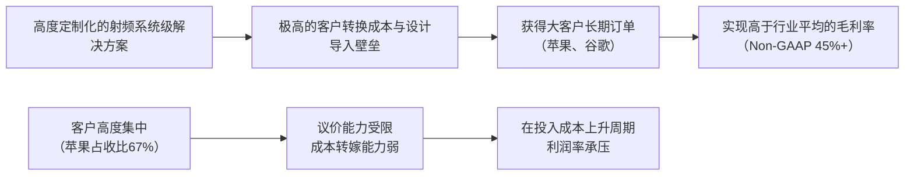

<!-- 匹配到的证券/行业：思佳讯(SWKS.O) -->
操作成功

### 一页通 （思佳讯 (SWKS.O)）
日期：2026-08-05
内容："""
## 公司概况

思佳讯是一家领先的模拟与混合信号半导体产品开发商、制造商和供应商，其产品广泛应用于航空航天、汽车、宽带、蜂窝基础设施、互联家庭、国防、工业、医疗、智能手机、平板电脑和可穿戴设备等领域。公司是射频前端市场的核心参与者，尤其在移动设备功率放大器、前端模块和滤波器方面占据重要地位。其业务高度集中于移动市场，其中<strong>苹果是最大客户，在2025财年贡献了约67%的净收入</strong>。为应对客户集中度风险并拓展市场，公司正通过内生增长和战略并购（如计划中的Qorvo合并）向汽车、数据中心、Wi-Fi等高增长领域多元化。  

## 公司近况跟踪

- <strong>Q3业绩超预期但Q4指引显示利润率承压</strong>：公司2026财年第三财季（截至2026年7月3日）营收<strong>9.35亿美元</strong>，Non-GAAP摊薄每股收益<strong>1.08美元</strong>，均高于指引中值。毛利率<strong>44.9%</strong>，符合预期。然而，对第四财季的指引显示，毛利率将因移动业务季节性占比提升和持续的投入成本通胀而降至<strong>44%-45%</strong>，略低于市场预期。   
- <strong>Qorvo合并交易监管审批取得进展，管理层信心增强</strong>：公司表示，中国国家市场监督管理总局（SAMR）的审查已进入<strong>第三阶段（最终阶段）</strong>，并正与其余司法管辖区的监管机构进行建设性合作。管理层对交易在<strong>2026日历年内</strong>完成持乐观态度，并准备最早于<strong>本财年内</strong>完成交割。  
- <strong>宣布重大资本配置策略转变</strong>：为配合合并后公司的资本配置框架，公司宣布<strong>不再派发季度股息</strong>，转而将资本用于股票回购、降低杠杆和战略性增值并购。同时，董事会批准了一项新的<strong>20亿美元</strong>股票回购计划，有效期至2029年1月。  
- <strong>移动业务稳定，安卓业务获得重大设计订单</strong>：移动业务需求稳健，最大客户苹果的终端销售健康。公司宣布与一家美国安卓OEM（推测为谷歌）达成一项多代设计合作，预计在<strong>2028至2030财年</strong>间产生超过<strong>10亿美元</strong>的累计收入，这验证了其在高端安卓市场的技术竞争力。    
- <strong>广泛市场业务增长引擎与消费类疲软并存</strong>：广泛市场业务营收<strong>4.03亿美元</strong>，同比增长<strong>8%</strong>。其中，Wi-Fi、数据中心和汽车三大增长引擎合计同比增长<strong>15%</strong>，但部分被消费类物联网市场的疲软所抵消。数据中心业务增长尤为强劲，即使在供应受限下，增速仍超过50%。 

## 短期逻辑

1.  <strong>Qorvo合并交易的监管审批进展是未来一个季度最核心的股价催化剂。</strong> 该交易已进入中国SAMR审查的第三阶段，即最终阶段，且公司正与剩余司法管辖区进行建设性沟通。管理层明确表示对在<strong>2026年内</strong>完成交易持乐观态度，并已开始为<strong>最早于本财年内</strong>完成交割做准备。若交易获得最终批准，将消除市场最大的不确定性，并有望触发对合并后实体盈利能力（预计至少<strong>5亿美元</strong>的成本协同效应）和规模效应的重新定价。任何关于审批进展的积极消息都可能成为股价上涨的直接驱动力。  

2.  <strong>苹果秋季新品发布（iPhone 18系列）的供应链拉货效应将为公司提供季节性的业绩支撑。</strong> 公司指引第四财季（截至9月）移动业务营收环比增长<strong>高双位数百分比</strong>，主要受最大客户新产品发布推动。尽管市场担忧存储芯片价格上涨可能抑制智能手机需求，但公司表示其产品主要集中于<strong>高端、高复杂度平台</strong>，该领域历来是市场中最具韧性的部分，且目前渠道库存处于低位，订单出货比大于1。若新机发布后终端销售符合或超出预期，将缓解市场对需求疲软的担忧，并可能带来业绩超预期的机会。 

3.  <strong>资本配置策略的转变（取消股息、转向大规模回购）可能引发投资者结构的调整和股价的短期波动。</strong> 公司决定取消约<strong>5%</strong> 的股息率，转而通过<strong>20亿美元</strong>的回购计划来回报股东。这一决策可能导致依赖股息的投资者离场，造成短期抛压。然而，对于关注长期价值的投资者而言，在低估值下进行大规模回购被视为更高效的资本运用方式，有望提升每股收益并支撑股价。市场对这一转变的消化和重新评估过程，将在未来一个季度内创造交易窗口。  

## 长期逻辑

1.  <strong>与Qorvo的合并将重塑公司竞争格局，打造一个规模更大、更多元化的射频与模拟半导体平台。</strong> 合并后的公司预计将拥有约<strong>77亿美元</strong>的收入平台和<strong>21亿美元</strong>的调整后EBITDA（不含协同效应）。该交易将显著扩大公司的总目标市场（TAM），尤其是在国防、航空航天和电源管理领域，并带来氮化镓（GaN）等关键技术。管理层预计在交易完成后的24至36个月内实现至少<strong>5亿美元</strong>的年度成本协同效应。这一战略举措有望从根本上解决公司长期以来的客户集中度问题，并提升其在产业链中的议价能力和盈利稳定性。  

2.  <strong>业务多元化战略，特别是广泛市场业务的持续扩张，是驱动公司长期增长和估值重评的关键。</strong> 公司的广泛市场业务已实现连续九个季度的增长，其中Wi-Fi 7、汽车互联和数据中心是三大核心增长引擎。随着AI工作负载向边缘迁移，对高性能连接（如Wi-Fi 7/8）和精密时序解决方案的需求正在加速增长。公司预计2026年数据中心业务收入增长将超过<strong>50%</strong>。随着这些高增长、长生命周期业务在总收入中的占比逐步提升，公司的收入结构将得到优化，其周期性特征将减弱，从而有望获得更高的估值倍数。 

3.  <strong>射频技术复杂度的长期提升趋势为公司提供了超越智能手机单元数量增长的长期价值增长空间。</strong> 随着5G演进至6G、卫星连接功能成为主流、以及AI驱动应用对上行链路性能提出更高要求，每台设备的射频含量（包括频段、滤波器、功率放大器等）正在增加。管理层指出，这是多年来首次出现射频复杂度增加的趋势，标志着行业从过去射频含量萎缩转向<strong>射频含量增长</strong>。公司凭借其广泛的专利组合（约<strong>5200项</strong>全球专利）和系统级解决方案能力，有望在这一技术升级周期中捕获更多单机价值量。  

## 风险提示

- <strong>核心客户高度集中风险</strong>：公司对苹果的依赖度极高，2025财年约<strong>67%</strong> 的净收入来自苹果。任何关于苹果产品销量不及预期、供应链策略调整（如引入更多供应商或自研组件）或削减订单的行为，都将对公司的营收和盈利能力产生直接且重大的影响。尽管公司正努力多元化，但在可预见的未来，苹果仍将是决定公司业绩走向的最核心变量。 
- <strong>Qorvo合并交易的执行与整合风险</strong>：尽管监管审批进展顺利，但交易仍存在最终无法完成的风险。即使交易完成，大规模整合也充满挑战，包括业务重叠可能导致的<strong>收入逆协同效应</strong>、关键人才流失、企业文化冲突以及协同效应兑现不及预期等。公司预计将筹集约<strong>20亿美元</strong>债务为交易融资，这将显著增加其财务杠杆，并可能限制其在整合初期的财务灵活性。   
- <strong>终端市场需求与投入成本压力</strong>：全球智能手机市场已进入存量替换阶段，需求增长乏力。存储芯片等上游元器件价格上涨可能抑制中低端手机需求，并间接影响整个供应链。同时，公司自身也面临金价、运费、加急费等投入成本持续上涨的压力。由于移动业务的定价通常在年初一次性确定，公司难以在周期内转嫁成本，导致毛利率持续承压。 

## 近期要闻

- <strong>2026年5月6日</strong>：公司公布2026财年第二财季财报，营收和每股收益均超出指引上限。同时宣布与一家领先安卓OEM达成一项多代设计合作，预计至2030年将产生超过10亿美元的累计收入。    
- <strong>2026年7月28日</strong>：公司公布2026财年第三财季财报，业绩超预期。同时宣布与Qorvo合并交易的监管审批在中国进入第三阶段，管理层对年内完成交易持乐观态度。公司还宣布了重大资本配置策略转变，包括取消季度股息和批准新的20亿美元股票回购计划。     
- <strong>2026年7月28日</strong>：公司宣布了合并后公司的预期领导团队，成员来自Skyworks和Qorvo双方，旨在为交易完成后的整合做准备。 

## 未来催化

- <strong>2026年8月至10月</strong>：Qorvo合并交易获得剩余关键司法管辖区（尤其是中国SAMR）的最终监管批准。这是决定交易能否在年内完成的最关键事件。  
- <strong>2026年9月</strong>：苹果公司发布新一代iPhone（iPhone 18系列）。作为公司最大客户，新品的配置、定价和市场反响将直接影响公司未来几个季度的订单能见度和业绩预期。 
- <strong>2026年9月至10月</strong>：公司可能在交易完成前启动约<strong>20亿美元</strong>的债务融资，以支付交易对价中的现金部分。融资的具体条款和成本将影响合并后公司的财务状况。  
- <strong>2026年11月初</strong>：公司预计将公布2026财年第四财季及全年财报，届时将提供2027财年的初步展望，包括对最大客户的内容量预期和合并后公司的整合计划。 

## 公司业务模式及拆分

### 业务边际变化

公司近年正经历从高度依赖单一移动客户向多元化平台型企业转型的关键时期。核心变化包括：1）通过计划中的Qorvo合并，大规模扩展业务版图，进入国防、GaN功率器件等新领域；2）在安卓市场取得突破，获得美国头部客户的长期大额订单，降低对苹果的单一依赖；3）广泛市场业务，特别是数据中心和Wi-Fi业务，正成为越来越重要的增长引擎，其增速已远超传统移动业务。   

### 盈利模式

公司盈利模式的核心在于<strong>技术壁垒和客户粘性</strong>。公司通过提供高度定制化、高性能的射频及模拟半导体解决方案，深度嵌入客户的产品设计周期。其产品是确保无线连接质量的关键，客户转换成本高。盈利主要来源于产品销售收入，定价权在移动市场受年度谈判和竞争格局制约，但在广泛市场，尤其是长生命周期产品上，具备一定的议价能力。近期，公司正通过选择性提价来转嫁部分投入成本压力。  

### 业务拆分

公司业务主要按终端市场划分为<strong>移动</strong>和<strong>广泛市场</strong>两大板块。移动业务是公司的基本盘，收入占比高但波动性大，主要受大客户产品周期影响。广泛市场业务是公司重点发展的增长方向，收入占比逐年提升，具有更高的增长潜力和更稳定的需求特性。公司目前处于<strong>业务转型与整合期</strong>，一方面在移动市场巩固高端地位，另一方面通过内生增长和外延并购（Qorvo）积极向非移动市场扩张。 

#### 细分业务拆分

| 项目 | FY2023 | FY2024 | FY2025 | FY2026 Q1-Q3 |
|---|---|---|---|---|
| <strong>截止日期</strong> | 2023-09-29 | 2024-09-27 | 2025-10-03 | 2026-07-03 |
| <strong>移动业务</strong> | | | | |
| 收入(亿美元) | - | - | 26.14 | 17.11 |
| 同比(%) | - | - | - | - |
| 占总收入比(%) | - | - | ~64% | ~59% |
| <strong>广泛市场业务</strong> | | | | |
| 收入(亿美元) | - | - | 14.73 | 11.92 |
| 同比(%) | - | - | - | - |
| 占总收入比(%) | - | - | ~36% | ~41% |
| <strong>总计</strong> | | | | |
| 总收入(亿美元) | 47.72 | 41.78 | 40.87 | 29.14 |
| 毛利率(%) | 44.2 | 41.2 | 41.2 | 40.8 |

*注：公司自2025财年起在财报中按移动和广泛市场拆分收入，此前财年数据未重述。*

<strong>移动业务（2026财年前三财季）</strong>
该板块收入<strong>17.11亿美元</strong>，占总收入约<strong>59%</strong>。该业务高度集中于少数大客户，其中苹果是绝对核心，在第三财季贡献了约<strong>57%</strong> 的总收入。业绩表现与苹果手机销量和内容量强相关。尽管在苹果的内容量面临压力，但公司通过获得安卓大客户（如谷歌）的长期订单，部分抵消了负面影响。移动业务的定价通常在年初设计阶段一次性确定，周期内缺乏弹性，因此对投入成本通胀较为敏感。  

<strong>广泛市场业务（2026财年前三财季）</strong>
该板块收入<strong>11.92亿美元</strong>，占总收入约<strong>41%</strong>，实现了连续九个季度的同比增长。该板块是公司多元化的核心，包含Wi-Fi、数据中心、汽车、工业物联网等多个子领域。其中，Wi-Fi、数据中心和汽车是三大增长引擎，合计占广泛市场近三分之二，在第三财季合计同比增长<strong>15%</strong>。数据中心业务增长最快，即使在供应受限下，增速仍超过<strong>50%</strong>。该板块产品生命周期长，客户分散，毛利率通常高于移动业务，是公司未来盈利能力提升的关键。 

## 核心竞争力

<strong>竞争要素 1：依托高转换成本与系统级技术壁垒构筑的客户粘性</strong>

-   <strong>护城河定性</strong>：这构成了<strong>结构性护城河</strong>。公司的射频前端解决方案是高度定制化的，需与客户产品中的基带芯片、天线等协同设计。一旦设计方案确定并量产，客户在后续机型中更换供应商的验证成本和风险极高。公司拥有约<strong>5200项</strong>全球专利，覆盖SAW、TC-SAW、BAW滤波器等核心技术，形成了强大的知识产权壁垒。 
-   <strong>数据验证</strong>：公司历史上毛利率维持在<strong>40%以上</strong>，即使在收入下滑的2024和2025财年，Non-GAAP毛利率也保持在<strong>46%</strong> 左右，显著高于多数标准化半导体产品，体现了其技术溢价和客户粘性。其最大客户苹果的营收占比长期超过<strong>60%</strong>，这种深度捆绑关系本身即是高转换成本的证明。 
-   <strong>动态演变</strong>：该护城河在<strong>巩固</strong>。随着射频技术向6G、卫星通信等更复杂的方向演进，系统集成的难度和定制化程度将进一步提升，这有利于像思佳讯这样具备全栈能力的头部供应商。与Qorvo的合并将进一步拓宽产品组合，增强为客户提供“一站式”解决方案的能力，从而加深客户粘性。 

<strong>竞争要素 2：产业链话语权受限与客户高度集中的结构性风险</strong>

-   <strong>护城河定性</strong>：这属于<strong>行业阶段性红利与结构性风险并存</strong>的状态。公司凭借技术优势在苹果供应链中获得了巨大份额，但这种成功也带来了极高的客户集中度风险。在移动业务中，公司面对的是苹果、三星等议价能力极强的巨头，其年度定价机制限制了公司转嫁成本的能力，导致在投入成本上升周期中，利润率易受挤压。  
-   <strong>数据验证</strong>：2025财年，苹果一家客户贡献了<strong>67%</strong> 的净收入。公司前三大客户的应收账款合计占比高达<strong>82%</strong>。这种集中度使公司业绩高度依赖单一客户的产品周期和采购策略。2026财年，由于在苹果处的内容量下降和投入成本上升，公司Non-GAAP毛利率从2025财年的<strong>46.7%</strong> 下滑至前三季度的<strong>45.3%</strong>，体现了其盈利能力的脆弱性。 
-   <strong>动态演变</strong>：该风险正在被<strong>主动管理但短期内难以消除</strong>。公司正通过获得安卓大客户订单和发展广泛市场业务来降低集中度，但这是一个渐进的过程。与Qorvo的合并将引入新的客户群（如国防、汽车），从结构上稀释单一客户占比，是改善这一风险的最重要举措。  

<strong>现阶段核心驱动力总结</strong>：
公司的Alpha在于其通过技术创新和战略并购（Qorvo）主动进行业务多元化和高端化转型的能力。其Beta则高度挂钩于全球智能手机，特别是苹果产品的需求周期。当前，公司正处于转型的关键执行期，其长期投资价值取决于能否成功降低对单一客户的依赖，并兑现新业务的增长潜力。 

<strong>竞争格局传导逻辑图</strong>：

## 产销链

- <strong>客户情况</strong>：
   - <strong>主要客户</strong>：公司客户集中度极高。<strong>苹果</strong>是绝对核心客户，2025财年贡献了<strong>67%</strong> 的净收入。截至2025年10月3日，前三大客户的应收账款合计占公司总应收账款的<strong>82%</strong>。这种高度依赖意味着公司业绩与苹果的产品周期和采购策略深度绑定，存在显著的“砍单/降价”风险。 
   - <strong>新客户</strong>：公司在安卓市场取得突破，与一家美国安卓OEM（推测为谷歌）达成了一项多代设计合作，预计在2028至2030财年间产生超过<strong>10亿美元</strong>的累计收入。这属于已进入供应商名录并锁定长期合作的状态，有助于降低对苹果的依赖。    

- <strong>供应商情况</strong>：公司采用混合制造模式，结合内部产能与外部代工厂。公司与主要代工厂签订了长期产能预留协议，以保障晶圆供应。截至2026年7月3日，这些协议下的存款和预付款为<strong>5300万美元</strong>。公司面临金价、运费等投入成本上涨的压力，并正通过内部成本削减和选择性提价来应对。 

- <strong>经销商情况</strong>：公司主要通过电子元器件分销商进行销售。2026财年前三财季，通过分销商渠道的销售额占总收入的<strong>86%</strong>，直接客户销售占<strong>14%</strong>。这种模式有助于公司覆盖约<strong>6900家</strong>客户和<strong>4900种</strong>独特产品，但也增加了渠道库存管理的复杂性。  

- 公司赚取的是<strong>技术溢价</strong>。当上游原材料涨价时，公司在移动业务中只能自身消化成本（毛利受损），但在广泛市场可以通过选择性提价将部分压力转嫁给下游客户。 

## 财务数据

| 项目 | FY2023 | FY2024 | FY2025 | FY2026 Q1-Q3 |
|---|---|---|---|---|
| <strong>截止日期</strong> | 2023-09-29 | 2024-09-27 | 2025-10-03 | 2026-07-03 |
| 营业总收入(亿美元) | 47.72 | 41.78 | 40.87 | 29.14 |
| 同比(%) | -13.00 | -12.45 | -2.18 | -2.44 |
| 营业成本(亿美元) | 26.65 | 24.57 | 24.05 | 17.26 |
| <strong>毛利(亿美元)</strong> | <strong>21.07</strong> | <strong>17.21</strong> | <strong>16.82</strong> | <strong>11.88</strong> |
| <strong>毛利率(%)</strong> | <strong>44.16</strong> | <strong>41.19</strong> | <strong>41.16</strong> | <strong>40.76</strong> |
| 研发费用(亿美元) | 6.07 | 6.32 | 7.86 | 6.24 |
| 销售及管理费用(亿美元) | 3.47 | 3.02 | 3.72 | 3.27 |
| <strong>营业利润(亿美元)</strong> | <strong>11.53</strong> | <strong>7.87</strong> | <strong>5.24</strong> | <strong>2.37</strong> |
| 营业利润率(%) | 24.16 | 18.84 | 12.82 | 8.13 |
| <strong>归母净利润(亿美元)</strong> | <strong>9.83</strong> | <strong>5.96</strong> | <strong>4.77</strong> | <strong>1.49</strong> |
| 归母净利润同比(%) | -22.93 | -39.36 | -19.95 | -55.70 |
| <strong>稀释每股收益(美元)</strong> | <strong>6.13</strong> | <strong>3.69</strong> | <strong>3.08</strong> | <strong>0.99</strong> |
| 经营活动现金流净额(亿美元) | 18.56 | 18.25 | 13.01 | 5.16 |
| 资本性支出(亿美元) | 2.36 | 1.83 | 2.25 | 2.46 |
| <strong>自由现金流(亿美元)</strong> | <strong>16.20</strong> | <strong>16.42</strong> | <strong>10.76</strong> | <strong>2.70</strong> |

### 财务分析

- <strong>成长能力</strong>：公司营收已连续三年下滑，但降幅在FY2025显著收窄至<strong>-2.18%</strong>，显示出企稳迹象。然而，归母净利润下滑幅度在FY2026前三季度扩大至<strong>-55.70%</strong>，主要原因是毛利率下降和运营费用（尤其是研发费用）的持续增长。这表明公司正处于为未来增长而投资的阶段，但短期内利润承压。 

- <strong>盈利能力</strong>：毛利率从FY2023的<strong>44.16%</strong> 逐步下滑至FY2026前三季度的<strong>40.76%</strong>，反映了产品组合变化（高毛利产品占比下降）、投入成本上升以及为提升产能利用率而进行的工厂整合等多重压力。营业利润率的下滑更为显著，从<strong>24.16%</strong> 降至<strong>8.13%</strong>，除了毛利率因素外，研发费用率从<strong>12.7%</strong> 攀升至<strong>21.4%</strong> 是主要原因，这与公司加大对下一代技术和产品的投资力度相符。 

- <strong>运营能力</strong>：FY2026前三季度，存货从FY2025年末的<strong>7.55亿美元</strong>大幅增加至<strong>10.15亿美元</strong>，存货周转天数相应拉长。这主要是为最大客户9月季度季节性爬坡备货，以及为应对供应链风险而主动建立缓冲库存所致。应收账款则从<strong>5.98亿美元</strong>降至<strong>3.48亿美元</strong>，回款情况良好。  

- <strong>偿债能力与现金流</strong>：公司财务结构稳健。FY2026前三季度，公司偿还了到期的<strong>5亿美元</strong>短期债务，总债务降至<strong>4.97亿美元</strong>，而现金及现金等价物为<strong>7.90亿美元</strong>，净现金头寸健康。自由现金流在FY2026前三季度大幅减少至<strong>2.70亿美元</strong>，主要原因是净利润下滑、存货增加以及资本支出扩大。为支持Qorvo合并交易，公司计划筹集约<strong>20亿美元</strong>债务，这将显著改变其资本结构。  

## 行业及竞争分析

思佳讯所处的核心行业是<strong>射频前端半导体</strong>，这是一个技术壁垒高、由少数几家全球巨头主导的细分市场。随着5G渗透率提升和向6G演进，每台设备所需的射频器件数量和价值量持续增加，为行业提供了长期增长动力。然而，该行业也与智能手机市场周期深度绑定，具有明显的季节性和周期性特征。公司正积极向<strong>汽车电子、数据中心和Wi-Fi连接</strong>等高增长领域拓展，这些市场的特点是产品生命周期更长，客户更加分散。 

竞争格局方面，射频前端市场由<strong>博通、思佳讯、Qorvo、高通和村田</strong>等几家大厂主导，竞争激烈。竞争维度主要集中在技术性能、集成度、产品组合广度、客户关系和价格上。思佳讯与Qorvo的合并将重塑行业格局，创建一个规模更大、产品组合更全面的实体，以更好地与博通等巨头竞争。 

### 可比公司

| 公司名称 | 股票代码 | 对标维度 | 分析 |
|---|---|---|---|
| Qorvo | QRVO | 直接竞争对手，同为射频前端供应商，客户结构和业务模式高度相似。 | 思佳讯与Qorvo的合并将直接消除一个主要竞争对手，并整合双方在滤波器、功率放大器等领域的技术和客户资源，形成更强的规模效应。 |
| Broadcom | AVGO | 射频前端市场的领导者，产品组合更广，涵盖无线、网络、存储等多个领域。 | 博通是思佳讯在苹果射频供应链中的主要竞争对手，其规模更大，业务多元化程度更高，估值也相应更高。思佳讯的多元化战略与博通的发展路径有相似之处。 |
| Qualcomm | QCOM | 基带芯片和射频前端供应商，是移动通信生态系统的核心玩家。 | 高通在基带-to-天线解决方案上具有强大优势，其射频前端业务与思佳讯既竞争又合作。思佳讯的差异化在于其独立的射频前端模组和滤波器技术。 |
| Murata Manufacturing | - | 日本电子元器件巨头，在SAW滤波器和接收模组方面实力强劲。 | 村田是苹果供应链中的重要射频供应商，尤其在滤波器领域与思佳讯存在直接竞争。其产品线更为广泛，包括电容器、传感器等。 |

<strong>总结分析</strong>：思佳讯在射频前端市场拥有稳固的“技术专家”地位，尤其在功率放大器和高端集成模组方面。然而，与博通等平台型公司相比，其业务集中度更高，业绩波动性更大。与Qorvo的合并是缩小这一差距的关键战略举措，旨在通过扩大规模和产品组合来增强竞争力，并向平台型企业转型。 

## 市场焦点议题

- <strong>议题一：苹果依赖症与内容量前景</strong>
   - <strong>背景</strong>：公司约<strong>67%</strong> 的收入来自苹果，任何关于苹果产品销量、设计变更或供应链策略调整的传闻都会引发股价剧烈波动。历史上，公司在苹果处的内容量变化是影响其业绩和股价的最核心变量。 
   - <strong>问题列表</strong>：
      1. 公司在即将到来的iPhone 18系列中的单机价值量（content）是否如管理层所言“大致持平”？竞争对手与苹果签订的长期供应协议对公司未来内容份额有何潜在影响？
      2. 苹果自研调制解调器（Modem）的推进，长期来看对公司是机遇（减少对其他基带供应商的依赖）还是威胁（苹果可能进一步整合射频组件）？
      3. 公司如何确保在苹果供应链中的地位不被削弱，尤其是在博通等竞争对手同样强大的情况下？

- <strong>议题二：Qorvo合并交易的执行风险与回报</strong>
   - <strong>背景</strong>：合并交易是公司历史上最大规模的战略举措，市场对其寄予厚望，但也充满疑虑。交易面临监管审批的不确定性，以及整合两家大型组织的巨大挑战。  
   - <strong>问题列表</strong>：
      1. 交易能否在2026年内顺利完成？中国SAMR的最终审查结果何时公布？
      2. 预计至少<strong>5亿美元</strong>的成本协同效应将如何实现？涉及哪些具体领域（如运营、研发、销售）？实现的时间表如何？
      3. 如何管理两家公司重叠的业务和客户，以避免收入“逆协同效应”？合并后的公司在面对苹果等大客户时，议价能力是增强还是削弱？

- <strong>议题三：毛利率的恢复路径与盈利能力</strong>
   - <strong>背景</strong>：公司毛利率已从高点持续下滑，投入成本通胀和产品组合变化是主要压力。市场关注公司能否以及何时能恢复其盈利能力。 
   - <strong>问题列表</strong>：
      1. 在移动业务定价机制僵化的情况下，公司如何有效应对金价、运费等成本的持续上涨？选择性提价策略能在多大程度上抵消成本压力？
      2. 随着广泛市场业务（通常毛利率更高）占比提升，其对整体毛利率的拉动效应何时能明显显现？
      3. 管理层提出的合并后实体<strong>50%-55%</strong> 的长期毛利率目标，其实现路径和关键假设是什么？

## 市场分歧探讨

市场对思佳讯的核心分歧在于：<strong>公司当前是处于“价值陷阱”还是“周期性底部”？</strong>

<strong>看空方（谨慎方）的逻辑</strong>：
认为公司深陷“价值陷阱”。其核心论据是，公司对苹果的过度依赖是结构性问题，而非周期性问题。在苹果持续引入新供应商、压低成本的策略下，思佳讯的份额和利润率面临长期侵蚀风险。Qorvo合并虽然能扩大规模，但整合风险高，且两家公司业务重叠，可能产生收入逆协同效应。此外，全球智能手机市场增长乏力，5G换机周期红利已过，公司缺乏强劲的新增长点。因此，当前看似便宜的估值（低P/E）恰恰反映了其黯淡的增长前景，股价可能长期低迷。 

<strong>看多方（乐观方）的逻辑</strong>：
认为公司正处于“周期性底部”，即将迎来拐点。其核心论据是，公司已度过苹果内容量下滑最剧烈的时期，管理层指引未来将“大致持平”，且安卓大客户订单的突破证明了其技术竞争力犹存。Qorvo合并是根本性解决客户集中度问题的正确战略，巨大的协同效应将在交易完成后逐步释放，显著增厚利润。同时，广泛市场业务，特别是数据中心和Wi-Fi 7/8，正成为强劲的新增长引擎，将驱动公司下一阶段的增长。当前的低估值提供了足够的安全边际，一旦市场认识到其转型潜力，将迎来业绩和估值的“戴维斯双击”。 

<strong>总结分析</strong>：
谨慎方的观点指出了公司面临的现实且严峻的挑战，尤其是客户集中度风险，这是任何长期投资逻辑都必须正视的核心问题。乐观方的逻辑则更侧重于边际变化和未来潜力，其成立的关键在于公司能否成功执行其转型战略。从当前信息看，公司在安卓和广泛市场的进展是积极的信号，Qorvo交易的推进也符合预期。然而，这些积极因素要完全转化为财务指标的改善，仍需时间验证。公司的未来取决于能否在苹果业务稳定的基础上，将新业务的增长潜力兑现为实实在在的利润，并顺利完成对Qorvo的整合。 

## 盈利预测与估值

| 机构 | 评级 | 目标价(美元) | 财务指标 | FY2025A | FY2026E | FY2027E | FY2028E |
|---|---|---|---|---|---|---|---|
| 瑞银 (2026-07-29) | Neutral | 70 | 营业收入(百万美元) | 4,087 | 3,956 | 4,094 | 4,420 |
| | | | Non-GAAP摊薄每股收益(美元) | 5.93 | 5.09 | 5.24 | 6.51 |
| 摩根士丹利 (2026-07-29) | Equal-weight | 72 | 营业收入(百万美元) | 4,087 | 3,949 | 4,036 | 4,463 |
| | | | Non-GAAP摊薄每股收益(美元) | 5.93 | 5.04 | 5.11 | 6.04 |
| 摩根大通 (2026-07-29) | Neutral | 65 | 营业收入(百万美元) | 4,087 | 4,010 | 4,151 | 4,534 |
| | | | Non-GAAP摊薄每股收益(美元) | 5.88 | 5.06 | 5.48 | 6.91 |
| 美银 (2026-05-07) | Underperform | 70 | 营业收入(百万美元) | 4,087 | 3,904 | 3,985 | 4,263 |
| | | | Non-GAAP摊薄每股收益(美元) | 5.93 | 4.85 | 5.08 | 5.71 |
| 花旗 (2026-05-21) | Neutral | 77 | 营业收入(百万美元) | 4,087 | 3,921 | 4,159 | 4,652 |
| | | | Non-GAAP摊薄每股收益(美元) | 5.93 | 5.02 | 5.24 | 6.38 |

主要券商对思佳讯的评级以<strong>中性</strong>为主，目标价集中在<strong>65至77美元</strong>之间，显示市场对公司的短期前景存在分歧，但整体偏向谨慎。盈利预测方面，机构普遍预期FY2026营收和EPS将出现下滑，但FY2027将恢复增长。估值方法上，各机构均采用<strong>市盈率（P/E）</strong> 估值法，基于对未来12个月或日历年盈利的预测。目标倍数在<strong>12-14倍</strong>之间，低于公司历史平均水平和行业平均水平，反映了市场对其客户集中度风险和增长不确定性的折价。     

根据最新的2026财年第三财季财报，管理层对第四财季的指引为：营收<strong>10.1亿至10.6亿美元</strong>，毛利率<strong>44%至45%</strong>，Non-GAAP摊薄每股收益约<strong>1.27美元</strong>（基于营收中值）。管理层未提供对下一财年的具体业绩指引，但维持了对最大客户单机含量大致持平的预期。
"""
