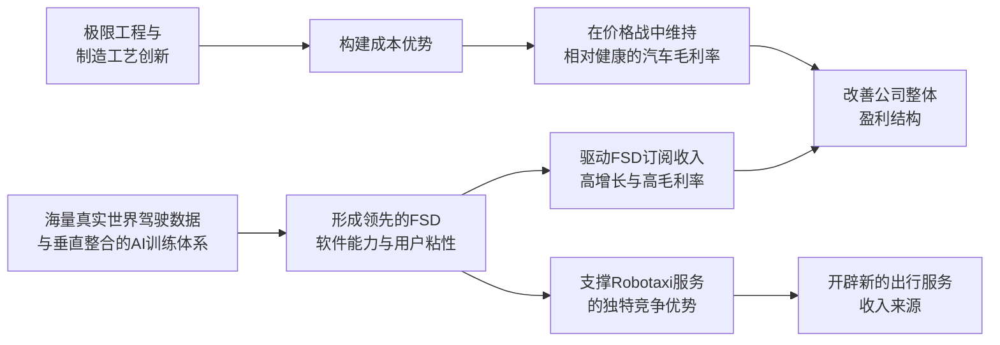

# Gangtise 公司一页通：特斯拉（TSLA.O）

> 拉取日期：2026-07-29 ｜ 来源：gangtise-agent `stock-one-pager`

## 公司概况

特斯拉是全球领先的物理AI平台公司，核心业务涵盖高性能纯电动汽车的设计、制造与销售，以及能源生成与存储系统。公司正从单一电动车制造商，向以FSD（完全自动驾驶能力）为AI底座、以Robotaxi（自动驾驶出租车）和Optimus（人形机器人）为商业化出口的平台型公司转型。其市场地位稳固，Model Y已成为全球最畅销车型，同时在储能领域也占据全球领先份额。公司长期定位是将汽车业务产生的现金流和真实世界数据，投入到自动驾驶、机器人及AI算力基础设施的研发与扩张中，形成“硬件规模-软件能力-运营网络-AI基础设施”互相强化的商业闭环。 

## 公司近况跟踪

- **Q2交付量强劲反弹，但盈利显著承压**：2026年Q2全球交付量达**48.01万辆**，同比增长**25%**，创历史同期新高，远超市场预期。然而，营收增长并未转化为利润，Q2营业利润仅为**3.98亿美元**，同比大幅下滑**57%**，营业利润率降至**1.4%**。汽车业务毛利率（不含监管积分）为**16.3%**，环比下滑，主要受产品组合不利变动、Q1一次性利好（保修调整和关税优惠）消退及原材料成本上升等因素影响。   
- **FSD（完全自动驾驶能力）商业化提速，订阅量激增**：FSD的采用率成为本季度亮点。全球活跃FSD订阅用户数在Q2末达到**148万**，同比增长**56%**。北美市场的新增交付车辆中，FSD的选装率在交付时已超过**55%**，远超市场此前25%-30%的预期，表明软件正成为推动汽车销售和构建竞争壁垒的核心要素。   
- **Robotaxi服务扩张，但规模化节奏审慎**：无人驾驶出租车服务已扩展至美国**7个城市**，并在奥斯汀等部分地区实现了无安全员运营。公司披露，累计无安全员行驶里程已达**38万英里**，并计划以每周两位数百分比的速度增长。不过，管理层强调了在安全方面的审慎态度，扩张重点在于提升现有城市的车辆密度和安全数据，而非单纯的地理扩张。   
- **资本开支进入历史性扩张期，自由现金流转负**：公司正处于“史上规模最大、最激动人心的投资阶段”。Q2资本开支高达**57.89亿美元**，同比增长**142%**，导致自由现金流在近两年内首次转负，为 **-10.92亿美元**。管理层重申2026年资本开支将超过**250亿美元**，并预计未来2-3年将持续增长，主要用于AI计算基础设施、Robotaxi车队扩张、Optimus产能建设和Terafab芯片工厂。   
- **Optimus量产在即，但初期爬坡将极为缓慢**：公司已改造弗里蒙特工厂的Model S/X产线用于生产Optimus，首代生产线预计在2026年晚些时候启动。马斯克强调，由于所有部件均为全新设计，供应链需从零建立，Optimus的初期量产“S曲线”将非常平缓且漫长。   

## 短期逻辑

1.  **Robotaxi运营数据的“爬坡斜率”将是股价的核心催化剂**：未来一个季度，市场最关注的不是Robotaxi进入了多少新城市，而是**现有运营城市（尤其是奥斯汀）的车队规模、无安全员运营比例和订单密度的提升速度**。公司已给出每周无安全员里程两位数增长的指引，若实际数据能持续超预期兑现，将有效验证其技术可靠性和商业模型的可行性，缓解市场对“只投入不产出”的担忧。反之，若车队扩张和运营效率提升缓慢，将加剧市场对资本开支回报的疑虑。当前，Robotaxi累计付费里程已达250万英里，但无安全员里程仅38万英里，这一差距的弥合速度是关键。   

2.  **FSD（完全自动驾驶能力）订阅收入的“利润弹性”有待验证**：Q2北美**55%**的FSD选装率是一个重大积极信号，表明消费者开始为软件能力支付溢价。未来一个季度，需密切关注该选装率能否维持或继续提升，以及全球活跃订阅用户数能否保持环比**20万**的增长势头。FSD订阅收入具有极高的毛利率，其快速增长是改善公司当前羸弱的盈利能力（Q2营业利润率1.4%）的最直接、最可预见的手段。市场将开始尝试将FSD的经常性收入纳入估值框架。   

3.  **Optimus V3的量产启动是“从0到1”的里程碑事件**：Optimus预计于7月底/8月左右在弗里蒙特工厂启动生产。尽管初期产量将极为有限，但这标志着该项目正式从研发和原型验证阶段进入生产阶段。任何关于Optimus在特斯拉内部工厂执行有用任务的视频或信息，都将成为提振市场信心、支撑其远期估值想象空间的关键事件。市场将高度关注首批生产版本（V3）的性能、成本和潜在应用场景。   

## 长期逻辑

1.  **从“卖车”到“卖服务”的商业模式跃迁**：特斯拉的长期价值核心在于，能否将庞大的汽车保有量转化为一个高利润、经常性的软件和服务收入平台。FSD订阅是第一步，其长期目标是将全球选装率从当前的约15%提升至40%甚至更高。Robotaxi网络则是第二步，它将车辆从一次性销售资产升级为可产生持续运营收入的运力，形成“卖车+软件订阅+出行平台抽成”的商业闭环。摩根士丹利在其**400美元**的目标价中，传统汽车业务仅贡献**45美元**，而网络服务、出行服务和机器人业务合计贡献了约**320美元**，清晰地反映了这一估值逻辑的切换。  

2.  **Optimus：复用FSD能力，开辟第二增长曲线**：Optimus的战略意义在于，它是FSD所积累的视觉感知、路径规划和端侧AI推理能力向真实物理世界的第二载体。特斯拉在电动车和自动驾驶领域积累的电池、电机、电控和制造经验，可复用于机器人，构成其他纯AI或机器人公司难以复制的系统性成本优势。尽管量产之路漫长，但其潜在市场空间（TAM）巨大，一旦成功，将彻底打开公司的估值天花板。管理层已将其列为CEO薪酬方案的考核目标之一，凸显其战略优先级。 

3.  **能源业务：受益于AI基建的“卖铲人”**：特斯拉的Megapack储能业务已成为全球领导者，其需求不仅来自电网平衡和可再生能源并网，更日益受到AI数据中心建设的驱动。AI训练带来的巨大且不稳定的电力负荷，使储能成为数据中心的关键基础设施。公司正在建设新的Megafactory以扩大产能，并计划在美国建立垂直整合的太阳能制造体系。尽管短期利润率因竞争和定价压力而正常化（管理层指引长期毛利率在**20%-25%**区间），但该业务有望长期受益于全球电气化和AI算力需求增长的双重顺风。   

## 风险提示

- **资本开支回报的长期性与不确定性**：公司正处于资本开支的超级周期，2026年预计超过**250亿美元**，未来几年将持续增长，导致自由现金流持续为负。这些投资主要投向Robotaxi、Optimus和Terafab芯片工厂等回报周期极长且存在技术路线和商业化风险的项目。若这些业务的商业化进度持续低于预期，市场对巨额资本开支的容忍度将降低，可能引发对估值逻辑的重新审视。   
- **核心汽车业务盈利能力的持续承压**：尽管Q2交付量强劲反弹，但这是在车型矩阵收敛、市场竞争加剧和融资促销力度加大的背景下实现的。汽车业务毛利率（不含监管积分）已从2022年的高位显著回落。随着监管积分收入因欧美政策变化而面临结构性萎缩，以及中国市场竞品持续施压，汽车业务自身的盈利能力可能长期处于较低水平，削弱其为AI战略“输血”的能力。  
- **管理层与公司治理风险**：公司战略高度依赖于CEO埃隆·马斯克的个人愿景和执行能力。其同时管理多家公司（如SpaceX）分散了精力，且其个人争议性言论和行为可能对品牌形象和市场需求产生负面影响。此外，公司面临多起与自动驾驶技术、歧视和 harassment 相关的诉讼及监管调查，可能带来财务和声誉上的风险。 

## 近期要闻

- **2026年7月初**：特斯拉开始在佛罗里达州迈阿密、奥兰多和坦帕推出Robotaxi服务，扩张其自动驾驶出行业务版图。 
- **2026年7月22日**：特斯拉发布2026年第二季度财报。尽管营收和交付量创同期新高，但毛利率和营业利润大幅低于市场预期，同时资本开支激增导致自由现金流转负，引发股价在盘后和次日大幅下跌。  
- **2026年7月22日**：在Q2业绩电话会上，马斯克表示Cybercab虽已投产，但需要时间积累新底盘的道路数据来校准软件，暗示其大规模部署仍需时日。同时，他确认Optimus量产初期将非常缓慢，并透露公司正在寻求高达**300亿美元**的债务融资以支持其投资计划。   

## 未来催化

- **2026年8月-9月**：特斯拉可能举行“Terafab”项目的专项发布会，公布其芯片制造工厂的具体选址、投资规模和技术路线图。这将为市场提供关于其AI算力基础设施长期规划的更清晰图景。  
- **2026年8月-9月**：FSD V15版本在北美Robotaxi车队上的灰度测试进展和性能表现，将是判断其自动驾驶技术能否实现下一次飞跃的关键。若V15展现出显著优于V14的性能，将极大增强市场对Robotaxi规模化运营的信心。  
- **2026年9月**：加州民权部门（CRD）针对特斯拉的种族歧视和 hostile work environment 诉讼案计划于**2026年9月21日**开始第一阶段的审判。该案件的进展和结果可能对公司声誉和股价产生影响。 
- **2026年下半年**：Optimus V3在弗里蒙特工厂的正式投产。尽管初期产量极低，但任何关于其执行通用任务（非预编程）的实质性进展，都将成为推动股价的重要事件。  

## 公司业务模式及拆分

**业务边际变化**：公司近年最核心的变化是战略重心从汽车制造向“物理AI”平台加速倾斜。车型矩阵显著收敛，高端Model S/X已停产，资源被重新分配至Optimus产线。新车开发更多基于现有Model 3/Y平台的改款和衍生，而非全新平台。同时，资本开支和研发费用以前所未有的规模投向FSD、Robotaxi、Optimus和AI芯片等未来业务。 

**盈利模式**：公司当前的盈利模式仍以**汽车销售**为主，但正努力向**软件订阅和服务收费**模式转型。汽车销售通过直销模式获取一次性硬件收入和部分软件功能收入。FSD采用**每月99美元的订阅制**，形成高利润的经常性收入。Robotaxi和Optimus则代表了未来的服务收费和硬件销售模式。能源业务通过销售和租赁储能及发电系统获取收入。 

**业务拆分**：公司分为**汽车业务**和**能源发电与存储业务**两大板块。汽车业务是收入和现金流的基本盘，但增长放缓和利润率承压。能源业务增长迅速，但利润率波动较大。服务及其他收入正成为增长最快的部分，主要得益于二手车销售、非保修维修服务和超级充电网络的使用。 

**细分业务拆分（单位：百万美元）**

| 业务板块 | FY2023 | FY2024 | FY2025 | 2026 H1 |
|---|---|---|---|---|
| **截止日期** | 2023-12-31 | 2024-12-31 | 2025-12-31 | 2026-06-30 |
| **汽车业务** | | | | |
| 收入 | 82,419 | 77,070 | 69,526 | 36,750 |
| 同比 | - | -6.5% | -9.8% | +20% |
| 占总收入比重 | 85.2% | 78.9% | 73.3% | 72.6% |
| 成本 | 66,389 | 62,873 | 57,165 | 29,865 |
| 毛利润 | 16,030 | 14,197 | 12,361 | 6,885 |
| 毛利率 | 19.4% | 18.4% | 17.8% | 18.7% |
| **能源发电与存储业务** | | | | |
| 收入 | 6,035 | 10,086 | 12,771 | 5,547 |
| 同比 | - | +67.1% | +26.6% | +1% |
| 占总收入比重 | 6.2% | 10.3% | 13.5% | 11.0% |
| 成本 | 4,894 | 7,446 | 8,969 | 3,955 |
| 毛利润 | 1,141 | 2,640 | 3,802 | 1,592 |
| 毛利率 | 18.9% | 26.2% | 29.8% | 28.7% |
| **服务及其他** | | | | |
| 收入 | 8,319 | 10,534 | 12,530 | 8,326 |
| 同比 | - | +26.6% | +18.9% | +46% |
| 占总收入比重 | 8.6% | 10.8% | 13.2% | 16.4% |
| 成本 | 7,830 | 9,921 | 11,599 | 7,332 |
| 毛利润 | 489 | 613 | 931 | 994 |
| 毛利率 | 5.9% | 5.8% | 7.4% | 11.9% |

**汽车业务（2026 H1）**：该板块收入**367.50亿美元**，同比增长**20%**，占总收入的**72.6%**，仍是公司的绝对支柱。增长主要由交付量同比增加**18%**驱动。毛利率为**18.7%**，较2025年全年有所回升，主要得益于销量增长带来的固定成本吸收、FSD订阅收入的增加以及平均售价的提升。然而，Q2单季毛利率（不含积分）环比下滑至**16.3%**，反映出产品降价、促销补贴和原材料成本上涨的压力。该业务正从规模扩张转向盈利修复，但面临竞争加剧和监管积分收入萎缩的挑战。 

**能源发电与存储业务（2026 H1）**：该板块收入**55.47亿美元**，同比基本持平，占总收入的**11.0%**。增长放缓主要因产品平均售价（ASP）下降，但部署量仍保持增长，Q2部署了**13.5 GWh**的储能产品。毛利率为**28.7%**，维持在较高水平，但Q2单季毛利率因供应商电芯问题导致的保修费用和竞争加剧而骤降至**20.4%**。管理层指引长期毛利率将正常化至**20%-25%**区间。该业务受益于AI数据中心建设和电网稳定性需求，长期增长前景明确，但短期利润率波动较大。  

**服务及其他（2026 H1）**：该板块收入**83.26亿美元**，同比大幅增长**46%**，占总收入比重提升至**16.4%**，成为增长最快的业务。增长主要来自二手车销售、非保修维修服务、碰撞维修和付费超充使用的增加。毛利率显著提升至**11.9%**，表明该业务的盈利能力正在增强，尤其是包含FSD订阅在内的经常性软件收入贡献了较高的利润。 

## 核心竞争力

**竞争要素 1：基于海量真实世界数据与垂直整合能力的AI训练飞轮**

-   **护城河定性**：这构成了特斯拉在自动驾驶和机器人领域的**结构性护城河**。其优势并非单一技术，而是“**硬件（车辆/机器人）销售 -> 海量真实世界数据收集 -> AI模型训练迭代 -> 软件能力提升 -> 促进硬件销售**”这一完整且难以复制的数据飞轮。截至Q2，FSD累计行驶里程已超过**126亿英里**，远超任何竞争对手，为训练更安全、更强大的端到端神经网络提供了无可比拟的数据基础。  
-   **数据验证**：FSD在北美的选装率在Q2达到**55%**，活跃订阅用户达**148万**，这表明用户愿意为这套基于数据飞轮迭代出的软件付费，是护城河价值变现的直接证据。相比之下，主要竞争对手Waymo的车队规模仅为数千台。  
-   **动态演变**：护城河正在**变宽**。随着Model Y持续热销和Cybercab的推出，车队规模和数据量将持续增长。同时，公司将FSD的AI能力横向迁移至Optimus机器人，开辟了新的数据收集和应用场景，进一步强化了数据飞轮的效应。 

**竞争要素 2：依托极限工程与制造创新的成本控制能力**

-   **护城河定性**：这属于**行业阶段性红利**，但特斯拉凭借其先发优势和工程创新能力，将这一红利维持了较长时间。通过一体化压铸、结构化电池包、4680电池自研、超级工厂的高效产线设计以及供应链垂直整合，特斯拉在电动车制造领域建立了显著的成本优势，使其在激烈的价格战中仍能保持相对健康的毛利率。 
-   **数据验证**：尽管面临降价压力，特斯拉2026年H1的汽车业务毛利率（不含积分）仍维持在**17.4%**，优于多数仍在亏损的电动车初创公司。其单车生产成本在Q2保持稳定，显示出强大的成本控制能力。  
-   **动态演变**：该优势面临**收缩**风险。随着竞争对手（尤其是中国车企）在制造效率和电池成本上快速追赶，以及行业整体向更低价位段渗透，特斯拉的成本优势正在被侵蚀。公司正通过下一代平台和进一步的生产工艺创新来维持其成本领先地位。 

**现阶段核心驱动力总结**：特斯拉的Alpha在于其通过数据飞轮和工程创新构建的、难以复制的AI商业化能力，这使其区别于传统车企。其Beta则在于它仍受全球电动车市场渗透率、行业竞争格局和宏观经济周期的影响。当前，公司的估值逻辑正从Beta驱动的汽车销售，转向Alpha驱动的AI软件与服务，但这一转型的成功与否，取决于Robotaxi和Optimus的商业化进程。 

**竞争格局传导逻辑图**：

