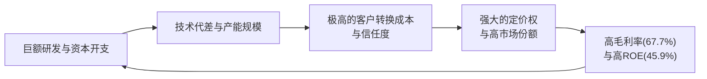

<!-- 匹配到的证券/行业：台积电(TSM.N) -->
操作成功

### 一页通 （台积电 (TSM.N)）
日期：2026-08-06
内容："""
## 公司概况

台积电是全球最大的、也是首创纯晶圆代工（Pure-Play Foundry）模式的半导体制造商。公司不设计或销售自有品牌芯片，而是基于客户提供的专有集成电路设计，为其提供晶圆制造、先进封装、测试、光罩制造及设计服务。其核心竞争壁垒在于<strong>技术领先性、庞大的先进制程产能规模、以及极高的客户信任度</strong>，三者构成了一个自我强化的商业闭环。公司总部位于台湾新竹，为全球超过500家客户制造超过12,000种产品，在先进制程（7纳米及以下）领域占据主导地位。  

## 公司近况跟踪

- <strong>2026年Q2业绩超指引上限，AI需求驱动增长</strong>：公司2026年第二季度营收达<strong>402.0亿美元</strong>（新台币12,703.8亿元），环比增长12.0%，同比增长33.7%，处于指引上沿。毛利率<strong>67.7%</strong>，环比提升1.5个百分点，同样高于指引上限。增长主要受惠于高性能计算（HPC）平台的强劲需求，该平台营收环比增长20%，占总营收比重升至<strong>66%</strong>。 

- <strong>资本开支计划大幅上调，全球扩产提速</strong>：公司将2026年全年资本支出指引从520-560亿美元大幅上调至<strong>600-640亿美元</strong>，以应对AI驱动的多年期结构性需求。同时，公司宣布在亚利桑那州追加<strong>1,000亿美元</strong>投资，使当地总投资额升至2,650亿美元，计划新建多座2纳米及以下制程的逻辑晶圆厂和先进封装厂。管理层表示，未来三年的资本支出将比过去三年“更加显著地提高”。  

- <strong>2纳米制程开始贡献营收，技术迭代加速</strong>：2纳米（N2）制程在Q2首次贡献了<strong>3%</strong>的晶圆收入，管理层预计其将在下半年快速爬坡。公司同时公布了清晰的后续技术路线图，包括计划于2028年量产的A14（第二代纳米片晶体管）和2029年量产的A13、A12，旨在巩固其技术领先地位。  

- <strong>先进封装产能持续紧缺，公司乐见行业协同</strong>：CoWoS等先进封装产能仍处于严重短缺状态，是客户业务增长的限制因素之一。台积电正积极扩产，并计划在中国台湾新建13座先进封装厂。同时，管理层对英特尔EMIB-T等替代方案表示欢迎，认为这有助于提升市场灵活性，并间接支持其前端晶圆制造业务。  

- <strong>成熟制程需求分化，AI相关领域供给紧张</strong>：与AI数据中心建设相关的成熟制程芯片（如电源管理IC、CMOS图像传感器）出现供不应求，但其他消费电子相关的通用型成熟制程需求依然疲软。公司策略是聚焦高附加值、战略性的成熟制程细分市场。 

## 短期逻辑

1.  <strong>AI需求能见度提升驱动盈利预测上修</strong>：公司基于客户（主要为云服务提供商）的强劲需求信号，将2026年全年美元营收增速指引从“超过30%”上调至“<strong>略高于40%</strong>”。这一上调直接反映了AI投资从GPU/ASIC向CPU、网络芯片等多领域扩散的趋势，尤其是Agentic AI的兴起，显著增加了对数据中心CPU的需求。这一预期差是短期内股价的核心催化剂，多家投行在财报后上调了盈利预测和目标价。  

2.  <strong>2纳米制程快速放量，成为下半年核心增长引擎</strong>：2纳米制程在Q2首次贡献营收后，管理层预计其将在Q3和下半年快速爬坡，成为全新的收入驱动力。尽管初期会稀释约3-4个百分点的毛利率，但其成功量产标志着台积电技术代差的进一步拉大，并锁定了苹果、AMD等关键客户未来1-2年的旗舰产品订单。2纳米的产能爬坡速度和订单能见度，是验证公司技术执行力与长期增长逻辑的关键短期指标。  

3.  <strong>资本开支大幅上调引发市场分歧，但强化长期供给信心</strong>：公司将2026年资本开支指引上调至600-640亿美元，并暗示未来几年将持续高投入。虽然短期内加剧了市场对折旧增加、海外厂稀释利润及现金流压力的担忧，导致股价在财报后出现波动，但这一激进的扩产计划也向市场传递了公司对AI长期需求极度确信的信号，并旨在通过充足的产能供给，降低客户因产能不足而寻求第二供应商的动机，从而巩固其市场份额。  

## 长期逻辑

1.  <strong>AI大趋势下的“卖铲人”地位不可替代</strong>：未来1-3年，AI将从训练向推理、从云端向边缘端、从单一加速器向CPU和网络芯片全面扩散。台积电作为唯一能够大规模量产从2纳米到成熟制程所有AI相关芯片的厂商，其“卖铲人”地位将愈发稳固。无论下游AI芯片的竞争格局如何演变（GPU vs ASIC），对先进算力芯片的底层制造需求都将汇聚于台积电。管理层预计AI相关业务的增长动能“仍在持续增强”，并看好需求可持续至2029-2030年。  

2.  <strong>技术代差与产能规模构筑的“时间壁垒”持续加宽</strong>：公司的护城河已从单纯的技术领先，演变为“<strong>技术-产能-客户信任</strong>”三位一体的时间壁垒。竞争对手即便在技术上追赶，也需花费5-7年与客户共同开发产品、验证工艺并建设相匹配的庞大产能。台积电凭借其150-200k+的月产能规模（远超三星、英特尔约20-30k的初期规模）和超过90%的量产良率，形成了难以逾越的规模经济和学习曲线优势。其清晰的A14、A13、A12技术路线图，确保了未来5年以上的技术领先可见度。  

3.  <strong>全球产能布局分散地缘风险，并锁定关键市场</strong>：通过在亚利桑那州（总投资2,650亿美元）、日本熊本和德国德累斯顿的大规模投资建厂，台积电正在构建一个全球化的、更具韧性的供应网络。此举不仅是为了应对地缘政治压力、满足各国政府对半导体供应链本土化的要求，更是为了深度绑定美国、欧洲和日本的关键客户，通过贴近客户建厂来提供更优质的服务，并将地缘政治风险转化为巩固客户关系的战略机遇。  

## 风险提示

- <strong>AI资本开支回报率不及预期与需求周期性波动风险</strong>：当前AI硬件需求主要由云服务提供商（CSP）的巨额资本开支驱动，但其现金流已出现历史性转负。若AI应用的商业化落地速度和投资回报率（ROI）不及预期，CSP可能削减资本开支，导致AI芯片需求出现周期性回调。台积电管理层虽表示会审慎评估客户需求以防芯片堆积，但公司大幅上调资本开支的行为，本身也放大了对未来需求误判的风险。 

- <strong>海外扩张带来的盈利稀释与运营挑战</strong>：美国晶圆厂的建设成本是台湾本土的4-5倍，且面临建筑工人短缺、供应链不完善和更高的运营成本。管理层预计，未来数年海外晶圆厂爬坡对毛利率的稀释将从初期的2-3个百分点扩大至3-4个百分点。随着海外产能占比提升，若公司无法通过技术溢价和成本改善完全抵消这些负面影响，其长期盈利能力将面临结构性下修风险。  

- <strong>竞争格局演变与客户自研/多源化风险</strong>：尽管台积电技术领先，但英特尔（受惠于美国政策支持）和三星（受惠于存储业务高利润）仍在持续追赶先进制程。同时，主要客户如苹果、英伟达等出于供应链安全和成本考量，有动机扶持第二供应商。此外，特斯拉（Terafab）等系统厂商开始自建芯片产能，长期看可能分流部分定制化芯片的制造需求。这些因素可能侵蚀台积电的绝对主导地位。  

## 近期要闻

- <strong>2026年5月8日</strong>：索尼半导体解决方案与台积电宣布，已就共同开发和生产下一代图像传感器达成初步战略合作协议，旨在增强未来图像传感器技术竞争力。  
- <strong>2026年6月4日</strong>：台积电举行年度股东大会，董事长魏哲家强调技术、制造和客户信任是公司成功的核心，并对AI驱动的增长前景至2030年表达了高度信心。 
- <strong>2026年7月16日</strong>：台积电公布2026年Q2财报，业绩超预期，并大幅上调全年资本开支及营收指引。同时宣布在亚利桑那州追加1,000亿美元投资，引发市场广泛关注。 

## 未来催化

- <strong>2026年7月下旬至8月</strong>：主要云服务提供商（CSP）及科技巨头（如微软、谷歌、亚马逊、Meta、苹果）将陆续发布财报。其资本开支指引和对AI需求的展望，将直接验证或修正市场对台积电未来订单能见度的预期。 
- <strong>2026年9月</strong>：苹果预计将发布搭载台积电2纳米制程芯片的新款iPhone。新品的市场表现和销量预期，将直接影响台积电下半年及来年最大客户的需求确定性。 
- <strong>2026年9月16日</strong>：台积电Q1现金股息的除息日。稳定的股息增长预期是支撑其估值的重要因素之一。 

## 公司业务模式及拆分

- <strong>盈利模式</strong>：公司依靠其<strong>技术领先性、制造卓越性和客户信任</strong>形成的综合壁垒盈利。通过持续投入巨额研发和资本开支，保持制程技术领先对手1-2代，从而获得定价权，赚取“技术溢价”。同时，通过庞大的产能规模和极高的良率，实现成本优势。公司强调与客户建立长期、可持续的合作伙伴关系，而非追求短期机会主义的定价，以此锁定客户的关键产品代工订单。  

- <strong>业务拆分</strong>：
  公司业务主要按<strong>应用平台</strong>和<strong>制程技术</strong>两个维度进行拆分。从平台看，<strong>高性能计算（HPC）</strong> 已成为绝对核心，占比持续提升，智能手机业务占比则相对下降。从制程看，<strong>7纳米及以下的先进制程</strong>是公司的收入和利润支柱，占比已接近八成。公司当前处于由AI驱动的<strong>业绩兑现期和产能扩张期</strong>，资本开支强度显著提升。  

  <strong>细分业务拆分（按应用平台）</strong>

  | 平台 | FY2023 收入 (亿元新台币) | FY2023 占比 | FY2024 收入 (亿元新台币) | FY2024 占比 | FY2025 收入 (亿元新台币) | FY2025 占比 | 1H26 收入 (亿元新台币) | 1H26 占比 |
  |---|---|---|---|---|---|---|---|---|
  | 高性能计算 (HPC) | 9,347.69 | 43% | 14,768.91 | 51% | 21,929.31 | 58% | 15,479.36 | 64% |
  | 智能手机 | 8,149.14 | 38% | 10,051.30 | 35% | 11,108.16 | 29% | 6,395.01 | 27% |
  | 物联网 (IoT) | 1,619.17 | 8% | 1,655.16 | 6% | 1,910.47 | 5% | 1,280.47 | 5% |
  | 汽车电子 | 1,336.54 | 6% | 1,393.23 | 5% | 1,866.67 | 5% | 1,050.67 | 4% |
  | 数字消费电子 (DCE) | 470.00 | 2% | 479.61 | 1% | 479.97 | 1% | 240.00 | 1% |
  | 其他 | 694.82 | 3% | 594.87 | 2% | 795.96 | 2% | 0.00 | 0% |
  | <strong>总计</strong> | <strong>21,617.36</strong> | <strong>100%</strong> | <strong>28,943.08</strong> | <strong>100%</strong> | <strong>38,090.54</strong> | <strong>100%</strong> | <strong>24,044.84</strong> | <strong>100%</strong> |

  <strong>细分业务拆分（按制程技术）</strong>

  | 制程 | FY2023 收入占比 | FY2024 收入占比 | FY2025 收入占比 | Q1 2026 收入占比 | Q2 2026 收入占比 |
  |---|---|---|---|---|---|
  | 3纳米 | 6% | 18% | 24% | 25% | 30% |
  | 5纳米 | 33% | 34% | 36% | 36% | 33% |
  | 7纳米 | 19% | 17% | 14% | 13% | 11% |
  | 2纳米 | - | - | - | - | 3% |
  | <strong>先进制程合计 (7nm及以下)</strong> | <strong>58%</strong> | <strong>69%</strong> | <strong>74%</strong> | <strong>74%</strong> | <strong>77%</strong> |

  <strong>各细分业务分析（2026年第二季度）</strong>：
  - <strong>高性能计算 (HPC)</strong>：Q2营收环比增长<strong>20%</strong>，占比升至<strong>66%</strong>，是公司最核心的增长引擎。增长动力来自AI GPU（如英伟达Rubin）、ASIC（如AWS Trainium3）、服务器CPU（如AMD Turin/Venice、英伟达Vera）以及网络交换芯片的全方位需求爆发。该业务是先进制程和先进封装的主要消耗者，其强劲增长直接拉动了公司整体ASP和盈利能力的提升。  
  - <strong>智能手机</strong>：Q2营收环比下降<strong>4%</strong>，占比降至<strong>22%</strong>，主要受全球智能手机市场疲软及物料成本（BOM）上升影响。但该平台仍是先进制程的重要应用领域，公司预计Q3将推出2纳米SoC，为下一代Agentic AI手机提供支持，有望带动下半年业绩。  
  - <strong>物联网 (IoT)</strong>：Q2营收环比增长<strong>4%</strong>，占比<strong>5%</strong>。业务稳定增长，受益于边缘AI和万物互联趋势，公司提供从4纳米到55纳米的超低功耗（ULP）技术平台以满足不同应用场景。 
  - <strong>汽车电子</strong>：Q2营收环比增长<strong>15%</strong>，占比<strong>4%</strong>。增长较快，主要得益于ADAS和智能座舱对先进制程（如N3A）和特色工艺需求的增加。公司预计汽车电子将是未来重要的增长点之一。 
  - <strong>2纳米制程</strong>：Q2首次贡献<strong>3%</strong>的晶圆收入，标志着公司技术进入新纪元。该制程同时受到智能手机和HPC客户的强劲需求推动，预计下半年将快速放量，成为推动营收增长和维持技术领先的关键。 

## 核心竞争力

<strong>竞争要素 1：依托技术领先与规模效应构筑的“时间壁垒”</strong>

- <strong>护城河定性</strong>：<strong>结构性护城河</strong>。台积电的领先地位并非单一技术优势，而是“<strong>技术研发-规模制造-客户生态</strong>”三者形成的正向循环和“时间壁垒”。竞争对手即便在技术上取得突破，也需花费5-7年时间与客户共同完成产品设计、工艺验证、产能建设和良率爬坡。在此期间，台积电已迭代至下一代技术，并凭借150-200k+的月产能规模（远超竞争对手的20-30k）摊薄成本，形成难以逾越的规模经济和学习曲线优势。  
- <strong>数据验证</strong>：先进制程（7纳米及以下）贡献了<strong>77%</strong>的晶圆收入，且占比持续提升。2025年，公司研发费用高达<strong>2,464.27亿元新台币</strong>，资本支出达<strong>1.27万亿元新台币</strong>，远超竞争对手。其N2制程的缺陷密度（D0）达到目标水平的时间比N3提前了两个季度，体现了强大的制造执行力。公司毛利率高达<strong>67.7%</strong>，显著高于联电（34.1x PE）、格罗方德（32.4x PE）等成熟制程竞争对手，反映了其强大的定价权。  
- <strong>动态演变</strong>：<strong>护城河变宽（巩固）</strong>。公司清晰的A14、A13、A12技术路线图确保了未来5年以上的技术领先可见度。同时，通过在全球（美国、日本、德国）大规模扩建产能，公司正在将地缘政治风险转化为锁定关键市场、深度绑定客户的战略机遇，进一步巩固其全球不可替代性。  

<strong>现阶段核心驱动力总结</strong>：
公司的Alpha在于其作为AI时代“卖铲人”的不可替代性，通过持续的技术创新和规模扩张，将行业Beta（AI需求增长）高效转化为自身远超行业平均水平的盈利增长。其业绩表现与AI资本开支周期高度相关，但凭借其垄断性地位，具备更强的盈利韧性和成长确定性。 

<strong>竞争格局传导逻辑图</strong>：

## 产销链

- <strong>客户情况</strong>：
  公司客户涵盖全球领先的fabless（如英伟达、AMD、高通、联发科）、系统公司（如苹果）和部分IDM。客户集中度较高，北美地区客户贡献了<strong>75%</strong>的营收（2025年）。据媒体报道，英伟达已成为台积电最大客户。公司承认先进制程产能供不应求，客户正面临分配限制。为锁定产能，部分客户已与公司签订预付协议，截至2025年底，相关预收款余额为<strong>1,898.58亿元新台币</strong>。新客户方面，公司与索尼就下一代图像传感器达成战略合作，并正与多家客户深化数据中心ASIC领域的合作。 

- <strong>供应商情况</strong>：
  核心设备供应商包括ASML（光刻机）、应用材料、东京电子等，部分关键设备来自少数甚至单一供应商。公司正与ASML就下一代High-NA EUV光刻机的成本和技术成熟度进行紧密合作，但出于成本效益考量，目前推迟了部分采购。主要原材料硅片由少数位于台湾、日本、德国和新加坡的供应商提供，公司通过签订长期协议来保障供应。近期，公司上调资本开支部分源于设备价格通胀。 

- <strong>成本传导能力</strong>：
  当上游原材料或设备成本上升时，台积电具备<strong>较强的成本转嫁能力</strong>。公司赚取的是“<strong>技术溢价</strong>”和“<strong>规模制造溢价</strong>”。管理层表示，定价策略是反映公司提供的价值，并维持可持续的客户关系。市场普遍预期公司将在2027年对先进制程和先进封装进行5-10%的提价，以对冲海外扩产和通胀带来的成本压力。 

## 财务数据

| 财务指标 (单位：亿元新台币) | FY2023 截止2023-12-31 | FY2024 截止2024-12-31 | FY2025 截止2025-12-31 | FY2026 H1 截止2026-06-30 |
| :--- | :--- | :--- | :--- | :--- |
| <strong>营业总收入</strong> | 21,617.36 | 28,943.08 | 38,090.54 | 24,044.84 |
| 营收同比增长率 | -4.51% | 33.89% | 31.61% | 35.61% |
| <strong>毛利</strong> | 11,751.11 | 16,243.54 | 22,812.94 | 16,116.06 |
| <strong>毛利率</strong> | <strong>54.4%</strong> | <strong>56.1%</strong> | <strong>59.9%</strong> | <strong>67.0%</strong> |
| <strong>营业利润</strong> | 9,212.77 | 13,232.83 | 19,356.44 | 14,186.18 |
| 营业利润率 | 42.6% | 45.7% | 50.8% | 59.0% |
| <strong>归母净利润</strong> | 8,517.40 | 11,583.80 | 16,976.04 | 12,790.42 |
| 归母净利润同比增长率 | -14.22% | 36.00% | 46.55% | 68.33% |
| 净利率 | 39.4% | 40.0% | 44.6% | 53.2% |
| <strong>基本每股收益 (元新台币)</strong> | 32.85 | 44.68 | 65.47 | 49.32 |
| <strong>自由现金流</strong> | 2,866.32 | 8,701.71 | 10,025.65 | 6,355.77 |

- <strong>财务分析</strong>：
  - <strong>成长能力</strong>：公司营收在2023年小幅下滑后，于2024年重回强劲增长轨道，2025年及2026年上半年增速均超过30%，主要由AI驱动的HPC需求爆发所推动。归母净利润增长更为迅猛，2026年上半年同比增速高达<strong>68.33%</strong>，显示出强大的经营杠杆效应。 
  - <strong>盈利能力</strong>：公司毛利率和净利率呈持续提升趋势。2026年上半年毛利率达到<strong>67.0%</strong>，较2023年提升超过12个百分点，主要得益于高毛利的先进制程占比提升、产能利用率提高以及成本改善。营业利润率同样显著提升，2026年上半年达到<strong>59.0%</strong>，体现了公司卓越的费用管控能力。 
  - <strong>运营能力</strong>：2026年Q2末，存货周转天数增至<strong>87天</strong>，应收账款周转天数增至<strong>29天</strong>。存货周转天数的增加主要由于2纳米制程开始产能爬坡，属主动备货行为。应收账款天数的增加则需关注，可能反映了公司给予部分客户更宽松的信用条款。 
  - <strong>偿债能力与现金流</strong>：公司财务结构极为稳健。截至2026年Q2末，现金及有价证券高达<strong>3.52万亿元新台币</strong>，远超总负债（2.90万亿元新台币），净债务为负。强劲的经营现金流（2026年上半年为<strong>1.48万亿元新台币</strong>）足以覆盖庞大的资本开支（8,467.65亿元新台币）和股息支付，自由现金流保持充沛。 

## 行业及竞争分析

- <strong>行业分析</strong>：
  台积电所处的半导体晶圆代工行业，尤其是<strong>先进制程代工</strong>，是一个典型的<strong>资本密集、技术密集、高壁垒</strong>的寡头垄断市场。行业增长的核心驱动力已从过去的PC和智能手机，转变为由AI、HPC和5G驱动的<strong>数据计算需求爆炸式增长</strong>。据台积电管理层及多家机构预测，全球半导体市场（不含存储）未来5-10年的年复合增长率（CAGR）预计在<strong>15%-20%</strong>左右，而AI相关半导体的增速将远超行业平均水平。当前行业正面临先进制程产能严重供不应求的局面，供需缺口巨大，这使得台积电等头部厂商拥有极强的定价权。 

- <strong>竞争格局</strong>：
  台积电在先进制程领域的主要竞争对手是<strong>三星电子</strong>和<strong>英特尔</strong>。三星在存储芯片市场的高利润为其代工业务提供了资金支持，但其先进制程（如SF2）在良率和客户信任度上仍与台积电存在显著差距。英特尔则受惠于美国政府的强力政策支持，其18A制程已进入量产，并积极争取外部代工订单，但其在代工服务模式和客户生态建设上仍处于早期阶段。短期内，两者难以对台积电的领先地位构成实质性威胁，但长期看，地缘政治因素和客户寻求第二供应商的动机，可能使部分非核心订单流向竞争对手。  

- <strong>可比公司</strong>：

  | 公司名称 | 股票代码 | 市场定位 | 先进制程能力 | 主要差异 |
  | :--- | :--- | :--- | :--- | :--- |
  | <strong>三星电子</strong> | 005930.KS | IDM + 晶圆代工 | SF2 (GAA) 量产，良率约50-60% | 与客户存在竞争关系；先进制程产能规模小；良率和客户信任度不及台积电。 |
  | <strong>英特尔</strong> | INTC.US | IDM + 晶圆代工 | 18A 量产，良率约85% | 正从IDM向代工模式转型；获得美国政府强力支持；先进封装（EMIB-T）具备差异化优势。 |
  | <strong>联电</strong> | 2303.TW | 晶圆代工 | 14纳米 FinFET | 聚焦成熟制程和特色工艺，不追求先进制程军备竞赛，盈利稳定。 |
  | <strong>格罗方德</strong> | GFS.US | 晶圆代工 | 12纳米 FinFET | 2018年宣布放弃7纳米以下制程研发，专注于成熟制程和特色工艺（FD-SOI）。 |

  与竞争对手相比，台积电的核心差异在于其<strong>纯粹的代工模式</strong>（不与客户竞争）、<strong>最全面的先进制程技术组合</strong>（从7纳米到2纳米，以及未来的A14/A13/A12）、<strong>庞大的产能规模</strong>和<strong>最高的量产良率</strong>。这些优势共同构成了其作为“所有人的代工厂”（Everyone's Foundry）的独特地位。 

## 市场焦点议题

- <strong>议题一：AI驱动的增长可持续性与资本开支回报率</strong>
  - <strong>背景</strong>：公司业绩和资本开支指引均大幅超预期，但市场对云服务商（CSP）巨额AI投资的回报率和可持续性存在根本性分歧。CSP的现金流已出现恶化，引发市场担忧当前的资本开支强度难以长期维持。 
  - <strong>问题列表</strong>：
    1. 公司如何评估并确保客户（尤其是CSP）的AI芯片需求不是渠道库存积压或重复下单？
    2. 2026年上调至600-640亿美元的资本开支，其未来的投资回报率（ROIC）前景如何？是否会因过度投资导致未来产能过剩和资产减值风险？
    3. 公司如何看待AI投资从训练转向推理，以及Agentic AI兴起对芯片需求结构（GPU vs ASIC vs CPU）的长期影响？

- <strong>议题二：毛利率的短期压力与长期结构性趋势</strong>
  - <strong>背景</strong>：Q3毛利率指引中值（66%）环比下滑，低于部分买方预期。2纳米爬坡、海外厂投产带来的稀释效应，以及潜在的设备成本上升，正对短期盈利能力构成压力。  
  - <strong>问题列表</strong>：
    1. 2纳米制程的毛利率稀释效应将持续多久？其达到公司平均水平（corporate average）的爬坡周期是否会比3纳米（约11个季度）更短？
    2. 随着亚利桑那州等海外工厂产能的持续释放，其带来的2-4个百分点毛利率稀释是否为永久性结构成本？公司有何具体措施（如定价、成本改善）来对冲？
    3. 面对ASML等设备供应商的潜在提价，公司如何平衡技术升级需求与成本控制？

- <strong>议题三：竞争格局演变与客户“去风险化”</strong>
  - <strong>背景</strong>：英特尔和三星在先进制程上持续追赶，并获得各自政府的强力支持。同时，主要客户为保障供应链安全，有动机扶持第二供应商，甚至开始自研芯片（如特斯拉的Terafab）。  
  - <strong>问题列表</strong>：
    1. 公司如何看待英特尔18A和三星SF2制程在客户导入和良率提升方面的最新进展？这是否会开始侵蚀台积电在特定客户或特定产品上的市场份额？
    2. 公司如何应对客户（尤其是美国客户）因政府压力或供应链多元化需求，而将部分订单转移给竞争对手的潜在风险？
    3. 公司大幅增加在美国的投资，是否是对冲地缘政治风险和满足客户“本土化生产”需求的战略举措？其长期成本和回报如何平衡？

## 市场分歧探讨

市场对台积电的核心分歧在于：<strong>当前由AI驱动的强劲增长和超高利润率，是新一轮长周期结构性繁荣的开端，还是一个由资本开支泡沫驱动的、不可持续的周期性顶点？</strong>

- <strong>乐观方观点：AI是颠覆性技术革命，台积电是核心瓶颈</strong>
  乐观方认为，AI是堪比互联网诞生的技术革命，其对算力的需求将是指数级的、长期的。台积电作为唯一能大规模提供最先进算力芯片的制造商，是产业链中价值最高、壁垒最厚、确定性最强的环节。其大幅上调资本开支，是基于对客户多年期产品路线图的审慎评估，而非盲目扩张。<strong>技术代差和产能规模构成的“时间壁垒”</strong>，使得竞争对手在5-7年内都无法构成实质性威胁。因此，当前的业绩爆发只是长周期增长的起点，任何因短期毛利率波动或宏观情绪导致的股价回调，都是买入良机。 

- <strong>谨慎方观点：资本开支泡沫重演，盈利周期性风险被低估</strong>
  谨慎方认为，当前的AI热潮与2000年的互联网泡沫有相似之处，下游应用和商业模式尚不成熟，但上游硬件投资已极度亢奋。CSP的现金流恶化是不可持续的预警信号，未来资本开支大概率会放缓，导致芯片需求出现“硬着陆”。台积电在周期顶点大幅扩张资本开支，未来可能面临产能过剩、资产减值和利润率下滑的三重打击。此外，<strong>海外扩产带来的结构性成本上升、客户集中度过高、以及地缘政治的尾部风险</strong>，都使得其当前的高估值（尽管PEG看似合理）缺乏足够的安全边际。市场对财报的冷淡反应，正是对“业绩利好出尽”和长期风险定价的开始。 

综合来看，台积电的技术和规模优势是客观事实，其作为AI基础设施核心供应商的地位短期内难以撼动。但市场对其长期增长的预期已相当充分，而来自宏观、地缘政治和下游客户盈利能力的风险正在积聚。公司的未来表现，将取决于其能否在扩张产能的同时，有效管理成本、维护定价体系，并成功穿越潜在的行业周期波动。 

## 盈利预测与估值

| 机构 | 评级 | 目标价 | 财务指标 | FY2025A | FY2026E | FY2027E | FY2028E |
| :--- | :--- | :--- | :--- | :--- | :--- | :--- | :--- |
| 美国银行 (2026-07-22) | 买入 | 3,100 TWD | 营业收入(百万元新台币) | 3,809,054 | 5,477,153 | 7,624,785 | 8,920,142 |
| | | | EPS (元新台币) | 66.24 | 110.20 | 153.17 | 181.96 |
| 德意志银行 (2026-07-16) | 买入 | 3,000 TWD | 营业收入(百万元新台币) | 3,809,054 | 5,470,049 | 8,035,272 | 10,200,463 |
| | | | EPS (元新台币) | 66.25 | 108.00 | 149.99 | 189.63 |
| 华泰证券 (2026-07-18) | 买入 | 540 USD | 营业收入(十亿元新台币) | 3,809 | 5,403 | 7,302 | 8,512 |
| | | | EPS (元新台币) | 66.25 | 103.81 | 137.43 | 162.52 |
| 伯恩斯坦 (2026-05-18) | 优于大市 | 2,780 TWD | 营业收入(百万元新台币) | 3,809,054 | 5,243,526 | 6,545,103 | 8,003,800 |
| | | | EPS (元新台币) | 66.25 | 101.62 | 124.63 | 157.38 |

主流券商对台积电的评级普遍为“买入”或“优于大市”，显示出市场对公司基本面的高度认可。盈利预测方面，机构间存在一定分歧，尤其是对FY2027及FY2028的营收和EPS预测差异较大，反映了市场对AI需求长期可持续性和公司产能扩张节奏的不同判断。估值方法上，普遍采用<strong>市盈率（P/E）</strong>，给予的估值倍数在<strong>20-25倍</strong>2027年预期EPS之间，部分机构认为相较于其历史区间（11-21倍）和超过30%的EPS增速，当前估值（约17-19倍）仍具吸引力。    

<strong>管理层最新指引</strong>：基于当前业务展望，管理层预计<strong>2026年第三季度</strong>营收介于<strong>446亿至458亿美元</strong>之间；毛利率预计介于<strong>65%至67%</strong>之间；营业利润率预计介于<strong>56%至58%</strong>之间。<strong>2026年全年</strong>，以美元计价的营收增长预计将<strong>略高于40%</strong>。
"""
