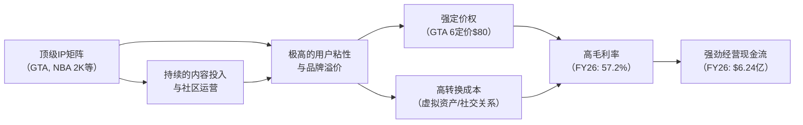

<!-- 匹配到的证券/行业：Take-Two Interactive(TTWO.O) -->
操作成功

### 一页通 （Take-Two Interactive (TTWO.O)）
日期：2026-08-06
内容："""
## 公司概况

Take-Two Interactive 是全球领先的互动娱乐开发商、发行商与营销商，旗下拥有 <strong>Rockstar Games、2K 和 Zynga</strong> 三大核心品牌。公司产品覆盖主机、PC 及移动端，通过实体零售、数字下载、在线平台及云流媒体服务触达全球消费者。公司拥有《侠盗猎车手》（GTA）、《荒野大镖客》、《NBA 2K》、《无主之地》、《文明》等标志性 IP，其中 <strong>GTA 系列累计销量已超 4.65 亿份，GTA V 单作销量近 2.3 亿份</strong>，是全球互动娱乐行业最具价值的品牌之一。 

## 公司近况跟踪

- <strong>GTA 6 预购窗口于 2026 年 6 月 25 日开启，市场反响远超预期</strong>。第三方机构 Newzoo 数据显示，仅美国及欧洲五大市场在 6 月最后一周的数字预购支出即达约 <strong>1.8 亿美元</strong>，为其追踪史上最强预购表现。Newzoo 预计 GTA 6 首周销量将落在 <strong>3700 万至 5100 万份</strong> 区间。公司宣布标准版定价 <strong>79.99 美元</strong>，终极版 <strong>99.99 美元</strong>，为 3A 游戏定价新高，但预购需求未受影响。  
- <strong>FY26 全年业绩超指引上限</strong>。全年净预订额 <strong>67.21 亿美元</strong>，同比增长 19%，较 2025 年 5 月给出的最初指引高出约 <strong>7.5 亿美元</strong>。经常性消费者支出（RCS）同比增长 <strong>17%</strong>，占总净预订额的 78%。其中 NBA 2K 的 RCS 增长超 30%，移动端增长 13%，GTA Online 增长 6%。  
- <strong>移动业务 Zynga 创收购以来最高净预订额</strong>。Q4 FY26 移动端 RCS 同比增长 7%，《Toon Blast》同比增长约 25%，《Color Block Jam》增长 15%，《Empires & Puzzles》增长 5%。直接面向消费者（DTC）渠道持续贡献利润率增长。 
- <strong>资产负债表显著改善</strong>。FY26 末公司持有现金及短期投资约 <strong>20 亿美元</strong>，总债务降至约 <strong>25.2 亿美元</strong>（FY25 末为 36.6 亿美元）。全年经营现金流 <strong>6.24 亿美元</strong>，大幅转正。管理层预计 FY27 末将实现净现金状态。  
- <strong>管理层在 2026 年 5 月 TD Cowen 会议上明确长期战略</strong>：强调"质量优先"而非固定发布节奏，反对非体育 IP 年度化；确认截至 FY29 管线共有 <strong>29 款</strong> 游戏，其中 FY28/FY29 计划发布 22 款，含 7 款 3A 续作及 3 款核心新 IP。 

## 短期逻辑

<strong>1. GTA 6 发售驱动的业绩爆发与预期差博弈</strong>

GTA 6 定于 <strong>2026 年 11 月 19 日</strong> 发售，落在 FY27 第三季度。公司给出的 FY27 全年净预订额指引为 <strong>80 亿至 82 亿美元</strong>，其中 Rockstar Games 预计贡献约 36%，隐含 GTA 6 相关预订额约 <strong>18 亿美元</strong>。多家机构测算，若以 40-45 百万份销量、80 美元均价及 15% 终极版占比计算，仅 GTA 6 本体即可贡献约 <strong>24.5 亿美元</strong> 预订额，远超指引隐含值。管理层历史上在重大发售前指引偏保守——GTA V 发售财年，实际预订额较最初指引上限高出 <strong>34%</strong>。若 GTA 6 发售量超出指引隐含假设，FY27 业绩存在显著上行空间。Newzoo 首周 3700-5100 万份的预测区间中值已对应约 <strong>37 亿美元</strong> 首周预订额，进一步强化了这一预期差。    

<strong>2. GTA Online 货币化升级的认知差</strong>

当前 GTA Online 年化预订额约 <strong>4 亿美元</strong>，每 MAU 年收入仅约 <strong>20 美元</strong>，远低于《Fortnite》（约 60 美元）和 EA Sports FC Ultimate Team（约 107 美元）。这一差距源于 2013 年上线时 Rockstar 错失关键用户获取窗口、早期内容管线薄弱及作弊问题。机构测算，新一代 GTA Online 若将每 MAU 年收入提升至 60 美元（与 Fortnite 持平），在 3600 万 MAU 假设下，年化预订额可达 <strong>22 亿美元</strong>。GTA 6 的"付费进阶"机制理论上比 Fortnite 的纯外观模式更能激励玩家支出，且付费用户基础（购买 80 美元本体）的 LTV 应高于免费游戏用户。管理层在 5 月会议上确认 Rockstar 已建立超 100 人的 GTA Online 专属运营团队（2013 年仅 10 人），运营能力显著提升。  

<strong>3. FY27 Q1 财报（8 月初）的催化窗口</strong>

公司将于 8 月初发布 FY27 Q1 财报。尽管 Q1 本身为淡季（指引净预订额 13.2-13.7 亿美元，同比下滑），但市场关注点将完全集中在管理层对 GTA 6 的评论上。任何关于 GTA Online 同步上线时间、PC 版计划或预购数据的暗示都可能引发股价波动。机构普遍认为管理层不会在 Q1 财报中上调 FY27 指引，但若对 GTA Online 的表述超出市场预期（当前多数投资者不预期 GTA Online 与本体同步上线），可能迫使看空方重新评估。  

## 长期逻辑

<strong>1. GTA 6 从"产品"向"平台"的范式迁移</strong>

GTA 6 不应仅被视为一款游戏，而是一个潜在的 <strong>"成人元宇宙"平台</strong>。Rockstar 已悄然布局三大变现支柱：<strong>用户生成内容（UGC）</strong>——2023 年收购 FiveM/Cfx.re 角色扮演平台，2025 年 2 月被报道与头部《Fortnite》及《Roblox》创作者接触，Q4 FY26 推出 Rockstar Mission Creator 工具；<strong>订阅服务 GTA+</strong>——月费 7.99 美元，已逐步捆绑 GTA Online、GTA V 故事模式及《NBA 2K26》等第三方内容，每份 GTA 6 数字预购均附赠一个月 GTA+，实质上在发售前即绑定数千万用户的付费关系；<strong>创作者经济</strong>——若 Rockstar 对 UGC 交易抽取平台佣金，将开辟全新收入来源。机构测算，若 GTA 6 生态在 FY29 维持 4500 万 MAU、20% 付费转化率及 25 美元月均 ARPPU，仅微交易收入即可达 <strong>27 亿美元</strong> 年化；叠加 1200 万 GTA+ 订阅用户（9.99 美元/月），年化订阅收入约 <strong>14 亿美元</strong>。   

<strong>2. 多 IP 管线支撑 GTA 6 之后的持续增长</strong>

市场担忧 GTA 6 发售后的"青黄不接"，但公司已披露截至 FY29 的管线含 <strong>29 款</strong> 游戏，其中 FY28/FY29 计划发布 22 款，包括《Judas》《Project Ethos》《BioShock》续作等 7 款 3A 续作及 3 款核心新 IP。管理层在 5 月会议上强调，GTA 业务占总净预订额 <strong>不足 15%</strong>，公司 85% 收入来自其他 IP。目前公司拥有 <strong>13 个</strong> 销量超 500 万份的 franchise（2007 年仅 1 个），多数续作销量较前作增长。移动端 Zynga 的 DTC 收入占比已从收购时的 0% 大幅提升，成为利润率改善的重要驱动力。 

<strong>3. 新兴市场与流媒体技术驱动的长期 TAM 扩张</strong>

管理层在 5 月会议上指出，当前跨国互动娱乐公司约 80% 收入来自美国、英国、西欧及部分亚洲市场，而 <strong>印度（超 10 亿潜在用户）、中东（5 亿用户）、拉美及非洲</strong> 等地区服务严重不足。公司正通过提前投资布局这些市场。此外，流媒体技术（边缘网络、Starlink）有望降低硬件门槛，将 PC/主机级内容触达无高端设备的消费者，进一步扩大可寻址市场。 

## 风险提示

<strong>1. GTA 6 发售延迟或口碑不及预期</strong>

GTA 6 已两次延期（从 2025 年秋季延至 2026 年 5 月，再延至 2026 年 11 月）。尽管当前距发售仅剩约 3 个月，预购已开启，延期概率大幅降低，但 Rockstar 历史上以"品质优先于时间表"著称，极端情况下仍存在小幅延期风险。此外，GTA 6 承载了极高的市场预期，若发售后口碑出现重大瑕疵，可能导致销量和长期在线用户留存低于预期，对 FY27/FY28 业绩及估值构成双重压力。  

<strong>2. AI 对 3A 游戏开发模式的潜在颠覆</strong>

2026 年初 Google Genie 3 等 AI 世界模型发布后，市场对"AI 将大幅降低游戏开发门槛、冲击 3A 厂商护城河"的担忧加剧，TTWO 股价一度承压。尽管管理层认为 AI 是效率工具而非"热门作品创造器"，且技术将广泛授权、不构成独家优势，但若 AI 工具在未来 3-5 年内显著缩短 3A 游戏开发周期并降低开发成本，可能导致行业供给大幅增加、竞争加剧，削弱 Take-Two 依赖高投入、长周期打造精品 IP 的竞争优势。  

<strong>3. 移动业务增长放缓与用户获取成本压力</strong>

FY27 指引中移动端 RCS 预计同比下降，部分源于《Color Block Jam》去年大获成功带来的高基数，以及多款成熟 Zynga 游戏趋势放缓。移动游戏市场命中率极低，用户获取成本回收期通常长达 2 年，且依赖 Apple 和 Google 平台分发，面临平台政策变化及隐私规则演进的风险。若 Zynga 无法持续推出新爆款，移动业务可能成为业绩拖累。 

## 近期要闻

- <strong>2026 年 5 月 21 日</strong>：公司发布 FY26 Q4 及全年财报。Q4 净预订额 15.8 亿美元，超指引上限；全年净预订额 67.2 亿美元，同比增长 19%。正式确认 GTA 6 将于 2026 年 11 月 19 日发售，并给出 FY27 净预订额指引 80-82 亿美元。 
- <strong>2026 年 5 月 27 日</strong>：管理层在 TD Cowen 技术、媒体与电信会议上详细阐述长期战略，包括管线计划（FY29 前 29 款游戏）、AI 对行业的影响、NBA 2K 国际市场拓展机会及移动业务策略。 
- <strong>2026 年 6 月 24 日</strong>：公司宣布 GTA 6 定价——标准版 79.99 美元，终极版 99.99 美元，为 3A 游戏主流定价新高。次日（6 月 25 日）预购窗口正式开启。 
- <strong>2026 年 7 月中旬</strong>：第三方机构 Newzoo 发布数据显示，GTA 6 预购首周在美国及欧洲五大市场的数字支出约 1.8 亿美元，为其追踪史上最强预购表现，预计首周销量 3700-5100 万份。 

## 未来催化

- <strong>2026 年 8 月初</strong>：FY27 Q1 财报发布。市场将高度关注管理层对 GTA 6 预购进展、营销活动安排及 GTA Online 上线时间的任何评论。  
- <strong>2026 年夏季（7-9 月）</strong>：Rockstar 将启动 GTA 6 密集营销活动，包括发布第三支预告片（行业专家预期 7 月）、游戏玩法演示及收藏版信息。营销活动的市场反响将直接影响投资者情绪和预售势头。  
- <strong>2026 年 11 月 19 日</strong>：GTA 6 正式发售。首周销量数据将是验证市场预期的关键节点。若销量落在 Newzoo 预测区间中值以上，有望推动 FY27 业绩预期上修及估值重估。 

## 公司业务模式及拆分

### 业务边际变化

公司近年完成了从"买断制单机游戏"向"以实时服务驱动的跨平台互动娱乐平台"的战略转型。2022 年收购移动游戏巨头 Zynga 后，移动端收入占比跃升至约 50%，数字渠道收入占比达 97%。公司持续加大在 <strong>经常性消费者支出（RCS）</strong> 模式上的投入——通过虚拟货币、附加内容、游戏内购及订阅服务（GTA+）驱动长期用户变现，FY26 全年 RCS 占总净预订额 78%。同时，公司正积极布局 <strong>UGC 平台</strong>（收购 FiveM、推出 Rockstar Mission Creator）和 <strong>DTC 渠道</strong>，以降低对第三方平台的依赖并提升利润率。  

### 盈利模式

公司核心盈利模式为 <strong>"顶级 IP + 实时服务变现"</strong>。通过打造 GTA、NBA 2K、Red Dead 等具有极高用户粘性和文化影响力的 IP，以买断制游戏销售获取首轮收入，再通过持续的内容更新、虚拟货币销售、订阅服务及广告（移动端）实现长期、高利润率的经常性收入。移动端采用免费下载（F2P）+ 内购/广告模式。公司赚取的是 <strong>IP 品牌溢价和用户长期情感粘性</strong> 的钱，而非单纯的"加工费"。  

### 业务拆分

公司近年业务结构已从主机/PC 为主转向移动与主机/PC 并重。FY26 全年净收入 <strong>66.56 亿美元</strong>，其中移动端占比 <strong>50.1%</strong>（33.33 亿美元），主机端占比 <strong>39.0%</strong>（25.97 亿美元），PC 及其他占比 <strong>10.9%</strong>（7.26 亿美元）。按内容类型分，<strong>经常性消费者支出（RCS）</strong> 占比 <strong>78.1%</strong>（51.97 亿美元），完整游戏及其他占比 21.9%（14.60 亿美元）。毛利率最高的板块为包含大量 RCS 的数字渠道业务，移动端因平台分成（Apple/Google 约 30%）毛利率通常低于主机/PC 端，但 DTC 渠道的拓展正在改善这一状况。公司当前处于 <strong>GTA 6 发售前的业绩蓄力期</strong>，FY26 经营亏损已大幅收窄至 1.09 亿美元（FY25 亏损 7.39 亿美元），经营现金流已转正。  

<strong>细分业务拆分（按平台）</strong>

| (百万美元) | FY24 | FY25 | FY26 |
|---|---|---|---|
| <strong>截止日期</strong> | 2024-03-31 | 2025-03-31 | 2026-03-31 |
| <strong>移动端收入</strong> | 2,748.0 | 2,942.0 | 3,333.0 |
| 同比 | - | 7.1% | 13.3% |
| 占比 | 51.4% | 52.2% | 50.1% |
| <strong>主机端收入</strong> | 2,167.3 | 2,099.1 | 2,597.3 |
| 同比 | - | -3.1% | 23.7% |
| 占比 | 40.5% | 37.3% | 39.0% |
| <strong>PC及其他收入</strong> | 434.3 | 592.5 | 726.1 |
| 同比 | - | 36.4% | 22.5% |
| 占比 | 8.1% | 10.5% | 10.9% |
| <strong>总净收入</strong> | 5,349.6 | 5,633.6 | 6,656.4 |

*注：公司未按平台披露毛利率。*

<strong>移动端（FY26 收入占比 50.1%）</strong>：主要通过 Zynga 品牌运营，采用 F2P + 内购/广告模式。FY26 移动端 RCS 同比增长 13%，主要由《Toon Blast》（同比增长约 25%）、《Color Block Jam》（增长 15%）、《Match Factory》等驱动。DTC 渠道收入占比持续提升，有助于降低平台分成成本。公司每年发布少于 10 款新移动游戏，目标实现 1-2 款爆款。  

<strong>主机端（FY26 收入占比 39.0%）</strong>：核心收入来源，由 Rockstar Games 和 2K 品牌驱动。FY26 增长主要受益于《NBA 2K26》（销量超 1000 万份，RCS 增长 10%）、《Borderlands 4》、《Mafia: The Old Country》等新作发售，以及 GTA V 和 Red Dead Redemption 2 的持续长尾销售。GTA 6 将于 FY27 Q3 发售，预计将推动主机端收入爆发式增长。  

<strong>PC 及其他（FY26 收入占比 10.9%）</strong>：增长受益于《Borderlands 4》、《GTA V》、《NBA 2K》等作品在 PC 平台的强劲表现，以及 Gearbox 收购带来的《Risk of Rain》等 IP 贡献。GTA 6 的 PC 版发布时间尚未公布，历史上 Rockstar 游戏 PC 版通常晚于主机版 1-2 年，届时将构成二次增长催化。 

## 核心竞争力

<strong>竞争要素 1：依托顶级 IP 矩阵构筑的结构性品牌护城河</strong>

- <strong>护城河定性</strong>：<strong>结构性护城河</strong>。GTA 系列是互动娱乐行业最具影响力和商业价值的 IP，累计销量超 4.65 亿份，GTA V 单作销量近 2.3 亿份，跨越三代主机仍无衰退迹象。Red Dead Redemption 2 累计销量超 8500 万份。这类 IP 的形成需要数十年时间、巨额资本投入（GTA 6 开发预算预估 10-15 亿美元）和持续的创意人才积累，极难被复制。NBA 2K 作为篮球模拟游戏的标杆，拥有 NBA 官方授权，同样构成强大的竞争壁垒。 
- <strong>数据验证</strong>：GTA V 发售超 13 年后，GTA Online 的 RCS 在 FY26 仍同比增长 6%。Red Dead Redemption 2 在 FY26 实现了自发售以来的最高年度销量。NBA 2K 的 RCS 在 FY26 增长超 30%。公司毛利率从 FY24 的 41.9% 大幅提升至 FY26 的 57.2%，反映了 IP 变现能力的增强。  
- <strong>动态演变</strong>：<strong>护城河变宽</strong>。GTA 6 的发售将进一步巩固 IP 影响力。公司正通过 GTA+ 订阅、UGC 平台（FiveM）和 DTC 渠道，将 IP 的变现模式从"一次性买断 + 微交易"升级为"订阅 + 创作者经济 + 微交易"的复合模式，有望显著提升用户 LTV 和收入可预测性。  

<strong>竞争要素 2：高转换成本与网络效应构筑的用户粘性</strong>

- <strong>护城河定性</strong>：<strong>结构性护城河</strong>。GTA Online 和 NBA 2K 的 MyTEAM/MyCAREER 模式具有强社交属性和资产累积效应。玩家在游戏中投入大量时间构建的虚拟资产（角色、车辆、房产、卡牌阵容）和社交关系构成了极高的转换成本。GTA Online 的角色扮演服务器（FiveM）进一步强化了社区粘性。 
- <strong>数据验证</strong>：GTA Online 运营超 12 年仍保持增长，FY26 RCS 同比增长 6%。NBA 2K 的 RCS 增长超 30%，日活用户和人均游戏局数持续增长。公司整体 RCS 占总净预订额 78%，表明用户粘性和持续付费意愿强劲。 
- <strong>动态演变</strong>：<strong>护城河变宽</strong>。GTA 6 的 UGC 平台和创作者经济有望将用户从"消费者"转化为"建设者"，进一步加深用户与平台的绑定。GTA+ 订阅服务的捆绑策略（含 GTA Online、第三方游戏等）也在提升用户粘性和付费习惯。 

<strong>现阶段核心驱动力总结</strong>：公司的 Alpha 来源于其 <strong>顶级 IP 的不可复制性和持续变现能力</strong>，Beta 则受益于全球互动娱乐市场向 <strong>数字化、实时服务化和跨平台化</strong> 的长期结构性迁移。GTA 6 的发售是短期业绩爆发的催化剂，而围绕 IP 构建的订阅、UGC 和 DTC 生态则是驱动长期价值创造的核心引擎。 

<strong>竞争格局传导逻辑图</strong>：

## 产销链

### 客户情况

- <strong>主要客户</strong>：公司对数字平台和大型零售商存在 <strong>极高的客户集中度</strong>。FY26 前五大客户贡献了 <strong>80.6%</strong> 的净收入，其中 <strong>Apple、Sony、Google 和 Microsoft</strong> 各自占比均超过 10%。截至 FY26 末，三家客户分别占应收账款总额的 22.7%、21.0% 和 14.0%。这种集中度意味着平台方的政策变化（如分成比例调整、隐私规则变更）可能对公司业绩产生重大影响。 
- <strong>新客户/渠道</strong>：公司正积极拓展 <strong>DTC 渠道</strong>，通过自有平台直接向玩家销售游戏内商品和订阅服务，以降低对第三方平台的依赖并提升利润率。管理层表示 DTC 收入占比已显著提升，且对监管环境演变下的可持续性更有信心。  

### 供应商情况

公司不涉及传统制造业的原材料采购，其主要"供应商"为 <strong>游戏开发人才</strong> 和 <strong>IP 授权方</strong>。截至 FY26 末，公司拥有 12,909 名全职员工，其中 <strong>9,998 人</strong> 为研发人员。公司与 NBA、WWE、PGA 等体育联盟以及汽车制造商、音乐厂牌等签订内容授权协议，通常有固定期限。开发人才竞争激烈，薪酬和股权激励是主要成本项。 

### 经销商情况

公司销售以 <strong>数字渠道为绝对主导</strong>，FY26 数字在线渠道收入占比 <strong>97.0%</strong>，实体零售仅占 3.0%。数字渠道主要通过 PlayStation Store、Xbox Games Store、Steam、Epic Games Store、Apple App Store 和 Google Play 等平台分发，平台方抽取约 30% 的分成。公司也通过自有 DTC 平台进行销售，主要面向移动端。 

<strong>成本传导能力定性</strong>：公司赚取的是 <strong>IP 品牌溢价</strong>。当平台分成（实质上的"上游成本"）上升时，公司短期内只能自身消化，但长期通过 DTC 渠道建设和 IP 议价力提升，具备一定的成本转嫁和规避能力。对于开发人才成本上升，公司通过提高游戏定价（GTA 6 定价 80 美元）和深化实时服务变现来对冲。  

## 财务数据

| (百万美元) | FY24 | FY25 | FY26 |
|---|---|---|---|
| <strong>截止日期</strong> | 2024-03-31 | 2025-03-31 | 2026-03-31 |
| <strong>营业总收入</strong> | 5,349.6 | 5,633.6 | 6,656.4 |
| 同比 | -0.01% | 5.31% | 18.16% |
| <strong>营业成本</strong> | 3,107.8 | 2,571.4 | 2,846.7 |
| <strong>毛利润</strong> | 2,241.8 | 3,062.2 | 3,809.7 |
| <strong>毛利率</strong> | 41.9% | 54.4% | 57.2% |
| <strong>营业开支</strong> | 5,832.4 | 7,453.3 | 3,913.9 |
| <strong>营业利润</strong> | -3,590.6 | -4,391.1 | -104.2 |
| <strong>归母净利润</strong> | -3,744.2 | -4,478.9 | -298.2 |
| <strong>稀释每股收益（美元）</strong> | -22.01 | -25.58 | -1.62 |
| <strong>经营现金流</strong> | -16.1 | -45.2 | 624.3 |
| <strong>自由现金流</strong> | -158.2 | -214.5 | 461.3 |

*注：自由现金流 = 经营现金流 - 资本支出。FY25 营业开支含 35.45 亿美元商誉减值，FY24 含 23.42 亿美元商誉减值。剔除该非现金因素后，经营亏损大幅收窄。*

### 财务分析

<strong>成长能力</strong>：FY26 营收同比增长 <strong>18.16%</strong>，较 FY25 的 5.31% 显著加速，主要受益于《NBA 2K26》《Borderlands 4》等新作发售及移动端强劲增长。净预订额（管理层关键指标）同比增长 <strong>19.0%</strong> 至 67.21 亿美元，超出指引上限。  

<strong>盈利能力</strong>：毛利率从 FY24 的 41.9% 持续改善至 FY26 的 <strong>57.2%</strong>，主要由于低毛利的实体渠道占比萎缩、高毛利的数字渠道及 RCS 占比提升，以及 FY25 高额无形资产摊销减值带来的基数效应。GAAP 净利润仍为亏损，但亏损额从 FY25 的 44.79 亿美元大幅收窄至 <strong>2.98 亿美元</strong>，主要因 FY25 计提了 35.45 亿美元商誉减值而 FY26 无此项。剔除减值等非经常项目后，Non-GAAP 净利润已恢复盈利。 

<strong>现金流与偿债能力</strong>：FY26 经营现金流转正至 <strong>6.24 亿美元</strong>，自由现金流为 <strong>4.61 亿美元</strong>，显示公司已跨越盈亏平衡点，进入现金生成阶段。公司于 FY26 偿还了 11.5 亿美元到期票据，总债务从 36.61 亿美元降至 25.18 亿美元。管理层预计 FY27 末将实现净现金状态，财务健康度显著改善。  

## 行业及竞争分析

Take-Two 处于 <strong>全球互动娱乐</strong> 行业，该行业 2026 年呈现"温和顺风"态势。行业核心趋势包括：<strong>数字化主导</strong>（数字下载和游戏内购成为绝对主流）、<strong>实时服务化</strong>（游戏从一次性买断制转向长期运营和持续变现）、<strong>跨平台化</strong>（主机、PC、移动端界限模糊）、<strong>UGC 与平台化</strong>（玩家从消费者转变为创作者）。 

<strong>竞争格局</strong>：行业竞争激烈，呈现"巨头割据 + 新锐崛起"的格局。Take-Two 在 <strong>开放世界动作冒险</strong> 和 <strong>篮球模拟</strong> 细分领域拥有统治级地位，但在 <strong>移动休闲游戏</strong> 和 <strong>射击游戏</strong> 领域面临激烈竞争。AI 工具的普及可能降低游戏开发门槛，中长期可能加剧竞争。 

<strong>可比公司</strong>

| 公司名称 | 股票代码 | 对标维度 | 分析 |
|---|---|---|---|
| Electronic Arts | EA US | 综合游戏发行商 | EA 是 Take-Two 在体育游戏（EA Sports FC vs. NBA 2K）和射击游戏（Apex Legends vs. Borderlands）领域的直接竞争对手。EA 拥有更庞大的实时服务收入基础，但 Take-Two 在 IP 深度和单款作品影响力上更胜一筹。 |
| Roblox | RBLX US | UGC 平台模式 | Roblox 是 UGC 游戏平台的标杆，拥有超 1 亿日活用户。Take-Two 正通过 FiveM 和 GTA 6 的创作者生态探索类似模式，但定位更偏向成人用户和高端体验，与 Roblox 的儿童/青少年基本盘形成差异化。 |
| Nexon | 3659 JP | 移动/PC 在线游戏 | 韩国游戏巨头，在 F2P 在线游戏运营上经验丰富。Take-Two 的 Zynga 业务与 Nexon 在移动端存在竞争，但 Nexon 在亚洲市场拥有更强的本土优势。 |
| NetEase | 9999 HK | 移动/PC 游戏 | 中国游戏巨头，在移动游戏开发和运营上实力强劲。Take-Two 通过 Zynga 与之在全球移动市场竞争，同时与腾讯合作运营《NBA 2K Online》进入中国市场。 |

<strong>总结分析</strong>：Take-Two 的竞争优势在于其 <strong>不可复制的顶级 IP 矩阵</strong> 和 <strong>在主机/PC 3A 领域的卓越开发能力</strong>。与 EA 相比，Take-Two 的产品组合更集中、单款 IP 影响力更大；与 Roblox 相比，Take-Two 走的是"精品化 UGC"路线；与亚洲游戏巨头相比，Take-Two 在欧美主机市场拥有统治力，但在移动端的全球运营效率仍有提升空间。GTA 6 的发售将进一步拉大其在 3A 领域的领先身位。 

## 市场焦点议题

<strong>议题一：GTA 6 的销售预期与 FY27 指引的保守性</strong>

- <strong>背景</strong>：公司 FY27 净预订额指引 80-82 亿美元，其中 Rockstar 占比 36%，隐含 GTA 6 预订额约 18 亿美元。多家机构测算，若以 40-45 百万份销量计算，仅 GTA 6 本体即可贡献约 24.5 亿美元，远超指引隐含值。管理层历史上在重大发售前指引偏保守。   
- <strong>问题列表</strong>：
  - FY27 指引中隐含的 GTA 6 销量假设是多少？是否过于保守？
  - GTA 6 的最终定价（80/100 美元）对销量和高端版占比的影响如何？
  - 公司是否会在发售前上调 FY27 指引？

<strong>议题二：GTA Online 的货币化潜力与上线时间</strong>

- <strong>背景</strong>：当前 GTA Online 的每 MAU 收入远低于同类实时服务游戏。GTA 6 的 Online 模式能否实现货币化率的阶跃式提升，是决定公司长期估值的关键。此外，Online 模式是否与本体同步上线，市场存在分歧。  
- <strong>问题列表</strong>：
  - GTA 6 Online 的商业模式细节（定价、订阅、UGC 分成）何时公布？
  - Online 模式能否在发售窗口内上线，还是推迟至 2027 年？
  - 新一代 GTA Online 的付费转化率和 ARPPU 能达到什么水平？

<strong>议题三：移动业务的下滑趋势与可持续性</strong>

- <strong>背景</strong>：FY27 指引中移动端 RCS 预计同比下降，主要受《Color Block Jam》高基数和部分成熟游戏趋势放缓影响。移动游戏市场命中率低，用户获取成本高。  
- <strong>问题列表</strong>：
  - 移动端 RCS 下降是短期高基数效应还是结构性放缓？
  - Zynga 管线中是否有足够的新品储备来驱动 FY28 及以后的增长？
  - DTC 渠道的拓展能否持续提升移动端利润率？

<strong>议题四：AI 对 3A 游戏开发模式的长期颠覆风险</strong>

- <strong>背景</strong>：2026 年初 AI 世界模型发布后，市场担忧 AI 将大幅降低游戏开发门槛，冲击 Take-Two 依赖高投入、长周期打造精品 IP 的商业模式。  
- <strong>问题列表</strong>：
  - AI 工具在多大程度上能替代 3A 游戏的核心开发环节（创意、设计、叙事）？
  - AI 是否会显著增加游戏市场供给，导致竞争加剧和用户分流？
  - Take-Two 自身如何利用 AI 提升开发效率和游戏体验？

## 市场分歧探讨

<strong>核心分歧：GTA 6 的发售是一次性的业绩爆发，还是开启了一个可持续的高盈利平台？</strong>

<strong>看多方逻辑</strong>：GTA 6 将成为一个 <strong>"成人元宇宙"平台</strong>，其价值远不止于游戏本体销售。通过 GTA+ 订阅、UGC 创作者经济和大幅升级的 GTA Online 货币化体系，公司有望在 FY28 及以后实现持续的收入增长和利润率扩张。GTA V 发售超 13 年仍无衰退迹象，证明了 Rockstar IP 的极长生命周期和变现潜力。此外，公司 FY27-FY29 的丰富管线（29 款游戏）为 GTA 6 之后的持续增长提供了支撑。机构测算，若 GTA Online 的每 MAU 收入从当前约 20 美元提升至 60 美元（与 Fortnite 持平），年化预订额可达 22 亿美元，将彻底改变公司的盈利结构。  

<strong>看空方逻辑</strong>：GTA 6 的发售是一次 <strong>典型的"产品周期"高峰</strong>，当前股价已充分定价了这一预期（交易于约 5.6x EV/FY27 预订额，43.5x EV/FY27 EBITDA）。历史上，游戏公司在重大发售后的第二年通常面临业绩同比下滑的压力。移动业务 FY27 指引下降，显示其他业务板块无法完全对冲 GTA 6 发售后的高基数效应。此外，AI 工具可能在中长期降低 3A 游戏开发门槛，削弱 Take-Two 的护城河。 

<strong>综合分析</strong>：看空方的"产品周期"逻辑在历史上对多数游戏公司成立，但可能低估了 GTA IP 的 <strong>平台化潜力</strong>。GTA Online 在 GTA V 发售 13 年后仍能增长，说明其已超越了传统游戏的衰减曲线。Rockstar 对 FiveM 的收购、对创作者的接触以及 GTA+ 订阅的捆绑策略，均指向一个更宏大的平台化愿景。然而，这一愿景的兑现取决于 <strong>执行</strong>——GTA Online 能否与本体同步上线、UGC 工具的开放程度和速度、订阅服务的用户转化率等，均存在不确定性。当前估值确实反映了较高的乐观预期，若 GTA 6 发售后的长期货币化指标（如 Online 用户留存和付费率）低于市场预期，股价可能面临回调风险。 

## 盈利预测与估值

| 机构 | 评级 | 目标价（美元） | 财务指标 | FY26A | FY27E | FY28E | FY29E |
|---|---|---|---|---|---|---|---|
| BofA Securities (2026-07-28) | Buy | 368.00 | 净预订额(百万美元) | 6,721 | 9,312 | 10,721 | - |
| | | | Non-GAAP EPS(美元) | 4.42 | 9.02 | 14.23 | - |
| BMO Capital Markets (2026-05-26) | Outperform | 280.00 | 净预订额(百万美元) | 6,685 | 10,520 | 10,962 | - |
| | | | Non-GAAP EPS(美元) | 3.87 | 9.60 | - | - |
| Citi Research (2026-05-20) | Buy | 270.00 | 净预订额(百万美元) | 6,689 | 8,850 | 9,656 | - |
| | | | Non-GAAP EPS(美元) | 3.83 | 8.61 | 10.57 | - |
| 中金公司 (2026-05-22) | 跑赢行业 | 272.00 | 净收入(百万美元) | 6,656 | 8,265 | 9,052 | - |
| | | | Non-GAAP EPS(美元) | 4.03 | 6.39 | 11.17 | - |
| Jefferies (2026-07-17) | Buy | 300.00 | 净预订额(百万美元) | 6,721 | 8,673 | 9,042 | - |
| | | | Non-GAAP EPS(美元) | 4.10 | 6.75 | 10.01 | - |

机构间对 FY27/FY28 的预测存在显著分歧，核心差异在于对 <strong>GTA 6 销量和 GTA Online 货币化速度</strong> 的假设。BofA 和 BMO 的预测最为乐观，其 FY28 EPS 预测分别高达 14.23 美元和隐含的更高值，主要基于对 GTA Online 每 MAU 收入大幅提升的预期。Citi 和 Jefferies 的预测相对保守。中金公司的 FY27 预测显著低于其他机构，部分因其 FY27 收入预测中包含了更保守的 GTA 6 销量假设。     

<strong>管理层 FY27 指引</strong>：净预订额 <strong>80 亿至 82 亿美元</strong>，经营现金流 <strong>超过 10 亿美元</strong>，预计财年末实现净现金状态。经常性消费者支出预计与 FY26 持平。GAAP 净收入预计 79 亿至 81 亿美元。 

多数机构认为管理层指引偏保守，实际业绩有望超出指引上限。估值方法上，由于公司 FY26 仍为 GAAP 亏损，机构普遍采用 <strong>Non-GAAP PE、EV/EBITDA 或 EV/Bookings</strong> 等倍数进行估值，目标价基于 FY27 或 FY28 的盈利预测。BofA 的 368 美元目标价基于 26x FY28E EPS，反映了对 GTA 6 盈利峰值的较高预期。
"""
