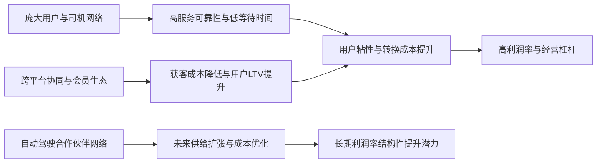

<!-- 匹配到的证券/行业：优步(UBER.N) -->
操作成功

### 一页通 （优步 (UBER.N)）
日期：2026-08-06
内容："""
## 公司概况

优步是全球领先的出行与配送科技平台，通过连接消费者与独立司机、配送员及商家，提供网约车、外卖配送及货运服务。公司业务覆盖全球超70个国家，核心市场包括美国、加拿大、拉丁美洲、欧洲、中东、非洲及亚太地区。优步凭借其庞大的网络规模、技术能力和跨平台协同效应，在出行和配送两大领域均占据全球领先地位，并正积极构建自动驾驶商业化平台。  

## 公司近况跟踪

- <strong>2Q26业绩超预期</strong>：总预订额同比增长24%至580亿美元，连续四个季度实现超20%增长。Non-GAAP EPS同比增长35%，过去12个月自由现金流首次突破100亿美元。美国出行业务的行程量和总预订额增长均加速，配送业务有机增长势头良好。 

- <strong>自动驾驶战略加速落地</strong>：目前已在7个城市运营自动驾驶服务，预计2026年底扩展至15个城市。新增Zoox、Wayve、Nuro/Lucid等合作伙伴，并宣布与NVIDIA深化合作，目标2028年前在28个城市部署L4级自动驾驶。公司明确目标为成为全球领先的自动驾驶汽车商业化平台。  

- <strong>收购Delivery Hero</strong>：宣布以约148亿美元收购Delivery Hero，将其业务版图扩展至近100个市场，使能提供出行和配送全平台服务的市场数量大约翻倍。交易预计2027年下半年完成，管理层预计可实现12亿美元年度运行率协同效应。 

- <strong>Uber One会员突破5000万</strong>：会员数同比增长50%，贡献出行和配送业务总预订的50%。会员用户交叉率更高，跨平台用户增长比单产品用户快1.5倍。  

- <strong>巴西市场竞争加剧</strong>：因外卖领域竞争激烈，争夺两轮车配送运力导致获取成本上升，影响出行量增长。但公司市场份额保持稳定，且两轮车业务利润率较低，对利润冲击有限。 

## 短期逻辑

1. <strong>自动驾驶合作伙伴商业化落地的催化剂效应</strong>：2026年下半年至2027年初，优步将迎来多个自动驾驶合作伙伴的商业化部署。Zoox计划2026年夏季在拉斯维加斯推出、2027年中期在洛杉矶推出；Nuro与Lucid计划2026年底在旧金山湾区推出；Wayve与Nissan计划2026年底在东京推出。这些落地事件将成为验证优步自动驾驶平台战略可行性的关键节点。目前自动驾驶出行量占优步总出行量不足0.5%，市场对优步在自动驾驶时代的定位存在重大分歧，任何积极的运营数据（如车辆利用率、用户接受度）都可能成为股价催化剂。   

2. <strong>Delivery Hero收购的协同效应预期</strong>：收购预计2027年下半年完成，但市场可能在交易完成前就开始定价协同效应。管理层预计交易完成后18个月内实现12亿美元运行率协同效应，主要来自技术平台整合和成本优化。考虑到Delivery Hero的利润率远低于优步，技术平台迁移带来的成本杠杆具有较高确定性。此外，跨平台交叉销售（如在中东市场将Talabat的配送用户转化为出行用户）虽在协同效应中占比较小，但存在较大上行空间。  

3. <strong>核心业务增长韧性支撑估值修复</strong>：优步当前交易于约16倍2027年Non-GAAP EPS，远低于其历史平均水平和增长潜力。美国出行业务受益于保险成本改善、产品创新和稀疏市场渗透，增长正在加速。配送业务有机增长势头良好，广告业务年化收入已达25亿美元且同比增长50%。若Q3业绩继续超预期，可能触发估值修复。  

## 长期逻辑

1. <strong>跨平台网络效应的深化</strong>：优步正从单一的出行或配送平台向综合本地生活服务平台演进。目前仅20%的用户同时使用出行和配送服务，跨平台用户的总预订量是单平台用户的3倍以上。随着Uber One会员计划渗透率提升（目前50%的总预订量来自会员）和OneSearch等跨平台功能的推出，交叉销售潜力巨大。收购Delivery Hero后，跨平台潜在用户群将扩大超过5000万消费者。这种网络效应具有自我强化的特征：更多用户吸引更多司机和商家，进而提升服务质量和可靠性，形成竞争壁垒。  

2. <strong>自动驾驶平台战略的长期价值</strong>：优步定位为自动驾驶生态的“市场平台层”，通过输出需求网络、车队管理能力和数据，成为自动驾驶技术商业化的重要基础设施。公司已与Waymo、Zoox、Nuro、Wayve、WeRide、Rivian、NVIDIA等建立合作，构建了多元化的合作伙伴网络。管理层判断自动驾驶格局将呈现多玩家并存，而非单一模型垄断，优步的平台模式有望从中受益。即使自动驾驶降低出行成本、扩大市场规模，优步凭借品牌和分销能力，有望在长期竞争中保持优势地位。  

3. <strong>全球市场扩张与品类拓展</strong>：优步在稀疏市场（郊区、小城市）的渗透率不足10%，而密集市场超过50%，增长空间巨大。配送业务正向杂货、零售、酒类等品类拓展，杂货与零售年化总预订额已达150亿美元且同比增长40%以上。广告业务年化收入25亿美元，同比增长50%，占配送总预订额约2%，相比Delivery Hero的3%仍有提升空间。这些新业务不仅贡献增量收入，还通过提升用户粘性和频次强化平台生态。  

## 风险提示

- <strong>自动驾驶竞争格局的不确定性</strong>：Waymo已宣布计划2028年起结束与优步的合作，转向全栈自营模式。若其他自动驾驶技术领先者效仿，优步的平台模式可能面临“管道化”风险，即失去对用户关系和定价权的控制。虽然优步已布局多家合作伙伴，但若Waymo等头部玩家在技术和成本上形成显著优势，优步的网络效应可能被削弱。目前自动驾驶出行量占优步总出行量不足0.5%，但市场定价已部分反映了这一长期风险。 

- <strong>收购整合与监管风险</strong>：收购Delivery Hero涉及约50个市场的整合，虽然管理层有清晰的整合路线图，但多品牌、多市场的技术平台迁移存在执行风险。此外，交易需获得多个司法管辖区的监管批准，存在不确定性。14个重叠市场将被剥离，可能影响协同效应的实现。  

- <strong>全球宏观经济与竞争压力</strong>：优步业务遍布70多个国家，面临地缘政治风险、汇率波动和区域性竞争加剧的挑战。巴西市场因外卖竞争导致两轮车运力成本上升，已对出行量产生影响。若更多市场出现类似竞争态势，可能对增长和利润率构成压力。 

## 近期要闻

- <strong>2026年7月16日</strong>：优步宣布与Delivery Hero达成收购协议，以每股€41.50现金收购Delivery Hero，交易价值约148亿美元。优步将收购Delivery Hero的50个市场，14个重叠市场将剥离给SSW Partners。  

- <strong>2026年7月1日</strong>：优步完成对Getir配送业务的收购，以约4.65亿美元现金收购Getir的食品配送业务及杂货配送业务的少数股权。  

- <strong>2026年6月</strong>：优步与NVIDIA深化合作，宣布将部署NVIDIA软件驱动的L4级自动驾驶车辆，计划2027年在洛杉矶和旧金山推出，2028年扩展至28个城市。  

- <strong>2026年5月</strong>：优步1Q26业绩发布，总预订额同比增长25%，Non-GAAP EPS同比增长44%。公司宣布自动驾驶出行订单量同比增长超10倍，已在8个城市上线。  

## 未来催化

- <strong>2026年8月-12月</strong>：多个自动驾驶合作伙伴计划在2026年下半年启动商业化部署，包括Zoox在拉斯维加斯、Nuro/Lucid在旧金山湾区、Wayve/Nissan在东京、WeRide在马德里和慕尼黑等。这些落地事件将成为验证优步自动驾驶平台战略的关键催化剂。  

- <strong>2026年10月-11月</strong>：优步3Q26财报发布。管理层指引总预订额同比增长18%-22%，Non-GAAP EPS为$0.84-$0.88。若业绩超预期，可能触发估值修复。 

- <strong>2026年下半年</strong>：股票回购恢复。管理层表示因收购Delivery Hero在Q2战术性减少了回购，将在未来数月内稳步恢复至更正常的回购水平（约50%自由现金流用于回购）。 

- <strong>2027年上半年</strong>：NVIDIA合作计划在洛杉矶和旧金山启动L4级自动驾驶部署，这是优步自动驾驶战略的重要里程碑。  

## 公司业务模式及拆分

<strong>业务边际变化</strong>：优步正从出行和配送双轮驱动向综合本地生活服务平台演进。公司通过Uber One会员计划深化用户粘性，推动跨平台协同；通过广告业务提升变现效率；通过自动驾驶合作布局未来出行形态。收购Delivery Hero将大幅扩展全球版图，尤其是在中东、韩国和拉丁美洲市场。  

<strong>盈利模式</strong>：优步的核心盈利模式是通过技术平台连接供需两端，从每笔交易中抽取服务费（Take Rate）。在多数市场，优步作为代理方，收入为净额确认（扣除司机/商家收入）。在部分市场，优步作为承运方，收入为全额确认。公司还通过广告、会员订阅和金融合作等获取收入。盈利能力的核心驱动因素是网络规模效应带来的固定成本杠杆和交易量增长。 

<strong>业务拆分</strong>：优步业务分为三大板块：出行（Mobility）、配送（Delivery）和货运（Freight）。2025年，出行收入占比57%，配送收入占比33%，货运收入占比10%。从利润贡献看，出行是主要利润来源，配送利润率正在快速提升，货运仍处于盈亏平衡附近。公司当前处于业绩兑现期，各业务板块均实现健康增长和利润率扩张。  

<strong>细分业务拆分</strong>

| 业务板块 | 指标 | FY2023 | FY2024 | FY2025 | 1H26 |
|---|---|---|---|---|---|
| <strong>出行</strong> | 收入(亿美元) | 198.32 | 250.87 | 296.70 | 141.61 |
| | 同比(%) | 41.4 | 26.5 | 18.3 | 2.7 |
| | 收入占比(%) | 53.2 | 57.0 | 57.0 | 51.7 |
| | 总预订额(亿美元) | 688.97 | 830.24 | 974.97 | 553.82 |
| | 总预订额同比(%) | 30.8 | 20.5 | 17.4 | 22.3 |
| | Non-GAAP经营利润(亿美元) | - | 58.24 | 72.07 | 42.44 |
| | 经营利润率(% of GB) | - | 7.01 | 7.39 | 7.66 |
| <strong>配送</strong> | 收入(亿美元) | 122.04 | 137.50 | 172.48 | 103.13 |
| | 同比(%) | 12.0 | 12.7 | 25.4 | 30.9 |
| | 收入占比(%) | 32.7 | 31.3 | 33.2 | 37.6 |
| | 总预订额(亿美元) | 637.26 | 746.14 | 908.64 | 534.55 |
| | 总预订额同比(%) | 14.2 | 17.1 | 21.8 | 25.7 |
| | Non-GAAP经营利润(亿美元) | - | 21.25 | 31.53 | 20.16 |
| | 经营利润率(% of GB) | - | 2.85 | 3.47 | 3.77 |
| <strong>货运</strong> | 收入(亿美元) | 52.45 | 51.41 | 50.99 | 29.20 |
| | 同比(%) | -24.5 | -2.0 | -0.8 | 15.8 |
| | 收入占比(%) | 14.1 | 11.7 | 9.8 | 10.7 |
| | 总预订额(亿美元) | 52.42 | 51.35 | 50.93 | 29.05 |
| | Non-GAAP经营利润(亿美元) | - | -1.55 | -1.09 | -0.54 |

*注：FY2023-2024的Non-GAAP经营利润数据在资料中未按新口径完整重述，故部分留空。1H26数据为2026年上半年累计。*

<strong>出行业务</strong>：2026年上半年收入141.61亿美元，同比仅增长2.7%，主要受英国商业模式变更影响（约8个百分点拖累），剔除后增速约22%。总预订额增长22.3%，主要驱动力为行程量增长、产品创新（高端产品如Reserve、U4B和经济型产品如Wait & Save）以及稀疏市场渗透。美国市场因保险成本改善和产品创新，增长正在加速。Non-GAAP经营利润率7.66%，同比扩张约27个基点。  

<strong>配送业务</strong>：2026年上半年收入103.13亿美元，同比增长30.9%。总预订额增长25.7%，受益于餐厅配送、杂货零售和广告业务的强劲增长。Uber One会员已贡献配送总预订额的70%。广告业务年化收入达25亿美元，同比增长50%。Non-GAAP经营利润率3.77%，同比扩张约30个基点。  

<strong>货运业务</strong>：2026年上半年收入29.20亿美元，同比增长15.8%。总预订额增长18.9%，主要受运输量和每单收入增长驱动。业务仍处于微亏状态，但亏损持续收窄。 

## 核心竞争力

<strong>竞争要素 1：依托庞大网络规模与数据飞轮构筑的双边市场壁垒</strong>

- <strong>护城河定性</strong>：优步的网络效应属于<strong>结构性护城河</strong>。平台上超过2亿月活用户、约1000万司机和配送员构成了强大的双边市场。更多用户吸引更多司机，提升服务可靠性和降低等待时间，进而吸引更多用户，形成自我强化的正向循环。这种网络效应在区域市场具有排他性，新进入者需要同时解决供需两端冷启动问题，成本极高。 

- <strong>数据验证</strong>：优步月活用户达2.08亿，同比增长16%；司机和配送员数量同比增长15%。过去12个月新增首次用户数创近年记录。在密集市场，优步渗透率超过50%，而在稀疏市场不足10%，表明网络效应在成熟市场已形成强大护城河，同时仍有巨大扩张空间。Non-GAAP经营利润率从2023年的约3.5%提升至2026年Q2的3.7%（占GB），体现了规模效应带来的经营杠杆。  

- <strong>动态演变</strong>：护城河正在<strong>变宽</strong>。Uber One会员突破5000万，贡献50%的总预订额，会员用户留存率和消费频次显著高于非会员，强化了用户粘性。跨平台用户（同时使用出行和配送）的消费额是单平台用户的3倍以上，且增速快1.5倍。随着配送和出行业务的协同深化，用户转换成本持续提高。  

<strong>竞争要素 2：跨平台协同效应与会员生态</strong>

- <strong>护城河定性</strong>：优步的跨平台能力属于<strong>结构性护城河</strong>。全球范围内，同时运营出行和配送双平台且均处于领先地位的公司极少。优步通过Uber One会员计划、OneSearch跨平台搜索等功能，将出行用户转化为配送用户（反之亦然），降低获客成本，提升用户生命周期价值。收购Delivery Hero后，跨平台潜在用户群将扩大超过5000万。  

- <strong>数据验证</strong>：跨平台用户仅占总用户的20%，但其增速是单产品用户的1.5倍，消费额是3倍以上。Uber One会员已突破5000万，同比增长50%。配送业务中，约58%的首次配送用户是平台新用户，表明配送业务有效扩大了用户基础。广告业务年化收入25亿美元，同比增长50%，体现了平台流量变现能力的提升。  

- <strong>动态演变</strong>：护城河正在<strong>变宽</strong>。收购Delivery Hero将使优步在近60%的市场同时提供出行和配送服务，大幅扩展跨平台协同的潜在市场。随着OneSearch等功能的推出和会员计划的深化，跨平台渗透率有望从20%持续提升。 

<strong>现阶段核心驱动力总结</strong>：优步的Alpha来源于其网络效应和跨平台协同带来的结构性优势，以及管理层在资本配置和成本控制上的纪律性。Beta则与全球出行和消费需求、自动驾驶技术演进以及监管环境相关。当前阶段，核心业务增长稳健，自动驾驶战略处于投入期，收购整合是中期重要变量。 

<strong>竞争格局传导逻辑图</strong>

## 产销链

<strong>客户情况</strong>：优步的客户高度分散，无单一客户占收入10%以上。平台连接数亿消费者和数百万商家，客户集中度风险极低。Uber One会员（5000万+）是最高价值客户群体，贡献50%的总预订额。企业客户（U4B）增速为整体出行业务的两倍，同比增长40%。新客户增长强劲，过去12个月新增首次用户数创近年记录，主要来自低成本产品（如Wait & Save）和稀疏市场拓展。  

<strong>供应商情况</strong>：优步的核心供应商是司机和配送员（平台上的独立承包商）。司机供给是平台流动性的关键。2026年Q2司机数量同比增长15%，供给健康。但在巴西等特定市场，因外卖平台竞争争夺两轮车运力，导致供给成本上升。优步通过激励措施调节供需平衡。保险是另一重要成本项，2026年美国保险成本转为顺风，费率低个位数增长，为多年来最温和水平。 

<strong>经销商情况</strong>：优步不采用传统经销模式。平台直接连接服务提供者（司机、配送员）和消费者，无中间经销商层级。 

<strong>成本传导能力</strong>：当上游成本（如保险、司机激励）上升时，优步具备一定的成本传导能力，可通过动态定价将部分成本转嫁给消费者。但在竞争激烈的市场，传导能力受限。2025-2026年美国保险成本下降，优步选择将节省的成本再投资于降低价格和提升司机激励，以驱动增长，而非全部转化为利润。这表明优步赚取的是“平台服务费”，其利润率取决于供需双方的议价能力和竞争格局。 

## 财务数据

| 指标 | FY2023 | FY2024 | FY2025 |
|---|---|---|---|
| <strong>截止日期</strong> | 2023-12-31 | 2024-12-31 | 2025-12-31 |
| 收入(亿美元) | 372.81 | 439.78 | 520.17 |
| 收入同比(%) | 16.95 | 17.96 | 18.28 |
| 营业成本(亿美元) | 224.57 | 266.51 | 313.38 |
| 毛利润(亿美元) | 148.24 | 173.27 | 206.79 |
| 毛利率(%) | 39.76 | 39.40 | 39.75 |
| 营业利润(亿美元) | 37.99 | 55.31 | 84.19 |
| 营业利润率(%) | 10.19 | 12.58 | 16.18 |
| 归母净利润(亿美元) | 18.87 | 98.56 | 100.53 |
| 归母净利润同比(%) | 120.64 | 422.31 | 2.00 |
| 稀释EPS(美元) | 0.87 | 4.56 | 4.73 |
| 自由现金流(亿美元) | 35.62 | 68.95 | 97.63 |

*注：自由现金流根据财报数据计算（经营活动现金流净额-资本性支出）。FY2025归母净利润增速仅2%，主要因FY2024包含约64亿美元递延税项资产估值备抵释放的一次性收益。*

<strong>财务分析</strong>：

- <strong>成长能力</strong>：收入连续三年保持17%-18%的稳健增长。总预订额增速（FY2025为18.8%）快于收入增速，主要因英国等市场商业模式变更导致收入确认方式变化（从总额法转为净额法），属于会计处理变化，不影响盈利能力。Non-GAAP经营利润FY2025同比增长49.7%，远快于收入增速，体现显著的经营杠杆。  

- <strong>盈利能力</strong>：毛利率稳定在39%-40%区间。营业利润率从FY2023的10.2%大幅提升至FY2025的16.2%，主要受益于销售费用率下降（从11.7%降至9.4%）和管理费用率下降（从7.2%降至6.2%）。Non-GAAP经营利润率（占GB）从FY2024的2.6%提升至FY2025的3.3%，反映核心业务盈利能力持续改善。  

- <strong>现金流质量</strong>：自由现金流从FY2023的35.62亿美元增长至FY2025的97.63亿美元，增长174%。FY2025自由现金流占Non-GAAP净利润比例约186%，现金流质量健康。过去12个月自由现金流首次突破100亿美元。公司计划将约50%的自由现金流用于股票回购。  

- <strong>偿债能力</strong>：FY2025末总债务106亿美元，现金及现金等价物71.05亿美元，净债务约35亿美元。净债务/EBITDA约0.4倍，财务杠杆健康。公司维持投资级评级。 

## 行业及竞争分析

<strong>出行行业</strong>：全球出行市场高度分散，优步面临来自传统出租车、公共交通、个人车辆以及其他网约车平台（如Lyft、Bolt、滴滴）的竞争。行业增长驱动力包括城市化、私家车拥有成本上升以及消费者对便捷出行服务的偏好增强。自动驾驶技术的商业化是行业最大的结构性变量，可能重塑竞争格局。优步在多数核心市场占据领先地位，美国市场份额估计超过70%。 

<strong>配送行业</strong>：全球在线食品配送市场竞争激烈，主要玩家包括DoorDash、Delivery Hero、Just Eat Takeaway、美团等。行业正从餐厅配送向杂货、零售、酒类等多品类扩展。竞争维度包括价格、配送速度、商家覆盖和用户粘性。优步在多个国际市场（英国、法国、澳大利亚、日本等）占据领先地位，但在美国市场落后于DoorDash。 

<strong>货运行业</strong>：全球货运经纪市场高度分散，优步货运主要面向北美和欧洲市场，与C.H. Robinson、RXO等传统货运经纪商竞争。行业受宏观经济周期影响较大。 

<strong>可比公司</strong>：

| 公司名称 | 股票代码 | 核心业务 | 市值(亿美元) | 收入增速(FY2025) | 毛利率(FY2025) |
|---|---|---|---|---|---|
| DoorDash | DASH | 食品配送 | ~800 | ~25% | ~48% |
| Lyft | LYFT | 网约车 | ~60 | ~15% | ~35% |
| Grab | GRAB | 出行+配送(东南亚) | ~120 | ~20% | ~40% |
| 美团 | 3690.HK | 配送+本地生活(中国) | ~1000 | ~20% | ~35% |

优步与DoorDash相比，业务更多元化（出行+配送+货运），全球化程度更高，但配送业务在美国市场的份额和利润率低于DoorDash。与Lyft相比，优步在全球规模和业务多元化上具有显著优势。与美团相比，优步的全球化布局更广，但美团的本地生活生态更为丰富。 

## 市场焦点议题

<strong>议题一：自动驾驶战略的兑现风险</strong>

- <strong>背景</strong>：市场对优步在自动驾驶时代的定位存在根本性分歧。Waymo已宣布计划2028年起结束与优步的合作，转向自营模式。特斯拉明确表示不与网约车平台合作。投资者担忧优步可能被自动驾驶技术领先者“去中介化”，丧失用户关系和定价权。   

- <strong>问题列表</strong>：
  - 优步的自动驾驶合作伙伴中，有多少具备与Waymo竞争的技术实力和资本支持？
  - 若Waymo在2028年终止合作，优步在奥斯汀和亚特兰大的市场份额和利润率将受多大影响？
  - 优步承诺的100亿美元自动驾驶投资，预计何时能产生正向回报？投资回报率预期是多少？
  - 在自动驾驶供给充裕的市场（如旧金山），优步的出行量增长和市场份额变化趋势如何？

<strong>议题二：Delivery Hero收购的整合风险与回报</strong>

- <strong>背景</strong>：优步宣布以约148亿美元收购Delivery Hero，这是公司历史上最大规模的收购。Delivery Hero在多个市场拥有领先地位，但其利润率远低于优步。整合涉及50个市场、7个品牌的平台迁移。  

- <strong>问题列表</strong>：
  - 12亿美元协同效应目标中，成本协同和收入协同各占多少？实现时间表是否现实？
  - 14个重叠市场剥离后，对协同效应和竞争格局有何影响？
  - Delivery Hero在韩国（Baemin）面临Coupang的激烈竞争，优步如何应对？
  - 收购对优步的资本配置计划（尤其是股票回购）有何近期影响？

<strong>议题三：核心业务增长的可持续性</strong>

- <strong>背景</strong>：优步已连续四个季度实现超20%的总预订额增长，但市场担忧增长可能放缓。巴西市场竞争加剧已对出行量产生影响。投资者关注增长驱动力的可持续性。 

- <strong>问题列表</strong>：
  - 美国出行加速增长的主要驱动力（保险成本改善、产品创新、稀疏市场渗透）能否持续至2027年？
  - 配送业务中，杂货零售和广告等高增长业务的利润率何时能达到与核心餐厅配送相当的水平？
  - 巴西市场的竞争压力是否会扩散至其他新兴市场？
  - 宏观经济放缓对出行和配送需求的影响程度如何？

<strong>议题四：资本配置与股东回报</strong>

- <strong>背景</strong>：优步同时进行大规模自动驾驶投资、收购Delivery Hero和股票回购，投资者关注资本配置的优先级和纪律性。 

- <strong>问题列表</strong>：
  - 100亿美元自动驾驶投资和148亿美元收购Delivery Hero的资金来源和节奏如何？
  - 股票回购何时恢复到每季度约15亿美元的节奏？
  - 公司杠杆率目标是多少？是否会影响未来回购能力？
  - 约80-90亿美元的股权投资组合（如滴滴、Grab、Aurora）的变现计划是什么？

## 市场分歧探讨

<strong>核心分歧：自动驾驶是优步的机遇还是威胁？</strong>

<strong>看多方逻辑</strong>：
- 自动驾驶将大幅降低出行成本，扩大整体市场规模。优步作为拥有庞大用户基础和市场流动性的平台，将成为自动驾驶技术商业化的重要渠道。 
- 自动驾驶格局将呈现多玩家并存，而非单一赢家通吃。优步已与Waymo、Zoox、Nuro、Wayve、WeRide、NVIDIA等建立合作，构建了多元化的合作伙伴网络，降低了对单一技术提供商的依赖。 
- 优步的网络效应和品牌优势难以复制。即使Waymo等公司自建应用，优步仍可作为重要的次级流动性提供商。Uber One会员（5000万+）的高粘性进一步强化了这一优势。  
- 在已运营自动驾驶的市场（旧金山、洛杉矶、凤凰城），优步的出行量增长在Q2较Q1加速，市场份额同比提升，初步验证了平台模式在自动驾驶时代的适应力。 

<strong>看空方逻辑</strong>：
- Waymo已宣布计划2028年起结束与优步的合作，转向自营模式。作为技术最领先、资本最雄厚的自动驾驶公司，Waymo的“垂直整合”策略可能成为行业趋势。 
- 若自动驾驶技术提供商绕过平台直接服务用户，优步可能丧失用户关系和定价权，沦为“管道化”的平台。 
- 优步的自动驾驶合作伙伴（如Zoox、Wayve、Nuro）在技术成熟度和商业化进度上落后于Waymo，能否在竞争中胜出存在不确定性。 
- 优步承诺的100亿美元自动驾驶投资可能面临回报率低甚至亏损的风险，尤其是在与Waymo等巨头的竞争中。 

<strong>综合分析</strong>：当前自动驾驶出行量占优步总出行量不足0.5%，短期内对财务影响极小。中长期看，优步的平台模式在自动驾驶生态中具有独特价值：其需求网络能帮助自动驾驶运营商提升车辆利用率（目前合作伙伴车辆每车每日可实现25-30次行程），降低空驶率。但若头部自动驾驶公司（如Waymo）在技术和成本上形成压倒性优势，并成功建立自有用户渠道，优步的平台价值可能被削弱。优步的应对策略是“不依赖单一合作伙伴”，通过广泛布局分散风险。这一策略的成功取决于其合作伙伴能否在技术竞争中保持竞争力。目前来看，优步在自动驾驶时代的地位尚未确定，但核心业务的强劲增长为这一转型提供了时间和资源缓冲。 

## 盈利预测与估值

<strong>管理层最新指引</strong>：3Q26总预订额$582.5-$602.5亿美元（固定汇率同比增长18%-22%），Non-GAAP EPS $0.84-$0.88。2026全年Non-GAAP有效税率22%-25%，现金税率10%-15%。预计美国出行和总预订额增长在2026年进一步加速。 

<strong>券商盈利预测</strong>：

| 机构 | 评级 | 目标价(美元) | 指标 | FY2025A | FY2026E | FY2027E | FY2028E |
|---|---|---|---|---|---|---|---|
| 摩根大通 (2026-08-06) | 未评级 | - | 收入(亿美元) | 520.17 | 579.23 | 674.03 | 773.71 |
| | | | Adj. EBITDA(亿美元) | 87.30 | 114.37 | 138.04 | 162.04 |
| | | | Adj. EPS(美元) | 2.45 | 3.38 | 4.51 | 5.65 |
| 花旗 (2026-08-06) | 评级暂停 | - | 收入(亿美元) | 520.17 | 577.61 | 678.59 | 782.89 |
| | | | Adj. EBITDA(亿美元) | 87.30 | 114.05 | 139.38 | 169.65 |
| | | | Adj. EPS(美元) | 2.45 | 3.36 | 4.69 | 6.10 |
| 伯恩斯坦 (2026-08-06) | 跑赢大盘 | 95.00 | 收入(亿美元) | 520.17 | 576.30 | 678.40 | - |
| | | | Adj. EBITDA(亿美元) | 87.30 | 114.16 | 138.04 | 162.04 |
| | | | Adj. EPS(美元) | 2.45 | 3.34 | 4.36 | - |
| 华泰证券 (2026-05-09) | 买入 | 120.90 | 收入(亿美元) | 520.17 | 609.00 | 716.54 | 821.01 |
| | | | Adj. EBITDA(亿美元) | 87.30 | 113.88 | 141.55 | 171.83 |
| | | | Adj. EPS(美元) | 4.94 | 2.91 | 4.43 | 5.59 |
| 中金公司 (2026-05-07) | 跑赢行业 | 99.40 | 收入(亿美元) | 520.17 | 579.00 | 656.37 | - |
| | | | Adj. EBITDA(亿美元) | 87.30 | 112.46 | 136.16 | - |
| | | | Non-GAAP EPS(美元) | 2.49 | 3.77 | 5.77 | - |

*注：机构预测数据均来自所给资料，部分机构采用Non-GAAP EPS，部分采用Adj. EPS，口径可能略有差异。花旗预测为独立基准，未包含Delivery Hero收购影响。*

<strong>估值分析</strong>：主要券商对优步的估值方法以EV/EBITDA和P/E为主。伯恩斯坦采用13倍NTM Adj. EBITDA和16倍P/FCF的混合估值，目标价95美元。华泰证券采用21倍FY2026 EV/EBITDA，目标价120.9美元。中金公司采用SOTP分部估值法（出行18倍P/OP、配送6倍P/S、货运0.5倍P/S），目标价99.4美元。   

机构间对优步的盈利预测存在一定分歧。FY2026 Non-GAAP EPS预测区间为$2.91-$3.77，差异主要来自对收入增速、利润率扩张节奏和税率的不同假设。FY2027 EPS预测区间为$4.36-$5.77，反映对自动驾驶投资影响和Delivery Hero整合效果的不同预期。整体而言，机构普遍看好优步核心业务的增长和利润率扩张趋势，但估值倍数因自动驾驶不确定性而受到压制。
"""
