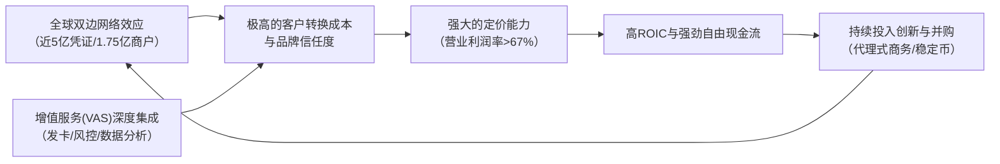

# Gangtise 公司一页通：维萨（V.N）

> 拉取日期：2026-07-30 ｜ 来源：gangtise-agent `stock-one-pager`

## 公司概况

维萨（Visa）是全球最大的零售电子支付网络运营商，定位为全球支付技术公司，通过其专有网络VisaNet，为覆盖200多个国家和地区的消费者、商户、金融机构及政府提供交易处理服务（主要为授权、清算和结算）。公司本身并非金融机构，不发行卡片或提供信贷，其核心角色是连接支付生态中各方的“网络交换机”。维萨凭借其全球品牌、庞大的网络规模（近5亿支付凭证、超1.75亿商户受理点）以及深厚的安全与信任壁垒，与万事达卡共同构成全球通用卡网络的双寡头格局。  

## 公司近况跟踪

- **FY2026 Q3业绩全面超预期，核心业务量加速增长**：净收入同比增长14%至116.33亿美元，固定汇率（FXN）下增长13%，高于指引的LDD水平。调整后EPS为3.32美元，同比增长11%。全球支付额FXN下同比增长10%，首次单季突破4万亿美元；美国支付额同比增长10%，为2019财年以来最快增速。跨境支付额（不含欧洲内部）FXN下同比增长12%，较上季度加速超1个百分点。    
- **增值服务（VAS）增长引擎再次提速**：VAS收入FXN下同比增长34%至38亿美元，超出预期，占总收入比重接近三分之一。增长主要由发卡解决方案和受理解决方案中网络产品的更高使用率驱动，同时受益于FIFA世界杯相关的营销服务。管理层指出，过去12个月所有四个VAS产品组合的增速均快于投资者日披露的历史增速。    
- **宣布裁员以优化成本结构并再投资**：公司宣布裁减约2,600个岗位，占员工总数约7%，主要集中于技术和产品团队。此举旨在利用AI提升效率，并将节省的资金重新投向消费者支付、VAS、商业及资金流动解决方案、稳定币及代理式商务等高增长领域。FY2026 Q3财报中确认了5.63亿美元的遣散费。    
- **关键客户合作与业务拓展取得进展**：在欧洲，赢得了NatWest零售银行全部消费者信贷组合，并预计未来几年仅凭已赢得的项目将新增超3,000万凭证。在拉美，与巴西Bradesco续签长达55年的合作关系。Visa Direct交易量同比增长21%至40亿笔，商业支付额同比增长13%，均呈现加速态势。   
- **稳定币与代理式商务战略布局深化**：推出Visa稳定币平台（Visa Stablecoin Platform），支持稳定币铸造、转移和管理。加入Open Standard，合作发行用于全球资金流动的新稳定币OpenUSD。在代理式商务方面，推出代理评分、代理目录等新能力，并与OpenAI、Meta等建立合作，将Visa支付集成至其AI代理和平台中。   

## 短期逻辑

1. **业绩超预期后的动量延续与指引上调**：FY2026 Q3业绩在收入、VAS增长、美国支付额等多个关键指标上均超预期，管理层同步上调了全年指引，预计FY2026净收入增速处于低双位数区间低端，EPS增速处于中双位数区间低端。强劲的Q3表现和积极的Q4展望（预计调整后净收入增速处于低双位数区间高端）为股价提供了基本面支撑。市场关注点在于，Q3的超预期表现是否能在Q4及FY2027延续，尤其是在FIFA世界杯等一次性因素消退后。若后续季度能继续证明增长算法的韧性，将驱动估值进一步修复。    

2. **AI驱动的效率提升与成本优化预期**：Visa宣布裁员约7%，主要针对技术和产品团队，并明确表示将利用AI工具（如AgentIQ）大幅提升开发效率（代码提交量增加80%，需求定义时间缩短超80%）。这一举措被市场解读为积极的成本优化信号，尽管管理层表示节省的资金将大部分用于再投资，但投资者将密切关注此举对未来运营杠杆和利润率的影响。若能在不牺牲收入增长的前提下实现费用率的改善，将构成显著的盈利上行催化剂。    

3. **代理式商务与稳定币叙事的持续发酵**：Visa在代理式商务和稳定币领域的布局正从概念走向落地。与OpenAI、Meta的合作，以及Visa稳定币平台的推出，为市场提供了具体的想象空间。尽管这些业务短期内对财务贡献有限，但在当前AI投资主题下，任何表明Visa能在新的支付范式中保持甚至强化其“信任中介”和“网络枢纽”地位的证据，都可能成为股价上涨的催化剂。市场将密切关注相关合作的交易量、用户数等先行指标。   

## 长期逻辑

1. **全球支付网络的双寡头护城河与不可替代性**：Visa与万事达卡共同构建的全球通用卡网络，其价值在于双边网络效应——越多的消费者使用，商户就越有动力接受；越多的商户接受，消费者就越愿意使用。这种网络效应经过数十年积累，形成了极高的规模壁垒。在可预见的未来，无论是新兴的账户到账户（A2A）支付、稳定币还是代理式商务，都难以在“全球接受度”、“交易安全与争议解决机制”、“监管合规框架”这三个维度上同时匹敌Visa的网络。Visa的战略是成为所有支付方式的“网络之网络”，而非仅仅捍卫卡支付，这使其在支付方式变革中处于有利地位。 

2. **增值服务（VAS）打开第二增长曲线，提升收入天花板与粘性**：VAS业务（发卡、受理、风控、咨询）已占公司收入近三分之一，且增速（Q3为34%）远高于核心支付业务。VAS的TAM高达5,200亿美元，目前渗透率仅约2%。该业务的增长逻辑清晰：1）基线增长来自网络交易量和卡量的自然增长；2）通过深化现有产品渗透和拓展新地域实现增长；3）通过有机创新和并购（如Pismo、Featurespace）进入新的能力领域。VAS不仅贡献了增量收入，更重要的是，通过将风控、数据处理等核心能力嵌入客户运营，显著提高了客户转换成本，加深了护城河。   

3. **新支付流（New Flows）的长期TAM扩张潜力**：Visa在消费者对商户（C2B）支付之外，正系统性地拓展P2P、B2B、B2C和G2C等新支付流，其目标市场规模合计约200万亿美元。其中，Visa Direct已成为全球最大的资金分发平台之一，交易量在FY2025达125亿笔。B2B支付是最大的单一机会，Visa通过虚拟卡、Visa Commercial Choice等可编程支付解决方案，瞄准了传统支票和ACH支付的数字化迁移。这些新支付流的利润率可能低于核心C2B业务，但其庞大的体量为Visa提供了长期的交易量增长引擎，并使其收入结构更加多元化。  

## 风险提示

- **监管与立法风险**：全球范围内对卡网络的经济模型（尤其是交换费）的监管审查持续加强。美国的《信用卡竞争法案》（CCCA）若通过，将强制要求大型发卡行为信用卡提供至少两个非关联网络进行路由选择，可能对Visa的美国信用卡业务收入和定价能力构成实质性冲击。此外，美国司法部对Visa借记卡业务的反垄断诉讼仍在进行中，其结果可能迫使Visa改变其商业行为。  
- **技术颠覆与竞争风险**：尽管Visa在积极布局，但账户到账户（A2A）实时支付系统（如巴西Pix、印度UPI）的兴起，以及稳定币在特定跨境支付场景中的应用，代表了潜在的替代性支付基础设施。长期来看，若这些替代方案在用户体验、成本和安全性上取得突破，并建立起类似Visa的双边网络，可能侵蚀Visa的支付量份额，尤其是在增量市场。 
- **宏观经济与地缘政治风险**：Visa的业绩与全球消费者支出和跨境旅行高度相关。经济衰退、持续通胀或地缘政治冲突（如中东局势）可能导致消费支出放缓或跨境旅行减少，从而直接影响Visa的交易量和收入。尽管Visa的业务在历史上表现出韧性，但严重的宏观冲击仍会对其增长构成压力。 

## 近期要闻

- **2026年5月**：Visa完成B类普通股交换要约，优化了股权结构。此举有助于逐步解决历史遗留的股权问题，增加A类普通股的流动性。 
- **2026年6月**：Visa在2026年Baird全球消费者、科技与服务大会上，详细阐述了其商业及资金流动解决方案（CMS）战略，强调了在B2B支付、车队管理和虚拟卡领域的差异化优势，以及代理式商务带来的机遇。 
- **2026年7月28日**：Visa公布FY2026 Q3财报，业绩全面超预期，并宣布裁员约2,600人。同日，公司宣布与OpenAI合作，在代理式商务中支持安全的Visa支付；并与Meta合作，在Facebook和Instagram上推出由Visa智能商务驱动的新支付方式。  

## 未来催化

- **2026年8月-9月**：FIFA世界杯剩余赛事及后续影响。尽管大部分赛事在Q3结束，但相关营销活动和品牌效应可能在Q4及之后继续为VAS中的咨询和营销服务收入带来贡献。 
- **2026年10月**：FY2026 Q4财报及FY2027全年指引。这是下一个最重要的基本面验证点。市场将密切关注：1）在FIFA世界杯等一次性因素消退后，VAS和整体收入的增长韧性；2）裁员后运营费用的变化趋势；3）管理层对FY2027的初步展望，尤其是对VAS增长、宏观环境和投资优先级的判断。 
- **2026年下半年**：Visa可能启动新一轮针对B类普通股的交换要约。管理层在FY2025年报中提及，当美国覆盖诉讼中未解决的损害赔偿索赔估计金额较2023年10月的496亿美元下降超过50%时，可能进行下一次交换要约。截至2025年10月，该金额已降至394亿美元，触发条件渐近。此举虽不改变完全稀释后的股份总数，但会增加自由流通的A类普通股数量，可能对短期股价造成技术性压力，但长期来看有助于简化股权结构。  

## 公司业务模式及拆分

### 业务边际变化

Visa正从传统的卡支付网络运营商，向一个以“网络之网络”为核心、以增值服务为增长引擎的综合性支付科技平台演进。公司的战略重心已明确扩展至三大增长支柱：消费者支付（CP）、商业与资金流动解决方案（CMS）和增值服务（VAS）。近期，公司显著加大了对代理式商务和稳定币等前沿领域的投入，将其视为下一波商业数字化的关键驱动力，并已推出具体产品（如Visa Intelligent Commerce、Visa Stablecoin Platform）和建立关键合作（如与OpenAI、Meta的合作）。同时，公司通过裁员和AI工具部署，主动优化组织架构和成本结构，以提升运营效率并为战略投资提供资金。  

### 盈利模式

Visa的核心盈利模式是“网络通行费”模式。公司通过VisaNet为发卡行和收单行提供交易处理服务，并从中收取服务费、数据处理费和国际交易费。该模式的特点是：1）收入主要基于支付额和交易笔数，而非承担信用风险；2）固定成本占比高，具有显著的经营杠杆；3）网络效应强，规模越大，价值越高。近年来，VAS业务的崛起丰富了其盈利模式，通过提供发卡处理、风控、咨询等高附加值服务，获取了基于交易或项目的订阅制/项目制收入，这部分收入的增长不再单纯依赖支付额的增长，而是源于客户对更深度服务的需求，从而提升了整体收入的多元化和可持续性。 

### 业务拆分

公司近年业务结构持续向VAS和CMS倾斜。从收入构成看，占比最高、增速最快的业务板块已从传统的国际交易收入转向数据加工收入和VAS。FY2025年报显示，数据加工收入占比最高，达到总净收入的50%，而VAS收入（分布在服务、数据加工和其他收入中）合计占总净收入约27%。到FY2026 Q3，VAS收入占比已提升至约33%。公司目前处于业绩兑现期，VAS和新支付流的强劲增长正在持续验证其战略的有效性。  

**细分业务拆分（基于财报披露的收入类别）**

| 收入类别 (百万美元) | FY2023 | FY2024 | FY2025 | FY2026 Q1-Q3 |
|---|---|---|---|---|
| **截止日期** | 2023-09-30 | 2024-09-30 | 2025-09-30 | 2026-06-30 |
| 服务收入 | 14,826 | 16,114 | 17,539 | 14,663 |
| 同比 | - | 8.7% | 8.8% | 13.3% |
| 数据加工收入 | 16,007 | 17,714 | 19,993 | 17,129 |
| 同比 | - | 10.7% | 12.9% | 17.3% |
| 国际交易收入 | 11,638 | 12,665 | 14,166 | 11,136 |
| 同比 | - | 8.8% | 11.9% | 7.4% |
| 其他收入 | 2,479 | 3,197 | 4,053 | 4,030 |
| 同比 | - | 29.0% | 26.8% | 40.1% |
| 客户激励 | (12,297) | (13,764) | (15,751) | (13,194) |
| **净收入合计** | **32,653** | **35,926** | **40,000** | **33,764** |

注：增值服务（VAS）收入分布在服务、数据加工和其他收入中，FY2025全年为109亿美元，FY2026 Q1-Q3为103亿美元。 

**各收入类别分析（FY2026 Q1-Q3）**

- **服务收入**：主要基于上一季度的支付额进行评估。FY2026 Q1-Q3同比增长13.3%，高于支付额增速，受益于定价调整和卡权益服务的增长。 
- **数据加工收入**：主要基于当季处理的交易笔数。FY2026 Q1-Q3同比增长17.3%，显著高于9%的处理交易量增速，主要驱动力来自VAS（尤其是受理解决方案和风控解决方案）的强劲增长、定价调整以及高收益的跨境交易占比提升。 
- **国际交易收入**：来自跨境交易处理和货币兑换。FY2026 Q1-Q3同比增长7.4%，增速低于跨境支付额（不含欧洲内部）约15%的增速。这一差距主要源于：1）去年同期汇率波动性高，形成高基数；2）业务组合变化，如收益率较低的Visa Direct交易占比增加；3）部分定价收益体现在数据加工收入中。 
- **其他收入**：主要包括咨询、营销服务等VAS。FY2026 Q1-Q3同比大幅增长40.1%，主要受咨询和FIFA世界杯相关营销服务的强劲增长驱动。 
- **客户激励**：作为收入的减项，是支付给金融机构客户、商户等合作伙伴的返利，旨在扩大支付额和接受度。FY2026 Q1-Q3同比增长14.7%，与支付额增长基本同步。 

## 核心竞争力

**竞争要素 1：依托极高转换成本与双边网络效应构筑的结构性护城河**

-   **护城河定性**：Visa的网络构成了**结构性护城河**。其核心是连接数十亿持卡人和超过1.75亿商户的双边网络。对于发卡行，迁移到另一个网络意味着失去Visa的全球接受度；对于商户，不接受Visa意味着拒绝全球海量的消费者。这种相互依赖关系创造了极高的转换成本，使得现有网络极难被颠覆。Visa的品牌代表着“全球接受”和“安全可靠”，这本身就是一种强大的无形资产。 
-   **数据验证**：Visa的盈利能力是这一护城河的直接体现。其FY2025 GAAP口径的营业利润率高达67.7%，非GAAP口径的ROIC在FY2025达到44.0%（瑞银测算），显示出极强的定价能力和资本回报率。公司拥有近5亿张流通卡和超过1.75亿个受理点，这一规模是任何新进入者在短期内无法复制的。  
-   **动态演变**：护城河正在**变宽**。Visa通过VAS将风控、数据分析、发卡处理等能力深度嵌入到客户（银行和商户）的运营中，进一步增强了客户粘性。同时，公司积极拥抱代理式商务和稳定币，其战略并非抵御新技术，而是将Visa的信任、安全和网络能力作为底层基础设施提供给这些新生态，从而将护城河延伸至新的支付领域。  

**竞争要素 2：通过增值服务（VAS）实现的生态锁定与收入多元化**

-   **护城河定性**：VAS业务正在从“附加服务”演变为**结构性护城河**的一部分。通过提供发卡处理（DPS/Pismo）、风控（Visa Protect）、数据分析（VCA）等深度服务，Visa不再仅仅是一个交易管道，而是成为客户支付业务的核心运营系统。这种深度集成使得客户替换Visa的成本变得极其高昂，不仅涉及费用谈判，更涉及核心业务流程的重构。 
-   **数据验证**：VAS收入在FY2026 Q3已占公司总净收入的约33%，且增速（34%）远超核心支付业务。VAS的TAM高达5,200亿美元，而Visa目前的渗透率仅约2%（美银测算），显示出巨大的增长空间。VAS的强劲增长并未稀释公司整体利润率，FY2025非GAAP营业利润率仍维持在67.7%的高位，证明其并非以牺牲利润为代价的“空热量”增长。  
-   **动态演变**：护城河正在**变宽**。Visa通过收购（如Pismo、Featurespace）和内部创新，不断扩展VAS的能力边界。例如，Pismo为富国银行提供核心银行账本服务，标志着Visa进入了银行核心基础设施领域。随着VAS产品组合的丰富和渗透率的提升，Visa与客户的关系将从交易处理伙伴升级为战略技术伙伴，其护城河将变得更加深厚和立体。   

**现阶段核心驱动力总结**：
Visa的Alpha来自于其在全球支付网络中的双寡头垄断地位，这一地位由极高的规模壁垒和转换成本所保障。其Beta则与全球消费者支出和跨境旅行高度相关。当前，公司的核心驱动力正从单一的支付额增长，转向“支付额增长 + VAS渗透率提升 + 新支付流拓展”的三轮驱动模式，这使其增长更具韧性和持续性。  

**竞争格局传导逻辑图**：

## 产销链

- **客户情况**：Visa的客户主要是金融机构（发卡行和收单行）、商户、金融科技公司和政府机构。FY2025年报显示，有一家客户占其总净收入的11%，显示出一定的客户集中度风险，但整体客户基础非常分散，涵盖全球近14,500家金融机构。公司正积极拓展与大型科技公司（如Meta、OpenAI）和金融科技公司（如DoorDash）的合作，以获取新的支付流量。 
- **供应商情况**：作为一家技术公司，Visa的主要“供应商”是其运营网络所需的技术基础设施、数据中心、电信服务和专业服务公司。公司并未披露供应商集中度。其成本结构中，人员费用是最大的开支项（FY2025占净收入的17.4%），其次是营销和网络处理费用。Visa的成本结构相对固定，这赋予了其强大的经营杠杆。 
- **经销商情况**：Visa不采用传统的经销模式。其“分销”是通过其客户——发卡行和收单行——来实现的。发卡行将Visa卡分发给消费者，收单行则拓展商户接受Visa卡。Visa通过客户激励（FY2025为157.51亿美元，占毛收入的28.3%）来引导和鼓励这些合作伙伴推广其网络和产品。 
- **成本传导能力**：Visa赚取的是“网络通行费”，其定价与交换费（由发卡行收取）和商户折扣率（由收单行收取）是分离的。Visa的运营成本主要是固定的人员和技术投入，对上游原材料价格不敏感。其收入直接与支付额和交易量挂钩，因此，当宏观经济向好、消费支出增加时，Visa的收入自然增长，而成本增长相对滞后，从而展现出强大的经营杠杆。公司赚取的是典型的“规模经济”和“品牌溢价”的钱。 

## 财务数据

**关键财务数据**

| 财务指标 (百万美元) | FY2023 | FY2024 | FY2025 | FY2026 Q1-Q3 |
|---|---|---|---|---|
| **截止日期** | 2023-09-30 | 2024-09-30 | 2025-09-30 | 2026-06-30 |
| 净收入 | 32,653 | 35,926 | 40,000 | 33,764 |
| 同比 | 11.4% | 10.0% | 11.3% | 15.3% |
| 营业利润 | 21,000 | 23,595 | 23,994 | 20,848 |
| 营业利润率 | 64.3% | 65.7% | 60.0% | 61.7% |
| 归母净利润 | 17,273 | 19,743 | 20,058 | 17,502 |
| 同比 | 15.5% | 14.3% | 1.6% | 16.9% |
| 稀释每股收益 (美元) | 8.28 | 9.73 | 10.20 | 9.14 |
| 自由现金流 | 19,696 | 18,693 | 21,577 | 15,164 |

注：自由现金流 = 经营活动产生的现金流量净额 - 资本性支出。FY2025归母净利润增速较低，主要受诉讼拨备大幅增加（25.62亿美元）影响。 

**财务分析**

- **成长能力**：Visa展现出稳健的双位数增长能力。FY2023至FY2025净收入CAGR为10.7%。进入FY2026，增长显著提速，前三季度净收入同比增长15.3%，主要受VAS强劲增长、支付额加速和定价调整驱动。剔除诉讼拨备等一次性项目影响，非GAAP净利润在FY2025同比增长10.6%，FY2026 Q1-Q3同比增长12.0%（瑞银测算），显示出核心盈利能力的持续增强。 
- **盈利能力**：Visa拥有世界级的盈利能力。尽管FY2025 GAAP营业利润率因诉讼拨备增加而下降至60.0%，但其非GAAP营业利润率稳定在67.7%的高位（瑞银测算），FY2026 Q1-Q3非GAAP营业利润率约为67.5%。这反映了其轻资产、高经营杠杆的商业模式优势。ROE在FY2025高达58.5%（美银测算），显示出为股东创造价值的卓越能力。  
- **现金流与资本配置**：Visa是强劲的现金牛。FY2025自由现金流为215.77亿美元，占非GAAP净利润的95.7%。公司拥有强大的资本配置能力，FY2025通过股份回购（183.16亿美元）和分红（46.34亿美元）向股东返还了绝大部分自由现金流。FY2026 Q1-Q3，公司进一步加大了回购力度，总回购金额达164.30亿美元。截至FY2026 Q3末，公司仍有284亿美元的股份回购授权额度，为未来股东回报提供了坚实基础。  

## 行业及竞争分析

Visa所处的全球数字支付行业，是一个由长期结构性趋势驱动的巨大市场。尽管近年来电子支付渗透率快速提升，但全球范围内现金和支票仍占消费者支付交易的相当比例（2025年现金占比约46%，麦肯锡数据），为行业提供了持续的增长空间。行业增长的核心驱动力包括：1）从现金和支票向电子支付的持续迁移；2）全球电子商务的蓬勃发展；3）跨境旅行和商务的增长；4）对新支付流（P2P、B2B、B2C）的数字化改造。 

**竞争格局**：Visa与万事达卡（Mastercard）共同主导全球通用卡网络市场，形成双寡头格局。根据Nilson报告，以2024年卡支付额计算，Visa是全球最大的卡网络。其主要竞争对手包括：
- **全球/多区域网络**：万事达卡、美国运通、银联等。 
- **本地/区域网络**：如美国的NYCE、Pulse，加拿大的Interac等，通常在特定国家的借记卡市场占据重要地位。 
- **替代支付方式**：包括账户到账户（A2A）实时支付系统（如巴西Pix、印度UPI）、数字钱包（如PayPal）、先买后付（BNPL）提供商以及稳定币等。 

**可比公司**

| 公司名称 | 股票代码 | 主要对标维度 | 分析 |
|---|---|---|---|
| 万事达卡 (Mastercard) | MA | 商业模式、全球网络规模、增长驱动 | 与Visa商业模式最为接近，共同构成全球通用卡网络双寡头。两者均受益于相同的长期增长趋势，但Mastercard的国际业务占比更高，增速通常略快于Visa。 |
| 美国运通 (American Express) | AXP | 支付网络、高端客群 | 采用闭环模式，同时充当发卡行和收单行，直接与商户和消费者建立关系。其收入更依赖于商户折扣率，而非交换费。客群集中于高端，消费能力更强，但网络规模远小于Visa。 |
| PayPal | PYPL | 数字支付、在线结算 | 是全球领先的数字钱包和在线支付解决方案提供商。其业务与Visa既有合作（PayPal账户可绑定Visa卡）也有竞争（PayPal正推动A2A支付和其自有支付方式）。 |

**总结分析**：Visa的竞争优势在于其无与伦比的网络规模、全球接受度和深厚的信任壁垒。与万事达卡相比，Visa的规模更大，在美国借记卡市场占据主导地位，但这也使其面临更大的美国监管风险。与美国运通相比，Visa的开放网络模式使其能够更快地扩展规模，但单笔交易的收益率较低。面对A2A等替代支付方式的竞争，Visa的策略是成为“网络之网络”，通过VAS为这些新网络提供风控、数据处理等服务，从而将竞争转化为合作和新的收入来源。  

## 市场焦点议题

**议题一：增值服务（VAS）增长的可持续性与质量**

- **背景**：VAS已成为Visa最主要的增长引擎，FY2026 Q3增速高达34%，贡献了近一半的净收入增长。市场对其高速增长的可持续性以及是否为“空热量”（即低利润、通过返利驱动的增长）存在疑问。FY2026年有FIFA世界杯和奥运会等一次性事件，可能拉高了营销服务收入。  
- **问题列表**：
    1. 剔除FIFA世界杯、奥运会及收购（如Pismo）的影响后，VAS的有机增速是多少？其长期增长算法（基线交易增长+渗透率提升+定价）能否支撑20%以上的持续增长？
    2. VAS各产品组合（发卡、受理、风控、咨询）的利润率分别是多少？随着VAS收入占比提升，是否会持续拉低公司整体的营业利润率？
    3. 价值-in-kind（VIK）激励在VAS收入中扮演多大角色？这是否掩盖了核心支付业务收益率的下行压力？

**议题二：代理式商务与稳定币是机遇还是威胁？**

- **背景**：AI代理和稳定币被视为可能颠覆传统支付基础设施的两大技术趋势。市场担心，AI代理可能绕过卡网络进行支付，而稳定币可能成为一种低成本的替代结算方式。Visa近期积极布局这两个领域，但其最终影响仍存在巨大分歧。  
- **问题列表**：
    1. 在代理式商务中，Visa的“信任中介”角色是否依然不可或缺？AI代理是否会优先选择成本更低的支付路径（如A2A或稳定币），从而绕过Visa的网络？
    2. Visa推出的稳定币相关服务（如稳定币链接卡、稳定币结算）的经济模型与传统法币业务相比如何？是增量收入还是对现有业务的蚕食？
    3. 代理式商务何时能对Visa的财务产生实质性贡献？其商业模式的规模化路径是否清晰？

**议题三：美国监管与立法风险的潜在影响**

- **背景**：Visa在美国面临多重监管压力，包括《信用卡竞争法案》（CCCA）、美国司法部（DOJ）对借记卡业务的反垄断诉讼，以及伊利诺伊州《交换费禁止法案》（IFPA）。这些事件的结果可能对Visa的美国业务模式产生深远影响。 
- **问题列表**：
    1. CCCA在2026年获得通过的概率有多大？如果通过，对Visa美国信用卡业务收入和EPS的量化影响是多少？Visa有何应对策略？
    2. DOJ反垄断诉讼的最坏结果是什么？是否可能迫使Visa剥离部分业务或改变其借记卡网络规则？
    3. IFPA是否会成为其他州效仿的模板，从而形成全国性的监管压力？

## 市场分歧探讨

**核心分歧：Visa当前的估值折价是结构性衰退的信号，还是周期性的买入机会？**

- **看空方逻辑**：认为Visa正面临前所未有的结构性挑战。1）**增长天花板已现**：核心的C2B支付市场在发达国家的渗透率已接近饱和，未来的增长将更多依赖于宏观经济增长而非电子支付渗透率的提升，增速将系统性放缓。2）**技术颠覆风险**：A2A实时支付（如Pix、UPI）和稳定币正在蚕食增量市场，而代理式商务可能使AI代理绕开卡网络，从根本上动摇Visa的“收费站”模式。3）**监管利剑高悬**：CCCA、DOJ诉讼等监管压力可能永久性地压缩Visa的利润率和估值中枢。VAS的增长被部分人视为“空热量”，不足以弥补核心业务的潜在损失。 

- **看多方逻辑**：认为Visa的护城河依然坚固，当前的低估值是市场过度担忧的结果。1）**增长算法升级**：Visa的增长已从单一的支付额驱动，升级为“支付额 + VAS + 新支付流”的三轮驱动。VAS的TAM巨大且渗透率低，足以支撑未来多年的双位数增长。2）**技术颠覆是伪命题**：A2A和稳定币缺乏Visa的全球接受度、信任、争议解决机制和安全保障。Visa的“网络之网络”战略使其能够从这些新支付方式中获利，而非被其取代。代理式商务对信任和安全的要求更高，反而会强化Visa作为“信任中介”的价值。3）**监管风险可控**：CCCA的立法路径漫长且充满不确定性，历史上类似的提案均未通过。Visa有能力通过法律和游说手段应对监管挑战。VAS的高增长并非“空热量”，其利润率与核心业务相近，且能增强客户粘性。 

- **综合分析**：当前市场对Visa的担忧过度集中于潜在的、尚未兑现的风险，而低估了其业务的韧性和适应性。Visa的双边网络效应和信任壁垒在可预见的未来仍难以被颠覆。VAS和新支付流的强劲增长表明，公司有能力在变化的支付格局中持续找到新的增长点。尽管监管风险确实存在，但其影响的时间和程度存在高度不确定性，且Visa在历史上已多次成功应对类似的挑战。因此，当前因市场情绪导致的估值折价，更可能是一个周期性的买入机会，而非结构性衰退的开始。 

## 盈利预测与估值

**管理层最新指引（FY2026）**：
- **净收入**：预计固定汇率下增速处于低双位数区间低端（约11%-12%）。   
- **调整后EPS**：预计增速处于中双位数区间低端（约14%-15%）。   
- **Q4 FY2026**：预计调整后净收入增速处于低双位数区间高端，调整后EPS增速处于中双位数区间低端。   

**券商盈利预测与估值**

| 机构 | 评级 | 目标价(美元) | 财务指标 | FY2025A | FY2026E | FY2027E | FY2028E |
|---|---|---|---|---|---|---|---|
| 瑞银 (2026-07-30) | 买入 | 410 | 净收入(百万美元) | 40,000 | 45,813 | 51,180 | 56,563 |
| | | | 调整后EPS(美元) | 11.47 | 13.24 | 15.32 | 17.31 |
| 花旗 (2026-07-29) | 买入 | 440 | 净收入(百万美元) | - | - | - | - |
| | | | 调整后EPS(美元) | - | 13.24 | - | - |
| 摩根大通 (2026-07-29) | 超配 | 450 | 净收入(百万美元) | 40,000 | 45,900 | - | - |
| | | | 调整后EPS(美元) | 11.47 | 13.23 | 14.89 | 17.19 |
| 摩根士丹利 (2026-07-29) | 超配 | 416 | 净收入(百万美元) | - | - | - | - |
| | | | 调整后EPS(美元) | 11.44 | 13.18 | 14.89 | 16.92 |
| 美银 (2026-05-20) | 买入 | 410 | 净收入(百万美元) | 40,000 | 45,496 | 49,919 | 55,311 |
| | | | 调整后EPS(美元) | 11.47 | 13.08 | 14.68 | 17.02 |

注：预测数据均为非GAAP口径。瑞银和美银的预测基于FY（财年），花旗、摩根大通和摩根士丹利的预测基于CY（自然年）或混合口径，此处统一为FY口径以便比较。       

**盈利预期与估值分析**：
主要券商对Visa的评级均为“买入”或“超配”，显示出市场对公司基本面的普遍看好。对FY2026调整后EPS的预测集中在13.08至13.24美元之间，较为一致。对FY2027的EPS预测在14.62至15.32美元之间，隐含约12%-16%的增长。估值方法上，多数机构采用市盈率（P/E）估值，基于FY2027或CY2028的盈利预测，给予26-27倍的目标倍数。这一倍数略低于Visa过去5年的平均远期P/E（约27-28倍），反映了市场对监管和竞争风险的折价。瑞银的DCF分析显示，当前股价隐含的长期收入增长率仅为3%左右，远低于其LDD的预期增速，表明市场定价可能过于悲观。
